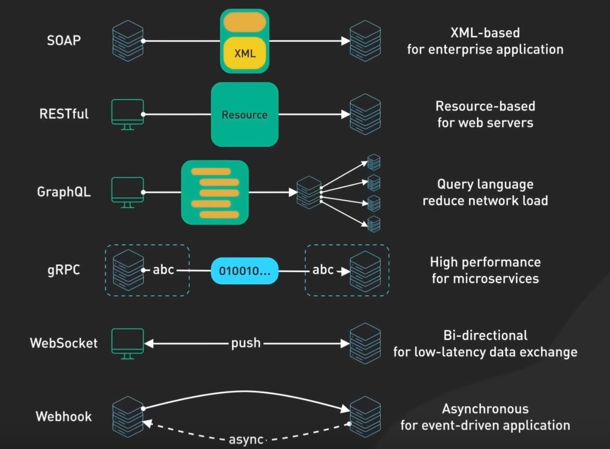

**SOAP**

基于xml文件传输，大量用于金融服务、支付网关，便安全性和可靠性高的场景。

**REST**

轻量级应用程序，使用http协议进行传输的，传输的文本格式主要是json。

**GraphQL**

GraphQL不只是一种架构风格，而且还是查询语言，允许客户端根据需要然后请求特定的数据，服务端需要做更多处理。

**gRPC**

高性能的架构，默认使用协议缓冲区？主要用于服务端之间的通信。

**webSocket**

实时、双向和持久的连接，常用在在低延迟的数据交换中。

