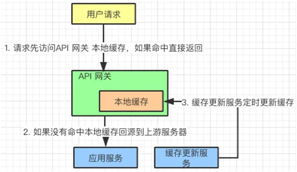
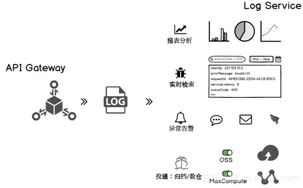

# API网关

网关一词最早出现在网络设备，比如两个相互独立的局域网之间通过路由器通信，中间的路由被称为网关。

任何一个应用系统如果需要被其他系统调用，就需要暴露 API，这些 API 代表着一个一个的功能点。

如果两个系统中间通信，在系统之间加上一个中介者协助 API 的调用，这个中介者就是 API 网关。


当然，API 网关可以放在两个系统之间，同时也可以放在客户端与服务端之间。


以上是API网关的基本定位，下面我们来看看它的作用。

# API网关作用

首先，网关作为系统的唯一入口，也就是说，进入系统的所有请求都需要经过 API 网关。

当系统外部的应用或者客户端访问系统的时候，都会遇到这样的情况：

- 系统要判断它们的权限，例如是否登录用户
- 如果传输协议不一致，需要对协议进行转换，例如http协议和dubbo协议的转换
- 如果调用水平扩展的服务，需要做负载均衡
- 一旦请求流量超出系统承受的范围，需要做限流操作
- 针对每个请求以及回复，系统会记录响应的日志，监控统计调用情况

也就是说，只要是涉及到对系统的请求，并且能够从业务中抽离出来的功能，都有可能在网关上实现。

例如上边的 协议转换，负载均衡，请求路由，流量控制等等。


# API网关服务定位

- 面向web端，以网站和H5为主，前后端分离，业务放在后端，前端负责页面数据展示。

- 面向移动端，和web端类似，需要额外做一些移动设备管理的工作。

- openAPI开放接口，以开放平台形式提供接口给合作伙伴，调用需要授权和条件限制。

- 企业内部可扩展API，给企业内部的其他部门或者项目调用，也可以作为中台输出的一部分，支持其他系统。

  

# API网关架构


API 网关拆分成为 3 个系统：

- **Gateway-Core（核心）**
- **Gateway-Admin（管理）**
- **Gateway-Monitor（监控）**


**Gateway-Core** 核心网关，负责接收客户端请求，调度、加载和执行组件，将请求路由到上游服务端，并处理其返回的结果。

大多数的功能都在这一层完成，例如：验证，鉴权，负载均衡，协议转换，服务路由，数据缓存。如果没有其他两个子系统，它也是可以单独运行的。

**Gateway-Admin** 网关管理界面，可以进行 API、组件等系统基础信息的配置；例如：限流的策略，缓存配置，告警设置。

**Gateway-Monitor** 监控日志、生成各种运维管理报表、自动告警等；管理和监控系统主要是为核心系统服务的，起到支撑的作用。


# API网关涉及的技术原理

上面谈到了网关的架构思路，这里谈几点技术原理。平时我们在使用网关的时候，多注重其实现的功能。例如：路由，负载均衡，限流，缓存，日志，发布等等。

## 协议转换

当web端想直接调用服务端的dubbo接口的时候，就需要进行协议等转换了。不同转换的话往往是先转换成“通用协议”，所谓的通用协议就是两边系统都识别的一种文本组织格式，例如 JSON，xml也可以或者自定义 JSON格式。

dubbo的泛化调用本质上就是接收了一个 JSON 的结构请求体，然后反序列化成接口支持入参进行调用。

## 链式处理

设计模式中有一种责任链模式，它将“处理请求”和“处理步骤”分开。每个处理步骤，只关心这个步骤上需要做的处理操作，处理步骤存在先后顺序。

消息从第一个“处理步骤”流入，从最后一个“处理步骤”流出，每个步骤对经过的消息进行处理，整个过程形成了一个链条。在 API 网关中也用到了类似的模式。


**Zuul 网关过滤器链式处理**

下面以 Zuul 为例，当消息出入网关需要经历一系列的过滤器。这些过滤器之间是有先后顺序的，并且在每个过滤器需要进行的工作也是各不一样：

- **PRE：**前置过滤器，用来处理通用事务，比如鉴权，限流，熔断降级，缓存。并且可以通过 Custom 过滤器进行扩展。
- **ROUTING：**路由过滤器，在这种过滤器中把用户请求发送给 Origin Server。它主要负责：协议转化和路由的工作。
- **POST：**后置过滤器，从 Origin Server 返回的响应信息会经过它，再返回给调用者。在返回的 Response 上加入 Response Header，同时可以做 Response 的统计和日志记录。
- **ERROR：**错误过滤器，当上面三个过滤器发生异常时，错误信息会进到这里，并对错误进行处理。


## 异步请求

所有的请求通过 API 网关访问应用服务，一旦吞吐量上去了，如何高效地处理这些请求？

**拿 Zuul 为例，Zuul1 采用：**一个线程处理一个请求。线程负责接受请求，调用应用获取返回结果，然后对请求完成响应。这个过程中

等待接收请求和等待应用返回响应，都是阻塞状态的。同时，如果多个线程都处在这种状态，会导致系统缓慢。因为每个网关能够开启的线程数量是有限的，特别是在访问的高峰期。


为了解决这个问题，Zuul2 启动了异步请求的机制。每个请求进入网关的时候，会被包装成一个事件，CPU 内核会维持一个监听器，不断轮询“请求事件”。

一旦，发现请求事件，就会调用对应的应用。获取应用返回的信息以后，按照请求的要求把数据/文件放到指定的缓冲区，同时发送一个通知事件，告诉请求端数据已经就绪，可以从这个缓冲获取数据/文件。

这个过程是异步的，请求的线程不用一直等待数据的返回。它在请求完毕以后，就直接返回了，这时它可以做其他的事情。

当请求数据被 CPU 内核获取，并且发送到指定的数据缓冲区时，请求的线程会接到“数据返回”的通知，然后就直接使用数据，不用自己去做取数据的操作。


实现异步处理请求有两种模式，分别是 Reactor 和 Proactor。

详见 [think of Java：Java IO.md](../Java/JavaBase/md/think of Java：Java IO.md)


# API网关实现功能

说起对 API 网关的使用，我们还是对具体功能更加感兴趣。让我们一起来看看它实现了哪些功能。

## 负载均衡

当网关后面挂接同一应用的多个副本时，每次用户的请求都会通过网关的负载均衡算法，路由到对应的服务上面。例如：随机算法，权重算法，Hash 算法等等。

如果上游服务采取微服务的架构，也可以和注册中心合作实现动态的负载均衡。

当微服务动态挂载（动态扩容）的时候，可以通过服务注册中心获取微服务的注册信息，从而实现负载均衡。


## 路由选择

这个不言而喻，网关可以根据请求的 URL 地址解析，知道需要访问的服务。再通过路由表把请求路由到目标服务上去。

有时候因为网络原因，服务可能会暂时的不可用，这个时候我们希望可以再次对服务进行重试。


例如：Zuul 与 Spring Retry 合作完成路由重试。

```
#是否开启重试功能
zuul.retryable=true
#对当前服务的重试次数
ribbon.MaxAutoRetries=2
```


## 流量控制

限流是 API 网关常用的功能之一，当上游服务超出请求承载范围，或者服务因为某种原因无法正常使用，都会导致服务处理能力下滑。

这个时候，API 网关作为“看门人”，就可以限制流入的请求，让应用服务器免受冲击。

限流实际上就是限制流入请求的数量，其算法不少，有令牌桶算法、漏桶算法、计时器限制和连接数限制等。一般通过 Nginx+Lua 来实现。

[限流算法实现](https://www.cnblogs.com/crazymakercircle/p/15187184.html)

[限流算法实现.md](./限流.md)


## 统一鉴权

访问应用服务器的请求都需要拥有一定权限，如果说每访问一个服务都需要验证一次权限，这个对效率是很大的影响。可以把权限认证放到 API 网关来进行。

目前比较常见的做法是，用户通过登录服务获取 Token，把它存放到客户端，在每次请求的时候把这个 Token 放入请求头，一起发送给服务器。

API 网关要做的事情就是解析这个 Token，知道访问者是谁（鉴定），他能做什么/访问什么（权限）。

说白了就是看访问者能够访问哪些 URL，这里根据权限/角色定义一个访问列表。

如果要实现多个系统的 OSS（Single Sign On 单点登录），API 网关需要和 CAS（Central Authentication Service 中心鉴权服务）做连接，来确定请求者的身份和权限。


## 熔断降级

当应用服务出现异常，不能继续提供服务的时候，也就是说应用服务不可用了。作为 API 网关需要做出处理，把请求导入到其他服务上。

或者对服务进行降级处理，例如：用兜底的服务数据返回客户端，或者提示服务暂时不可用。

同时通过服务注册中心，监听存在问题的服务，一旦服务恢复，随即恢复路由请求到该服务。

例如：Zuul 中提供了 ZuulFallbackProvider 接口来实现熔断，它提供两个方法，一个指明熔断拦截的服务 getRoute，一个指定返回内容 ClientHttpResponse。

```
public  interface ZuulFallbackProvider {
   /**
     * The route this fallback will be used  for.
     * @return The route the fallback will be  used for.
     */
    public String getRoute();

    /**
     * Provides a fallback response.
     * @return The fallback response.
     */
    public  ClientHttpResponsefallbackResponse();
}
```

我们通过自定义的 Fallback 方法，并且将其指定给某个 Route 来实现该 Route 访问出问题的熔断处理。

主要继承 ZuulFallbackProvider 接口来实现，ZuulFallbackProvider 默认有两个方法，一个用来指明熔断拦截哪个服务，一个定制返回内容。


## 发布测试

在发布版本的时候会采用：金丝雀发布和蓝绿发布。作为 API 网关可以使用路由选择和流量切换来协助上述行为。这里以金丝雀发布为例，看看 API 网关如何做路由转换的。

假设将 4 个服务从 V1 更新到 V2 版本，这 4 个服务的流量请求由 1 个 API 网关管理。


那么先将一台服务与 API 网关断开，部署 V2 版本的服务，然后 API 网关再将流量导入到 V2 版本的服务上。


这里流量的导入可以是逐步进行的，一旦 V2 版本的服务趋于稳定。再如法炮制，将其他服务替换成 V2 版本。


金丝雀发布一般先发 1 台，或者一个小比例，例如 2% 的服务器，主要做流量验证用，也称为金丝雀（Canary）测试（灰度测试）。

金丝雀测试需要完善的监控设施配合，通过监控指标反馈，观察金丝雀的健康状况，作为后续发布或回滚的依据。

如果金丝测试通过，则把剩余的 V1 版本全部升级为 V2 版本。如果金丝雀测试失败，则直接回退金丝雀，发布失败。


## 缓存数据



我们可以在 API 网关缓存一些修改频率不高的数据。例如：用户信息，配置信息，通过服务定期刷新这个缓存就行了：

- 用户请求先访问 API 网关，如果发现有缓存信息，直接返回给用户。
- 如果没有发现缓存信息，回源到应用服务器获取信息。
- 另外，有一个缓存更新服务，定期把应用服务器中的信息更新到网关本地缓存中。


## 日志记录

通过 API 网关上的过滤器我们可以加入日志服务，记录请求和返回信息。同时可以建立一个管理员的界面去监控这些数据。


日志记录了以后，可以做很多功能扩展。我们整理了以下几点供大家参考：

- **报表分析：**针对服务访问情况，提供可视化展示。
- **实时查询：**了解实时关键信息，例如：吞吐量，并发数。在秒杀活动的时候，会特别关注。
- **异常告警：**针对关键参数进行监控，对于统计结果支持阈值报警，对接阿里云通知中心、短信、钉钉进行告警。
- **日志投递：**将日志进行归档，存放到文件库或者数据仓库中，以便后期分析。





# 流行 API 网关对比

在介绍了 API 网关的功能以后，再来看看目前几个流行的 API 网关项目。看看他们各自的特点，并且把他们做一个简单的比较。这些网关目前都是开源的，大家可以有选择地在项目中使用。

## Kong

[学习资源](https://www.lijiaocn.com/%E9%A1%B9%E7%9B%AE/2018/09/29/nginx-openresty-kong.html)

Kong 是 Mash ape 公司的开源项目，它是一个在 Nginx 中运行的 Lua 应用程序，并且可以通过 Lua-Nginx 模块实现扩展。

> - Nginx 是模块化设计的反向代理软件，C语言开发；
>
> - OpenResty 是以 Nginx 为核心的 Web 开发平台，可以解析执行 Lua 脚本
>
> - Kong 是 OpenResty 的一个应用，是一个 API 网关，具有API管理和请求代理的功能。
>
>   [参考链接](https://erdong.site/Kong/kong-04.html)

所以可以通过插件集合的方式定制功能，例如：HTTP 基本认证、密钥认证、CORS（Cross-origin Resource Sharing，跨域资源共享）、TCP、UDP、日志、API 限流、请求转发以及监控，都是目前已有的插件。

由于是基于 Nginx 的，所以可以对网关进行水平扩展，来应对大批量的网络请求。


Kong 主要有三个组件：

- **KongServer ：**基于 Nginx 的服务器，用来接收 API 请求。
- **ApacheCassandra/PostgreSQL：**用来存储操作数据。
- **Kongdashboard：**UI 管理工具。

## Zuul


Zuul 是 Spring Cloud 全家桶中的微服务 API 网关。所有从设备或网站来的请求都会经过 Zuul 到达后端的 Netflix 应用程序。

作为一个边界性质的应用程序，Zuul 提供了动态路由、监控、弹性负载和安全功能。包括 Zuul1 和 Zuul2 两个版本。


## Apache APISIX

https://apisix.apache.org/zh/docs/apisix/getting-started/README/


介绍了几个开源 API 网关的基本信息以后，我们从几个维度对他们进行比较：


