# 分布式

## CAP

>C（一致性Consistence）：指数据在多个副本之间能够保持一致的特性（严格的一致性）。
>
>A（可用性Availability）：指系统提供的服务必须一直处于可用的状态，每次请求都能获取到非错的响应——但是不保证获取的数据为最新数据。
>
>P（分区容错Network partitioning）：分布式系统在遇到任何网络分区故障的时候，仍然能够对外提供满足一致性和可用性的服务，除非整个网络环境都发生了故障。
>
>CAP的出现仿佛是一盏明灯，它揭露了分布式系统的本质，并给出了设计的准则，而这正是1985年以来人们正在寻找的东西！所以CAP在当时的影响力是非常大的！
>
>高可用、数据一致是很多系统设计的目标，CAP只能3选2组合如下：
>
>CA 满足一致性和可用性，放弃分区容错。其实就是一个单服务。
>
>CP 满足一致性和分区容错性，也就是说，要放弃可用。当系统被分区，为了保证一致性，必须放弃可用性，让服务停用。
>
>AP 满足可用性和分区容错性，当出现分区，同时为了保证可用性，必须让节点继续对外服务，这样必然导致失去一致性。

## BASE

>Basically Available（基本可用）：假设系统，出现了不可预知的故障，但还是能用，相比较正常的系统而言，响应时间上的损失或功能上的损失
>
>Soft State（软状态）：允许系统中的数据存在中间状态，并认为该状态不影响系统的整体可用性，即允许系统在多个不同节点的数据副本存在数据延时。
>
>Eventually Consistent（最终一致性）：最终一致性强调的是系统中所有的数据副本，在经过一段时间的同步后，最终能够达到一个一致的状态。因此，最终一致性的本质是需要系统保证最终数据能够达到一致，而不需要实时保证系统数据的强一致性。
>
>BASE理论面向的是大型高可用、可扩展的分布式系统。与传统ACID特性相反，不同于ACID的强一致性模型，BASE提出通过牺牲强一致性来获得可用性，并允许数据段时间内的不一致，但是最终达到一致状态。同时，在实际分布式场景中，不同业务对数据的一致性要求不一样。
>
>**BASE 理论中5种最终一致性：**
>
>因果一致性（Causal consistency）
>
>因果一致性指的是：如果节点A在更新完某个数据后通知了节点B，那么节点B之后对该数据的访问和修改都是基于A更新后的值。于此同时，和节点A无因果关系的节点C的数据访问则没有这样的限制。
>
>读己之所写（Read your writes）
>
>读己之所写指的是：节点A更新一个数据后，它自身总是能访问到自身更新过的最新值，而不会看到旧值。其实也算一种因果一致性。
>
>会话一致性（Session consistency）
>
>会话一致性将对系统数据的访问过程框定在了一个会话当中：系统能保证在同一个有效的会话中实现 “读己之所写” 的一致性，也就是说，执行更新操作之后，客户端能够在同一个会话中始终读取到该数据项的最新值。
>
>单调读一致性（Monotonic read consistency）
>
>单调读一致性指的是：如果一个节点从系统中读取出一个数据项的某个值后，那么系统对于该节点后续的任何数据访问都不应该返回更旧的值。
>
>单调写一致性（Monotonic write consistency）
>
>单调写一致性指的是：一个系统要能够保证来自同一个节点的写操作被顺序的执行。

## Quorum WARO

## ZK选举

## ZK会话

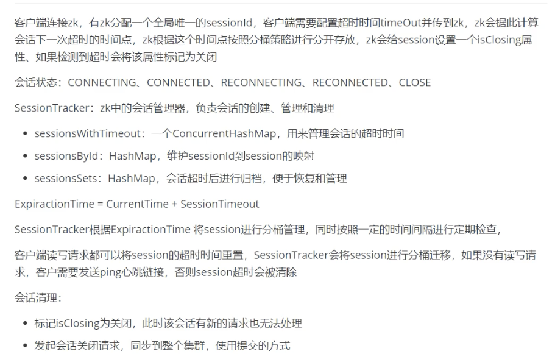

## ZK数据节点

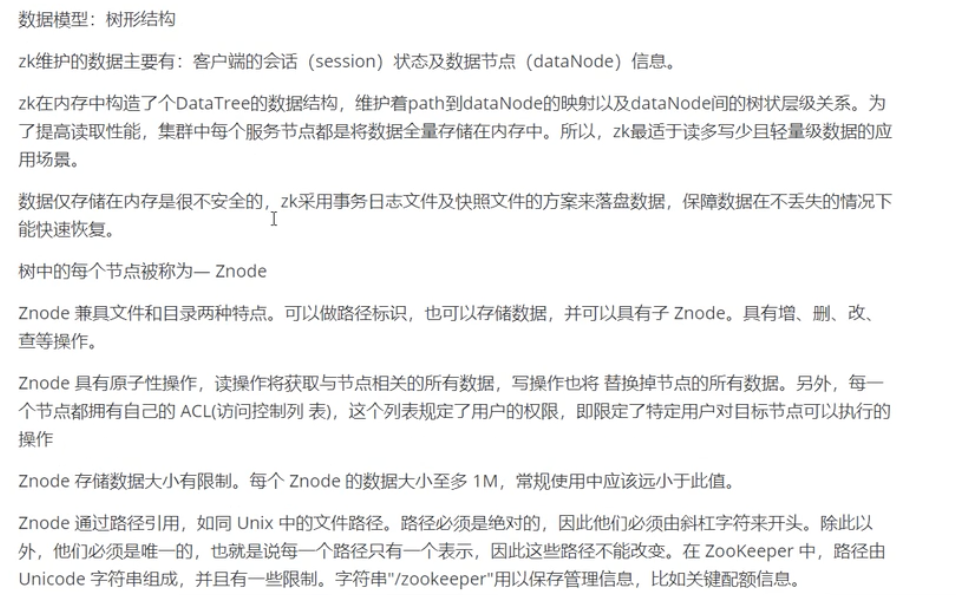

## ZK 数据同步

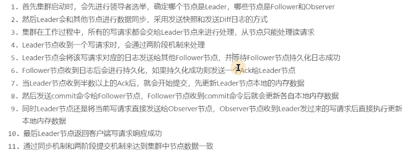

初始化 全量同步

## ZK EUREKA区别

## 两阶段 三阶段

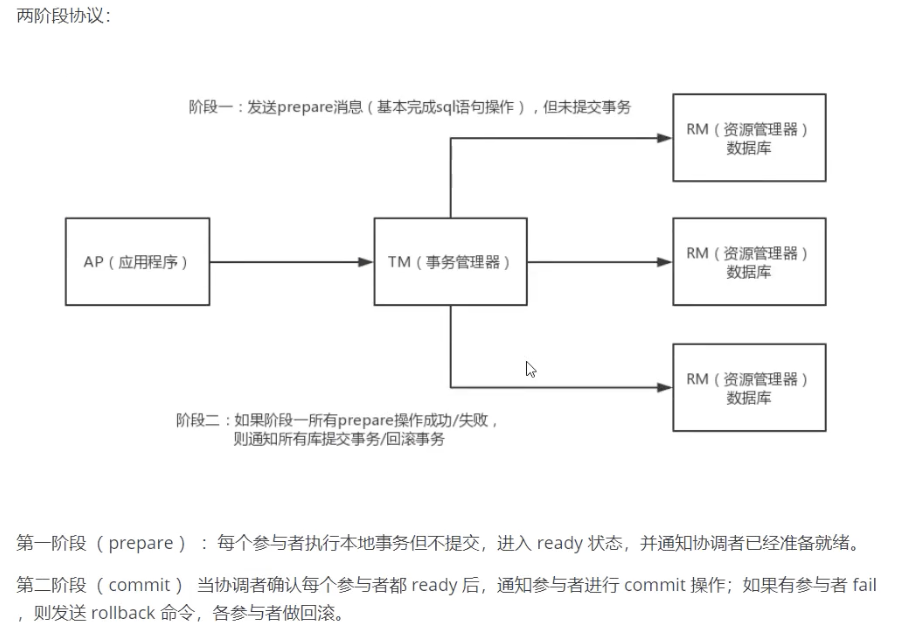

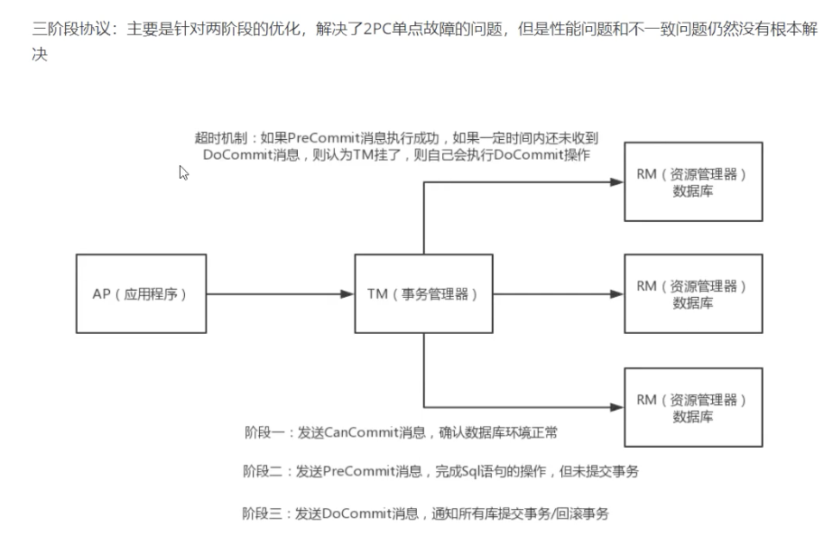

 ### 分布式寻址

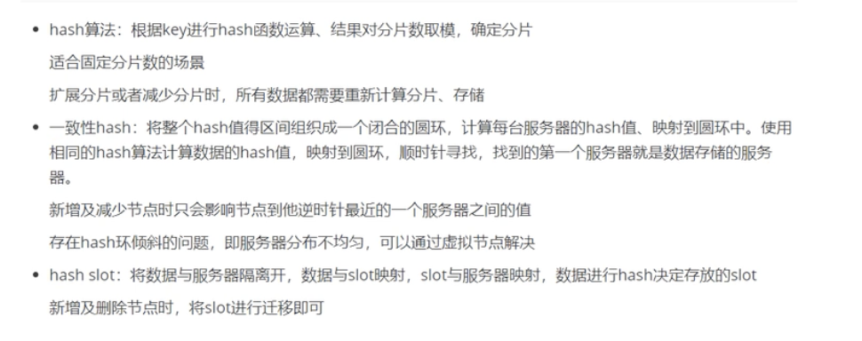

## 分布式系统设计目标

## 集群 分布 SOA 微服务

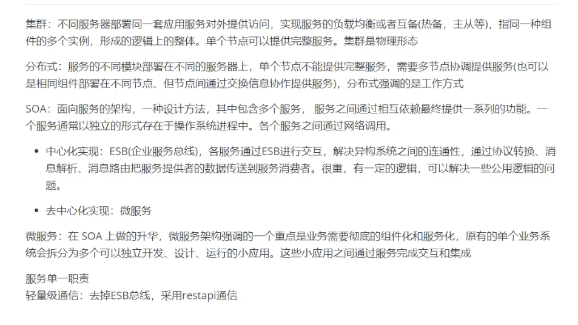

## SPI

服务发现机制

通过类的权限定名找到指定目录下对应的文件 获取具体实现类然后加载即可

## paxos

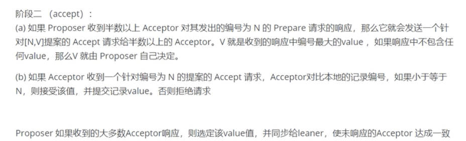

## rarf

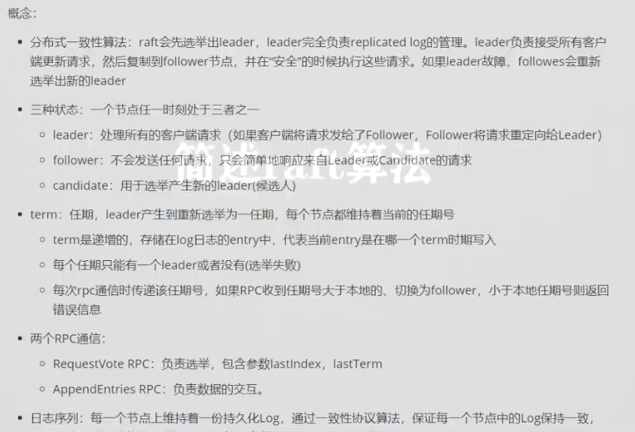

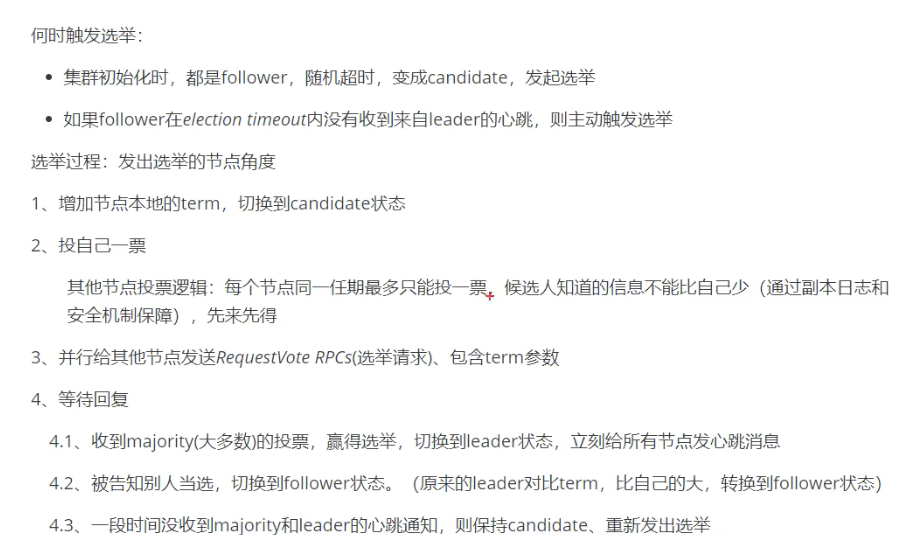

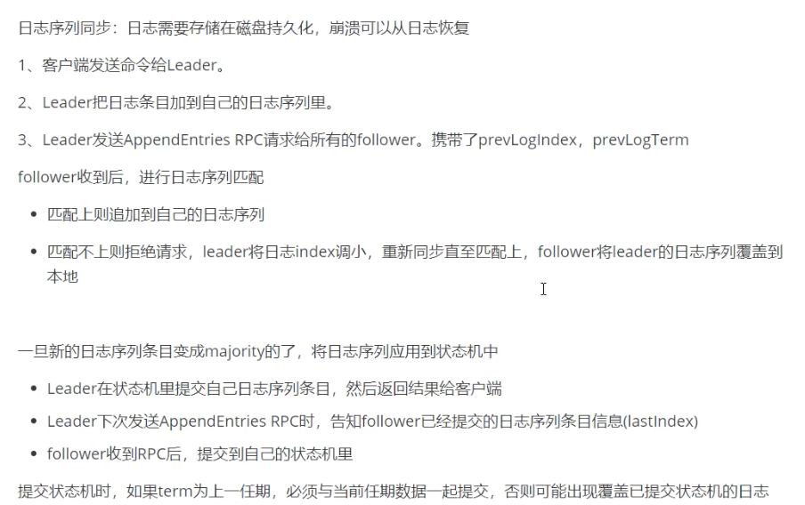

## TCC 补偿性

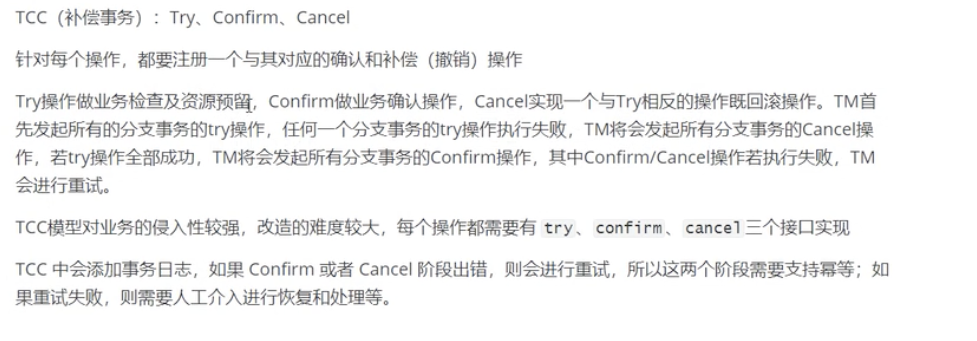

## ZAB

## Zk 命名服务

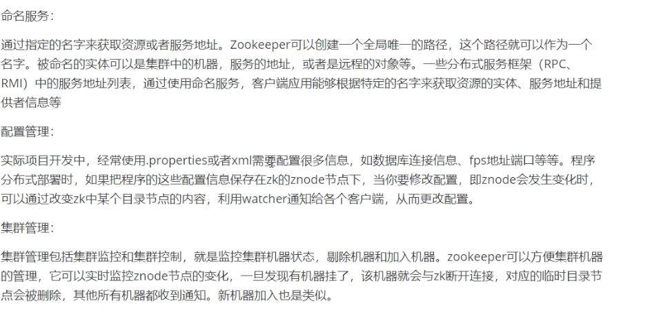

ZK 数据模型

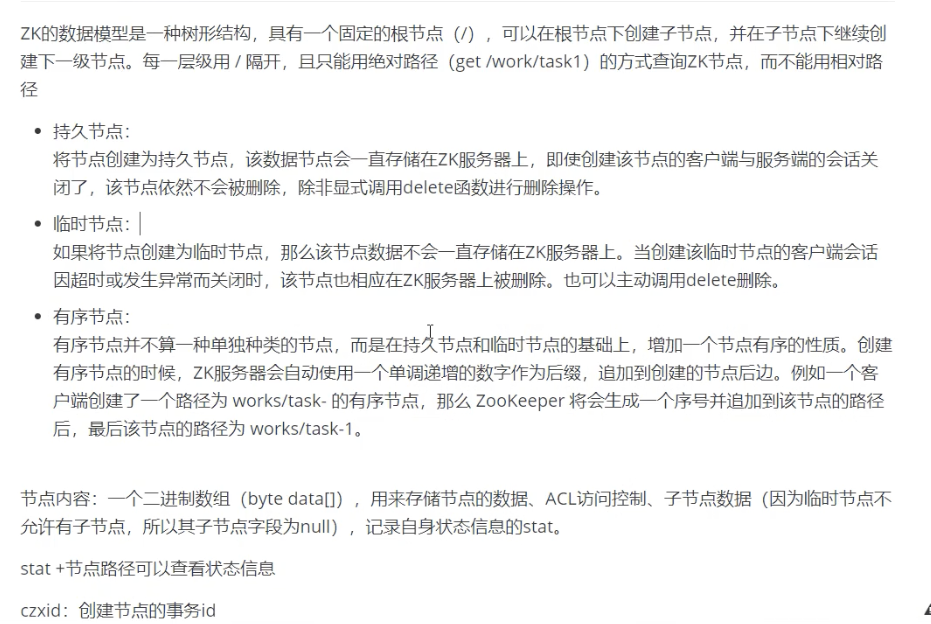

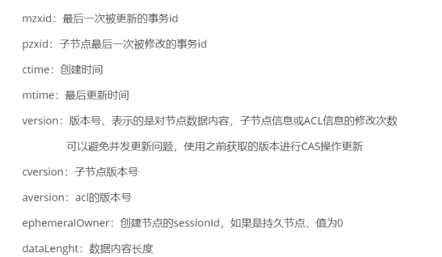

## ZK的观察者模式

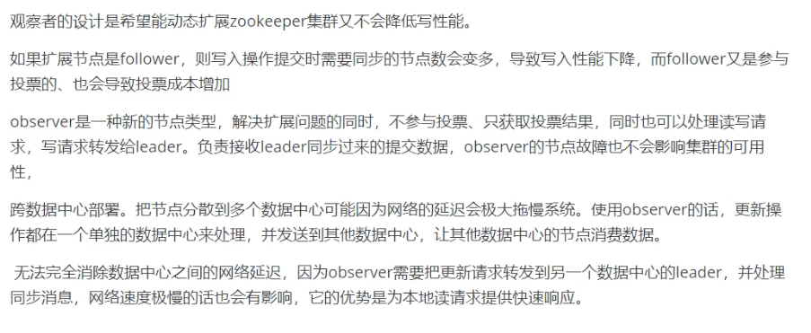

## RPC PMI

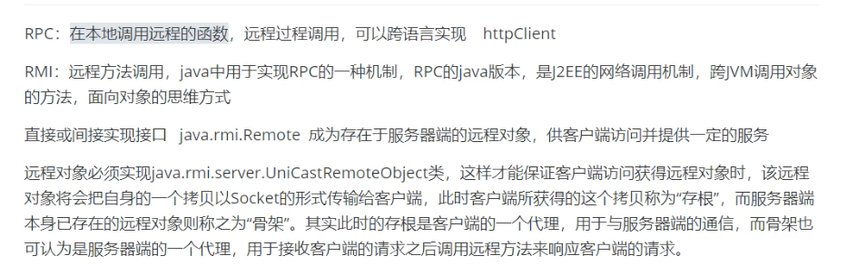

## ZK watch机制

## DUBBO

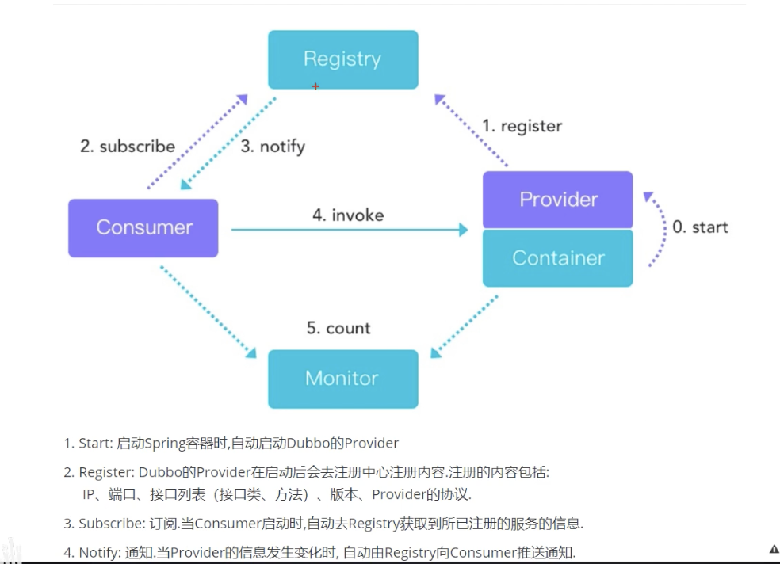

## ZK 事务

## RPC

## 幂等性

## SPI

## AP和CP

注册中心更适合用AP，因为注册中心如果不保证C的话，会出现的后果，就是可能有微服务上线，有些微服务去读某个注册中心实例的时候可以读到新注册的服务，有些微服务去读还没更新好的注册中心可能读不到新注册的服务，这个不会有影响。如果是某个服务下线，同理，有些服务感知到了服务下线，有些感知不到，感知不到的话会导致请求失败。而请求失败我们可以用熔断+降级+重试来进行解决。同时注册中心需要能扛住高并发，也就是能服务于各个服务来抓注册表，心跳等等，也就是说微服务越多，要接受的qps越多，所以qps还是非常高的，而如果用了CP，必然无法扛住这么高的请求。综上，注册中心更适合用AP。

cap  zk是cp  nacos是ap 两者哪个更适合做注册中心 我们大部分是可以短暂容忍不一致性，只要达到最终一致性即可，但是金融方面则需要去保证它的强一致性，哪怕是牺牲它的可用性。

