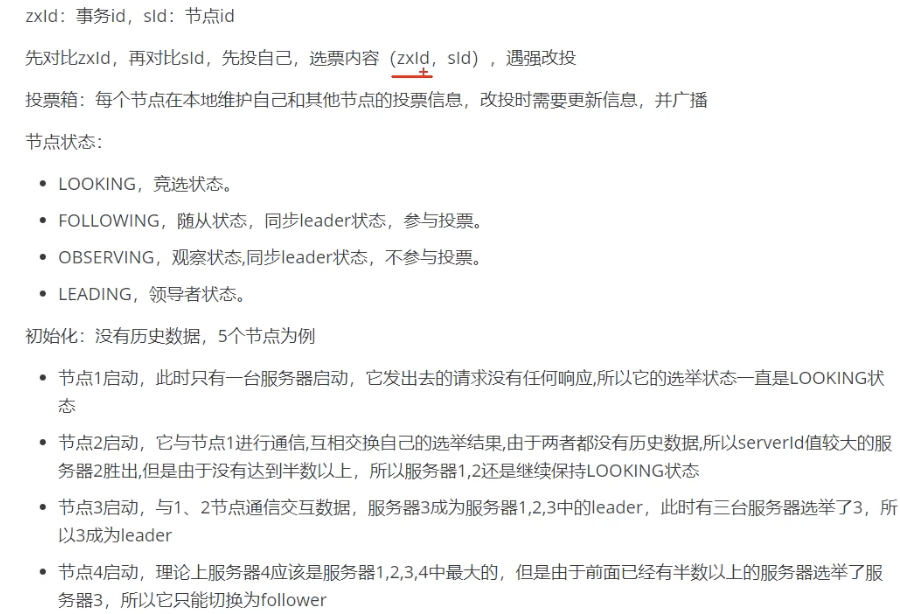
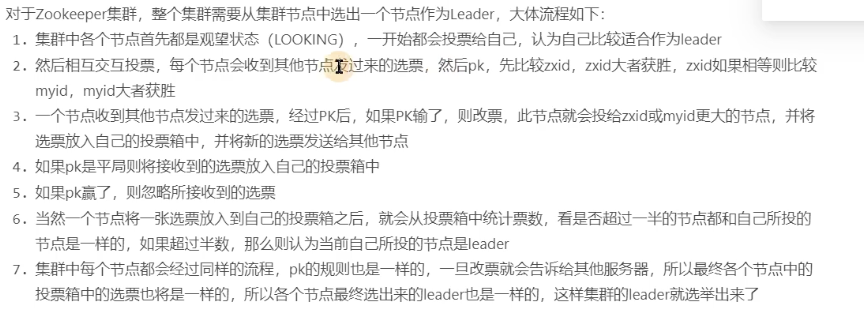
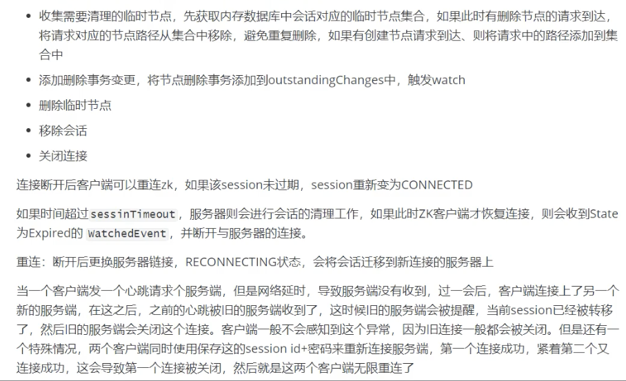
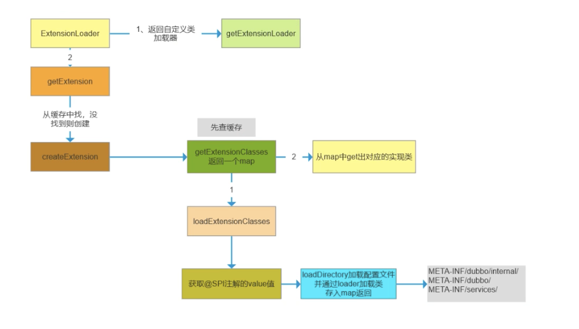
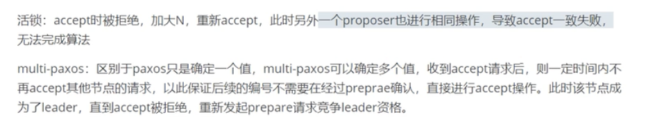
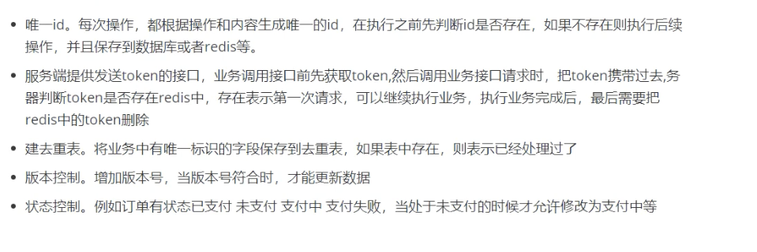

# 分布式

商品多节点部署是集群  商品订单拆分是分布式

把一套业务流程拆分成子步骤

每个节点完成一部分子步骤

多节点协同共同完成一个大的任务

base理论是基于cap演化而来的一个妥协版本 基本可用（通过消峰异步降级等方式保证核心链路可用） 软状态（出现中间状态 即数据副本可以短暂部分不一致） 最终一致性（通过mq重试或者人工对账 确保数据最终是一致的）

事务是指一组操作全部成功或者全部失败，保证事务的ACID A原子性 C一致性 I隔离性 D持久性 分布式事务是在分布式的场景由多个分布式组件完成的一个事务操作 普通是事务是面向单个数据库连接的，而分布式事务面对的是多个数据库的连接，需要这些事务一起成功 或者一起失败

## ACID

https://www.cnblogs.com/zhoujinyi/p/3437475.HTML

事务控制
    事务：逻辑上的一组操作，要么一起完成要么一起不完成
    start transaction;	开启事务，这条语句之后的sql语句处于同一事务中，并不立即影响数据库
    commit;	提交事务， 事务中的sql语句对数据库起作用
    rollback;	回滚事务，取消这个事务，这个事务不会对数据库产生影响
    

    start transaction;
    update [table] set money=money-100 where name='a';
    update [table] set money=money+100 where name='b';
    commit;/rollback;  提交或回滚

原子性
    事务是一组不可分割的单位，要么同时成功要么同时不成功
    事务的原子性是指事务必须是一个原子的操作序列单元。事务中包含的各项操作在一次执行过程中，要么全部执行，要么全部不执行。
    任何一项操作失败都将导致整个事务失败，同时其他已经被执行的操作都将被撤销并回滚。只有所有的操作全部成功，整个事务才算是成功完成。
一致性
    事务前后的数据完整性应该保持一致（数据库的完整性：如果数据库在某个时间点下，所有的数据都符合所有的约束，则称数据库符合完整性）
    事务的一致性是指事务的执行不能破坏数据库数据的完整性和一致性，一个事务在执行前后，数据库都必须处于一致性状态。换句话说，事务的执行结果必须是使数据库从一个一致性状态转变到另一个一致性状态。
    银行的转账操作就是一个事务。假设A和B原来账户都有100元。此时A转账给B50元，转账结束后，应该是A账户减去50元变成50元，B账户增加50元变成150元。A、B的账户总和还是200元。转账前后，数据库就是从一个一致性状态（A100元，B100元，A、B共200元）转变到另一个一致性状态（A50元，B150元，A、B共200元）。假设转账结束后只扣了A账户，没有增加B账户，这时数据库就处于不一致的状态。
隔离性
    多个用户并发访问数据库时，一个事务不能被其他事务所干扰，多个并发的事务之间的数据要互相隔离
    事务的隔离性是指在并发环境中，并发的事务是相互隔离的，事务之间互不干扰。
    在标准的SQL规范中，定义的4个事务隔离级别，不同隔离级别对事务的处理不同。4个隔离级别分别是：未授权读取、授权读取、可重复读取和串行化。
    不同隔离级别下事务访问数据的差异
    读未提交	A读到B未提交的事务 脏读
    都已提交    A的事务处理时间较长，先读到数据为a，中间B事务将数据修改为b，A在事务结束前再次读发现数据已经变成b了 不可重复读
    可重复读    A的事务中对当前查询到的数据添加行级锁，使B在A提交前无法修改A查到的数据，但是B可以在事务中对该表添加数据，所以A再次查询的时候数据虽然被修改，但是变多了   幻读    
    串行化      是最高的事务隔离级别，同时代价也花费最高，性能很低，一般很少使用，在该级别下，事务顺序执行，不仅可以避免脏读、不可重复读，还避免了幻像读。
    以上4个级别的隔离性依次增强，分别解决不同的问题。事务隔离级别越高，就越能保证数据的完整性和一致性，但同时对并发性能的影响也越大。
	

    隔离性：
    	本质就是多个线程操作一个资源造成的多线程并发安全问题，加锁可以保证隔离性，但会造成数据库性能下降
    	
    	两个事务并发修改：必须隔离
    	两个事务并发查询：不用隔离
    
    	一个修改，一个查询：
    
    	  脏读：一个事务读取到另一个事务未提交的数据
    	   -------
    	   a  1000
    	   b  1000
    	   -------
    		a: 
    		start transaction;
    		update account set money = money-100 where name ='a';
    		update account set money = money+100 where name ='b';
    		------
    			b:
    			start transaction;
    			select * from account;
    				------
    				a 900
    				b 1100
    				-------
    			commit;
    		a:
    		rollback;
    	 
    	  不可重复读：一个事务多次读取同一条记录，读取的结果不相同(一个事务读取到另一个事务已经提交的数据)
    	   -----------------
    	   a  1000 1000 1000
    	   -----------------
    	   b:
    		start transaction;
    		select 活期 from account where name ='a';
    		select 定期 from account where name ='a';
    		select 固定 from account where name ='a';
    		-------
    		a：
    			start transaction;
    			update account set 活期=活期-1000 where name='a';
    	   		comit;
    		------- 
    	   select 活期+定期+固定 from account where name = 'a';
    	   commit;
    
    	  虚读(幻读)问题:一个事务多次查询整表达数据，由于其他事务的update，导致多次查询记录条数不同	
    
    四大隔离级别  不同的隔离级别防止不同的问题
        read uncommitted 不做隔离，具有脏读，不可重复读，虚读问题
        read committed 可以防止脏读 ，不能防止不可重复读，虚读问题
        repeatable read 可以防止脏读，不可重复读，不能防止虚读问题
        serializable 数据库运行在串行化未实现，所有都没问题，但是性能比较低 

    通常，对于绝大多数的应用来说，可以优先考虑将数据库系统的隔离级别设置为授权读取，这能够在避免脏读的同时保证较好的并发性能。尽管这种事务隔离级别会导致不可重复读、幻读和第二类丢失更新等并发问题，但较为科学的做法是在可能出现这类问题的个别场合中，由应用程序主动采用悲观锁或乐观锁来进行事务控制。

持久性
    事务一旦被提交，则对数据库中的改变就是永久的，不可逆。
    事务的持久性又称为永久性，是指一个事务一旦提交，对数据库中对应数据的状态变更就应该是永久性的。即使发生系统崩溃或机器宕机等故障，只要数据库能够重新启动，那么一定能够将其恢复到事务成功结束时的状态。

## CAP

一致性(Consistency)
向分布式系统给发送请求,一定返回最新的数据

可用性(Availablity)
向分布式系统写、读等请求的时候，一定会得到合理的响应，这个响应不应该是错误也不应该是请求超时

网络分区容忍性(Partition tolerance)
分布式系统中，当部分节点无法互通出现网络分区现象，但是整个系统还是可以对外提供服务

一致性（C）：在分布式系统中的所有数据备份，在同一时刻是否同样的值。（等同于所有节点访问同一份最新的数据副本）

可用性（A）：在集群中一部分节点故障后，集群整体是否还能响应客户端的读写请求。（对数据更新具备高可用性）

分区容忍性（P）：以实际效果而言，分区相当于对通信的时限要求。系统如果不能在时限内达成数据一致性，就意味着发生了分区的情况，必须就当前操作在C和A之间做出选择。

C 一致性：分布式环境中，一致性是指多个副本之间，在同一时刻能否有同样的值

A 可用性：系统提供的服务必须一直处于可用的状态。即使集群中一部分节点故障。

P 分区容错性：系统在遇到节点故障，或者网络分区时，任然能对外提供一致性和可用性的服务。以实际效果而言，分区相当于通信的时限要求。系统如果不能在一定实现内达成数据一致性，也就意味着发生了分区的情况。必须就当前操作在 C 和 A 之前作出选择

CAP	说明
放弃P	如果希望能够避免系统出现分区容错性问题，一种较为简单的做法是将所有的数据（或者仅仅是哪些与事务相关的数据）都放在一个分布式节点上。这样做虽然无法100%保证系统不会出错，但至少不会碰到由于网络分区带来的负面影响。但同时需要注意的是，放弃P的同时也就意味着放弃了系统的可扩展性
放弃A	一旦系统遇到网络分区或其他故障或为了保证一致性时，放弃可用性，那么受到影响的服务需要等待一定的时间，因此在等待期间系统无法对外提供正常的服务，即不可用
放弃C	这里所说的放弃一致性，实际上指的是放弃数据的强一致性，而保留数据的最终一致性。这样的系统无法保证数据保持实时的一致性，但是能够承诺的是，数据最终会达到一个一致的状态。
需要明确的一点是：对于一个分布式系统而言，分区容错性可以说是一个最基本的要求。因为既然是一个分布式系统，那么分布式系统中的组件必然需要被部署到不同的节点，否则也就无所谓的分布式系统了，因此必然出现子网络。而对于分布式系统而言，网络问题又是一个必定会出现的异常情况，因此分区容错性也就成为了一个分布式系统必然需要面对和解决的问题。因此系统架构师往往需要把精力花在如何根据业务特点在C（一致性）和A（可用性）之间寻求平衡。

## BASE理论

BASE是Basically Available(基本可用）、Soft state(软状态）和Eventually consistent(最终一致性）三个短语的简写。BASE是对CAP中一致性和可用性权衡的结果，其来源于对大规模互联网系统分布式实践的总结，是基于CAP定理逐步演化而来的，其核心思想是即使无法做到强一致性，但每个应用都可以根据自身的业务特点，采用适当的方法来使系统达到最终一致性。接下来，我们着重对BASE中的三要素进行讲解。

基本可用
    基本可用是指分布式系统在出现不可预知故障的时候，允许损失部分可用性——但请注意，这绝不等价于系统不可用。一下就是两个"基本可用"的例子。

    响应时间上的损失：正常情况下，一个在线搜索引擎需要在0.5秒之内返回给用户相应的查询结果，但由于出现故障（比如系统部分机房发生断电或断网故障），查询结果的响应时间增加到了1~2秒。
    
    功能上的损失：正常情况下，在一个电子商务网站（比如淘宝）上购物，消费者几乎能够顺利地完成每一笔订单。但在一些节日大促购物高峰的时候（比如双十一、双十二），由于消费者的购物行为激增，为了保护系统的稳定性（或者保证一致性），部分消费者可能会被引导到一个降级页面，如下：

软状态
    统中的数据存在中间状态，并认为该中间状态的存在不会影响系统的整体可用性，即允许系统在不同的数据副本之间进行数据同步的过程存在延时。

最终一致性
    最终一致性强调的是系统中所有的数据副本，在经过一段时间的同步后，最终能够达到一个一致的状态。因此，最终一致性的本质是需要系统保证最终数据能够达到一致，而不需要实时保证系统数据的强一致性。
    最终一致性是一种特殊的弱一致性：系统能够保证在没有其他新的更新操作的情况下，数据最终一定能够达到一致的状态，因此所有客户端对系统的数据访问都能够获取到最新的值。同时，在没有发生故障的前提下，数据到达一致状态的时间延迟，取决于网络延迟、系统负载和数据复制方案设计等因素。

## CAP

>C（一致性Consistence）：指数据在多个副本之间能够保持一致的特性（严格的一致性）。
>
>A（可用性Availability）：指系统提供的服务必须一直处于可用的状态，每次请求都能获取到非错的响应——但是不保证获取的数据为最新数据。
>
>P（分区容错Network partitioning）：分布式系统在遇到任何网络分区故障的时候，仍然能够对外提供满足一致性和可用性的服务，除非整个网络环境都发生了故障。
>
>CAP的出现仿佛是一盏明灯，它揭露了分布式系统的本质，并给出了设计的准则，而这正是1985年以来人们正在寻找的东西！所以CAP在当时的影响力是非常大的！
>
>高可用、数据一致是很多系统设计的目标，CAP只能3选2组合如下：
>
>CA 满足一致性和可用性，放弃分区容错。其实就是一个单服务。
>
>CP 满足一致性和分区容错性，也就是说，要放弃可用。当系统被分区，为了保证一致性，必须放弃可用性，让服务停用。
>
>AP 满足可用性和分区容错性，当出现分区，同时为了保证可用性，必须让节点继续对外服务，这样必然导致失去一致性。

## BASE

>Basically Available（基本可用）：假设系统，出现了不可预知的故障，但还是能用，相比较正常的系统而言，响应时间上的损失或功能上的损失
>
>Soft State（软状态）：允许系统中的数据存在中间状态，并认为该状态不影响系统的整体可用性，即允许系统在多个不同节点的数据副本存在数据延时。
>
>Eventually Consistent（最终一致性）：最终一致性强调的是系统中所有的数据副本，在经过一段时间的同步后，最终能够达到一个一致的状态。因此，最终一致性的本质是需要系统保证最终数据能够达到一致，而不需要实时保证系统数据的强一致性。
>
>BASE理论面向的是大型高可用、可扩展的分布式系统。与传统ACID特性相反，不同于ACID的强一致性模型，BASE提出通过牺牲强一致性来获得可用性，并允许数据段时间内的不一致，但是最终达到一致状态。同时，在实际分布式场景中，不同业务对数据的一致性要求不一样。
>
>**BASE 理论中5种最终一致性：**
>
>因果一致性（Causal consistency）
>
>因果一致性指的是：如果节点A在更新完某个数据后通知了节点B，那么节点B之后对该数据的访问和修改都是基于A更新后的值。于此同时，和节点A无因果关系的节点C的数据访问则没有这样的限制。
>
>读己之所写（Read your writes）
>
>读己之所写指的是：节点A更新一个数据后，它自身总是能访问到自身更新过的最新值，而不会看到旧值。其实也算一种因果一致性。
>
>会话一致性（Session consistency）
>
>会话一致性将对系统数据的访问过程框定在了一个会话当中：系统能保证在同一个有效的会话中实现 “读己之所写” 的一致性，也就是说，执行更新操作之后，客户端能够在同一个会话中始终读取到该数据项的最新值。
>
>单调读一致性（Monotonic read consistency）
>
>单调读一致性指的是：如果一个节点从系统中读取出一个数据项的某个值后，那么系统对于该节点后续的任何数据访问都不应该返回更旧的值。
>
>单调写一致性（Monotonic write consistency）
>
>单调写一致性指的是：一个系统要能够保证来自同一个节点的写操作被顺序的执行。

## Quorum WARO

## ZK选举

## ZK会话

## ZK数据节点

## ZK 数据同步

初始化 全量同步

## ZK EUREKA区别

## 两阶段 三阶段

 ### 分布式寻址

## 分布式系统设计目标

## 集群 分布 SOA 微服务

## SPI

服务发现机制

通过类的权限定名找到指定目录下对应的文件 获取具体实现类然后加载即可

## paxos

## rarf

## TCC 补偿性

## ZAB

## Zk 命名服务

ZK 数据模型

## ZK的观察者模式

## RPC PMI

## ZK watch机制

## DUBBO

## ZK 事务

## RPC

## 幂等性

## SPI

## AP和CP

注册中心更适合用AP，因为注册中心如果不保证C的话，会出现的后果，就是可能有微服务上线，有些微服务去读某个注册中心实例的时候可以读到新注册的服务，有些微服务去读还没更新好的注册中心可能读不到新注册的服务，这个不会有影响。如果是某个服务下线，同理，有些服务感知到了服务下线，有些感知不到，感知不到的话会导致请求失败。而请求失败我们可以用熔断+降级+重试来进行解决。同时注册中心需要能扛住高并发，也就是能服务于各个服务来抓注册表，心跳等等，也就是说微服务越多，要接受的qps越多，所以qps还是非常高的，而如果用了CP，必然无法扛住这么高的请求。综上，注册中心更适合用AP。

cap  zk是cp  nacos是ap 两者哪个更适合做注册中心 我们大部分是可以短暂容忍不一致性，只要达到最终一致性即可，但是金融方面则需要去保证它的强一致性，哪怕是牺牲它的可用性。

