# HTTP概要

### 浏览器发起HTTP请求的典型场景

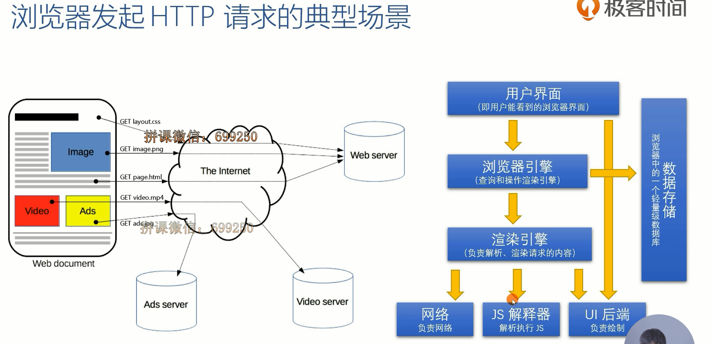

大致流程：

1. 用户通过浏览器输入框输入URL，交由浏览器引擎进行后续处理
2. 浏览器引擎会从其内部存储（浏览器的轻量级数据库）中查找是否有相关资源，没有则会去相关站点请求资源
3. 请求资源并渲染展示给用户是由渲染引擎完成的，通过网络请求到相关资源如html、css、Js、图片。Js解释器同时也会解释执行html中的相关Js代码，最后交由UI后端将完整的页面绘制到用户界面中

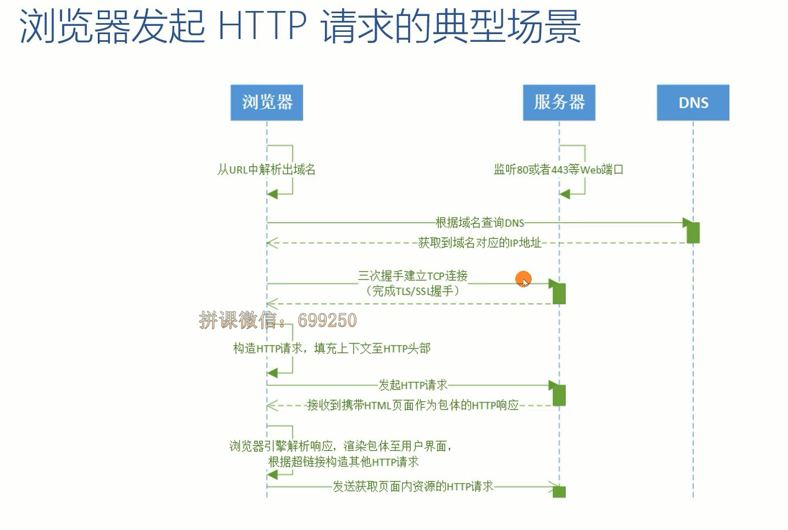

### Hypertext Transfer Protocol（HTTP）协议

一种无状态的、应用层、以请求/应答方式运行的协议，它使用可扩展的语义和自描述消息格式，与

基于网络的超文本信息系统灵活的互动。

- 无状态：前一个请求与后一个请求没有关联，后一个请求无法使用前一个请求的信息。
- 请求/应答方式：是基于连接的工作方式，从客户端发起一个请求，由服务端给出响应。
- 可扩展： 新版本的协议兼容老版本。
- 自描述消息格式：通过请求url可以知道请求的文件格式

### HTTP 协议格式

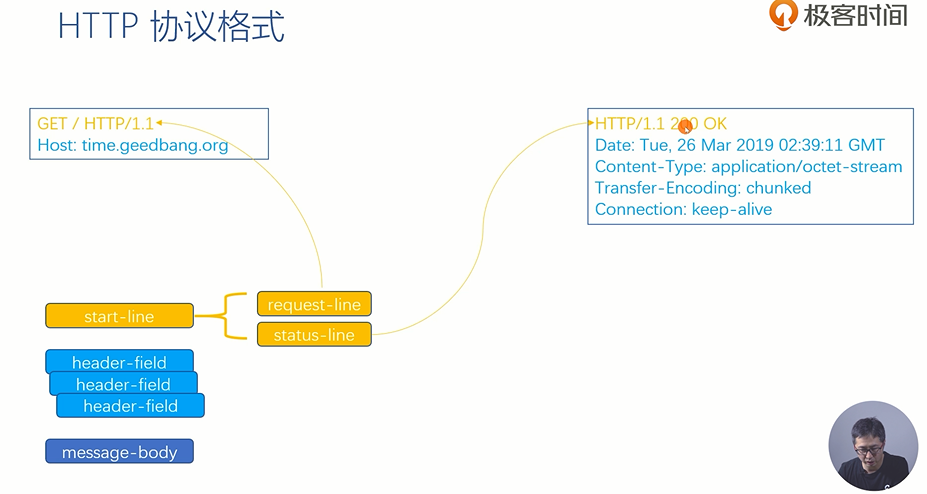

### ABNF（扩充巴科斯-瑙尔范式）操作符

类似于正则表达式，可以规范定义HTTP协议。

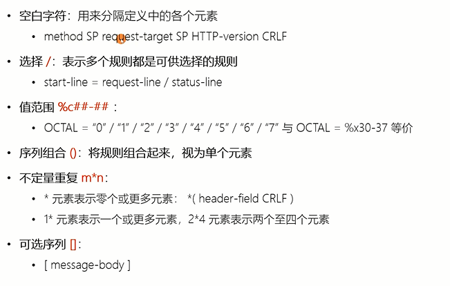

### ABNF（扩充巴科斯-瑙尔范式）核心规则

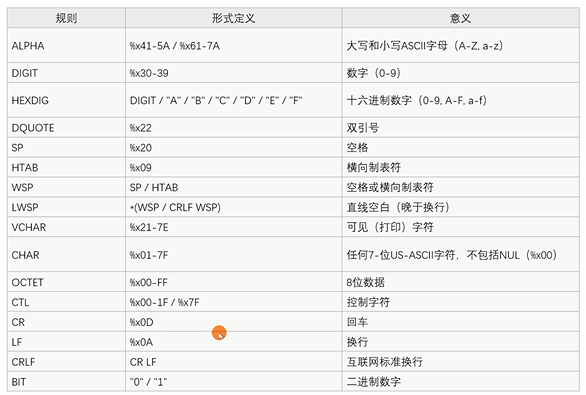

### 基于ABNF描述的HTTP协议格式

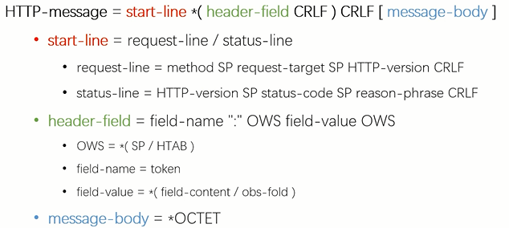

# Chrome Network 面板抓包

## Network 面板

- 控制器：控制面板的外观与功能

- 过滤器：过滤请求列表中显示的资源

  按住Command (Mac)或Ctrl (Window / Linux) ，然后点击过滤器可以同时选择多个过滤器

- 概览：显示HTTP请求、响应的时间轴

- 请求列表：默认时间排序，可选择显示列

- 概要：请求总数、总数据量、总花费时间等

## 控制器

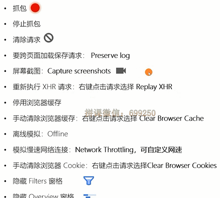

## 过滤器：按类型

- XHR、 JS， CSS、 Img，Media， Font， Doc， WS (WebSocket)、 Manifest或Other(此处未列出的任何其他类型)
- 多类型，按住Command (Mac)或Ctrl (Windows， Linux)
- 按时间过滤：概览面板，拖动滚动条
- 隐藏Data URLS： CSS图片等小以BASE64格入HTML，以减少HTTP请求数

## 过滤器：属性过滤（一）

​	**多属性间通过空格实现AND操作**

- domain：仅显示来自指定域的资源。您可以使用通配符字符(*)纳入多个域
- has-response-header：显示包含指定HTTP响应标头的资源
- is：使用is：running可以查找WebSocket资源， is：from-cache可查找缓存读出的资源
- larger-than：显示大于指定大小的资源(以字节为单位)。将值设为1000等同于设置为1k
- method：显示通过指定HTTP方法类型检索的资源
- mime-type：显示指定MIME类型的资源
- mixed-content：显示所有混合内容资源(mixed-content：all)，或者仅显示当前显示的资源(mixed-content：displayed)
- scheme：显示通过未保护HTTP (scheme：http)或受保护HTTPS (scheme：https)检索的资源。
- set-cookie-domain：显示具有Set-Cookie标头并且Domain属性与指定值匹配的资源。
- set-cookie-name：显示具有Set-Cookie标头并且名称与指定值匹配的资源。
- set-cookie-value：显示具有Set-Cookie标头并且值与指定值匹配的资源。
- status-code：仅显示HTTP状态代码与指定代码匹配的资源。

## 请求列表的排序

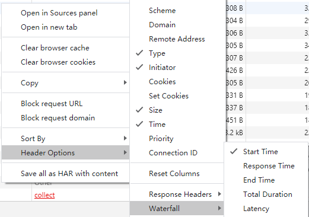

- 时间排序，默认
- 按列排序
- 按活动时间排序
  - Start Time：发出的第一个请求位于顶部
  - Response Time：开始下载的第一个请求位于顶部
  - End Time：完成的第一个请求位于顶部
  - Total Duration：连接设置时间和请求/响应时间最短的请求位于顶部
  - Latency：等待最短响应时间的请求位于顶部

## 请求列表

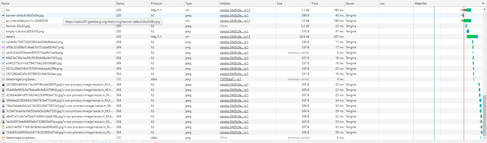

Name ：资源的名称Status： HTTP状态代码pe：请求的资源的MIME类型

Initiator：发起请求的对象或进程。它可能有以下几种值：

- Parser (解析器) ： Chrome的HTML解析器发起了请求鼠标悬停显示JS脚本
- Redirect (重定向) SHTTP重定向启动了请求
- Script (脚本) ：脚本启动了请求
-  Other (其他) ：一些其他进程或动作发起请求，例如用户点击链接跳转到页面或在地址栏中输入网址

Size ：服务器返回的响应大小(包括头部和包体) ，可显示解压后大小

Time ：总持续时间，从请求的开始到接收响应中的最后一个字节

 Waterfall; 各请求相关活动的直观分析图

## 预览请求内容

- 查看头部

- 预览响应正文：查看图像用

- 查看响应正文

- 时间详细分布

- 查看cookie

- 导出数据为HAR格式

- 查看未压缩的资源大小： Use Large Request Rows

- 浏览器加载时间(概览、概要、请求列表)

  DOMContentLoaded事件的颜色设置为蓝色，而load事件设置为红色

- 查看请求上下游：按住shift键悬停请求上，绿色是上游，红色是下游

  可以判断出一个请求是被哪个请求引发的，通过上下游可以帮助我们优化页面的性能

  

## 浏览器加载时间

触发流程：

- 解析HTML结构
- 加载外部脚本和样式表文件
- 解析并执行脚本代码//部分脚本会阻塞页面的加载
- DOM树构建完成// DOMContentLoaded事件
- 加载图片等外部文件
- 页面加载完毕// load事件

## 请求时间详细分布

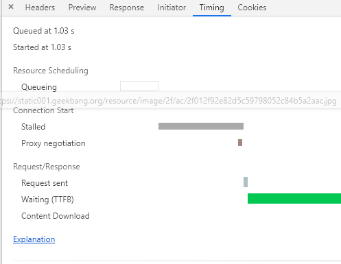

- Queueing：浏览器在以下情况下对请求排队
  - 存在更高优先级的请求
  - 在HTTP/1.0和HTTP/1.1中，此源已打开六个TCP连接，达到限值
  - 浏览器正在短暂分配磁盘缓存中的空间
- Stalled：请求可能会因Queueing中描述的任何原因而停止
- DNS Lookup：浏览器正在解析请求的IP地址
- Proxy Negotiation：浏览器正在与代理服务器协商请求
- Request sent：正在发送请求
- ServiceWorker Preparation：浏览器正在启动Service Worker
- Request to ServiceWorker：正在将请求发送到Service Worker
- Waiting (TTFB)：浏览器正在等待响应的第一个字节。TTFB表示Time To First Byte至第一字节的时间) 。此时间包括1次往返延迟时间及服务器准备响应所用的时间
- Content Download：浏览器正在接收响应
- Receiving Push：浏览器正在通过HTTP/2服务器推送接收此响应的数据
- Reading Push：浏览器正在读取之前收到的本地数据

# URI的格式

## URI 的分类

- URI

  URI 在于I(Identifier)是统一资源标示符，可以唯一标识一个资源

- URL

  URL在于Locater，一般来说（URL）统一资源定位符，可以提供找到该资源的路径

- URN

  URN = Universal Resource Name 统一资源名称

  

  统一资源标志符URI就是在某一规则下能把一个资源独一无二地标识出来。
  拿人做例子，假设这个世界上所有人的名字都不能重复，那么名字就是URI的一个实例，通过名字这个字符串就可以标识出唯一的一个人。
  现实当中名字当然是会重复的，所以身份证号才是URI，通过身份证号能让我们能且仅能确定一个人。
  那统一资源定位符URL是什么呢。也拿人做例子然后跟HTTP的URL做类比，就可以有：

  动物住址协议：//地球/中国/浙江省/杭州市/西湖区/某大学/14号宿舍楼/525号寝/张三.人

  可以看到，这个字符串同样标识出了唯一的一个人，起到了URI的作用，所以URL是URI的子集。URL是以描述人的位置来唯一确定一个人的。
  在上文我们用身份证号也可以唯一确定一个人。对于这个在杭州的张三，我们也可以用：

  身份证号：[123456789](tel：123456789)

  来标识他。
  所以不论是用定位的方式还是用编号的方式，我们都可以唯一确定一个人，都是URl的一种实现，而URL就是用定位的方式实现的URI。

  回到Web上，假设所有的Html文档都有唯一的编号，记作html：xxxxx，xxxxx是一串数字，即Html文档的身份证号码，这个能唯一标识一个Html文档，那么这个号码就是一个URI。
  而URL则通过描述是哪个主机上哪个路径上的文件来唯一确定一个资源，也就是定位的方式来实现的URI。
  对于现在网址我更倾向于叫它URL，毕竟它提供了资源的位置信息，如果有一天网址通过号码来标识变成了[http：//741236985.html](https：//link.zhihu.com/?target=http%3A//741236985.html)，那感觉叫成URI更为合适，不过这样子的话还得想办法找到这个资源咯…

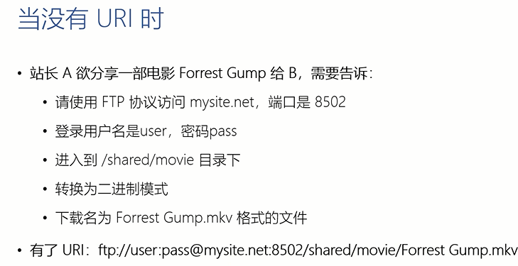

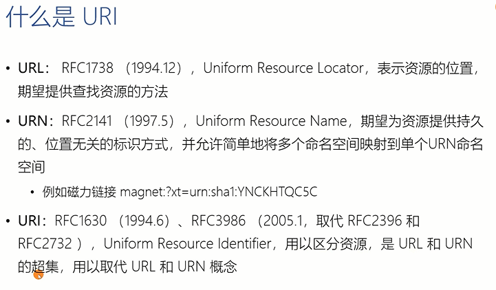

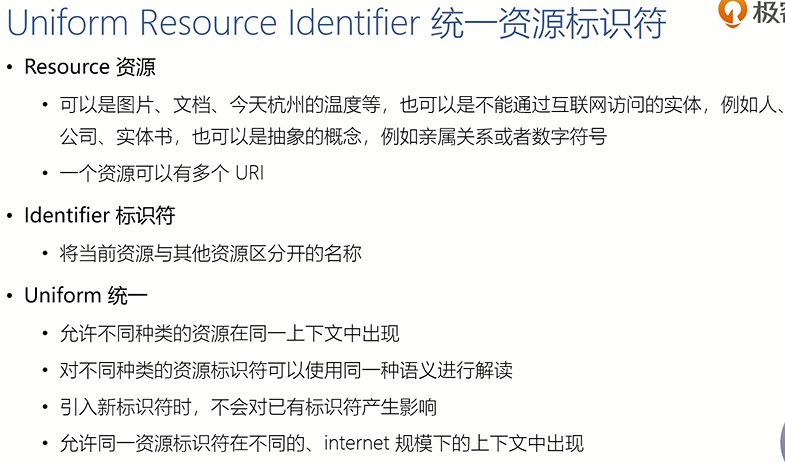

## URI的组成

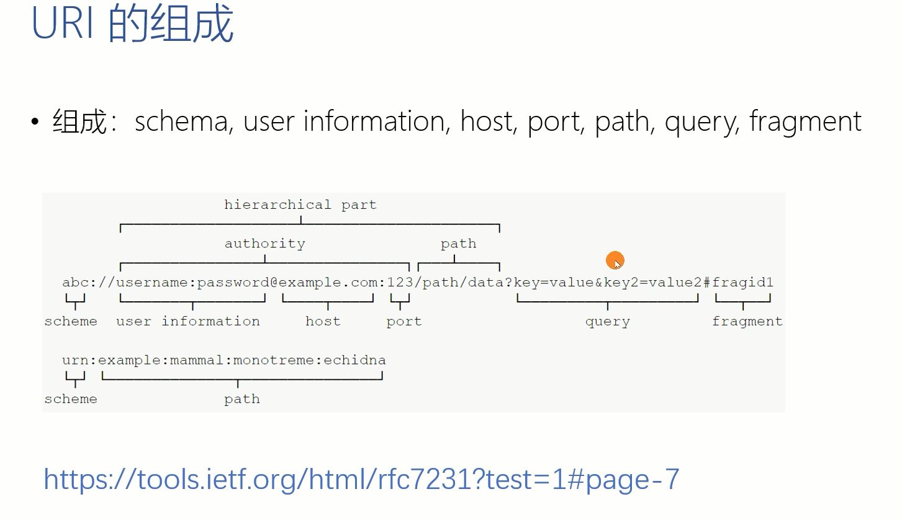

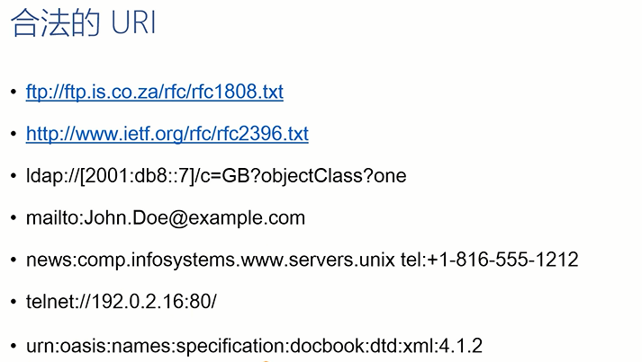

## URI 的ABNF定义

 

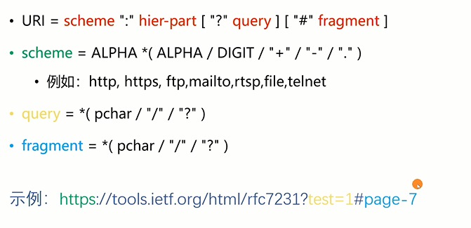

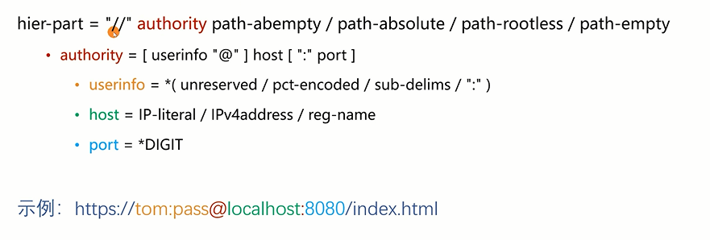

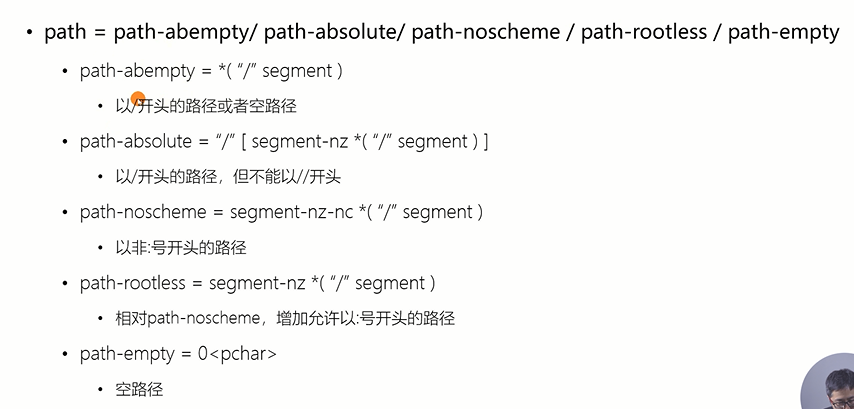

## 相对 URI

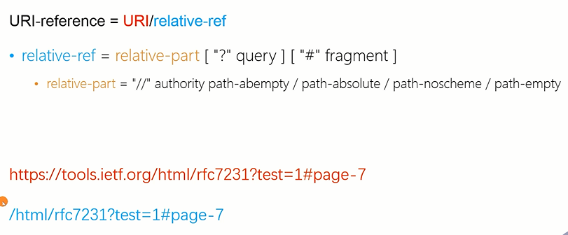

## 为什么要进行 URI 编码

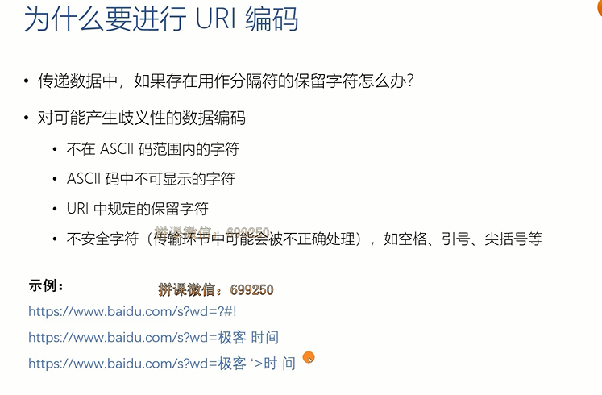

## 保留字符和非保留字符

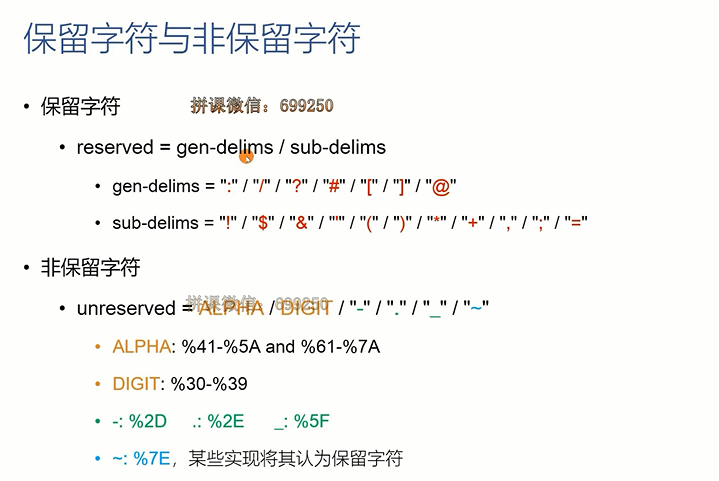

## URI 百分号编码

如果在ASCII码表中，如 65 A 对应的 十六进制为 41 编码后为%41，这些合法字符编码与否是无所谓的，但是对于一些非法字符，就需要进行百分号编码了，如HTTP协议中的保留字符和ASCLL中不可见的字符，还有汉字，汉字先转为三个字节的UTF8编码，将进行ASCII编码。

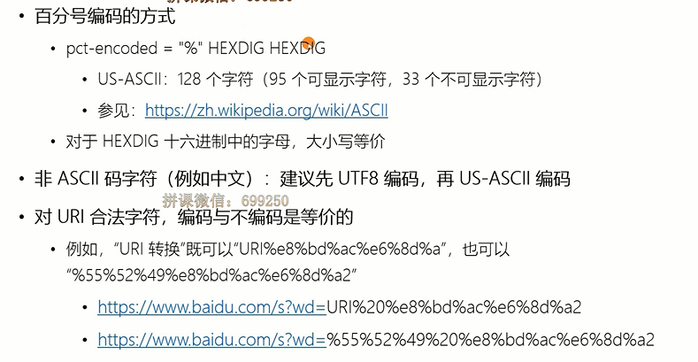

# 详解 HTTP 的请求行

## 请求行

- SP：空格
- request-target ：下边示例中的 path "/"
- CRLF：回车换行

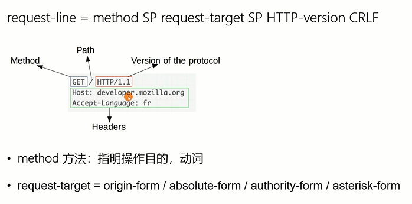

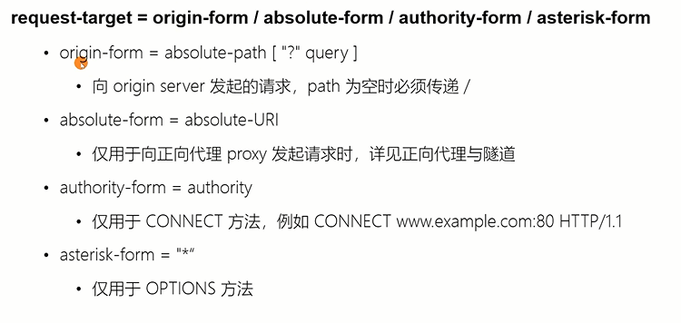

## version of the protocol

HTTP-version版本号发展历史： https：//www.w3.org/Protocols/History.htmll

- HTTP/0.9：只支持GET方法，过时. 
- HTTP/ 1.0： RFC1945，1996， 常见使用于代理服务器(例如Nginx默认配置)
- HTTP/ 1.1： RFC2616，1999
- HTTP/ 2.0： 2015.5正式发布

## 常见方法

- GET：主要的获取信息方法，大量的性能优化都针对该方法，幂等方法. 

- HEAD：类似GET方法，但服务器不发送BODY，用以获取HEAD元数据，幂等方法. 

- POST：常用于提交HTML FORM表单、新增资源等

- PUT：更新资源，带条件时是幂等方法

- DELETE：删除资源，幂等方法. 

- CONNECT：建立tunnel隧道. 

- OPTIONS：显示服务器对访问资源支持的方法，幂等方法

  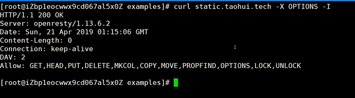

- TRACE：回显服务器收到的请求，用于定位问题。有安全风险，从2007年就不再支持了，每次都会返回405

## 用于文档管理的WEBDAV方法

WEBDAV对HTTP协议进行了扩展，增加了几种该协议特有的请求方式，通过这些请求，操作web服务器上的磁盘文件，很像一种在线简易版网盘，像很多软件的多人在线编辑文档就是基于该协议的。

可以使用nginx搭建了一个支持WebDAV的服务器，用客户端软件Cyberdark软件，连接操作，新建文件夹，文件，复制，改名，同步文件夹等。

- PROPFIND：从Web资源中检索以XML格式存储的属性。它也被重载，以允许一个检索远程系统的集合结构(也叫目录层次结构). 
- PROPPATCH：在单个原子性动作中更改和删除资源的多个属性. 
- MKCOL：创建集合或者目录.
- COPY：将资源从一个URI复制到另一个URI
- MOVE：将资源从一个URI移动到另一个URI
- LOCK：锁定一个资源。WebDAV支持共享锁（参考信号量）和互斥锁。
- UNLOCK：解除资源的锁定

# HTTP的正确响应码

## HTTP 响应行

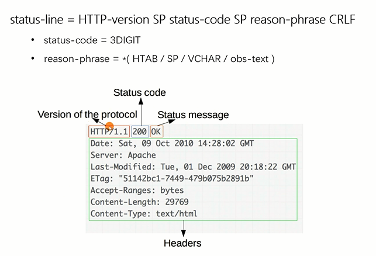

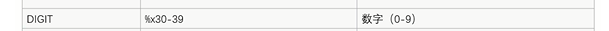

## 响应码分类：1XX

- 响应码规范： RFC6585 (2012.4) RFC7231 (2014.6)
- 1xx：请求已接收到，需要进一步处理才能完成， HTTP1.0不支持. 
  - 100 Continue：上传大文件前使用由客户端发起请求中携带Expect： 100-continue头部触发
  - 101 Switch Protocols：协议升级使用由客户端发起请求中携带Upgrade：头部触发，如升级websocket或者http/2.0. 
  - 102 Processing： WebDAV请求可能包含许多涉及文件操作的子请求，需要很长时间才能完成请求。该代码表示服务器已经收到并正在处理请求，但无响应可用。这样可迢时，并假设

## 响应码分类：2XX

- 2xx：成功处理请求
  - 200 **OK**：成功返回响应。
  - 201 **Created**：有新资源在服务器端被成功创建。
  - 202 **Accepted**：服务器接收并开始处理请求，但请求未处理完成。这样一个模糊的概念是有意如此设计，可以覆盖更多的场景。例如异步、需要长时间处理的任务。
  - 203 **Non-Authoritative Information**：当代理服务器修改了origin server的原始响应包体时(例如更换了HTML中的元素值) ，代理服务器可以通过修改200为203的方式告知客户端这一事实，方便客户端为这一行为作出相应的处理。203响应可以被缓存。
  - 204 **No Content**：成功执行了请求且不携带响应包体，并暗示客户端无需更新当前的页面视图。
  - 205 **Reset Content**：成功执行了请求且不携带响应包体，同时指明客户端需要更新当前页面视图。
  - 206 **Partial Content**：使用range协议时返回部分响应内容时的响应码
  - 207 **Multi-Status**： RFC4918 ，在WEBDAV协议中以XML返回多个资源的状态。
  - 208 **Already Reported**： RFC5842 ，为避免相同集合下资源在207响应码下重复上报，使用208可以使用父集合的响应码。

## 响应码分类：3XX

- 3xx：重定向使用Location指向的资源或者缓存中的资源。在RFC2068中规定客户端重定向次数不应超过5次，以防止死循环。
  - 300 **Multiple Choices**：资源有多种表述，通过300返回给客户端后由其自行选择访问哪一种表述。由于缺乏明确的细节， 300很少使用。
  - 301 **Moved Permanently**：资源永久性的重定向到另一个URI中，这个请求浏览器可以缓存。 
  - 302 **Found**：资源临时的重定向到另一个URI中。
  - 303 **See Other**：重定向到其他资源，常用于POST/PUT等方法的响应中。
  - 304 **Not Modified**：当客户端拥有可能过期的缓存时，会携带缓存的标识etag、时间等信息询问服务器缓存是否仍可复用，而304是告诉客户端可以复用缓存。
  - 307 **Temporary Redirect**：类似302，但明确重定向后请求方法必须与原请求方法相同，不得改变。
  - 308 **Permanent Redirect**：类似301，但明确重定向后请求方法必须与原请求方法相同，不得改变。

## 响应码分类：4XX

- 4xx：客户端出现错误. 
  - 400 **Bad Request：**服务器认为客户端出现了错误，但不能明确判断为以下哪种错误时使用此错误码。例如HTTP请求格式错误。·
  - 401 **Unauthorized**：用户认证信息缺失或者不正确，导致服务器无法处理请求。
  - 403 **Forbidden**：服务器理解请求的含义，但没有权限执行此请求
  - 404 **Not Found**：服务器没有找到对应的资源
  - 405 **Method Not Allowed**：服务器不支持请求行中的method方法
  - 406 **Not Acceptable**：对客户端指定的资源表述不存在(例如对语言或者编码有要求) ，服务器返回表述列表供客户端选择。
  - 407 **Proxy Authentication Required**：对需要经由代理的请求，认证信息未通过代理服务器的验证
  - 408 **Request Timeout**：服务器接收请求超时
  - 409 **Conflict**：资源冲突，例如上传文件时目标位置已经存在版本更新的资源
  - 410 **Gone**：服务器没有找到对应的资源，且明确的知道该位置永久性找不到该资源
  - 411 **Length Required**：如果请求含有包体且未携带Content-Length头部，且不属于chunk类请求时，返回411
  - 412 **Precondition Failed**：复用缓存时传递的1f-Unmodified-Since或IfNone-Match头部不被满足
  - 413 **Payload Too Large/Request Entity Too Large**：请求的包体超出服务器能处理的最大长度
  - 414 **URI Too Long**：请求的URI超出服务器能接受的最大长度
  - 415 **Unsupported Media Type**：上传的文件类型不被服务器支持
  - 416 **Range Not Satisfiable**：无法提供Range请求中指定的那段包体
  - 417 **Expectation Failed**：对于Expect请求头部期待的情况无法满足时的响应码
  - 421 **Misdirected Request:**服务器认为这个请求不该发给它,因为它没有能力处理。
  - 426 **Upgrade Required**:服务器拒绝基于当前HTTP协议提供服务,通过Upgrade头部告知客户端必须升级协议才能继续处理。
  - 428 **Precondition Require d**:用户请求中缺失了条件类头部,例如If-Match
  - 429 **Too Many Requests**:客户端发送请求的速率过快
  - 431 **Request Header Fields Too Large**:请求的HEADER头部大小超过限制
  - 451 **Unavailable For Legal Reasons**: RFC7725 ,由于法律原因资源不可访问

## 响应码分类：5XX

- 5xx：服务端出现错误

  - 500 **Internal Server Error**:服务器内部错误,且不属于以下错误类型
  - 501 **Not Implemented**:服务器不支持实现请求所需要的功能
  - 502 **Bad Gateway**:代理服务器无法获取到合法响应
  - 503 **Service Unavailable**:服务器资源尚未准备好处理当前请求
  - 504 **Gateway Timeout**:代理服务器无法及时的从上游获得响应，如上传大文件，代理服务器半天收不到源服务器的响应，就会返回504
  - 505 **HTTP Version Not Supported**:请求使用的HTTP协议版本不支持
  - 507 **Insufficient Storage**:服务器没有足够的空间处理请求
  - 508 **Loop Detected**:访问资源时检测到循环
  - 511 **Network Authentication Required**:代理服务器发现客户端需要进行身份验证才能获得网络访问权限

  > 如果客户端收到来自服务器的未知错误码，比如收到了555，客户端会将其当作500来处理，444，会当作400来处理。

# 如何管理跨代理服务器的长连接

长连接可以有效的减少 TCP 的握手次数，能够提升服务器的吞吐量，但如果网络中存在不识别Connection头部的代理服务器则可能会出现问题。

## HTTP 连接的常见流程

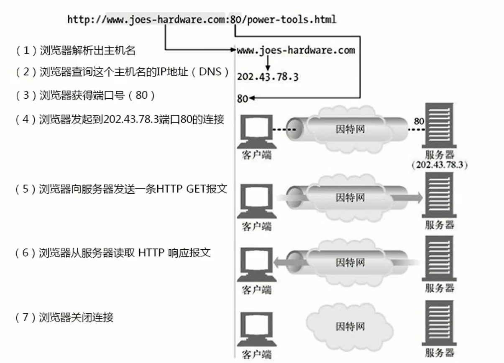

## 从 TCP 编程上看 HTTP 请求处理

## 短连接与长连接

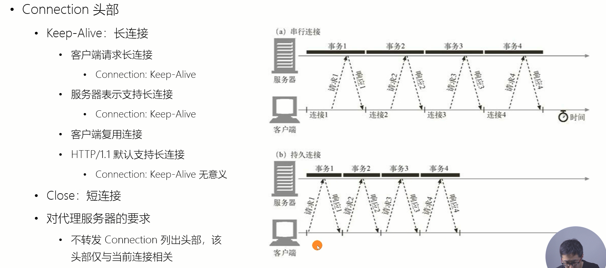

## Connection 仅对当前连接有效

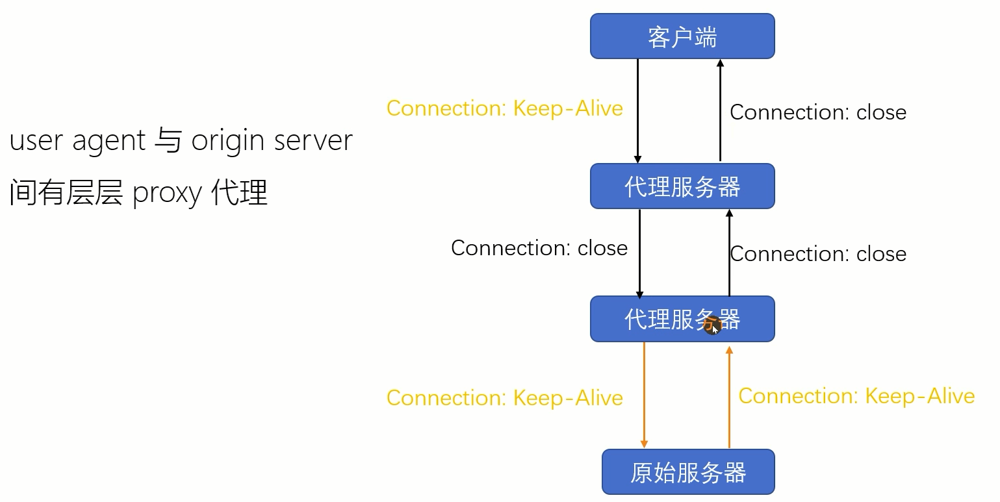

可以看出，正向代理服务器和客户端之间是短链接，而反向代理服务器和原始服务器之间保持长连接，而两个代理服务器之间也使用的是短连接。

## 代理服务器对长连接的支持问题

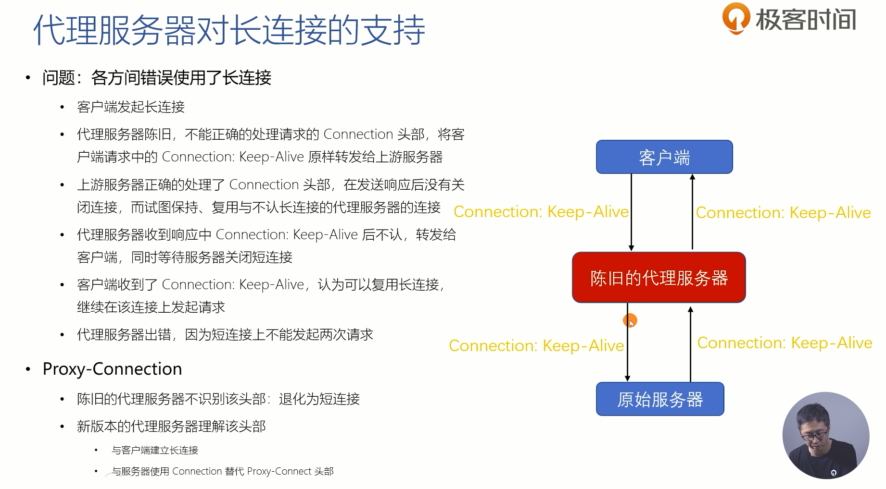

# HTTP消息在服务端的路由

## Host 头部

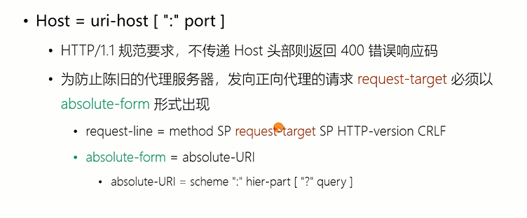

## Host 头部与消息的路由

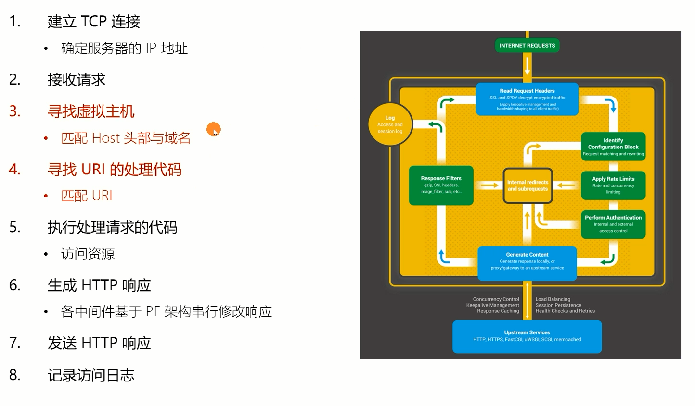

# 代理服务器转发消息相关

## 代理服务器转发消息时如何传递IP地址？

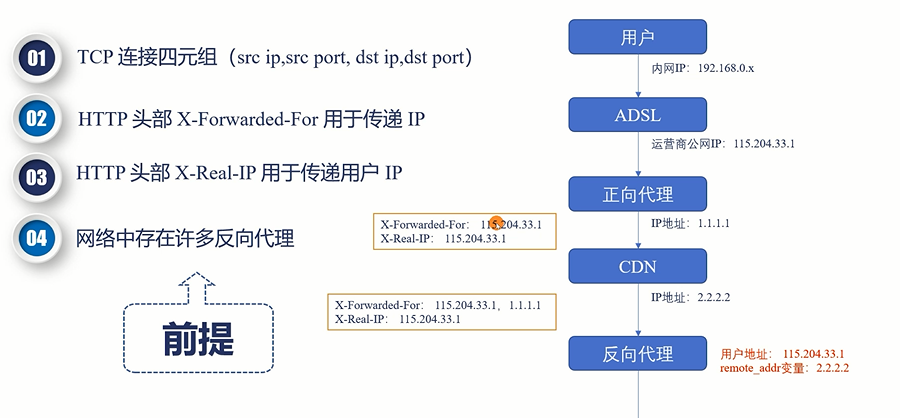

比如反向代理接收到的消息是由某一个 CDN 传递过来，IP地址为该 CDN 的地址，那我们想要对发起该请求的用户访问次数进行限制的话，就需要通过某种手段获取到用户的真实 IP 地址，而不是正向代理或者 CDN 的地址，该需求可以通过 HTTP 头部 X-Forwarded-For 来实现用户 IP 的传递。

## 消息的转发

- Max-Forwards头部
  - 限制Proxy代理服务器的最大转发次数,仅对TRACE/OPTIONS方法有效
  - Max-Forwards = 1*DIGIT
- Via头部
  - 指明经过的代理服务器名称及版本
  - Via =1#(received-protocol RWS received-by [RWS comment ]) 
    - received-protocol = [protocol-name "/"] protocol-version 
    - received-by = (uri-host [":"port]) / pseudonym
    - pseudonym = token
- Cache-Control:no-transform
  - 代理服务器修改响应包体

# 请求与响应的上下文

## 请求的上下文：User - Agent

指明客户端的类型信息,服务器可以据此对资源的表述做快择

- User-Agent = product * (RWS (product / comment ) ) ,

  - product = token ["/"product-version]
  - RWS =1*(SP/HTAB)

- 例如：

- User-Agent: Mozilla/5.0 (Windows NT 10.0; WOW64; rv:66.0) 

  Gecko/20100101 Firefox/66.0

  表示支持兼容 Mozilla 5.0，使用 Windows 10 64位机 发出的请求，通过 Gecko 渲染引擎旋律，使用的是 Firefox 浏览器

- User-Agent: Mozilla/5.0 (Windows NT 10.0; Win64; x64) AppleWebkit/537.36

  (KHTML, like Gecko) Chrome/73.0.3683.86 Safari/537.36

## 请求的上下文：Referer

浏览器对来自某一页面的请求自动添加的头部

- Referer = absolute-URI / partial-URI
- 例如:
  - Referer: https://developermozilla.ora/zh-CN/docs/Web/HTTP/Headers/User-Agent
- Referer不会被添加的场景
  - 来源页面采用的协议为表示本地文件的"file"或者"data" URI
  - 当前请求页面采用的是http协议,而来源页面采用的是https协议
- 常用于服务器端的统计分析、缓存优化、防盗链等功能

**示例**

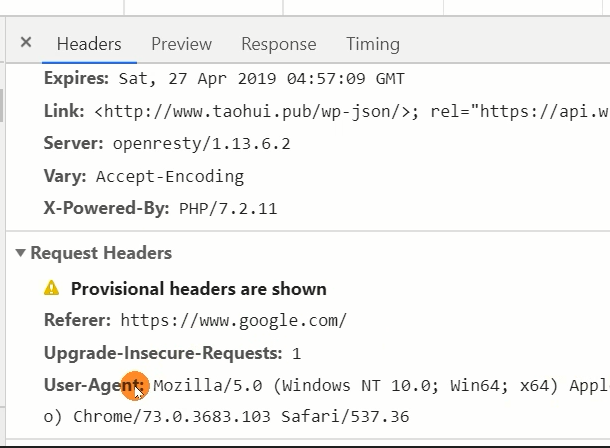

可以看到该请求的  Referer ： https://www.google.com/，表面该请求是从google这个页面发出的 。

## 请求的上下文：From

- 主要用于网络爬虫，告诉服务器如何通过邮件联系到爬虫的负责人
- From = mailbox
  - 例如：From：webmaster@example.org

## 响应的上下文：Server

- 指明服务器上所用软件的信息,用于帮助客户端定位问题或者统计数据
- Server = product *(RWS (product/ comment)) 
  - product = token ["/" product-version]
- 例如:
  - Server: nginx
  - Server: openresty/1.13.6.2

## 响应的上下文：Allow 与 Accept-Ranges

- Allow:告诉客户端,服务器上该URI对应的资源允许哪些方法的执行
  - Allow =#method
  - 例如 
    - Allow: GET, HEAD, PUT
- Accept-Ranges:告诉客户端服务器上该资源是否允许range请求
  - Accept-Ranges = acceptable-ranges 
  - 例如：
    - Accept-Ranges: bytes 
    - Accept-Ranges: none

# 内容协商与资源表述

这两部分决定服务端根据客户端的要求生成不同的包体，，

## 内容协商

每个URI指向的资源可以是任何事物,可以有多种不同的表述,例如一份,文档可以有不同语言的翻译、不同的媒体格式、可以针对不同的浏览器提供不同的压缩编码等。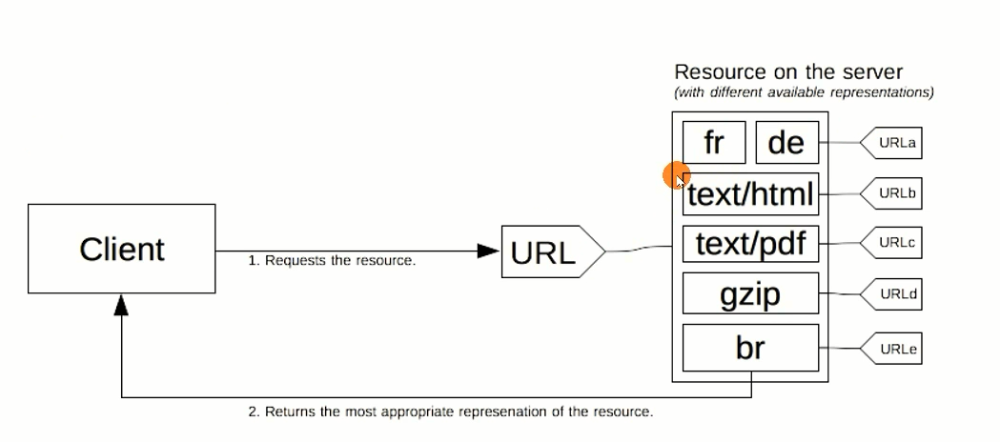

### 内容协商的两种形势

- Proactive主动式内容协商:
  - 指由客户端先在请求头部中提出需要的表述形式,而服务器根据这些请求头部提供特定的representation表述
- Reactive响应式内容协商:
  - 指服务器返回300 Multiple Choices或者406 Not Acceptable,由客户端选择一种表述URI使用

### Proactive 主动式内容协商

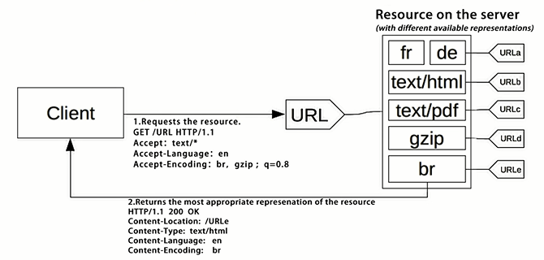

 

### Reactive 响应式内容协商

由于各大浏览器没用共同的规则，所以响应式内容协商现在很少用。

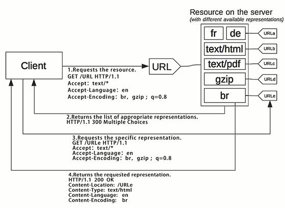

### 常见的协商要素

- 质量因子q:内容的质量、可接受类型的优先级

- 媒体资源的MIME类型及质量因子

  - *Accept: text/html,application/xhtml+xml,application/xmlq=0.9,*/;q=0.8*
  - *Accept.text/html,application/xhtml+xml,application/xml;q=0.9,image/webp.image/apnq,/*q=0.8,application/signed-exchange;v=b3 
  - 字符编码:由于UTF-8格式广为使用, Accept-Charset已被废弃
    - Accept-Charset: ISO-8859-1,utf-8;q=0.7,;q-0.7
  - 内容编码:主要指压缩算法
    - Accept-Encoding: gzip, deflate, br
  - 表述语言
    - Accept-Language: zh-CN,zhiq=0.9,en-US;q=0.8,en;q=0.7.
    - Accept-Language: zh-CN,zh;q-0.8,zh-TW;q=0.7,zh-HK;q-0.5,en-US;q=0.3,en;q=0.2

  - internationalization (i18n, i和n间有18个字符)
    - 指设计软件时,在不同的国家、地区可以不做逻辑实现层面的修改便能够以不同的语言显示
  - localization (10n, 1和n间有10个字符)
    -  指内容协商时,根据请求中的语言及区域信息,选择特定的语言作为资源表述

## 资源表述

### 资源表述的元数据头部

- 媒体类型、编码
  - cantent-type: text/html;charset=utf-8
- 内容编码
  -  content-encoding: gzip
- 语言
  - Content-Language: de-DE, en-CA