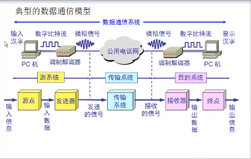
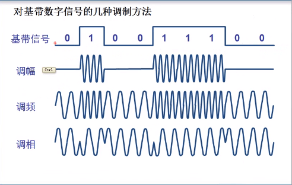
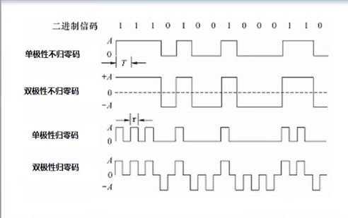
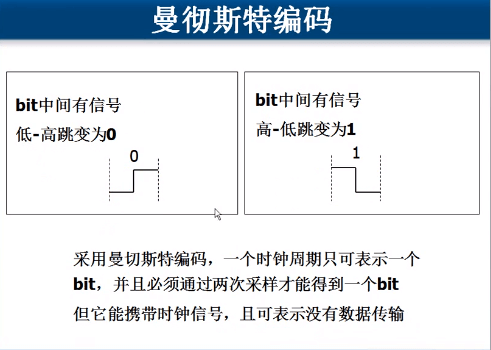
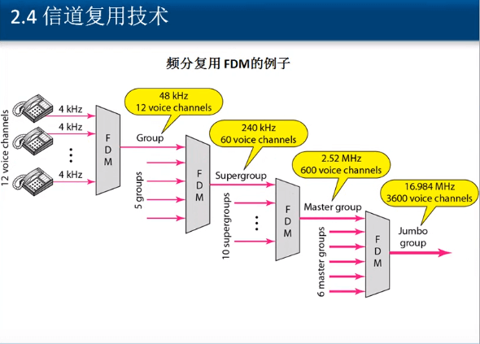
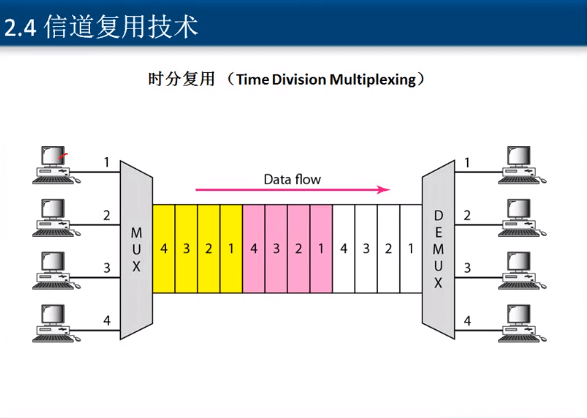
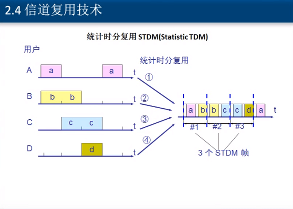
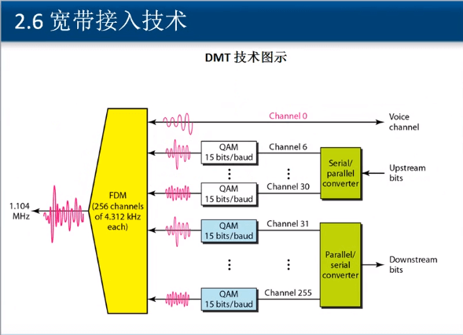
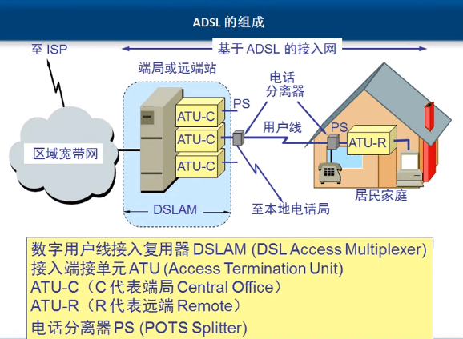
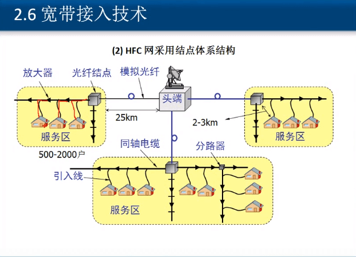

## [计算机网络](https://networkcv.github.io/2019/08/29/master/)
- #### [物理层](https://networkcv.github.io/2019/08/29/network-1-PhysicalLayer/)
- #### [数据链路层](https://networkcv.github.io/2019/08/29/network-2-DataLinkLayer/)
- #### [网络层](https://networkcv.github.io/2019/08/29/network-3-NetworkLayer/)
- #### [传输层](https://networkcv.github.io/2019/08/29/network-4-TransportLayer/)
- #### [应用层](https://networkcv.github.io/2019/08/29/network-5-ApplicationLayer/)

# 物理层

## 物理层基本概念

> 物理层解决如何在连接各种计算机的传输媒体（光纤、双绞线）上传输比特流（010110）  
> 而不是指具体的传输媒体

#### 主要任务描述：确定  传输媒体  的接口的一些特性

- 机械特性：网线接口的形状、大小，引线数目
- 电气特性：规定电压范围（-5v到+5v）不然电线会烧
- 功能特性：-5v代表0 +5v代表1
- 过程特性：也称规程特性，规定建立连接时各个相关部门的工作步骤

物理层规定基础特性后，各大厂商按照接口生产网络设备，这样大家都网络设备才能相互通信  
以太网用水晶头接口来接，广域网用广域网的接口
        
#### 数据通信的基础知识
计算机通信只是数据通信的一种，数据通信还包括，打电话，发传真等  
> 通信的目的是传送消息  

计算机产生数字比特流（数字信号）交由调整解调器（路由器）转化为模拟信号 然后在电话网络（广域网）上传播再由对方路由器将模拟信号转为数字信号，交由对方计算机接收并解释  

> 交换机不会将数字信号转为模拟信号  

**典型的数据模型：**

**相关术语：**  
- **数据**：运送消息的实体

- **信号**：数据的电气或者电磁的表现

- **模拟信号**：代表消息的参数的取值是连续的，如正弦函数

- **数字信号**：代表消息的参数的取值是离散的，如同+5v代表1，-5v代表0，整个图是由不连续的点组成的

- **码元**：
    在使用时间域的波形表示数字信号时，代表不同离散数值的基本波形就成为码元。  

    在数字通信中常常用时间间隔相同的符号表示一个二进制数字，这样的时间间隔内的信号称为二进制码元。而这个间隔被称为码元长度。

    1码元可以携带nbit的信息量，由码元取值范围决定，如果0v～7v 代表000、001、010...111这8个信号，则该码元的有0～7种取值，每个取值就不是之前的0或者1了，而是有3个比特，所携带是3个信息量。
    
- **信道**：
    信道一般表示向一个方向传送信息的媒体，所以平时所说的通信线路往往包含一条发送信息的信道和一条接收信息的信道  

    > 单向通信(单工通信)  --只能有一个方向的通信而没有反方向的交互。 电视接收电视台的信息

    > 双向交替通信(平双工通信)  --通信的双方都可以发送信息,但不能双方同时发送(当然也就不能同时接收)。对讲机对讲  

    > 双向同时通信(全双工通信)  --通信的双方可以同时发送和接收信息。手机打电话 

- **基带信号**（基本频带信号）：
    来自信源的信号，如计算机输出代表文字或图像文件的数据信号都属于基带信号，基带信号就是发出的直接表达要传输信息的信号，比如我们说话的声波就是基带信号

- **带通信号**：
    把基带信号经过载波调制后，把信号的频率范围搬移到较高的频段，以便在信道中传输  

    因此在传输距离较近的时，由于在近距离范围内信号衰减不大，计算机网络都采用基带传输的方式，如计算机到打印机、显示器的等外设的信号就是基带传输  

    > 人的在广播室说话时发出的声音是基带信号，频率较低，无法远距离传输  
    > 而麦克风将人的基带信号获取并处理为带通信号，发送出去  
    > 收听广播的人，听不到高频的带通信号，但是收音机可以将受到的带通信号转化为人能听到的基带信号

**对基带模拟信号的几种调制方法：** 
  

**数字信号常用编码：**
  

**曼彻斯特编码：**
  

**奈式准则：**  
没有信号干扰，码元的传输速率有上限  
在任何信道中，码元传输的速率是有上限的，否则就会出现码间串扰的问题，就是无法识别信号  
如果信道的频带越宽，也就是通过的信号高频分量越多，那么可以用更高的速率传送码元而不出现码间串扰  
> 光纤比铜线更利于传输，在铜线上传输速率更快，但在光纤上可以传输更高频率的模拟信号  

**香农公式：**  
在有信号干扰情况下进行 无差错传输
信道的带宽或信道中的信噪比（信号/其他干扰因素）越大，则信号的极限传输速率就越高  
只要信息传输速率低于信道的极限信息传输速率，就一定可以找到某种办法来实现无差错的传输  
> 在没有干扰因素的时候每分钟能听清楚别人说100字，有了噪声干扰，别人每分钟说100字我肯定是不能全部听清楚，但是别人如果降低说话速率,每分钟说50字的话我还是全部能听清楚。例如在wifi信号特别差的地方能上网，就是比较慢  

**奈式准则和香农公式的应用范围：**   
奈式准则应用范围：从发送方的路由器到传输系统再到接收方的路由器，码元的传输速率受到奈式准则的限制，适用于模拟信号   
香农公式应用范围：从发送方的计算机到发送方的路由器再到传输系统、接收方的路由器，最后到接收方的计算机，信息传输速率受香农公式的限制，适用于数字信号和模拟信号
        
## 物理层下面的传输媒体
- **导向传输媒体：**
    - 导向传输媒体中，电磁波或者光信号沿着固体媒体传播
    - 双绞线：
        - 无屏蔽双绞线
        - 屏蔽双绞线：在绝缘层外边加上屏蔽层，减少外部磁场影响
    - 同轴电缆：
        - 50Ω同轴电缆用于数字传输，由于对用于基带传输，也叫基带同轴电缆
        - 70Ω同轴电缆用于模拟传输，即宽带同轴电缆
        - 网线：
          
            - 直通线：水晶头两端的线序相同，一方发送数据，另一方接收不到，原因是发送线头连接的还是发送线头，起到转发的作用
                应用于 主机到交换机或集线器、路由器到交换机或集线器，交换机内部的线序已经进行调整
            - 交叉线：交换机到交换机，集线器到集线器，主机到主机，集线器到交换机，路由器直连到主机
            > 之前同种设备用双绞线，不同设备用直通线  
            > 现在网卡设备可以智能调整线序
    - 光缆：
        > 光纤是光缆的核心传输部分，光缆还包括外部的绝缘层和保护层
        - 光纤：
            - 单模光纤：只能传输一种电磁波模式,相当于一条管道，只能一个光信号通过
            - 多模光纤：可以传输多个电磁波模式，也就是多个光信号，通过在光纤内折射的方式传输，所以多模光纤较粗一些
- **非导向传输媒体：**
  
    - 自由空间（短波通信、无线电微波通信、卫星通信）
- **物理层设备：**
  
    - 集线器hub：在网络中起到信号放大和重发作用，其目的是扩大网络的传输范围，不具备信号定向传送能力，最大传输距离 100m

## 信道复用技术

**频分复用：**  通过对多个源信号进行不同频率的调制解调汇集成一个模拟信号传输，在接收时再根据不同频率进行拆解、过滤以达到频分复用，例如打电话
  

**时分复用：**  在通讯时，一帧(一个周期)内按照先后顺序发送数据和按照先前发送的先后顺序接收数据，
  
时分复用可能会造成线路资源的浪费，使用时分复用系统传送计算机数据时，由于计算机数据的突发性质，用户分配到的子信道的利用率一般是不高的

**统计时分复用：**  在发送数据时没有发送规律，而是通过发送时加上用户标记，满足一帧后进行数据发送，然后再进行获取发送数据，加上要发送数据用户的标记，根据标记解析，  

**波分复用：**  波分复用就是光的频分复用

## 数字传输系统
广域网之间的数据传输，国内广域网使用E1链路，欧洲使用T1

## 宽带接入技术
**ADSL**  
我们一般使用ADSl拨号上网（非对称数字用户链路）通过电话线接入互联网  ADSL为XDSL中的一种 

**xDSL**  （用数字技术对现有的模拟电话用户先进行改造）  
标准模拟电话信号的频带被限制在300～3400Hz的范围内，但用户线本身是实际可通过对信号频率仍然超过1MHz
xDSL就是把0～4kHz的低端频谱留给传统电话使用，而把原来没有利用到的高端频谱留给用户上网使用
这种改造使用的是DMT技术  

DMT调制技术采用频分复用的方法,把40 kHz以上一直到1.1 MHz的高端频谱划分为许多的子信道,其中25个子信道用于上行信道,而 249个子信道用于下行信道。
每个子信道占据4kHz带宽,并使用不同的载波(即不同的音调)进行数字调制。这种做法相当于在一对用户线上使用许多小的调制解调器并行地传送数据。
ADSL组成   

**HFC**  
光纤同轴混合网 通过有线电视线接入互联网  
HFC网上目前覆盖很广的有线电视网CATV的基础上开发的一种居民宽带接入网，HFC还提供电话、数据和其他宽带交互性业务  
现有的CATV网是树形拓扑结构的同轴电缆网络，它采用模拟技术的频分复用对电视节目进行单向传输，而HFC网则需要对CATV网进行改造
HFC网将原CATV网中的同轴电缆主干部分改换为光纤，并使用模拟光纤技术  
HFC网采用结点体系结构 如图11   模拟光纤 传输距离 25km / 同轴电缆  传输距离 2-3km  
  

**FTTx**  
光纤到户，方便，快捷 不用电话线或者有线电视线
