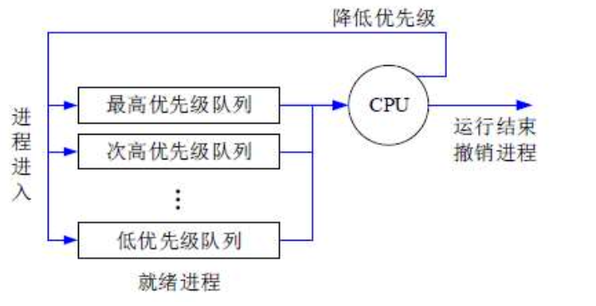

# 

# 一、操作系统概述

## 操作系统定义

是一种基础的系统软件，能有效地组织和管理系统中的软/硬件资源，合理的组织计算机系统工作流程，控制程序的执行，并向用户提供一个良好的工作环境和友好的接口。

## 操作系统重要作用

1. **通过资源管理提高计算机系统的效率**
2. **改善人机介面向用户提供友好的工作环境**

操作系统的4个特征是：**并发性、共享性、虚拟性和不确定性。**

## 操作系统的功能

1. **进程管理：**实质上是对处理机的执行“时间”进行管理，采用多道程序等技术将CPU的时间合理地分配给每个任务，主要包括进程控制、进程同步、进程通信和进程调度。
2. **文件管理：**主要包括文件存储空间管理、目录管理、文件的读/写管理和存取控制。
3. **存储管理：**存储管理是对主存储器“空间〞进行管理，主要包括存储分配与回收、存储保护、地址映射（变换）和主存扩充。
4. **设备管理：**实质是对硬件设备的管理，包括对输入/输出设备的分配、启动、完成和回收。
5. **作业管理：**包括任务、界面管理、人机交互、图形界面、语音控制和虚拟现实等。

## 操作系统的分类

- **批处理操作系统**：单道批处理和多道批处理（主机与外设可并行）
- **分时操作系统**：一个计算机系统与多个终端设备连接。将CPU 的工作时间划分为许多很短的时间片，轮流为各个终端的用户服务。
- **实时操作系统**：实时是指计算机对于外来信息能够以足够快的速度进行处理，并在被控对象允许的时间范围内做出快速反应。实时系统对交互能力要求不高，但要求可靠性有保障。
- **网络操作系统**：是使联网计算机能方便而有效地共享网络资源，为网络用户提供各种服务的软件和有关协议的集合。三种模式：集中模式、客户端/服务器模式（C/S模式）、对等模式（P2P模式）。
- **分布式操作系统**：分布式计算机系统是由多个分散的计算机经连接而成的计算机系统，系统中的计算机无主、次之分，任意两台计算机可以通过通信交换信息。
- **微型计算机操作系统**：简称微机操作系统，常用的有windows、Mac os、Linux。

## 嵌入式操作系统主要特点

1. **微型化**。从性能和成本角度考虑，希望占用的资源和系统代码量少，如内存少、字长短、运行速度有限、能源少（用微小型电池）
2. **可定制**。从减少成本和缩短研发周期考虑，要求嵌入式操作系统能运行在不同的微处理器平台上，能针对硬件变化进行结构与功能上的配置，以满足不同应用需要。
3. **实时性**。嵌入式操作系统主要应用于过程控制、数据采集、传输通信、多媒体信息及关键要害领域需要迅速响应的场合，所以对实时性要求较高。
4. **可靠性**。系统构件、模块和体系结构必须达到应有的可靠性，对关键要害应用还要提供容错和防故障措施。
5. **易移植性**。为了提高系统的易移植性，通常采用硬件抽象层和板级支撑包的底层设计技术。

嵌入式系统**初始化过程**按照自底向上、从硬件到软件的次序依次为：**片级初始化-》板级初始化-》系统初始化。**

# 二、进程管理

## 进程的组成和状态

进程 （progress）的组成：进程控制块PCB（唯一标志）、程序（描述进程要做什么）、数据（存放进程执行时所需数据）

进程基础的状态是下左图中的三态图。需要熟练掌握左下图中的进程三态之间的转换。

## *前趋图

用来表示哪些任务可以并行执行，哪些任务之间有顺序关系，具体如下图：

可知，ABC可以并行执行，但是必须ABC都执行完后，才能执行D，这就确定了两点：**任务间的并行、任务间的先后顺序。**

## 进程资源图

用来表示**进程和资源之间的分配和请求关系**，如下图所示：

**P代表进程，R代表资源**，R方框中有几个圆球就表示有几个这种资源，在上图中，R1指向P1，表示R1有一个资源已经分配给了P1，P1指向R2，表示P1还需要请求一个R2资源才能执行。

阻塞节点：某进程 **所请求的资源已经全部分配完毕**，无法获取所需资源，该进程被阻塞了无法继续。如上图中P2。

非阻塞节点：某进程**所请求的资源还有剩余**，可以分配给该进程继续运行。如上图中P1、P3。

当一个进程资源图中 **所有进程都是阻塞节点时，即陷入死锁状态。**

## *进程同步与互斥

临界资源：**各进程间需要以互斥方式对其进行访问**的资源。

临界区：指进程中**对临界资源实施操作的那段程序**。本质是一段程序代码。

互斥：某资源（即临界资源）在**同一时间内只能由一个任务单独使用**，使用时需要加锁，使用完后解锁才能被其他任务使用；如打印机。

同步：**多个任务可以并发执行，只不过有速度上的差异**，在一定情况下停下等待，不存在资源是否单独或共享的问题；如自行车和汽车。

互斥信号量：对临界资源采用互斥访问，使用互斥信号量后其他进程无法访问，**初值为1。**当临界资源被分配给一个进程访问时，互斥信号减1，当任务归还临界资源后，互斥信号量加1。

同步信号量：对共享资源的访问控制，**初值一般是共享资源的数量。**

> 互斥信号量可以看作是 共享资源数为1的同步信号量。

> **趋势图中几条线就对应几个信号量**。

## *PV操作

**P（passeren）操作：申请资源，S=S-1**，若S>=0，则执行p操作的进程继续执行；若S<0，则置该进程为阻塞状态（因为无可用资源），并将其插入阻塞队列。

**v（vrijgeven）操作：释放资源，S-S+1，若S>0**，则执行v操作的进程继续执行；若S<=0（因为在P操作的时候，由于资源不足，S会被减成负数，这里判断S非正数，则意味着有进程在队列里阻塞，等待资源的释放）， 则从阻塞状态唤醒一个进程，并将其插入就绪队列（此时因为缺少资源被P操作阻塞的进程可以继续执行），然后执行v操作的进程继续。

## 进程调度

进程调度方式是指**当有更高优先级的进程到来时如何分配CPU**。分为 **可剥夺和不可剥夺两种**，可剥夺指当有更高优先级进程到来时，强行将正在运行进程的 CPU分配给高优先级进程；不可剥夺是指高优先级进程必须等待当前进程自动释放CPU。

在某些操作系统中，一个作业可以是一组进程，作业从提交到完成需要经历高、中、低三级调度。

（1）高级调度。高级调度又称“长调度〞“作业调度”或“接纳调度”，它决定处于**输入池中的哪个后备作业可以调入主系统做好运行的准备**，成为一个或一组就绪进程。在系统中一个作业只需经过一次高级调度。

（2）中级调度。中级调度又称“中程调度”或“对换调度”，它决定**处于交换区中的哪个就绪进程可以调入内存**，以便直接参与对CPU 的竞争。

（3）低級调度。低级调度又称“短程调度”或“进程调度”，它决定**处于内存中的哪个就绪进程可以占用CPU**。低级调度是操作系统中最活跃、最重要的调度程序，对系统的影响很大。

## 调度算法

**先来先服务FCFS：**先到达的进程优先分配CPU。用于宏观调度。

**时间片轮转：**分配给每个进程CPU时间片，轮流使用CPU，每个进程时间片大小相同，很公平，用于微观调度。

**优先级调度：**每个进程都拥有一个优先级，优先级大的先分配CPU。

**多级反馈调度：**时间片轮转和优先级调度结合而成，设置多个就绪队列 1,2,3..n，每个队列分别赋予不同的优先级，分配不同的时间片长度；新进程先进入队列1的末尾，按FCFS原则，执行队列1的时间片；若未能执行完进程，则转入队列2的末尾，如此重复。 

## 死锁

当一个进程在等待永远不可能发生的事件时，就会产生死锁，若系统中有多个进程处于死锁状态，就会造成系统死锁。

死锁产生的四个必要条件：

- **（资源互斥）**

- **（持有等待）每个进程占有资源并等待其他资源**

- **（不可剥夺）系统不能剥夺进程资源**

- **（循环等待）进程资源图是一个环路**

  

死锁产生后，解决措施是打破四大条件，有下列方法：

**死锁预防**：采用某种策略限制并发进程对于资源的请求，破坏死锁产生的四个条件之一，使系统任何时刻都不满足死锁的条件。

**死锁避免**：一般采用银行家算法来避免，银行家算法，就是提前计算出一条不会死锁的资源分配方法，才分配资源，否则不分配资源，相当于借货，考虑对方还得起才借钱，提前考虑好以后，就可以避免死锁。

死锁检测：允许死锁产生，但系统定时运行一个检测死锁的程序，若检测到系统中发生死锁，则设法加以解除。

**死锁解除**：即死锁发生后的解除方法，如强制剥夺资源，撤销进程等。

 死锁资源计算：系统内有n个进程，每个进程都需要R个资源，那么其发生死锁的最大资源数为 $n*（R-1）$。其不发生死锁的最小资源数为 $n*（R-1）+1$。

## 线程

传统的进程有两个属性：**可拥有资源的独立单位；可独立调度和分配的基本单位。** 

引入线程的原因是进程在创建、撤销和切换中，系统必须为之付出较大的时空开销，故在系统中设置的**进程数目不宜过多**，进程切换的频率不宜太高，这就限制了并发程度的提高。引入线程后，将传统进程的两个基本属性分开，**线程作为调度和分配的基本单位**，**进程作为独立分配资源的单位**。用户可以通过创建线程来完成任务，以减少程序并发执行时付出的时空开销。

线程是进程中的一个实体，是被系统独立分配和调度的基本单位。**线程基本上不拥有资源，只拥有一点运行中必不可少的资源**（如程序计数器、一组寄存器和栈〉，**它可与同属一个进程的其他线程共享进程所拥有的全部资源**，例如进程的公共数据、全局变量、代码、文件等资源，**但不能共享线程独有的资源**， 如线程的栈指针等标识数据。

# 三、存储管理

## （虚拟存储）

虚拟存储（ virtual memory）技术的概念是：把很大的程序（数据）分成许多较小的块，全部存储在辅存（硬盘、U盘）中。运行时，把要用到的程序（数据）块先调入主存，并且把马上就要用到的程序块从主存调入高速缓存（catch）。这样，一边运行程序，一边进行所需程序（数据）块的调进调出只要及时供应所需处理的程序与数据，程序就能顺利而高速地运行下去。因此，对于应用程序员来说就好像有一个比实际主存大得多且可以放下整个程序的虚拟主存空间。当辅存中的程序块调入主存时，必须使程序在主存中定位（程序运行时找到数据在内存中的位置），该工作由系统自动完成，应用程序员不用考虑如何把程序地址映像和变换成实际主存的物理地址，因此，虚存技术对于应用程序员来说是透明的。

早期的分区化管理， 将内存分区化，在内存中划定用户区域，供用户程序调入内存时使用， 如果执行1G大小的程序，需要将1G大小的文件一次性调入内存，如果此时内存没有1G的连续空间， 执行将失败。基于这样的问题， 提出了页式存储，段式存储、段页式存储的方法。

## 分区存储管理

所谓分区存储组织，就是**整存，将某进程运行所需的内存整体一起分配给它**， 然后再执行。有三种分区方式：

- 固定分区：静态分区方法，将主存分为若干个固定的分区，将要运行的作业装配进去，由于分区固定，大小和作业需要的大小不同，会**产生内部碎片**。内部碎片或外部碎片这里的内外是指分区的内外。例如100k的分区，分给一个只需要50k大小的程序，会浪费剩下的50M。

- 可变分区：动态分区方法，主存空间的分区是在作业转入时划分，正好划分为作业需要的大小，这样就不存在内部碎片，但容易将整片主存空间切割成许多块，会**产生外部碎片**。可变分区的算法如下：

  系统分配内存的算法有很多，如下图所示，根据分配前的内存情况，还需要分配9K空间，对不同算法的结果介绍如下：

  

- 可重定位分区：可以解决碎片问题，移动所有已经分配好的区域，使其成为一个连续的区域，这样其他外部细小的分区碎片可以合并为大的分区，满足作业要求。只在外部作业请求空间得不到满足时进行。

## 分页存储管理

用户程序等分为大小相等的页， 物理内存也等分页。用户程序调入内存的时候，不再是一次性调入整个程序，而是要运行哪些块就调入哪些块到内存中，此时需要一个“页表”来记录用户程序和物理内存的映射关系，这样可以运行超越内存容量的程序（运行时，只是部分页加载中内存中，然后继续加载时会发生页面置换，使用了页面淘汰算法）。

**优点：** **利用率高，碎片小、分配和管理简单。**如程序有102K，此时需要分配26个页，每个页大小为4K，一共需要分配104K，只有2K浪费。

**缺点：** **增加了系统开销，可能产生抖动现象。** 页式存储需要查页表来查找程序页面与内存的映射关系，不像之前连续的地址空间的时候，不需要查找页表。

**页号是根据页的个数来的，页内地址是根据页的大小来的。**

### 逻辑地址与物理地址的转换

  高级程序语言使用逻辑地址， 运行时内存中使用物理地址。

  **程序逻辑地址组成： 页号+页内地址， 内存物理地址组成： 块号+页内地址**

  **逻辑地址与物理地址：** 他们的页内地址是相同的， 但是页号不同。逻辑地址的页号是连续的， 而物理地址的页号一般是不连续的。

  **转换步骤：** 

1. 求出逻辑地址的页内地址（逻辑地址的页内地址即为物理地址的页内地址）
2. 求出逻辑地址的页号， 根据页表查到物理地址的块号（物理地址的块号又称页帧号） 
3. 物理地址即为 ： 物理块号+页内地址

**页表，记录了程序逻辑地址的页号 和 真实内存物理地址的块号的对应关系。** 

### 真题

物理地址和虚拟地址的业内大小是一样的，一个逻辑地址表示=页号地址 拼接 业内地址，然后根据页表，找对页号对应的物理块号，物理地址=物理块号地址 拼接 业内地址。

## 分段存储管理

将进程空间分为一个个段，**每段也有段号和段内地址**，与页式存储不同的是， **每段物理大小不同**，**分段是根据逻辑整体分段的**，因此，段表也与页表的内容不同，页表中直接是逻辑页号对应物理块号，而下图所示，**段表有段长和基址两个属性**，才能确定一个逻辑段在物理段中的位置。

  各个段的大小可以不同， **段表： 存储的是段号、段长、基地址**

  **优点：多道程序共享内存，各段程序修改互不影响（ 一个函数就是一个段， 可供多个程序调用， 便于程序共享）**

  **缺点：内存利用率低，内存碎片浪费大**

### 真题

  段的地址为： (2, 100K) 判定是否合法？ 2为段号，100K为偏移量， 从上图中可以看出，段长只有15K，120K是段的基地址，100K远大于15K，地址非法。

## 段页式存储管理

结合段式、页式两种，先 **分段再分页**， 折中产物，两者优点集合

先查段表，然后查页表， 效率大大降低。

**优点：空间浪费小、存储共享容易、存储保护容易、能动态连接**

**缺点：由于管理软件的增加，复杂性和开销也随之增加，需要的硬件以及占用的内容也有所增加，使得执行速度大大下降**

## 快表

  页表放到高速缓存（**cache**）中，速度快，提高了查询速度。

  快表是一块小容量的相联存储器（ Associative Memory），由高速缓存器组成速度快，并且可以从硬件上保证按内容并行查找，一般用来存放当前访问最频繁的少数活动页面的页号。

  段表、页表放到内存中，是一种慢表，放到cache中是快表，快表用来存放当前访问最频繁的少数活动页面的页号。

## 页面置换算法

**最优算法**：**OPT**，理论上的算法，无法实现，是在进程执行完后进行的最佳效率计算，用来让其他算法比较差距。原理是选择未来最长时间内不被访问的页面置换，这样可以保证未来执行的都是马上要访问的，**在实际执行中，预先是无法知道页面序列的， 没办法直接应用。**

**先进先出算法**：**FIFO**，先调入内存的页先被置换淘汰，**会产生抖动现象和Belady现象**。

**最近最少使用**：**LRU（Least Recently Used）**，在最近的过去，**淘汰最近没被访问的数据**，根据局部性原理，这种方式效率高，**且不会产生抖动现象。

**最近最不常用算法：LFU（Least Frequently Used）**，在最近的过去，**淘汰最近访问次数最少的数据**。

## **淘汰原则**

**优先淘汰最近未访问的，而后淘汰最近未被修改的页面。**

## 抖动现象

在请求分页存储管理中，可能出现这种情况，即**对刚被替换出去的页，立即又要被访问**。需要将它调入，因无空闲内存又要替换另一页，而后者又是即将被访问的页，于是造成了系统需花费大量的时间忙于进行这种频繁的页面交换，致使系统的实际效率很低，严重导致系统瘫痪，这种现象称为抖动现象。 抖动现象发生在FIFO页面置换算法中，FIFO还会产生Belady现象，因而FIFO并不是一个好的置换算法。

## Belady现象

如果对一个进程未分配它所要求的全部页面，有时就会出现分配的页面数增多，但缺页率反而提高的异常现象。

**下图为 FIFO算法 出现 belady 现象图：**

 **LRU 不会产生抖动和Belady现象，分配的资源越多，表现的性能越好**

# 四、设备管理

## 设备管理概述

设备是**计算机系统与外界交互的工具**，具体负责计算机与外部的输入/输出工作， 所以常称为外部设备（简称外设）。在计算机系统中，将负责管理设备和输入/输出的机构称为V/0 系统。因此，V/o 系统由设备、控制器、通道（具有通道的计算机系统）、总线和/O 软件组成。

设备的分类： 

**按数据组织分类**：块设备、字符设备。

**按照设备功能分类**：输入设备、输出设备、存储设备、网络联网设备、供电设备。

**资源分配角度分类**：独占设备、共享设备和虚拟设备。

**数据传输速率分类**：低速设备、中速设备、高速设备。

设备管理的任务是保证在多道程序环境下，**当多个进程竞争使用设备时**，**按一定的策略分配和管理各种设备**，控制设备的各种操作，完成/O 设备与主存之间的数据交换。

设备管理的主要功能是**动态地掌握并记录设备的状态**、设备分配和释放、缓冲区管理、实现物理I/0 设备的操作、提供设备使用的用户接口及设备的访问和控制。

## I/O软件

I/O设备管理软件的所有层次及每一层功能如下图：

实例：当用户程序试图读一个硬盘文件时，需要通过操作系统实现这一操作。

与**设备无关软件检查高速缓存中有无要读的数据块**，若没有，则**调用设备驱动程序，向I/O硬件发出一个请求**。然后，用户进程阻塞并等待磁盘操作的完成。

当**磁盘操作完成时，硬件产生一个中断，转入中断处理程序**。中断处理程序检查中断的原因，**认识到这时磁盘读取操作已经完成，手是烧醒用户进程取回从磁盘读取的信息，从而结束此次 I/O 请求**。用户进程在得到了所需的硬盘文件内容之，后继续运行。

## 设备管理技术

一台独占设备，在同一时间只能由一个进程使用，其他进程只能等待，且不知道什么时候打印机空闲，此时，极大的浪费了外设的工作效率。

**引入SPOOLING（外围设备联机操作）技术**，就是在外设上建立两个数据缓冲区，分别称为输入井和输出井，这样，无论多少进程，都可以共用这一台打印机，只需要将打印命令发出，数据就会排队存储在缓冲区中，打印机会自动按顺序打印，实现了物理外设的共享，使得**每个进程都感觉在使用一个打印机， 这就是物理设备的虚拟化**。如下图所示：

# 五、文件管理

## 文件管理概述

文件的逻辑结构可分为两大类：**有结构的记录式文件；无结构的流式文件。**

文件的物理结构是指文件在**物理存储设备上的存放方法**，包括：

- **连续结构**。连续结构也称顺序结构，它**将逻辑上连续的文件信息（如记录） 依次存放在连续编号的物理块上。**
- **链接结构**。链接结构也称串联结构，它是**将逻辑上连续的文件信息（如记录）存放在不连续的物理块上，每个物理块设有一个指针指向下一个物理块。**
- **索引结构**。将逻辑上**连续的文件信息（如记录）存放在不连续的物理块中**， 系统为每个文件建立一张索引表。**索引表记录了文件信息所在的逻辑块号对应的物理块号，**并将索引表的起始地址放在与文件对应的文件目录项中。
- **多个物理块的索引表**。索引表是在**文件创建时由系统自动建立的**，并与文件一起存放在同一文件卷上。根据一个文件大小的不同，其索引表占用物理块的个数不等，一般占一个或几个物理块。

## 索引文件结构

 

计算机中块号默认是从0开始，逻辑块号为0则是第一块，逻辑块号为5则是第六块。

## 文件目录

**相对路径：是从当前路径开始的路径。**

**绝对路径：是从根目录开始的路径。**

**全文件名=绝对路径+文件名。要注意，绝对路径和相对路是不加最后的文件名的，只是单纯的路径序列。**

## 文件存储空间管理

文件的存取方法**是指读/写文件存储器上的一个物理块的方法。通常有顺序存取和随机存取两种方法**。顺序存取方法是指对文件中的信息按顺序依次进行读/ 写；随机存取方法是指对文件中的信息可以按任意的次序随机地读/写。

客件存集空间的管理

1. 空闲区表。将外存空间上的一个连续的未分配区域称为“空闲区”。操作系统为磁盘外存上的所有空闲区建立一张空闲表，每个表项对应一个空闲区， 适用于连续文件结构。

2. **位示图**。这种方法是在外存上建立一张位示图（Bitmap），记录文件存储器的使用情况。**每一位对应文件存储器上的一个物理块**，取值口和1分别表示空闲和占用。 

   

3. 空闲块链。每个空闲物理块中有指向下一个空闲物理块的指针，所有空闲物理块构成一个链表，链表的头指针放在文件存储器的特定位置上（如管理块中），不需要磁盘分配表，节省空间。

4. 成组链接法。例如，在实现时系统将空闲块分成若干组，每100个空闲块为一组，每组的第一个空闲块登记了下一组空闲块的物理盘块号和空闲块总数。假如某个组的第一个空闲块号等于0，意味着该组是最后一组，无下一组空闲块。
