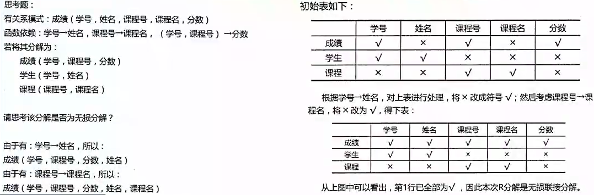
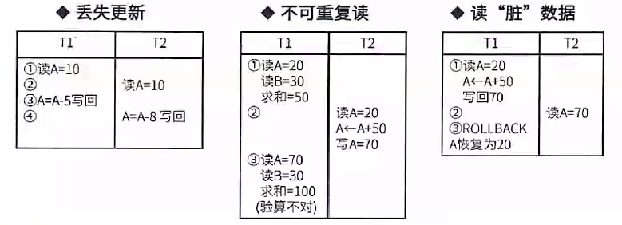

# 一、数据库基本概念

## 数据库

数据：是数据库中存储的基本对象，是描述事物的符号记录。

数据的种类：文本、图形、图像、音频、视频。

数据库DB：是长期存储在计算机内、有组织的、可共享的大量数据的集合。

数据库的基本特征：

- 数据按一定的数据模型组织、描述和存储；
- 可为各种用户共享；
- 冗余度较小；
- 数据独立性较高；
- 易扩展。

## 数据库系统

**数据库系统DBS**：是一个采用了数据库技术，有组织地、动态地存储大量相关数据，方便多用户访问的计算机系统。

其由下面四个部分组成：

数据库（统一管理、长期存储在计算机内的，有组织的相关数据的集合） 

硬件（构成计算机系统包括存储数据所需的外部设备）

软件（操作系统、数据库管理系统DBMS及应用程序）

人员（系统分析和数据库设计人员、应用程序员、最终用户、数据库管理员DBA）

**数据库管理系统DBMS的功能**

实现对共享数据有效的组织、管理和存取。

包括数据定义、数据库操作、数据库运行管理、数据的存储管理、数据库的建立和维护等。

## 三级模式-两级映像

**内模式**：管理如何存储物理的数据，对应具体物理存储文件。

**模式**：**又称为概念模式**，对应的是我们通常使用的**基本表**，根据应用、需求将物理数据划分成一张张表。

**外模式**：对应数据库中的 **视图** 这个级别，将表进行一定的处理后再提供给用户使用

**外模式一模式映像**：是表和视图之间的映射，存在于概念级和外部级之间，若表中数据发生了y，只需要修改此映射，而无需修改应用程序。

**模式一内模式映像**：是表和数据的物理存储之间的映射， 存在于概念级和内部级之间，若修改了数据存储方式，只需要修改此映射，而不需要去修改应用程序。

## 数据库设计

**需求分析**：即分析数据存储的要求，**产出物有数据流图、数据字典、需求说明书。**

**概念结构设计**：就是**设计产出 E-R图**，也即实体-联系图 ，与物理实现无关，说明有哪些实体，实体有哪些属性。

**逻辑性结构设计：**将E-R图，**转换成关系模式**，也即转换成实际的表和表中的列属性，

**物理设计：**根据生成的表等概念，**生成物理数据库。**

## 数据模型

- **概念模型：是从用户的角度进行建模的**，是现实世界到信息世界的第一抽象， 是真正的实体-联系模型（**也就是E-R图**）

- **关系模型：是二维表的形式表示的实体-联系模型，**是将实体-联系模型转换而来的，经过开发人员设计的（**也就具体的数据表**）

- 网状模型：表示实体类型及其实体之间的联系，一个事物和另外几个都有联系，形成一张网

- 面向对象模型：采用面向对象的方法设计数据库，以对象为单位，每个对象包括属性和方法，具有类和继承等特点

  

**数据模型三要素：** **数据结构**（所研究的对象类型的集合）、**数据操作**（对数据库中各种对象的实例允许执行的操作的集合）、**数据的约束条件**（一组完整性规则的集合）。

### E-R模型（概念模型）

用E-R图来描述概念数据模型，世界是由一组称作实体的基本对象和这些对象之间的联系构成的。

在E-R模型中，使用**椭圆表示属性（一般没有）、长方形表示实体、菱形表示联系，联系的两端要填写联系类型**，示例如下图：

**实体**：**客观存在并可相互区别的事物**。可以是具体的人、事、物或抽象概念。如人、汽车、图书、账户、贷款。

**弱实体和强实体**：弱实体依赖于强实体的存在而存在。如上图中 经理和部门经理 这两个实体是依赖员工实体的，所以员工是强实体，经理是弱实体。

**实体集**：具有相同类型和共享相同属性的实体的集合，如学生、课程。

**属性**：**实体所具有的特性**。

**属性分类**：简单属性（如：年龄）和复合属性（如：家庭地址）；单值属性和多值属性；NULL属性；派生属性（计算得来的属性，如通过出生日期计算年龄）。

**域**：属性的取值范围称为该属性的域。

**码**（key）：也叫键，唯一标识实体的属性集。

**联系**：**现实世界中事物内部以及事物之间的联系**，在E-R图中反映为**实体内部的联系和实体之间的联系。**

**联系类型**：**一对一1:1、一对多1:N、多对多M:N。**

### 关系模型

关系模型中的数据逻辑结构是一张 **二维表**，由行列组成，用表格结构表达实体集，用外键表示实体间的联系，如下图：

### E-R模型转换为关系模型

E-R模型转换为关系模型：**每个强实体都对应一个关系模式（表）**；联系分为三种：

1:1联系中，联系可以**放到任意的两端实体中，作为一个属性**（要保证1:1的两端关联），也可以转换为一个单独的关系模式；

1:N的联系中，联系可以单独作为一个关系模式，也可以在**N端中加入1端实体的主键**；

M:N的联系中，联系**必须作为一个单独的关系模式，其主键是M和N端的联合主键**；

## *关系代数

关系模型之间的代数运算，其实就是两张表之间逻辑运算。

**并**：结果是两张表中所有记录数合并，相同记录只显示一次。

**交**：结果是两张表中相同的记录。

**差**：S1-S2，结果是S1表中有而S2表中没有的那些记录。

**笛卡尔积**：S1 X S2，**产生的结果包括S1和S2的所有属性列**，**并且S1中每条记录依次和S2中所有记录组合成一条记录**，**最终属性列为S1+S2属性列，记录数为 S1*S2记录数。**

**投影**：符号用  “$\pi$” 来表示实际是按条件选择某关系模式中的某列，列也可以用数字表示。**投影的是记录列**

**选择**：符号用 ”$\sigma$“ 来表示按条件选择某关系模式中的某条记录。**选择的是记录行**

**自然连接**：符号用 “⋈“ 连接结果显示全部属性列，**但是相同属性列只显示一次**，**显示关系模式中属性相同且值相同的记录**。

## 二、规划化和并发控制

## 函数依赖

给定一个 X，能唯一确定一个Y，就称 X 确定 Y，或者 Y依赖 X。

## 键与约束

有时候叫 **键**，有时候叫 **码**。

**超键**：能**唯一标识**此表的属性的组合。如 “学号+姓名” 就可组成超键。

**候选键**：超键中**去掉冗余的属性**，剩余的属性就是候选键。去掉 “学号+姓名” 中的姓名，剩下的 ”学号“ 就是候选键。

**主键**：**任选一个候选键**，即可作为主键。

**外键**：**其他表中的主键**。

**主属性**：**候选键内的属性为主属性**，其他属性为非主属性。

实体完整性约束：即**主键约束，主键值不能为空，也不能重复。**

参照完整性约束：即外键约束，**外键必须是其他表中己经存在的主键的值， 或者为空。**

用户自定义完整性约束：**自定义表达式约束**，如设定年龄属性的值必须在0到 150之间。

## *范式

### 第一范式1NF

关系中的**每一个列必须是一个不可分的数据项**。通俗地说，第一范式就是表中不允许有小表的存在。比如，对于如下的员工表，就不属于第一范式：

### 第二范式2NF 

**消除部分依赖，部分函数依赖只存在于联合主键的情况，所以单属性的主键必然满足2NF**

如果关系R属于1NF，且每一个非主属性完全函数依赖于任何一个候选码，则R属于2NF。

通俗地说，2NF就是在1NF的基础上，**表中的每一个非主属性不会依赖复合主键中的某一个列。**

按照定义，上面的学生表就不满足2NF，因为学号不能完全确定课程号和成绩 （每个学生可以选多门课）。

将学生表分解为：

学生（学号，学生姓名，系编号，系名，系主任） 

选课（学号，课程号，成绩）。

每张表均属于2NF。

### 第三范式3NF

**消除传递依赖**

在满足**1NF的基础上，表中不存在非主属性对码的传递依赖。**

继续上面的实例，学生关系模式就不属于3NF，因为学生无法直接决定系主任和系名，是由学号->系编号，再由系编号->系主任，系编号-›系名，因此存在非主属性对主属性的传递依赖，

将学生表进一步分解为：

学生（学号，学生姓名，系编号）

系（系编号，系名，系主任）

选课（学号，课程号，成绩） 

每张表都属于3NF。

### BC范式

**BC范式BCNF，是指在第三范式的基础上进一步消除主属性对于码的部分函数依赖和传递依赖。**

### 真题

## *模式分解

范式之间的转换一般都是通过拆分属性，即模式分解，将具有部分函数依赖和传递依赖的属性分离出来，来达到一步步优化，一般分为以下两种：

### 保持函数依赖分解

对于关系模式R，有依赖集F，若对R进行分解，分解出来的多个关系模式，**保持原来的依赖集不变**，则为保持函数依赖的分解。另外，**注意要消除掉冗余依赖** （**如传递依赖**）

实例：设原关系模式R（A,B,C），依赖集F（A->B,，B->C，A->c），将其分解为两个关系模式R1（A,B）和R2（B,C），此时R1中保持依赖A->B，R2保持依赖B->C，说明分解后的R1和R2是保持函数依赖的分解，因为A->C这个函数依赖实际是一个冗余依赖，可以由前两个依赖传递得到，因此不需要管。

### 无损分解

**分解后的关系模式能够还原出原关系模式，就是无损分解，不能还原就是有损。**

两个关系模式：R1交R2->（R1-R2）或者 R1交集R2->（R2-R1）。

三个及以上的关系模式时，可以通过表格法求解，如下：

**成绩表结合函数依赖关系可以还原出原来的关系模式，因此改分解是无损分解。**

## 并发控制

事务：由一系列操作组成，这些操作，要么全做，要么全不做，拥有四种特性，详解如下：

（操作）**原子性**：要么全做，要么全不做。

（数据）**一致性**：事务发生后数据是一致的，例如银行转账，不会存在A账户转出，但是B账户没收到的情况。

（执行）**隔离性**：任一事务的更新操作直到其成功提交的整个过程对其他事务都是不可见的，不同事务之间是隔离的，互不干涉。

（改变）**持续性**：事务操作的结果是持续性的。

事务是并发控制的前提条件，井发控制就是控制不同的事务并发执行，提高系统效率，但是并发控制中存在下面三个问题：

**丢失更新**：事务1对数据A进行了修改并写回，事务2也对A进行了修改并写回， 此时事务2写回的数据会覆盖事务1写回的数据，就丢失了事务1对A的更新。即对数据A的更新会被覆盖。

**不可重复读**：事务2读A，而后事务1对数据A进行了修改并写回，此时若事务2 再读A，发现数据不对。即一个事务重复读A两次，会发现数据A有误。

**读脏数据**：事务1对数据A进行了修改后，事务2读数据A，而后事务1回滚，数据A恢复了原来的值，那么事务2对数据A做的事是无效的，读到了脏数据。

## 封锁协议

**x锁是排它锁（写锁）**若事务T对数据对象A加上X锁，则只允许T读取和修改 A，其他事务都不能再对A加任何类型的锁，直到T释放A上的锁。

**S锁是共享锁（读锁）**若事务T对数据对象A加上s锁，则只允许T读取A，但不能修改A，其他事务只能再对A加S锁（也即能读不能修改），直到T释放A上的 S锁。

**共分为三级封锁协议**，如下：

**一级封锁协议：事务在修改数据R之前必须先对其加X锁，直到事务结束才释放。可解决丢失更新问题。**

**二级封锁协议：一级封锁协议的基础上加上事务T在读数据R之前必须先对其加S锁，读完后即可释放S锁。可解决丢失更新、读脏数据问题。**

**三级封锁协议：一级封锁协议加上事务T在读取数据R之前先对其加S锁，直到事务结束才释放。可解决丢失更新、读脏数据、数据重复读问题。**

# 三、数据库新技术

## 数据库安全

静态转储：**即冷备份**，指在转储期间不允许对数据库进行任何存取、修改操作；

优点是非常快速的备份方法、容易归档（直接物理复制操作）；

缺点是只能提供到某一时间点上的恢复，不能做其他工作，不能按表或按用户恢复。

动态转储：**即热备份**，在转储期间允许对数据库进行存取、修改操作，因此， 转储和用户事务可并发执行；

优点是可在表空间或数据库文件级备份，数据库扔可使用，可达到秒级恢复；

缺点是不能出错，否则后果严重，若热备份不成功，所得结果几乎全部无效。

完全备份：备份所有数据。

差量备份：仅**备份上一次完全备份**之后变化的数据。

增量备份：备份上一次备份之后变化的数据。

日志文件：在事务处理过程中，DBMS把事务开始、事务结束以及对数据库的插入、删除和修改的每一次操作写入日志文件。一旦发生故障，DBMS的恢复子系统利用日志文件撤销事务对数据库的改变，回退到事务的初始状态。

## 分布式数据库

局部数据库位于不同的物理位置，使用一个全局DBMS将所有局部数据库联网管理，这就是分布式数据库。与分布式相对的是集中式数据库。

### 分片模式

水平分片：将表中水平的记录分别存放在不同的地方。

垂直分片：将表中的垂直的列值分别存放在不同的地方。

### 分布透明性

分片透明性：用户或应用程序 **不需要知道逻辑上访问的表具体是如何分块存储的。**

位置透明性：应用程序 **不关心数据存储物理位置的改变。**

逻辑透明性：用户或应用程序 **无需知道局部使用的是哪种数据模型。**

复制透明性：用户或应用程序 **不关心复制的数据从何而来。**

## 数据仓库

### 数据仓库概念

数据仓库是一个**面向主题的、集成的、非易失的、且随时间变化**的数据集合，用于**支持管理决策。**

**面向主题**：按照一定的主题域进行组织的。

**集成的**：数据仓库中的数据是在对原有分散的数据库数据抽取、清理的基础上经过系统加工、汇总和整理得到的，必须消除源数据中的不一致性，以保证数据仓库内的信息是关于整个企业的一致的全局信息。

**相对稳定的**：数据仓库的数据主要供企业决策分析之用，所涉及的数据操作主要是数据查询，一旦某个数据进入数据仓库以后，一般情况下将被长期保留，也就是数据仓库中一般有大量的查询操作，但修改和删除操作很少，通常只需要定期的加载、刷新。

**反映历史变化**：数据仓库中的数据通常包含历史信息，系统记录了企业从过去某一时点（如开始应用数据仓库的时点）到目前的各个阶段的信息，通过这些信息，可以对企业的发展历程和未来趋势做出定量分析和预测。

### 数据仓库体系结构

1. **数据源**：是数据仓库系统的基础，是整个系统的数据源泉，经过抽取、清理、装载、刷新后将异构的数据转储到数据仓库 。
2. **数据的存储与管理**：是整个数据仓库系统的核心。
3. **0LAP（联机分析处理）服务器**：对分析需要的数据进行有效集成，按多维模型组织，以便进行多角度、多层次的分析，并发现趋势。
4. **前端工具**：主要包括各种报表工具、查询工具、数据分析工具、数据挖掘工具以及各种基于数据仓库或数据集市的应用开发工具。

### 商业智能

BI系统主要包括 **数据预处理**、**建立数据仓库**、**数据分析** 和 **数据展现** 四个主要阶段。

- 数据预处理是整合企业原始数据的第一步，它包括数据的**抽取 （Extraction）、转换（Transformation）和加载 （Load） 三个过程（ETL过程）**；
- 建立数据仓库则是处理海量数据的基础；
- 数据分析是体现系统智能的关键，一般采用联机分析处理（OLAP）和数据挖掘两大技术。联机分析处理不仅进行数据汇总/聚集，同时还提供切片、切块、 下钻、上卷和旋转等数据分析功能，用户可以方便地对海量数据进行多维分析。数据挖掘的目标则是挖掘数据背后隐藏的知识，通过关联分析、聚类和分类等方法建立分析模型，预测企业未来发展趋势和将要面临的问题；
- 在海量数据和分析手段增多的情况下，数据展现则主要保障系统分析结果的可视化。

## 反规范化技术

反规范化技术：规范化设计后，数据库设计者希望**牺牲部分规范化来提高性能。**

采用反规范化技术的益处：**降低连接操作的需求、降低外码和索引|的数目，还可能减少表的数目，能够提高查询效率。**

**可能带来的问题**：数据的**重复存储**，浪费了磁盘空间；可能出现数据的完整性问题，为了保障数据的一致性，增加了数据维护的复杂性，会降低修改速度。

具体方法：

（1）增加冗余列：**在多个表中保留相同的列**，通过增加数据冗余减少或避免查询时的连接操作。

（2）增加派生列：在表中增加可以**由本表或其它表中数据计算生成的列**，减少查询时的连接操作并避免计算或使用集合函数。

（3）重新组表：如果许多用户需要查看两个表连接出来的结果数据，则把这**两个表重新组成一个表来减少连接而提高性能**。

（4）水平分割表：根据一列或多列数据的值，**把数据放到多个独立的表中**，主要用于表数据规模很大、表中数据相对独立或数据需要存放到多个介质上时使用。

（5）垂直分割表：对表进行分割，**将主键与部分列放到一个表中**，主键与其它列放到另一个表中，在查询时减少I/O次数。

## 大数据

## SQL语言

### 授权语句

