## 网络功能和分类

计算机网络是计算机技术与通信技术相结合的产物，它实现了远程通信、远程信息处理和资源共享。

计算机网络的功能：**数据通信、资源共享、负载均衡、高可靠性。**

计算机网络按 **分布范围和拓扑结构** 划分如下图所示：

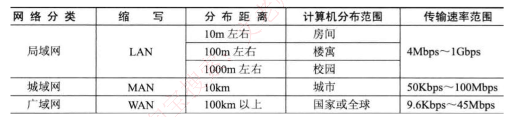

100Mbps 是 100M 比特位每秒，对应的字节数是 12.5M 字节/秒

## OSI七层模型

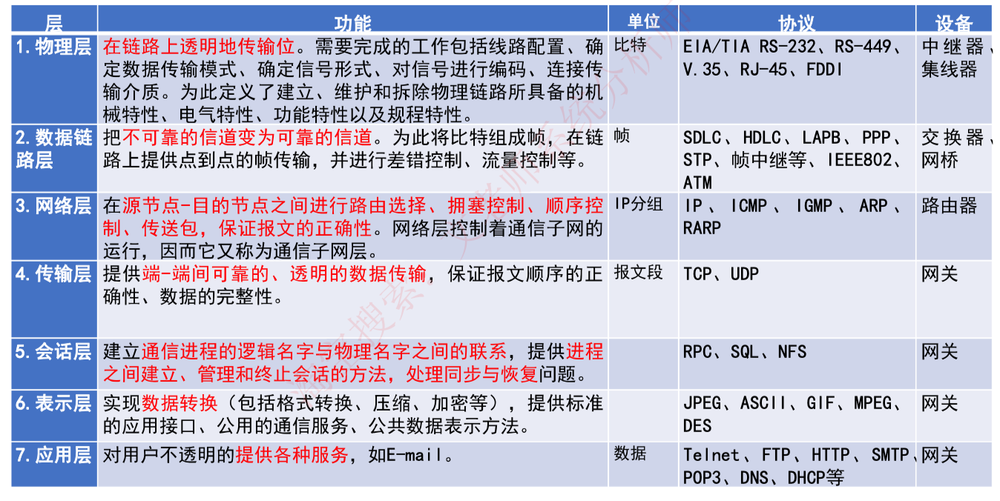

数据链路层确定了设备的mac地址

传输层中的端到端是指的端口

## 局域网和广域网协议

以太网是局域网当前最大的应用，可以说以太网就是局域网。

以太网规范IEEE 802.3 是重要的局域网协议，是有线网局域网协议，包括：

IEEE 802.3 标准以太网 1OMb/s 		传输介质为细同轴电缆

IEEE 802. 3u 快速以太网 IOOMb/s 	双绞线

IEEE 802. 3z 干兆以太网 1000Mb/s	光纤或双绞线

IEEE 802. 3ae 万兆以太网 10Gb/s	  光纤

无线局域网WLAN技术标准：IEEE 802. 11

广域网就是互联网

具体的协议包括：PPP 点对点协议、ISDN 综合业务数字网、xDSL（DSL 数字用户线路的统称：

HDSL、 SDSL、 MVL、 ADSL）、DDN 数字专线、x.25、FR帧中继、ATM异步传输模式。

## TCP/IP协议

网络协议三要素：**语法、语义、时序**。其中语法部分规定传输数据的格式，语义部分规定所要完成的功能，时序部分规定执行各种操作的条件、顺序关系等。

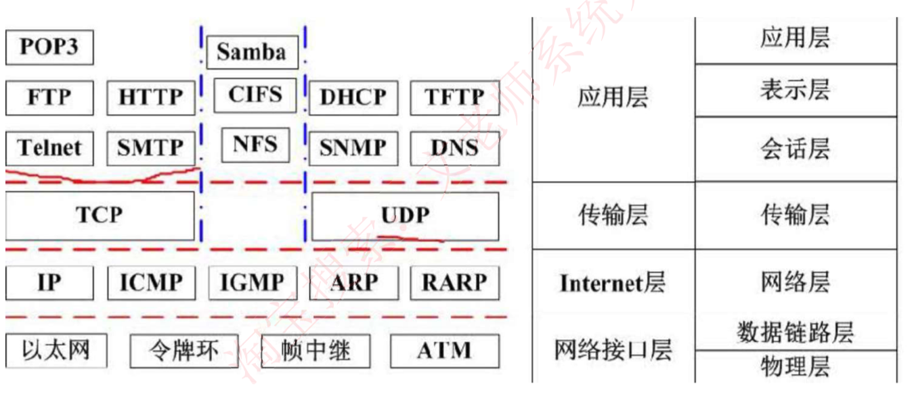

### 网络层协议

IP：网络层最重要的核心协议，在源地址和目的地址之间传送数据报，无连接、不可靠。

ICMP：因特网控制报文协议，用于在IP主机、路由器之间传递控制消息。控制消息是指网络通不通、主机是否可达、路由是否可用等网络本身的消息。

ARP和RARP：地址解析协议，ARP是将IP地址转换为物理地址，RARP是将物理地址转换为IP地址。

IGMP：网络组管理协议，允许因特网中的计算机参加多播，是计算机用做向相邻多目路由器报告多目组成员的协议，支持组播。

### 传输层协议

TCP：整个TCP/IP协议族中最重要的协议之一，在IP协议提供的不可靠数据数据基础上，采用了重发技术，为应用程序提供了一个可靠的、面向连接的、全双工的数据传输服务。一般用于传输数据量比较少，且对可靠性要求高的场合。

UDP：是一种不可靠、无连接的协议，有助于提高传输速率，一般用于传输数据量大，对可靠性要求不高，但要求速度快的场合。 

### 应用层协议

基于TCP的FTP、HTTP等都是可靠传输。基于UDP的DHCP、DNS等都是不可靠传输。

**TCP 部分：**

FTP：可靠的文件传输协议，用于因特网上的控制文件的双向传输。

HTTP：超文本传输协议，用于从WWw服务器传输超文本到本地浏览器的传输协议。使用SSL加密后的安全网页协议为HTTPS。

SMTP和POP3：简单邮件传输协议，是一组用于由源地址到目的地址传送邮件的规则，邮件报文采用ASCII格式表示。

TeInet：远程连接协议，是因特网远程登录服务的标准协议和主要方式。

**UDP 部分：**

TFTP：不可靠的、开销不大的小文件传输协议。

SNMP：简单网络管理协议，由一组网络管理的标准协议，包含一个应用层协议、数据库模型和一组资源对象。该协议能够支持网络管理系统，泳衣监测连接到网络上的设备是否有任何引起管理师行关注的情况。

DHCP：动态主机配置协议，基于UDP，基于C/S模型，为主机动态分配IP地址，有三种方式：固定分配、动态分配、自动分配。

DNS：域名解析协议，通过域名解析出IP 地址。

### 网络协议端口对照表

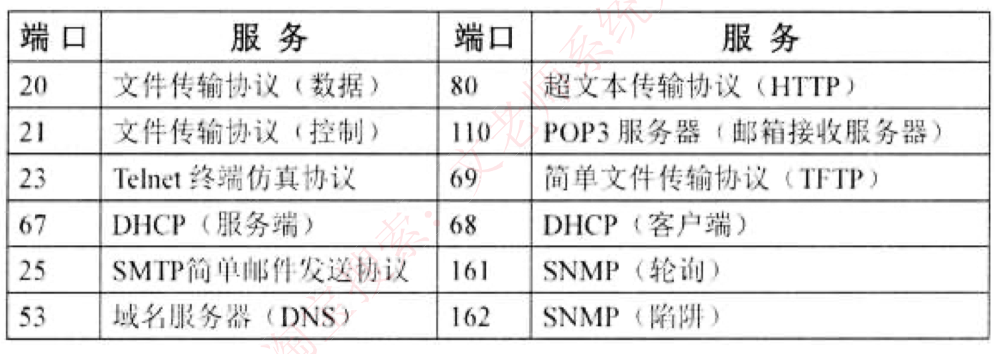

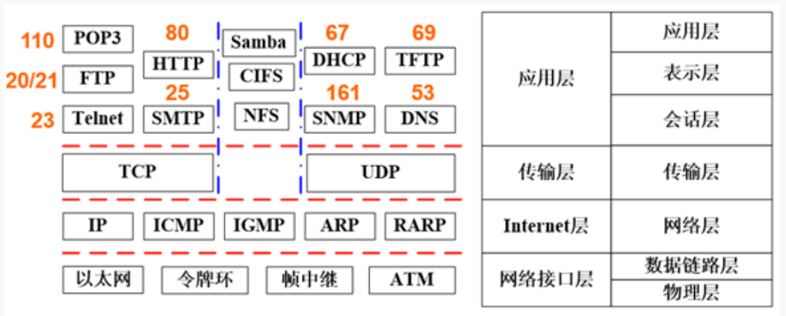

### TCP连接状态

LISTEN： 侦听来自远方的TCP端口的连接请求。

SYN-SENT：在发送连接请求后等待匹配的连接请求。

SYN-RECEIVED：在收到和发送一个连接请求后等待对方对连接请求的确认。

ESTABLISHED：代表一个打开的连接。

FIN-WAIT-1：等待远程TCP连接中断清求，或先前的连接中断请求的确认。

FIN-WAIT-2：从远程TCP等待连接中断请求 CLOSE-WAIT：等待从本地用户发来的连接中断请求。

CLOSING：等待远程TCP对连接中断的确认。

LAST-ACK：等待原来的发向远程TCP的连接中断请求的确认。

TIME-WAIT：等待足够的时间以确保远程TCP接收到连接中断请求的确认。

CLOSED：没有任何连接状态。

## 传输介质

**双绞线**：将多根铜线按规格缠绕在一起，能够减少干扰，分为 **无屏蔽双绞线UTP 和 屏蔽双绞线STP**，双绞线的传输距离在 100m 以内。传输的是电信号。

**光纤：**由纤芯和包层组成，传输的光信号在纤芯中传输，然而从PC端出来的信号都是电信号，要经过光纤传输的话，需要先将电信号转换为光信号。

- **多模光纤MMF：** 纤芯半径较大，因此可以同时传输多种不同的信号，采用发光二极管LED为光源，成本低，但是传输效率和可靠性较低，适合于短距离传输，2KM距离时速率为100Mbps。
- **单模光纤SMF：**纤芯半径很小，一般只能传输一种信号，采用激光二极管LED作为光源，并且只支持激光信号传输，成本高，但是传输距离远，可靠性高，传输距离可达5KM。

## 通信方式和交换方式

通信方向：数据通信是指发送方发送数据到接收方，这个传输过程可以分类如下：

**单工**：只能由设备A发给设备B，即数据流只能单向流动。

**半双工**：设备A和设备B可以互相通信，但是同一时刻数据流只能单向流动。

**全双工**：设备A和设备B在任意时刻都能互相通信。

**同步方式**

异步传输：发送方每发送一个字符，需要约定一个起始位和停止位插入到字符的起始和结尾处， 这样当接收方接收到该字符时能够识别，但是这样会造成资源浪费，传输效率降低。

同步传输：以数据块为单位进行传输，当发送方要发送数据时，**先发送一个同步帧**，接收方收到后做好接收准备，开始接收数据块，**结束后又会有结束帧确认**，这样一次传输一个数据块，效率高。

 

串行传输：**只有一根数据线**，数据只能1bit挨个排队传送，适合低速设备、远距离的传送，一般用于广域网中。

并行传输：**有多根数据线**，可以同时传输多个bit数据，适合高速设备的传送，常用语计算机内部各硬件模块之间。

### 交换方式

电路交换：通信一方进行呼叫，另一方接收后，**在二者之间会建立一个专用电路**，**特点为面向连接**、**实时性高**、**链路利用率低**，一般用于语音视频通信。

报文交换：**以报文为单位，存储转发模式**，接收到数据后先存储，进行差错校验，没有错误则转发，有错误则丢弃，**因此会有延时，但可靠性高，是面向无连接的**。

分组交换：**以分组为单位，也是存储转发模式**，因为分组的长度比报文小，所以时延小于报文交换，又可分为三种方式：

- **数据报**：是现在主流的交换方式，各个分组携带地址信息，自由的选择不同的路由路径传送到接收方，接收方接收到分组后再根据地址信息重新组装成原数据，是面向无连接的，但是不可靠的。 

- **虚电路**：发送方发送一个分组，**接收方收到后二者之间就建立了一个虚拟的通信线路**，二者之间的分组数据交互都通过这条线路传送，在空闲的时候这条线路也可以传输其他数据，是面向连接的，可靠的。
- **信元交换**：**异步传输模式ATM采用的交换方式**，本质是按照虚电路方式进行转发，只不过信元是固定长度的分组，共53B，其中5B为头部，48B为数据域，也是面向连接的，可靠的。

## IP地址

### 分类IP地址

分类IP地址：IP地址分四段，每段八位，共32位二进制数组成。

在逻辑上，这32位IP地址分为网络号和主机号，依据网络号位数的不同，可以将IP地址分为以下几类：

A类地址的网络号为8位，B类地址的网络号位16位，C类地址的网络号位24位。

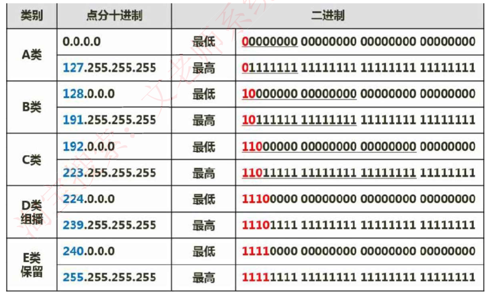

### 无分类编址

因为分类编址，C类地址能表示$2^8-2=254$ 的主机？，能表示的主机太少，B类又太多，不太灵活。

无分类编址：即不按照A B C类规则，自动规定网络号，无分类编址格式为：IP地址/网络号，示例：

128.168.0.11/20 表示的IP地址为128.168.0.11，其网络号占20位，因此主机号占32-20=12位，也可以划分子网。

特殊IP地址

**公有地址：通过它直接访问因特网。是全网唯一的IP地址。**

**私有地址：属于非注册地址，专门为组织机构内部使用，**不能直接访问因特网，下表所示为私有地址范：

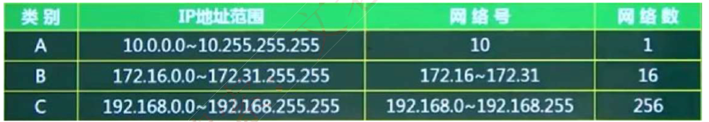

其他特殊地址如下表：

如一个IP地址为 192.168.0.12/24，则表示该IP地址的网络号为24位，那么主机号只有8位。

192.168.0.0/24 这里的主机号为0，表示本网络上的本主机。

 192.168.0.255 这里的主机号全为1，表示在本网络上进行广播。

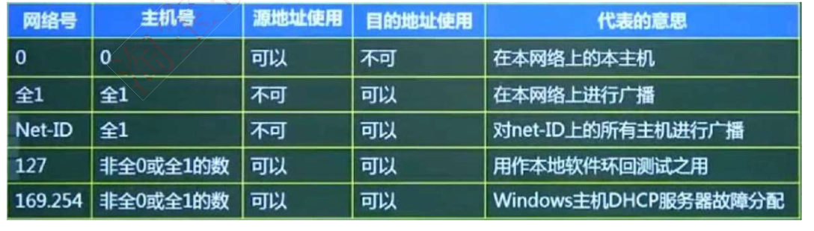

### 子网划分

相当于是把一部分主机号，借出来当作子网号。

子网划分：一般公司在申请网络时，会直接获得一个范围很大的网络，如一个B类地址，因为主机数之间相差的太大了，不利于分配，我们一般采用子网划分的方法来划分网络，**即自定义网络号位数**，就能自定义主机号位数，就能根据主机个数来划分出最适合的方案，不会造成资源的浪费。

因此就有子网的概念，一般的IP地址按标准划分为A B C类后，可以进行再一步的划分，将主机号拿出几位作为子网号，**就可以划分出多个子网，此时IP地址组成为：网络号+子网号+主机号。**

**网络号和子网号都为1，主机号都为0，这样的地址为子网掩码。**

要注意的是：子网号可以为全0和全1，主机号不能为全0或全1，因此，主机数需要-2，而子网数不用。（这里减2的原因是主机号全0表示本机地址，主机号全1表示广播地址）

还可以**聚合网络为超网**，就是划分子网的逆过程，将**网络号取出几位作为主机号**，此时，这个网络内的主机数量就变多了，成为一个更大的网络。

## IPV6

主要是为了解决IPv4地址数不够用的情况而提出的设计方案，1Pv6具有以下特性：

- 1Pv6地址长度为128位，地址空间增大了2^96倍；
- 灵活的1P报文头部格式，使用一系列固定格式的扩展头部取代了IPv4中可变长度的选项字段。IPv6中选项部分的出现方式也有所变化，使路由器可以简单撸过选项而不做任何处理，加快了报文处理速度；

- IPv6简化了报文头部格式，加快报文转发，提高了吞吐量；

- 提高安全性，身份认证和隐私权是IPv6的关键特性；

- 支持更多的服务类型；

- 允许协议继续演变，增加新的功能，使之适应未来技术的发展。
- IPv4和IPv6的过渡期间，主要采用三种基本技术：

（1）**双协议栈**：主机同时运行1Pv4和/Pv6两套协议栈，同时支持两套协议，一般来说IPv4和IPv6地址之间存在某种转换关系，如IPv6的低32位可以直接转换为IPv4地址，实现互相通信。

（2）**隧道技术**：这种机制用来在IPv4网络之上建立一条能够传输IPv6数据报的隧道，例如可以将IPv6 数据报当做IPv4数据报的数据部分加以封装，只需要加一个1Pv4的首部，就能在IPv4网络中传输IPv6报文。**IPV6中常用的3种隧道技术为：6to4隧道、6over4隧道和ISATAP隧道。**

（3）**翻译技术**：利用一台专门的翻译设备（如转换网关），在纯IPv4和纯IPv6网络之间转换/P报头的地址，同时根据协议不同对分组做相应的语义翻译，从而使纯1Pv4和纯IPv6站点之间能够透明通信。

## 网络规划和设计

**核心层**：主要是高速数据交换，实现高速数据传输、出口路由，常用冗余机制。

**汇聚层**：将网络业务连接到接入层，并且实施与安全、流量、负载和路由相关的策略。（网络访问策略控制、数据包处理和过滤、策略路由、广播域定义寻址。）

**接入层**：负责用户信息 （例如用户IP地址，MAC地址和访问日志等）的收集工作和用户管理功能（包括认证和计费等）（主要是针对用户端，实现用户接入、计费管理、MAC地址认证、 MAC地址过滤、收集用户信息，可以使用集线器代替交换机。）

## 建筑物综合布线系统PDS（结构化布线系统）

（1）工作区子系统：实现工作区 **终端设备** 到 **水平子系统的信息插座** 之间的互联。

（2）水平布线子系统：实现 **信息插座** 和 **管理子系统** 之间的连接。

（3）设备间子系统：实现**中央主配线架**与**各种不同设备之间**的连接。

（4）垂直干线子系统：实现**各楼层**设备间子系统之间的互连。

（5）管理子系统：连接**各楼层水平布线子系统 **和 **垂直干缆线**，负责连接控制其他子系统为连接其他子系统提供连接手段。

（6）建筑群子系统：**各个建筑物**通信系统之间的互联：

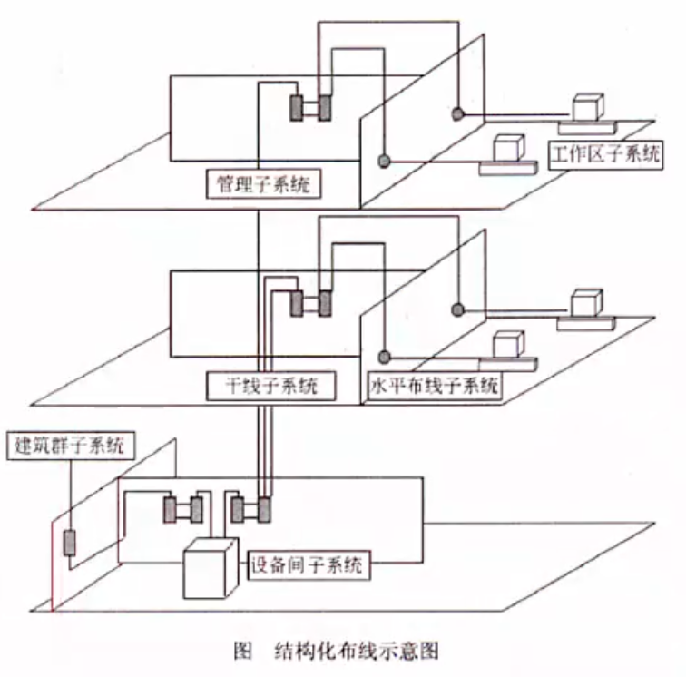

## 磁盘冗余阵列

RAID 即磁盘冗余阵列技术，将数据分散存储在不同磁盘中，可并行读取，可冗余存储，提高磁盘访问速度，保障数据安全性。

**RAID0** 将数据分散的存储在不同磁盘中，磁盘利用率100%，访问速度最快，但是没有提供冗余和错误修复技术

**RAID1 **在成对的独立磁盘上产生互为备份的数据，增加存储可靠性，可以纠错，但磁盘利用率只有50%；

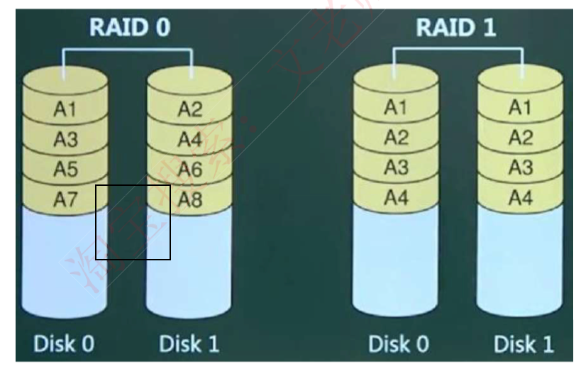

RAID2将数据条块化的分布于不同硬盘上，并使用海明码校验；

RATD3使用奇偶校验，井用单块磁盘存储奇偶校验信息【可靠性低于RATD5）

**RAID5** 在所有磁盘上交叉的存储数据及奇偶校验信息（所有校验信息存储总量为一个磁盘容量， 但分布式存储在不同的磁盘上），读/写指针可同时操作；它可以允许一个磁盘故障，并恢复原始数据。

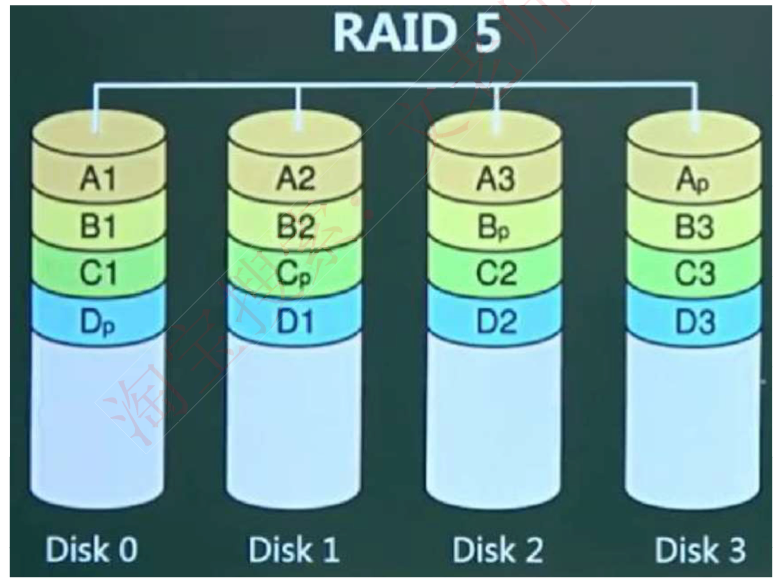

RAID0+1（是两个RAIDO，若一个磁盘损坏，则当前RA1 DO无法工作，即有一半的磁盘无法工作）；

RAID1+0（是两个RAID1，不允许同一组中的两个磁益同时损坏）与RA1D1原理类似，磁盘利用率都只有50%，但安全性更高。

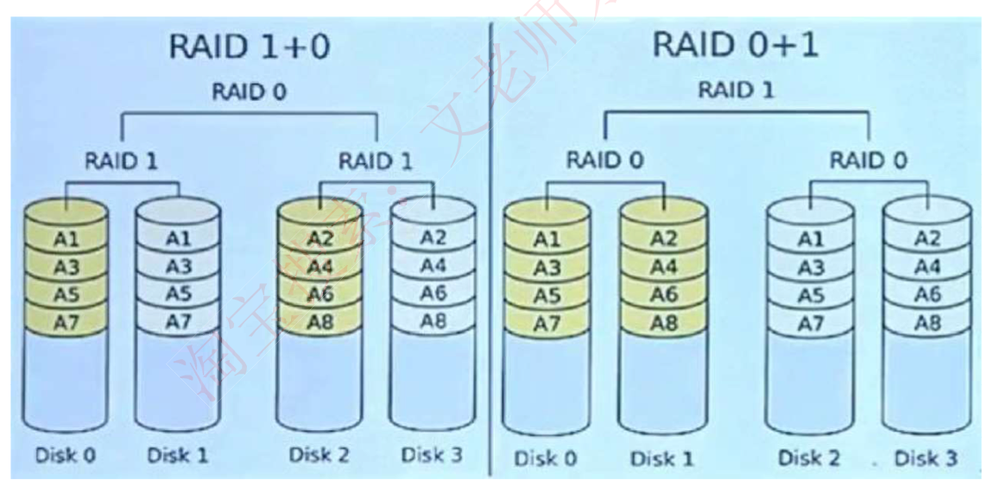

### 真题

## 网络存储技术

**直接附加存储**（DAS）

是指将存储设备直接连接到服务器上使用，本身是硬件的堆叠，在数据共享和连接数量上都受到限制，容量难以扩展升级。

**网络附加存储**（NAS）

通过网络接口与网络直接相连，用户通过网络来访问数据，通过TCP/IP网络，依赖网络性能。

**存储区域网**（SAN）

SAN是通过专用交换机将磁盘阵列与服务器连接起来的高速专用子网，是内部搭建的一个专用的子网，将存储设备从传统的以太网中分离了出来，成为独立的存储区域网络SAN的系统结构，根据数据传输过程采用的协议，其技术划分为FC SAN（光纤通道）、IP SAN（IP网络）和IB SAN（无线带宽）技术。

## 网络地址翻译

公司内有很多电脑，在公司局域网内可以互联通信，但是要访问外部因特网时，只提供固定的少量/P地址能够访问因特网，将公司所有电脑这个大的地址集合映射到能够访问因特网的少量1P地址集合的过程就称为NAT。

很明显，使用了NAT后，一个公司只有少量固定/P地址可以上网，大大减少了IP地址的使用量。

## 默认网关

一台主机可以有多个网关。默认网关的意思是一台主机如果找不到可用的网关，就把数据包发给默认指定的网关，由这个网关来处理数据包。现在主机使用的网关，一般指的是默认网关。默认网关的IP地址必须与本机 P地址在同一个网段内，即同网络号。

## 虚拟局域网VLAN

虚拟局域网VLAN：是一组逻辑上的设备和用户，这些设备和用户并不受物理位置的限制，可以根据功能、部门及应用等因素将它们组织起来，相互之间的通信就好像它们在同一个网段中一样， VLAN工作在OS1参考模型的第2层和第3层，一个VLAN就是一个广播域，VLAN之间的通信是通过第 3层的路由器来完成的。

与传统的局域网技术相比较，VLAN技术更加灵活，它具有以下优点：网络设备的移动、添加和修改的管理开销减少；可以控制广播活动；可提高网络的安全性。

## 虚拟专用网VPN

虚拟专用网VPN：是在公用网络上建立专用网络的技术，其之所以称为虚拟网主要是因为整个 VPN网络的任意两个节点之间的连接并没有传统专网所需的端到端的物理链路，而是架构在公用网络服务商所提供的网络平台，如Internet、 ATM（异步传输模式〉、Frame Relay（帧中继）等之上前逻辑网络，用户数据在逻辑链路中传输。 

**PPP 点对点协议**

PPP：安全认证介绍：PPP的NCP可以承载多种协议的三层数据包。PPP使用LCP控制多种链路的参数 （建立、认证、压缩、回拨）。

PPP的认证类型：pap认证是通过二次握手建立认证（明文不加密），chap挑战握手认证协议，

通过三次握手建立认证（密文采用MD5加密）。PPP的双向验证，采用的是chap的主验证风格。PPP 的加固验证，采用的是两种（pap, chap）验证同时使用

## 冲突域和广播域

路由器可以阻断广播域和冲突域，交换机只能阳断冲突域，因此一个路由器下可以划分多个广播域和多个冲突域；一个交换机下整体是一个广播域，但可以划分多个冲突域；而物理层设备集线器下整体作为一个冲突域和一个广播域。