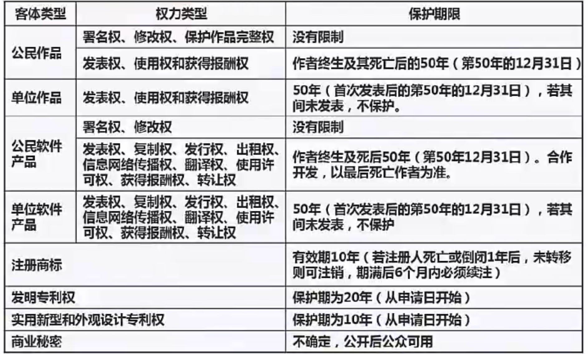
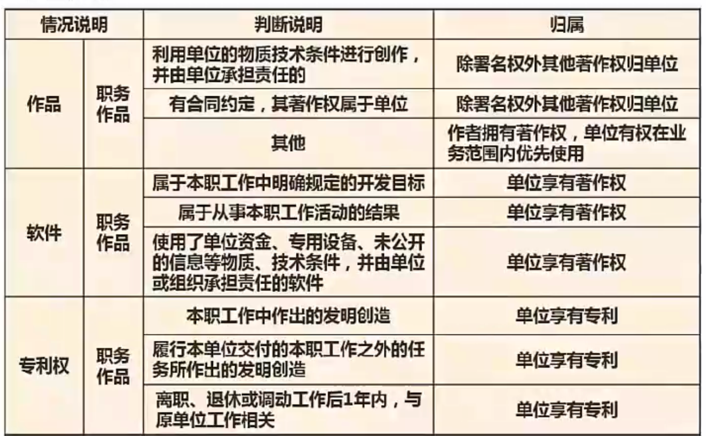
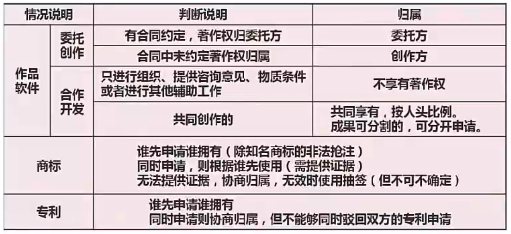
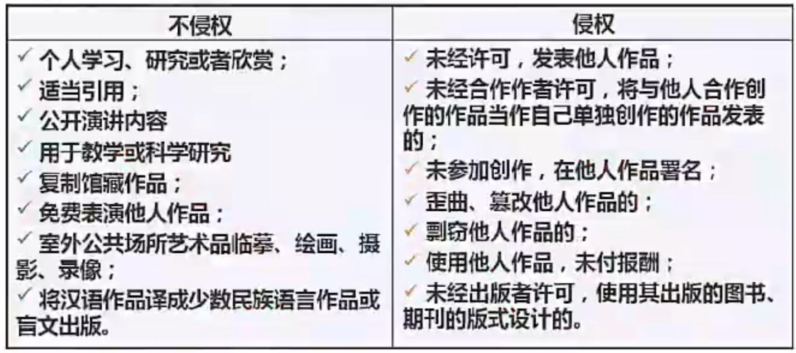

# 知识产权概述

知识产权是指公民、法人、非法人单位对自己的**创造性智力成果和其他科技成果依法享有的民事权**。是**智力成果的创造人**依法享有的权利和在**生产经营活动中标记所有人**依法所享有的权利的总称。包含 **著作权、专利权、商标权**、商业秘密权、植物新品种权、集成电路布图设计权和地理标志权等。

**无体性**：知识产权的对象是没有具体形体，是智力创造成果，是一种抽象的财富。

**专有性**：指除**权利人同意或法律规定外，权利人以外的任何人不得享有或使用该项权利**。

**地域性**：指知识产权**只在授予其权利的国家或确认其权利的国家产生，并且只能在该国范围内受法律保护，而其他国家则不受保护。**

**时间性**：**仅在法律规定的期限内受到保护**，一旦超过期限，权利自行消灭， 相关知识产品即成为整个社会的共同财富，为全人类所共同使用。

**许可使用权的排他性强弱不同，可分为独占使用许可（只能授权方使用，作者自己也不能用）、排他使用许可（作者和授权方都可使用，但不能再给别人授权）和普通使用许可（作者还可以别人授权∆）。**

# 保护期限

知识产权具有地域限制，保护期限 各种情况如下：

# 知识产权人的确定

## 职务作品

## 委托作品

单位和委托的区别在于，当合同中未规定著作权的归属时，著作权默认归于单位，而委托创作中，著作权默认归属于创作方个人，具体如下：

# 侵权标准

中国公民、法人或者其他组织的作品，**不论是否发表，都享有著作权。**

  **开发软件所用的思想、处理过程、操作方法或者数学概念不受保护。**

## 侵权判定

# 标准划分

根据标准制定机构和适用范围的不同，可分为**国际标准、国家标准、行业标准、区域/地方标准和企业标准**

-  国际标准：是指国际标准化组织（ISO）、国际电工委员会（IEC）和国际电信联盟（ITU）制定的标准， 以及国际标准化组织确认并公布的其他国际组织制定的标准。国际标准在世界范围内统一使用，提供各国参考。
- 国家标准：是指由国家标准化主管机构制定或批准发布，在全国范围内统一适用的标准。比如：GB-- 中华人民共和国国家标准；强制性国家标准代号为**GB**，推荐性国家标准代号为GB/T，国家标准指导性文件代号为GB/Z，国军标代号为GJB。ANSI （American National Standards Institute）-美国国家标准协会标准；
- 行业标准：是由某个行业机构、团体等制定的，适用于某个特定行业业务领域的标准。比如：IEEE-- 美国电气电子工程师学会标准；GA-公共安全标准；YD--通信行业标准：
- 区域/地方标准：是由某一区域/地方内的标准化主管机构制定、批准发布的，适用于某个特定区域/地方的标准。比如：EN--欧洲标准；
- 企业标准：是企业范围内根据需要协调、统一的技术要求、管理要求和工作要求所制定的标准，适用于本企业内部的标准。一般以Q字开头，比如Q/320101 RER 007--2012，其中320101代表地区，RER代表企业名称代号，001代表该企业该标准的序号，2012代表年号。

