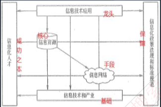
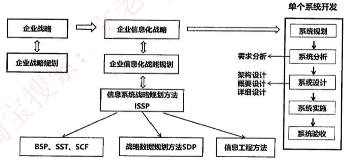
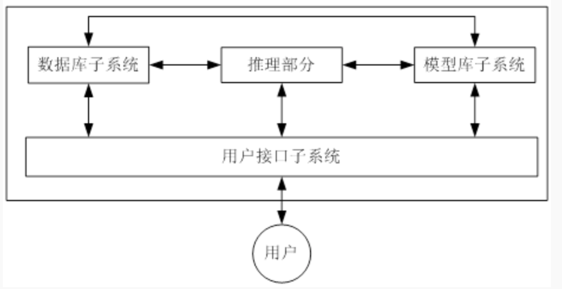

## 工作流管理系统 WfMS

工作流管理系统是一个软件系统，它完成工作流的定义和管理，按照在系统中预先定义好的工作流逻辑进行工作流实例的执行。

工作流管理系统不是企业的业务系统，而是为企业的业务系统的运行提供了一个软件支撑环境。

WfMS的**基本功能**体现在对**工作流进行建模、工作流执行和业务过程的管理和分析。**

WfMS最**基本的组成部分**是工作流参考模型，其包含6个基本模块，分别是**工作流执行服务、工作流引擎、流程定义工具、客户端应用、调用应用和管理监控工具。**

1）工作流执行服务。工作流执行服务是WFMS的核心模块，它的功能包括创建和管理流程定义，创建、管理和执行流程实例。在执行上述功能的同时，应用程序可能会通过编程接口与工作流执行服务交互，一个工作流执行服务可能包含有多个分布式工作的工作流引擎。该模块还为每个用户维护一个活动列表，告诉用户当前必须处理的任务，可以通过电子邮件或者短消息的形式提醒用户任务的到达，例如，在开通课程流程中，当新的课程申请的到来时，可以提示上级主管。

2）工作流引|擎。工作流引擎是为流程实例提供运行环境，并解释执行流程实例的软件模块，即负责流程处理的软件模块。

3）流程定义工具。流程定义工具是管理流程定义的工具，它可以通过图形方式把复杂的流程定义显示出来并加以操作，流程定义工具与工作流执行服务交互，一般该模块为设计人员提供图形化的用户界面。通过流程定义工具，设计人员可以创建新的流程或者改变现有流程，在流程定义时， 可以指定各项活动的参与者的类型、活动之间的相互关系和传递规则等。

4）客户端应用。客户端应用是通过请求的方式与工作流执行服务交互的应用，也就是说，是客户端应用调用工作流执行服务。客户端应用与工作流执行服务交互，它是面向最终用户的界面，可以将客户端应用设计为 B/S架构或C/S架构。

5）调用应用。调用应用是被工作流执行服务调用的应用，调用应用与工作流执行服务交互。为了协作完成一个流程实例的执行，不同的工作流执行服务之间进行交互，它通常是工作流所携带数据的处理程序，常用的是电子文档的处理程序，它们在工作流执行过程中被调用，并向最终用户展示数据，这些应用程序的信息包括名称、调用方式和参数等。例如，在OA 系统中，可以调用相关的程序来直接查看Word文档或者Excel表格数据等。

6） 管理监控工具。管理监控工具主要指组织机构和参与者等数据的维护管理和流程执行情况的监控，管理监控工具与工作流执行服务交互。

WFMS通过管理监控工具提供对流程实例的状态查询、挂起、恢复和销毁等操作，同时提供系统参数和系统运行情况统计等数据。用户可以通过图形或者图表的方式对系统数据进行汇总与统计，并可随时撤销一些不合理的流程实例。

## 信息

信息 **是客观事物状态和运动特征的一种普遍形式**，客观世界中大量地存在、 产生和传递着以这些方式表示出来的各种各样的信息。

控制论创始人维纳认为：**信息就是信息，既不是物质也不是能量。**

香农是信息论的英基者，提出信息是“**用以消除随机不确定性的东西”，确定了信息量的单位为比特 （bit）**。

**信息具有价值，而价值的大小决定于信息的质量，这就要求信息满足一定的质量属性，包括：**

（1） **精确性**，对事物状态描述的精准程度。

（2）**完整性**，对事物状态描述的全面程度，完整信息应包括所有重要事实。

（3）**可靠性**，指信息的来源、采集方法、传输过程是可以信任的，符合预期。

（4）**及时性**，指获得信息的时刻与事件发生时刻的间隔长短。昨天的天气信息不论怎样精确、完整，对指导明天的穿衣并无帮助，从这个角度出发，这个信息的价值为零。

（5）**经济性**，指信息获取、传输带来的成本在可以接受的范围之内。

（6）**可验证性**，指信息的主要质量属性可以被证实或者证伪的程度。

（7）**安全性**，指在信息的生命周期中，信息可以被非授权访问的可能性，可能性越低，安全性越高。

信息具有如下基本属性：

真伪性：真实是信息的中心价值，不真实的信息价值可能为负。

层次性：信息一般和管理层一样，可以为战略层、策略层和执行层3个层次。

不完全性：客观事实的全部信息是不可能得到的。我们需要正确滤去不重要的信息、失真的信息，抽象出有用的信息。

滞后性：信息是数据加工的结果，因此信息必然落后于数据，加工需要时间。

扩压性：信息和实物不同，它可以扩散也可以压缩。

分享性：信息可以分享，这和物质不同，并且信息分享具有非零和性。

## 信息系统发展趋势

我国在“十三五”规划纲要中，将培育 **人工智能、移动智能终端、第五代移动通信（5G）、先进传感器 **等作为新一代信息技术产业创新重点发展，拓展新兴产业发展空间。

当前，**信息技术发展的总超势**是从 **典型的技术驱动发展模式** 向 **应用驱动与技术驱动相结合的模式** 转变，信息技术发展趋势和新技术应用主要包括以下几个方面：

1. 高速度大容量。

2. 集成化和平台化。

3. 智能化。

4. 虚拟计算。

5. 通信技术。

6. 遥感和传感技术。

7. 移动智能终端。

8. 以人为本 。

9. 信息安全。

   

**两化融合：工业化与信息化相融合**

## 国家信息化体系六大要素

- **信息技术应用**：是信息化体系六要素中的龙头，是国家信息化建设的主阵地，集中体现了国家信息化建设的需求与利益；
- **信息资源**：其开发利用是国家信息化的核心任务，是国家信息化建设取得实效的关键，也是我国信息化的薄弱环节；
- **信息网络**：是信息资源开发利用和信息技术应用的基础， 信息传输、交换、共享的必要手段；
- **信息技术和产业**：是我国进行信息化建设的基础；
- **信息化人才**：是国家信息化成功之本，对其他各要素的发展速度和质量起着决定性的影响，是信息化建设的关键；
- **信息化政策法规和标准规范**：用于规范和协调信息化体系六要素之间关系，是国家信息化快速、持续、有序、健康发展的根本保障。

## 电子政务

- 政府对政府G2G：政府之间上级对下级

- 政府对企业G2B：企业到政府办事（即是电子政务也是电子商务
- 政府对公众G2C：公众对政府信息的查询
- 政府对公务员G2E：政府内部工作人员自动化办公，是其他模式的基础

## 信息化战略体系

**企业战略：企业战略是一个目标，企业战略规划是如何实现这个目标。**

**企业战略规划 **利用**机会和威胁评价现在和未来的环境**，**用优势和劣势评价企业现状**，进而选择和确定企业的总体和长远目标，制定和抉择实现目标的行动方案。

**信息系统战略规划 **关注如何**通过信息系统来支撑业务流程的运作**，进而实现企业的关键业务目标，其重点在于对**信息系统远景、组成架构、各部分逻辑关系**进行规划。

**信息技术战略规划**：通常简称为**IT战略规划，是在信息系统规划的基础上**，对支撑信息系统运行的**硬件、软件、支撑环境等进行具体的规划，它更关心技术层面的问题。**

**信息资源规划** 是在以上规划的基础上，为开展具体的信息化建设项目而进行的**数据需求分析、信息资源标准建立、信息资源整合工作**。

**系统规划**：**单个项目的立项分析**，是信息系统生命周期的第一个阶段，期任务是对企业的环境、目标及现有系统的状况进行初步调查，根据企业目标和发展战略，确定信息系统的发展战略，对建设新系统的需求做出分析和预测，同时考虑建设新系统所受的各种约束，研究建设新系统的必要性和可能性。

## 信息系统战略规划

一个企业信息系统的战略规划可分为下面三个阶段：

**第一阶段 以数据处理为核心，围绕职能部门需求**

- **企业系统规划法**（BSP）**自上而下地识别企业目标**、企业过程和数据，然后对数据进行分析，**自下而上地设计信息系统**。**重视数据的创建和使用**，以数据的创建和使用归类，提供一个信息系统规划，建立**cu矩阵（创建create使用use矩阵）**。
- **关键成功因素法**（CSF）重视**关键因素**，每个企业在某阶段都有关键因素，抓住关键信息。
- **战略集合转化法**（SST）将企业的战略信息（环境、目标等）收集起来，**当成一个“信息集合”**，并且**转换**为信息系统的战略信息，全方位的注重企业的战略信息。

**第二阶段 以企业内部MIS（管理信息系统）为核心，围绕企业整体需求**

- **战略数据规划法**（SDP）强调 **建立企业模型和主题数据库**（重点和关键，**是面向业务主题**，整个企业的），**数据类基本上是稳定的，而业务和流程是多变的。**

- **信息工程法**（IE）**第一次提出以工程的方法来建立信息系统**，信息工程是面向企业计算机信息系统建设，以数据为

  中心的开发方法。信息工程方法认为，与企业的信息系统密切相关的三要素是：**企业的各种信息、企业的业务过程和企业采用的信息技术**。信息工程自上而下地将整个信息系统的开发过程划分为四个实施阶段，**分别是信息规划阶段、业务领域分析阶段、系统设计阶段和系统构建阶段。**

- **战略栅格法**（SG）建立一个2*2的矩阵，每个矩阵元素代表过程对**数据类**的创建和使用等。**栅格即划分矩阵**。

**第三阶段 以集成为核心，围绕企业战略需求，综合考虑企业内外环境**

- **价值链分析法**（VCA）将所有对企业有影响的信息作为一个个活动，其都有可能对企业造成**增值**，**分析其中对企业增值最大的信息。**
- **战略一致性模型**（SAM）保证**企业战略和信息系统战略要一致。**

## 企业战略与信息化战略集成

主要方法有**业务和IT整合和企业IT架构**。

**企业IT架构适用于现有信息系统和T基础架构不一致、不兼容和缺乏统一的整体管理的企业。**

业务架构是把企业的业务战略转化为日常运作的渠道，业务战略决定业务架构，它包括业务的运营模式、流程体系、组织结构、地域分布等内容。IT 架构是指导IT投资和设计决策的仃框架，是建立企业信息系统的综合蓝图，包括数据架构、应用架构和技术架构三部分。企业T架构适用于现有信息系统和门基础架构不一致、不兼容和缺乏统一的整体管理的企业。

企业战略与信息化战略的集成主要方法有：业务与T整合 （Business-IT Alignment, BITA） 和企业T架构 （Enterprise IT Architecture, EITA） BITA是一种以业务为导向的、全面的门管理咨询实施方法论。从制订企业战略、建立（改进）企业组织结构和业务流程，到进行T管理和制订过度计划（Transition Plan），使「能够更好地为企业战略和目标服务。BITA 的主要步骤是：评估和分析企业当前业务和T不一致的领域，整理出企业的业务远景和未来战略，建立业务模型，提出达到未来目标的转变过程建议和初步计划，以及执行计划。BITA适用于信息系统不能满足当前管理中的业务需要，业务和江之间总是有不一致的地方。

EITA 分析企业战略，帮助企业制订门战略，并对其投资决策进行指导。在技术、信息系统、信息、TT组织和「流程方面，帮助企业建立「的原则规范、模式和标准，指出江需要改进的方面并帮助制订行动计划。EITA适用于现有信息系统和江基础架构不一致、不兼容和缺乏统一的整体管理的企业。

## 企业信息化

**企业信息化程度** 是国家信息化建设的基础和关键，企业信息化就是企业**利用现代信息技术**，通过**信息资源的深入开发和广泛利用**，实现企业生产过程的自动化、 管理方式的网络化、决策支持的智能化和商务运营的电子化，不断提高生产、经营、管理、决策的效率和水平，进而**提高企业经济效益和企业竞争力**的过程。企业信息化方法主要包括**业务流程重构、核心业务应用、信息系统建设、主题数据库、资源管理和人力资本投资方法。**

**企业信息化一定要建立在企业战略规划基础之上**，以企业战略规划为基础建立的企业管理模式是建立企业战略数据模型的依据。**企业信息化就是技术和业务的融合**。这个“融合”并不是简单地利用信息系统对手工的作业流程进行自动化， 而是需要从**企业战略的层面、业务运作层面、管理运作层面**这3个层面来实现。

**企业信息化 **涉及到对**企业管理理念的创新**，管理科学的核心就是应用科学的方法实施管理，按照市场发展的要求，对企业现有的管理流程重新整合，从作为管理**核心的财务、资金管理**，向**技术、物资、人力资源**的管理，并延伸到**企业技术创新、工艺设计、产品设计、生产制造过程**的管理，**进而扩展到客户关系管理、 供应链的管理乃至发展电子商务**，形成企业内部向外部扩散的全方位管理。

## 企业资源计划ERP 

**企业资源计划ERP** ：**由MRP（物料需求计划**）逐步演变并结合计算机技术的快速发展而来，大致经历了以下四个阶段：

（1）**基本MRP**：聚焦于**相关物资需求问题**，根据生产计划、物料清单、库存信息制定**出相关的物资需求时间表**，从而及时**采购所需物资，降低库存**。**不足：没有考虑企业现有生产能力和采购约束**。

（2）**闭环MRP**：在基本MRP基础上，**增加了生产能力计划、车间作业计划和采购作业计划**，**将整个生产管理过程纳入计划**；并且在计划执行中根据**反馈信息平衡和调整计划，使得生产的各个方面协调统一，形成一个环形回路**。**不足：没有充分考虑资金流**。（）

（3） **MRP2** 指的是**制造资源计划**，将生产、财务、销售、工程技术和采购等**各个子系统集成为一个一体化的系统**。**不足：主要侧重于企业内部人力、财务管理。对于外部的供应商信息没有整合**

（4）**ERP** 是一个以**财务会计为核心**的信息系统，把**客户需求和企业内部的制造活动以及供应商的制造资源整合在一起**，**形成一个完整的供应链 **并对供应链上的所有环节进行有效管理。从而达到 **最佳资源组合，使企业利润最大化。**

**ERP功能：**

（1）**财会管理**：会计核算、财务管理。

（2）**生产控制管理**：主生产计划、物料需求计划、能力需求计划、车间控制、 制造标准。

（3）**物流管理（更准确说是进销存管理 ）**：销售管理、库存控制、采购管理。

（4）**人力资源管理**：人力资源规划的辅助决策、招聘管理、工资核算、工时管理、差旅核算。

**ERP特点：**

（1）**是统一的集成系统。**

（2） **是面向业务流程的系统。**

（3）**是模块化可配置的。**

（4）**是开放的系统**。

企业有三大资源：**物流（物流管理） 资金流（财务管理）、信息流（生产控制管理） **现在一般认为人力资源（人力资源管理）是企业第四大资源。

企业的资源计划可从下面三点来理解：

**管理思想**：ERP首先是一种管理思想，将企业资源分类管理，是管理思想的变革。

**软件产品**：其次，ERP是个软件产品，为企业用户提供一体化的解决方案。

**管理系统**：ERP最后是一个管理系统，存在众多的子系统，这些子系统有统一的规划，是互联互通的，便于事前事中监控。

**ERP的五个层次**

**生产计划大纲** 是根据经营计划的生产目标制定的，是对企业经营计划的细化，用以描述企业在可用资源的条件下，在一定时期中的产量计划。

**主生产计划 **是对企业生产计划大纲的细化，说明在一定时期内的如下计划：生产什么， 生产多少和什么时候交货。

**物料需求计划 **是对主生产计划的各个项目所需的全部制造件和全部采购件的网络支持计划和时间进度计划

**能力需求计划 **是对物料需求计划所需能力进行核算的一种计划管理方法。旨在通过分析比较MRP的需求和企业现有生产能力，及早发现能力的瓶颈所在。

**车间作业计划** 是在MRP所产生的加工制造订单（即自制零部件生产计划）的基础上，按照交货期的前后和生产优先级选择原则以及车间的生产资源情况（如设备、人员、物料的可用性、加工能力的大小等），**将零部件的生产计划以订单的形式下达给适当的车间。**

## 客户关系管理CRM 

客户关系管理CRM：**以客户为中心，提高客户满意度、增加客户的忠诚度。**CRM是一个集成化的信息管理系统，它存储了企业现有和潜在客户的信息，并且对这些信息进行自动的处理从而产生更人性化的市场管理策略。

CRM涵盖的要素主要有：

第一，**CRM以信息技术为手段**，但是CRM绝不仅仅是某种信息技术的应用，它更是一种**以客户为中心的商业策略**，CRM注重的是**与客户的交流**，企业的经营是以客户为中心，而不是传统的以产品或以市场为中心。

第二，CRM在注重**提高客户的满意度的同时**，一定要把**帮助企业提高获取利润**的能力作为重要指标。

第三，CRM的实施要求**企业对其业务功能进行重新设计**，并对工作流程进行重组（BPR），将**业务的中心转移到客户**，同时要**针对不同的客户群体有重点地采取不同的策略。**

**CRM系统的主要模块 **包括 **销售自动化、营销自动化、客户服务与支持、商业智能（BI）**

**CRM的功能**：

- 客户服务：**是CRM的关键内容**，对客户提供的服务，可以提高客户忠诚度。

- 市场营销：包括商机产生、商机获取和管理、商业活动管理和电话营销等；**销售人员与潜在客户的互动行为**、将潜在客户发展为真正客户并保持其忠诚度是使企业赢利的核心因素。
- 共享的客户资料库：是企业的一种重要信息资源，将**市场营销和客户服务连接起来。也是CRM的基础和依托。**
- 分析能力：CRM的一个重要方面在于它**具有使客户价值最大化的分析能力**。对上述获取的资料库进行分析。

**市场营销和客户服务是CRM的支柱性功能。**

CRM的根本要求就是与客户建立一种互相学习的关系，即从与客户的接触中了解他们在使用产品中遇到的问题，以及对产品的意见和建议，并帮助他们加以解决。在与客户互动的过程中，了解他们的姓名、通讯地址、个人喜好以及购买习惯，并在此基础上进行“一对一”的个性化服务，甚至拓展新的市场需求。例如，用户在订票中心预订了机票之后，CRM就会根据了解的信息，向用户提供唤醒服务或是出租车登记等增值服务。因此， CRM解决方案的核心思想就是通过跟客户的“接触”，搜集客户的意见、建议和要求，并通过数据挖掘和分析，提供完善的个性化服务。

一般说来，CRM可由两部分构成，分别是触发中心和挖掘中心。前者指客户和CRM通过多种方式“触发”进行沟通；后者是指对CRM记录、交流、 沟通的信息进行智能分析。由此可见，一个有效的CRM解决方案应该具备以下要素：

1）畅通有效的客户交流渠道（触发中心）。在通信手段极为丰富的今天， 能否支持各种触发手段与客户进行交流，是十分关键的。

2）对所获信息进行有效分析（挖掘中心）。采用数据挖掘和商业智能等技术对收集的信息进行分析。

3）CRM必须能与ERP很好地集成。作为企业管理的前台，CRM的市场营销和客户服务的信息必须能及时传达到后台的财务、生产等部门，这是企业能否有效运营的关键。

CRM的实现过程包含三个方面的工作。一是客户服务与支持，即通过控制服务品质以赢得顾客的忠诚度，例如，对客户快速准确的技术支持、对客户投诉的快速反应、对客户提供产品查询等；二是客户群维系，即通过与顾客的交流实现新的销售，例如，通过交流赢得失去的客户等；三是商机管理，即利用数据库开展销售，例如，利用现有客户数据库做新产品推广测试，通过电话或电子邮件促销调查，确定目标客户群等。

## 供应链管理SCM 

供应链管理SCM：是一种集成的管理思想和方法，是在满足服务水平要求的同时，为了使系统成本达到最低而采用的将供应商、制造商、仓库和商店有效地结合成一体來生产商品，有效地控制和管理各种**信息流、资金流和物流**，**并把正确数量的商品在正确的时间配送到正确的地点的一套管理方法。**

（1）以客户为中心。SCM追求的目标首先是满足客户的需求；衡量SCM绩效的最重要的指标就是客户满意度。

（2）集成化管理。SCM的本质在于集成化管理。

（3）扩展性管理。现代的SCM使传统的企业向扩展性企业发展。

（4）合作管理。SCM非常强调企业之间的合作，打破传统的封闭的经营意识， 通过供应链中各个节点企业之间建立起新型的合作关系。

（5）多层次管理。包括公司战略层次、战术层次和作业层次上的活动，主要目标是通过系统的观点，对多个职能和各个层次的供应商进行整合。

**信息流分类：**

需求信息流（如客户定单、生产计划、采购合同等）。

供应信息流（如入库单、完工报告单、库存记录、可供销售量、提货发运单等）。

**供应链节点**：**供应商、制造商、分销商、零售商、仓库、配送中心、客户等。**

每个企业内部都有一条或者几条供应链，每个企业也都处于一条供应链的某个节点中，SCM要注意的就是供应网络的构造，处于供应链中的企业是利益共同体，如何实现协作运营。

SCM包括计划、采购、制造、配送、退货五大基本内容。

- 计划：这是SCM的策略部分，企业需要有一个策略来管理所有的资源，以满足客户对产品的需求。好的计划是建立一系列的方法监控供应链。
- 采购：选择能为企业提供产品和服务的供应商。
- 制造：安排生产、测试、打包和准备送货所需的活动，是供应链中测量内容最多的部分。
- 配送：即物流，是调整用户的订单收据、建立仓库网络、拍递送人员提货并送货、建立产品计价系统、接收付款。
- 退货：是供应链中的问题处理部分。

## 决策支持系统DSS

决策支持可以分为 **结构化决策、半结构化决策和非结构化决策。**

**结构化决策** 是指对某一决策过程的规则进行**确定性描述与建模**，以适当的算法产生决策方案，**并能从多种方案中选择最优解**；

**非结构化决策** 的决策过程复杂，**不可能用确定的模型和语言描述其决策过程， 更无所谓最优解。**

半结构化和非结构化决策一般用于企业的中、高级管理层。一般来说，决策往往不可能一次完成，而是一个迭代的过程。

决策支持系统（Decision Support System，DSS）是辅助决策者通过数据、模型和知识，以人机交互方式进行半结构化或非结构化决策的计算机应用系统。它是MIS向更高一级发展而产生的先进信息系统。它为决策者提供分析问题、建立模型、模拟决策过程和方案的环境，调用各种信息资源和分析工具，帮助决策者提高决策水平和质量。但是，DSS不可以代替决策者。

DSS基本结构主要由四个部分组成，分别是数据库子系统、模型库子系统、推理部分和用户接口子系统，如图2所示。

## 知识管理

今明确知识和信息的区别，知识是由信息推导出来的，人类智慧和经验的集合。

**显性知识**：例如文档、资料、视频等能够看得见的知识。

**隐性知识**：存在于人脑海中的知识，包括人的记忆与经验技巧，理想抱负等。

知识管理应该探寻如何将隐性知识转化为显性知识，达到共享的目的，有如下三种工具可以实现：

**知识生成工具**：获取知识的工具，包括知识获取、知识合成、知识创新。

**知识编码工具**：如何表达知识的工具。

**知识转移工具**：知识需要传播，达到共享的目的，传播过程中会遇到困难和差异，包括时间差异、空间差异和社会差异。

## 企业门户

**企业网站**：注重消息的单向传送展示，缺乏信息互动，是企业门户的雏形，**静态单向。**

**企业信息门户EIP**：**网站里包含信息流**，在互联网模式下，将企业的各种应用系统、数据资源和互联网资源统一集成在企业门户下，提供企业的产品和用户的信息，达到信息共享，使得企业相关的供应链、客户通过此门户获得所需的信息，快速了解企业文化。

**企业知识门户EKP**：**网站里有学习知识的**，企业网站的基础上增加知识性内容，企业员工可通过EKP 了解今天企业所发生的事情，找到与自己相关的项目资源信息，建立了一个企业知识库，能够提高企业员工的工作效率。

Kk

**企业应用门户EAP**：**以业务流程为中心，**对企业业务流程的集成，以业务流程和企业应用为核心， 把业务流程中功能不同的应用模块通过门户技术集成在一起，企业员工和合作伙伴可以通过EAP访问相应的应用系统，实现移动办公。

**企业通用门户**：将上述四者有机的融合在一起。

## 企业应用集成

**用于消除信息孤岛**

**表示集成**：即界面集成，是最原始的集成，黑盒集成，**表示层集成**。将多个信息系统的界面集成在一起，统一入口，为用户提供一个看上去统一，但是由多个系统组成的应用系统的集成，例如桌面。

**数据集成**：白盒集成，**会在数据库的上层中间件层做集成**，把不同来源、格式、特点性质的数据在逻辑上或者物理上有机的集中，从而为企业提供全面的数据共享。如数据仓库。

**控制集成** （功能集成、 应用集成）：黑盒集成， **业务逻辑层次的集成**，可以借助于远程过程调用或远程方法调用、面向消息的中间件等技术，将多个应用系统功能进行绑定，使之像一个实时运行的系统一样接受信息输入和产生数据输出，实现多个系统功能的叠加。如钉钉。

**业务流程集成**：即过程集成，最彻底的、综合的集成，这种集成超越了数据和系统，由一系列基于标准的、统一数据格式的工作流组成。当进行业务流程集成时，企业必须对各种业务信息的交换进行定义、授权和管理，以便于改进操作、减少成本、提高响应速度。

它包括应用集成、B2B集成、自动化业务流程管理、人工流程管理、企业门户， 以及对所有应用系统和流程的管理和监控等。

如电子购物网站-第三方支付平台-银行-物流等流程集成。

## 电子商务

电子商务分三个方面：电子商情广告、电子选购和交易；电子交易凭证的交换、电子支付与结算；网上售后服务等。

参与电子商务的实体有四类：**顾客**（个人消费者或集团购买）、**商户**（包括销售商、制造商和储运商）、**银行**（包括发卡行和收单行）**及认证中心**。

按照交易对象，电子商务模式包括：

- B2B模式，企业对企业。
- B2C模式，企业对消费者。
- C2C，消费者对消费者。
- O2O即Online To Offline，含义是线上购买线下的商品和服务，实体店提货或享受服务。

电子商务的基础设施包括：网络基础设施、多媒体内容和网络出版的基础设施、报文和信息传播的基础设施、商业服务的基础设施。此外，技术标准，政策、法律等是电子商务系统的重要保障和应用环境。