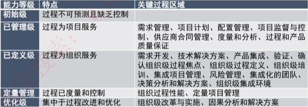
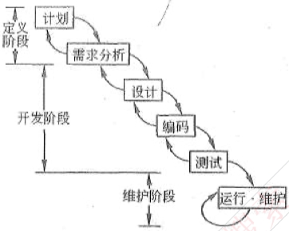
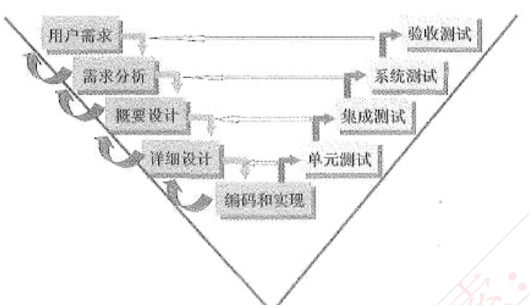
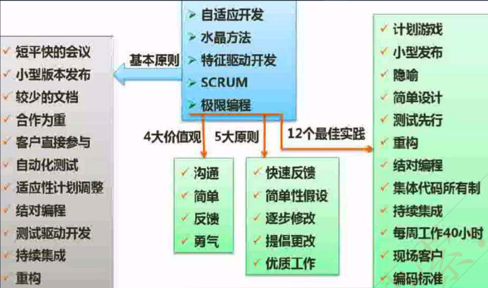

# 信息系统生命周期

## 系统规划阶段

任务是对组织的环境、目标及现行系统的状况进行**初步调查**，根据组织目标和发展战略确定信息系统的发展战略，**对建设新系统的需求做出分析和预测**，同时考虑建设新系统所受的各种约束，研究建设新系统的必要性和可能性。根据需要与可能，给出制建系统的备选方案。

**输出：可行性研究报告、系统设计任务书。**

## 系统分析阶段

任务是根据系统设计任务书所确定的范围，对现行系统进行详细调查，描述现行系统的业务流程，指出现行系统的局限性和不足之处，确定新系统的基本目标和逻辑功能要求，即提出新系统的逻辑模型。系统分析阶段又称为**逻辑设计阶段**。这个阶段是**整个系统建设的关键阶段**，也是信息系统建设与一般工程项目的重要区别所在。

**输出：系统说明书（需求规格说明书）。**

## 系统设计阶段

系统分析阶段的任务是回答系统“做什么”的问题，而系统设计阶段要回答的问题是“怎么做”。该阶段是称为**物理设计阶段**，该阶段的任务是根据系统说明书中规定的功能要求，具体设计实现逻辑模型的技术方案，也就是设计新系统的物理模型。这个阶段又称为物理设计阶段，可分为**总体设计（概要设计）和详细设计**两个子阶段。

**输出：系统设计说明书（概要设计、详细设计说明书）**

## 系统实施阶段

是将设计的系统付诸实施的阶段。这一阶段的任务包括计算机等设备的购置、安装和调试、 程序的编写和调试、人员培训、数据文件转换、系统调试与转换等。这个阶段的特点是几个互相联系、互相制约的任务同时展开，必须精心安排、合理组织。系统实施是按实施计划分阶段完成的，每个阶段应写出实施进展报告。系统测试之后写出系统测试分析报告。

**输出：实施进展报告、系统测试分析报告。**

## 系统运行和维护阶段

系统投入运行后，需要经常进行维护和评价，记录系统运行的情况，根据一定的规则对系统进行必要的修改，评价系统的工作质量和经济效益。

# 能力成熟度模型

**能力成熟度模型CMM  衡量组织的做软件的能力成熟度**

| 能力等级               | 特点                                                         |
| ---------------------- | ------------------------------------------------------------ |
| 初始级（Initia）       | 软件过程的特点是**杂乱无章**，有时甚至很混乱，几乎没有明确定义的步骤，项目的成功**完全依赖个人的努力和英雄式核心人物的作用**。 |
| 可重复级（repeatable） | 建立了基本的**项目管理过程和实践**来跟踪项目费用、进度和功能特性，有**必要的过程准则来重复**以前在同类项目中的成功。 |
| 已定义级（Defined）    | **管理和工程两方面的软件过程已经文档化、标准化，并综合成整个软件开发组织的标准软件过程**。所有项目都采用根据实际情况修改后得到的**标准软件过程来发和维护软件。** |
| 已管理级（M anaged）   | 制定了软件过程和产品质量的**详细度量标准**。对软件过程和产品质量有定量的理解和控制。 |
| 优化级 （Opti mized）  | 加强了定量分析，通过来自过程质量反馈和来自新观念、新技术的反馈使过程能**不断持续地改进** |

**能力成熟度模型集成CMMI**

Capability Maturity Model Integration

是若干过程模型的综合和改进，不仅仅软件，而是支持多个工程学科和领域的、 系统的、一致的过程改进框架，能适应现代工程的特点和需要，能提高过程的质量和工作效率。

CMMI两种表示方法： 

（1）阶段式模型：类似于CMM，它关注组织的成熟度，五个成熟度模型如下：

## CMM 和 CMMI对比

CMMI Capability Maturity Model Integration  是CMM 模型的最新版本。

最新的是更关注组织的能力成熟度，能力能够度量是优先级前最重要的，只不过CMM中用已管理级来表示可以详细度量，CMMI中用更明确的定量管理来描述。

# *软件开发模型

## 常见开发模型及特点

**瀑布模型**：严格遵循软件生命周期各阶段的固定顺序，一个阶段完成再进入另一个阶段。其优点是可以使过程比较规范化，有利于评审；缺点在于过于理想，缺乏灵活性，容易产生需求偏差。

**快速原型模型**：对于许多需求不够明确的项目，比较适合采用该模型。它采用了一种动态定义需求的方法，通过快速地建立一个能够反映用户主要需求的软件原型，让用户在计算机上使用它， 了解其概要，再根据反馈的结果进行修改，因此线路充分体现用户的参与和决策。

**演化模型**：也是一种原型化开发，但与快速原型不同的是，快速原型模型在获得真实需求时，就将抛弃原型。而演化模型则不然，它将从初始的模型中逐渐演化为最终软件产品，是一种“渐进式”原型法。

**增量模型**：它采用的是一种“递增式”模型，它将软件产品划分成为一系列的增量构件，分别进行设计、编码、集成和测试。

**螺旋模型**：结合了瀑布模型和演化模型的优点，最主要的特点在于加入了风险分析。它是由制定计划、风险分析、实施工程、客户评估这一循环组成的，它最初从概念项目开始第一个螺旋。

**喷泉模型**：主要用于描述面向对象的开发过程，最核心的特点是迭代。所有的开发活动没有明显的边界，允许各种开发活动交叉进行。

**统一过程**（up）：统一过程是一个通用过程框架，可以用于种类广泛的软件系统、不同的应用领域、不同的组织类型、不同的性能水平和不同的项自规模。UP是基于构件的，在为软件系统建模时，UP使用的是UML。与其他软件过程相比，Lp具有三个显著的特点，即用例驱动、以架构为中心、迭代和增量。

**敏捷方法**：敏捷方法是一种以人为核心、迭代、循序渐进的开发方法。在敏捷方法中，软件项目的构建被切分成多个子项目，各个子项目成果都经过测试，具备集成和可运行的特征。在敏捷方法中，从开发者的角度来看，主要的关注点有短平快的会议、小版本发布、较少的文档、合作为重、客户直接參与、自动化测试、适应性计划调整和结对编程；从管理者的角度来看，主要的关注点有测试驱动开发、持续集成和重构。

## 瀑布模型

瀑布模型（SDLC）：瀑布模型是一个经典的软件生命周期模型， 一般将软件开发分为：可行性分析（计划〉、需求分析、软件设计（概要设计、详细设计）、编码（含单元测试）、测试、运行维护等几个阶段。

瀑布模型特点

1. 从上一项开发活动接受该项活动的工作对象作为输入。

2. 利用这一输入，实施该项活动应完成的工作内容。

3. 给出该项活动的工作成果，作为输出传给下一项开发活动。

4. 对该项活动的实施工作成果进行评审。若其工作成果得到确认，则继续进行下一项开发活动；否则返回前一项，甚至更前项的活动。尽量减少多个阶段间的反复。以相对来说较小的费用来开发软件
5. **适合需求明确的模型**

## 原型模型

**比如搭建静态页面先看是否满足用户需求**

原型化模型第一步就是创建一个快速原型，能够满足项目干系人与未来的用户可以与原型进行交互，再通过与相关干系人进行充分的讨论和分析，最终弄清楚当前系统的需求，进行了充分的了解之后，在原型的基础上开发出用户满意的产品。

原型法认为在很难一下子全面准确地提出用户需求的情况下，原型应当具备的特点如下。

（1） 实际可行

（2）具有最终系统的基本特征

（3）构造方便、快速，造价低。原型法的特点在于原型法对用户的需求是动态响应、逐步纳入的。

## 螺旋模型

**结合了原型模式和瀑布模式，用于应对有风险的系统设计。**

螺旋模型是一个演化软件过程模型，将原型实现的迭代特征与线性顺序（瀑布）模型中控制的和系统化的方面结合起来。在螺旋模型中，软件开发是一系列的增量发布。

今开发过程具**有周期性重复的螺旋线状**。四个象限分别标志每个周期所划分的四阶段：**制订计划、风险分析、实施工程和客户评估。**

**螺旋模型强调了风险分析，特别适用于庞大而复杂的、高风险的系统。**  

## V模型

**V模型更侧重于测试对于整个生命周期的重要性**

V 模型从整体上看起来，就是一个V字型的结构，由左右两边组成。左边的下画线分别代表了需求分析、概要设计、详细设计、编码。右边的上画线代表了单元测试、集成测试、 系统测试与验收测试。v模型的特点如下：

**（1）单元测试的主要目的是针对编码过程中可能存在的各种错误；**

**（2）集成测试的主要目的是针对详细设计中可能存在的问题；**

**（3）系统测试主要针对概要设计，检查系统作为一个整体是否有效地得到运行；**

**（4）验收测试通常由业务专家或者用户进行，以确认产品能真正符合用户业务上的需要。**

**（5）v模型用于需求明确和需求变更不频繁的情形。**

## 增量模型

**先完成核心功能，非核心功能后续迭代**

增量模型：首先**开发核心模块功能**，而后与用户确认，之后再开发次核心模块的功能，即每次开发一部分功能，并与用户需求确认，最终完成项目开发， 优先级最高的服务最先交付。

特点：但由于并不是从系统整体角度规划各个模块，因此不利于模块划分。

难点在于如何将客户需求划分为多个增量。与原型不用的是增量模型的每一次增量版本都可作为独立可操作的作品，而原型的构造一般是为了演示。

## 敏捷开发

>**频繁的小型发布，减少繁琐的文档**
>
>从开发者的角度来看，主要的关注点有**短平快的会议、小版本发布、较少的文档、合作为重、客户直接参与、自动化测试、适应性计划调整和结对编程；**
>
>从管理者的角度来看， 主要的关注点**有测试驱动开发、持续集成和重构。综上，敏捷开发更关注成果，也就是实施和测试。**

敏捷开发是一种**以人为核心、迭代、循序渐进的开发方法**，相对于传统软件开发方法的”非敏捷〞，更强调程序员团队与业务专家之间的紧密协作、面对面的沟通（认为比书面的文档更有效）、频繁交付新的软件版本、紧凑而自我组织型的团队、能够很好地适应需求变化的代码编写和团队组织方法，也更注重软件开发中人的作用。

敏捷软件开发宣言：

1. 个体和交互胜过过程和工具

2. 可以工作的软件胜过面面俱到的文档

3. 客户合作胜过合同谈判

4. 响应变化胜过遵循计划

    

**敏捷开发特点：**

- 结对编程：**一个程序员开发，另一个程序在一旁观察审查代码**，能够有效的提高代码质量，在开发同时对代码进行初步审查，共同对代码负责。
- 自适应开发：强调开发方法的适应性 （Adaptive）。不象其他方法那样有很多具体的实践做法，它**更侧重为软件的重要性提供最根本的基础**，并从更高的组织和管理层次来阐述开发方法为什么要具备适应性。

- 水晶方法：每一个不同的项目都需要一套不同的策略、约定和方法论。

- 特性驱动开发：是一套针对中小型软件开发项目的开发模式。是一个**模型驱动的快速迭代开发过程**，它强调的是简化、实用、易于被开发团队接受，适用于需求经常变动的项目。

- 极限编程XP：核心是沟通、简明、反馈和勇气。因为知道计划永远赶不上变化，XP无需开发人员在软件开始初期做出很多的文档。**XP提倡测试先行**，为了将以后出现bug的几率降到最低。

- 并列争球法SCRUM：是一种迭代的增量化过程，把**每段时间（30天）一次的迭代称为一个“冲刺”**，并按需求的优先级别来实现产品，多个自组织和自治的小组并行地递增实现产品。

## 统一过程RUP/UP

UP是一个优秀的软件开发模型，它提供了完整的开发过程解决方案，可以有效的降低软件开发过程的风险。

UP是一个二维的结构，UP是一个很有特色的模型，它本身是一个二维的结构，如图所示。对于UP而言，时间主线就是横轴的阶段，随着时间的流逝，软件开发活动总要经过初始、细化、构建和交付这4个阶段方能完成。而纵轴的工作流程则描述了在不同的阶段需要进行的主要工作。例如在初始阶段，软件组织需要进行大量的调研，对软件进行业务建模、需求，同时进行一些设计以验证建模的合理性，还要进行一些实施甚至测试和部署的工作，用以验证需求和设计的工作及开发系统原型，当然配置与变更管理、项目管理和环境是在任何阶段都是不能缺少的。

**9个核心工作流**：6+2+1

1. 业务建模
2. 需求
3. 分析设计
4.  实施
5.  测试
6.  部署
7.  配置与变更管理
8.  项目管理
9. 环境

**4个阶段： **初始阶段、细化阶段、构建阶段和交付阶段**。每个阶段结束时都要安排一次技术评审，以确定这个阶段的目标是否已经达

- **初始阶段**：业务建模 和 需求（如获取需求的方式
- **细化阶段**：分析设计（如微服务架构
- **构建阶段**：实施 和 测试
- **交付阶段**：部署

**3个显著特点：**  **用例驱动、以架构为中心、迭代和增量。**

- **用例驱动**

- **以架构为中心**

  架构设计师在UP活动中承担着非常重要的角色。在UP中，架构设计师除了需要建立系统架构模型外，还需要：
  （1）同需求人员和项目管理人员密切协作。
  （2）细化软件架构。
  （3）保持整个架构的概念完整性。

  具体地说，架构设计师不但需要设计系统架构，还需要定义设计方法、设计指南、编码指南、评审设计等工作。因此，有人也称UP是一个以架构为中心的开发模型。

- **迭代和增量**

  （1）UP是一个迭代的二维开发模型，在生命周期的每一阶段都可以进行需求、设计等活动。UP不但给出了迭代的生命周期，还给出了生命周期每一阶段的迭代指南。

## 喷泉模型

**以用户需求为动力，以对象作为驱动，用面向对象的开发方法。**

# 信息系统开发方法

结构是指系统内各个组成要素之间的相互联系、相互作用的框架。

粒度的问题

结构化的粒度是模块，面向对象的粒度是对象和类， 面向构件的粒度是组件，面向服务的粒度是服务

## 结构化方法

**适合需求明确的项目**

结构化方法也称为生命周期法，是一种传统的信息系统开发方法，由**结构化分析 （Structured Analysis, SA） 结构化设计 （Structured Design, SD） 和结构化程序设计（Structured Programming，SP）**三部分有机组合而成，其精髓是**自顶向下的设计系统、逐步求精和模块化**设计。

> （作答此空）的开发过程一般是先把系统功能视作一个大的模块，再根据系统分析与设计的要求对其进行进一步的模块分解或组合。
>
> 从整体到局部，从大到小也是自顶向下的另外一种说法。

**结构化方法的主要特点：**

（1）**开发目标清晰化**。结构化方法的系统开发遵循“用户第一”的原则。

（2）**开发工作阶段化**。每个阶段工作完成后，要根据阶段工作目标和要求进行审查，这使各阶段工作有条不紊地进行，便于项目管理与控制。

（3）**开发文档规范化**。结构化方法每个阶段工作完成后，要按照要求完成相应的文档，以保证各个工作阶段的衔接与系统维护工作的遍历。

（4）**设计方法结构化**。在系统分析与设计时，从整体和全局考虑，自顶向下地分解；在系统实现时，根据设计的要求，先编写各个具体的功能模块，然后**自底向上逐步实现整个系统**

**结构化方法的不足和局限：**

（1）**开发周期长**：按顺序经历各个阶段，直到实施阶段结束后，用户才能使用系统。

（2）**难以适应需求变化**：不适用于需求不明确或经常变更的项目。

（3）**很少考虑数据结构**：结构化方法是一种面向过程，面向数据流的开发方法，很少考虑数据结构。

**结构化方法常用工具：**

结构化方法一般利用图形表达用户需求，常用工具有**数据流图、数据字典、结构化语言、判定表以及判定树**等，

## 面向对象方法

面向对象 （Object-Oriented，OO）方法认为，客观世界是由各种对象组成的，任何事物都是对象，每一个对象都有自己的运动规律和内部状态，都属于某个对象类，是该对象类的一个元素。复杂的对象可由相对简单的各种对象以某种方式而构成，不同对象的组合及相互作用就构成了系统。

**面向对象方法的特点：**

（1）使用OO方法构造的系统具有**更好的复用性**，其关键在于建立一个全面、 合理、统一的模型（用例模型和分析模型〉。

（2）OO方法也划分阶段，但其中的系统分析、系统设计和系统实现三个阶段之间**已经没有“缝隙”**。也就是说，这三个阶段的界限**变得不明确**，某项工作既可以在前一个阶段完成，也可以在后一个阶段完成；前一个阶段工作做得不够细，在后一个阶段可以补充。

（3）**面向对象方法可以普遍适用于各类信息系统的开发。**

**面向对象方法的不足之处：**

必须依靠一定的面向对象技术支持，在大型项目的开发上具有一定的局限性， 不能涉足系统分析以前的开发环节。

## 面向构件法

构件获取

构件开发

构件组装

## 面向服务法

面向服务（Serveice-Oriented）

**OO的应用构建在类和对象上，随后发展起来的建模技术将相关对象按照业务功能进行分组，就形成了构件的概念。对于跨构件的功能调用，则采用接口的形式暴露出来，进一步将接口的定义和实现进行解耦，则催生了服务和面向服务（Serveice-Oriented）的开发方法**

由此可见，**面向对象、面向构件、面向服务**是三个递进的抽象层次。

### 面向服务的三个抽象流程

SO方法有三个主要的抽象级别，分别是**操作、服务和业务流程**。

位于**最低层的操作**代表单个逻辑单元的事物，执行操作通常会导致读、写或修改一个或多个持久性数据。

位于**中间层的服务**代表操作的逻辑分组，**服务的操作类似于对象的方法**，它们都有特定的结构化接口，并且返回结构化的响应；

位于**最高层的业务流程**则是为了实现特定业务目标而执行的一组长期运行的动作或活动，包括依据一组业务规则按照有序序列执行的一系列操作。

其中操作的排序、选择和执行成为服务或流程的编排，典型的情况是调用已编排的服务来响应业务事件。

## 原型法

原型化方法也称为**快速原型法**，或者简称为**原型法**。它是一种根据用户初步需求，利用系统开发工具，**快速地建立一个系统模型展示给用户**，在此基础上与用户交流，最终实现用户需求的信息系统快速开发的方法。

按**是否实现功能**分类：分为水平原型（行为原型，功能的导航）、垂直原型（结构化原型，实现了部分功能）。

按**最终结果**分类：分为抛弃式原型、演化式原型。

**原型法的特点：**

原型法可以**使系统开发的周期缩短、成本和风险降低、速度加快，获得较高的综合开发效益。**

原型法是以**用户为中心**来开发系统的，用户参与的程度大大提高，开发的系统符合用户的需求，因而增加了用户的满意度，提高了系统开发的成功率。

由于用户参与了系统开发的全过程，**对系统的功能和结构容易理解和接受**，有利于系统的移交，有利于系统的运行与维护。

**原型法的不足之处：**

**开发的环境要求高。管理水平要求高。**

由以上的分析可以看出，原型法的优点主要在于能更有效地确认用户需求。从直观上来看，原型法适用于那些需求不明确的系统开发。事实上，对于分析层面难度大、技术层面难度不大的系统，适合干原型法开发。

从严格意义上来说，**目前的原型法不是一种独立的系统开发方法，而只是一种开发思想**，它只支持在系统开发早期阶段快速生成系统的原型，没有规定在原型构建过程中必须使用哪种方法。因此，它不是完整意义上的方法论体系。这就**注定了原型法必须与其他信息系统开发方法结合使用。**

到。

# *逆向工程

**逆向工程：软件的逆向工程是分析程序，力图在比源代码更高抽象层次上建立程序的表示过程，逆向工程是设计的恢复过程。**

**与逆向工程相关概念：**

1. 重构（restructuring）。重构是指在**同一抽象级别上转换系统描述形式**。

2. 设计恢复 （design recovery）。设计恢复是指借助工具**从已有程序中抽象出有关数据设计**、总体结构设计和过程设计等方面的信息。

3. 正向工程（forward engineering）。正向工程是指不仅从现有系统中恢复设计信息，**而且使用该信息去改变或重构现有系统**，以改善其整体质量。

4. 再工程（re-engineering）。再工程是**指在逆向工程所获得信息的基础上，修改或重构已有的系统，产生系统的一个新版本**。再工程是对现有系统的重新开发过程，包括逆向工程、新需求的考虑过程和正向工程三个步骤。它不仅能从己存在的程序中重新获得设计信息，而且还能使用这些信息来重构现有系统，以改进它的综合质量。在利用再工程重构现有系统的同时，一般会增加新的需求，包括**增加新的功能和改善系统的性能**。

   

1）重构：通过调整程序代码改善软件的质量、性能，使其程序的设计模式和架构更趋合理，提高软件的扩展性和维护性。

2）设计恢复：借助工具从已有程序中抽象出数据设计、总体结构设计和过程设计等信息。

3） 再工程：在逆向工程所获得信息的基础上，修改或重构已有的系统，产生系统的一个新版本。

4）正向工程：不仅从现有系统中恢复设计信息，而且使用该信息去改变或重构现有系统，以改善其整体质量。

软件系统工具通常可以按软件过程活动将软件工具分为：

- **软件开发工具**

  需求分析工具、设计工具、编码与排错工具。

- **软件维护工具**

  版本控制工具、文档分析工具、开发信息库工具、逆向工程工具、再工程工具。

- **软件管理和软件支持工具。**

  项目管理工具、配置管理工具、软件评价工具、软件开发工具的评价和选择。
