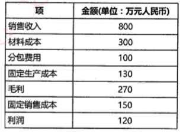
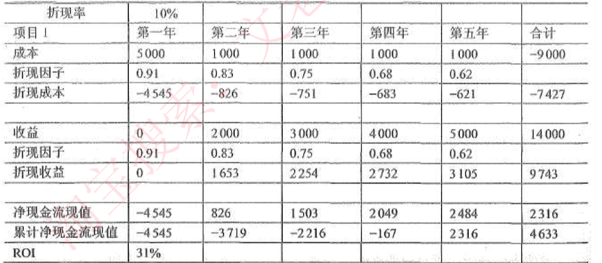

# 系统规划步骤

**系统规划 不只是可行性分析，还有系统的初步建设方案，产出系统设计任务书。**

1. **对现有系统进行初步调查**。根据企业战略和发展目标，从类似企业和本企业内部收集各种信息，站在管理层的高度观察企业的现状，分析现有系统的运行状况。
2. **分析和确定系统目标**。系统目标应包括服务的质量和范围、政策、组织和人员等，它不仅包括信息系统的目标，还要反映整个企业的目标。
3. **分析子系统的组成和基本功能**。自顶向下对系统进行划分，并且详细说明各个子系统应该实现的功能。
4. **拟定系统的实施方案**。可以对子系统的优先级进行设定，以便确定子系统的开发顺序。
5. **进行系统的可行性研究**，**编写可行性研究报告**，召开可行性论证会。
6. **制订系统建设方案**。对可行性研究报告中提出的各项技术指标进行分析、 比较，落实各项假设的前提条件，制订系统建设方案，并根据该方案及其实施计划**编写成系统设计任务书**。系统设计任务书经上级主管部门批准后，**正式作为系统建设的依据**。

# 项目机会选择

1. **项目的立项目标和动机**。进行基础研究；进行应用开发；提供技术服务；产品的使用者。

2. **项目立项的价值判断**。

3. **项目的选择和确定**。选择有核心价值的项目；评估所选择的项目；项目优先级排序；评估项目的多种实施方式；平衡地选择合适的方案。

4. **初步调查**。

   - 目标：掌握用户的概况，从整体上了解企业信息系统建设的现状，对用户提出的各种问题和初始需求进行识别，明确系统的初步目标，为可行性研究提供工作基础。

   - 方式：最佳方式是与企业高层管理人员座谈，通过座谈了解企业高层对信息系统所设定的目标和系统边界，计划的资金投入和对工期的要求。

   - 内容：初步需求分析，企业基本状况，管理方式和基础数据管理状况，现有系统状况。

5. **可行性分析**。

# 可行性分析

可行性是指在企业当前的条件下，是否有必要建设新系统，以及建设新系统的工作是否具备必要的条件。也就是说，**可行性包括必要性和可能性。**

1、复查系统目标和规模
2、分析现有系统
3、导出新系统的高层逻辑模型
4、用户复核
5、提出并评价解决方案
6、 确定最终推荐的解决方案
7、草拟开发计划
8、编制和提交可行性分析报告

在信息系统建设项目中，可行性研究通常从 **经济可行性、技术可行性、法律可行性和用户使用可行性** 四个方面来进行分析，其中**经济可行性通常被认为是项目的底线。**

## 经济可行性

**也称为投资收益分析或成本效益分析**，主要评估项目的建设成本、 运行成本和项目建成后可能的经济收益。

要注意的是，在系统开发初期，由于用户需求和候选系统方案还没有确定，成本不可能得到准确的估算。因此，此时的经济可行性分析**只能大致估算系统的成本和收益，判断信息系统的建设是否值得。**

## 技术可行性

**也称为技术风险分析**，研究的对象是信息系统需要实现的功能和性能，以及技术能力约束。技术可行性主要通过考虑以下问题来进行论证：

（1）**技术**：现有的技术能力和信息技术的发展现状是否足以支持系统目标的实现。

（2）**资源**：现有的资源（例如，掌握技术的员工、企业的技术积累、构件库、软硬件条件等）是否足以支持项目的实施。

（3）**目标**：由于在可行性研究阶段，项目的目标是比较模糊的，因此技术可行性最好与项目功能、性能和约束的定义同时进行。在可行性研究阶段，调整项目目标和选择可行的技术体系都是可以的，而一旦项目进入开发阶段，任何调整都意味着更多的开销。

需要特别指出的是，技术可行性绝不仅仅是论证在技术手段上是否可实现，实际上包含了在**当前资源条件下的技术可行性。**也就是能调用的资源范围内的可行性分析。

## 法律可行性

**也称为社会可行性**，具有比较广泛的内容，它需要从政策、法律、道德、制度等社会因素来论证信息系统建设的现实性。

## 用户使用可行性

**也称为执行可行性**，是从信息系统用户的角度来评估系统的可行性，包括企业的行政管理和工作制度、使用人员的素质和培训要求等， 可以细分为管理可行性和运行可行性。

（1）**管理可行性**。管理可行性是指从企业管理上分析系统建设可行性。主管领导不支持的项目一般会失败，中高层管理人员的抵触情绪很大，就有必要等一等，先积极做好思想工作，创造条件。另外，还要考虑管理方法是否科学，相应的管理制度改革的时机是否成熟，规章制度是否齐全等。

（2）**运行可行性**。运行可行性也称为操作可行性，是指分析和测定信息系统在确定环境中能够有效工作，并被用户方便使用的程度和能力。例如，ERP系统建成后的数据采集和数据质量问题，企业工作人员没有足够的IT技能等。

# 成本效益分析

> **分析的是经济可行性**

**按照投资时间分类：**

（1）**基础建设投资**。例如，房屋和设施、办公设备、平台软件、必须的工具软件等购置成本。基础建设投资既可以是一次性投资，也可以是分期付款。

（2）**其他一次性投资**。例如，研究咨询成本、调研费、管理成本、培训费、差旅费等，以及其他一次性杂费。

（3）**其他非一次性投资**。主要是指系统的运行与维护成本。例如，设备租金和定期维护成本、定期消耗品支出、通信费、人员工资与奖金、房屋租金、公共设施维护等，以及其他经常性的支出项目。

**按照成本性态分类：**

（1）**固定成本**。固定成本是指其总额在一定期间和一定业务量范围内，**不受业务量变动的影响而保持固定不变的成本**。例如，管理人员的工资、办公费、固定资产折l旧费、员工培训费等。

（2）**变动成本**。变动成本也称为可变成本，**是指在一定时期和一定业务量范围内其总额随着业务量的变动而成正比例变动的成本**。例如，直接材料费、产品包装费、外包费用、开发奖金（类似于提成）等。

（3）**混合成本**。混合成本就是混合了固定成本和变动成本的性质的成本。例， 如水电费、电话费等。这些成本通常有一个基数，超过这个基数就会随业务量的增大而增大。

**按计入方式分类：**

（1）**直接成本**：**与产品生产工艺直接有关的成本**，如原料、主要材料、外购半成品、生产工人工资、机器设备折1旧等。

（2）**间接成本**：与产品生产工艺**没有直接关系的成本**，如机物料消耗、辅助工人和车间管理人员工资、车间房屋折旧等。

沉没成本：指以往发生的，但与当前决策无关的费用。

**按收益分类：**

（1）**有形收益**也称为**经济收益**，可以用货币的时间价值、投资回收期、投资回收率等指标进行度量。

（2）**无形收益**也称为不可定量的收益，主要是从性质上、心理上进行衡量，很难直接进行量上的比较。

# 盈亏平衡点

利润=销售额-成本=销售额 -（固定成本＋可变成本）

当利润>0，即公司挣钱，当利润<0，即公司亏本，当利润=0时，**就是盈亏平衡点，此时不亏不赚**，公式如下：

盈亏平衡点销售额 = 总固定成本+总可变成本 

盈亏平衡点销售额 = 总固定成本 +［**可变成本占销售额的比例 * **盈亏平衡点销售额］ 

注意：可变成本和销售收入成正比。

例：求上图盈亏平衡点销售额

**先求可变成本占销售额的比例**

利润120=收入800- 固定成本130-固定成本150-可变成本300-可变成本100

可变成本总共400 / 收入800 = 0.5，可变成本占销售额的比例=0.5

设 x 为盈亏平衡点销售额，则 x= 280+ （x*0.5） 解得x 为540

# *净现值计算

**现金流=收入-成本**

**折现率**

> 只要理解了金钱是有时间价值的，那么理解折现的概念就不难。例如，假设当前银行各类 ××宝，能够提供5%的无风险收益，那么明年今日给你105万元和今天给你100万元就是等价 的。将明年的105万元按照利率5%换算成今天价值100万元的过程，就叫作“折现”，5%就被称 之为“折现率”。
>
> 由折现的概念，就能很容易理解，无风险收益越高，未来同样数额的钱，在今天的价值就 越低。例如，如果无风险收益率为10%，那么明年今天的105万元，就只能约等于今天的95.5万 元，而不是100万元了。而如果后年今天的105万元，在10%无风险收益下，就只能等于今天的 86.78万元了（105÷1.1÷1.1）。这就是央行加息，股市通常会下跌的原因，企业未来收获的 金钱，其今日价值因加息而降低了

**净现值分析**（NPV）：把所有预期的末来现金流入和流出都折算成现值，即考虑货币的时间价值。

计算公式：$NPV=\sum_{t=1}^{n}{a}\div{(1+r)}^t$  A是每年现金流，r是折现率，t是年份。

**投资收益率分析**：ROI	是将**净收入除以投资额的所得值**。ROI 越大越好。

ROl=（总的折现收益-总的折现成本）/折现成本=（9743-7427） / 7427=31%

**投资回收期分析**：以净现金流入补偿净投资所用的时间，即收支平衡的时间点。在项目1中， 第4-5年问收支由负转为正，因此应该在此期间，具体是：（累计净值出现正值的年份-1）+（累计净值出现正值年份上一年累计净值绝对值/出现正值年份净现值）=4+167/2484=4.07.