# 软件需求

**软件需求**：是指用户对**系统在功能、行为、性能、设计约束等方面的期望**。

是指用户解决问题或达到目标所需的条件或能力，是系统或系统部件要满足合同、标准、规范或其他正式规定文档所需具有的条件或能力，以及反映这些条件或能力的文档说明。

> 在需求开发和需求管理中间存在一条需求基线。需求基线就是已经开发好，并通过评审和用户确认的需求规格说明书（SRS）

分为 **需求开发和需求管理** 两大过程，如下所示：

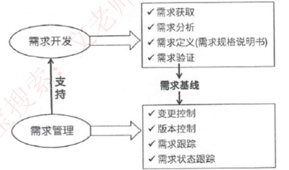

## 需求的层次

**业务需求**：反映**企业或客户对系统高层次的目标要求**，通常来自项目投资人、 客户、市场营销部门或产品策划部门。通过业务需求可以确定项目视图和范围。

**用户需求**：描述的是**用户的具体目标**，或用户要求系统必须能完成的任务。即描述了**用户能使用系统来做什么**。通常采取用户访谈和问卷调查等方式，对用户使用的场景进行整理，从而建立用户需求。

**系统需求**：从系统的角度来说明软件的需求，包括**功能需求、非功能需求和设计约束**等。

- 功能需求：也称为行为需求，规定了**开发人员必须在系统中实现的软件功能**， 用户利用这些功能来完成任务，满足业务需要。
- 非功能需求：指**系统必须具备的属性或品质**，通常指**性能和质量**，又可以细分为软件质量属性 （如可维护性、可靠性、效率等）和其他非功能需求。

- 设计约束：也称为**限制条件或补充规约**，通常由外部强制规定，通常是对系统的一些约束说明，例如必须采用国有自主知识产权的数据库系统，必须运行在UNIX操作系统之下等。

# 需求获取

**需求获取**：是一个确定和理解不同的项目干系人的需求和约束的过程。

**常见的需求获取法包括**：

（1）用户访谈：1对1～3，找有代表性的用户。其形式包括结构化和非结构化两种。存在**需求信息量大，记录困难，需要领域知识的问题。**

（2）问卷调查：用户多，无法一一访谈。

（3）采样：**数理统计**，从种群中系统地选出有代表性的样本集的过程。样本数量=0.25* （可信度因子/错误率）^2

（4）情节串联板：一系列图片，通过这些图片來讲故事。

**（5）联合需求计划（JRP）：通过联合各个关键用户代表、系统分析师、开发团队代表一起，通过有组织的会议来讨论需求。**

（6）需求记录技术：任务卡片、场景说明、用户故事、Volere白卡。

 

# 需求分析

**需求分析**：一个好的需求应该具有无二义性、完整性、一致性、可测试性、 确定性、可跟踪性、正确性、必要性等特性，因此，**需要分析人员把杂乱无章的用户要求和期望转化为用户需求**，这就是需求分析的工作。

**需求分析的任务：**

（1）绘制系统上下文范围关系图（反应系统整体跟外部的交互关系

（2）创建用户界面原型（产品原型图，用AE或PS 

（3）分析需求的可行性（这里是需求可行性，不是系统规划的可行性分析

（4） 确定需求的优先级

（5） 为需求建立模型（需求的逻辑模型

（6） 创建数据字典（对需求中涉及词汇的统一解释

（7）使用QFD（质量功能部署）

## 1.结构化的需求分析

结构化特点：**自顶向下，逐步分解，面向数据，其核心还是数据字典。**

三大模型：**功能模型（数据流图）、行为模型（状态转换图）、数据模型（E-R 图）以及数据字典。**

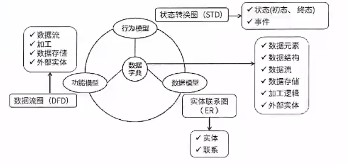

### 实体联系图（ER）

详见数据库技术中的ER模型

### 数据流图（DFD）

> 注意数据流图描绘的是功能模型，ER图描绘的才是数据模型。

**反应的是数据流向。**

数据流图描述数据在系统中如何被传送或变换，以及如何对数据流进行变换的功能或子功能，用于对功能建模，数据流图相关概念如图

数据流图是可以分层的，从顶层（即上下文无关数据流）到0层、1层等，顶层数据流图只含有一个加工处理表示整个管理信息系统，描述了系统的输入和输出，以及和外部实体的数据交互。数据流图示例如下：

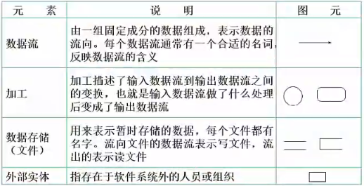

**数据流图 如下：**

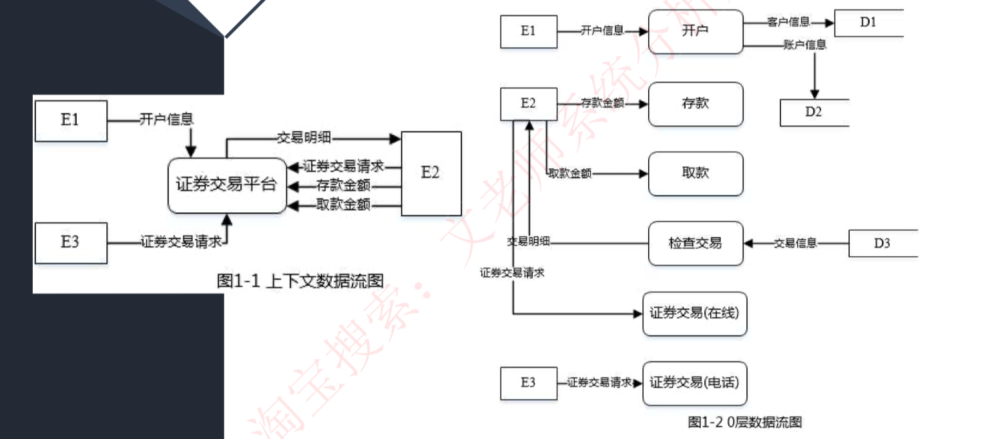

### 状态转换图（STD）

**状态转换图 STD如下图所示：**

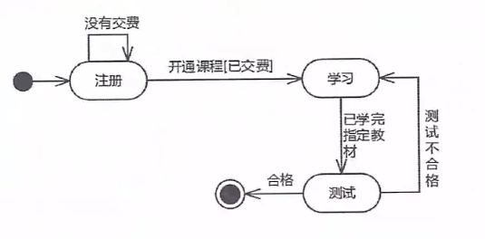

## 2.面向对象的需求分析

面向对象的分析：是为了**确定问题域，理解问题。**

包含五个活动：**认定对象、组织对象、 描述对象间的相互作用、确定对象的操作、定义对象的内部信息。**

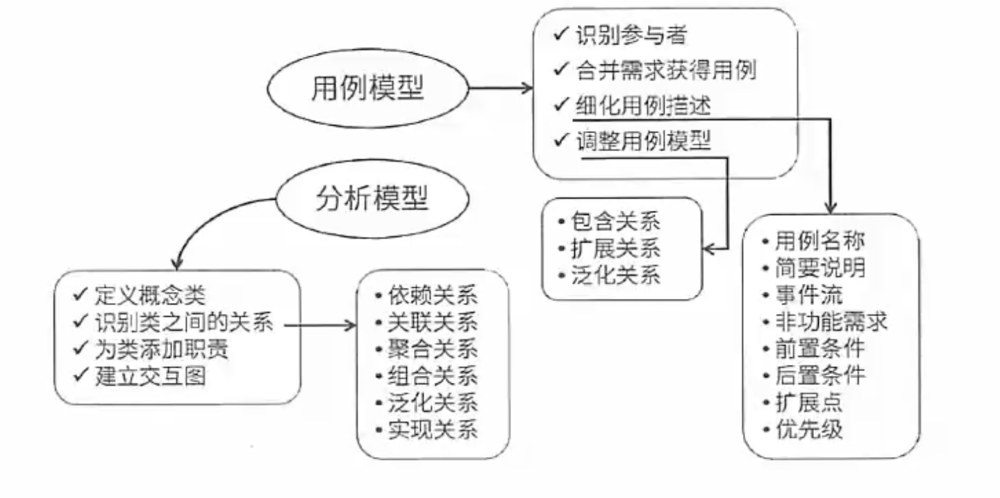

### 面向对象的基础感念

1. 对象：由数据及其操作所构成的封装体，是系统中用来描述客观事务的一个实体，是构成系统的一个基本单位。一个对象通常可以由**对象名、属性和方法**3个部分组成。

2. 类：现实世界中实体的形式化描述，类将该实体的属性（数据）和操作 （函数）封装在一起。对象是类的实例，类是对象的模板。

   类可以分为三种：**实体类、接口类（边界类）和控制类**。实体类的对象表示现实世界中真实的实体，如人、物等。接口类（边界类）的对象为用户提供一种与系统合作交互的方式，分为人和系统两大类，其中人的接口可以是显示屏、 窗口、Web 窗体、对话框、菜单、列表框、其他显示控制、条形码、二维码或者用户与系统交互的其他方法。系统接口涉及到把数据发送到其他系统，或者从其他系统接收数据。控制类的对象用来控制活动流，充当协调者。

3. 抽象：通过特定的实例抽取共同特征以后形成概念的过程。它强调主要特征，忽略次要特征。一个对象是现实世界中一个实体的抽象，一个类是一组对象的抽象，抽象是一种单一化的描述，它强调给出与应用相关的特性，拋弃不相关的特性。

4. 封装：是一种信息隐蔽技术，将相关的概念组成一个单元模块，并通过一个名称来引用。面向对象封装是将数据和基于数据的操作封装成一个整体对象， 对数据的访问或修改只能通过对象对外提供的接口进行。

5. 继承：表示类之间的层次关系（父类与子类），这种关系使得某类对象可以继承另外一类对象的特征，又可分为单继承和多继承。**继承多个叫多重继承**。

6. 多态：不同的对象收到同一个消息时产生完全不同的结果。包括参数多态 （不同类型参数多种结构类型）、包含多态（父子类型关系）、过载多态（类似于重载，一个名字不同含义）、强制多态（强制类型转换）四种类型。多态由继承机制支持，将通用消息放在抽象层，具体不同的功能实现放在低层。

7. 接口：描述对操作规范的说明，其只说明操作应该做什么，并没有定义操作如何做。

8. 消息：体现对象间的交互，通过它向目标对象发送操作请求。

9. 覆盖：子类在原有父类接口的基础上，用适合于自己要求的实现去置换父类中的相应实现。即在子类中重定义一个与父类同名同参的方法。

10. 函数重载：与覆盖要区分开，函数重载与子类父类无关，且西数是同名不同参数。 

绑定是一个把**过程调用和响应调用所需要执行的代码加以结合的过程**。在一般的程序设计语言中，**绑定是在编译时进行的**，**叫作静态绑定。动态绑定则是在运行时进行的**，因此，一个给定的过程调用和代码的结合直到调用发生时才进行。

## 3.统一建模语言UML

UML（统一建模语言）：是一种**可视化的建模语言，而非程序设计语言**，支持从需求分析开始的软件开发的全过程。

从总体上来看，UML的结构包括构**造块、规则和公共机制**三个部分：

（1）**构造块**。UML有三种基本的构造块，分别是**事物（thing）、关系 （relationship）和图（diagram）**。**事物是UML的重要组成部分，关系把事物紧密联系在一起，图是多个相互关联的事物的集合**。

（2）**规则**。规则是构造块如何放在一起的规定。**包含 范围、可见性、完整性、执行**

（3）**公共机制**。公共机制是指达到特定目标的公共UML方法。

### 构造块

#### **事物**

结构事物：模型的静态部分，如类、接口、用例、 构件等；

行为事物：模型的动态部分，如交互、活动、状态机；

分组事物：模型的组织部分，如包；

注释事物：模型的解释部分，依附于一个元素或一组元素之上对其进行约束或解释的简单符号。

#### ***关系**

依赖：一个事物的语义依赖于另一个事物的语义的变化而变化（）

关联：是一种结构关系，描述了一组链，链是对象之间的连接。**分为组合和聚合**，都是**部分和整体的关系，其中组合事物之间关系更强，被组合的事物有共同的生命周期，而聚合关系则没有共同的生命周期。**

泛化：一般和特殊的关系，如子类和父类之间的关系  （is-a）

实现：一个类元指定了另一个类元保证执行的契约。

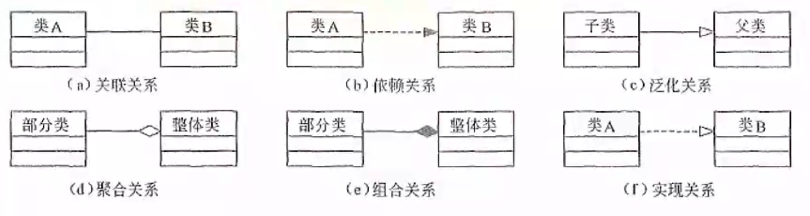

- 关联关系，是一条直线，直线两边可能有数字，表示两个事物存在结构关系。
- 依赖关系，虚线+实心三角箭头，虚线表示它们不是强关联的。
- 泛化关系，可以看作子类和父类的关系，统一用空心三角箭头，泛化更强，所以用实线。
- 实现关系，可以看作子类和父类的关系，统一用空心三角箭头，实现弱一些，用虚线。
- 聚合关系，实线+空心菱形。
- 组合关系，实线+实心菱形，表示关系更强。

#### 图

### 规则

构造块命名，规则是构造块如何放在一起的规定。

范围，给一个名字以特定含义的语境。

即可见性，怎样使用或看见名字。

即完整性，事物如何正确、一致地相互联系。

执行，运行或模拟动态模型的含义是什么。

### 公共机制

- 规格说明：事物语义的细节描述，它是模型真正的核心

- 修饰：通过修饰来表达更多的信息
- 公共分类：类与对象、接口与实现
- 扩展机制：允许添加新的规则

2）公共机制。公共机制是指达到特定目标的公共UML方法，主要包括规格说明（详细说明）、修饰、公共分类（通用划分）和扩展机制四种。规格说明是事物语义的细节描述，它是模型真正的核心；UML为每个事物设置了一个简单的记号，还可以通过修饰来表达更多的信息；UML包括两组公共分类，分别是类与对象（类表示概念，而对象表示具体的实体）、接口与实现（接口用来定义契约，而实现就是具体的内容）；扩展机制包括约束（扩展了UML构造块的语义，允许增加新的规则或修改现有的规则）、构造型（扩展UML的词汇，用于定义新的构造块）和标记值（扩展了UML构造块的特性，允许创建新的特殊信息来扩展事物的规格说明）。

### 

## 4.UML图型

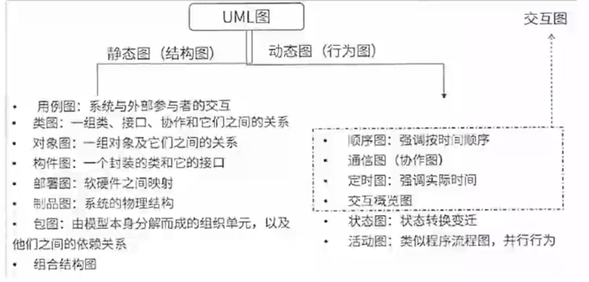

### 类图

**类图**：静态图，为系统的静态设计视图，展现一组对象、接口、协作和它们之间的关系。UML类图如下：

> 聚合关系的图形表示应该是空心的，下图中有误。

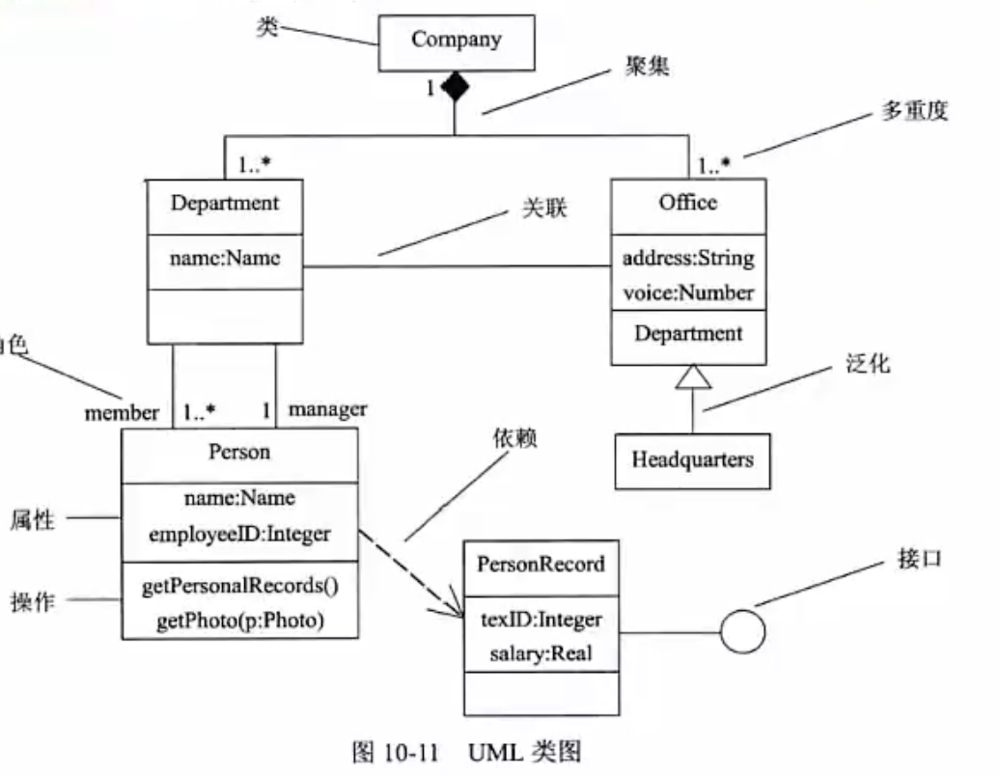

### 对象图

对象图：静态图，展现某一时刻一组对象及它们之间的关系，为类图的某一快照。在没有类图的前提下，对象图就是静态设计视图。如下：

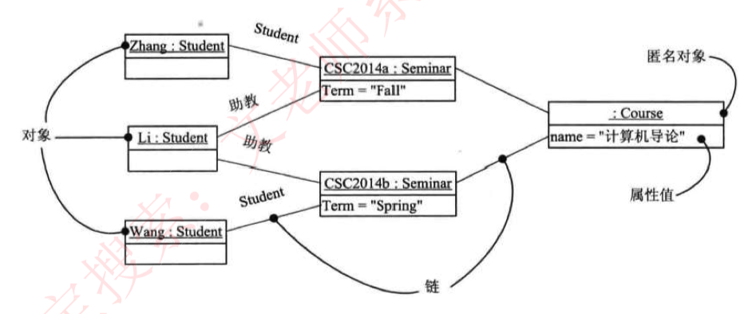

### *用例图

> 用例图是参与者能完成的一系列操作，也是用给用户提供了哪些操作功能
>
> 1） 参与者。参与者是指存在于系统外部并与系统进行交互的任何事物，既可以是使用系统的用户，也可以是其他外部系统和设备等外部实体。
>
> 2）用例。用例是在系统中执行的一系列动作，这些动作将生成特定参与者可见的价值结果。也就是说，用例表示系统所提供的服务，它定义了系统是如何被参与者所使用的，它描述的是参与者为了使用系统所提供的某一完整功能而与系统之间发生的一段对话。
>
> 3）通信关联。通信关联表示的是参与者和用例之间的关系，或用例与用例之间的关系。箭头表示在这一关系中哪一方是对话的主动发起者，箭头所指方是对话的被动接受者，箭尾所指方是对话的主动发起者。如果不想强调对话中的主动与被动关系， 可以使用不带箭头的关联实线。在用例模型中，信息流不是由通信关联来表示的，该信息流是默认存在的，并且是双向的，它与箭头所指的方向没有关系。

用例图：静态图，展现了一组 **用例、参与者 以及 它们 之间的关系（通信关联）**。用例图中的**参与者可以是人、硬件或其他系统可以扮演的角色**；**用例是参与者完成的一系列操作**，用例之间的关系有**扩展、包含、泛化**。如下：

包含关系 include，如 登记外借信息 前，必须要包含的功能是 用户登录。

扩展关系 extend，可做可不做，注意箭头方向，如 查询书籍可以选择修改书籍信息 也可以不修改

泛化关系，如注册用户，可以泛化成 本地注册 和 网上注册。

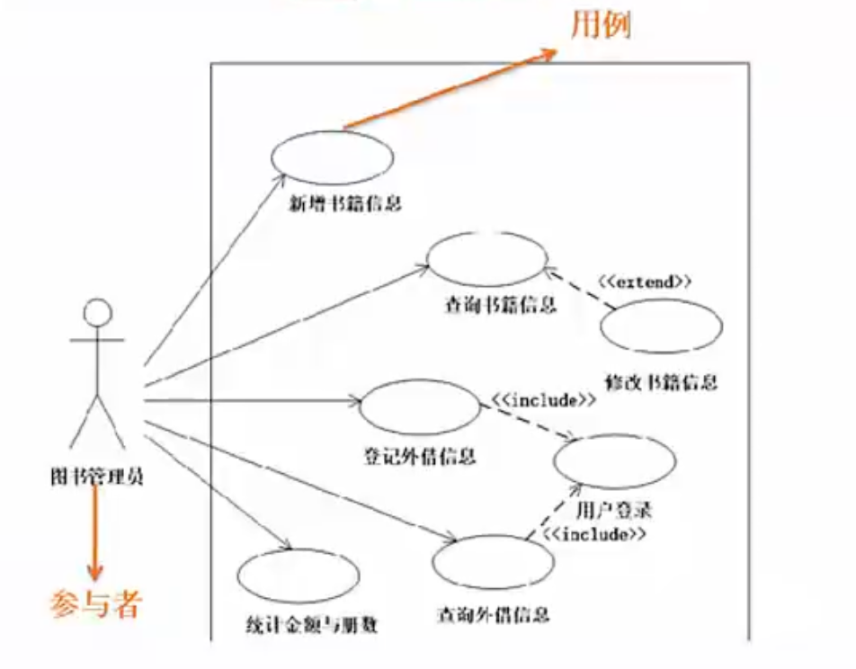

### 序列图

即顺序图，动态图，是场景的图形化表示，描述了以时间顺序组织的对象之间的交互活动。有同步消息（进行阻塞调用，调用者中止执行，等待控制权返回，需要等待返回消息，用实心三角箭头表示），异步消息（发出消息后继续执行，不引|起调用者阳塞，也不等待返回消息，由空心箭头表示）、 返回消息（由从右到左的虚线箭头表示）三种。如下：

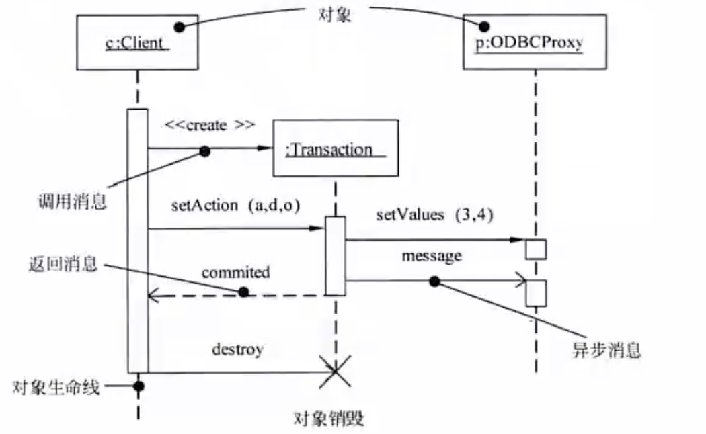

### 通信图

通信图：动态图，即协作图，强调参加交互的对象的组织。如下：

> 对象之间的消息传递，传递的时候按照消息的编号

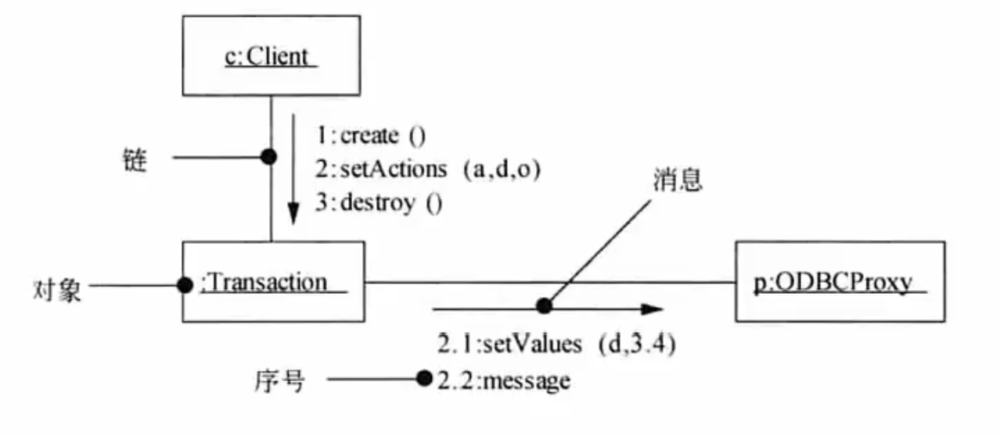

### 状态图

> 状态间的切换需要事件来触发，同时还需要满足监护条件。
>
> 状态的迁移可以包含事件触发器、监护条件和状态。

状态图：动态图，展现了一个状态机，描述**单个对象在多个用例中的行为**， 包括简单状态和组合状态。**转换可以通过事件触发器触发，事件触发后相应的监护条件会进行检查**。状态图中转换和状态是两个独立的概念，如下：图中方框代表状态，箭头上的代表触发事件，实心圆点为起点和终点。

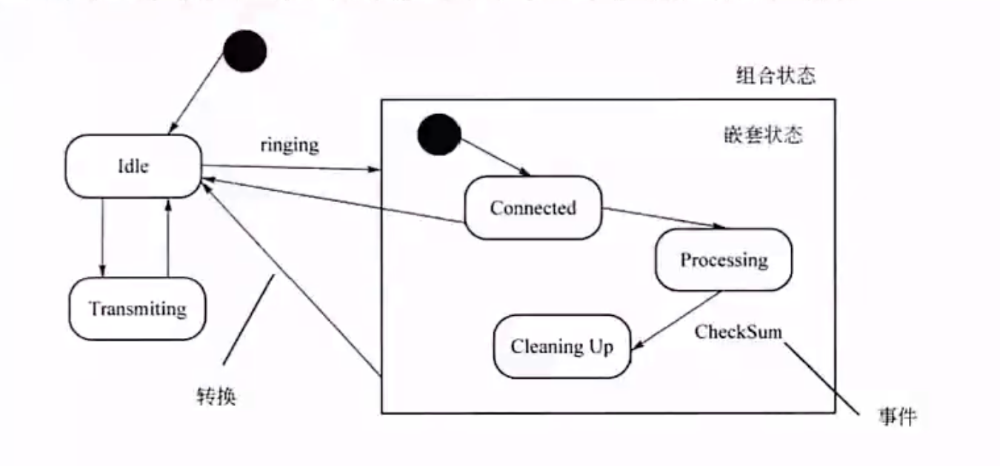

### 活动图

> **活动图将进程或其他计算结构展示为计算内部一步步的控制流和数据流。强调对象间的控制流程。**

活动图：动态图，**是一种特殊的状态图**，展现了**在系统内从一个活动到另一个活动的流程**。活动的分岔和汇合线是一条水平粗线。牢记下图中并发分岔、并发汇合、监护表达式、分支、流等名词及含义。每个分岔的分支数代表了可同时运行的线程数。活动图中能够并行执行的是在一个分岔粗线下的分支上的活动

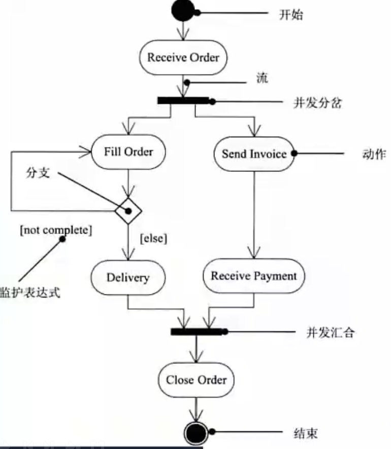

### 构件图

构件图（组件图）：静态图，**为系统静态实现视图，展现了一组构件之间的组织和依赖**。如下：

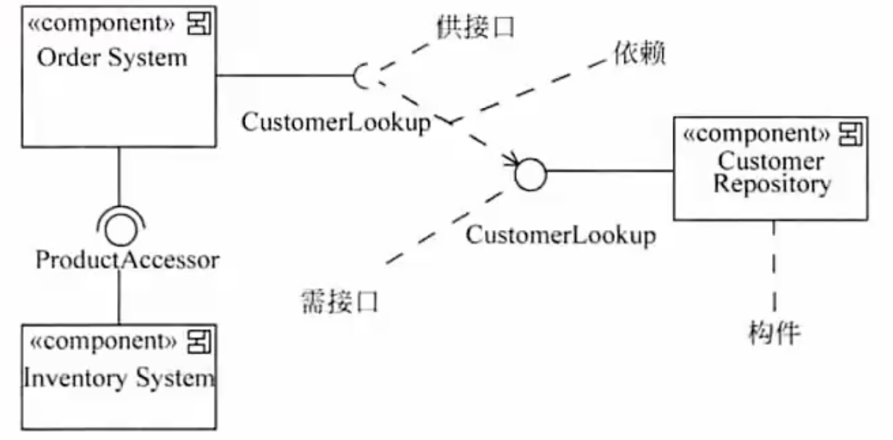

### 部署图

部署图：静态图，**为系统静态部署视图**，**部署图物理模块的节点分布**。它与构件图相关，通常一个结点包含一个或多个构件。其依赖关系类似于包依赖， 因此部署组件之间的依赖是单向的类似于包含关系。如下：

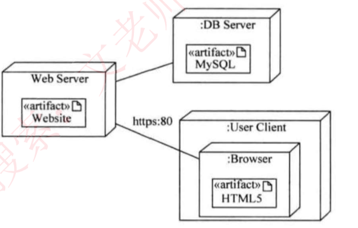

### 包图

静态图，UML包图通常用于描述系统的**逻辑架构**——**层、子系统、包**等。层可以建模为UML包。例如，UI（用户界面）层可以建模为名为UI层的包。UML包图分层组织元素的方式也可以嵌套。

UML包用一大一小两个矩形组合而成。

如果内部显示了其成员，则包名称标在上面的小矩形内，否则可以标在包内。

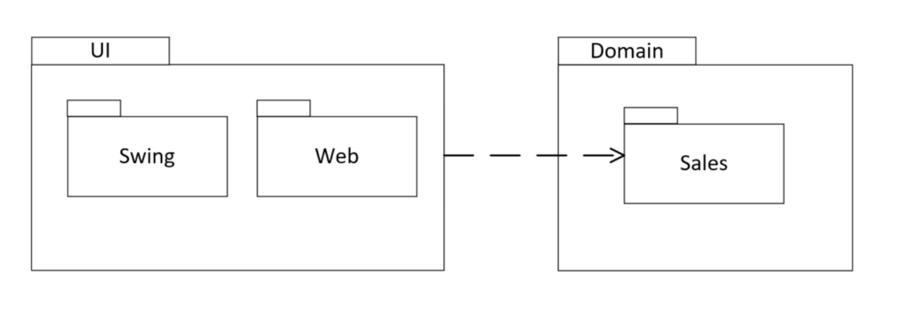

公有（+）：对它所在的包（包括内嵌的包）以及外部的元素可见。

私有（-）：只对它所在的包和内嵌的包可见。

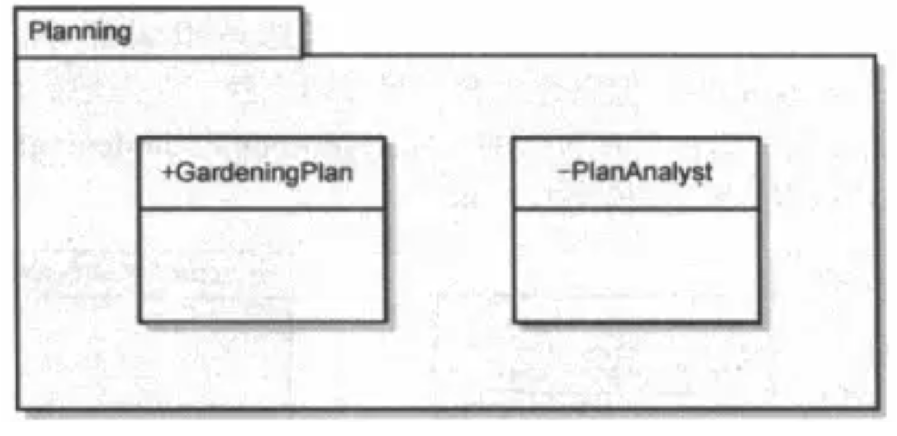

包中的依赖关系

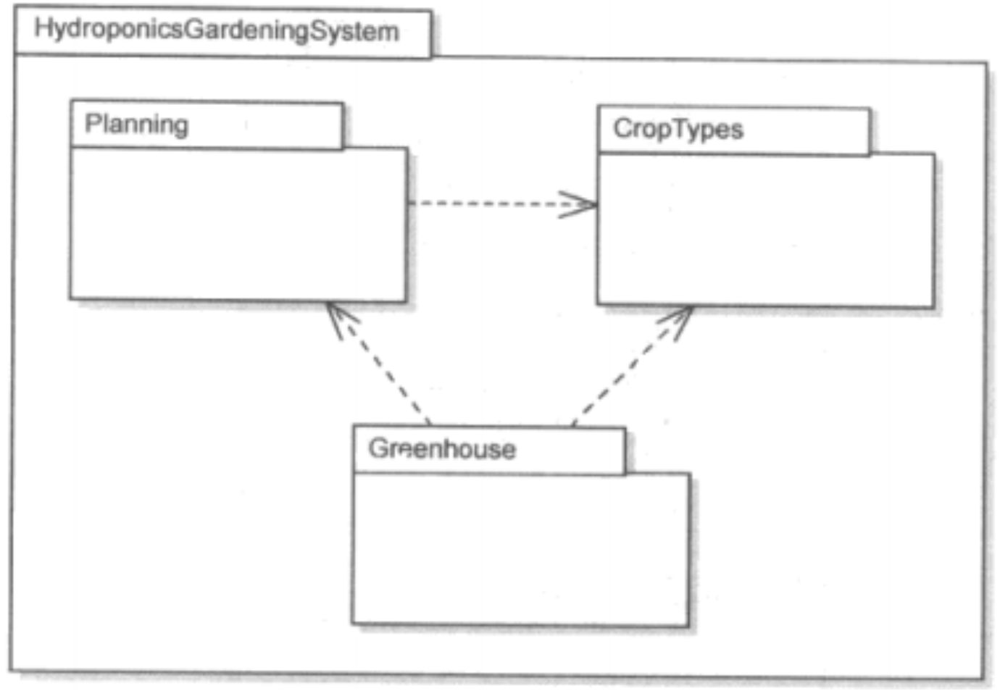

### UML图总结

1） 类图 （class diagram）。类图描述一组类、接口、协作和它们之间的关系。在O0系统的建模中，最常见的图就是类图。类图给出了系统的静态设计视图，活动类的类图给出了系统的静态进程视图。

2）对象图 （object diagram）。对象图描述一组对象及它们之间的关系。对象图描述了在类图中所建立的事物实例的静态快照。和类图一样，这些图给出系统的静态设计视图或静态进程视图，但它们是从真实案例或原型案例的角度建立的。

3）构件图（component diagram）。构件图描述一个封装的类和它的接口、端口，以及由内嵌的构件和连接件构成的内部结构。构件图用于表示系统的静态设计实现视图。对于由小的部件构建大的系统来说，构件图是很重要的。构件图是类图的变体。

4）组合结构图 （composite structure

dliagram）。组合结构图描述结构化类 （例如，构件或类）的内部结构，包括结构化类与系统其余部分的交互点。组合结构图用于画出结构化类的内部内容。

5）用例图（use case diagram）。用例图描述一组用例、参与者及它们之间的关系。用例图给出系统的静态用例视图。这些图在对系统的行为进行组织和建模时是非常重要的。

6）顺序图（sequence diagram，序列图）。顺序图是一种交互图 （interaction diagram），交互图展现了一种交互，它由一组对象或参与者以及它们之间可能发送的消息构成。交互图专注于系统的动态视图。顺序图是强调消息的时间次序的交互图。

7）通信图（communication diagram）。通信图也是一种交互图，它强调收发消息的对象或参与者的结构组织。顺序图和通信图表达了类似的基本概念，但它们所强调的概念不同，顺序图强调的是时序，通信图强调的是对象之间的组织结构（关系）。在UML 1.X版本中，通信图称为协作图 （collaboration diagram）。

8） 定时图 （timing diagram，计时图）。定时图也是一种交互图，它强调消息跨越不同对象或参与者的实际时间，而不仅仅只是关心消息的相对顺序。

9）状态图（state diagram）。状态图描述一个状态机，它由状态、转移、事件和活动组成。状态图给出了对象的动态视图。它对于接口、类或协作的行为建模尤为重要，而且它强调事件导致的对象行为，这非常有助于对反应式系统建模。

10） 活动图 （activity diagram）。活动图将进程或其他计算结构展示为计算内部一步步的控制流和数据流。活动图专注于系统的动态视图。它对系统的功能建模和业务流程建模特别重要，并强调对象间的控制流程。

11）部署图 （deployment diagram）。部署图描述对运行时的处理节点及在其中生存的构件的配置。

部署图给出了架构的静态部署视图，通常一个节点包含一个或多个部署图。

12）制品图 （artifact diagram）。制品图描述计算机中一个系统的物理结构。制品包括文件、数据库和类似的物理比特集合。制品图通常与部署图一起使用。制品也给出了它们实现的类和构件。

13） 包图 （package diagram）。包图描述由模型本身分解而成的组织单元，以及它们之间的依赖关系。

14）交互概览图 （interaction overview diagram）。交互概览图是活动图和顺序图的混合物。

### UML 4+1 视图

视图是一种抽象，视图需要用UML图来实现。

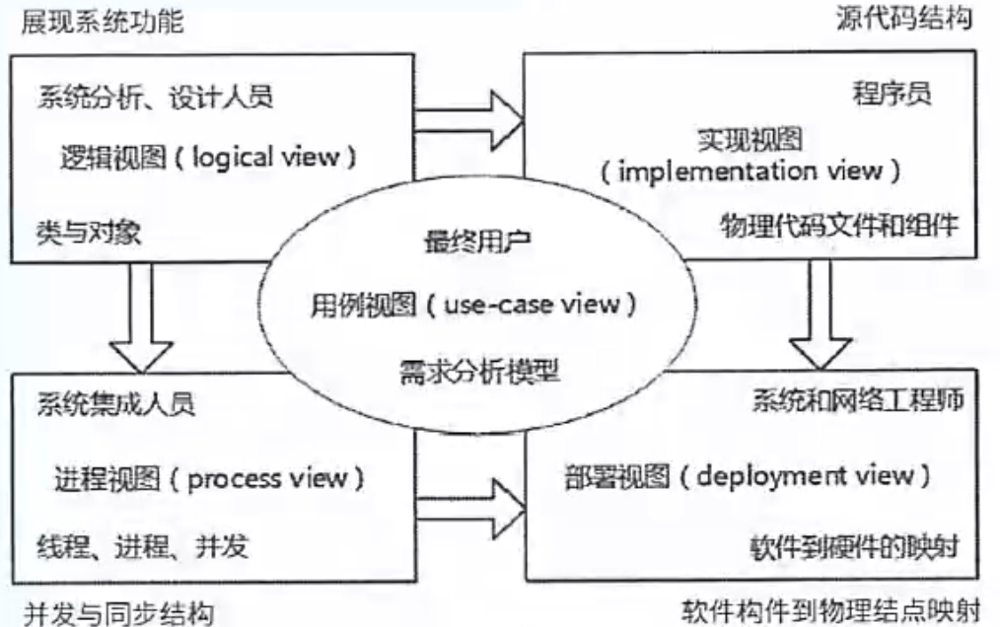

（1）**逻辑视图**。逻辑视图也称为**设计视图**，它表示了设计模型中在架构方面具有重要意义的部分，即类、子系统、包和用例实现的子集。

（2）**进程视图**。进程视图是**可执行线程和进程作为活动类的建模**，它是逻辑视图的一次执行实例，描述了并发与同步结构。

（3）**实现视图**。实现视图对组成基于系统的**物理代码的文件和构件进行建模**。

（4）**部署视图**。部署视图把**构件部署到一组物理节点上**， 表示软件到硬件的映射和分布结构。

（5）**用例视图**。用例视图是**最基本的需求分析模型**。

# 需求定义

**需求定义（软件需求规格说明书SRS）**：是需求开发活动的产物，编制该文档的目的是使项目干系人与开发团队对系统的初始规定有一个共同的理解，**使之成为整个开发工作的基础**。SRS是软件开发过程中最重要的文档之一，对于任何规模和性质的软件项目都不应该缺少。

需求定义方法：

（1）严格定义也称为预先定义，需求的严格定义建立在以下的基本假设之上：**所有需求都能够被预先定义**。开发人员与用户之间能够准确而清晰地交流。采用图形（或文字）可以充分体现最终系统。

（2）原型方法，**迭代的循环型开发方式**，需要注意的问题：并非所有的需求都能在系统开发前被准确地说明。项目干系人之间通常都存在交流上的困难，原型提供了克该服困难的一个手段。特点：需要实际的、可供用户参与的系统模型。有合适的系统开发环境。反复是完全需要和值得提倡的，需求一旦确定， 就应遵从严格的方法。

# 需求验证

需求验证：也称为需求确认，目的**是与用户一起确认需求无误，对需求规格说明书SAS进行评审和测试**，包括两个步骤：

- 需求评审：正式评审和非正式评审。

- 需求测试：设计概念测试用例。

**需求验证通过后，要请用户签字确认，作为验收标准之一，此时，这个需求规格说明书就是需求基线**，不可以再随意更新，如果需要更改必须走需求变更流程。

# 需求管理

定义需求基线：通过了评审的需求说明书就是需求基线，下次如果需要变更需求，就需要按照流程来一步步进行。

需求的流程及状态如下图所示：

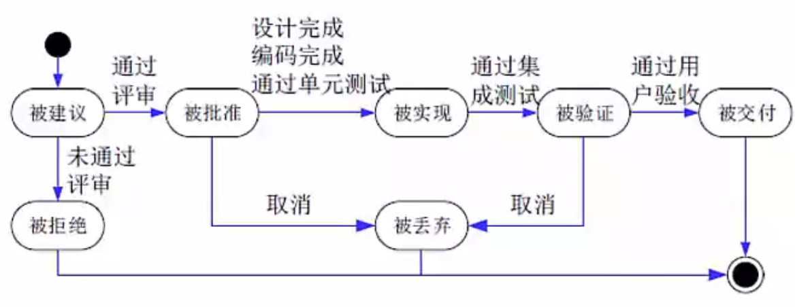

## 需求变更和风险

主要关心需求变更过程中的需求风险管理，带有风险的做法有：**无足够用户参与、忽略了用户分类、用户需求的不断增加、模棱两可的需求、不必要的特性、过于精简的 SRS、不准确的估算。**

变更产生的原因：**外部环境的变化、需求和设计做的不够完整、新技术的出现、公司机构重组造成业务流程的变化。**

**变更控制委员会CCB**：也称为配置控制委员会，其任务是对建议的配置项变    更做出评价、审批，以及监督已经批准变更的实施。

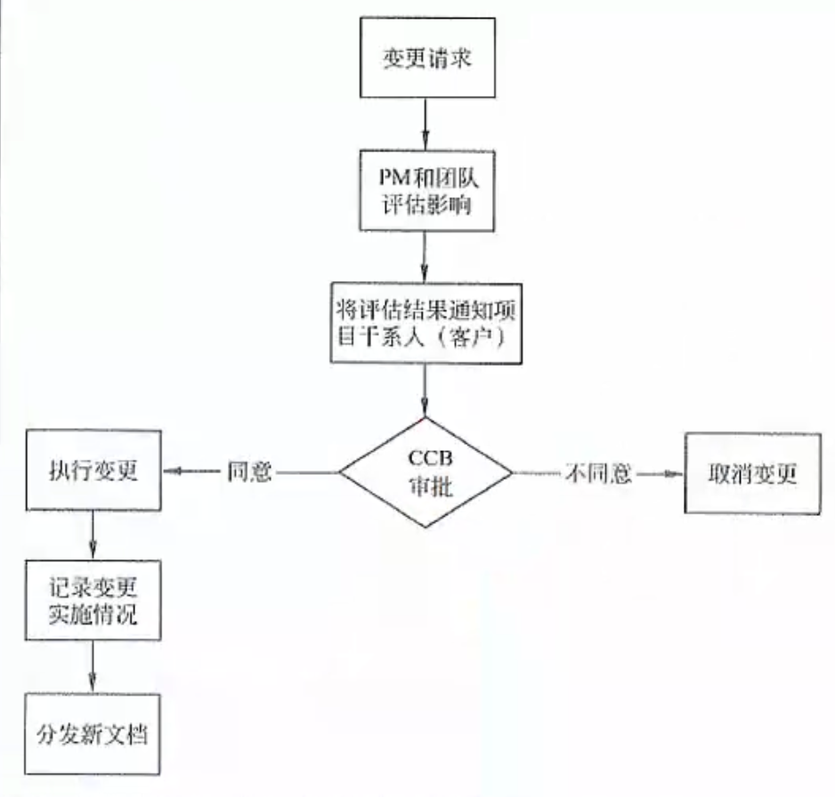

## 需求跟踪

正向跟踪**表示用户原始需求是否都实现了**，反向跟踪**表示软件实现的是否都是用户要求的**，不多不少，可以用原始需求和用例表格（需求跟踪矩阵）来表示：

今若原始需求和用例有对应，则在对应栏打对号，若某行都没有对号，表明原始需求未实现，正向跟踪发现问题；若某列都没有对号，表明有多余功能用例， 软件实现了多余功能，反向跟踪发现问题。
