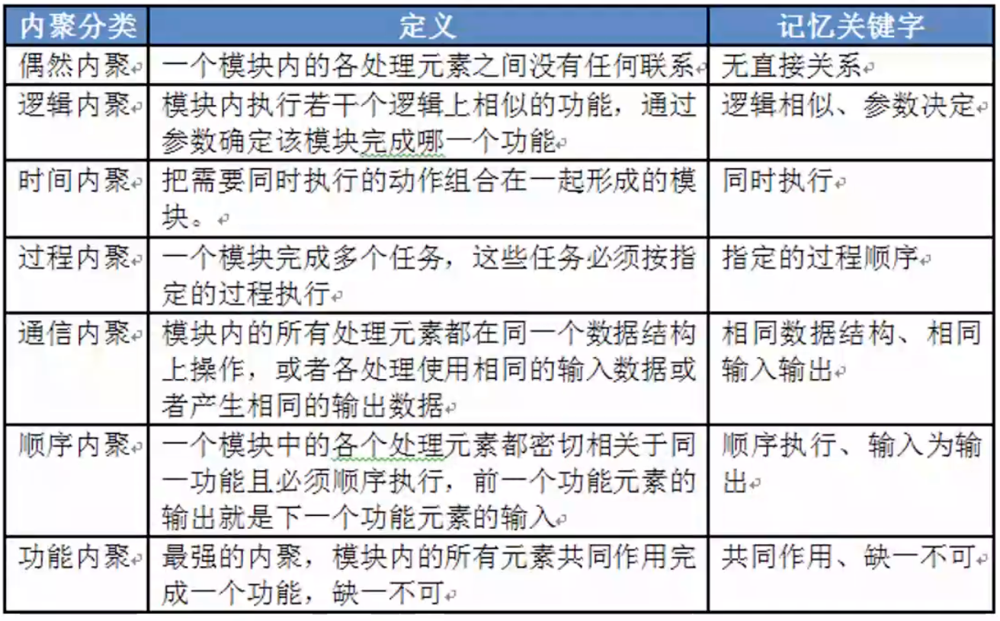
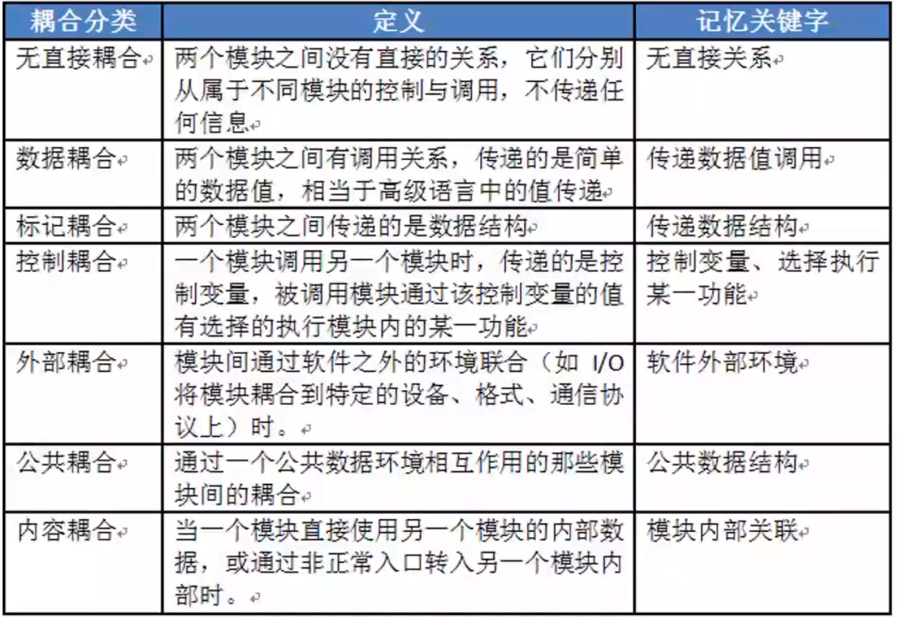
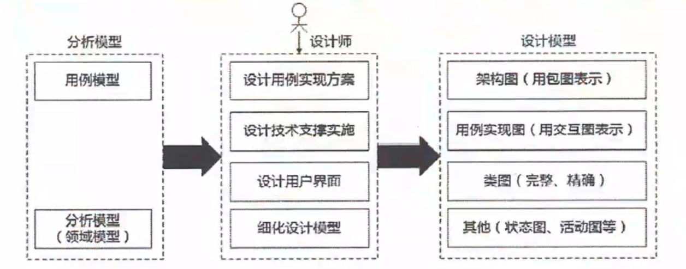
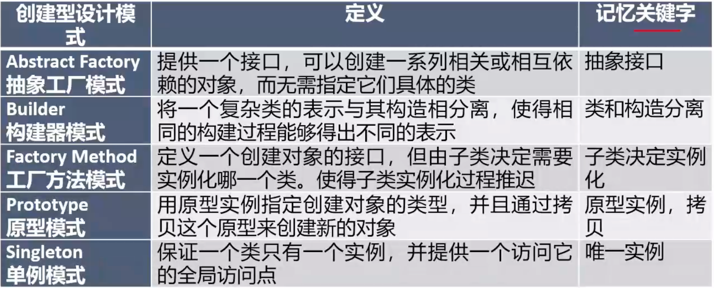
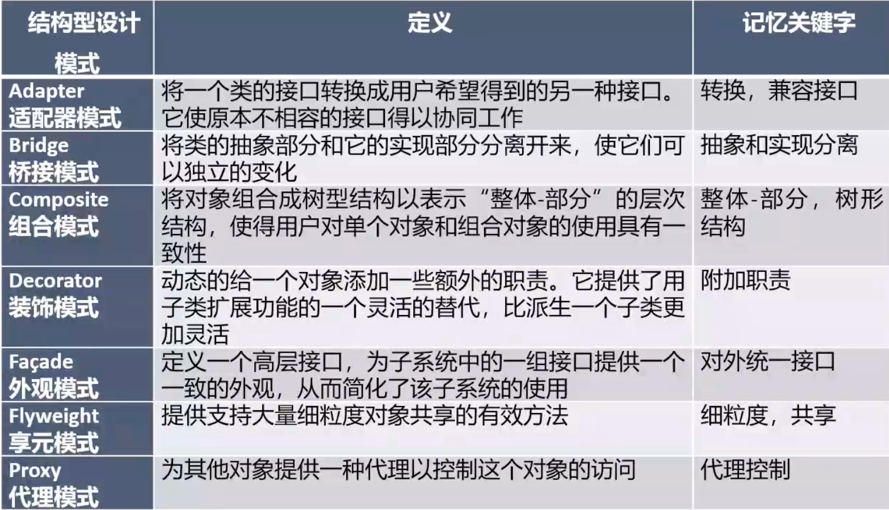
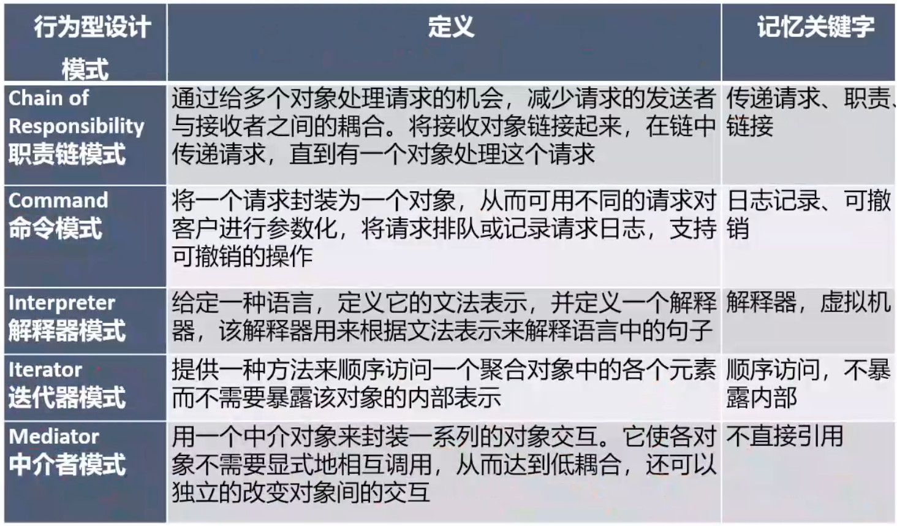
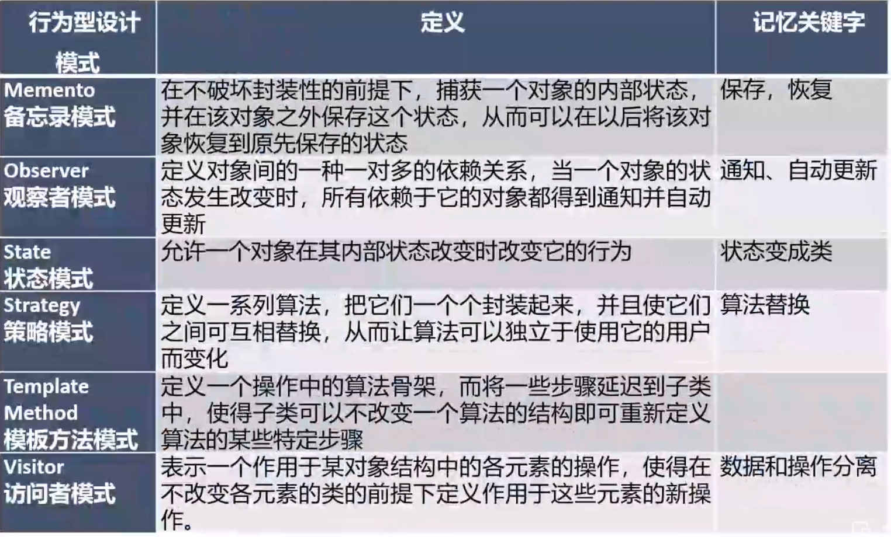

# 处理流程设计

## 流程表示工具  

1. **程序流程图（Program Flow Diagram，PFD）**用一些图框表示各种操作，它**独立于任何一种程序设计语言**，比较直观、清晰，易于学习掌握。任何复杂的程序流程图都应该由**顺序、选择和循环**结构组合或嵌套而成。
2. IPO图也是流程描述工具，用来描述构成软件系统的**每个模块的输入、输出和数据加工**。
3. 盒图（N-S图）容易表示**嵌套和层次关系**，并具有强烈的结构化特征。但是当问题很复杂时，N-s图可能很大，因此**不适合于复杂程序的设计。**
4. 问题分析图（PAD）是一种支持**结构化程序设计**的图形工具。PAD具有清晰的逻辑结构、标准化的图形等优点，更重要的是，它引导设计人员使用结构化程序设计方法，从而提高程序的质量。

## 业务流程重组BPR

BPR是对企业的业务流程进行**根本性的再思考和彻底性的再设计**，从而获得可以用诸如成本、质量、服务和速度等方面的业绩来衡量的显著性的成就。

BPR设计原则：

- **以流程为中心的原则**
- **团队管理原则（以人为本）**
- **以客户为导向的原则**

## 业务流程管理BPM

> 程度比BRP轻一些，没有直接重组。

BPM是一种以**规范化的构造端到端的卓越业务流程为中心**，以持续的**提高组织业务绩效为目的**的系统化方法。

BPM与BPR管理思想最根本的不同就在于流程管理并不要求对所有的流程进行再造。构造卓越的业务流程并不是流程再造，而是**根据现有流程的具体情况，对流程进行规范化的设计**

流程管理包含三个层面：**规范流程、优化流程和再造流程**

# 软件架构设计

> 系分不考，架构考

架构设计的**核心问题是能否达到架构级的软件复用。**

架构风格反映了**领域中众多系统所共有的结构和语义特性，**并指导如何将各个构建有效的组成一个完整的系统。

## 架构风格

- 数据流风格：批处理序列（一个一个处理，顺序结构）、管道/过滤器（数据进出管道都要经过过滤器处理，分阶段的数据处理，常见于网络数据处理） 
- 调用/返回风格：主程序/子程序、面向对象风格、层次结构（与上下两层关系密切）
- 独立构件风格：进程通信（构件之间是独立的，通过消息通信）、事件系统。
- 虚拟机风格：解释器（有虚拟机，可以仿真硬件执行过程，实现解释执行， 效率较低，可跨平台）、基于规则的系统。
- 仓库风格：数据库系统、超文本系统、黑板系统（是一个解决方案的数据库， 知识源与黑板进行通信，用于没有确定方案的系统）

# 系统设计

系统设计主要目的：为系统制定蓝图，在各种技术和实施方法中权衡利弊， 精心设计，合理地使用各种资源，**最终勾画出新系统的详细设计方法。**

系统设计方法：**结构化设计方法，面向对象设计方法。**

系统设计的主要内容：**概要设计、详细设计。**

**概要设计基本任务**：又称为**系统总体结构设计**，是将系统的功能需求分配给软件模块，确定每个模块的功能和调用关系，**形成软件的模块结构图，即系统结构图**。

**详细设计的基本任务**：**模块内详细算法设计、模块内数据结构设计、数据库的物理设计、其他设计（代码、输入/输出格式、用户界面）**、编写详细设计说明书、评审。

## **系统设计原则**

- 保持模块的大小适中；

- 尽可能减少调用的深度；

- 多扇入，少扇出（扇入被别人调用或依赖，扇出则相反；

- 单入口，单出口；

- 模块的作用域应该在模块之内；

- 功能应该是可预测的。

## 结构化设计

### **结构化设计基本原理**

- 抽象化；

- 自顶而下，逐步求精；

- 信息隐蔽（封装 ；

- 模块独立（高内聚，低耦合）。

### *模块独立-高内聚（从低到高

这里的高内聚低耦合也适用于面向对象设计。

### *模块独立-低耦合（从低到高

# 面向对象设计

**面向对象的设计**：是**设计分析模型和实现相应源代码**，设计问题域的解决方案，与技术相关。00D同样应遵循抽象、信息隐蔽、功能独立、模块化等设计准则。

面向对象的**分析模型**主要由**顶层架构图、用例与用例图、领域概念模型构成**；

面向对象的**设计模型**则包含 **以包图表示的软件体系结构图、以交互图表示的用例实现图、 完整精确的类图、针对复杂对象的状态图和用以描述流程化处理过程的活动图等**。

## 面向对象设计原则

（1）**单一责任原则**。就一个类而言，应该仅有一个引起它变化的原因。即，当需要修改某个类的时候原因有且只有一个，**让一个类只做一种类型责任。**

（2）**开放-封闭原则**。**对扩展开放，对修改关闭，减少回归。**软件实体（类、模块、函数等）应该是可以扩展的，即开放的，但是不可修改的，即封闭的。

（3）**里氏替换原则**。**子类型必须能够替换掉他们的基类型**。即，在任何父类可以出现的地方，都可以用子类的实例来赋值给父类型的引用。

（4）**依赖倒置原则**。抽**象不应该依赖于细节，细节应该依赖于抽象**。即，高层模块不应该依赖于低层模块，二者都应该依赖于抽象。在DDD上有体现。

（5）**接口分离原则**。即：**依赖于抽象，不要依赖于具体**，同时在抽象级别不应该有对于细节的依赖。这样做的好处就在于可以最大限度地应对可能的变化。

# *设计模式

每一个设计模式描述了一个在我们周围不断重复发生的问题，以及该问题的解决方案的核心。

设计模式的核心在于提供了相关问题的解决方案，使得人们可以更加简单方便的复用成功的的设计和体系结构。

四个基本要素：**模式名称、问题（应该在何时使用模式）、解决方案（设计的内容）、效果（模式应用的效果）**

## 创建型设计模式

解决对象的创建相关的问题

## 结构型设计模式

用来描述类和类之间结构的问题

**桥接模式**：现需要提供大中小3种型号的画笔，能够绘制5种不同颜色，如果使用蜡笔，我们需要准备3*5=15支蜡笔，也就是说必须准备15个具体的蜡笔类。而如果使用毛笔的话，只需要3种型号的毛笔，外加5个颜料盒。

**组合模式**：将对象组合成树形结构表示 整体-部分，如类目树、文件树。

**装饰模式：**如Java中的文件流，强调是在运用时可以动态增强类。

**享元模式**：提供细粒度的对象来共享。

## 行为型设计模式

 

**中介者模式：**和代理模式和类似，但区别是中介者可以让被中介的双方服务，但是代理模式，只能包装代理方。

**备忘录模式：** 存档和读档。

**状态模式：**状态变更时变更它的行为

# 人机界面设计

- 置于用户控制之下 
- 减少用户的记忆负担
- 保持界面的一致性

