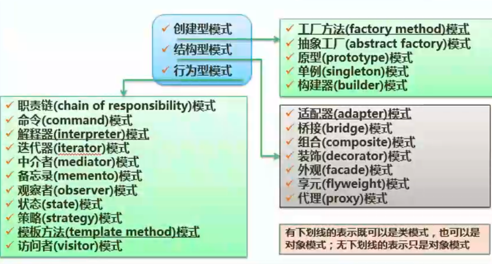
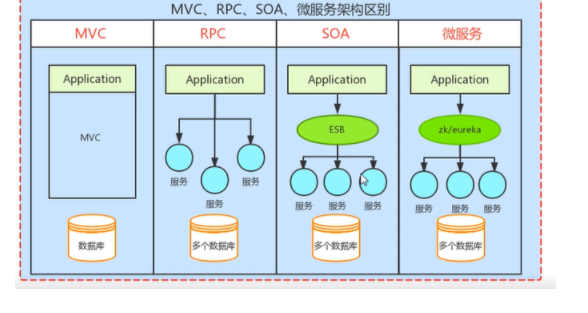

# 系统设计

系统分析阶段决定“做什么”，系统设计阶段决定“怎么做”，该阶段也称为物理设计阶段。

该阶段的任务是根据 **系统规格说明书SRS** 中规定的功能要求，结合实际条件实现技术方案，根据**逻辑模型** 设计出 **物理模型**。为下一阶段的实施工作奠定基础。

系统设计的主要内容：**概要设计、详细设计。**

**概要设计**：又称为**系统总体结构设计**，是将系统的功能需求分配给软件模块，确定每个模块的功能和调用关系，**形成软件的模块结构图，即系统结构图**，类似于分配任务功能。

**详细设计**：**模块内详细算法设计、模块内数据结构设计、数据库的物理设计、其他设计（代码、输入/输出格式、用户界面）**、编写详细设计说明书、评审，具体要实现某个功能的技术方案落地。

# 处理流程设计

## 业务流程定义

业务流程是一组将输入转化为输出的相互关联或相互作用的活动。流程6个要素分别是：输入、活动、活动的相互作用（即结构）、输出、客户、价值。

## 工作流管理系统 WFMS

工作流管理系统是一个软件系统，它完成工作流的定义和管理，按照在系统中预先定义好的工作流逻辑进行工作流实例的执行。

工作流管理系统不是企业的业务系统，而是为企业的业务系统的运行提供了一个软件支撑环境。

WFMS的 **基本功能** 体现在对 **工作流进行建模、工作流执行、业务过程的管理和分析。**

WfMS最 **基本的组成部分** 是工作流参考模型，其包含6个基本模块，分别是

1. **工作流执行服务**

2. **工作流引擎**

3. **流程定义工具**

4. **客户端应用**

5. **调用应用**

6. **管理监控工具**

    

操作步骤如下理解如下：

通过 **流程定义工具** 调用 **工作流执行服务** 去定义工作流程，每个工作流程会对应 **调用应用**。

**客户端应用** 通过调用 **工作流执行服务**，然后执行对应工作流程所对应 **调用应用** 。

可以看出 **工作流执行服务** 包含了工作流程的定义、创建、管理和执行，真正执行具体任务的是 **工作流引擎**，可以将它看成工作线程。

**管理监控工具** 查看工作流程的执行情况。

1）工作流执行服务。工作流执行服务是WFMS的核心模块，它的功能包括创建和管理流程定义，创建、管理和执行流程实例。在执行上述功能的同时，应用程序可能会通过编程接口与工作流执行服务交互，一个工作流执行服务可能包含有多个分布式工作的工作流引擎。该模块还为每个用户维护一个活动列表，告诉用户当前必须处理的任务，可以通过电子邮件或者短消息的形式提醒用户任务的到达，例如，在开通课程流程中，当新的课程申请的到来时，可以提示上级主管。

2）工作流引擎。工作流引擎是为流程实例提供运行环境，并解释执行流程实例的软件模块，即负责流程处理的软件模块。

3）流程定义工具。流程定义工具是管理流程定义的工具，它可以通过图形方式把复杂的流程定义显示出来并加以操作，流程定义工具与工作流执行服务交互，一般该模块为设计人员提供图形化的用户界面。通过流程定义工具，设计人员可以创建新的流程或者改变现有流程，在流程定义时， 可以指定各项活动的参与者的类型、活动之间的相互关系和传递规则等。

4）客户端应用。客户端应用是通过请求的方式与工作流执行服务交互的应用，也就是说，是客户端应用调用工作流执行服务。客户端应用与工作流执行服务交互，它是面向最终用户的界面，可以将客户端应用设计为 B/S架构或C/S架构。

5）调用应用。调用应用是被工作流执行服务调用的应用，调用应用与工作流执行服务交互。为了协作完成一个流程实例的执行，不同的工作流执行服务之间进行交互，它通常是工作流所携带数据的处理程序，常用的是电子文档的处理程序，它们在工作流执行过程中被调用，并向最终用户展示数据，这些应用程序的信息包括名称、调用方式和参数等。例如，在OA 系统中，可以调用相关的程序来直接查看Word文档或者Excel表格数据等。

6） 管理监控工具。管理监控工具主要指组织机构和参与者等数据的维护管理和流程执行情况的监控，管理监控工具与工作流执行服务交互。

WFMS通过管理监控工具提供对流程实例的状态查询、挂起、恢复和销毁等操作，同时提供系统参数和系统运行情况统计等数据。用户可以通过图形或者图表的方式对系统数据进行汇总与统计，并可随时撤销一些不合理的流程实例。

## 流程表示工具  

1. **程序流程图（Program Flow Diagram，PFD）**用一些图框表示各种操作，它**独立于任何一种程序设计语言**，比较直观、清晰，易于学习掌握。任何复杂的程序流程图都应该由**顺序、选择和循环**结构组合或嵌套而成。
2. IPO图也是流程描述工具，用来描述构成软件系统的**每个模块的输入、输出和数据加工**。
3. 盒图（N-S图）容易表示**嵌套和层次关系**，并具有强烈的结构化特征。但是当问题很复杂时，N-s图可能很大，因此**不适合于复杂程序的设计。**
4. 问题分析图（PAD）是一种支持**结构化程序设计**的图形工具。PAD具有清晰的逻辑结构、标准化的图形等优点，更重要的是，它引导设计人员使用结构化程序设计方法，从而提高程序的质量。

# 结构化设计 SD

SD 以 SRS 和 数据字典 为基础，是一个自顶向下，逐步求精，和模块化（高内聚和低耦合）的过程。

缺点：开发周期长、难以适应需求的变化、很少考虑数据结构

## 结构化设计原则

- 模块独立性原则
- 系统结构准则

## 结构化设计原则

- 保持模块的大小适中；

- 尽可能减少调用的深度；

- 多扇入，少扇出（扇入被别人调用或依赖，扇出则相反；

- 单入口，单出口；

- 模块的作用域应该在模块之内；

- 功能应该是可预测的。

高内聚速记：欧罗石锅通顺共

低耦合速记：无数标空外公呢

## *模块独立-高内聚（从低到高

这里的高内聚低耦合也适用于面向对象设计。

## *模块独立-低耦合（从低到高

# 面向对象设计 OOD

**面向对象的设计**：是**设计分析模型和实现相应源代码**，设计问题域的解决方案，与技术相关。00D同样应遵循抽象、信息隐蔽、功能独立、模块化等设计准则。

面向对象的**分析模型**主要由**顶层架构图、用例与用例图、领域概念模型构成**；

面向对象的**设计模型**则包含 **以包图表示的软件体系结构图、以交互图表示的用例实现图、 完整精确的类图、针对复杂对象的状态图和用以描述流程化处理过程的活动图等**。

## 类的三种类型

实体类、边界类和控制类。

1）实体类：存储和管理系统内部的信息，实体类通常需要放入持久存储体（数据库、文件等）。实体对象（实体类的实例）用于保存和更新事件、人员等信息。

2）控制类：控制类是用于控制用例工作的类，体现应用程序的执行逻辑。例如，转账可看成控制类，该类提供了银行账户转账关联的所有逻辑操作。

3）边界类：位于系统与外界的交接处，用于系统外部环境与系统内部的交互。常见的边界类有窗口、通信协议、打印机接口、传感器、终端等。

## 面向对象设计原则

1. **单一责任原则**。就一个类而言，应该仅有一个引起它变化的原因。即，当需要修改某个类的时候原因有且只有一个，**让一个类只做一种类型责任。**
2. **开放-封闭原则**。**对扩展开放，对修改关闭，减少回归。**软件实体（类、模块、函数等）应该是可以扩展的，即开放的，但是不可修改的，即封闭的。
3. **里氏替换原则**。**子类型必须能够替换掉他们的基类型**。即，在任何父类可以出现的地方，都可以用子类的实例来赋值给父类型的引用。
4. **依赖倒置原则**。高层模块不应该依赖底层模块，二者都该依赖于抽象。抽象不应该依赖于细节，细节应该依赖于抽象。
5. **接口分离原则**。即：**依赖于抽象，不要依赖于具体**，同时在抽象级别不应该有对于细节的依赖。这样做的好处就在于可以最大限度地应对可能的变化。
6. **最少知识原则**。也称为迪米特法则，是指一个实体应当尽可能少地与其他实体发生相互作用，这样一个模型修改的时候，就会尽量少的影响别的模块。

# *设计模式

每一个设计模式描述了一个在我们周围不断重复发生的问题，以及该问题的解决方案的核心。

设计模式的核心在于提供了相关问题的解决方案，使得人们可以更加简单方便的复用成功的的设计和体系结构。

四个基本要素：**模式名称、问题（应该在何时使用模式）、解决方案（设计的内容）、效果（模式应用的效果）**

## 创建型设计模式

解决对象的创建相关的问题

## 结构型设计模式

用来描述类和类之间结构的问题

**桥接模式**：现需要提供大中小3种型号的画笔，能够绘制5种不同颜色，如果使用蜡笔，我们需要准备3*5=15支蜡笔，也就是说必须准备15个具体的蜡笔类。而如果使用毛笔的话，只需要3种型号的毛笔，外加5个颜料盒。

**组合模式**：将对象组合成树形结构表示 整体-部分，如类目树、文件树。

**装饰模式：**如Java中的文件流，强调是在运用时可以动态增强类。

**享元模式**：提供细粒度的对象来共享，即创建一个对象，需要在多处共享使用。

## 行为型设计模式

 

**中介者模式：**和代理模式和类似，但区别是中介者可以让被中介的双方服务，但是代理模式，只能包装代理方。

**备忘录模式：** 存档和读档。

**状态模式：**状态变更时变更它的行为

stragegy模式：策略模式，主要是方便策略的选择与改变；

Observer模式：主要是建立观察关系，一旦被观察者有变化快速通知观察者联动处理

State模式：主要关注状态的变迁，这些与图中的表达不符合

# 人机界面设计

- 置于用户控制之下 
- 减少用户的记忆负担
- 保持界面的一致性

# 软件架构设计

> 系分不考，架构考

架构设计的**核心问题是能否达到架构级的软件复用。**

架构风格反映了**领域中众多系统所共有的结构和语义特性，**并指导如何将各个构建有效的组成一个完整的系统。

## 架构风格

- 数据流风格：批处理序列（一个一个处理，顺序结构）、管道/过滤器（数据进出管道都要经过过滤器处理，分阶段的数据处理，常见于网络数据处理） 
- 调用/返回风格：主程序/子程序、面向对象风格、层次结构（与上下两层关系密切）
- 独立构件风格：进程通信（构件之间是独立的，通过消息通信）、事件系统。
- 虚拟机风格：解释器（有虚拟机，可以仿真硬件执行过程，实现解释执行， 效率较低，可跨平台）、基于规则的系统。
- 仓库风格：数据库系统、超文本系统、黑板系统（是一个解决方案的数据库， 知识源与黑板进行通信，用于没有确定方案的系统）

# SOA架构

SOA（全称：Service Oriented Architecture），中文意思为 “面向服务的架构”，你可以将它理解为一个架构模型或者一种设计方法，而并不是服务解决方案。其中包含多个服务， 服务之间通过相互依赖或者通过通信机制，来完成相互通信的，最终提供一系列的功能。一个服务通常以独立的形式存在与操作系统进程中。各个服务之间通过网络调用 。

跟 SOA 相提并论的还有一个 ESB（企业服务总线），简单来说ESB就是一根管道，用来连接各个服务节点。为了集成不同系统，不同协议的服务，ESB 可以简单理解为：它做了消息的转化解释和路由工作，让不同的服务互联互通；

我们将各个应用之间彼此的通信全部去掉，在中间引入一个ESB企业总线，各个服务之间，只需要和ESB进行通信，这个时候，各个应用之间的交互就会变得更加的清晰，业务架构/逻辑等，也会变得很清楚。原本杂乱没有规划的系统，梳理成了一个有规划可治理的系统，在这个过程中，最大的变化，就是引入了ESB企业总线。

在SOA架构中：

UDDI （Universal DescriptionDiscovery and Integration，统一描述、发现和集成）提供了一种服务发布、查找和定位的方法，是服务的信息注册规范，以便被需要该服务的用户发现和使用它。

SOAP （Simple ObjectAccess Protocol，简单对象访问协议）定义了服务请求者和服务提供者之间的消息传输规范。

WSDL （Web ServiceDescription Language， Web 服务描述语言）是对服务进行描述的语言，它有一套基于 XML 的语法定义。WSDL 描述的重点是服务。

# 微服务架构

优点：

- 功能高内聚，关注领域内的功能
- 模块松耦合，服务之间的变更不会互相影响
- 服务粒度细，模块复杂度可控
- 独立部署，扩展性好，动态伸缩
- 技术异构，针对不同服务进行不同技术选型

挑战：

1. 挑战：服务拆分和边界定义

   在微服务架构中，正确的服务拆分和边界定义是至关重要的。不正确的拆分可能导致服务之间的紧密耦合，增加了维护和扩展的复杂性。

   解决方案：在进行服务拆分时，应遵循单一职责原则。每个服务应该有清晰的定义和边界，只关注自己的特定业务领域。使用领域驱动设计（DDD）的概念可以帮助识别业务边界和上下文，并指导服务的拆分过程。

2. 挑战：部署和监控

   微服务架构的部署和监控是一个复杂的任务。管理多个服务的版本控制、部署、容错和监控需要有效的工具和策略。

   解决方案：采用持续集成和持续部署（CI/CD）实践，自动化构建、测试和部署流程。使用监控工具和日志聚合平台，如	Prometheus和ELK Stack，来实时监测服务的性能和健康状况。

3. 挑战：服务发现和负载均衡

   微服务架构中的服务实例数量可能非常庞大，因此需要有效的服务发现和负载均衡机制来管理请求流量和保证高可用性。

   解决方案：使用服务发现工具，如Consul或Etcd，来自动注册和发现服务实例。结合负载均衡器，如Nginx或Kubernetes Ingress，以实现请求的负载均衡和故障转移。

4. 挑战：服务间通信和数据一致性

   微服务架构中的服务通信是一个关键问题。多个服务之间的同步和异步通信可能导致性能瓶颈和数据一致性问题。

   解决方案：选择适当的通信机制，如RESTful API、消息队列或事件驱动架构，根据业务需求和场景进行选择。对于数据一致性，可以采用事件驱动的方式，通过事件发布和订阅来确保数据的最终一致性。

5. 挑战：分布式事务和数据管理

   在微服务架构中，跨多个服务的分布式事务和数据管理是一个复杂的问题。确保数据的一致性和完整性是一项具有挑战性的任务。

   解决方案：避免跨多个服务的强一致性要求，尽量采用最终一致性模式。引入分布式事务管理器，如Saga模式或可靠事件模式，来协调多个服务之间的事务和数据变更。

# SOA架构和微服务架构对比

|              |          微服务           |                    SOA                    |
| :----------: | :-----------------------: | :---------------------------------------: |
| 业务划分方式 |       纵向业务划分        |                 水平多层                  |
|     粒度     |          细粒度           |                  粗粒度                   |
|   部署方式   |         独立部署          |                 整体部署                  |
|   通信方式   | 轻量级通信方式如HTTP、RPC | 企业服务总线（ESB）充当服务之间通信的角色 |

1.微服务去中心化，去掉ESB企业总线。微服务不再强调传统SOA架构里面比较重的ESB企业服务总线，同时SOA的思想进入到单个业务系统内部实现真正的组件化

2.Docker容器技术的出现，为微服务提供了更便利的条件，比如更小的部署单元，每个服务可以通过类似Node或者Spring Boot等技术跑在自己的进程中。

3.SOA注重的是系统集成方面，而微服务关注的是完全分离

