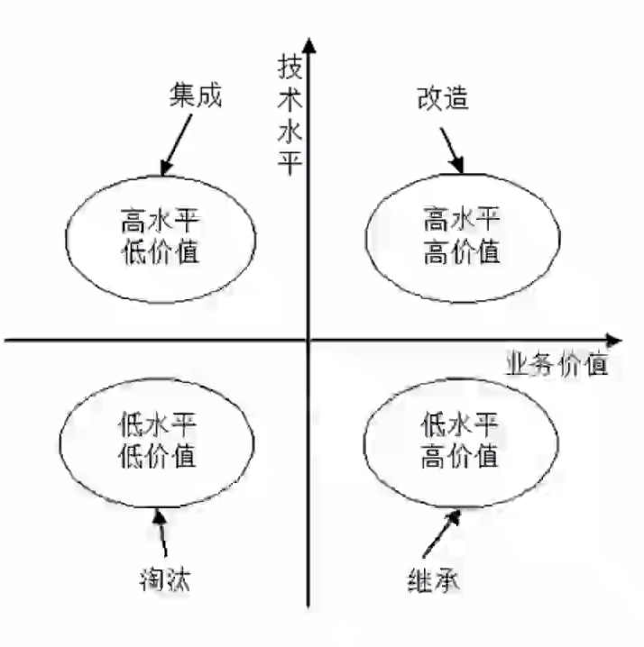

# 系统实施系统

# 测试原则和方法

系统测试是**为了发现错误而执行程序的过程，成功的测试是发现了至今尚末发现的错误的测试。**

**测试原则：**

- 应尽早并不断的进行测试；

- 测试工作应该避免由原开发软件的人或小组承担；

- 在设计测试方案时，不仅要确定输入数据，而且要根据系统功能确定预期的输出结果；

- 今既包含有效、合理的测试用例，也包含不合理、失效的用例；

- 检验程序是否做了该做的事，且是否做了不该做的事；

- 严格按照测试计划进行；

- 妥善保存测试计划和测试用例；

- 测试用例可以重复使用或追加测试。

**软件测试方法可分为静态测试和动态测试。**区别是测试程序是否在运行。

静态测试：指被测试程序**不在机器上运行**，而采用**人工检测和计算机辅助静态分析的手段**对程序进行检测，包括对文档的静态测试和对代码的静态测试。

对文档的静态测试主要以检查单的形式进行，而对代码的静态测试，包括**桌前检查、代码审查、代码走查**的方式。使用这种方法能够有效地发现30%-70%的逻辑设计和编码错误。

动态测试：指在计算机上**实际运行程序**进行软件测试，一般采用白盒测试和黑盒测试方法。

黑盒测试法：**功能性测试**，不了解软件代码结构，根据功能设计用例，测试软件功能。

白盒测试法：**结构性测试**，明确代码流程，根据代码逻辑设计用例，进行用例覆盖。

# 测试阶段

正常的测试流程阶段：

1. **单元测试**：也称为模块测试，测试的对象是可独立编译或汇编的程序模块、 软件构件或OO软件中的类（统称为模块），测试依据是软件详细设计说明书。（面向对象设计中是类，面向结构设计中是模块

2. **集成测试**：目的是检查模块之间，以及模块和已集成的软件之间的接口关系，并验证已集成的软件是否符合设计要求。测试依据是软件概要设计文档。

3. **系统测试**：**测试对象是完整的、集成的计算机系统**；测试的目的是在真实系统工作环境下，验证完成的软件配置项能否和系统正确连接，并满足系统/子系统设计文档和软件开发合同规定的要求。测试依据是用户需求或开发合同。

   主要内容包括**功能测试、健壮性测试、性能测试、用户界面测试、安全性测试、** 安装与反安装测试等，其中，最重要的工作是进行功能测试与性能测试。功能测试主要采用黑盒测试方法；性能测试主要指标有响应时间、吞吐量、并发用户数和资源利用率等。

4. **确认测试**：主要用于验证软件的功能、性能和其他特性是否与用户需求一致。根据用户的参与程度，通常包括以下类型：

   - **内部确认测试**：主要由软件开发组织内部按照需求规格说明书（SRS）进行测试。
   - **Alpha测试：用户在开发环境下进行测试。**
   - **Beta测试：用户在实际使用环境下进行测试，通过改测试后，产品才能交付用户。**
   - **验收测试**：针对SRS，在交付前以用户为主进行的测试。其测试对象为完整的、 集成的计算机系统。验收测试的目的是，在真实的用户工作环境下，检验软件系统是否满足开发技术合同或SRS。验收测试的结论是用户确定是否接收该软件的主要依据。除应满足一般测试的准入条件外，在进行验收测试之前，应确认被测软件系统已通过系统测试。

还有其他测试阶段：

**配置项测试**：测试对象是**软件配置项**，测试目的是检验软件配置项与SRS 的一致性。测试的依据是SRS。在此之间，应确认被测软件配置项已通过单元测试和集成测试。

**回归测试**：测试目的是**测试软件变更之后，变更部分的正确性和对变更需求的符合性，以及软件原有的、正确的功能、性能和其他规定的要求的不损害性。**

# 测试用例设计

**黑盒测试用例**：将程序看做一个黑盒子，只知道输入输出，不知道内部代码， 由此设计出测试用例，分为下面几类：

**等价类划分**：把所有的数据按照某种特性进行归类，而后在每类的数据里选取一个即可。等价类测试用例的设计原则：**设计一个新的测试用例，使其尽可能多地覆盖尚未被覆盖的有效等价类**，重复这一步，直到所有的有效等价类都被覆盖为止；**设计一个新的测试用例，使其仅覆盖一个尚未被覆盖的无效等价类（因为如果两个的话，就不知道哪个导致的错误**，重复这一步，直到所有的无效等价类都被覆盖为止。

**边界值划分**：将每类的边界值作为测试用例，边界值一般为**范围的两端值以及在此范围之外的与此范围间隔最小的两个值**，如年龄范围为0-150，边界值为 0,150，-1,151四个。

错误推测：没有固定的方法，凭经验而言，来推测有可能产生问题的地方， 作为测试用例进行测试。

因果图：由一个结果来反推原因的方法，具体结果具体分析，没有固定方法。

**白盒测试用例**：知道程序的代码逻辑，按照程序的代码语句，来设计覆盖代码分支的测试用例，覆盖级别从低至高分为下面几种：

（1）**语句覆盖**SC：**逻辑代码中的所有语句都要被执行一遍，覆盖层级最低**，因为执行了所有的语句，不代表执行了所有的条件判断的分支。

（2）**判定覆盖**DC：逻辑代码中的所有判断语句的条件的真假分支都要覆盖一次

（3）**条件覆盖**CC：针对每一个判断条件内的每一个独立条件都要执行一遍真和假。（一个判定里可能会有多个判断条件 

（4）**条件判定组合覆盖**CDC：同时满足判定覆盖和条件覆盖。

（5）**路径覆盖**：逻辑代码中的所有可行路径都覆盖了，覆盖层级最高。（常和语句覆盖一起考，路径覆盖类似于群举所有语句覆盖，路径覆盖也是一种比较强的覆盖，但未必考虑判定条件结果的组合，并不能代替条件判定组合覆盖。

# 调试

# *软件度量

**软件的两种属性：外部属性指面向管理者和用户的属性，可直接测量，一般为性能指标。内部属性指软件产品本身的的属性，如可靠性等，只能间接测量。**

**McCabe度量法**：又称**环路复杂度**，假设有向图中有**向边数为m，节点数为n， 则此有向图的环路复杂度为m-n+2=（边数 - 顶点数+2 ）**

注意m和n代表的含义不能混淆，可以用一个最简单的环路来做特殊值记忆此公式，另外，针对一个程序流程图，每一个分支边（连线）就是一条有向边，每一条语句（语句框）就是一个顶点。

# 系统运行和维护

遗留系统是指任何基本上不能进行修改和演化以满足新的变化了的业务需求的信息系统，它通常具有以下特点：

（1）系统虽然完成企业中许多重要的业务管理工作，但仍然不能完全满足要求。一般实现业务处理电子化及部分企业管理功能，很少涉及经营决策。

（2）系统在性能上已经落后，采用的技术已经过时。例如， 多采用主机/终端形式或小型机系统，软件使用汇编语言或第三代程序设计语言的早期版本开发，使用文件系统而不是数据库。

（3）通常是大型的软件系统，已经融入企业的业务运作和决策管理机制之中，维护工作十分困难。

（4）没有使用现代信息系统建设方法进行管理和开发，现在基本上已经没有文档，很难理解。

## *遗留系统的演化策略

**改造策略**：改造包括**系统功能的增强**和**数据模型的改造**两个方面。**系统功能的增强**是指在**原有系统的基础上增加新的应用要求**，对遗留系统本身不做改变；**数据模型的改造**是指**将遗留系统的旧的数据模型向新的数据模型的转化**。

**继承策略**：对这种遗留系统的演化策略为继承。在开发新系统时**，需要完全兼容遗留系统的功能模型和数据模型**。为了保证业务的连续性，新老系统并行运行一段时间，再逐渐切换到新系统上运行。

## 系统转换

系统转换是指**新系统开发完毕， 投入运行，取代现有系统的过程**，需要考虑多方面的问题，以实现与老系统的交接，有以下三种转换计划：

1. **直接转换**：**现有系统被新系统直接取代了**，风险很大，适用于新系统不复杂， 或者现有系统已经不能使用的情况。优点是节省成本

2. **并行转换**：**新系统和老系统并行工作一段时间**，新系统经过试运行后再取代， 若新系统在试运行过程中有问题， 也不影响现有系统的运行，风险极小，在试运行过程中还可以比较新老系统的性能，适用于大型系统。缺点是耗费人力和时间资源，难以控制两个系统间的数据转换。

3. **分段转换**：**分期分批逐步转换**，是直接和并行转换的集合，**将大型系统分为多个子系统**，依次试运行每个子系统，成熟一个子系统，就转换一个子系统。同样适用于大型项目，只是更耗时，而且现有系统和新系统间混合使用，需要协调好接口等问题。

   

## 数据转换与迁移

将数据从旧数据库迋移到新数据库中。有三种方法：**系统切换前通过工具迁移、系统切换前采用手工录入、系统切换后通过新系统生成。**

## 系统维护

系统的**可维护性**可以定义为**维护人员理解、改正、改动和改进这个软件的难易程度**，其评价指标如下：

（1）**易分析性**。软件产品诊断软件中的缺陷或失效原因或识别待修改部分的能力。

（2）**易改变性**。软件产品使指定的修改可以被实现的能力，实现包括编码、设计和文档的更改。

（3） **稳定性**。软件产品避免由于软件修改而造成意外结果的能力。

（4）**易测试性**。软件产品使已修改软件能被确认的能力。

系统维护包括**硬件维护、软件维护和数据维护**，其中**软件维护类型如下**：

**正确性维护**：发现了bug而进行的修改。

**适应性维护**：由于外部环境发生了改变，被动进行的对软件的修改和升级。

**完善性维护**：基于用户主动对软件提出更多的需求，修改软件，增加更多的功能，使其比之前的软件功能、性能更高，更加完善。

**预防性维护**：对未来可能发生的bug进行预防性的修改。