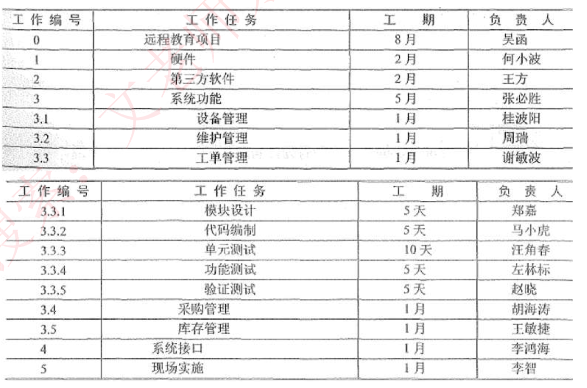

# 范围管理

范围管理确定在项目内**包括什么工作和不包括什么工作**，由此界定的项目范围在项目的全生命周期内可能因种种原因而变化，项目范围管理也要**管理项目范围的这种变化。项目范围的变化也叫变更。**

对项目范围的管理，是通过5个管理过程来实现的：

（1）**编制范围管理计划**。**对如何定义、确认和控制项目范围的过程进行描述。**

（2）**定义范围**。详细描述产品范围和项目范围，编制项目范围说明书，作为以后项目决策的基础。其输入包括：**项目章程。项目范围管理计划。组织过程资产。批准的变更申请。**

（3）**创建工作分解结构**。把**整个项目工作分解为较小的、易于管理的组成部分， 形成一个自上而下的分解结构。**

（4）**确认范围**。**正式验收已完成的可交付成果。**

（5）**范围控制**。**监督**项目和产品的范围状态、管理范围基准变更。

## WBS

WBS 将项目整体或者主要的可交付成果分解成容易管理、方便控制的若干个子项目或者**工作包**，子项目需要继续分解为工作包，持续这个过程，直到**整个项目部分解为可管理的工作包，这些工作包的总和是项目的所有工作范围**。最普通的WBS 如下表所示： 

# 进度管理

进度管理就是采用科学的方法，确定进度目标，编制进度计划和资源供应计划，进行进度控制，在与质量、成本目标协调的基础上，**实现工期目标。**

具体来说，包括以下过程：

（1）**活动定义**：确定完成项目各项可交付成果而需要开展的具体活动。

（2）**活动排序**：识别和记录各项活动之间的先后关系和逻辑关系。

（3） **活动资源估算**：估算完成各项活动所需要的资源类型和效益。

（4）**活动历时估算**：估算完成各项活动所需要的具体时间。

（5）**进度计划编制**：分析活动顺序、活动持续时间、资源要求和进度制约因素， 制订项目进度计划。

（6）**进度控制**：根据进度计划开展项目活动，如果发现偏差，则分析原因或进行调整。

## 进度管理图形

进度安排的常用图形描述方法有Gantt 图（甘特图〉和项目计划评审技术 （Program Evaluation& Review Technique, PERT）图。

**甘特图**，反映了项目任务的并行关系，但没有反映出依赖关系。

**PERT**图 ，反映了任务消耗的时间，以及任务之间的依赖关系，没有没有体现出任务间的并行关系。

## *关键路径

关键路径：是**项目的最短工期**，**但却是从开始到结束时间最长的路径**。进度网络图中可能有多条关键路径，因为活动会变化，因此关键路径也在不断变化中。

关键活动：关键路径上的活动，最早开始时间-最晚开始时间。

通常，每个节点的活动会有如下几个时间：

（1）**最早开始时间**（ES），某项活动能够开始的最早时间。（需要等它前置节点都完成）

（2）**最早结束时间**（EF），某项活动能够完成的最早时间。EF=ES+工期 

（3）**最迟结束时间**（LF）。为了使项目按时完成，某项活动必须完成的最迟的间。

（4）**最迟开始时间**（LS）。为了使项目按时完成，某项活动必须开始的最迟时间。LS=LF-工期

**这几个时间通常作为每个节点的组成部分，如图所示：**

**顺推：从前往后推，最早开始时间ES=所有前置活动最早完成时间EF的最大值；最早完成时间EF=最早开始ES时间+持续时间。**

**逆推：从后往前推，最晚完成时间LF=所有后续活动最晚开始时间LS的最小值；最晚开始时间LS-最晚完成LF时间-持续时间。**

下面教材原图有误，视频里有详细勘误。图D中的最早开始时间应该是20，而不是22

**最后一个节点肯定是在关键路径上，关键路径上的节点的最早开始时间和最晚开始时间都是一样的。**

## 浮动时间

**总浮动时间**：在不延误项目完工时间且不违反进度制约因素的前提下，活动可以从最早开始时间推迟或拖延的时间量，就是该活动的进度灵活性。正常情况下，关键活动的总浮动时间为零。

**总浮动时间**=**最迟开始LS-最早开始ES	或	最迟完成LF-最早完成EF	或	关键路径- 非关键路径时长。**

**自由浮动时间**：是指在不延误任何紧后活动的最早开始时间且不违反进度制约因素的前提下，活动可以从最早开始时间推迟或拖延的时间量。

**自由浮动时间**=**紧后活动最早开始时间的最小值-本活动的最早完成时间。**

> 相当于最多可以休息几天，比如下个紧后活动是20号，但是当前活动最早15号就能完成，那么自由浮动时间就为5天。
>
> 注意关键路径没有浮动时间。

# 成本管理

项目成本管理是在整个项目的实施过程中，为确保项目在批准的预算条件下尽可能保质按期完成，而对所需的各个过程进行管理与控制。

项目成本管理包括**成本估算、成本预算和成本控制**三个过程。

（1）成本估算是对完成项目**所需成本的估计和计划**，是项目计划中的一个重要的、关键的、敏感的部分；成本估算主要靠分解和类推的手段进行，基本估算方法分为三类：自顶向下的估算、自底向上的估算和差别估算法。

（2）成本预算是**把估算的总成本分配到项目的各个工作包**，建立成本基准计 划以衡量项目绩效；**应急储备和管理储备。**

（3）成本控制保证**各项工作在各自的预算范围内进行**。

## 成本类型

（1）**可变成本**：**随着生产量、工作量或时间而变的成本为可变成本**。可变成本又称变动成本。

（2）**固定成本**：**不随生产量、工作量或时间的变化而变化的非重复成本**为固定成本。

（3）**直接成本**：**直接可以归属于项目工作的成本为直接成本**。如**项目团队差旅费、工资、 项目使用的物料及设备使用费等。**

（4）**间接成本**：来自一般管理费用科目或几个项目共同担负的项目成本所**分摊**给本项目的费用，就形成了项目的间接成本，**如税金、额外福利和保卫费用等。**

（5）**机会成本**：**失去的最大收益**，**一般机会成本要小于实际收益**，是利用一定的时间或资源生产一种商品时，而失去的利用这些资源生产其他最佳替代品的机会就是机会成本，泛指一切在做出选择后其中一个最大的损失。

（6）**沉没成本**：是指由于**过去的决策已经发生了的**，而不能由现在或将来的任何决策改变的成本。沉没成本是一种历史成本，对现有决策而言是不可控成本，会很大程度上影响人们的行为方式与决策，**在投资决策时应排除沉没成本的干扰。**

学习曲线：重复生成产品时，**产品的单位成本会随着产量的扩大呈现规律性递减**。估算成本时，也要考虑此因素。

# 软件配置管理

**软件配置管理的内容是配置项**

以下内容都可以作为配置项进行管理：**外部交付的软件产品和数据、指定的内部软件工作产品和数据、指定的用于创建或支持软件产品的支持工具、供方/供应商提供的软件和客户提供的设备/软件。**

典型配置项包括**项目计划书、需求文档、设计文档、源代码、可执行代码、测试用例、 运行软件所需的各种数据**，它们**经评审和检查通过后进入配置管理**。

每个配置项的**主要属性有：名称、标识符、文件状态、版本、作者、日期等。**

配置项可以分为**基线配置项和非基线配置项**两类，例如，**基线配置项**可能包括所有的**设计文档和源程序**等；**非基线配置项**可能包括**项目的各类计划和报告**等。

所有配置项的操作权限应由CMO（配置管理员）严格管理，基本原则是：基线配置项向开发人员开放读取的权限；非基线配置项向PM、CCB及相关人员开放。

## 配置项状态

配置项的状态可分为**"草稿””正式”和”修改”**三种。配置项**刚建立时，其状态为 "草稿〞**。配**置项通过评审后，其状态变为“正式〞**。此后若**更改配置项，则其状态变为“修改**〞。当**配置项修改完毕并重新通过评审时，其状态又变为“正式”。**如图所示：

**版本号一般的格式是 x.y.z**

**其中，草稿状态时，也就是未发布过的状态，x是为0的，如0.12。**

**正式发布之后，x就要大于0了，如1.1。**

**x是大版本，y是小版本，z是修改状态，配置项在修改的时候，一般只增大z值，x和y不变，修改完毕后，状态成正式时，将z置为0，增加x或y的值。**

## 配置项版本管理

在项目开发过程中，绝大部分的配置项都要经过**多次的修改才能最终确定**下来。对配置项的**任何修改都将产生新的版本**。由于我们不能保证新版本一定比旧版本”好”，所以**不能抛弃旧版本**。版本管理的目的是**按照一定的规则保存配置项的所有版本**， 避免发生版本丢失或混淆等现象，并且**可以快速准确地查找到配置项的任何版本。**

## 配置基线

> git代码分支管理中的master分支，就可以看作是一个基线。

**配置基线（常简称为基线）**由**一组配置项组成**，这些配置项**构成一个相对稳定的逻辑实体**。基线中的配置项被”冻结”了，**不能再被任何人随意修改**。对基线的变更必须遵循**正式的变更控制程序**。

基线通常对应于开发过程中的**里程碑**，**一个产品可以有多个基线，也可以只有一个基线**。**交付给外部顾客的基线一般称为发行基线（Release），内部开发使用的基线一般称为构造基线（Build）。**

# 质量管理

质量是**软件产品特性的综合**，**表示软件产品满足明确（基本需求）或隐含 （期望需求）要求的能力**。质量管理是指确定质量方针、目标和职责，并通过质量体系中的质量计划、质量控制、质量保证和质量改进来使其实现的所有管理职能的全部活动；

主要包括以下过程：

（1）**质量规划**：识别项目及其产品的质量要求和标准，并书面描述项目将如何达到这些要求和标准的过程。

（2）**质量保证**：一般是每隔一定时间（如每个阶段末）进行的，主要通过系统的质量审计（软件评审）和过程分析来保证项目的质量。

（3）**质量控制**：实时监控项目的具体结果，以判断它们是否符合相关质量标准， 制订有效方案，以消除产生质量问题的原因。

## *质量的六大特性

**功能性**：一组功能及其指定的性质有关的一组属性

- 适合性
- 准确性
- 互用性
- 依从性
- 安全性

**可靠性**：在规定的一段时间和条件下，软件维持其性能水平有关的一组软件属性

- 成熟性
- 容错性
- 易恢复性

**可用性**：使用的难易程度及规定或隐含用户对使用方式所做的评价有关的属性

- 易理解性
- 易学性
- 易操作性

**效率**：在规定条件下，软件的性能水平和所用资源

- 时间特性
- 资源特性

**可维护性**：进行指定修改所需的努力

- 易分析
- 可修改性
- 稳定性
- 可测试性

**可移植性**：从一个环境移植到另外一个环境

- 适应性
- 可修改性
- 可测试性
- 易理解性

# 风险管理

