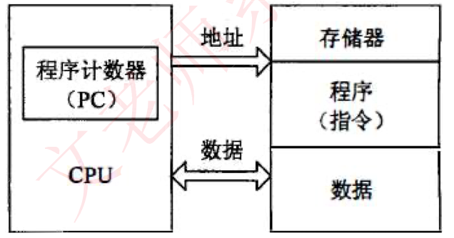
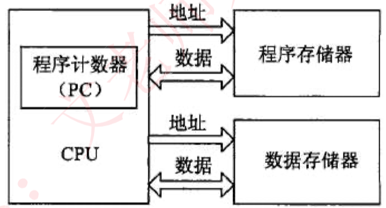
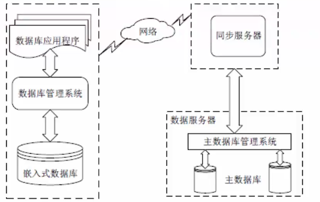

## 冯诺依曼结构和哈佛结构

传统计算机采用冯•诺依曼（Von Neumamn）结构，也称普林斯顿结构， 是一种将**程序指令存储器和数据存储器合并在一起**的存储器结构。

哈佛结构是一种并行体系结构，它的主要特点是将程序和数据存储在不同的存储空间中，即**程序存储器和数据存储器是两个相互独立**的存储器， 每个存储器独立编址、独立访问。

哈佛体系结构特点是程序存储器与数据存储器分开，每个存储器独立编址、独立访问，有着不同的数据宽度。

哈佛体系结构允许在一个机器周期内同时获得指令字和操作数，从而提高了执行速度和数据的吞吐率。

哈佛体系结构的数据存储区与代码存储区是物理分离的，不可能因数据缓冲区溢出而覆盖执行的代码，从而执行到非法构造的代码。

## 微处理器分类

**嵌入式微控制器MCU** （control

- 典型代表是**单片机**，其片上外设资源比较丰富，适合于控制。McU芯片内部集成ROM/EPROM、RAM、 总线、总线逻辑、定时/计数器、看门狗、V/0l 串行口、脉宽调制输出、A/D、 D/A、 Flash RAM、 EEPROM等各种必要功能和外设。和嵌入式微处理器相比，微控制器的最大特点是单片化， 体积大大减小，从而使功耗和成本下降、可靠性提高，其片上外设资源一般较丰富，**适合于控制，是嵌入式系统工业的主流。** 

**嵌入式微处理器MPU** （process

- 由**通用计算机中的CPU演变而**来。它的特征是具有**32位以上的处理器**，具有较高的性能，当然其价格也相应较高。但与计算机处理器不同的是，在实际嵌入式应用中，**只保留和嵌入式应用紧密相关的功能硬件，去除其他的冗余功能部分，这样就以最低的功耗和资源实现嵌入式应用的特殊要求**。与工业控制计算机相比，嵌入式微处理器具有体积小、重量轻、成本低、 可靠性高的优点。目前常见的有ARM、 MIPS、 POWER PC等。

**嵌入式数字信号处理器DSP** 

- 是**专门用于信号处理方面的处理器**，其在系统结构和指令算法方面进行了特殊设计，**具有很高的编译效率和指令的执行速度**。**采用哈佛结构，流水线处理**，其处理速度比最快的CPU还快10-50倍。在数字滤波、FFT、谱分析等各种仪器上DSP获得了大规模的应用。

**嵌入式片上系统SOC**  

- 是**追求产品系统最大包容的集成器件**。SoC最大的特点是成功实现了软硬件无缝结合，直接在处理器片内嵌入操作系统的代码模块。是—个有专用目标的集成电路，其中包含完整系统并有嵌入软件的全部内容。

## 多核处理器

**多核指多个微处理器内核**，是将两个或更多的微处理器封装在一起，集成在一个电路中。**多核处理器是单枚芯片**，能够直接插入单一的处理器插槽中。多核与多CPU相比， 很好的**降低了计算机系统的功耗和体积**。在多核技术中，**由操作系统软件进行调度，多进程，多线程并发都可以。**

2个或多个内核工作协调实现方式：

**对称多处理技术**SMP：将2颗完全一样的处理器封装在一个芯片内，达到双倍或接近双倍的处理性能，节省运算资源。

**非对称处理技术**AMP：2个处理内核彼此不同，各自处理和执行特定的功能，在软件的协调下分担不同的计算任务。

**多核CPU的调度**

多核CPU环境下进程的调度算法一般有全局队列调度和局部队列调度两种.

**全局队列调度** 是指操作系统维护一个全局的任务等待队列，当系统中有一个CPU空闲时， 操作系统就从全局任务等待队列中选取就绪任务开始执行，CPU核心；利用率高。

**局部队列调度** 是操作系统为每个CPU内核维护一个局部的任务等待队列，当系统中有一个CPU内核空闲时，就从该核心的任务等待队列中选取适当的任务执行，优点是无需在多个CPU之间切换。

## 嵌入式软件

嵌入式软件是指**应用在嵌入式计算机系统当中的各种软件**，除了具有通用软件的一般特性，还具有一些与嵌入式系统相关的特点，包括：**规模较小、开发难度大（软件要去适配硬件）、实时性和可靠性要求高、要求固化存储（程序要烧入）。**

**嵌入式软件分类**：

**系统软件**：**控制和管理嵌入式系统资源**，为嵌入式应用提供支持的各种软件， 如设备驱动程序、嵌入式操作系统、嵌入式中间件等。

**应用软件**：嵌入式系统中的**上层软件**，定义了嵌入式设备的主要功能和用途， 并负责与用户交互，一般面向特定的应用领域，如飞行控制软件、手机软件、 地图等。

**支撑软件**：**辅助软件开发的工具软件**，如系统分析设计工具、在线仿真工具、 交叉编译器等。

## BSP板级支持包

> 属于操作系统中的驱动层支持，为操作系统提供操作硬件的接口

**板级支持包（BSP）**是介于**主板硬件和操作系统中驱动层程序之间的一层**，一般认为它属于操作系统一部分，主要是实现对操作系统的支持，为**上层的驱动程序提供访问硬件设备寄存器的函数包**，使之能够更好的运行于硬件主板。

**具体功能包括：**

1.单板硬件初始化，主要是CPU的初始化，为整个软件系统提供底层硬件支持
2.为操作系统提供设备驱动程序和系统中断服务程序
3.定制操作系统的功能，为软件系统提供一个实时多任务的运行环境
4.初始化操作系统，为操作系统的正常运行做好准备。

**主要具有以下两个特点：**

- **硬件相关性**，因为嵌入式实时系统的硬件环境具有应用相关性，而作为上层软件与硬件平台之间的接口，BSP需为操作系统提供操作和控制具体硬件的方法。

- **操作系统相关性**，不同的操作系统具有各自的软件层次结构，因此不同操作系统具有特定的硬件接口形式。

**一般来说，BSP主要包括两个方面的内容：引导加载程序BootLoader和设备驱动程序。**

### 引导加载程序BootLoader

 **BootLoader**是**嵌入式系统加电后运行的第一段软件代码**，是在操作系统内核运行之前运行的一小段程序，通过这段程序，可以初始化硬件设备、建立内存空间的映射图，从而将系统的软硬件环境设置到一个合适的状态，以便为最终调作系统内核做好准备。一般包括以下功能：

**片级初始化：主要完成微处理器芯片的初始化**，包括设置微处理器的核心寄存器和控制寄存器、微处理器的核心工作模式及其局部总线模式等。片级初始化把微处理器从上电时的默认状态逐步设置成系统所要求的工作状态。这是一个纯硬件的初始化过程。

**板级初始化**：通过正确地设置各种寄存器的内容来完成**微处理器以外的其他硬件设备的初始化**。例如，初始化LED显示设备、初始化定时器、设置中断控制奇存器、初始化串口通信、初始化内存控制器、建立内存空间的地址映射等。在此过程中，除了要设置各种硬件寄存器以外，还要设置某些软件的数据结构和参数。因此，这是一个同时包含有软件和硬件在内的初始化过程。

**系统级初始化**：**加载操作系统内核**，将操作系统和应用程序的映像从Flash存储器复制到系统的内存当中，然后跳转到系统内核的第一条指令处继续执行。

### 设备驱动程序

在一个嵌入式系统当中，**操作系统是可能有也可能无的**。**但设备驱动程序是必不可少的**。**所谓的设备驱动程序，就是一组库函数**，**用来对硬件进行初始化和管理，并向上层软件提供良好的访问接口。**

对于不同的硬件设备来说，它们的功能是不一样的，所以它们的设备驱动程序也是不一样的。但是一般来说，大多数的设备驱动程序都会具备以下的一些基本功能。

- 硬件启动：在开机上电或系统重启的时候，对硬件进行初始化。

- 硬件关闭：将硬件设置为关机状态。

- 硬件停用：暂停使用这个硬件。

- 硬件启用：重新启用这个硬件。

- 读操作：从硬件中读取数据。

- 写操作：往硬件中写入数据。

## 嵌入式系统的组成

（1）**嵌入式处理器**。嵌入式系统的核心部件是各种类型的嵌入式处理器。

（2） **总线**。嵌入式系统的总线一般分为片内总线和片外总线。

（3）**存储器**。嵌入式系统的存储器主要包括主存和外存。

（4）**I/O设备与接口**。嵌入式系统的输入设备因其应用领域的不同，有多种多样，比较常见的有键盘、鼠标、触摸屏、手柄和声控开关等。

（5）**操作系统**。嵌入式操作系统由操作系统内核、应用程序接口和设备驱动程序接口等几部分组成，一般采用微内核结构。

（6）**应用支撑软件**。应用支撑软件一般由窗口系统、网络系统、数据库管理系统和Java 虚拟机等部分组成，但这些部分都不是必须的，不同的嵌入式系统具有不同的应用支撑软件。

（7）**应用软件**。应用软件位于嵌入式系统层次结构的最上层，直接与最终用户交互，是系统整体功能的集中体现。

## 嵌入式系统的特点

（1）**系统专用性强**。嵌入式系统是针对具体应用的专门系统。它的个性化很强， 软件和硬件结合紧密。一般要针对硬件进行软件的开发和移植，根据硬件的变化和增减对软件进行修改。

（2）**系统实时性强**。很多嵌入式系统对外来事件要求**在限定的时间内及时做出响应，具有实时性。**

（3） **软硬件依赖性强**。嵌入式系统的专用性决定了**其软硬件的互相依赖性很强**， 两者必须协同设计，以达到共同实现预定功能的目的，并满足性能、成本和可靠性等方面的严格要求。

（4）**处理器专用**。嵌入式系统的处理器一般是为某一特定目的和应用而专门设计的。通常具有功耗低、体积小和集成度高等优点。

（5）**多种技术紧密结合**。通用计算机技术也离不开这些技术，但它们相互结合的紧密程度不及嵌入式系统。

（6）**系统透明性**。嵌入式系统在形态上与通用计算机系统差异甚大。它的输入设备往往不是常见的鼠标和键盘之类的设备，甚至没有输出裝置。

（7）**系统资源受限**。嵌入式系统为了达到结构紧凑、高可靠性和低成本的目的， 其存储容量、I/O 设备的数量和处理器的处理能力都比较有限。

## 嵌入式数据库系统EDBMS

> 手机就是一个移动的嵌入式设备，手机中的文件信息就存在机身自己的EDBMS中。

**使用环境的特点：**

（1）**设备随时移动性**。嵌入式数据库主要用在移动信息设备上，设备的位置经常随使用者一起移动。

（2）**网络频繁断接**。移动设备或移动终端在使用的过程中，位置经常发生变化， 同时也受到使用方式、电源、无线通信和网络条件等因素的影响。所以，一般并不持续保持网络连接，而是经常主动或被动地间歇性断接和连接。

（3）**网络条件多样化**。由于移动信息设备位置的经常变化，导致它们与数据库服务器在不同的时间可能通过不同的网络系统连接，这些网络在带宽、通信代价、网络延迟和QoS 等方面可能有所差异。

（4）**通信能力不对称**。由于受到移动设备资的源限制，移动设备与服务器之间的网络通信能力是非对称的。移动设备的发送能力都非常有限，使得数据库服务器到移动设备的下行通信带宽和移动设备到数据库服务器之问的上行带宽相差很大。

**系统组成：**

一个完整的EDBMS 由若干子系统组成，包括**主数据库、同步服务器、嵌入式数据库和连接网络**等几个子系统：

嵌入式移动数据库在实际应用中必须解决好数据的**一致性（复制性）、高效的事务处理和数据的安全性**等关键问题。

## 嵌入式实时操作系统RTOS

> 要在规定时间返回正确响应。及时 且 正确

嵌入式实时系统是一种完全嵌入受控器件内部，为特定应用而设计的专用计算机系统。在嵌入式实时系统中，**要求系统在投入运行前即具有确定性和可预测性。**

**可预测性** 是指系统在运行之前，其功能、响应特性和执行结果是可预测的；

**确定性** 是指系统在给定的初始状态和输入条件下，在确定的时间内给出确定的结果。

## 嵌入式软件开发

交叉编码

交叉调试