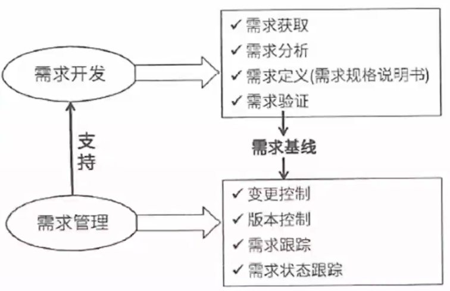
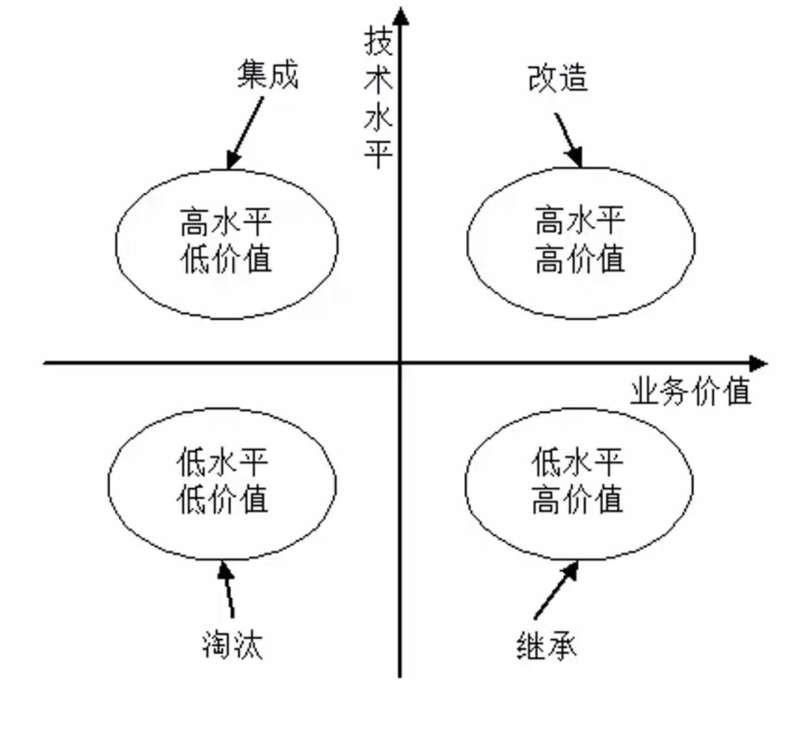

# 案例分析解题技巧

13:30～15:00	90分钟，3个题

第一题必做，先做第一题。

后边四选二，快速浏览题目问题，看题目描述。

回答的时候按点回答，不要超字数。

每道题控制在25分钟。

# 系统规划

考点：系统规格步骤，各个子步骤具体含义，**可行性研究报告内容，可行性研究，净现值计算。**

## 系统规划步骤

**系统规划 不只是可行性分析，还有系统的初步建设方案，产出系统设计任务书。**

[系统规划步骤]:10_系统规划#系统规划步骤

## 可行性研究四方面

1. 经济可行性：主要评估项目的建设成本，运行成本和项目建成后可能的经济效益，判断项目是否值得建设。
2. 技术可行性：研究的对象是信息系统需要实现的功能和性能，以及技术能力约束。
3. 法律可行性：具有比较广泛的内容，它需要从政策、法律、道德、制度等社会因素来论证信息系统建设的现实性。
4. 用户使用可行性：从信息系统用户的角度来评估系统的可行性，包括企业的行政管理和工作制度、使用人员的素质和培训要求等。

## 成本效益分析

**按照成本性态分类：**

（1）**固定成本**。固定成本是指其总额在一定期间和一定业务量范围内，**不受业务量变动的影响而保持固定不变的成本**。例如，管理人员的工资、办公费、固定资产折l旧费、员工培训费等。

（2）**变动成本**。变动成本也称为可变成本，**是指在一定时期和一定业务量范围内其总额随着业务量的变动而成正比例变动的成本**。例如，直接材料费、产品包装费、外包费用、开发奖金（类似于提成）等。

（3）**混合成本**。混合成本就是混合了固定成本和变动成本的性质的成本。例， 如水电费、电话费等。这些成本通常有一个基数，超过这个基数就会随业务量的增大而增大。

## 净现值计算

考点：**计算 投资收益率 和 投资回报周期（区分静态和动态）**

[净现值计算]:10_系统规划#*净现值计算

题目没有给静态或动态，默认按动态算。

动态收益计算方式：考虑金钱具有的时间价值，现在的钱比未来值钱。

# 系统分析

考点：

需求获取、需求分析、需求定义（需求规格说明书内容），需求验证，需求管理（变更流程）、逆向工程、软件重构

*需求分析

- 结构化的需求分析，包含数据流图（状态转换图和ER图不怎么考
- 面向对象的需求分析，UML图（用例图、状态图、类图、活动图、时序图）

建议浏览教材：

- 第8章 软件工程 
- 第10章 系统分析 
- 第11章 软件需求工程
- 第12章 软件架构设计
- 第13章 系统设计

## 需求的层次

[需求的层次]:11_系统分析#需求的层次

1. **业务需求**：**企业或客户对系统高层次的目标要求**。
2. **用户需求**：即描述了**用户能使用系统来做什么**。
3. **系统需求**：从系统的角度来说明软件的需求，包括**功能需求、非功能需求和设计约束**等。
   - **功能需求**：也称为行为需求，规定了**开发人员必须在系统中实现的软件功能**， 用户利用这些功能来完成任务，满足业务需要。
   - **非功能需求**：指**系统必须具备的属性或品质**，通常指**性能和质量**。
   - **设计约束**：也称为**限制条件或补充规约**，通常由外部强制规定，如采用国有自主知识产权的数据库系统。

## 需求的获取

[需求的获取]: 11_系统分析#需求获取

**常见的需求获取法包括**：

（1）用户访谈：1对1～3，找有代表性的用户。其形式包括结构化和非结构化两种。存在**需求信息量大，记录困难，需要领域知识的问题。**

（2）问卷调查：用户多，无法一一访谈，优点：数据来源多，缺点：不够灵活

（3）采样：**数理统计**，从种群中系统地选出有代表性的样本集的过程。样本数量=0.25* (可信度因子/错误率)^2，优点：采样数量少，缺点：样本不具备代表性。

（4）情节串联板：一系列图片，通过这些图片來讲故事。优点：直观，有交互，缺点：制作成本高。

**（5）联合需求计划（JRP）：通过联合各个关键用户代表、系统分析师、开发团队代表一起，通过有组织的会议来讨论需求。**优点：多方参与度，信息对齐度高，减少信息差，降低沟通成本，适合解决需求不明确需要讨论确定的需求，缺点：比较锻炼会议组织者的相关能力，会议议题需要明确，需要所有人共同在同一个时间出席。

（6）需求记录技术：任务卡片、场景说明、用户故事、Volere白卡。

## 真题

### 1.微服务中应该包含的内容：

试题答案：问题1：一个微服务中应该包含的内容有：资源、对资源的操作、API集合。

### 2.微服务与传统单体系统相比2个优势和2个挑战

微服务的优势：

（1）解决了复杂性问题。它把庞大的单一模块应用分解为一系列的服务，同时保持总体功能不变。

（2）让每个服务能够独立开发，开发者能够自由选择可行的技术，让服务来决定APl约定。

（3）每个微服务都能独立配置，开发者不必协调对于本地服务配置上的变化，这种变化一旦测试完成就被配置了。

（4）让每个服务都可以独立调整，你可以给每个服务配置正好满足容量和可用性限制的实例数。

微服务架构带来的挑战：

（1）并非所有的系统都能转成微服务。例如一些数据库层的底层操作是不推荐服务化的。

（2）部署较以往架构更加复杂：系统由众多微服务搭建，每个微服务需要单独部署，从而增加部署的复杂度，容器技术能够解决这一问题。

（3）性能问题：由于微服务注重独立性，互相通信时只能通过标准接口，可能产生延迟或调用出错。例如一个服务需要访问另一个服务的数据，只能通过服务间接口来进行数据传输，如果是频繁访问，则可能带来较大的延迟。

（4）数据一致性问题：作为分布式部署的微服务，在保持数据一致性方面需要比传统架构更加困难。

# 系统运维

考点：**遗留系统、系统转换、数据迁移**、软件维护；冗余技术、容错技术、集群技术、负载均衡。

 **遗留系统** 是指任何基本上**不能进行修改和演化以满足新的变化**的业务需求的信息系统，它通常具有以下特点：

（1）系统虽然完成企业中许多重要的业务管理工作，**但仍然不能完全满足要求**。一般实现业务处理电子化及部分企业管理功能，很少涉及经营决策。

（2）系统在性能上已经落后，采用的**技术已经过时**。例如，多采用主机/终端形式或小型机系统， 软件使用汇编语言或第三代程序设计语言的早期版本开发，使用文件系统而不是数据库。

（3）通常是大型的软件系统，已经融入企业的业务运作和决策管理机制之中，**维护工作十分困难**。

（4） 没有使用现代信息系统建设方法进行管理和开发，现在基本上已经没有文档，**很难理解**。

## 遗留系统演化策略

## 新老系统转换策略

系统转换是指**新系统开发完毕， 投入运行，取代现有系统的过程**，需要考虑多方面的问题，以实现与老系统的交接，有以下三种转换计划：

1. **直接转换**：**现有系统被新系统直接取代了**，风险很大，适用于新系统不复杂， 或者现有系统已经不能使用的情况。优点是节省成本

2. **并行转换**：**新系统和老系统并行工作一段时间**，新系统经过试运行后再取代， 若新系统在试运行过程中有问题， 也不影响现有系统的运行，风险极小，在试运行过程中还可以比较新老系统的性能，适用于大型系统。缺点是耗费人力和时间资源，难以控制两个系统间的数据转换。

3. **分段转换**：**分期分批逐步转换**，是直接和并行转换的集合，**将大型系统分为多个子系统**，依次试运行每个子系统，成熟一个子系统，就转换一个子系统。同样适用于大型项目，只是更耗时，而且现有系统和新系统间混合使用，需要协调好接口等问题。

## 新老系统的数据转换与迁移

- 系统切换前通过工具迁移
- 系统切换前采用手工录入
- 系统切换后通过新系统生成

**ETL ： 抽取-转换-装载**

**数据迁移前的准备工作包括：**

（1）**待迁移数据源的详细说明**，包括数据的存放方式、数据量和数据的时间跨度。

（2）建立**新旧系统数据库的数据字典**，对现有系统的历史数据进行质量分析，以及新旧系统数据结构的差异分析。

（3） 新旧系统代码**数据的差异分析**。

（4） 建立新旧系统**数据库表的映射关系**，对无法映射字段的处理方法。

（5）开发或购买、部署ETL工具。

（6）编写数据转换的**测试计划和校验程序**。

（7）制定**数据转换的应急措施**。

数据迁移后的校验：**对迁移后的数据进行质量分析；新旧系统查询数据对比检查。**

## 可维护性的评价指标

系统的**可维护性**可以定义为**维护人员理解、改正、改动和改进这个软件的难易程度**，其评价指标如下：

（1）**易分析性**。软件产品诊断软件中的缺陷或失效原因或识别待修改部分的能力。

（2）**易改变性**。软件产品使指定的修改可以被实现的能力，实现包括编码、设计和文档的更改。

（3） **稳定性**。软件产品避免由于软件修改而造成意外结果的能力。

（4）**易测试性**。软件产品使已修改软件能被确认的能力。

## 软件维护的分类

系统维护包括**硬件维护、软件维护和数据维护**，其中**软件维护类型如下**：

**正确性维护**：发现了bug而进行的修改。

**适应性维护**：由于外部环境发生了改变，被动进行的对软件的修改和升级。

**完善性维护**：基于用户主动对软件提出更多的需求，修改软件，增加更多的功能，使其比之前的软件功能、性能更高，更加完善。

**预防性维护**：对未来可能发生的bug进行预防性的修改。

# 进度计算

# 数据库

# 嵌入式

# Web架构
