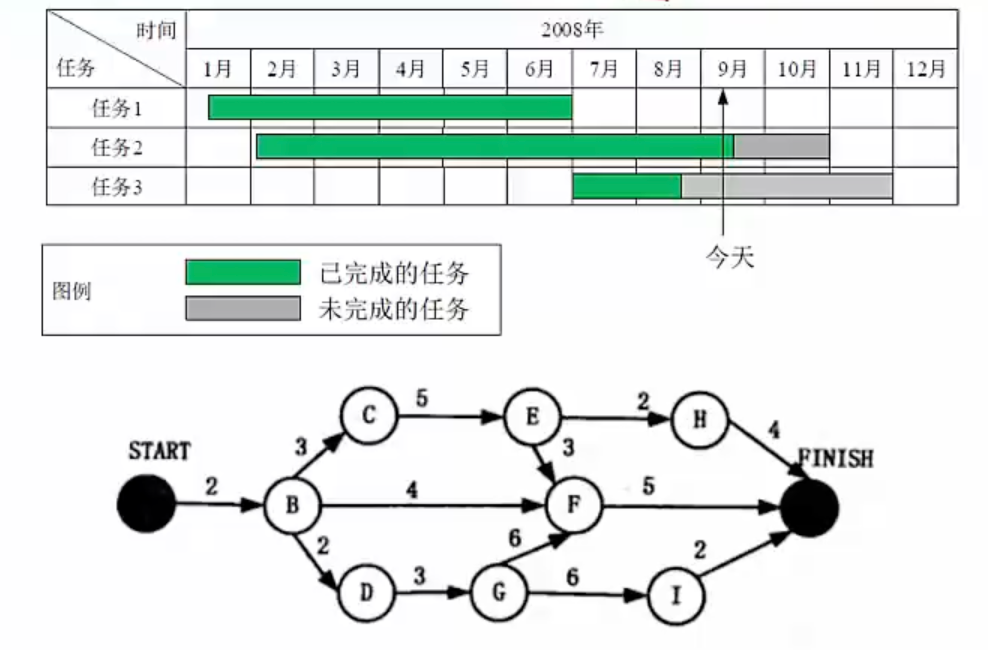
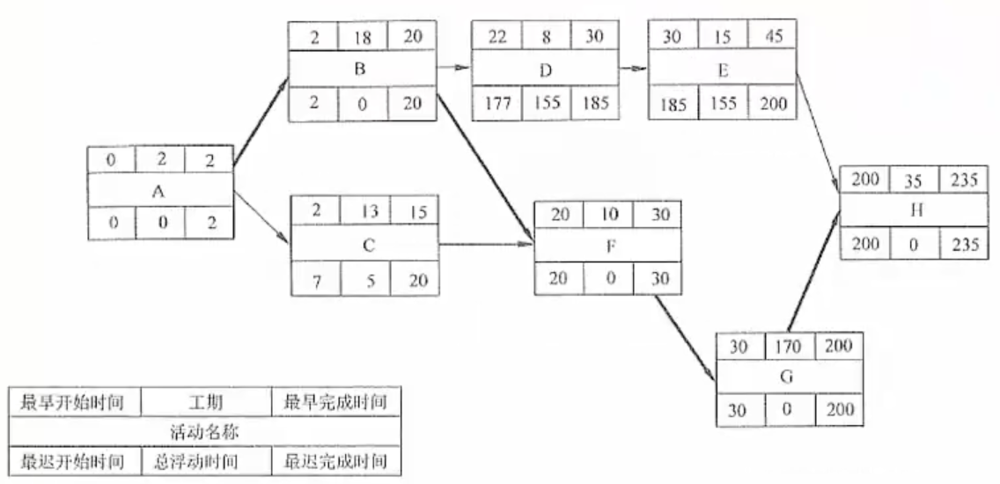
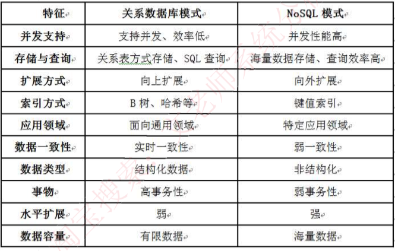
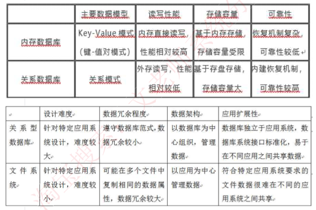
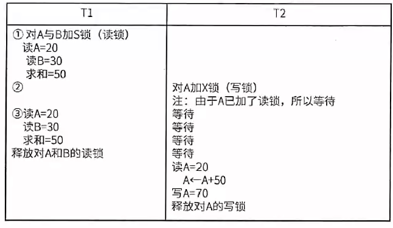

# 考试时间

基础知识和案例一起考 4h

考试时间 8:30

# 2023真题解析

https://zhuanlan.zhihu.com/p/634647977

# 一、系统规划

考点：系统规格步骤，各个子步骤具体含义，**可行性研究报告内容，可行性研究，净现值计算。**

## 系统规划步骤

**系统规划 不只是可行性分析，还有系统的初步建设方案，产出系统设计任务书。**

[系统规划步骤]:10_系统规划#系统规划步骤

## 可行性研究四方面

1. 经济可行性：主要评估项目的建设成本，运行成本和项目建成后可能的经济效益，判断项目是否值得建设。
2. 技术可行性：研究的对象是信息系统需要实现的功能和性能，以及技术能力约束。
3. 法律可行性：具有比较广泛的内容，它需要从政策、法律、道德、制度等社会因素来论证信息系统建设的现实性。
4. 用户使用可行性：从信息系统用户的角度来评估系统的可行性，包括企业的行政管理和工作制度、使用人员的素质和培训要求等。

## 成本效益分析

**按照成本性态分类：**

（1）**固定成本**。固定成本是指其总额在一定期间和一定业务量范围内，**不受业务量变动的影响而保持固定不变的成本**。例如，管理人员的工资、办公费、固定资产折l旧费、员工培训费等。

（2）**变动成本**。变动成本也称为可变成本，**是指在一定时期和一定业务量范围内其总额随着业务量的变动而成正比例变动的成本**。例如，直接材料费、产品包装费、外包费用、开发奖金（类似于提成）等。

（3）**混合成本**。混合成本就是混合了固定成本和变动成本的性质的成本。例， 如水电费、电话费等。这些成本通常有一个基数，超过这个基数就会随业务量的增大而增大。

## 净现值计算

考点：**计算 投资收益率 和 投资回报周期（区分静态和动态）**

[净现值计算]:10_系统规划#*净现值计算

题目没有给静态或动态，默认按动态算。

动态收益计算方式：考虑金钱具有的时间价值，现在的钱比未来值钱。

# 二、系统分析

考点：

需求获取、需求分析、需求定义（需求规格说明书内容），需求验证，需求管理（变更流程）、逆向工程、软件重构

*需求分析

- 结构化的需求分析，包含数据流图（状态转换图和ER图不怎么考
- 面向对象的需求分析，UML图（用例图、状态图、类图、活动图、时序图）

建议浏览教材：

- 第8章 软件工程 
- 第10章 系统分析 
- 第11章 软件需求工程
- 第12章 软件架构设计
- 第13章 系统设计

## 需求的层次

[需求的层次]:11_系统分析#需求的层次

1. **业务需求**：**企业或客户对系统高层次的目标要求**。
2. **用户需求**：即描述了**用户能使用系统来做什么**。
3. **系统需求**：从系统的角度来说明软件的需求，包括**功能需求、非功能需求和设计约束**等。
   - **功能需求**：也称为行为需求，规定了**开发人员必须在系统中实现的软件功能**， 用户利用这些功能来完成任务，满足业务需要。
   - **非功能需求**：指**系统必须具备的属性或品质**，通常指**性能和质量**。
   - **设计约束**：也称为**限制条件或补充规约**，通常由外部强制规定，如采用国有自主知识产权的数据库系统。

## 需求的获取

[需求的获取]: 11_系统分析#需求获取

**常见的需求获取法包括**：

（1）用户访谈：1对1～3，找有代表性的用户。其形式包括结构化和非结构化两种。存在**需求信息量大，记录困难，需要领域知识的问题。**

（2）问卷调查：用户多，无法一一访谈，优点：数据来源多，缺点：不够灵活

（3）采样：**数理统计**，从种群中系统地选出有代表性的样本集的过程。样本数量=0.25* (可信度因子/错误率)^2，优点：采样数量少，缺点：样本不具备代表性。

（4）情节串联板：一系列图片，通过这些图片來讲故事。优点：直观，有交互，缺点：制作成本高。

**（5）联合需求计划（JRP）：通过联合各个关键用户代表、系统分析师、开发团队代表一起，通过有组织的会议来讨论需求。**优点：多方参与度，信息对齐度高，减少信息差，降低沟通成本，适合解决需求不明确需要讨论确定的需求，缺点：比较锻炼会议组织者的相关能力，会议议题需要明确，需要所有人共同在同一个时间出席。

（6）需求记录技术：任务卡片、场景说明、用户故事、Volere白卡。

## 真题

### 1.微服务中应该包含的内容：

试题答案：问题1：一个微服务中应该包含的内容有：资源、对资源的操作、API集合。

### 2.微服务与传统单体系统相比2个优势和2个挑战

微服务的优势：

（1）解决了复杂性问题。它把庞大的单一模块应用分解为一系列的服务，同时保持总体功能不变。

（2）让每个服务能够独立开发，开发者能够自由选择可行的技术，让服务来决定APl约定。

（3）每个微服务都能独立配置，开发者不必协调对于本地服务配置上的变化，这种变化一旦测试完成就被配置了。

（4）让每个服务都可以独立调整，你可以给每个服务配置正好满足容量和可用性限制的实例数。

微服务架构带来的挑战：

（1）并非所有的系统都能转成微服务。例如一些数据库层的底层操作是不推荐服务化的。

（2）部署较以往架构更加复杂：系统由众多微服务搭建，每个微服务需要单独部署，从而增加部署的复杂度，容器技术能够解决这一问题。

（3）性能问题：由于微服务注重独立性，互相通信时只能通过标准接口，可能产生延迟或调用出错。例如一个服务需要访问另一个服务的数据，只能通过服务间接口来进行数据传输，如果是频繁访问，则可能带来较大的延迟。

（4）数据一致性问题：作为分布式部署的微服务，在保持数据一致性方面需要比传统架构更加困难。

# 三、系统运维

考点：**遗留系统、系统转换、数据迁移**、软件维护；冗余技术、容错技术、集群技术、负载均衡。

## 遗留系统演化策略

## 新老系统转换策略

系统转换是指**新系统开发完毕， 投入运行，取代现有系统的过程**，需要考虑多方面的问题，以实现与老系统的交接，有以下三种转换计划：

1. **直接转换**：**现有系统被新系统直接取代了**，风险很大，适用于新系统不复杂， 或者现有系统已经不能使用的情况。优点是节省成本

2. **并行转换**：**新系统和老系统并行工作一段时间**，新系统经过试运行后再取代， 若新系统在试运行过程中有问题， 也不影响现有系统的运行，风险极小，在试运行过程中还可以比较新老系统的性能，适用于大型系统。缺点是耗费人力和时间资源，难以控制两个系统间的数据转换。

3. **分段转换**：**分期分批逐步转换**，是直接和并行转换的集合，**将大型系统分为多个子系统**，依次试运行每个子系统，成熟一个子系统，就转换一个子系统。同样适用于大型项目，只是更耗时，而且现有系统和新系统间混合使用，需要协调好接口等问题。

## 新老系统的数据转换与迁移

- 系统切换前通过工具迁移
- 系统切换前采用手工录入
- 系统切换后通过新系统生成

**ETL ： 抽取-转换-装载**

**数据迁移前的准备工作包括：**

（1）**待迁移数据源的详细说明**，包括数据的存放方式、数据量和数据的时间跨度。

（2）建立**新旧系统数据库的数据字典**，对现有系统的历史数据进行质量分析，以及新旧系统数据结构的差异分析。

（3） 新旧系统代码**数据的差异分析**。

（4） 建立新旧系统**数据库表的映射关系**，对无法映射字段的处理方法。

（5）开发或购买、部署ETL工具。

（6）编写数据转换的**测试计划和校验程序**。

（7）制定**数据转换的应急措施**。

数据迁移后的校验：**对迁移后的数据进行质量分析；新旧系统查询数据对比检查。**

## 可维护性的评价指标

系统的**可维护性**可以定义为**维护人员理解、改正、改动和改进这个软件的难易程度**，其评价指标如下：

（1）**易分析性**。软件产品诊断软件中的缺陷或失效原因或识别待修改部分的能力。

（2）**易改变性**。软件产品使指定的修改可以被实现的能力，实现包括编码、设计和文档的更改。

（3） **稳定性**。软件产品避免由于软件修改而造成意外结果的能力。

（4）**易测试性**。软件产品使已修改软件能被确认的能力。

## 软件维护的分类

系统维护包括**硬件维护、软件维护和数据维护**，其中**软件维护类型如下**：

**正确性维护**：发现了bug而进行的修改。

**适应性维护**：由于外部环境发生了改变，被动进行的对软件的修改和升级。

**完善性维护**：基于用户主动对软件提出更多的需求，修改软件，增加更多的功能，使其比之前的软件功能、性能更高，更加完善。

**预防性维护**：对未来可能发生的bug进行预防性的修改。

# 四、项目管理-进度管理

## 进度管理的图形

进度安排的常用图形描述方法有Gantt 图（甘特图〉和项目计划评审技术 （Program Evaluation& Review Technique, PERT）图。

### 甘特图

**甘特图**，反映了项目任务的并行关系，但没有反映出依赖关系。

### PERT图

**PERT**图 ，反映了任务消耗的时间，以及任务之间的依赖关系，没有没有体现出任务间的并行关系。

## *关键路径

关键路径：是**项目的最短工期**，**但却是从开始到结束时间最长的路径**。进度网络图中可能有多条关键路径，因为活动会变化，因此关键路径也在不断变化中。

关键活动：关键路径上的活动，最早开始时间-最晚开始时间。

通常，每个节点的活动会有如下几个时间：

（1）**最早开始时间**（ES），某项活动能够开始的最早时间。（需要等它前置节点都完成）

（2）**最早结束时间**（EF），某项活动能够完成的最早时间。EF=ES+工期 

（3）**最迟结束时间**（LF）。为了使项目按时完成，某项活动必须完成的最迟的间。

（4）**最迟开始时间**（LS）。为了使项目按时完成，某项活动必须开始的最迟时间。LS=LF-工期

**这几个时间通常作为每个节点的组成部分，如图所示：**

**顺推：从前往后推，最早开始时间ES=所有前置活动最早完成时间EF的最大值；最早完成时间EF=最早开始ES时间+持续时间。**

**逆推：从后往前推，最晚完成时间LF=所有后续活动最晚开始时间LS的最小值；最晚开始时间LS-最晚完成LF时间-持续时间。**

下面教材原图有误，视频里有详细勘误。图D中的最早开始时间应该是20，而不是22

**最后一个节点肯定是在关键路径上，关键路径上的节点的最早开始时间和最晚开始时间都是一样的，所以总浮动时间都是0。**

## 浮动时间

**总浮动时间(总时差、松弛时差)**：在不延误项目完工时间且不违反进度制约因素的前提下，活动可以从最早开始时间推迟或拖延的时间量，就是该活动的进度灵活性。正常情况下，关键活动的总浮动时间为零。

**总浮动时间**=**最迟开始LS-最早开始ES	或	最迟完成LF-最早完成EF	或	关键路径- 非关键路径时长。**

**自由浮动时间**：是指在不延误任何紧后活动的最早开始时间且不违反进度制约因素的前提下，活动可以从最早开始时间推迟或拖延的时间量。

**自由浮动时间**=**紧后活动最早开始时间的最小值-本活动的最早完成时间。**

> 相当于最多可以休息几天，比如下个紧后活动是20号，但是当前活动最早15号就能完成，那么自由浮动时间就为5天。
>
> 注意关键路径没有浮动时间。

# 五、数据库

考点：范式和模式分解考的比较少，主要是**事务并发**，及新概念（如ORM、NoSQL、Redis、反范式设计

## ORM

ORM 把数据库映射成对象。如：

数据库的表 （table） >类 （class）

记录（record，行数据）->对象 （object） 

字段（field）->对象的属性 （attribute） 

**ORM优点：**

1、使用ORM可以大大降低学习和开发成本。
2、程序员不用再写SQL来进行数据库操作。
3、减少程序的代码量。
4、降低由于SQL代码质量差而带来的影响。 

**ORM缺点:**

1、不太容易处理复杂查询语句。
2、性能较直接用SQL差。

## 数据库分类比较

**关系型数据库**：关系数据库，是建立在关系模型基础上的数据库，借助集合代数等数学概念和方法来处理数据库中的数据。现实世界中的各种实体以及实体之间的各种联系均用关系模型来表示。简单说，关系型数据库是由多张能互相联接的二维行列表格组成的数据库。

**NoSQL**：**泛指非关系型的数据库**。随着互联网的兴起，传统的关系数据库在应付超大规模和高并发的纯动态网站已经显得力不从心，暴露了很多难以克服的问题，而非关系型的数据库则由于其本身的特点得到了非常迅速的发展。**NosQl数据库的产生就是为了解决大规模数据集合多重数据种类带来的挑战，尤其是大数据应用难题，包括超大规模数据的存储。**

**内存数据库**：将数据库整体存储在内存中，提高性能。

## 缓存技术

**MemCache**: Memcache是—个高性能的分布式的内存对象缓存系统，用于动态Web应用以减轻数据库负载。Memcache通过在内存里维护一个统一的巨大的hash表，它能够用来存储各种格式的数据，包括图像、规频、文件以及数据库检索的结果等。

**Redis**: Redis是—个开源的使用ANSIC语言编写、支持网络、可基于内存亦可持久化的日志型、 Key-Value数据库，并提供多种语言的APl。

**Redis与Memcache的差异：**

1. Redis和Memcache都是将数据存放在内存中，都是内存数据库。他们都支持key-value数据类型。同时Memcache还可用于缓存其他东西，例如图片、现频等等，Redis还支持list、 set、 hash等数据结构的存储。
2. 在Redis中，并不是所有的数据都一直存储在内存中的。这是和Memcache相比一个最大的区别。当物理内存用完时，Redis可以将一些很久没用到的value交换到磁盘。
3. Redis在很多方面支持数据库的特性，可以这样说他就是一个数据库系统，而Memcache只是简单地K/缓存。

## 关系数据库和NoSQL数据库比较

**向上扩展和向外扩展**：向外扩展也叫做水平扩展，可以通过加机器的方式把数据分散到新机器上，比如利用hash环的思想。但数据库在做水平扩展的时候 涉及到分库分表和数据迁移，所以水平扩展能里较弱。

## 关系数据库和内存数据库比较

## 并发控制

事务：由一系列操作组成，这些操作，要么全做，要么全不做，拥有四种特性，详解如下：

（操作）**原子性**：要么全做，要么全不做。

（数据）**一致性**：事务发生后数据是一致的，例如银行转账，不会存在A账户转出，但是B账户没收到的情况。

（执行）**隔离性**：任一事务的更新操作直到其成功提交的整个过程对其他事务都是不可见的，不同事务之间是隔离的，互不干涉。

（改变）**持续性**：事务操作的结果是持续性的。

事务是并发控制的前提条件，井发控制就是控制不同的事务并发执行，提高系统效率，但是并发控制中存在下面三个问题：

**丢失更新**：事务1对数据A进行了修改并写回，事务2也对A进行了修改并写回， 此时事务2写回的数据会覆盖事务1写回的数据，就丢失了事务1对A的更新。即对数据A的更新会被覆盖。

**不可重复读**：事务2读A，而后事务1对数据A进行了修改并写回，此时若事务2 再读A，发现数据不对。即一个事务重复读A两次，会发现数据A有误。

**读脏数据**：事务1对数据A进行了修改后，事务2读数据A，而后事务1回滚，数据A恢复了原来的值，那么事务2对数据A做的事是无效的，读到了脏数据。

## 封锁协议

**x锁是排它锁（写锁）**若事务T对数据对象A加上X锁，则只允许T读取和修改 A，其他事务都不能再对A加任何类型的锁，直到T释放A上的锁。

**S锁是共享锁（读锁）**若事务T对数据对象A加上s锁，则只允许T读取A，但不能修改A，其他事务只能再对A加S锁（也即能读不能修改），直到T释放A上的 S锁。

**共分为三级封锁协议**，如下：

**一级封锁协议：事务在修改数据R之前必须先对其加X锁，直到事务结束才释放。可解决丢失更新问题。**

**二级封锁协议：一级封锁协议的基础上加上事务T在读数据R之前必须先对其加S锁，读完后即可释放S锁。可解决丢失更新、读脏数据问题。**

**三级封锁协议：一级封锁协议加上事务T在读取数据R之前先对其加S锁，直到事务结束才释放。可解决丢失更新、读脏数据、数据重复读问题。**

## 反范式设计

**不规范化带来的四大问题**

设有一个关系模式R（SNAME， CNAME， TNAME, TADDRESS），其属性分别表示学生姓名、选修的课程名、任课教师姓名和任课教师地址。仔细分析一下，就会发现这个模式存在下列存储异常的问题：

（1）数据冗余：数据被重复存储，如某门课程有100个学生选修，那么在R的关系中就要出现100 个元组，这门课程的任课教师姓名和地址也随之重复出现100次。

（2）修改异常：修改导致数据不一致，如由于上述冗余问题，当需要修改这个教师的地址时，就要修改100个元组中的地址值，否则就会出现地址值不一致的现象。

（3）插入异常：插入时异常，如不知道听课学生名单，这个教师的任课情况和家庭地址就无法进入数据库。 大k

（4）删除异常：删除了不该删除的数据，如当只有一条记录时，要删除这个学生选课信息，会将课程名、教师名和教师地址都给删除了。

**反规范化技术设计**

规范化设计后，数据库设计者希望牺牲部分规范化来提高性能。

采用反规范化技术的益处：降低连接操作的需求、降低外码和索引的数目，还可能减少表的数目， 能够提高查询效率。

可能带来的问题：数据的重复存储，浪费了磁盘空间；可能出现数据的完整性问题，为了保障数据的一致性，增加了数据维护的复杂性，会降低修改速度。

具体方法：

（1）增加冗余列：在多个表中保留相同的列，通过增加数据冗余减少或避免查询时的连接操作。

（2）增加派生列：在表中增加可以由本表或其它表中数据计算生成的列，减少查询时的连接操作并避免计算或使用集合函数。

（3）重新组表：如果许多用户需要查看两个表连接出来的结果数据，则把这两个表重新组成一个表来减少连接而提高性能。

（4）水平分割表：根据一列或多列数据的值，把数据放到多个独立的表中，主要用于表数据规模很大、表中数据相对独立或数据需要存放到多个介质上时使用。

（5）垂直分割表：对表进行分割，将主键与部分列放到一个表中，主键与其它列放到另一个表中， 在查询时减少I/O次数。

## 分布式数据库

**分布式数据库特点：**

分布式数据库是由一组数据组成的，这组数据分布在计算机网络的不同计算机上，网络中的每个节点具有独立处理的能力（称为场地自治），它可以执行局部应用，同时，每个节点也能通过网络通信子系统执行全局应用。分布式数据库系统是在集中式数据库系统技术的基础上发展起来的， 具有如下特点：

（1）数据独立性。在分布式数据库系统中，数据独立性这一特性更加重要，并具有更多的内容。除了数据的逻辑独立性与物理独立性外，还有数据分布独立性（分布透明性） 

（2）集中与自治共享结合的控制结构。各局部的DBMS 可以独立地管理局部数据库，具有自治的功能。同时，系统又设有集中控制机制，协调各局部DBMS的工作，执行全局应用。

（3）适当增加数据冗余度。在不同的场地存储同一数据的多个副本，这样，可以提高系统的可靠性和可用性，同时也能提高系统性能。

（4）全局的一致性、可串行性和可恢复性。

**分布式数据库的优点**：

（1）分布式数据库可以解决企业部门分散而数据需要相互联系的问题。

（2）如果企业需要增加新的相对自主的部门来扩充机构，则分布式数据库系统可以在对当前机构影响最小的情况下进行扩充。

（3）分布式数据库可以满足均衡负载的需要。

（4）当企业已存在几个数据库系统，而且实现全局应用的必要性增加时，就可以由这些数据库自下而上构成分布式数据库系统。

（5）相等规模的分布式数据库系统在出现故障的概率上不会比集中式数据库系统低，但由于其故障的影响仅限于局部数据应用，因此，就整个系统来说，它的可靠性是比较高的。

## 数据仓库

数据仓库集成是把多种来源的数据集中在一起，建立数据仓库，所有数据都驻留在单个数据库服务器上，配置大型处理器和存储容量。数据仓库主要用于决策支持，在数据处理过程中强调分析。

其特点是：

**（1）集成的数据。（2）面向主题。（3）数据相对稳定。（4）包含历史信息。**

**数据仓库的结构通常包含四个层次：**

1.数据源：是数据仓库系统的基础，是整个系统的数据源泉。
2.数据的存储与管理：是整个数据仓库系统的核心。
3.0LAP（联机分析处理）服务器：对分析需要的数据进行有效集成，按多维模型组织，以便进行多角度、多层次的分析，并发现趋势。
4.前端工具：主要包括各种报表工具、查询工具、数据分析工具、数据挖掘工具以及各种基于数据仓库或数据集市的应用开发工具。

**商业智能：**

BI系统主要包括数据预处理、建立数据仓库、数据分析和数据展现四个主要阶段。

## 真题

### 1.主从复制和读写分离

让主服务器负责数据的**写**操作，让从服务器负责数据的**读**操作，从而减少了数据并发操作的 **延迟** ，但却带来了 **数据不一致风险**，因此需要采用主从复制策略保持数据的**一致性**。

MySQL中，主从复制是通过 binary log 来实现主从服务器的数据同步，具体支持的三种复制类型分别是：

1. 基于SQL语句的复制
2. 基于行的复制
3. 混合模式复制

简要说明解决数据同步的三种方法：

1. 通过定时任务做定期数据更新。
2. 通过数据库触发器完成数据同步。
3. 通过数据库插件完成数据同步。
