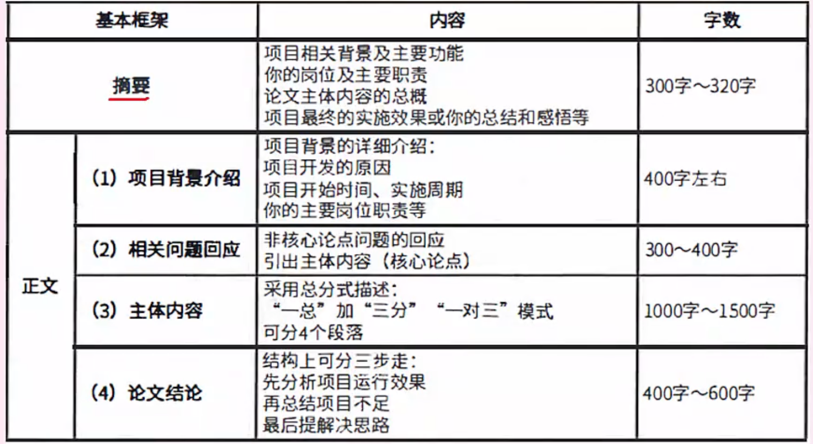

## 考试时间

案例和论文 一起考，90 + 120

考试时间 14：30～18：00

## 考试形式

四选一，时间120分钟，字数2500～3000字，中位数 2800，包含摘要字数。

需求工程，最喜欢考需求获取、需求分析，也有可能考需求验证、需求管理，都要熟悉。

软件测试，历年反复考察。

信息系统开发方法、开发模型、生命周期模型、企业应用集成技术。

系统可靠性、安全性、容错技术等。

其他：项目管理、数据库等。

## 论文主题分析

重点关注：

**软件开发方法模型** 

（重点 **螺旋开发模型和RUP(重要)** ， **结构化开发方法** 也有可能）

面向对象开发方法、面向服务开发方法、原型法、敏捷开发 都已考，剩RUP和结构化开发方法未考。

**生命周期**

系统规划，可行性分析 已考

系统分析，面向对象的信息系统分析方法

系统设计，面向对象设计、设计模式 已考，

系统实施，静态测试、系统测试、自动化测试 已考

系统维护，如信息系统的数据转换和迁移、遗留系统的演化策略 已考

## 论文主题

九大主题 从前往后写

1. 论软件开发模型及应用（RUP，螺旋开发模型
2. 论需求分析方法及应用
3. 论基于构件的软件开发（软件架构的内容
4. 论软件的系统测试及应用（动态测试
5. 论信息系统开发方法及应用（面向对象开发
6. 论软件需求获取技术及应用
7. 论企业应用集成（至少写到这里
8. 论软件维护及软件可维护性
9. 论软件设计模式及其应用
10. 论企业信息集成技术及应用
11. 论高可靠系统中软件容错技术及应用

## 答题步骤

1、选题
2、分析问题，找准核心论点
3、搭建论文框架（列出答题要点和大纲）
4、开始写作。

准备步骤：

1、第一篇在一周内写作，不限形式、时间，需要确定最终选题、摘要、项目背景、 结尾的模板。
2、第2篇要求手写，练习手感。
3、第3-9篇要求手写，并在2个小时内完成。

## 历年真题可写论点

### 2023年 论信息系统的可行性分析

- 经济可行性：主要评估项目的建设成本，运行成本和项目建成后可能的经济效益，判断项目是否值得建设。
- 技术可行性：研究的对象是信息系统需要实现的功能和性能，以及技术能力约束。
- 法律可行性：具有比较广泛的内容，它需要从政策、法律、道德、制度等社会因素来论证信息系统建设的现实性。
- 用户使用可行性：从信息系统用户的角度来评估系统的可行性，包括企业的行政管理和工作制度、使用人员的素质和培训要求等

### 2023年 论敏捷开发方法

论点可以是四种开发宣言：

- 个体和交互胜过过程和工具
- 可以工作的软件胜过面面俱到的文档
- 客户合作胜过合同谈判
- 响应变化胜过遵循计划

或者是几项基本原则或者开发的特点，对于明确的论点，可以找出在实际开发中的具体案例，表示采用前和采用后的区别，捧一踩一

### 2023年 论信息系统的转换和迁移

- 系统切换前通过工具迁移
- 系统切换前采用手工录入
- 系统切换后通过新系统生成。

### 2022年 论原型法信息系统开发方法及其应用

按是否实现功能分类：分为水平原型（行为原型，功能的导航）、垂直原型（结构化原型，实现了部分功能）。

按最终结果分类：分为抛弃式原型、演化式原型。

### 2022年 论面向对象设计方法及其应用

面向对象设计原则：

- 单一责任原则，让一个类只做一种类型职责，DDD中的仓储层，只做领域模型和数据模型之间的转换，不负责实现具体的业务逻辑。
- 开发封闭原则，对扩展开放，对修改关闭，减少代码的回归测试，新的功能通过新加实现类来完成，不改变现有功能类。
- 里氏替换原则，子类型必须能够替换掉他们的基类型，在任何父类出现的地方，都可以用子类的示例赋值给父类的应用。
- 依赖倒置原则，抽象不应该依赖细节，细节应该依赖于抽象 https://juejin.cn/post/7187045476049846327
- 接口分离原则，依赖抽象，不要依赖具体，比如仓储层的实现和定 义的接口是分离的，业务层使用接口，具体的实现类可以由容器进行管理。

该题还可以从 面向对象设计模式角度，挑选几个模式来作答。

### 2021年 论面向对象信息系统的分析方法

面向对象分析方法建立的两大模型：

- 用例模型：如用例图
- 分析模型：区分 静态分析模型，如类图；动态分析模型，如行为图、状态图、活动图

结构化分析方法建立的三大模型：

- 功能模型：DFD数据流图
- 行为模型：STD状态转换图
- 数据模型：用ER图（实体联系图）

### 2021年 论静态测试方法及其应用

1.根据论点描述怎么做，如桌前检查，根据产品需求文档一一对照代码实现是否完整，见AI

2.测试的题目，还可以描述测试出来的问题，如桌前检查发现有哪些

根据程序是否运行区分为，**静态测试和动态测试**

静态测试

- 桌前检查：自己Review，由开发人员自己对源代码程序进行分析，检查，并补充相关文档，类似于单元测试，
- 代码审查：CodeReview 交叉Review，检查浏览源代码，找出其中潜在的缺陷和错误，并提出改进建议的过程，通常由项目组成员进行，也可以由专门的审查小组负责，意在提高代码质量，减少后期维护成本，加快产品上线速度。相比代码走查更正式一些。
- 代码走查：CodeWalkthrough 团体Review，指团队成员之间共同检查代码的过程，它比代码审查更加灵活，可以随时随地进行，不需要特定的时间和专门的审查人员负责，可以针对代码的不同方面，如功能实现、代码规范、注释、可读性等进行讨论。

动态测试

- 黑盒测试：等价类划分、边界值分析、错误推测、因果图
- 白盒测试：基本路径、循环覆盖、逻辑覆盖
- 灰盒测试：介于白盒测试和黑盒测试之间的一种测试，多用于集成测试阶段，不仅关注输入、输出的正确性，同时也关注程序内部的情况

### 2020年 论面向服务系统开发方法及其应用

- 操作：业务支持的基础操作，如校验价格的操作
- 服务：把相关的操作按照逻辑分组成为服务，如创建商品基础信息的服务和创建商品价格信息的服务
- 业务流程：为了实现特定的业务目标把相关的服务串联起来形成业务流程，如创建商品的业务流程

创建商品的**业务流程**中，包含了 创建商品基础信息的**服务**和创建商品价格信息的**服务**，其中创建商品价格信息的服务中，又包含了校验价格的**操作**。

### 2020年 论软件设计模式及其应用

### 2020年 论遗留系统演化策略及其应用

高水平高价值系统：改造

高水平低价值系统：集成

低水平高价值系统：继承

低水平低价值系统：淘汰

## 论文框架

## 1.摘要 2段

### 摘要段一 通用部分 150字

2022年6月，我参与了某省政府线上采购云平台的建设，该平台包含网上超市系统、在线询价系统、电子招投标项目采购系统、基础数据管理系统等多个子系统。
本文以该系统为例，主要论述了统一过程开发模型在该系统中的具体应用。

分为三次迭代完成了项目开发任务，其中主要包含如下阶段：

- 
-  
- 

在该项目中，我担任系统分析师岗位，负责系统分析和设计工作。【该项目总投入约800万元，历时9个月，于2023年3月正式交付使用至今，收到用户一致好评。】

### 摘要段二 差异部分 150字

对正文的一个简单的总结，比如概述一下正文3段的论点。

- 在初始阶段，主要业务建模和需求定义，明确需求；

- 在细化阶段，主要是分析设计，对系统进行整体的架构设计和划分；

- 在构建阶段，进行实施编码和测试，在交付阶段，部署并交付使用。

  

## 2.项目背景 2段（子题目一

项目背景及过渡部分不能超过500字，需要提前准备好，尽量通用化，不要和论文主题相关， 这样考试时候无论什么论文主题都可以直接默写，只需要在最后写一段过渡语句，过渡到下一个论点。

包括内容：项目开发的原因、你的岗位职责、项目开发周期及规模、项目功能组成介绍。

### 项目背景段一 通用部分 200字

介绍项目大背景，如存在现状的问题

2022年6月，我所在单位承接参与了某省政府线上采购云平台的建设，我在项目中担任系统分析岗位。
该平台是由某省财政厅牵头与社会企业合作开发建设集“网上交易、网上监管“于一体的政府采购云计算服务平台，平台要涵盖政府采购全流程、各个环节，其中包括新型的电子卖场采购模式和传统与现代相融和的采购模式。电子卖场采购模式，体现了便捷高效、自主灵活的特点，将交易模式创新为网上超市、在线询价等。同时，也将采购监管的流程融入平台，这样才能充分有效解决长期以来政府采购价格高、效率低、服务差的问题。

### 项目背景段二 通用部分 300字

引出当前项目，该项目提供了哪些功能解决了什么问题

项目技术+项目功能

如介绍编程语言和架构

该平台的应用软件主要由四部分组成，包括网上超市系统、在线询价系统、电子招投标项目采购系统、基础数据管理系统。
网上超市子系统实现了采购单位对采购法中集采目录以外的项目进行灵活自主采购，主要提供交易和订单管理功能。
在线询价子系统负责对金额较大，但未达到公开招标限额标准的项目进行在线询价采购，主要提供询价管理和报价管理功能。
电子招投标项目采购子系统，是采用公开招标投标，电子评标的业务系统。
基础数据管理系统是维护主数据信息的后台业务系统，用于向其他业务子系统提供数据，其中提供了商品管理、供应商管理、用户管理、机构管理等功能。
该平台涉及的子系统采用微服务架构实现。对于庞大的业务流程，多个子系统之间的负责交互，以及海量的数据信息流转，都是我们需要面对的挑战，

因此要高质量的完成该系统，选择一种合适的 XXX 至关重要。

## 3.论文概述论点 1段（子题目二

### 回应子题目二 差异部分 300字

要求介绍题目描述的某项技术原理，考察理论知识，需要大家记忆。

对子题目二的知识点进行作答，一般列出3个论点，每个论点100字。

### 示例

软件开发模型是软件开发全过程、活动和任务的框架，是软件系统开发的重要基础。常见的开的开发模型有以下几种，瀑布模型、快速原型模型、统一过程开发模型。

- 瀑布模型，严格遵循软件生命周期各个阶段的固定顺序，一个阶段完成再进入另一个阶段。其优点是可以使过程比较规范化，有利于评审，缺点是过于理想化，缺乏灵活性，难以应对需求复杂多变的场景。
- 快速原型模型，对于很多需求不明确的项目，比较适合采用该模型。它通过快速建立一个反映用户需求的软件原型，可以直观的让用户看到需求呈现出的样子，再根据用户的反馈进行修改，能够充分体现用户的参与和决策。
- 统一过程开发模型，统一过程是一个通用过程框架，可以用于广泛的软件系统开发中。UP具有三个显著的特点，即用例驱动、以架构为中心、迭代和增量的特点。

经过项目组成员一致讨论，最终决定使用统一过程开发模型作为该项目的开发模型。

## 4.论文正文  3段（子题目三

对上边概述对论点进行举例详细说明，也是最重要的部分，要求结合实际项目实施情况，说明理论如何在实战中应用，考察真实的项目经验。1200字左右，真正需要写的，大家需要多加练习，掌握规律。

### 论点一 差异部分 300字

统一过程开发模型一般分为四个阶段，分别是初始阶段、细化阶段、构建阶段、和交付阶段。本文主要对前三个阶段进行介绍说明。

初始阶段，
初始阶段的主要目标是业务建模和需求。其中用例驱动是UP的特点之一，在该阶段首先识别系统的参与者和关键用例，识别出政府采购中涉及到采购单位、供应商、评审专家库、代理机构、采购监管科等众多实体，以及供应商商品发布、协议框架入围、采购单位交易下单、采购单位委托代理机构在线询价、电子招投标等用例，其中我们采用了用户访谈和联合需求计划JRP的方式来进行需求获取，组织了财政监管人员、政府采购行业的专家、企业的管理层、系统分析师及核心开发共同参与会议，对电子招投标系统中的招标、投标、开标、评标、定标各个环节进行了充分的讨论和对齐，确保每个环节都能做到公平公正，并且符合政府采购法规的要求。最终明确了用户需求，产出需求规格说明书，并请需求方一起评审和确定，建立了需求基线，确定需求的边界。

### 论点二 差异部分 300字

细分阶段，
细分阶段的主要关注点是分析设计。考虑到平台后续的需要支持的并发访问量和不同子系统需要独立部署和扩展的特性，决定采用微服务架构实现。将每个子系统根据业务领域划分拆分成多个独立的服务，每个服务都有自己的数据库和业务逻辑，这样可以减轻高并发下对数据库的访问压力，服务与服务之间采用RPC通信的方式进行数据交互。不同服务在发布迭代功能的时候不会相互影响，而且服务内部还可以根据实际业务情况采用异构设计，极大的提高了应用程序的可伸缩性、可维护性和灵活性。例如基础数据管理系统根据其包含的多个业务域，拆分出了商品服务、供应商服务、用户服务、机构服务等。其中供应商服务提供了供应商入驻、供应商查询等功能；商品服务提供了商品发布、商品信息维护、商品查询等功能。当商品服务在发布商品时需要审核供应商资质的时候，就通过调用供应商服务的查询接口，获取供应商信息并完成自身所需的业务校验逻辑。

### 论点三 差异部分 300字

构建阶段，
构建阶段的主要关注点是实施和测试。为了保证系统的交付质量，我们采用多种测试方法进行测试。在某一功能模块开发完成后，对其进行单元测试，确保模块内部的功能是正确的；等一个功能依赖的多个模块完成时，进行集成测试，确保模块与模块之间的交互是正确的；随后进行系统测试，对功能整体进行测试，确保功能正常的同时，系统性能也能达到客户要求。在模拟并发测试的过程中，我们发现在高并发下请求下，网上超市的并发下单会出现并发安全问题，具体的场景是库存被扣减成负数，这个是不符合测试预期的，我们随即对相关问题进行排查，经过对技术方案的重新设计和优化，最终解决了该问题。

## 5.提前准备结尾 2段

### 套话和总结 通用部分 200字

### 不足之处及解决方案 通用部分 200字

结尾可以写400-600字左右，是对整体论文的总概。

包括内容：项目上线及运行效果、客户评价、项目收获、项目不足和解决思路。

### 示例

在该项目开发过程中，我们一共经历了三次完整的迭代，在每次迭代过程中的初始阶段、细化阶段、构建阶段和交付阶段均进行相应的技术评审，并采取了相应措施保证系统的质量，如期完成了项目开发。
同时在项目开发过程中也遇到了一些问题，以及存在优化改进的地方，如没有充分考虑到真实用户的使用难度和学习成本，因此我们在后续的迭代中，对复杂的链路进行合并简化，并组织多次的产品功能演示说明，降低用户学习成本。得到了领导、用户的一致好评。
通过对该平台系统的开发，我体会到软件开发模型在实际软件开发过程中的重要性，以及对软件开发生命周期不同阶段的重心有了更深一步的了解。随着国家及企业的信息化程度越来越高，业务系统设计会更加复杂，因此需要我们在今后实践中不断探索，不断总结。

