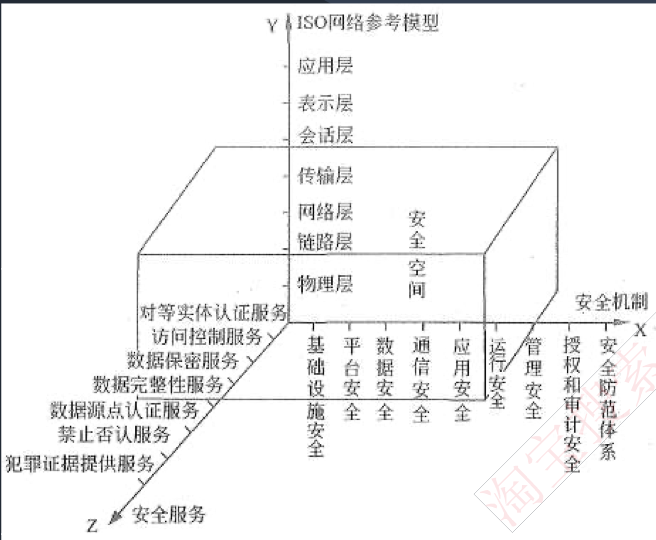
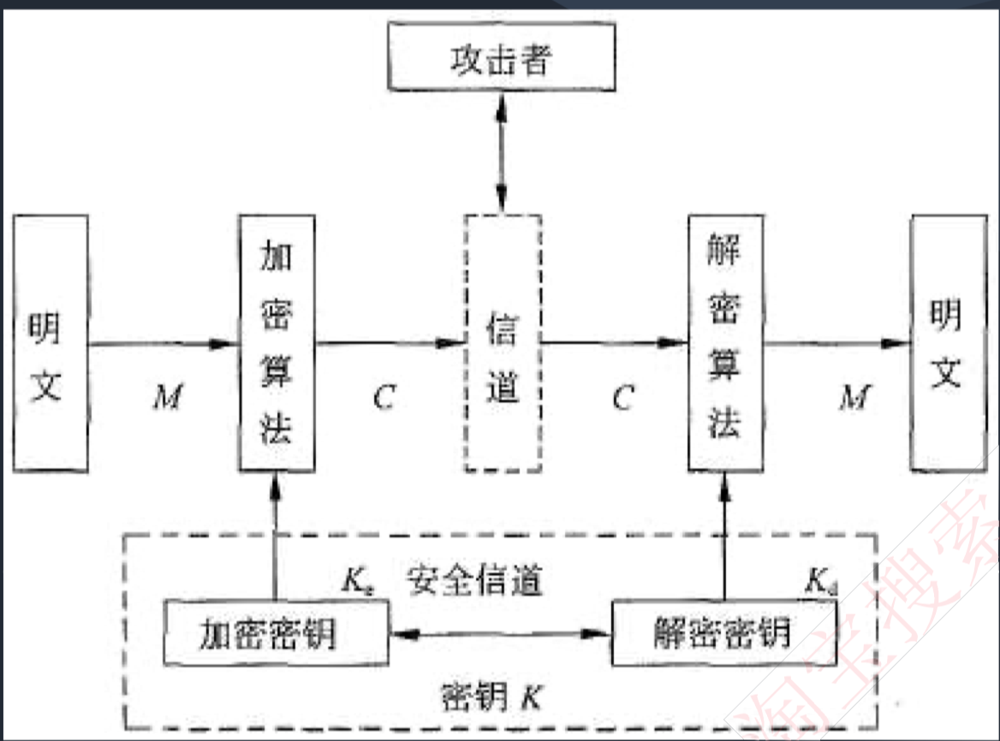
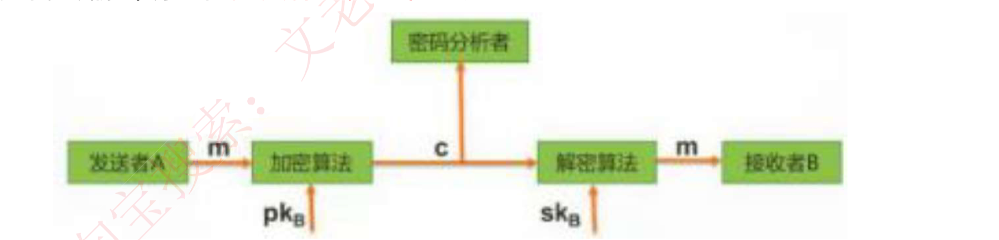
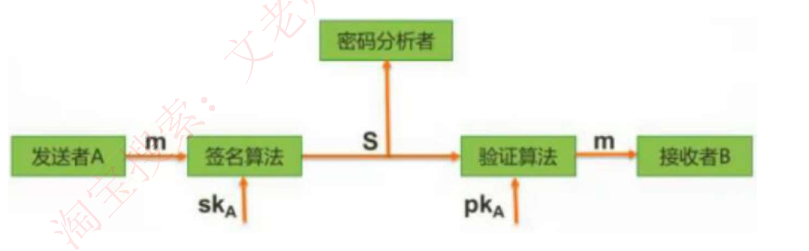
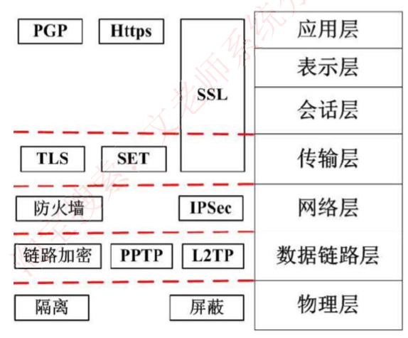
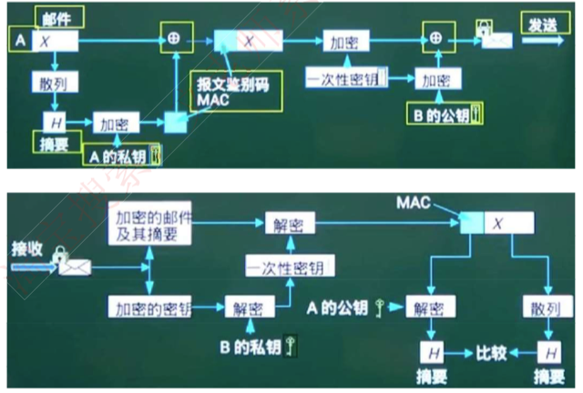

# 信息安全和信息系统安全

信息安全侧重数据安全，信息系统安全侧重系统安全。

**信息安全系统的体系架构：**

**X轴是“安全机制〞**，为提供某些安全服务，利用各种安全技术和技巧，所形成的一个较为完善的机构体系。

**Y轴是”OSl网络参考模型"**。

**Z轴是“安全服务"**。就是从网络中的各个层次提供给信息应用系统所需要的安全服务支持。

由X、Y、Z三个轴形成的信息安全系统三维空间就是**信息系统的“安全空间"。**

随着网络逐层扩展，这个空间不仅范围逐步加大，安全的内涵也就更丰富，达到具有**认证、权限、完整、加密和不可否认**五大要素，也叫作〞安全空间”的五大属性。

## 信息安全含义及属性

保护信息的 **保密性、完整性、可用性**，另外也包括其他属性，如：真实性、可核查性、不可抵赖性和可靠性。

**保密性**：信息**不被泄漏给未授权的个人、实体和过程或不被其使用的特性。**

包括：（1）最小授权原则（2）防暴露（3）信息加密（4）物理保密

**完整性**：**信息未经授权不能改变的特性**。影响完整性的主要因素有设备故障、 误码、人为攻击和计算机病毒等。保证完整性的方法包括：

（1）协议：通过安全协议检测出被删除、失效、被修改的字段。

（2）纠错编码方法：利用校验码完成检错和纠错功能。

（3）密码校验和方法。

（4）数字签名：能识别出发送方来源。

（5）公证：请求系统管理或中介机构证明信息的真实性。

**可用性**：**需要时，授权实体可以访问和使用的特性**。一般用系统正常使用时间和整个工作时间之比来度量。

**其他属性：**

- 真实性：指对信息的来源进行判断，能对伪造来源的信息予以鉴别。

- 可核查性：系统实体的行为可以被独一无二的追湖到该实体的特性，这个特性就是要求该实体对其行为负责，为探测和调查安全违规事件提供了可能性。

- 不可抵赖性：是指建立有效的责任机制，防止用户否认其行为，这一点在电子商务中是极其重要的。

- 可靠性：系统在规定的时间和给定的条件下，无故障地完成规定功能的概率。

## 安全需求

可划分为 **物理线路安全**、**网络安全**、**系统安全** 和 **应用安全**；

从各级安全需求字面上也可以理解： 

- 物理线路就是物理设备、物理环境；

- 网络安全指网络上的攻击、入侵；

- 系统安全指的是操作系统漏洞、补丁等；

- 应用安全就是上层的应用软件，包括数据库软件。

  

作为全方位的、整体的系统安全防范体系也是分层次的，不同层次反映了不同的安全问题，根据网络的应用现状情况和结构，可以将安全防范体系的层次划分为物理层安全、系统层安全、网络层安全、应用层安全和安全管理。

1）物理环境的安全性。物理层的安全包括通信线路、物理设备和机房的安全等。物理层的安全主要体现在通信线路的可靠性（线路备份、网管软件和传输介质）、软硬件设备的安全性（替换设备、拆卸设备、增加设备）、设备的备份、防灾害能力、防干扰能力、设备的运行环境（温度、 湿度、烟尘）和不间断电源保障等。

2）操作系统的安全性。系统层的安全问题来自计算机网络内使用的操作系统的安全，例如，Windows Server和UNIX等。主要表现在三个方面， 一是操作系统本身的缺陷带来的不安全因素，主要包括身份认证、访问控制和系统漏洞等；二是对操作系统的安全配置问题；三是病毒对操作系统的威胁。

3）网络的安全性。网络层的安全问题主要体现在计算机网络方面的安全性，包括网络层身份认证、网络资源的访问控制、数据传输的保密与完整性、远程接入的安全、域名系统的安全、路由系统的安全、入侵检测的手段和网络设施防病毒等。

4）应用的安全性。应用层的安全问题主要由提供服务所采用的应用软件和数据的安全性产生，包括Web服务、电子邮件系统和DNS等。此外，还包括病毒对系统的威胁。

5） 管理的安全性。安全管理包括安全技术和设备的管理、安全管理制度、部门与人员的组织规则等。管理的制度化极大程度地影响着整个计算机网络的安全，严格的安全管理制度、明确的部门安全职责划分与合理的人员角色配置，都可以在很大程度上降低其他层次的安全漏洞。

# 信息安全技术

## 加密技术

### 对称加密技术

**数据的加密和解密的密钥（密码）是相同的**，属于**不公开密钥加密算法**。其缺点是加密强度不高（因为密钥位数少），且**密钥分发困难（因为密钥还需要传输给接收方，也要考虑保密性等问题）。优点是加密速度快，适谷加密大数据。**

**常见的对称密钥加密算法如下：**

DES：替换+移位、**56位密钥**、64位数据块、速度快，密钥易产生。

3DES：三重DES，两个56位密钥K1、K2。 **112位密钥**

- 加密：K1加密->K2解密-1加密。

- 解密：K1解密->K2加密->1解密

AES：是美国联邦政府采用的一种区块加密标淮，这个标准用来替代原先的DES。对其的要求是“至少像3DES一样安全”。

RC-5：RSA数据安全公司的很多产品都使用了RC-5。

IDEA：128位密钥，64位数据块，比DES的加密性好，对计算机功能要求相对低。

### 非对称加密技术

**数据的加密和解密的密钥是不同的**，分为公钥和私钥。**是公开密钥加密算法**。

**其缺点是加密速度慢。优点是安全性高，不容易破解。**

非对称技术的原理是：发送者发送数据时，**使用接收者的公钥作加密密钥， 私钥作解密密钥**，这样只有接收者才能解密密文得到明文。安全性更高，因为无需传输密钥。但无法保证完整性。如下：

**常见的非对称加密算法如下：**

RSA：512位（或1024位）密钥，计算机量极大，难破解。

ECC（椭圆曲线算法） Elgamal、  、背包算法、Rabin、D-H等。

相比较可知，对称加密算法密钥一般只有56位，因此加密过程简单，适合加

密大数据，也因此加密强度不高；而非对称加密算法密钥有1024位，相应的解密计算量庞大，难以破解，却不适合加密大数据，一般用来加密对称算法的密钥，这样，就将两个技术组合使用了，这也是数字信封的原理：

**数字信封原理**：**信是对称加密的密钥**，数字信封就是对此密钥进行非对称加密，具体过程：发送方将数据用对称密钥加密传输，而将对称密钥用接收方公钥加密发送给对方。接收方收到数字信封，用自己的私钥解密信封，取出对称密钥解密得原文。

数字信封运用了对称加密技术和非对称加密技术，本质是使用对称密钥加密数据，非对称密钥加密对称密钥，解决了对称密钥的传输问题。

## 信息摘要技术

**信息摘要（报文认证）是由哈希函数生成的。**

所谓信息摘要，就是一段数据的特征信息，当数据发生了改变，信息摘要也会发生改变，发送方会将数据和信息摘要一起传给接收方，接收方会根据接收到的数据重新生成一个信息摘要，若此摘要和接收到的摘要相同，则说明数据正确。

信息摘要的特点：不算数据多长，都会产生固定长度的信息摘要；任何不同的输入数据，都会产生不同的信息摘要；单向性，即只能由数据生成信息摘要， 不能由信息摘要还原数据。

信息摘要算法：MD5（产生128位的输出）、SHA（Secure Hash Algorithm）-1（安全散列算法，产生160 位的输出，安全性更高）、SHA-256、HMAC。

## 数字签名技术

数字签名：唯一标识一个发送方。

发送者发送数据时，**使用发送者的私钥进行加密**，接收者收到数据后，**只能使用发送者的公钥进行解密**，这样就能**唯一确定发送方**，这也是数字签名的过程。

**但无法保证机密性**。如下：

### 公钥基础设施PKI

**数字证书用于确保用户和公钥的绑定关系，这些证书由CA保存和颁布。**

另外一种第三方认证服务的体制是kerberos协议，**kerberos协议中保存第三方数字证书的叫做KDC。PKI中保存证书的叫CA。**

# 网络安全技术

## 防火墙

防火墙是在 **内部网络和外部因特网之间增加的一道安全防护措施，分为网络级防火墙和应用级防火墙。**

**网络防火墙：**网络级防火墙层次低，但是效率高，因为其使用包过滤和状态监测手段，一般只检验网络包外在（起始地址、状态）属性是否异常，若异常，则过滤掉， 不与内网通信，因此对应用和用户是透明的。

**应用防火墙：**但是这样的问题是，如果遇到伪装的危险数据包就没办法过滤，此时，就要依靠应用级防火墙，层次高，效率低，因为应用级防火墙会将网络包拆开，具度高。參体检查里面的数据是否有问题，会消耗大量时间，造成效率低下，但是安全强度高。

## 入侵检测系统IDS

**防火墙技术主要是分隔来自外网的威胁，却对来自内网的直接攻击无能为力**， 此时就要用到入侵检测技术，位于防火墙之后的第二道屏障，作为防火墙技术的补充，类似于摄像头的作用。

原理：监控当前系统/用户行为，使用入侵检测分析引擎进行分析，这里包含一个知识库系统，囊括了历史行为、特定行为模式等操作，将当前行为和知识库进行匹配，就能检测出当前行为是否是入侵行为，如果是入侵，则记录证据并上报给系统和防火墙，交由它们处理。

不同于防火墙，**IDS入侵检测系统是一个监听设备，没有跨接在任何链路上， 无须网络流量流经它便可以工作**。因此，对IDS的部署，唯一的要求是：**IDS应当挂接在所有所关注流量都必须流经的链路上**。

因此，IDS在交换式网络中的位置一般选择在：（1）尽可能靠近攻击源（2）尽可能靠近受保护资源

## 网络攻击和威胁

**被动攻击：**不让系统感知的攻击

- 窃听：用各种可能的合法或非法的手段窃取系统中的信息资源和敏感信息、
- 业务流量：分析通过对系統进行长期监听，利用统计分析方法对诸如通信叛度、通信的信息流向、通信总量的变化等参數进行研究，从而发现有价值的信息和规律。
- 非法登录：有些资料格这种方式归为被动攻击方式。

**主动攻击：**

- 假冒身份：通过欺骗系统达到非法用户冒充成为合法用户，或者小权限冒充大权限用户。
- 旁路控制：攻击者利用系统的安全缺陷或安全性上的脆弱之处获得非授权的权利或特权。
- 重访攻击：将某次合法的通信数据拷贝，出于非法目的进行重新发送，加上时间戳校验即可。
- 拒绝服务DOS：通过大流量占用系统负载，导致其他正常请求无法获取资源。

## 病毒和木马

**病毒**：编制或者在计算机程序中插入的**破坏计算机功能或者破坏数括**，影响**计算机使用并且能够自我复制**的一组**计算机指令或者程序代码。**

**木马**：是一种后门程序，常被黑客用作控制远程计算机的工具，隐藏在被控制电脑上的一个小程序监控电脑一切操作并盗取信息。

# 网络安全协议

物物理层主要使用物理手段，隔离、屏蔽物理设备等，其它层都是靠协议来保证传输的安全，具体如下图所示： 

SET 和 SSL 一样也是横跨应用层的。

**SSL协议：**安全套接字协议，**被设计为加强Web安全传输（HTTP/HTTPS/）的协议**， 安全性高，和HTTP结合之后，形成HTTPS安全协议，端口号为443，HTTP 的端口号是80。是应用层和传输层之间的加密协议。

**SSH协议：**安全外壳（SHELL）协议，被设计为**加强Telnet/FTP安全的传输协议。**

**SET协议**：**安全电子交易协议** 主要应用于B2C模式（电子商务）**刷卡支付 **中保障支付信息的安全性。SET协议本身比较复杂，设计比较严格，安全性高，它能保证信息传输的机密性、真实性、完整性和不可否认性。SET协议是PKI框架下的一个典型实现，同时也在不断升级和完善，如SET 2.0将支持借记卡电子交易。

**Kerberos协议**：是一种**网络身份认证协议**，该协议的基础是基于信任第三方， 它提供了在开放型网络中进行身份认证的方法，认证实体可以是用户也可以是用户服务。这种认证不依赖宿主机的操作系统或计算机的IP地址，不需要保证网络上所有计算机的物理安全性，并且假定数据包在传输中可被随机窃取和篡改。**kerberos中保存第三方数字证书的叫做KDC。PKI中保存证书的叫CA。**

## PGA协议

PGA协议使用了对称加密技术来加密数据文件，使用非对称加密技术来加密数据文件的MD5（用自己的私钥加密）、对称加密的密钥（加解密数据文件时使用，这个用接收方的公钥加密）

PGP协议：使用RSA公钥证书进行身份认证，使用IDEA（128位密钥）进行数据加密，使用MD5进行数据完整性验证。

发送方A有三个密钥：A的私钥、B的公钥、A生成的一次性对称密钥；

接收方B有两个密钥：B的私钥、A的公钥。

