# 一、计算机系统简介

## 1.1 冯-诺依曼计算机的特点

1. 计算机由五大部件组成
2. 指令和数据以同等地位存于存储器，可按地址寻访
3. 指令和数据用二进制表示
4. 指令由操作码和地址码组成
5. **存储程序**
6. 以运算器为中心

### 冯诺依曼计算机硬件框图

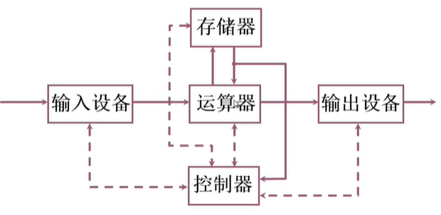

- 运算器 ALU：算术运算，逻辑运算
- 存储器 CU（Contro Unit）：存放数据和程序
- 控制器：指挥程序运行
- 输入设备：将信息转换成机器能识别的形式
- 输出设备：将结果转换成人们熟悉的形式

**存在问题：**

1. 数据的输入和输出都要经过运算器，所以运算器可能比较繁忙，会成为系统的瓶颈。
2. 层次结构不明显

**做出改进:**

1. 以存储器为中心的计算机硬件框图

   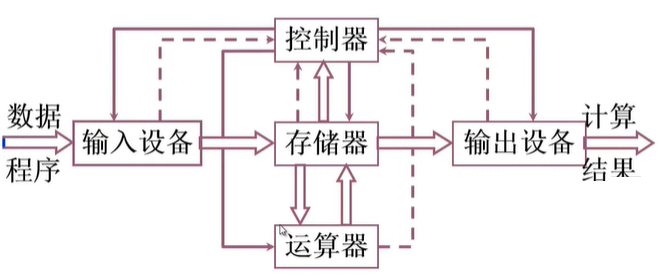

## 1.2 现代计算机硬件框图

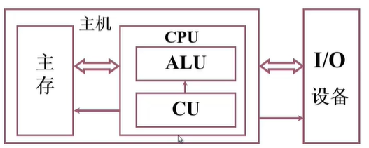

 

### 编程举例

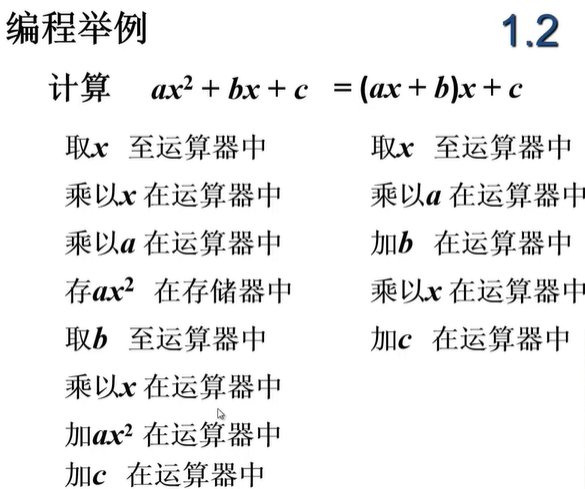

### 指令格式举例

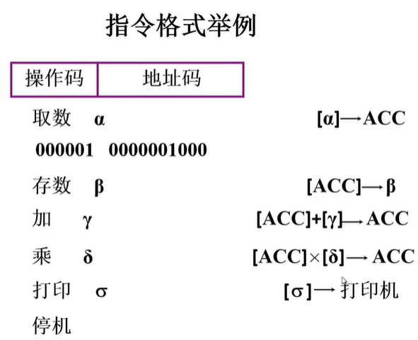

### 编程举例的程序清单

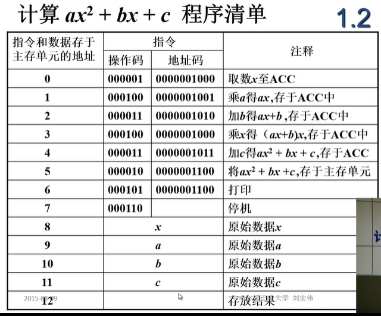

### 存储器的基本结构

存储体	-	存储单元	-	存储元件（0/1）

大楼		-	房间			-	床位（无人/有人）

存储单元：存放一串二进制代码

存储字：存储单元中二进制代码的组合

存储字长：存储单元中二进制代码的位数，每个存储单元赋予一个地址

**MAR** ：存储器地址寄存器，反映存储单元的个数

**MDR：**存储器数据寄存器，反映存储字长。保存从存储体中输入输出的数据。

设MAR=4位，MDR=8位。存储单元个数为2^4个，存储的字长为8

存储容量 =  存储单元个数（MAR） X 存储字长（MDR）

| MAR  | MDR  |    容量    |
| :--: | :--: | :--------: |
|  4   |  8   |  16 X 8位  |
|  10  |  8   |  1k X 8位  |
|  16  |  32  | 64k X 32位 |

### 运算器的基本结构

ACC、X、MQ（乘商寄存器） 三种寄存器搭配 ALU 完成基本的加减乘除。

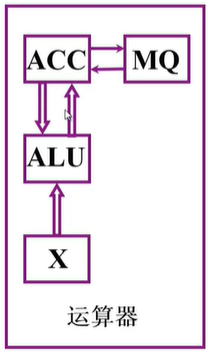

|      |     ACC     |      MQ       |   X    |
| :--: | :---------: | :-----------: | :----: |
| 加法 |  被加数/和  |               |  加数  |
| 减法 |  被减数/和  |               |  减数  |
| 乘法 |  乘积高位   | 乘数/乘积低位 | 被乘数 |
| 除法 | 被除数/余数 |      商       |  除数  |

#### **加法操作过程**

 

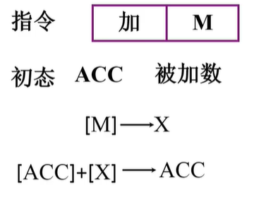

- 执行加法操作前，需要先将被加数通过取数指令，将其从内存读取到 ACC 中
- 执行加法指令，通过操作码得知是加法指令，通过地址码知道被加数的内存地址，将加数读取到 X 中
- ALU 对 ACC 与 X 进行加法的操作，并将结果保存到 ACC中

#### **减法操作过程**

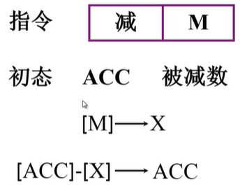

#### **乘法操作过程**

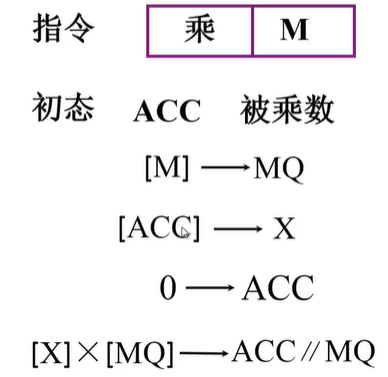

- 将内存中M的值保存到 MQ 寄存器中，并将 ACC 寄存器中的值保存到 X 寄存器中。这两步操作没有先后顺序，具体的执行先后可以由 CU（控制器）来控制。

- 将 ACC 寄存器清空

- ALU（运算器）对 X 和 MQ 进行乘法操作，乘法操作的原理和加法不同，加法是直接将二进制位相加，而乘法则需要移位和相加，乘法的结果由 ACC 和 MQ 共同保存，ACC 保存高位，MQ保存低位，因为发生了移位，单凭 ACC 可能无法保存完整的位，比如，9x9=81，个位数相乘，结果就变成两位数了。

  **二进制乘法表**

  |  x   |  0   |  1   |
  | :--: | :--: | :--: |
  |  0   |  0   |  0   |
  |  1   |  0   |  1   |

  该表和十进制乘法表类似，只有位数都是1的时候，结果才为1，否则为0。

  （十进制）2x3  《=》  （二进制）10 x 11，参考下图。

  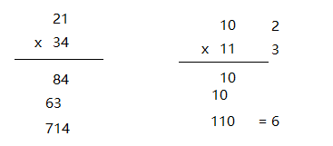

 

#### **除法操作过程**

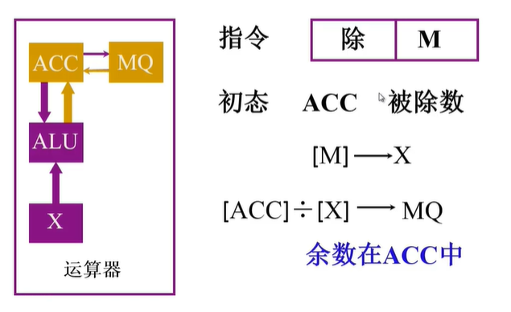

### 控制器的基本结构

#### 控制器的功能

- 解释指令
- 保证指令的按序执行

#### 控制器的基本组成

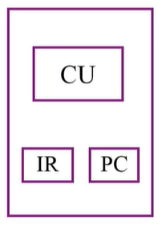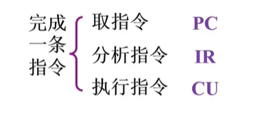

**PC**	存放当前欲执行指令的地址，具有计数功能（PC）+1 ——》 PC
**IR**	存放当前欲执行的指令，并通过指令的操作码来分析指令

### 主机完成一条指令的过程

存储器、运算器和控制器 这三者就构成了主机。

**存储器** 包含 存储体、MAR和MDR。

**运算器** 主要由 ALU 和 ACC 、X 、MQ 这三个寄存器构成。

**控制器** 主要由 CU 、IR （指令寄存器 ）PC（程序计数器）构成。

主机加IO就构成了计算机的硬件系统。

#### **取数指令**

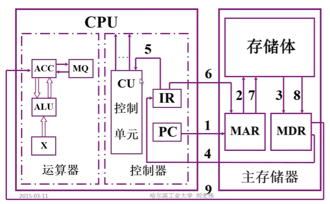

1. PC 中保存了将要执行指令的地址，将该地址送入 MAR
2. MAR 将地址 送入 存储体
3. 在 CU 的控制下，从 存储体 中指定的存储单元将该指令取出，放入到 MDR
4. 将 MDR 取出的指令送入到 IR 中
5. 将 IR 中的操作码送入 CU 中进行分析，分析后 CU会发出对应的控制信号来完成指令
6. 将 IR 中的地址码送入 MAR 
7. MAR 将地址码送入存储体中
8. 存储体 通过地址码读取到对应存储单元中对应数据，并保存到 MDR
9. 通过 CU 的控制，将 MDR 中数据写入到 ACC 寄存器中

#### **存数指令**

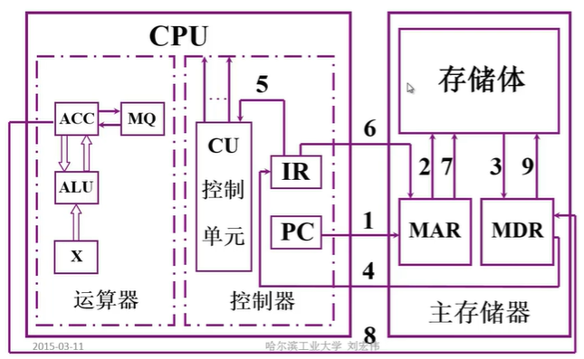

1. PC 中保存了将要执行指令的地址，将该地址送入 MAR
2. MAR 将地址 送入 存储体
3. 在 CU 的控制下，从 存储体 中指定的存储单元将该指令取出，放入到 MDR
4. 将 MDR 取出的指令送入到 IR 中
5. 将 IR 中的操作码送入 CU 中进行分析，分析后 CU会发出对应的控制信号来完成指令
6. 将 IR 中的地址码送入 MAR，IR 中的地址码表示保存到的内存地址
7. MAR 告诉 存储体 现在有一个数据要保存进来，保存的地址是多少
8. 将 ACC 保存的数据 送入到 MDR，MDR 保存了从 存储体 中输入和输出的数据
9. 将 MDR 中的数据保存到 存储体 中

### 编程举例的运行过程

- 将程序通过输入设备送至计算机

- 程序首地址——》PC

- 启动程序运行

- 取指令 PC——》MAR——》M——》MDR——》IR，（PC）+1——》PC

- 分析指令 OP（IR中的操作码）——》CU

- 执行指令 AD（IR中的地址码）——》MAR——》M——》MDR——》ACC

  ...

- 打印结果

以上是编程举例中的第一条指令的执行过程，PC现在指向下一条指令的地址。

## 1.3 计算机硬件的主要技术指标

**机器字长**

CPU一次能处理数据的位数与CPU中的 **寄存器位数** 有关

**运算速度**

- 主频
- 核数，每个核支持的线程数
- CPI 执行一条指令所需要
- MIPS
- FLOPS      

# 