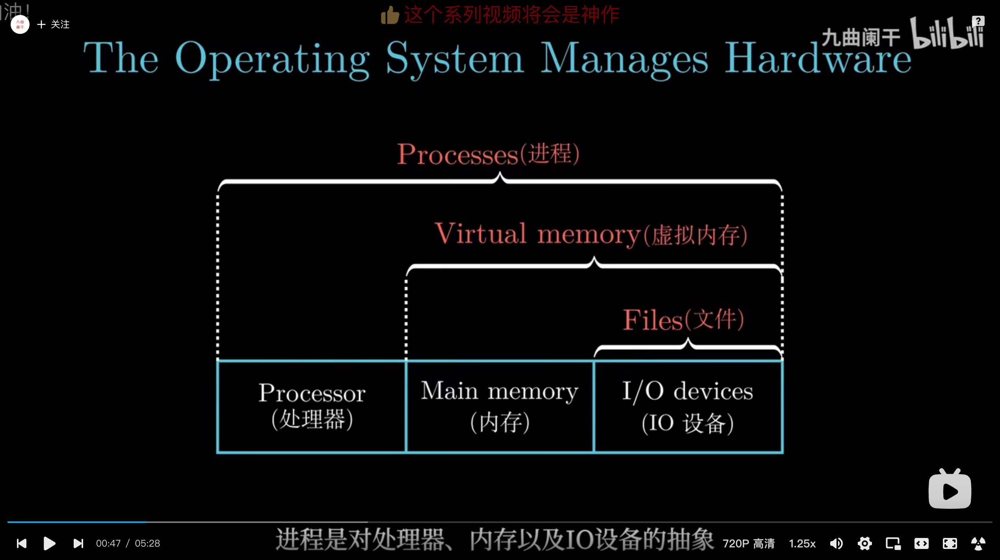
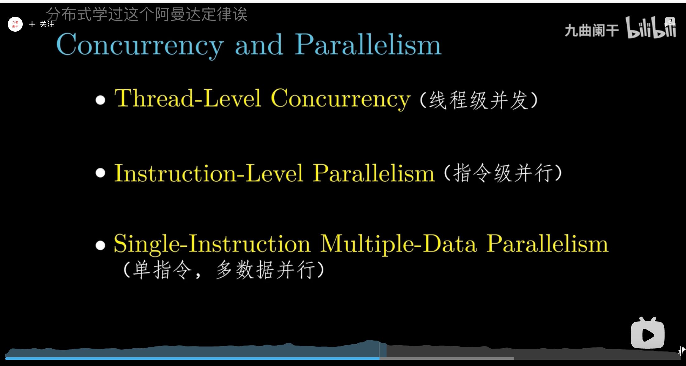

**字和字节都是计算机的存储单元**。字由若干个字节组成，一个字节是8个比特bit。字的位数叫做字长，即cpu一次处理二进制代码的位数。字的长度与计算架构有关，比如32位机，一个字就是32位，换算成字节就是4字节；同样的64位机，一个字就是64位，也就是8字节。字也是计算机一次处理数据的最大单位。

文件是对IO的抽象，虚拟内存是对 内存和IO的抽象，进程是的处理器、内存以及IO设备的抽象。

而虚拟机是对整个计算机系统，包括操作系统、处理器和程序

系统加速

