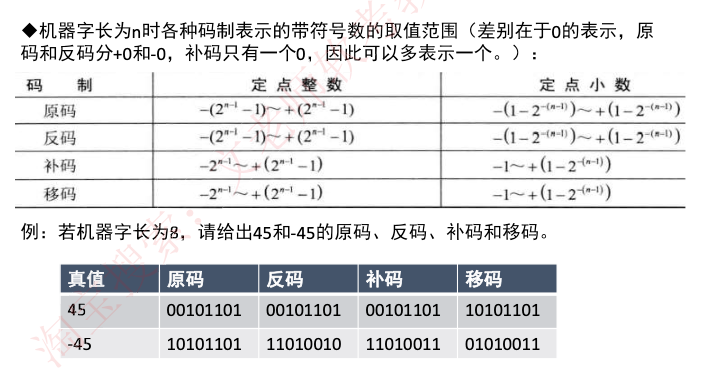
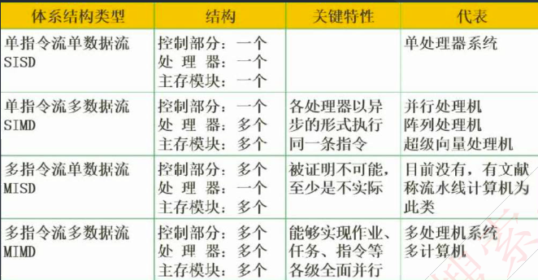
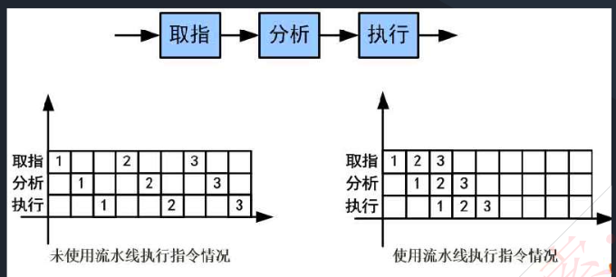
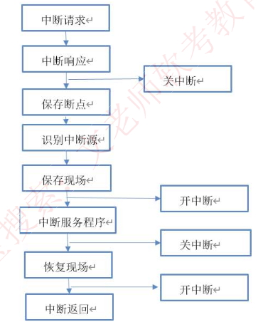

# 一、计算机系统基础知识

## 计算机硬件组成

五大基本硬件，运算器、控制器、存储器、输入设备和输出设备。

运算器+控制器 组成CPU，CPU完成算术和逻辑运算及控制功能。

存储器是计算机系统中的记忆设备，分为内存和外存。

## 中央处理单元

### CPU功能

- 程序控制（控制器），通过执行指令来控制程序的执行顺序。
- 操作控制（控制器），一条指令功能的实现需要若干操作信号配合来完成，CPU 产生每条指令的操作信号并将操作信号送往对应的部件，控制相应的部件按指令的功能要求进行操作。
- 时间控制（控制器），CPU 对各种操作进行时间上的控制，即指令执行过程中操作信号的出现时间、持续时间及出现的时间顺序都需要进行严格控制。
- 数据处理（运算器），算术运算和逻辑运算。

CPU还需要响应内部或外部的系统中断或者异常，进行处理。

### CPU组成

运算器、控制器、寄存器 和 内部总线 等部件组成。CPU根据指令周期的不同阶段来区分二进制的指令和数据。

**运算器：**

- 算术逻辑单元ALU：实现数据的算术和逻辑运算
- 累加寄存器AC：运算结果或者原操作数的存放区
- 数据缓存寄存器DR：暂时存放内存指令或数据
- 状态条件寄存器PSW：保存指令运行结果的条件码内容，如溢出标志

**控制器：**

从程序计数器PC里取出下一个指令的地址，然后存到指令寄存器IR中，再通过指令译码器ID。

- 程序计数器PC：存放下一个指令执行地址
- 指令寄存器IR：暂存CPU指令
- 指令译码器ID：分析指令操作码
- 地址寄存器AR：保存当前CPU访问的内存地址

## 数据表示

### 进制转换

进制转换：二进制和十六进制

二进制前缀符号0b，后缀符号 B

八进制后缀符号 O

十进制后缀符号 D

十六进制前缀符号 0x，后缀符号 H

**十进制转R进制：**例如十进制200 专为 6进制，得3轮余数，从下到上拼接，6进制结果 为 532

**二进制转十六进制：**每四位二进制数转换为一位十六进制数，例如 二进制数0010 1101， 0010 =2  1101=D  转为十六进制数为 0x2D

二进制转八进制同理，每三位转一位八进制数。

机器数：各种数值在计算机中的表示形式，无符号数表示正数，带符号数最高位为符号位，正数符号位为0，负数符号为位1。

定点数：其中小数点不占存储位

- 定点整数（纯整数）：约定小数点的位置在机器数的最高数值位之前。
- 定点小数（纯小数)：约定小数点的位置在机器数的最低数值位之后。

真值：机器数对应的实际数值。

### 2的幂指数倍速记

$2^{6}=64$

$2^{7}=128$

$2^{8}=256$

$2^{9}=512$

$2^{10}=1024$

$2^{11}=2048$

$2^{12}=4096$

$2^{13}=8192$

$2^{14}=16384$

$2^{15}=32768$

$2^{16}=65536$

### 原码、反码、补码

正数的 原码、反码、补码一样。

**原码：**数字的正常二进制表示。正数符号位为0，负数符号位为1。

**反码**：正数的反码为原码，负数反码是在原码的基础上，符号位不变，其他按位取反。

**补码：**正数的补码为原码，负数的补码=反码+1，如果进位产生溢出，则不符号位。例如 -0 的反码 1111 1111 +1 后就变成了 0000 0000 还是0。

**移码：**用作浮点运算的阶码，无论正数负数，移码=补码的符号位取反。 

数值 0 的原码有两种形式：+0 和 -0，他们的原码和反码都不相同，但是补码都是 0000 0000。

因为原码和反码有+0 和 -0区分，所以表示数据的范围要比补码少一位。

### **机器字长的带符号数取值范围**

因为带了符号位，所以在算范围的时候是 $2^{n-1}$

**定点小数的表示范围** 

$定点小数的表示范围 = 定点整数的表示范围\div2^{n-1}$

### 浮点数

处理定点数的表示，还有浮点数。

表示方法位 $N = F * 2^E$ ，其中 E 为阶码，F 称为尾数，类似于十进制的科学计数法，如 $85.125=0.85125*10^2，二进制如101.011 = 0.101011*2^3$

浮点数的表示中，**阶码为带符号的纯整数**，**尾数为带符号的纯小数**，这样就将一个浮点数的表示拆开成两个定点数来表示了。

格式如下：

阶符｜阶码｜数符｜尾数 

**浮点数能表示的数值量级由阶码确定，所表示的数值精度由尾数确定。**

### 浮点数的运算

### 真题

16位浮点数，其中阶符1位、阶码值6位、数符1位、尾数8位。若阶码用移码表示，尾数用补码表示，求该浮点数所能表示的数值范围？

答：浮点数的表示范围是  $尾数 * 2^{阶码}$，结果为 $-2^{63}～(1-2^{-8}2^{63})$

## 校验码

码距：在两个编码中，从A码到B码转换所需要改变的位数称为码距

### 奇偶检验码

在编码中增加 1 位校验位来使编码中1的个数为奇数（奇校验）或者偶数（偶校验），从而使码距变为2。

奇校验：编码中，含有奇数个1，发送给接收方，接收方收到后，计算编码中有多少个1

偶校验同理。

奇偶校验只能检1位错，且无法纠错。因为如果同时变了2位，编码的奇偶性不会变化。

[奇偶检验码中的码距为什么是2？](https://zhuanlan.zhihu.com/p/392092872)

> 

 最后可以看到，0对应的是1000  如果想要变成1，那么需要变化的位数是两个，同理变其他数字，最小的码距是2，最大码距离是4，如从1000变为 0111，需要变四位。

### CRC校验码

CRC能检错，不能纠错。

发送和接收的双方使用相同的生成多项式。    

例如：

发数据信息是1100，生成多项式为$x^3+x+1$（即1011），则CRC编码是 1100010

CRC循环校验码的编码流程：

1.在原始信息后加n个0，n为生成多项式最高阶，这里是$x^3$ 最高阶是3，所以 n=3 ，获得1100000

2.对1100000与生成多项式1011做模2除法（异或运算，同0异1），得得余数为10，不足n位时，余数左边补0，得到010

3.将原始信息与余数相连起来 得到 1100010

### 海明码

可以有多个校验位，但只能纠错一位。

本质是利用奇偶性来检错和纠错的校验方法。构成方法是在数据位之间的确定位置上插入k个校验位，通过扩大码距实现检错和纠错。

校验位是由信息位异或得到的，同理在校验的时候进行反向运算。

> 设数据位是n位，校验位是k位，则n和k必须满足以下关系：2^k-1>=n+k。

**1.校验位的位数和具体的数据位的位数之间的关系**

所有位都编号，从最低位编号，从1开始递增，校验位处于2的n （n=0 12....）次方中，即处于第1,2,4,8,16,32，……位上，其余位才能填充真正的数据位，若信息数据为1011，则可知，第1,2,4位为校验位，第3,5,6,7位为数据位，用来从低位
开始存放1011，得出信息位和校验位分布如下：

|   7   |   6   |   5   |   4   |   3   |   2   |   1   |  位数  |
| :---: | :---: | :---: | :---: | :---: | :---: | :---: | :----: |
| $I_4$ | $I_3$ | $I_2$ |       | $I_1$ |       |       | 信息位 |
|       |       |       | $r_2$ |       | $r_1$ | $r_0$ | 校验位 |

**2.计算校验码**

将所有信息位的编号都拆分二进制累加的表示法：

$7=2^2+2^1+2^0$  	$6=2^2+2^1$		$5=2^2+2^0$		$	3=2^1+2^0$

这四个信息位中，包含了r2校验位第4位（$2^2$）的有  $I_4 \quad I_3 \quad I_2$，所以 $r_2=I_4 {\bigoplus} I_3  {\bigoplus} I_2$

同理：

$r_1=I_4 {\bigoplus} I_3  {\bigoplus} I_1$

$r_0=I_4 {\bigoplus} I_2  {\bigoplus} I_1$

|  7   |  6   |  5   |  4   |  3   |  2   |  1   |  位数  |
| :--: | :--: | :--: | :--: | :--: | :--: | :--: | :----: |
|  1   |  0   |  1   |      |  1   |      |      | 信息位 |
|      |      |      |  0   |      |  0   |  1   | 校验位 |

所以最终要发送的海明校验码是 1010101，其中1，2，4位是校验位，3，5，6，7位是信息位。

**3.检错和纠错原理**

接收方收到海明码后，会将每一位校验位与其校验的信息位分别异或，即做如下三组运算：

$r_2{\bigoplus}I_4 {\bigoplus} I_3  {\bigoplus} I_2$

$r_1{\bigoplus}I_4 {\bigoplus} I_3  {\bigoplus} I_1$

$r_0{\bigoplus}I_4 {\bigoplus} I_2  {\bigoplus} I_1$

因为 $r_2=I_4 {\bigoplus} I_3  {\bigoplus} I_2$，所以如果传输正常的话，其实相当于在做 $r_2{\bigoplus}r_2$，如果是偶校验，结果自然全为 0

如果传输过程中第四位出错，接收到的错误数据是 1011101，

$r_2{\bigoplus}I_4 {\bigoplus} I_3  {\bigoplus} I_2$ =1

$r_1{\bigoplus}I_4 {\bigoplus} I_3  {\bigoplus} I_1$=0

$r_0{\bigoplus}I_4 {\bigoplus} I_2  {\bigoplus} I_1$=0

对应起来的二进制位就是100，即第4位出错，纠错方法是将该位逆转。

# 二、计算机体系结构

## 指令系统

### Flynn分类法

分类因素有两个：指令流和数据流，指令流由控制部分处理，数据流由处理器部分处理。

一条指令可以控制一条或多条数据流，但 **一条数据流还不能被多条指令控制，否则会出错，因此 多指令单数据MISD 不可能。**

### 指令组成

**一条指令由操作码和操作数两部分组成**，**操作码** 决定要完成的操作，**操作数** 指参加运算的数据及其所在的单元地址。
在计算机中，操作要求和操作数地址都由二进制数码表示，分别称作操作码和地址码，整条指令以二进制编码的形式存放在存储器中。

### 计算机指令的执行过程

计算机指令执行过程：**取指令一一分析指令一一执行指令** 三个步骤，首先将程序计数器Pc中的指令地址取出，送入地址总线，CPU依据指令地址去内存中取出指令内容存入指令寄存器IR；而后由指令译码器进行分析，分析指令操作码；最后执行指令，取出指令执行所需的源操作数。

### 指令寻址方式

找的是指令。

**顺序寻址方式：**当执行一段程序时，是一条指令接着一条指令地顺序执行。
**跳跃寻址方式：**指下一条指令的地址码不是由程序计数器给出，而是由本条指令直接给出。程序跳跃后，按新的指令地址开始顺序执行。因此，程序计数器的内容也必须相应改变，以便及时跟踪新的指令地址。

### 指令操作数寻址方式

找的是操作数。

立即寻址方式：指令的地址码字段指出的不是地址，而是操作数本身。
直接寻址方式：在指令的地址字段中直接指出操作数在主存中的地址。
间接寻址方式：指令地址码字段所指向的存储单元中存储的是操作数的地址。
寄存器寻址方式：指令中的地址码是寄存器的编号。
基址寻址方式（了解）：将基址寄存器的内容加上指令中的形式地址而形成操作数的有效地址，其优点是可以扩大寻址能力。
变址寻址方式（了解）：变址寻址方式计算有效地址的方法与基址寻址方式很相似，它是将变址寄存器的内容加上指令中的形式地址而形成操作数的有效地址。

### *CISC 和 RISC

[CISC与RISC](http://www.ylaihui.com/blog/article/9265?rootCategoryId=66)

 RISC (精简指令集计算机) 和 CISC (复杂指令集计算机 Complex Instruction Set Computer-CISC) 是当前CPU的两种架构。

**CISC（复杂指令系统），complex 复杂，兼容性强，指令繁多，长度可变，由微程序实现。**

**RISC（精简指令系统），  retrench 精简，指令少，使用频率接近，主要依靠硬件实现，增加了通用寄存器、硬布线逻辑控制为主，适合采用流水线。**

具体区别如下：

| 指令系统类型         | 指令                                                         | 寻址方式   | 实现技术                                                 | 其他                       |
| -------------------- | ------------------------------------------------------------ | ---------- | -------------------------------------------------------- | -------------------------- |
| CISC（复杂指令系统） | 数量多，使用频率差别大，可变长格式                           | 支持多种   | 微程序控制技术（微码）                                   | 研制周期长                 |
| RISC（精简指令系统） | 数量少，使用频率接近，定长格式，大部分为单周期指令，操作寄存器，只有Loas/Store操作内存 | 支持方式少 | 硬件实现，增加通用寄存器、硬布线逻辑控制。适合采用流水线 | 优化编译，有效支持高级语言 |

**分别基于这两种架构实现的CPU**

**CISC的代表：**IBM 370/168、Intel 80486、X86、 VAX 11/780

**RISC的代表：**ARM、Apple M1

### 指令流水线

为加快指令执行速度，引入指令流水线。

指令流水线原理：将指令分成不同段，每段由不同部分去处理，因此可以产生叠加的效果，让所有部件去处理指令的不同段。

指令流水线，只在RISC中使用，CISC比较复杂没有指令流水线。

RISC 中的流水线技术：

1. 超流水线（Super Pipe Line）技术。它通过**细化流水、增加级数和提高主频**，使得在每个机器周期内能完成一个甚至两个浮点操作。其实质是以时间换取空间。
2. 超标量（Super Scalar）技术。它通过**内装多条流水线来同时执行多个处理，**其时钟频率虽然与一般流水接近，却有更小的CPI。其实质是以**空间换取时间。**
3. 超长指令字（Very Long Instruction Word, VLIw） 技术。VLIW 和超标量都是20世纪80 年代出现的概念，其共同点是要同时执行多条指令，其不同在于超标量依靠硬件来实现并行处理的调度，**VLIW 则充分发挥软件的作用**，而使硬件简化，性能提高。

### *流水线时间计算

**流水线周期**：指令分成不同执行段，其中执行时间最长的段为流水线周期。

**流水线执行时间**：1条指令总执行时间+（总指令条数-1）*流水线周期。

**流水线吞吐率计算**：吞吐率即单位时间内执行的指令条数。
公式：指令条数/流水线执行时间。

**流水线的加速比计算**：加速比即使用流水线后的效率提升度，即比不使用流水线快了多少倍，越高表明流水线效率越高，
公式：不使用流水线执行时间/使用流水线执行时间。

## 存储系统

### 局部性原理

局部性原理：总体来说，在CPU运行时，所访问的数据会趋向于一个较小的局部空间地址内，类似28定律，具体包括下面两个方面：

时间局部性原理：相邻时间内会访问同一个数据项
空间局部性原理：相邻的空间地址会被连续访问。

### 高速缓存

 高速缓存Cache直接与CPU交互，位于CPU和主存之间，速度为内存的5-10倍。

Cache 由 控制部分和存储器组成，存储器存储数据，控制部分判断CPU要访问的数据是否在Cache中，不在的话会使用替换算法进行从主存中加载。

**地址映射**

在CPU工作的时候，送出的是主存单元的地址，而从Cache读写信息用到是Cache存储器地址，这就需要将主存地址转换为Cache存储器地址，这种转换也称为地址映像，**由硬件自动完成映射**。

分为三种方法：

- 直接映像，冲突率最高
- 全相联映像，冲突率最低
- 组组相联映像，冲突率中，组组相联算是直接映像和全相联的折中版

### 替换算法

缓存容量有限，满了之后需要将不常用的数据进行替换。常用算法：

- 随机替换算法
- 先进先出算法 FIFO
- 近期最少使用算法 LRU
- 优化替换：先执行一次程序，统计cache的替换情况，第二次便可用有效方式替换。

### 命中率及平均时间

Cache有一个命中率的概念，即当CPU所访问的数据在Cache中时，直接从中读取数据，设读取一次Cache时间为1ns，若CPU访问的数据不在Cache中，需要从内存中读取，设读取一次内存的时间为1000ns，若在CPU多次读取数据中，有90%命中Cache，

则CPU读取一次的平均时间为（90% * 1+10% * 1000）ns

### 磁盘结构和参数 

磁盘有正反两个盘面，每个盘面有多个同心圆，每个同心圆是一个磁道，每个同心圆又被划分为多个扇区，数据就被存放在一个个扇区中。
磁头首先要寻找到对应的磁道，然后等待磁盘进行周期旋转，旋转到指定的扇区，才能读取到对应的数据，因此，会产生寻道时间和等待时间。

公式为：存取时间=寻道时间+等待时间（平均定位时间+转动延迟）。

注意：寻道时间是指磁头移动到磁道所需的时间；等待时间为等待读写的扇区转到磁头下方所用的时间。

### *磁盘调度箅法

之前已经说过，磁盘数据的读取时间分为寻道时间+旋转时间，也即先找到对应的磁道，而后再旋转到对应的扇区才能读取数据，其中寻道时间耗时最长，需要重点调度，有如下调度算法：

- **先来先服务FCFS**：根据进程请求访问磁盘的先后顺序进行调度。
- **最短寻道时间优先SSTF**：请求访问的磁道与当前磁道最近的进程优先调度，使得每次的寻道时间最短：会产生“饥饿”现象，即远处进程可能永远无法访问。
- **扫描算法SCAN：**又称“电梯算法”，磁头在磁盘上双向移动，其会选择离磁头当前所在磁道最近的请求访问的磁道，并且与磁头移动方向一致，磁头永远都是从里向外或者从外向里一直移动完才掉头，与电梯类似。
- **单向扫描调度算法CSCAN**：与SCAN不同的是，其只做单向移动，即只能从里向外或者从外向里。不会受到请求的影响。

### 真题

[【软考题目】假设某磁盘的每个磁道划分成11个物理块，每块存放1个逻辑记录](https://blog.csdn.net/interestANd/article/details/115539993)

## 输入/输出技术

### 编制方式

计算机系统中存在多种 **内存与外设接口地址的编址方法**，常见如下：

**1.内存与接口地址 独立编址**

内存地址和外设接口地址是完全独立的两个地址空间，访问数据所使用的指令也完全不同。

用于外设接口的指令只用于接口的读写，其余的指令全都是用于内存的，所以在编程时或者读程序时容易使用和辨识。

这种方式的缺点是用于接口的指令太少，功能太弱。

**2.内存与接口地址 统一编址**

内存地址和外设接口地址是在一个公共的地址空间，即内存单元和接口公用地址空间。

优点是原则上用于内存的指令全部可用于接口。

缺点是整个地址空间会被分成两部分，其中一部分分配给接口使用，剩余的为内存使用，会导致内存地址不连续。

### *计算机和外设的数据交互方式

**程序控制（查询）方式：**CPU主动查询外设是否完成数据传输，先查询等待数据到达，再用CPU命令进行数据传输，效率极低。

**程序中断方式**：外设完成数据传输后，向CPU发送中断，等待CPU处理数据，省去了等待的时间，但还是要CPU直接命令进行数据传输，效率相对较高。

中断响应时间：是指发出中断请求到开始进入中断处理程序；

中断处理时间：是指从中断处理开始到中断处理结束。

中断向量：提供中断服务程序的入口地址。

**DMA方式（直接主存存取）：**CPU只需要完成必要的初始化等操作，数据传输的整个过程都由DMA控制器来完成，在主存和外设之间建立直接的数据通道，这样CPU的参与就更少，效率更高。

**在一个总线周期结束后，CPU会响应DMA请求开始读取数据；CPU响应程序中断方式请求是在一条指令执行结果时。**

### **中断处理流程**

保存断点：保存程序技术器 PC的地址

保存现场：保存当前程序执行的上下文

##  总线结构

### 总线

总线（Bus），是指计算机设备和设备之间传输信息的公共数据通道。总线是连接计算机硬件系统内多种设备的通信线路，它的一个重要特征是由总线上的所有设备共享，因此可以将计算机系统内的多种设备连接到总线上。

从广义上讲，任何连接两个以上电子元器件的导线都可以称为总线，通常分为以下三类：

1. 内部总线：内部芯片级别的总线，芯片与处理器之间通信的总线。
2. 系统总线：是板级总线，用于计算机内各部分之间的连接，具体分为**数据总线（并行数据传输位数）、地址总线（系统可管理的内存空间的大小）、控制总线（传送控制命令）**。代表的有1SA总线、EISA总线、PCl总线。
3. 外部总线：设备一级的总线，微机和外部设备的总线。代表的有RS232（串行总线）、scs！（并行总线）、USB（通用串行总线，即插即用，支持热插拔）。

串行总线适合远距离数据传输，并行总线适合近距离高速数据传输

单总线结构在一个总线上适应不同种类的设备，设计复杂会导致性能降低

单工：单方向的传输

半双工：双方向的传输，但同一时间只能有一个方向在传输。

全双工：双方向的传输，同一时间两个方向都可传输。

# 三、可靠性

## 计算机可靠性计算

### 可靠性指标

平均无故障时间 (**Mean Time to Failure**) 	MTTF =1/失效率

平均故障修复时间 (**Mean Time to Recovery**) 	MTTR =1/修复率

平均故障间隔时间 (**Mean time between failures**)	 MTBF = MTTF + MTTR

系统可用性= MTTF /（MTTF + MTTR）* 100%

### 串并联系统可靠性

**串联系统**，一个设备不可靠，整个系统崩溃，整个系统可靠性,    计算串联系统可靠性，就将所有部分的可靠性相乘即可

$R_{串联系统}=R1* R2 * ... * Rn。$

**并联系统**，所有设备都不可靠，整个系统才崩溃，整个系统可靠性，可以通过 1- 不可靠性来计算

 计算并联系统可靠性，就用每个部分的不可靠性相乘，得到系统的不可靠性，再用1-不可靠性，得到并联系统可靠性

$R_{并联系统}=1 -[（1 - R1）*（1 - R2） * ....*（1-Rn）]$

# 四、系统配置与性能评价

## 性能指标

**计算机**

对计算机评价的主要性能指标有：

- **时钟频率（主频）**
- **运算速度**
- **运算精度**
- **内存的存储容量**
- **存储器的存取周期**
- **数据处理速率PDR （processingdatarate）**
- **吞吐率**
- **RASIS特性（即：可靠性Reliability、可用性Availability、可维护性Sericeability、完整性和安全性integraity and Security）**
- **各种响应时间**
- **各种利用率**
- **平均故障响应时间；**
- **兼容性**
- **可扩充性**
- **性能价格比**

**网络**

- **设备级性能指标**
- **网络级性能指标**
- **应用级性能指杯**
- **用户级性能指标**
- **吞吐量**

**操作系统**

- **系统的可靠性**
- **系统的吞吐率（量）**
- **系统响应时间**
- **系统资源利用率**
- **可移植性**

**数据库管理系统**

衡量数据库管理系统的主要性能指标包括 **数据库本身** 和 **管理系统** 两部分，有：

- **数据库的大小**
- **数据库中表的数量**
- **单个表的大小**
- **表中允许的记录（行）数量**
- **单个记录（行）的大小**
- **表上所允许的索引数量**
- **数据库所允许的索引数量**
- **最大并发事务处理能力**
- **负载均衡能力**
- **最大连接数等等**

**WEB服务器**

评价Web服务器的主要性能指标有：

- **最大并发连接数**
- **响应延迟**
- **吞吐量**

**路由器**

对路由器评价的主要性能指标有：

- **设备吞吐量**
- **端口吞吐量**
- **丢包率**
- **时延**
- **时延抖动**

**交换机**

- **端口相关**

## *性能评价方法

[计算机性能评价方法](http://www.ylaihui.com/blog/article/9302?rootCategoryId=73)

**性能评测的常用方法：**

1. **指令执行速度法**。在计算机发展的初期，曾用加法指令的运算速度来衡量计算机的速度，速度是计算机的主要性能指标之一。因为加法指令的运算速度大体上可反映出乘法、除法等其他算术运算的速度，而且逻辑运算、转移指令等简单指令的执行时间往往设计成与加法指令相同，因此加法指令的运算速度有一定代表性。表示机器运算速度的单位是KPS（每秒千条指令）。

2. **等效指令速度法**（吉普森混合法）。**统计各类指令在程序中所占比例**，并进行折算，是一种固定比例法。通过各类指令在程序中所占的比例（wi）进行计算得到的。特点：考虑指令比例不同的问题。

3. **综合理论性能法** （CTP , Composite Theoretical Performance ）：CTP用MTOPS （Million Theoretical Operations Per Second，每秒百万次理论运算）表示。CTP的估算方法是，首先算出处理部件每个计算单元的有效计算率，再按不同字长加以调整，得出该计算单元的理论性能，所有组成该处理部件的计算单元的理论性能之和即为CTP。

4. **基准程序法**：把应用程序中用得最多、最频繁的那部分核心程序作为评估计算机系统性能的标准程序，称为基准测试程序 （benchmark）。基准程序法是目前一致承认的测试系统性能的较好方法。

   

**时钟频率**。一般来讲，主频越高，速度越快。

**数据处理速率**（Processing Data Rate， PDR） 法。采用计算PDR 值的方法来衡量机器性能，PDR 值越大，机器性能越好。PDR 与每条指令和每个操作数的平均位数以及每条指令的平均运算速度有关。

 

**基准程序法（Benchmark）：把应用程序中用得最多、最频繁的那部分核心程序作为评价计算机性能的标准程序，称为基准测试程序（benchmark），注意不是核心程序法**。是目前被用 户一致承认的测试性能的较好方法，有多种多样的基准程序，包括：

1. **整数测试程序**。同一厂家的机器，采用相同的体系结构，用相同的基准程序测试，得到的MIPS 值越大，一般说明机器速度越快。
2. **浮点测试程序**。指标MFLOPS（理论峰值浮点速度）
3. **SPEC基准程序**（SPEC Benchmark）。重点面向处理器性能的基准程序集，将被测计算机的执行时间标准化，即将被测计算机的执行时间除以一个参考处理器的执行时间，
4. **TPC 基准程序**。用于评测计算机在事务处理、数据库处理、企业管理与决策支持系统等方面的性能。其中，**TPC-C 是在线事务处理 （On-line TransactionProcessing,OLTP）的基准程序，TPC-D 是决策支持的基准程序。TPC-E 作为大型企业信息服务的基准程序**。

大多数情况下，为测试新系统的性能，用户必须依靠评价程序来评价机器的性能。下面列出了4种评价程序，

**它们评测的准确程度依次递减：真实的程序 > 核心程序 > 小型基准程序 > 合成基准程序。**

## 阿姆达尔公式 

阿姆达尔（Amdahl）定律主要用于系统性能改进的计算中。

阿姆达尔定律是指**计算机系统中对某一部件采用某种更快的执行方式所获得的系统性能改变程度，取决于这种方式被使用的频率，或所占总执行时间的比例**。

阿姆达尔定律定义了**采用特定部件所取得的加速比**。假定我们使用某种增强部件，计算机的性能就会得到提高，那么加速比就是下式所定义的比率：

​	$加速比 = \frac {不使用增强部件时完成整个任务的时间}{使用增强部件时完成整个任务的时间}$  

 

​	$总加速比 = \frac {原来的执行时间 }{新的执行时间} = \frac {1}{（1-增强比例）+ \frac {{增强比例}} {{增强加速比}}}$

