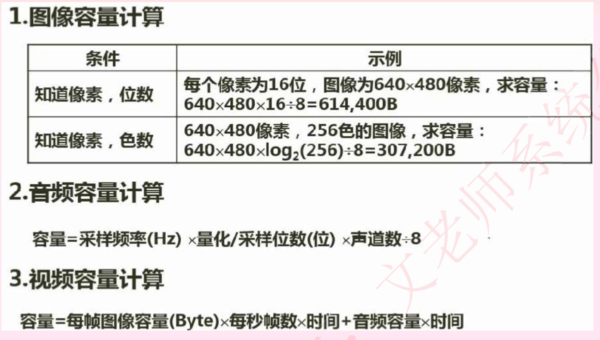
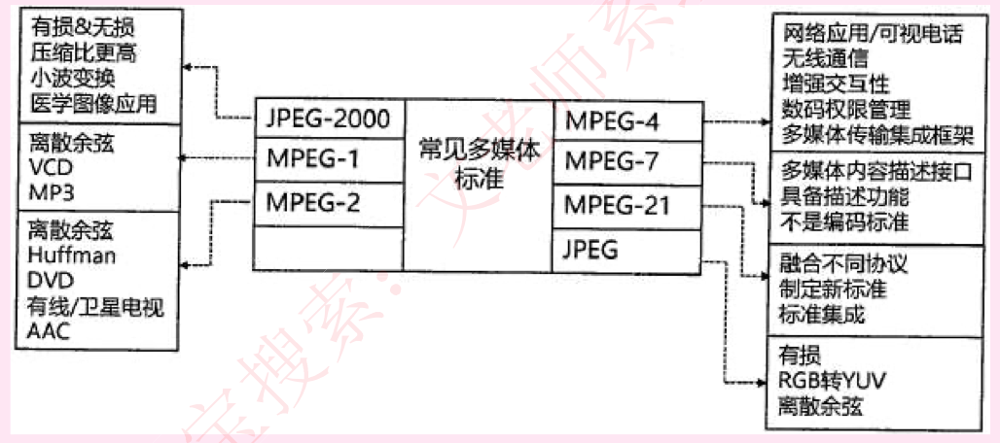

## 多媒体分类

媒体可分为下面五类：

**感觉媒体**：直接作用于人的感觉器官，使大产生直接感觉的媒体。常见的感光媒体分为文本、图形、图像、动圖、音频和视质。

**表示媒体**：指传输感觉媒体的中介媒体，即用于数据交换的编码。如：如文本编码、声音编码和图像编码等。

**表现媒体**：进行信息输入和信息输出等媒体，也即输入输出设备，如：键盘、鼠标和麦克风：显示器、打印机和音响等。

**存储媒体**：存储表示媒体的物理介质。如磁盘、光盘和内存等。

**传输媒体**：传输表示媒体的物理介质。如电缆、光纤、双绞线等。

## 声音

以声音的带宽来衡量声音的大小，单位是Hz，声音是一种模拟信号，要对其进行处理，就必须要将其转化为数字信号。转换的过程有三个步骤：采样、量化、编码。

人耳能听到的音频信号的频率范围是20Hz～20KHz。

声音的**采样频率一般为真实频率最高频率的两倍**，才能保证不失真。

声音文件格式：.wav、.snd、.au、.aif、.voc、 .mp3、 .ra、 .mid等。

## 图形和图像

**颜色三要素**

亮度：彩色明暗深浅程度。

色调（红、绿）：颜色的类别。

饱和度：某一颜色的深浅程度。

**彩色空间**

即没备显示图片所健用的色彩空间，普通的电脑显示器是RGB色彩空间，除了红、绿、蓝三原色外，其他颜色都是通过这三原色叠加形成的；

电视中使用YUV色彩空间，主要是为了兼容黑白电视，使用的是亮度原理，即调不同的亮度， 显示不同的颜色；

CMY（CMYK），印刷书籍时采用的色彩空间，这个采用的是和RGB相反的减法原理，浅蓝、粉红、黄三原色的印刷颜料实际上是吸收除了本身色彩之外的其他颜色的，因此，印刷出来才是这些颜色；

HSV（HSB），艺术家彩色空间，是从艺术的角度划分的。

图像的属性：**分辦率（每英寸像素点数dpi）**、像素深度（存储每个像素点所使用的二进制位数）。

图像文件格式：.bmp、.gif、.jpg、.png、.tif、.wmf等。

DPI：每英寸像素点数。

图像深度是图像文件中记录一个像素点所需要的位数。显示深度表示显示缓存中记录屏幕上一个点的位数（bit），也即显示器可以显示的颜色数。

水平分辨率：显示器在横向上具有的像素点数目。

垂直分辦率：显示器在纵向上具有的像素点数目。

矢量图的基本组成单位是图元，位图的基本组成单位是像素，视频和动画的基本组成单元是帧。

**真彩色和伪彩色**

伪彩色（Pseudo-color）图像的每个像素值实际上是一个索引值或代码，该代码值作为色彩查找表CLUT （Color Look-Up Table）中某一项的入口地址，根据该地址可查找出包含实际R、G、B的强度值。这种用查找映射的方法产生的色彩称为伪彩色。

## 多媒体计算

## 数据压缩基础

能够压缩的前提是有冗余，冗余分类如下：

**空间冗余**（几何冗余）：对于一副画面中的同样的信息，在压缩时，不需要重复存储，只记录一次信息内容，而后记录这些相同信息出现的位置即可。

**时间冗余**：在压缩视频时，对于一帧和下一帧，只记录变化的部分，不变的部分不记录。

**视觉冗余**：例如JPEG标准，就是有损压缩，对于人眼关注不到的细节就不存储，找到一个临界值，达到视觉欺骗的效果。

**信息熵冗余**：不同的信息编码的元余效率是不同的，可以通过改变信息编码来改变元余。

**结构冗余**：对于结构相同的模块，只记录一次。和空间冗余有点类似。

**知识冗余**：从知识角度来说，有些可以根据常识推导出来的东西，可以不用记录，如等差数列。

## 有损压缩和无损压缩

压缩后能够还原的编码方式称为无损压缩（**熵编码法**）：例如WINRAR压缩等，最终可以还原出原数据，最经典的就是哈夫曼编码，是无损压缩。如：**算术编码**、**霍夫曼编码（哈夫曼编码）**、** **

压缩后无法还原的编码方式就是有损压缩（**熵压缩法**）：例如JPEG格式的图片。如：**变化编码**

## 多媒体标准

主要是图像的JPEG标准和视频的MPEG标准，对于MPEG，要掌握每个级别的代表设备标准， 具体如下图所示：

