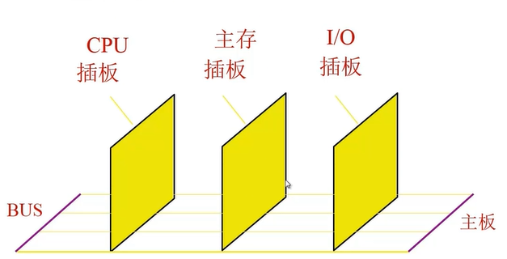
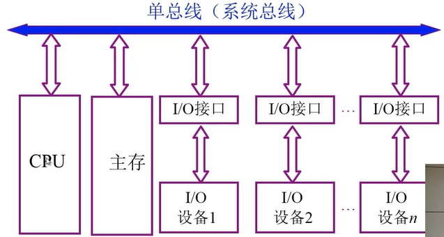
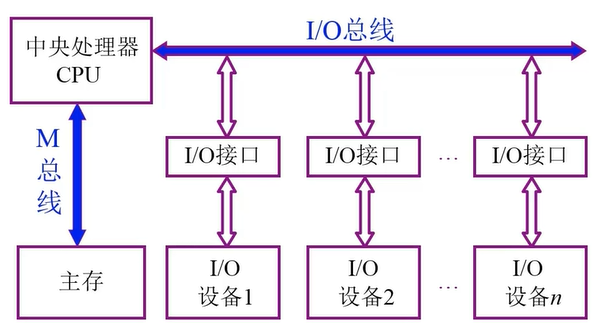
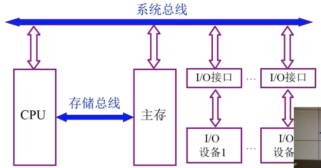
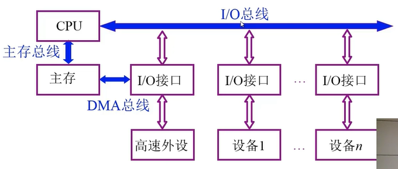
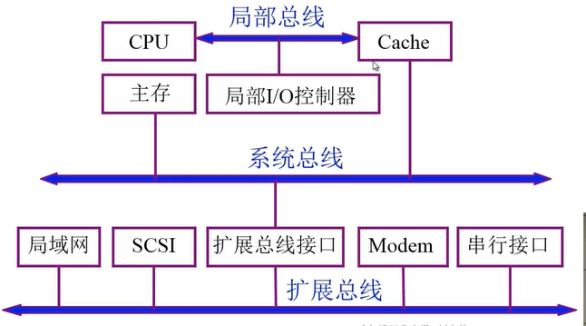
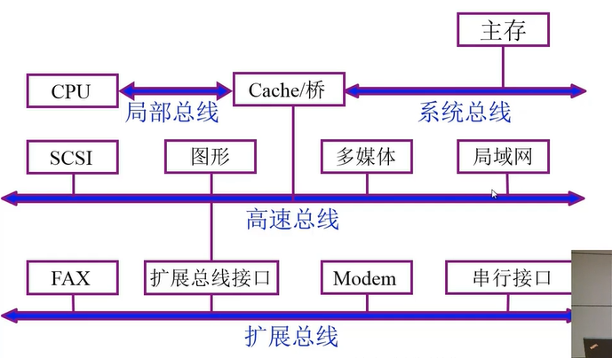
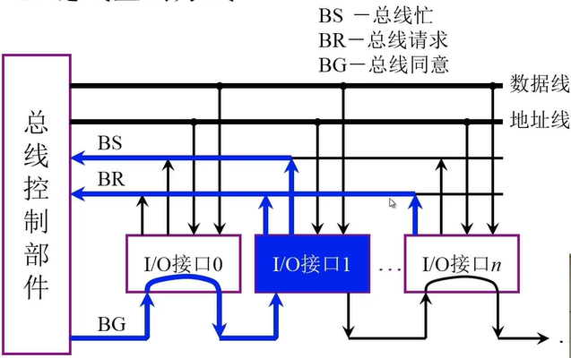
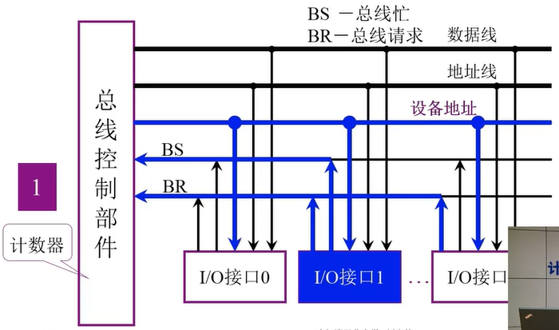
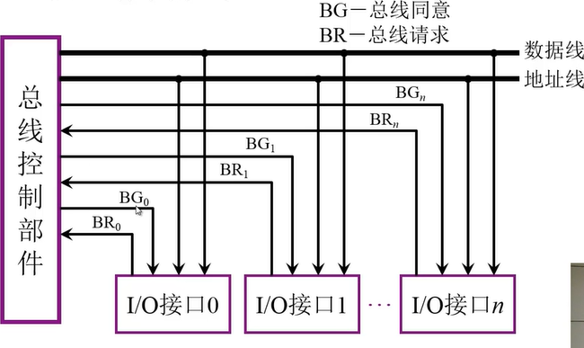

# 二、总线

## 总线的基本概念

总线是连接各个部件的信息传输线，是**各个部件共享的传输介质**。

**为什么要有总线？**

如果设备与设备不是通过总线来传输，而是直接连接两个设备，那么随着设备的增多，不同设备之间需要连接的线也会越来越多，因此需要一个通用的公共的线路来传输。举个生活中的例子，总线就像公交线路一样，从A点到B点可能没有直达的线路（好比设备没有直连），但在A点和B点附近都有同一条公交线路（总线），这条线路上还有别的站点（用于其他设备接入总线）。

## 总线的分类

### 片内总线

芯片内部的总线

### 系统总线

计算机各部件之间的信息传输线

- 数据总线

  双向，与机器字长、存储字长有关

- 地址总线

  单向，与存储地址、I/O地址有关

- 控制总线

  有出，CPU向外送（存储器读、存储器写、总线允许、中断确认）

  有入，（中断请求、总线请求）

### 通信总线

用于计算机系统之间或计算机系统与其他系统（如控制仪表、移动通信）之间的通信

- 串行通信总线

- 并行通信总线

## 总线特性及性能指标

### 总线物理实现

###  总线特性

1. 机械特性

   尺寸、形状、管教数及排列顺序

2. 电气特性

   传输方向和有效的电平范围

3. 功能特性

   每根传输线的功能如 地址、数据、控制

4. 时间特性

   信号的时序关系

### 总线的性能指标

1. 总线宽度

   数据线的根数

2. 标准传输率

   每秒传输的最大字节数（MBps）

3. 时钟同步/异步

   同步、不同步

4. 总线复用

   地址线 与 数据线 复用

5. 信号线数

   地址线、数据线和控制线的总和

6. 总线控制方式

   突发、自动、仲裁、逻辑、计数

7. 其他指标

   负载能力

## 总线结构

### 1.单总线结构框图

缺陷：

- 在主存和I/O设备进行写入的过程时，CPU是无法正常工作的，影响CPU运行效率
- 如果设备很多，总线会很长，远端设备的延时会比较长

### 2.面向 CPU的双总线结构框图

改进：

- 由于CPU需要频繁地与主存数据传输，因此提供一条单独的总线来进行两者通讯

缺陷：

- 主存与外部I/O设备之间无法直接数据传输，需要通过CPU来做中转

### 3.以存储器中为中心的双总线结构框图

### 4.三总线结构

DMA 直接存储器访问，用于外部高速设备直接访问系统内存。

### 5.三总线结构的又一形式

由于CPU和主存速度差距过大，中间引入高速缓存 Cache来作为中转，将CPU常用指令都存放在Cache中。

### 6.四总线结构

## 总线控制

### 总线判优控制

- 主设备（模块） 对总线有控制权
- 从设备（模块） 响应 从主设备发来的总线命令
- 总线判优控制
  - 集中式
    - 链式查询
    - 计数器定时查询
    - 独立请求方式
  - 分布式

#### 链式查询

1. 设备通过I/O接口 使用 BR总线 向总线控制部件 发送总线控制请求，因为所有的I/O接口都共用同一条总线，总线控制部件收到请求后无法判断是哪个接口发送的请求，这就好比，传纸条，最后一个人只知道纸条是前一个人传过来的，但不知道是前边哪个人写的。
2. 总线控制部件会通过 BG总线 向下进行查询，看看是谁发送的请求，会找到第一个发送总线请求的接口 ，例如图中的 I/O接口1。
3. 找到后 I/O接口1 后，该接口会使用 BS总线，向总线控制部件 发送总线忙的信号，这样该接口就获取到了总线的控制权。

缺陷：

- 各个设备占用总线的优先级和 BG总线的查询顺序有直接关系，也就是不同的设备接口有不同的优先级
- 在BG总线链式查询 总线请求发起设备的过程中，如果BG线路上发生电路故障，故障点之后的设备将再也无法获取总线的控制权。

#### 计数器定时查询 

和链式查询的过程类似，不同点在于对链式查询的缺陷做了改进，通过在总线控制部件中引入一个计数器来改变查询接口的顺序，具体的做法是调整计数器的初始值，可以将初始值设置为上次控制总线的接口编号，也可以通过软件来设置该初始值。这样总线控制部件在查询接口就不是按照固定的顺序了，解决了链式查询的问题。

#### 独立请求方式

### 总线通信控制

- 目的 解决通信双方 **协调配合** 问题

- 总线传输周期

  1. 申请分配阶段

     **主模块申请**，总线判优决定

  2. 寻址阶段

     主模块向从模块 **给出地址** 和 **命令**

  3. 传数阶段

     主模块和从模块 **交换数据**

  4. 结束阶段

     主模块 **撤销有关信息**

- 总线通信的四种方式

  1. 同步通信

     由 **统一时标**   控制数据传输

  2. 异步通信

     采用 **应答方式** ，没有公共时钟标准

  3. 半同步通信

     同步、异步结合

  4. 分离式通信

     充分挖掘系统总线每个瞬间的潜力

# 