# 三、存储器

## 概述

### 存储器分类

#### 按存储介质分类

- 半导体存储器，需通电，易失

- 磁盘，通过磁性

- 光盘存储器，激光、磁光材料

#### 按存取方式分类

1.  存取时间与物理地址无关（随机访问）
    - 随机存储器	在程序的执行过程中 可读可写
    - 只读存储器	在程序的执行过程中 只读
2.  存取时间与物理地址有关（串行访问）
    - 顺序存储存储器	磁带
    - 直接存取存储器	磁盘

#### 按在计算机中的作用分类

1. 主存储器
   - RAM
   - ROM
2. FLash Memory
3. 高速缓冲存储器（Cache）
4. 辅助存储器 磁盘、磁带、光盘

### 存储器的层次结构

#### 存储器三个主要特性的关系

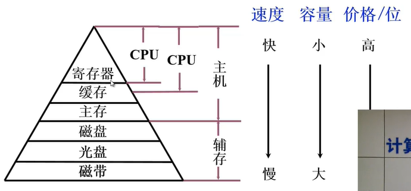

#### 缓存—主存层次和主存—辅存层次

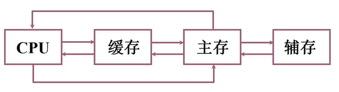

## 主存储器

### 1. 概述

#### 主存的基本组成

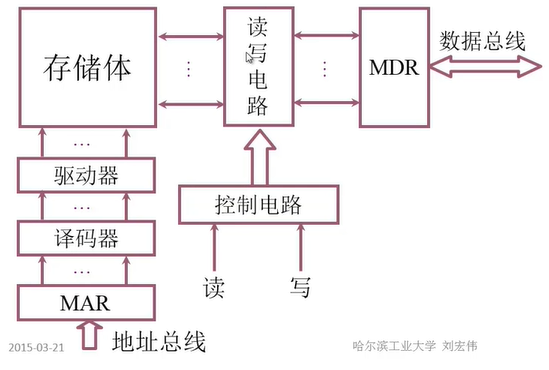

#### 主存与CPU之间的联系

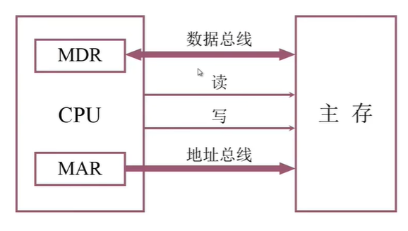

- 虽然 MDR 和 MAR 属于主存中的设备，但是随着近代计算机的发展，这两部分被集成到CPU内部。
- 数据总线双向传导数据的，到主存读取到CPU和将CPU的数据写入到主存
- 地址总线是单向的

#### 主存中存储单元地址的分配

12345678H 这个数据如何在主存储器中进行存储？

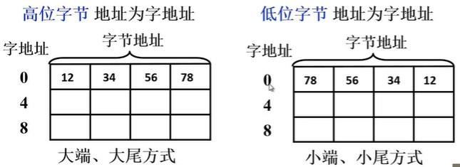

12345678H 一共有8个16进制数，每个16进制数需要用4位，一共32位，1个字节（byte）=8个比特位（bit）

所以需要4个字节。图中展示 一个字 = 四个字节。所以一个字的字长是 32 位。

大尾、小尾两种方式都有机型在用，比如 x86 就是用小尾方式。

**设地址线24根**	按 **字节** 寻址  每根线有0/1两种情况，总共有 2^24 = 16,777,216‬ byte = 16MB 种可能，按字节寻址的范围有16MB。

还是地址线24根，如果按 **字** 寻址的话，就是 16 / 4 = 4 MW ，字寻址范围是 4MW。

之前的字长是32位，如果在地址线不变的情况下将字长调整为16位，也就是一个字=两个字节，那么该字长情况下的 字寻址范围为 8MW。

> M表示是辅助存储单元
> B 是指长度占一个字节
> W 是指长度占一个字（两个字节）
> D 是指长度占一个双字（四个字节）
>
> MB比特型的存储器
> MW字型的存储器
> MD双字型的存储器

#### 主存的技术指标

1. 存储容量  主存 存放二进制代码的总位数

2. 存储速度

   - 存取时间	存储器的 **访问时间**	

     从存储器给出地址直到得到稳定的数据输入或输出的时间

     读出时间	写入时间

   - 存取周期	连续两次独立（数据无关）的存储器操作

     （读或写）所需的最小间隔时间，这个时间往往比存储时间要长

3. 存储器的带宽	位/秒

### 2. 半导体存储芯片简介

#### 半导体存储芯片的基本结构

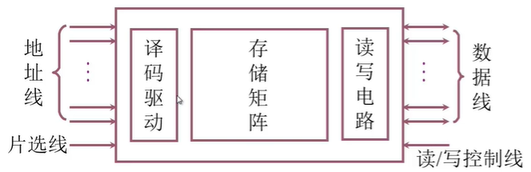

- 地址线（单向）

  从CPU或者I/O设备 给出地址信息

- 数据线（双向）

  完成数据的双向传输

- 芯片容量

  | 地址线（单向） | 数据线（双向） | 芯片容量  |
  | :------------: | :------------: | :-------: |
  |       10       |       4        | 1k X 4位  |
  |       14       |       1        | 16k X 1位 |
  |       13       |       8        | 8k X 8位  |

- 片选线

  决定此次操作在哪个或者哪组芯片上进行 CS、CE

  CS 是片选信号，低电平的时候才会被选中

- 读/写控制线

  决定此次操作是读操作还是写操作

  - 用一根WE线来控制读写

    WE 如果这个信号是低电平的话，进行写操作，高电平读

  - 用 OE、WE两根线来控制读写

    OE 允许读，WE 允许写

#### **存储芯片片选线的作用**

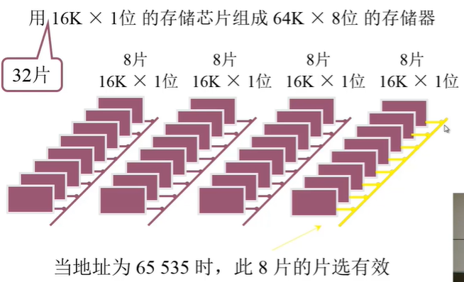

一个存储器是由很多个小的存储芯片组成的，为了组成 64K X 8 的存储器，我们需要32个16K X 1 的芯片，分成4组，每组8个，每次读取操作时，会把这一组的8个1位的芯片看作整体，也就是8位的芯片，以达到CPU读取8位的需求。

因为分成了4个组，各组的表示范围分别是0～16K-1，16K~32K-1，32K~48K-1,48K~64K-1。

因此当要操作的地址为65535（64K-1）时，片选线会在第四组保持低电平，其他保持高电平，来选择此次操作的存储芯片组。

#### 半导体存储芯片的译码驱动方式

1. 线选法

   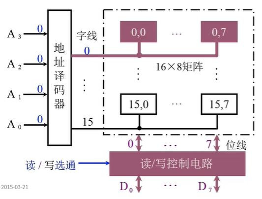

   地址译码器的工作主要是译码，具体的过程是将左侧 A0~A3 分别看作8 4 2 1，有信号为1，没有为0，这样组成的二进制数就可以表示 0~15，然后再通过译码器右侧的字线转换为译码后的结果。

   读/写控制电路再对有字线信号的存储矩阵进行控制读写。

   缺陷：线选法不适合大容量的存储矩阵，如果有20根地址线，那么对应的字线会有1M根，也就是100w根，对于内存很难做到这么高的集成度。

2. 重合法

   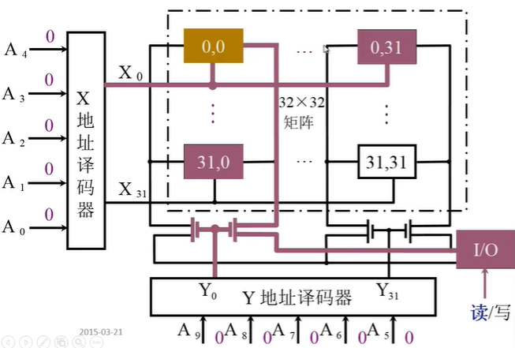

   相当于从一维变成了二维，通过电路，让两X、Y地址译码器交点的存储矩阵进行输出。

### 3. 随机存取存储器（RAM）

#### 静态RAM（SRAM）

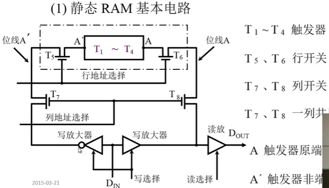

用触发器实现静态RAM

T1~T4 触发器 存放0/1

T5、T6 行开关 控制该触发器进行读写的

T7、T8 列开关 

毕竟SRAM需要多个集成在一起工作的，所以需要行、列开关来进行选择

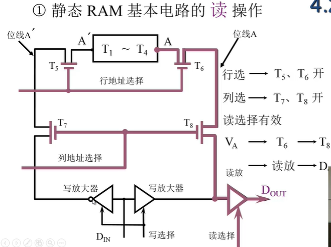

 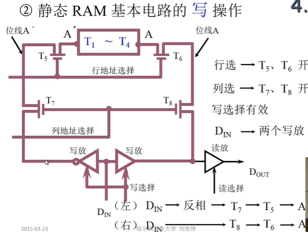

##### **静态RAM芯片举例**

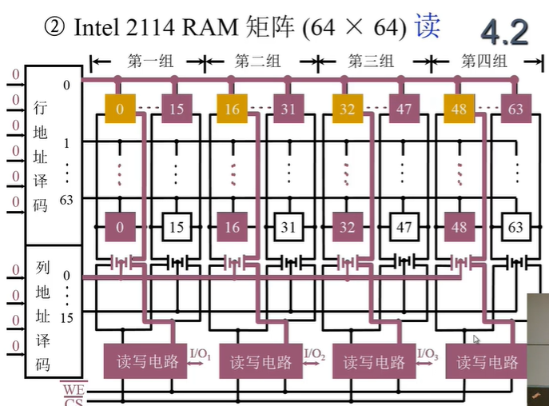

WE：读写信号，CS：片选信号

列选择器同时控制着每一组的某列，比如上例中，同时控制各组的第0列，这样一次就可以对4个I/O数据线进行输出。

#### 动态RAM（DRAM）

##### **三管动态RAM**

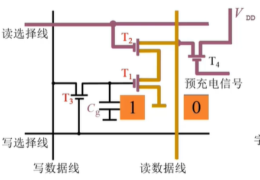

用电容的是否存在电荷实现动态RAM

有电为1，没有电认为是0

读出与原存信息相反

写入与输入信息相同

##### **单管动态RAM**

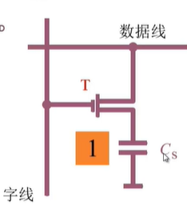

读出时数据线有电流为 “1” 无电流为“0”

写入时 Cs 充电为“1” 放电为“0”

##### **动态RAM芯片举例**

**三管动态RAM 芯片（Intel 1103）读**

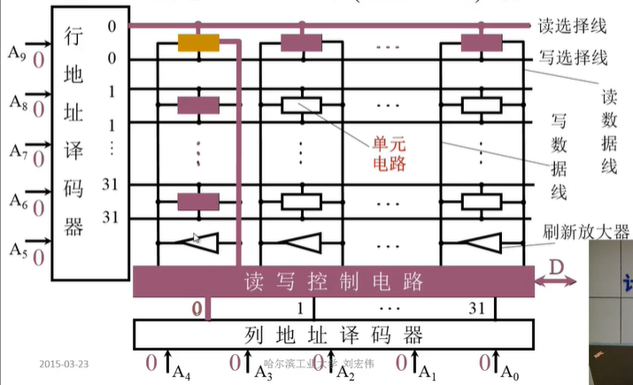

- 这里没有用WE控制信号来控制读写，而是直接在行地址译码器译码的过程中控制了读写。
- 由于电容中的电荷会随着时间流逝，因此需要刷新放大器来定时对存在电荷的单元电路进行充电。方便读取

**三管动态RAM 芯片（Intel 1103）写**

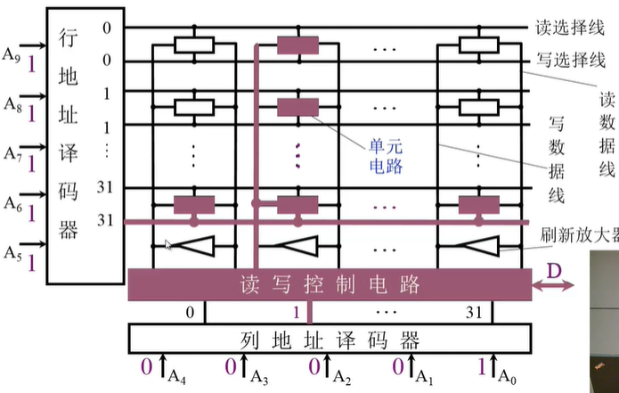

**单管动态RAM 4116（16K X 1位）外特性**

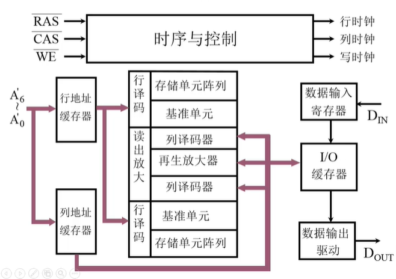

16K = 2^14 ，也就是意味着需要14根地址线，但是RAM 4116却通过7根地址线实现，它的实现原理是分两次传输，第一次传输的是7位行地址信号，第二次传输7位列地址信号。传输过来的信号放在对应的缓存器中，行列信号都到齐后，进行译码，选中到具体要操作的存储单元进行输入和输出。

**单管动态RAM 4116（16K X 1位）读原理**

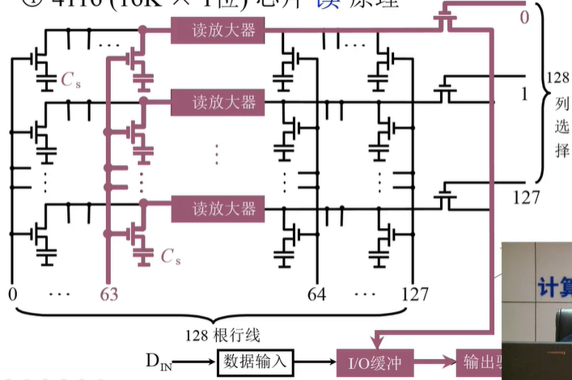

读放大器，像一个跷跷板电路，通过该元件的电荷会取反，注意是通过，如果在读放大器右侧，是不需要通过该元件的。左侧的电容如果是1，通过后会变成0；如果是0，则会变成1。

因此，在读放大器的左边，电容中有电表示0，没有电表示1；读放大器右侧，有电保存1，没有电保存0 。

**单管动态RAM 4116（16K X 1位）写原理**

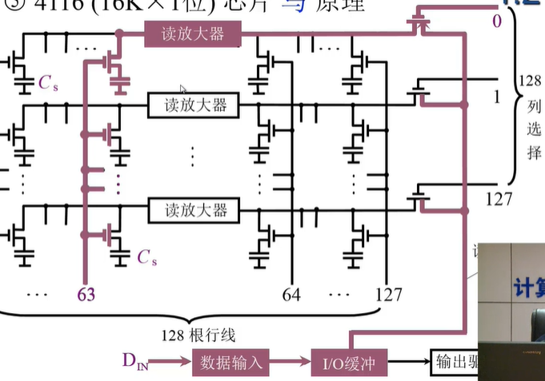

比如，写第0列，第63行，从I/O缓冲一直到放大器右端的电路中一直都是1，但是通过读放大器后，最后保存在电容中的是0，如果后续要读出该电容的话，经过读放大器又会被转化为1。

##### 动态RAM刷新

因为电容会随时间丢失电荷，因此需要定期刷新。

刷新与行地址有关，每次刷新一行的存储单元。

- 集中刷新

  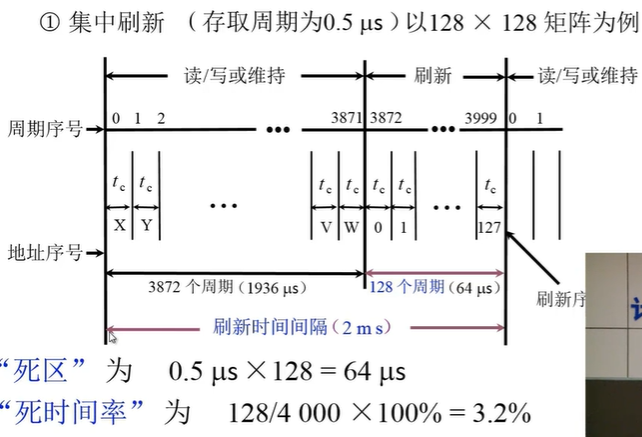

  假设 一次存储周期为0.5微秒，一共有128行，所以一次完整的刷新大概需要64微秒，而动态RAM要求的是在2毫秒内完成数据刷新，所以还剩下了1936毫秒，在这段时间中可以进行I/O的读写，但在刷新RAM的64微秒内是不允许其他设备（CPU或I/O设备）读写的。

- 分散刷新 

  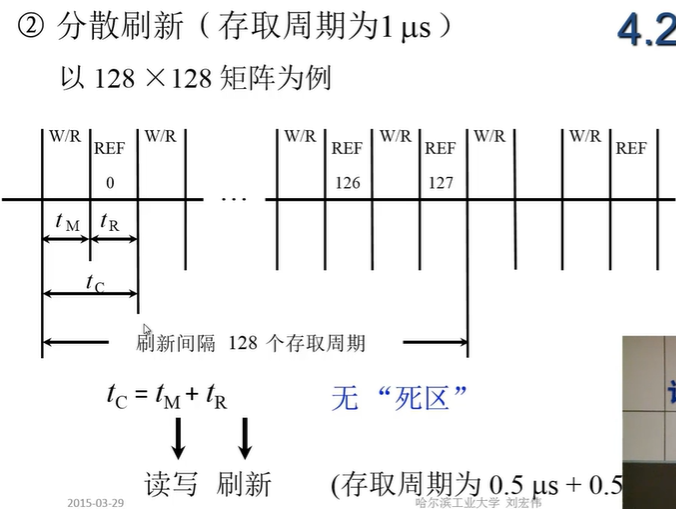

- 异步刷新

  分散刷新和集中刷新相结合的方式

  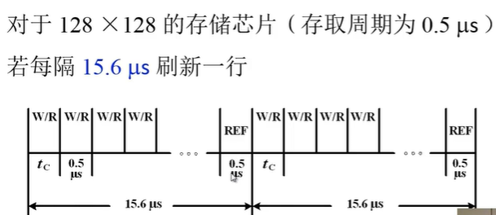

  从整体上来看是分散刷新，但从每个周期来看是集中式刷新

  每行每隔2ms刷新一次，死区为0.5微秒 / 每15.6微秒

  动态RAM和静态RAM的比较

####  动态RAM和静态RAM的比较

|          | DRAM |   SRAM   |
| :------: | :--: | :------: |
| 存储原理 | 电容 |  触发器  |
|  集成图  |  高  |    低    |
| 芯片引脚 |  少  |    多    |
|   功耗   |  低  |    高    |
|   速度   |  慢  |    快    |
|   刷新   |  有  |    无    |
|   应用   | 主存 | 高速缓存 |

### 4. 只读存储器（ROM）

#### 1.掩模 ROM（MROM）

厂家提供的无法修改的ROM

#### 2.PROM（一次性编程）

通过判断熔丝是否熔断的方式来决定 ”0“ 或 "1"

#### 3.EPROM（多次性编程）

N型沟道浮动栅MOS电路、

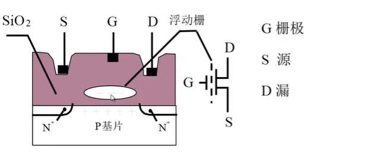

D端加正电压	形成浮动栅	S与D 不导通为“0”

D端不加正电压	不形成浮动栅 	S与D 导通为“1”

通过紫外线擦洗时，会将全部数据进行擦除，无法局部擦除

#### 4.EEPROM（多次性编程）

电可擦写

局部擦写

全部擦写

#### 5.Flash Memory（闪存型存储器）

现在用的最多的ROM，比如U盘

### 5. 存储器与CPU的连接

#### 1.存储器容量的扩展

**位扩展（增加存储 ）**

用 2片  1K X 4位 存储芯片 组成 1K （10根地址线 2^10=1000） X 8位（8根数据线） 的存储器

两个 1K X 4位的存储芯片同时被选中，一次读取或者存入两个芯片各自的4位，这样就可以模拟一次行性写8位，来实现 1K X 8位 的存储器。

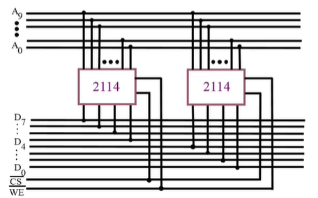

注意还需要将 CS（片选线）和WE（读写线）连接两个芯片。

**字扩展（增加存储字的数量）**

用 2片 1K X 8位 存储芯片 组成 2K（11根地址线） X 8位（8根数据线）的存储器

假设 0 0000 0000 00 ～0 1111 1111 11 用第一个1K X 8 芯片表示，1 0000 0000 00 ～1 1111 1111 11 用第二个1K X 8 芯片表示，A10 这条地址线来表示的就是 首位的正负，接片选信号，如果是0的话，就去访问第一个芯片，否则访问第二个芯片。

**字、位扩展**

用 8 片 1K X 4 位 存储芯片 组成 4K （12根地址线）X 8 （8根数据线）位的存储器

结合上边两种方式。增加一个 2 4片选译码器，负责将A10 和A11的信号转换为四种片选信号。

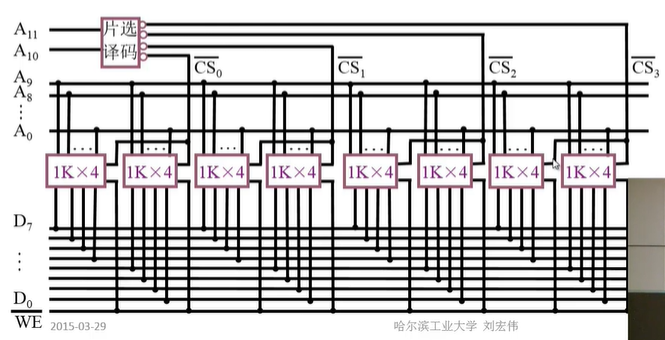

00 0000 0000 00～ 01 1111 1111 11 由第一组两个 1K X 4 的芯片表示。

01 0000 0000 00～ 01 1111 1111 11 由第二组两个 1K X 4 的芯片表示。

10 0000 0000 00～ 01 1111 1111 11 由第三组两个 1K X 4 的芯片表示。

11 0000 0000 00～ 01 1111 1111 11 由第四组两个 1K X 4 的芯片表示。

#### 2.存储器和CPU的连接

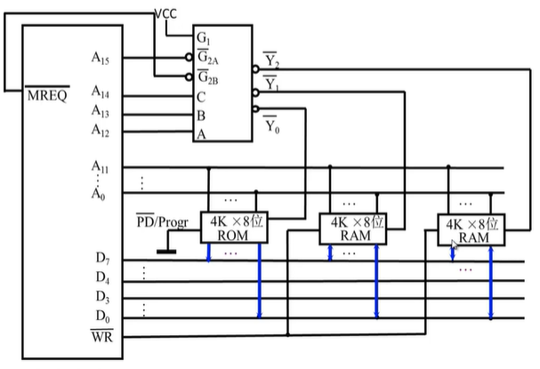

MREQ必须要用，如果是低电平的时候才是访问内存。

ROM只能读不能写，所以一端是接地的（PD/Progr），数据只能被读出。

RAM可读可写，所以接了读写线（WR），数据的箭头也是双向的。

CPU的地址线，要么输入到内存芯片中，要么输入到片选输入端，图中A12～A15输入的地方其实就是一个片选输入端，来控制着片选输入信号，通过判断A12～A14的电平信号，来决定输出端走Y0、Y1还是Y2。

### 6. 存储器的校验

#### 1.编码的最小距离

编码的最小距离是指  任意两组合法代码之间 **二进制位数** 的 **最小差异**

假设合法代码集是 {00,01,10,11} ，这个代码集中任意一个合法代码在传输时发生错误，比如0变成1或者1变成0，都会变成另外一个合法代码，这样就检测不出哪个代码发生了错误，更无法纠正了。

如果合法代码集是{000,111}，这个代码集，如果发生了错误，变成了001，可能是000传错了一位，也可能是111传错了2位。但一位错误的概率远远小于两位同时出错，所以这个代码集不光可以知道是000错了，而且还可以纠正回000，这种合法代码集就是不光能检测还能纠正。

**编码的检错、纠错能力与编码的最小距离有关**

#### 2.汉明码

- 汉明码采用奇偶校验
- 汉明码采用分组校验
- 汉明码的分组是一种非划分方式

举例说明一下，比如现在要传输 “0101” 这个二进制数据，但是在传输过程中可能会发生错误，为了保证接收方在收到数据时，不仅能判断数据是否正确还能在数据传输错误时进行纠正，所以需要对数据进行再编码，而汉明码此时就可以派上用场。

**首先汉明码如何分组？**

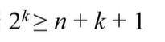

k 代表分的组数，也是校验位的个数，每组只有一个校验位，其他剩下的都是数据位。n 代表要传输数据的二进制位数。以n=4为例，计算得出k为3，也就是传输一个4位的二进制数再编码时需要添加3个校验位。

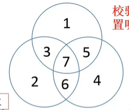

这个就是具体的分组方式，至于为什么这么分，可以看后边的介绍。

**而校验位应该放在哪些位置呢？**

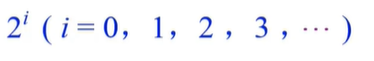

**检测位的取值？**

这个不一定，需要看是奇校验还是偶校验，如果是偶校验，且该组其他数据位有奇数个1，那么该校验位也需要为1，来确保整组有偶数个1。

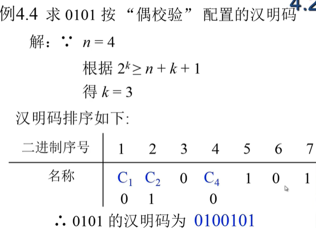

这样对于编码后的就是 0100101 ，第一组是从左往右1，3，5，7位，第二位是2，3，6，7位，第三组是4，5，6，7位，可以发现每一组中都有偶数个1，如果在传输中其中某一位发生错误，例如接收方收到的是 ”1100101“，最左边那一位数据发生了错误，这样第一组的就变成了奇数个1，而二三组仍然为0。参考下图就可以得知是最左边那一位发生了错误，纠正后就可以获取原来的值了。其中如果1、2、4位发生错误，也就是校验位发生了错误，可以选择不纠正。

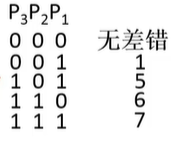

按配奇原则配置 0011 的汉明码 -》 0101011

### 7. 提高访存速度的措施

CPU的速度越来越快，每年增长50%，但是主存的速度每10才能翻一倍。

所以需要提升存储器的带宽，这里可能从硬件架构上来进行提升。

低位交叉	各个存储体轮流编址

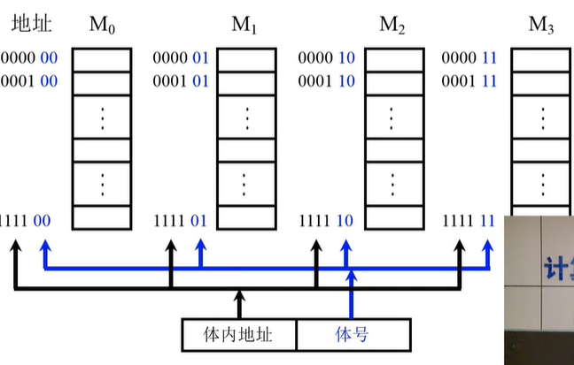

低位交叉的特点，在不改变存储周期的前提下，增加存储器的带宽。

## 高速缓冲存储器

https://www.bilibili.com/video/BV1ix41137Eu?p=41

## 辅助存储器

# 