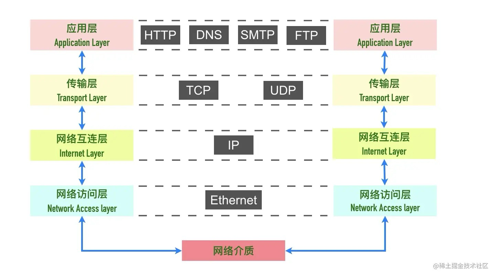
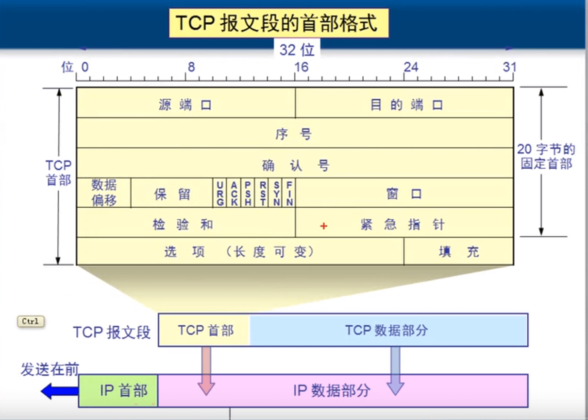
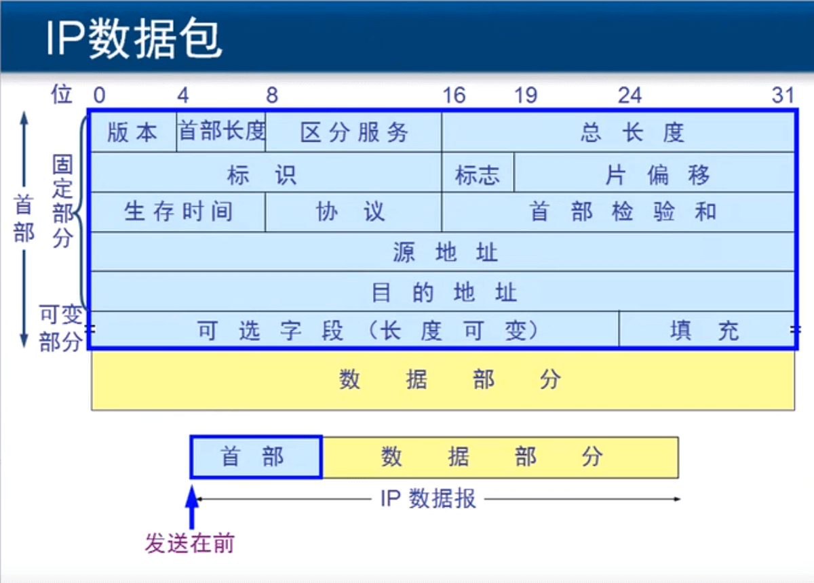
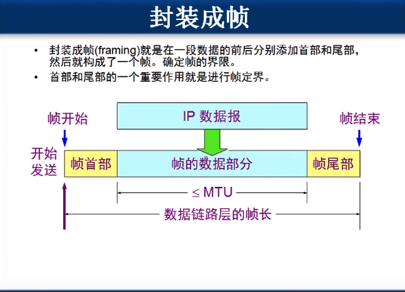
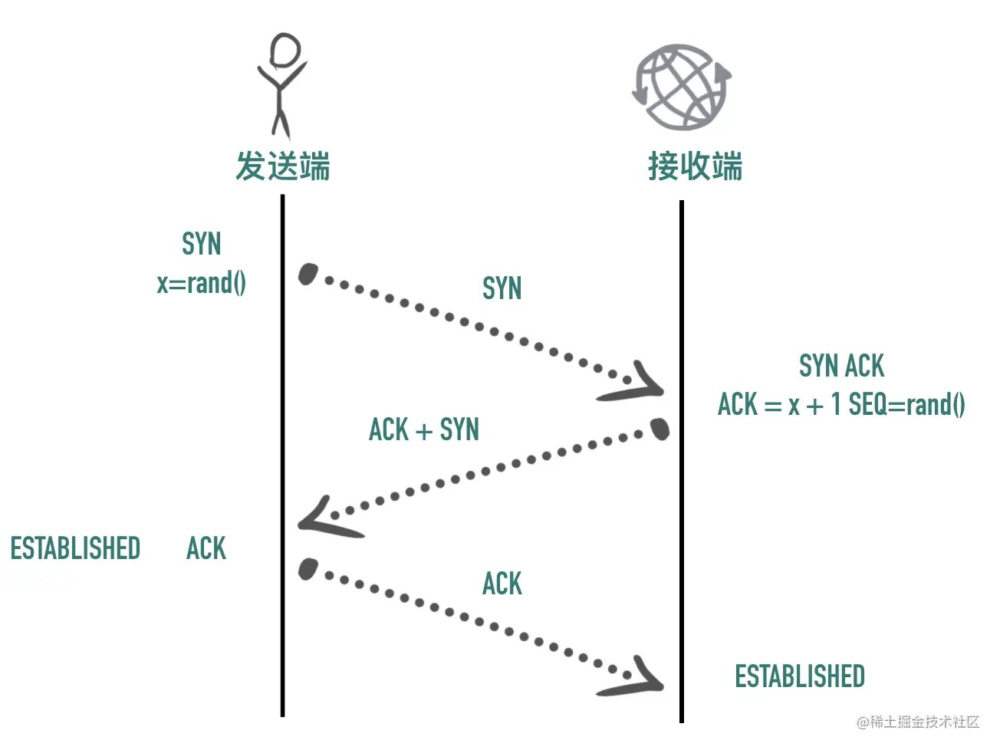
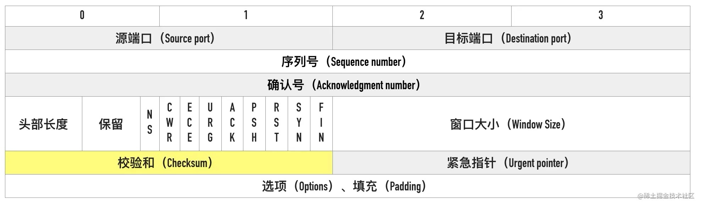
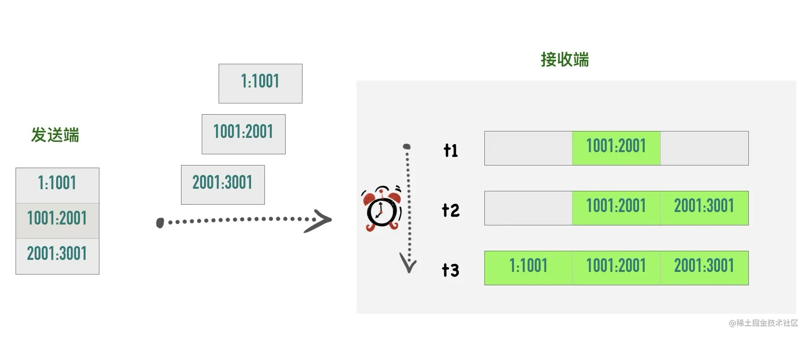

参考：

https://tf2jaguar.github.io/understand-tcp-in-depth.html#%E4%BC%A0%E8%BE%93%E5%B1%82%EF%BC%88Transport-Layer%EF%BC%89

# 网络模型分层

本分层是基于TCP/IP协议层的网络模型分层。

分层的好处是：

- 各层独立：限制了依赖关系的范围，各层之前使用标准化接口，不需要知道上下层的内部实现
- 灵活性更好：比如路由器不需要应用层和传输层，分层以后路由器就可以只用加载更少的几个协议层
- 易于测试和维护：提高了可测试性，可以独立的测试特定层，某一层有了更好的实现可以整体替换掉

## 应用层

应用层，控制应用之间是如何互相传递报文的。**定义报文的格式和内容。**传输的数据被称为消息（message）。

- 报文的类型，是请求报文还是响应报文
- 报文的语法，报文分为几段，各段是什么含义、用什么分隔，每个部分的每个字段什么什么含义
- 进程应该以什么样的时序发送报文和处理响应报文

HTTP（GET/POST）属于应用层，除了我们熟知的 HTTP 协议，还有下面这些非常常用的应用层协议

- 域名解析协议 DNS
- 收发邮件 SMTP 和 POP3 协议
- 时钟同步协议 NTP
- 网络文件共享协议 NFS

## 传输层

传输层，对传输行为的控制，传输控制协议（Transmission Control Protocol）简称TCP ，为下层协议提供数据包的重传、流量控制、拥塞控制，根据网络情况，什么时候重传，什么时候发送慢一些。**控制传输报文的过程**，会用端口号来标识不同的应用程序。

TCP/UDP属于传输层。传输的数据被称为 报文段（segment）/数据报（datagram） (注：TCP叫**TCP报文段**，UDP叫**UDP数据报**,也有人叫UDP段)

## 网络互联层（网络层）

IP地址属于网络层。网络层传输的是数据包（package），也叫数据分组。

IP 协议是网络层的主要协议，TCP 和 UDP 都是用 IP 协议作为网络层协议。这一层的主要作用是给包加上源ip地址和目标ip地址，将数据包传送到目标地址。

Q：收到 IP 数据包解析以后，它怎么知道这个分组应该投递到上层的哪一个协议（UDP 或 TCP）？

A：数据包的首部会包含对应数据段所使用的传输层协议。

## 网络访问层（数据链路层）

数据链路层传送的是帧（frame），对网络层传输过来的数据包进行加工，添加帧头、帧尾和校验值，此时数据包就改名叫数据帧了。

MAC地址属于数据链路层。以太网、Wifi、蓝牙工作在这一层，主要提供了主机连接到物理网络需要的硬件的相关协议。

## 数据传输类比快递

1. **应用层（Application Layer）**：

   应用层是最接近用户的一层，它负责处理特定的应用程序数据。应用层确保用户能够方便地发送和接收数据。这一层包括了我们日常使用的应用程序，比如电子邮件、网页浏览器和文件传输程序。在快递的例子中，应用层就像是客户填写快递单、打包包裹和接收包裹的过程。应用层确保数据能够以用户可以理解和使用的形式进行传输。

2. **传输层（Transport Layer）**：

   传输层负责确保数据的可靠传输，就像给快递包裹贴上快递单一样。在传输层，数据被分成小的单元，这些单元被称为“数据报”（Segment）。就像快递单上会写明收件人和寄件人的信息，数据报中包含了控制信息，比如端口号（类比寄件人和收件人详细地址），这些信息帮助确定数据应该被送到哪个应用程序。

3. **网络层（Network Layer）**：

   网络层处理的是数据包从一个地方传输到另一个地方的问题，就像快递公司将包裹从一个城市运到另一个城市。在网络层，数据报被进一步封装成“数据包”（Packet）。数据包上会有**源ip地址和目的ip地址**（类比寄件城市和收件城市），就像快递包裹上的收件地址和寄件地址，确保数据能够正确地从发送者传输到接收者。

4. **数据链路层（Data Link Layer）**：

   数据链路层负责在相邻的网络设备之间传输数据，这就像是快递小哥将包裹送到收件人手中。在数据链路层，网络层的数据包被封装成“数据帧”（Frame）。数据帧包含了额外的信息，比如帧同步、错误检测和物理地址（**MAC**地址类比收件人的身份证号），这些信息帮助确保数据在局域网内的正确传输。

5. **物理层（Physical Layer）**：

   物理层是整个网络通信的基础，就像快递服务中的卡车、飞机、轮船和道路。这一层负责实际的物理传输，即将数据帧通过电缆（如以太网线）、无线电波（如Wi-Fi）或者光纤等物理媒介传输。在快递的例子中，物理层就像是快递包裹的物理移动过程，包括包裹的装载、运输和卸载。

# TCP协议概述

TCP协议是 **面向连接的**、 **可靠的**、**基于字节流的**、**全双工** 的协议。

## TCP 是面向连接的协议

一开始学习 TCP 的时候，我们就被告知 TCP 是面向连接的协议，那什么是面向连接，什么是无连接呢？

- 面向连接（connection-oriented）：面向连接的协议要求正式发送数据之前需要通过「握手」建立一个**逻辑**连接，结束通信时也是通过有序的四次挥手来断开连接。
- 无连接（connectionless）：无连接的协议则不需要

### 三次握手

建立连接的过程是通过「三次握手」来完成的，顾名思义，通过三次数据交换建立一个连接。 通过三次握手协商好双方后续通信的起始序列号、窗口缩放大小等信息。

### 全连接和半连接

**半连接**：是指在TCP三次握手过程中，客户端向服务器发送SYN请求后，服务器收到并回复SYN+ACK，此时连接处于SYN_RCVD状态。这种状态下的连接被称为半连接，因为此时连接尚未完全建立，客户端还需要发送一个ACK确认包来完成三次握手，使连接进入ESTABLISHED状态。在Linux内核中，半连接会存储在半连接队列（SYN队列）中。

**全连接**：是指TCP三次握手完成后，客户端和服务器之间的连接完全建立，处于ESTABLISHED状态。此时，连接被存储在全连接队列（accept队列）中，等待应用程序通过`accept`函数将其取出。

## TCP 协议是可靠的

IP 是一种无连接、不可靠的协议：它尽最大可能将数据报从发送者传输给接收者，但并不保证包到达的顺序会与它们被传输的顺序一致，也不保证包是否重复，甚至都不保证包是否会达到接收者。

TCP 要想在 IP 基础上构建可靠的传输层协议，必须有一个复杂的机制来保障可靠性。 主要有下面几个方面：

- 对每个包提供校验和
- 包的序列号解决了接收数据的乱序、重复问题
- 超时重传
- 流量控制、拥塞控制

**校验和（checksum）** 每个 TCP 包首部中都有两字节用来表示校验和，防止在传输过程中有损坏。如果收到一个校验和有差错的报文，TCP 不会发送任何确认直接丢弃它，等待发送端重传。

**包的序列号保证了接收数据的乱序和重复问题** 假设我们往 TCP 套接字里写 3000 字节的数据导致 TCP发送了 3 个数据包，每个数据包大小为 1000 字节：第一个包序列号为[1~1001)，第二个包序列号为 [1001～2001)，第三个包序号为[2001~3001)

假如因为网络的原因导致第二个、第三个包先到接收端，第一个包最后才到，接收端也不会因为他们到达的顺序不一致把包弄错，TCP 会根据他们的序号进行重新的排列然后把结果传递给上层应用程序。

如果 TCP 接收到重复的数据，可能的原因是超时重传了两次但这个包并没有丢失，接收端会收到两次同样的数据，它能够根据包序号丢弃重复的数据。

### 超时重传 

TCP 发送数据后会启动一个定时器，等待对端确认收到这个数据包。如果在指定的时间内没有收到 ACK 确认，就会重传数据包，然后等待更长时间，如果还没有收到就再重传，在多次重传仍然失败以后，TCP 会放弃这个包。

### 流量控制 TODO

### 拥塞控制 TODO

## 面向字节流的

## 全双工的

