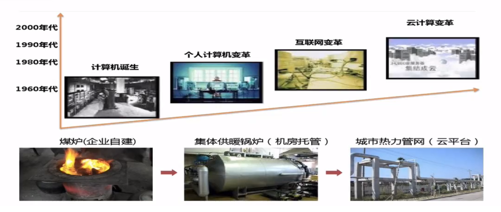
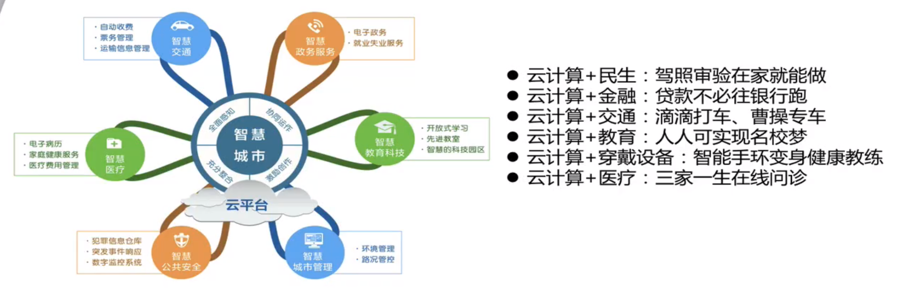

# 云计算

### 1. 云计算的演变

### 2. 云计算的定义

-  云计算的一个核心理念就是通过不断提高“云”的处理能力，进而减少用户终端的处理负担，最终使用户终端简化成一个单纯的输入输出设备，（例如 只需要网络，键盘和显示器，以及简单的系统支持就可以满足日常使用需求），并能按需享受“云”的强大计算处理能力。
- 云计算的核心思想，是将大量用网络连接的计算资源统一管理和调度，构成一个计算资源池向用户按需服务。

### 3. 云计算的产物

- IaaS（Infrastructure as a Service）：将基础作为服务，这里的基础包括 CPU、内存、网络、和带宽，相当于在远程提供了一台主机，具体用途由你来定义。就像毛坯房一样，你可以自己去装修，你有这台主机的使用权。
- PaaS（Platform as a Service）：将平台作为服务，在Iaas的基础上，进行了简单的装修，如安装了门，铺了地板等，这些都维护都是平台来做，所以我们可以把更多的精力花在房间的装修上。
- SaaS（Software as a Service）：将软件作为服务，在PaaS的基础上，软件都帮你装好了，你可以直接使用。

### 4. 云计算的优势

- 超大规模，几百万台服务器为企业级应用提供了高可靠性，并为高可扩展性提供了基础。
- 虚拟化，底层将物理硬件与上层的应用分开，可以非常灵活的部署我们的应用。
- 通用性，可以提供各种各样的服务。
- 高可扩展性，可以随着业务量的增大而便捷的进行扩展，业务减小也可缩小规模，能够按需付费。

### 5. 未来智能 - 万物互联IoT

### 6. 未来已来

