# 一、计算机系统简介

## 1.1 冯-诺依曼计算机的特点

1. 计算机由五大部件组成
2. 指令和数据以同等地位存于存储器，可按地址寻访
3. 指令和数据用二进制表示
4. 指令由操作码和地址码组成
5. **存储程序**
6. 以运算器为中心

### 冯诺依曼计算机硬件框图

- 运算器 ALU：算术运算，逻辑运算
- 存储器 CU（Contro Unit）：存放数据和程序
- 控制器：指挥程序运行
- 输入设备：将信息转换成机器能识别的形式
- 输出设备：将结果转换成人们熟悉的形式

**存在问题：**

1. 数据的输入和输出都要经过运算器，所以运算器可能比较繁忙，会成为系统的瓶颈。
2. 层次结构不明显

**做出改进:**

1. 以存储器为中心的计算机硬件框图

   

## 1.2 现代计算机硬件框图

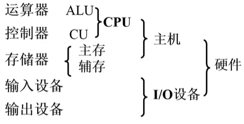

 

### 编程举例

### 指令格式举例

### 编程举例的程序清单

### 存储器的基本结构

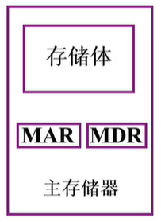

存储体	-	存储单元	-	存储元件（0/1）

大楼		-	房间			-	床位（无人/有人）

存储单元：存放一串二进制代码

存储字：存储单元中二进制代码的组合

存储字长：存储单元中二进制代码的位数，每个存储单元赋予一个地址

**MAR** ：存储器地址寄存器，反映存储单元的个数

**MDR：**存储器数据寄存器，反映存储字长。保存从存储体中输入输出的数据。

设MAR=4位，MDR=8位。存储单元个数为2^4个，存储的字长为8

存储容量 =  存储单元个数（MAR） X 存储字长（MDR）

| MAR  | MDR  |    容量    |
| :--: | :--: | :--------: |
|  4   |  8   |  16 X 8位  |
|  10  |  8   |  1k X 8位  |
|  16  |  32  | 64k X 32位 |

### 运算器的基本结构

ACC、X、MQ（乘商寄存器） 三种寄存器搭配 ALU 完成基本的加减乘除。

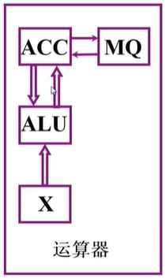

|      |     ACC     |      MQ       |   X    |
| :--: | :---------: | :-----------: | :----: |
| 加法 |  被加数/和  |               |  加数  |
| 减法 |  被减数/和  |               |  减数  |
| 乘法 |  乘积高位   | 乘数/乘积低位 | 被乘数 |
| 除法 | 被除数/余数 |      商       |  除数  |

#### **加法操作过程**

 

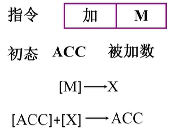

- 执行加法操作前，需要先将被加数通过取数指令，将其从内存读取到 ACC 中
- 执行加法指令，通过操作码得知是加法指令，通过地址码知道被加数的内存地址，将加数读取到 X 中
- ALU 对 ACC 与 X 进行加法的操作，并将结果保存到 ACC中

#### **减法操作过程**

#### **乘法操作过程**

- 将内存中M的值保存到 MQ 寄存器中，并将 ACC 寄存器中的值保存到 X 寄存器中。这两步操作没有先后顺序，具体的执行先后可以由 CU（控制器）来控制。

- 将 ACC 寄存器清空

- ALU（运算器）对 X 和 MQ 进行乘法操作，乘法操作的原理和加法不同，加法是直接将二进制位相加，而乘法则需要移位和相加，乘法的结果由 ACC 和 MQ 共同保存，ACC 保存高位，MQ保存低位，因为发生了移位，单凭 ACC 可能无法保存完整的位，比如，9x9=81，个位数相乘，结果就变成两位数了。

  **二进制乘法表**

  |  x   |  0   |  1   |
  | :--: | :--: | :--: |
  |  0   |  0   |  0   |
  |  1   |  0   |  1   |
  
  该表和十进制乘法表类似，只有位数都是1的时候，结果才为1，否则为0。
  
  （十进制）2x3  《=》  （二进制）10 x 11，参考下图。
  
  

 

#### **除法操作过程**

### 控制器的基本结构

#### 控制器的功能

- 解释指令
- 保证指令的按序执行

#### 控制器的基本组成

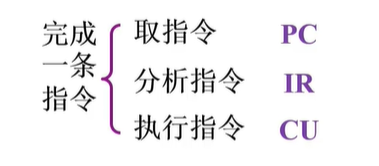

**PC**	存放当前欲执行指令的地址，具有计数功能（PC）+1 ——》 PC
**IR**	存放当前欲执行的指令，并通过指令的操作码来分析指令

### 主机完成一条指令的过程

存储器、运算器和控制器 这三者就构成了主机。

**存储器** 包含 存储体、MAR和MDR。

**运算器** 主要由 ALU 和 ACC 、X 、MQ 这三个寄存器构成。

**控制器** 主要由 CU 、IR （指令寄存器 ）PC（程序计数器）构成。

主机加IO就构成了计算机的硬件系统。

#### **取数指令**

1. PC 中保存了将要执行指令的地址，将该地址送入 MAR
2. MAR 将地址 送入 存储体
3. 在 CU 的控制下，从 存储体 中指定的存储单元将该指令取出，放入到 MDR
4. 将 MDR 取出的指令送入到 IR 中
5. 将 IR 中的操作码送入 CU 中进行分析，分析后 CU会发出对应的控制信号来完成指令
6. 将 IR 中的地址码送入 MAR 
7. MAR 将地址码送入存储体中
8. 存储体 通过地址码读取到对应存储单元中对应数据，并保存到 MDR
9. 通过 CU 的控制，将 MDR 中数据写入到 ACC 寄存器中

#### **存数指令**

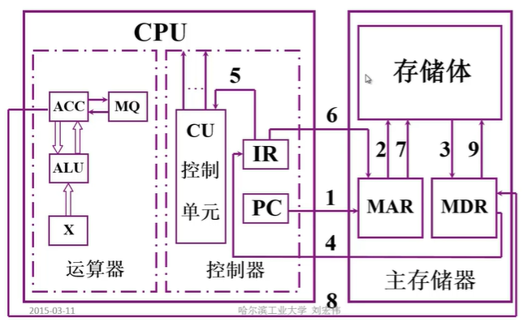

1. PC 中保存了将要执行指令的地址，将该地址送入 MAR
2. MAR 将地址 送入 存储体
3. 在 CU 的控制下，从 存储体 中指定的存储单元将该指令取出，放入到 MDR
4. 将 MDR 取出的指令送入到 IR 中
5. 将 IR 中的操作码送入 CU 中进行分析，分析后 CU会发出对应的控制信号来完成指令
6. 将 IR 中的地址码送入 MAR，IR 中的地址码表示保存到的内存地址
7. MAR 告诉 存储体 现在有一个数据要保存进来，保存的地址是多少
8. 将 ACC 保存的数据 送入到 MDR，MDR 保存了从 存储体 中输入和输出的数据
9. 将 MDR 中的数据保存到 存储体 中

### 编程举例的运行过程

- 将程序通过输入设备送至计算机

- 程序首地址——》PC

- 启动程序运行

- 取指令 PC——》MAR——》M——》MDR——》IR，（PC）+1——》PC

- 分析指令 OP（IR中的操作码）——》CU

- 执行指令 AD（IR中的地址码）——》MAR——》M——》MDR——》ACC

  ...

- 打印结果

以上是编程举例中的第一条指令的执行过程，PC现在指向下一条指令的地址。

## 1.3 计算机硬件的主要技术指标

**机器字长**

CPU一次能处理数据的位数与CPU中的 **寄存器位数** 有关

**运算速度**

- 主频
- 核数，每个核支持的线程数
- CPI 执行一条指令所需要
- MIPS
- FLOPS      

# 二、总线

## 总线的基本概念

总线是连接各个部件的信息传输线，是**各个部件共享的传输介质**。

**为什么要有总线？**

如果设备与设备不是通过总线来传输，而是直接连接两个设备，那么随着设备的增多，不同设备之间需要连接的线也会越来越多，因此需要一个通用的公共的线路来传输。举个生活中的例子，总线就像公交线路一样，从A点到B点可能没有直达的线路（好比设备没有直连），但在A点和B点附近都有同一条公交线路（总线），这条线路上还有别的站点（用于其他设备接入总线）。

## 总线的分类

### 片内总线

芯片内部的总线

### 系统总线

计算机各部件之间的信息传输线

- 数据总线

  双向，与机器字长、存储字长有关

- 地址总线

  单向，与存储地址、I/O地址有关

- 控制总线

  有出，CPU向外送（存储器读、存储器写、总线允许、中断确认）

  有入，（中断请求、总线请求）

### 通信总线

用于计算机系统之间或计算机系统与其他系统（如控制仪表、移动通信）之间的通信

- 串行通信总线

- 并行通信总线

## 总线特性及性能指标

### 总线物理实现

###  总线特性

1. 机械特性

   尺寸、形状、管教数及排列顺序

2. 电气特性

   传输方向和有效的电平范围

3. 功能特性

   每根传输线的功能如 地址、数据、控制

4. 时间特性

   信号的时序关系

### 总线的性能指标

1. 总线宽度

   数据线的根数

2. 标准传输率

   每秒传输的最大字节数（MBps）

3. 时钟同步/异步

   同步、不同步

4. 总线复用

   地址线 与 数据线 复用

5. 信号线数

   地址线、数据线和控制线的总和

6. 总线控制方式

   突发、自动、仲裁、逻辑、计数

7. 其他指标

   负载能力

## 总线结构

### 1.单总线结构框图

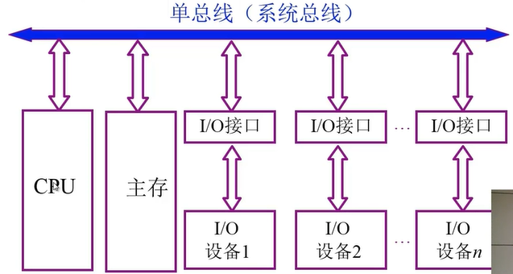

缺陷：

- 在主存和I/O设备进行写入的过程时，CPU是无法正常工作的，影响CPU运行效率
- 如果设备很多，总线会很长，远端设备的延时会比较长

### 2.面向 CPU的双总线结构框图

改进：

- 由于CPU需要频繁地与主存数据传输，因此提供一条单独的总线来进行两者通讯

缺陷：

- 主存与外部I/O设备之间无法直接数据传输，需要通过CPU来做中转

### 3.以存储器中为中心的双总线结构框图

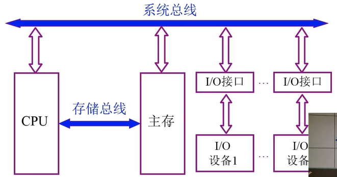

### 4.三总线结构

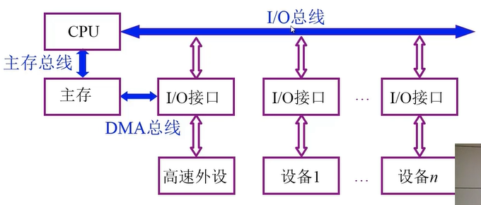

DMA 直接存储器访问，用于外部高速设备直接访问系统内存。

### 5.三总线结构的又一形式

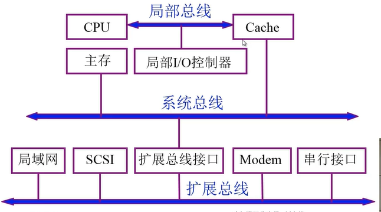

由于CPU和主存速度差距过大，中间引入高速缓存 Cache来作为中转，将CPU常用指令都存放在Cache中。

### 6.四总线结构

## 总线控制

### 总线判优控制

- 主设备（模块） 对总线有控制权
- 从设备（模块） 响应 从主设备发来的总线命令
- 总线判优控制
  - 集中式
    - 链式查询
    - 计数器定时查询
    - 独立请求方式
  - 分布式

#### 链式查询

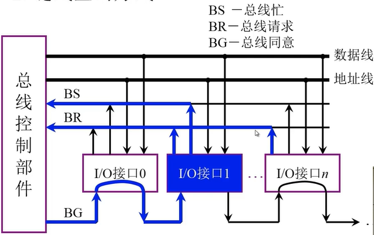

1. 设备通过I/O接口 使用 BR总线 向总线控制部件 发送总线控制请求，因为所有的I/O接口都共用同一条总线，总线控制部件收到请求后无法判断是哪个接口发送的请求，这就好比，传纸条，最后一个人只知道纸条是前一个人传过来的，但不知道是前边哪个人写的。
2. 总线控制部件会通过 BG总线 向下进行查询，看看是谁发送的请求，会找到第一个发送总线请求的接口 ，例如图中的 I/O接口1。
3. 找到后 I/O接口1 后，该接口会使用 BS总线，向总线控制部件 发送总线忙的信号，这样该接口就获取到了总线的控制权。

缺陷：

- 各个设备占用总线的优先级和 BG总线的查询顺序有直接关系，也就是不同的设备接口有不同的优先级
- 在BG总线链式查询 总线请求发起设备的过程中，如果BG线路上发生电路故障，故障点之后的设备将再也无法获取总线的控制权。

#### 计数器定时查询 

和链式查询的过程类似，不同点在于对链式查询的缺陷做了改进，通过在总线控制部件中引入一个计数器来改变查询接口的顺序，具体的做法是调整计数器的初始值，可以将初始值设置为上次控制总线的接口编号，也可以通过软件来设置该初始值。这样总线控制部件在查询接口就不是按照固定的顺序了，解决了链式查询的问题。

#### 独立请求方式

### 总线通信控制

- 目的 解决通信双方 **协调配合** 问题

- 总线传输周期

  1. 申请分配阶段

     **主模块申请**，总线判优决定

  2. 寻址阶段

     主模块向从模块 **给出地址** 和 **命令**

  3. 传数阶段

     主模块和从模块 **交换数据**

  4. 结束阶段

     主模块 **撤销有关信息**

- 总线通信的四种方式

  1. 同步通信

     由 **统一时标**   控制数据传输

  2. 异步通信

     采用 **应答方式** ，没有公共时钟标准

  3. 半同步通信

     同步、异步结合

  4. 分离式通信

     充分挖掘系统总线每个瞬间的潜力

# 三、存储器

## 概述

### 存储器分类

#### 按存储介质分类

- 半导体存储器，需通电，易失

- 磁盘，通过磁性

- 光盘存储器，激光、磁光材料

#### 按存取方式分类

1.  存取时间与物理地址无关（随机访问）
   - 随机存储器	在程序的执行过程中 可读可写
   - 只读存储器	在程序的执行过程中 只读
2. 存取时间与物理地址有关（串行访问）
   - 顺序存储存储器	磁带
   - 直接存取存储器	磁盘

#### 按在计算机中的作用分类

1. 主存储器
   - RAM
   - ROM
2. FLash Memory
3. 高速缓冲存储器（Cache）
4. 辅助存储器 磁盘、磁带、光盘

### 存储器的层次结构

#### 存储器三个主要特性的关系

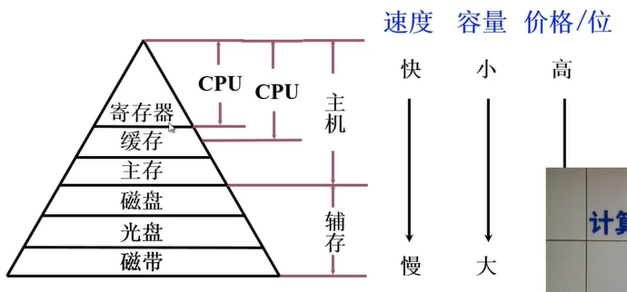

#### 缓存—主存层次和主存—辅存层次

## 主存储器

### 1. 概述

#### 主存的基本组成

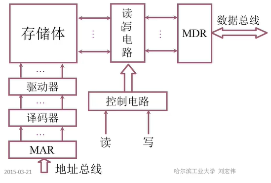

#### 主存与CPU之间的联系

- 虽然 MDR 和 MAR 属于主存中的设备，但是随着近代计算机的发展，这两部分被集成到CPU内部。
- 数据总线双向传导数据的，到主存读取到CPU和将CPU的数据写入到主存
- 地址总线是单向的

#### 主存中存储单元地址的分配

12345678H 这个数据如何在主存储器中进行存储？

12345678H 一共有8个16进制数，每个16进制数需要用4位，一共32位，1个字节（byte）=8个比特位（bit）

所以需要4个字节。图中展示 一个字 = 四个字节。所以一个字的字长是 32 位。

大尾、小尾两种方式都有机型在用，比如 x86 就是用小尾方式。

**设地址线24根**	按 **字节** 寻址  每根线有0/1两种情况，总共有 2^24 = 16,777,216‬ byte = 16MB 种可能，按字节寻址的范围有16MB。

还是地址线24根，如果按 **字** 寻址的话，就是 16 / 4 = 4 MW ，字寻址范围是 4MW。

之前的字长是32位，如果在地址线不变的情况下将字长调整为16位，也就是一个字=两个字节，那么该字长情况下的 字寻址范围为 8MW。

> M表示是辅助存储单元
> B 是指长度占一个字节
> W 是指长度占一个字（两个字节）
> D 是指长度占一个双字（四个字节）
>
> MB比特型的存储器
> MW字型的存储器
> MD双字型的存储器

#### 主存的技术指标

1. 存储容量  主存 存放二进制代码的总位数

2. 存储速度

   - 存取时间	存储器的 **访问时间**	

     从存储器给出地址直到得到稳定的数据输入或输出的时间

     读出时间	写入时间

   - 存取周期	连续两次独立（数据无关）的存储器操作

     （读或写）所需的最小间隔时间，这个时间往往比存储时间要长

3. 存储器的带宽	位/秒

### 2. 半导体存储芯片简介

#### 半导体存储芯片的基本结构

- 地址线（单向）

  从CPU或者I/O设备 给出地址信息

- 数据线（双向）

  完成数据的双向传输

- 芯片容量

  | 地址线（单向） | 数据线（双向） | 芯片容量  |
  | :------------: | :------------: | :-------: |
  |       10       |       4        | 1k X 4位  |
  |       14       |       1        | 16k X 1位 |
  |       13       |       8        | 8k X 8位  |

- 片选线

  决定此次操作在哪个或者哪组芯片上进行 CS、CE

  CS 是片选信号，低电平的时候才会被选中

- 读/写控制线

  决定此次操作是读操作还是写操作

  - 用一根WE线来控制读写

    WE 如果这个信号是低电平的话，进行写操作，高电平读

  - 用 OE、WE两根线来控制读写

    OE 允许读，WE 允许写

#### **存储芯片片选线的作用**

一个存储器是由很多个小的存储芯片组成的，为了组成 64K X 8 的存储器，我们需要32个16K X 1 的芯片，分成4组，每组8个，每次读取操作时，会把这一组的8个1位的芯片看作整体，也就是8位的芯片，以达到CPU读取8位的需求。

因为分成了4个组，各组的表示范围分别是0～16K-1，16K~32K-1，32K~48K-1,48K~64K-1。

因此当要操作的地址为65535（64K-1）时，片选线会在第四组保持低电平，其他保持高电平，来选择此次操作的存储芯片组。

#### 半导体存储芯片的译码驱动方式

1. 线选法

   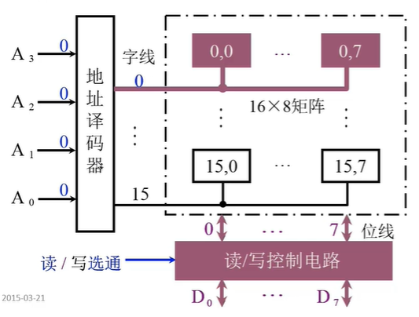

   地址译码器的工作主要是译码，具体的过程是将左侧 A0~A3 分别看作8 4 2 1，有信号为1，没有为0，这样组成的二进制数就可以表示 0~15，然后再通过译码器右侧的字线转换为译码后的结果。

   读/写控制电路再对有字线信号的存储矩阵进行控制读写。

   缺陷：线选法不适合大容量的存储矩阵，如果有20根地址线，那么对应的字线会有1M根，也就是100w根，对于内存很难做到这么高的集成度。

2. 重合法

   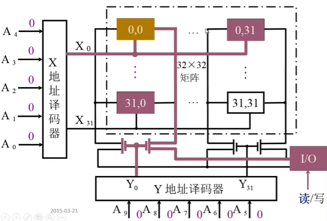

   相当于从一维变成了二维，通过电路，让两X、Y地址译码器交点的存储矩阵进行输出。

### 3. 随机存取存储器（RAM）

#### 静态RAM（SRAM）

用触发器实现静态RAM

T1~T4 触发器 存放0/1

T5、T6 行开关 控制该触发器进行读写的

T7、T8 列开关 

毕竟SRAM需要多个集成在一起工作的，所以需要行、列开关来进行选择

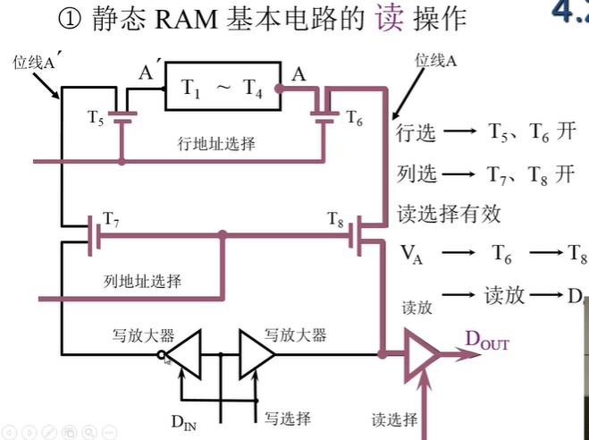

 

##### **静态RAM芯片举例**

WE：读写信号，CS：片选信号

列选择器同时控制着每一组的某列，比如上例中，同时控制各组的第0列，这样一次就可以对4个I/O数据线进行输出。

#### 动态RAM（DRAM）

##### **三管动态RAM**

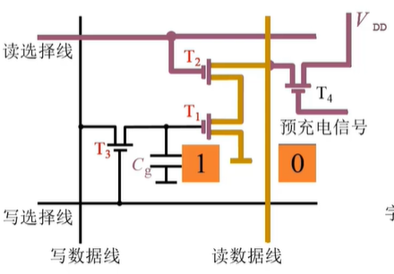

用电容的是否存在电荷实现动态RAM

有电为1，没有电认为是0

读出与原存信息相反

写入与输入信息相同

##### **单管动态RAM**

读出时数据线有电流为 “1” 无电流为“0”

写入时 Cs 充电为“1” 放电为“0”

##### **动态RAM芯片举例**

**三管动态RAM 芯片（Intel 1103）读**

- 这里没有用WE控制信号来控制读写，而是直接在行地址译码器译码的过程中控制了读写。
- 由于电容中的电荷会随着时间流逝，因此需要刷新放大器来定时对存在电荷的单元电路进行充电。方便读取

**三管动态RAM 芯片（Intel 1103）写**

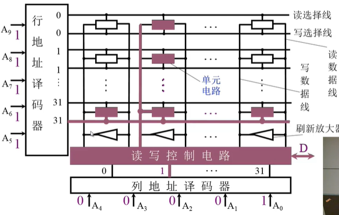

**单管动态RAM 4116（16K X 1位）外特性**

16K = 2^14 ，也就是意味着需要14根地址线，但是RAM 4116却通过7根地址线实现，它的实现原理是分两次传输，第一次传输的是7位行地址信号，第二次传输7位列地址信号。传输过来的信号放在对应的缓存器中，行列信号都到齐后，进行译码，选中到具体要操作的存储单元进行输入和输出。

**单管动态RAM 4116（16K X 1位）读原理**

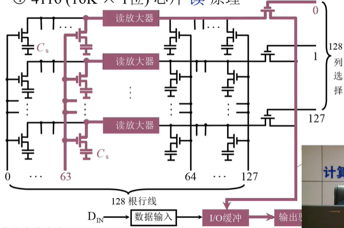

读放大器，像一个跷跷板电路，通过该元件的电荷会取反，注意是通过，如果在读放大器右侧，是不需要通过该元件的。左侧的电容如果是1，通过后会变成0；如果是0，则会变成1。

因此，在读放大器的左边，电容中有电表示0，没有电表示1；读放大器右侧，有电保存1，没有电保存0 。

**单管动态RAM 4116（16K X 1位）写原理**

比如，写第0列，第63行，从I/O缓冲一直到放大器右端的电路中一直都是1，但是通过读放大器后，最后保存在电容中的是0，如果后续要读出该电容的话，经过读放大器又会被转化为1。

##### 动态RAM刷新

因为电容会随时间丢失电荷，因此需要定期刷新。

刷新与行地址有关，每次刷新一行的存储单元。

- 集中刷新

  

  假设 一次存储周期为0.5微秒，一共有128行，所以一次完整的刷新大概需要64微秒，而动态RAM要求的是在2毫秒内完成数据刷新，所以还剩下了1936毫秒，在这段时间中可以进行I/O的读写，但在刷新RAM的64微秒内是不允许其他设备（CPU或I/O设备）读写的。

- 分散刷新 

  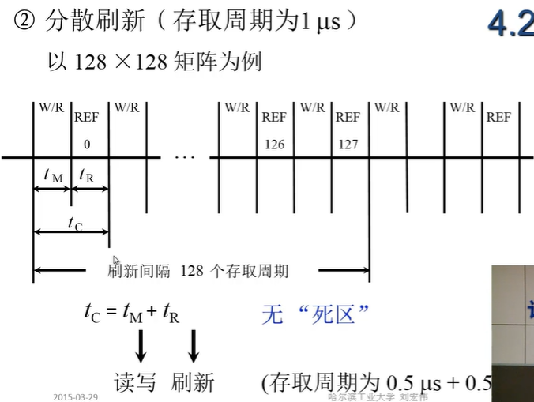

- 异步刷新

  分散刷新和集中刷新相结合的方式

  

  从整体上来看是分散刷新，但从每个周期来看是集中式刷新

  每行每隔2ms刷新一次，死区为0.5微秒 / 每15.6微秒

  动态RAM和静态RAM的比较

####  动态RAM和静态RAM的比较

|          | DRAM |   SRAM   |
| :------: | :--: | :------: |
| 存储原理 | 电容 |  触发器  |
|  集成图  |  高  |    低    |
| 芯片引脚 |  少  |    多    |
|   功耗   |  低  |    高    |
|   速度   |  慢  |    快    |
|   刷新   |  有  |    无    |
|   应用   | 主存 | 高速缓存 |

### 4. 只读存储器（ROM）

#### 1.掩模 ROM（MROM）

厂家提供的无法修改的ROM

#### 2.PROM（一次性编程）

通过判断熔丝是否熔断的方式来决定 ”0“ 或 "1"

#### 3.EPROM（多次性编程）

N型沟道浮动栅MOS电路、

D端加正电压	形成浮动栅	S与D 不导通为“0”

D端不加正电压	不形成浮动栅 	S与D 导通为“1”

通过紫外线擦洗时，会将全部数据进行擦除，无法局部擦除

#### 4.EEPROM（多次性编程）

电可擦写

局部擦写

全部擦写

#### 5.Flash Memory（闪存型存储器）

现在用的最多的ROM，比如U盘

### 5. 存储器与CPU的连接

#### 1.存储器容量的扩展

**位扩展（增加存储 ）**

用 2片  1K X 4位 存储芯片 组成 1K （10根地址线 2^10=1000） X 8位（8根数据线） 的存储器

两个 1K X 4位的存储芯片同时被选中，一次读取或者存入两个芯片各自的4位，这样就可以模拟一次行性写8位，来实现 1K X 8位 的存储器。

注意还需要将 CS（片选线）和WE（读写线）连接两个芯片。

**字扩展（增加存储字的数量）**

用 2片 1K X 8位 存储芯片 组成 2K（11根地址线） X 8位（8根数据线）的存储器

假设 0 0000 0000 00 ～0 1111 1111 11 用第一个1K X 8 芯片表示，1 0000 0000 00 ～1 1111 1111 11 用第二个1K X 8 芯片表示，A10 这条地址线来表示的就是 首位的正负，接片选信号，如果是0的话，就去访问第一个芯片，否则访问第二个芯片。

**字、位扩展**

用 8 片 1K X 4 位 存储芯片 组成 4K （12根地址线）X 8 （8根数据线）位的存储器

结合上边两种方式。增加一个 2 4片选译码器，负责将A10 和A11的信号转换为四种片选信号。

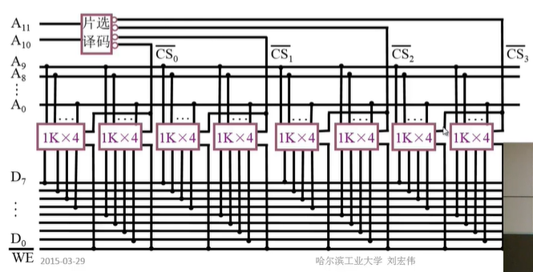

00 0000 0000 00～ 01 1111 1111 11 由第一组两个 1K X 4 的芯片表示。

01 0000 0000 00～ 01 1111 1111 11 由第二组两个 1K X 4 的芯片表示。

10 0000 0000 00～ 01 1111 1111 11 由第三组两个 1K X 4 的芯片表示。

11 0000 0000 00～ 01 1111 1111 11 由第四组两个 1K X 4 的芯片表示。

#### 2.存储器和CPU的连接

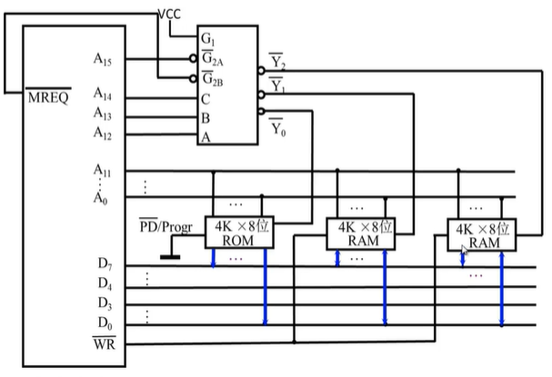

MREQ必须要用，如果是低电平的时候才是访问内存。

ROM只能读不能写，所以一端是接地的（PD/Progr），数据只能被读出。

RAM可读可写，所以接了读写线（WR），数据的箭头也是双向的。

CPU的地址线，要么输入到内存芯片中，要么输入到片选输入端，图中A12～A15输入的地方其实就是一个片选输入端，来控制着片选输入信号，通过判断A12～A14的电平信号，来决定输出端走Y0、Y1还是Y2。

### 6. 存储器的校验

#### 1.编码的最小距离

编码的最小距离是指  任意两组合法代码之间 **二进制位数** 的 **最小差异**

假设合法代码集是 {00,01,10,11} ，这个代码集中任意一个合法代码在传输时发生错误，比如0变成1或者1变成0，都会变成另外一个合法代码，这样就检测不出哪个代码发生了错误，更无法纠正了。

如果合法代码集是{000,111}，这个代码集，如果发生了错误，变成了001，可能是000传错了一位，也可能是111传错了2位。但一位错误的概率远远小于两位同时出错，所以这个代码集不光可以知道是000错了，而且还可以纠正回000，这种合法代码集就是不光能检测还能纠正。

**编码的检错、纠错能力与编码的最小距离有关**

#### 2.汉明码

- 汉明码采用奇偶校验
- 汉明码采用分组校验
- 汉明码的分组是一种非划分方式

举例说明一下，比如现在要传输 “0101” 这个二进制数据，但是在传输过程中可能会发生错误，为了保证接收方在收到数据时，不仅能判断数据是否正确还能在数据传输错误时进行纠正，所以需要对数据进行再编码，而汉明码此时就可以派上用场。

**首先汉明码如何分组？**

k 代表分的组数，也是校验位的个数，每组只有一个校验位，其他剩下的都是数据位。n 代表要传输数据的二进制位数。以n=4为例，计算得出k为3，也就是传输一个4位的二进制数再编码时需要添加3个校验位。

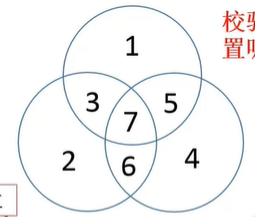

这个就是具体的分组方式，至于为什么这么分，可以看后边的介绍。

**而校验位应该放在哪些位置呢？**

**检测位的取值？**

这个不一定，需要看是奇校验还是偶校验，如果是偶校验，且该组其他数据位有奇数个1，那么该校验位也需要为1，来确保整组有偶数个1。

这样对于编码后的就是 0100101 ，第一组是从左往右1，3，5，7位，第二位是2，3，6，7位，第三组是4，5，6，7位，可以发现每一组中都有偶数个1，如果在传输中其中某一位发生错误，例如接收方收到的是 ”1100101“，最左边那一位数据发生了错误，这样第一组的就变成了奇数个1，而二三组仍然为0。参考下图就可以得知是最左边那一位发生了错误，纠正后就可以获取原来的值了。其中如果1、2、4位发生错误，也就是校验位发生了错误，可以选择不纠正。

按配奇原则配置 0011 的汉明码 -》 0101011

### 7. 提高访存速度的措施

CPU的速度越来越快，每年增长50%，但是主存的速度每10才能翻一倍。

所以需要提升存储器的带宽，这里可能从硬件架构上来进行提升。

低位交叉	各个存储体轮流编址

低位交叉的特点，在不改变存储周期的前提下，增加存储器的带宽。

## 高速缓冲存储器

https://www.bilibili.com/video/BV1ix41137Eu?p=41

## 辅助存储器

# 四、输入输出设备

# 五、计算机中数的表示

# 六、计算机的运算方法和运算器

# 七、指令系统

# 八、CPU的结构和功能

# 九、控制单元

# 十、控制单元的设计