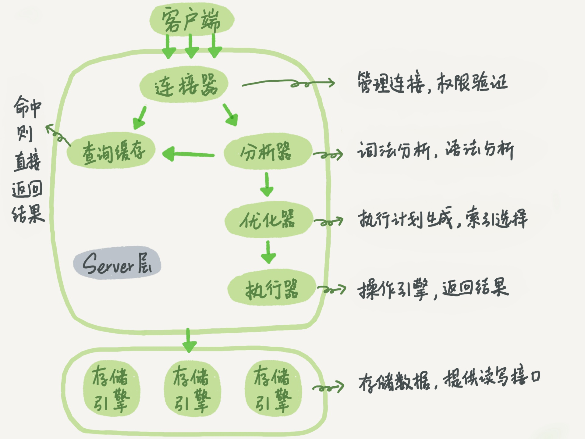

# 一条SQL查询语句是如何执行的？



大的来说，MySQL可以分为 Server层和 存储引擎层。

## Server 层

### 连接器

负责与客户端建立连接、获取权限、维持和管理连接。

使用下面命令，就可以与指定ip：prot 进行数据库连接了，在进行TCP握手之后，连接器就要认证你的身份，也就是你的用户名和密码是否正确，然后才会去权限表里验证你拥有的权限，之后这个连接里的全县判断逻辑，都依赖于此时读到的权限，因此当一个用户的权限被修改后，重新连接才能生效。

```sql
mysql -h$ip -P$port -u$user -p
```

连接有长连接和短连接之分，长连接是指连接成功后，如果客户端持续有请求，则一直使用同一个连接，如果连接后长时间没有操作，连接器也会将它断开，这个时间是由参数 wait_timeout 控制的，默认为 8 小时；短连接则是每次执行完很少的几次查询就断开连接，下次查询再重新建一个。

建立连接的过程比较复杂，因此在使用中尽量减少建立连接的动作，也就是尽量使用长连接。

全部使用长连接后，MySQL使用时内存涨的特别快，原因在于sql在执行时临时使用的内存（比如查出的数据）是管理在 **连接对象** 里面的，这些资源会在连接断开的时候释放，所以长时间累计下来，可能会导致内存占用过大，被系统强行杀掉（OOM），从现象上看就是MySQL异常重启了。

怎么解决这个问题呢？你可以考虑以下两种方案。
1. 定期断开长连接。使用一段时间，或者程序里面判断执行过一个占用内存的大查询后，断开
连接，之后要查询再重连。
2. 如果你用的是 MySQL 5.7 或更新版本，可以在每次执行一个比较大的操作后，通过执行
mysql_reset_connection 来重新初始化连接资源。这个过程不需要重连和重新做权限验证，
但是会将连接恢复到刚刚创建完时的状态。

### 查询缓存

连接建立后，就可以执行sql了，执行逻辑就会来到第二步：查询缓存。

MySQL 拿到一个查询请求后，会首先到查询缓存中去看看，之前是否执行过这条sql，执行过的话，会在查询缓存中保留，这样就可以直接通过 key（ 查询语句），获取到 value （查询结果）。

如果语句没有在缓存中，才会去执行后面的步骤，执行后再将结果进行缓存。如果查询命中的话，这个效率会非常高，如果查询缓存失效的非常频繁，只要有对一个表的更新，这个表上的所有查询缓存都会被清空，因此查询缓存是一个双刃剑，对与更新频繁的数据表，不建议使用，对于一些静态表、配置表，这些表的查询才适合使用查询缓存。

 MySQL 也提供了这种 “ 按需使用 ” 的方式。你可以将参数 query_cache_type 设置成DEMAND ，这样对于默认的 SQL 语句都不使用查询缓存。而对于你确定要使用查询缓存的语句，可以用 SQL_CACHE 显式指定，像下面这个语句一样：

```sql
mysql> select SQL_CACHE * from T where ID=10 
```

需要注意的是， MySQL 8.0 版本直接将查询缓存的整块功能删掉了，也就是说 8.0 开始彻底没有这个功能了。

### 分析器

如果没有命中查询缓存，就要开始真正执行语句了。首先， MySQL 需要知道你要做什么，因此需要对 SQL 语句做解析。

分析器先会做 “ 词法分析 ” 。你输入的是由多个字符串和空格组成的一条 SQL 语句， MySQL 需要识别出里面的字符串分别是什么，代表什么。

MySQL 从你输入的 "select" 这个关键字识别出来，这是一个查询语句。它也要把字符串 “T” 识别成 “ 表名 T” ，把字符串 “ID” 识别成 “ 列 ID” 。

做完了这些识别以后，就要做 “ 语法分析 ” 。根据词法分析的结果，语法分析器会根据语法规则，判断你输入的这个 SQL 语句是否满足 MySQL 语法。

如果你的语句不对，就会收到 “You have an error in your SQL syntax” 的错误提醒，比如下面这个语句 select 少打了开头的字母 “s” 。

一般语法错误会提示第一个出现错误的位置，所以你要关注的是紧接 “use near” 的内容。

### 优化器

经过了分析器， MySQL 就知道你要做什么了。在开始执行之前，还要先经过优化器的处理。

优化器是在表里面有多个索引的时候，决定使用哪个索引；或者在一个语句有多表关联（ join ）的时候，决定各个表的连接顺序。比如你执行下面这样的语句，这个语句是执行两个表的 join ：

```sql
mysql> select * from t1 join t2 using(ID) where t1.c=10 and t2.d=20;
```

- 既可以先从表 t1 里面取出 c=10 的记录的 ID 值，再根据 ID 值关联到表 t2 ，再判断 t2 里面 d 的值是否等于 20 。
- 也可以先从表 t2 里面取出 d=20 的记录的 ID 值，再根据 ID 值关联到 t1 ，再判断 t1 里面 c 的值是否等于 10。

这两种执行方法的逻辑结果是一样的，但是执行的效率会有不同，而优化器的作用就是决定选择使用哪一个方案。

### 执行器

MySQL 通过分析器知道了你要做什么，通过优化器知道了该怎么做，于是就进入了执行器阶段，开始执行语句。
开始执行的时候，**要先判断一下你对这个表 T 有没有执行查询的权限**，如果没有，就会返回没有权限的错误，如下所示。

```sql
mysql> select * from T where ID=10;
ERROR 1142 (42000): SELECT command denied to user 'b'@'localhost' for table 'T'
```

如果有权限，就打开表继续执行。打开表的时候，执行器就会根据表的引擎定义，去使用这个引擎提供的接口。
比如我们这个例子中的表 T 中， ID 字段没有索引，那么执行器的执行流程是这样的：

1. 调用 InnoDB 引擎接口取这个表的第一行，判断 ID 值是不是 10 ，如果不是则跳过，如果是则
将这行存在结果集中；
2. 调用引擎接口取 “ 下一行 ” ，重复相同的判断逻辑，直到取到这个表的最后一行。
3. 执行器将上述遍历过程中所有满足条件的行组成的记录集作为结果集返回给客户端。

至此，这个语句就执行完成了。

对于有索引的表，执行的逻辑也差不多。第一次调用的是 “ 取满足条件的第一行 ” 这个接口，之后循环取 “ 满足条件的下一行 ” 这个接口，这些接口都是引擎中已经定义好的。

你会在数据库的慢查询日志中看到一个 rows_examined 的字段，表示这个语句执行过程中扫描了多少行。这个值就是在执行器每次调用引擎获取数据行的时候累加的。

在有些场景下，执行器调用一次，在引擎内部则扫描了多行，因此 引擎扫描行数跟rows_examined 并不是完全相同的。


## Question

如果表 T 中没有字段 k ，而你执行了这个语句 select * from T where k=1, 那肯定是会报 “ 不存在这个列 ” 的错误： “Unknown column ‘k’ in ‘where clause’” 。你觉得这个错误是在我们上面提到的哪个阶段报出来的呢？

应该是在执行器阶段报出来的，执行器阶段首先判断执行SQL语句的用户，有没有对目标表执行那些SQL语句的权限。如果没有，就报权限错误。如果有，再打开表，通过存储引擎提供的接口，对表进行操作。而获知一个表是否存在某个列，是需要在打开一个表之后才能知道这个列到底是有没有。

个人理解：

数据表的字段是否存在，对这个表而言也算是它的 “隐私”，如果你没有权限访问该表的话，你自然也不应该知道它有哪些字段，因此出于对表内部结构的保密，会在验证权限后决定是否告知连接对象。

猜测也许还有一种可能就是，在分析器阶段抛出了这个错误，然后在执行器阶段验证身份时，发现了一个更大错误，也就是没有访问权限，最后将大错误（没有访问权限）抛出而忽略掉小错误（字段不存在），不过这种可能性比较小，因为分析器就是做的功能很简单，只是进行词法和语法分析，而且如果前边发生了错误，程序肯定不会往下执行了。

参考：[极客时间——MySQL 实战45讲 第一课留下问题的分析](http://ylinknest.top/index.php/2019/04/15/极客时间-mysql-实战45讲-第一课留下问题的分析/)