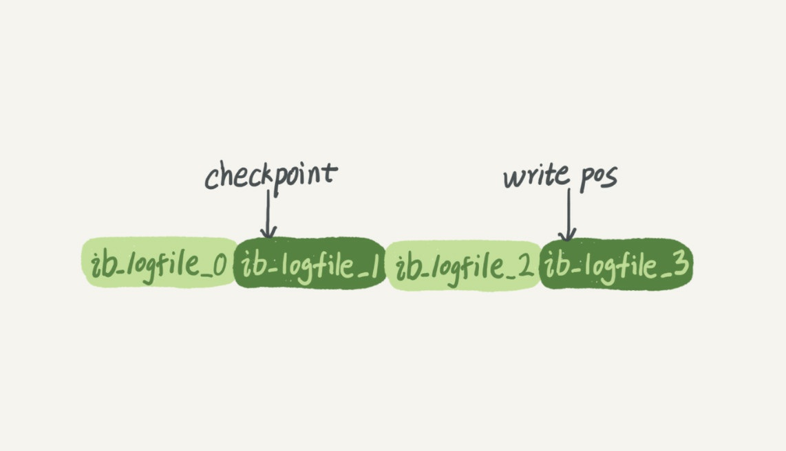

# 一条 SQL 更新语句是如何执行的

我们还是从一个表的一条更新语句说起，下面是这个表的创建语句，这个表有一个主键 ID 和一个
整型字段 c ：

```sql
mysql> create table T(ID int primary key, c int);
```

如果要将 ID=2 这一行的值加 1 ， SQL 语句就会这么写：

```sql
mysql> update T set c=c+1 where ID=2;
```

SQL 的更新操作也可以使用这种图的流程。


一样的流程就不多做赘述了。

1. **连接器：**建立连接。
2. **查询缓存：**如果一个表上有更新的时候，和这个表有关的查询缓存都会失效。
3. **分析器：** 分析器会通过词法分析和语法分析得知这是一条更新语句。
4. **优化器：** 决定使用 ID 这个主键索引。
5. **执行器：** 执行器负责具体执行，找到这一行，然后更新。

与查询流程不一样的是，更新流程还涉及两个重要的日志模块，它们正是我们今天要讨论的主
角： redo log （重做日志）和 binlog （归档日志）。如果接触 MySQL ，那这两个词肯定是绕不过
的，， redo log 和 binlog 在设计上有很多有意思的地方，这些设计思路也可以用到你自己的程序里。

## redo log 日志模块 

由于每次更新操作都写进磁盘，然后磁盘要找到对应的那条记录，然后再更新，整个过程IO成本、查找成本都很高，因此不如先把这些更新操作先记录下来，等到空闲的时候再集中去更新磁盘上的记录，这样的做法更高效。

就是 MySQL 里经常说到的 WAL 技术， WAL 的全称是 Write-Ahead Logging ，它的关键点就是先写日志，再写磁盘。

具体来说，当有一条记录需要更新的时候， InnoDB 引擎就会先把记录写到 redo log 里面，并更新内存，这个时候更新就算完成了。同时， InnoDB 引擎会在适当的时候，将这个操作记录更新到磁盘里面，而这个更新往往是在系统比较空闲的时候做。

redo log 有固定的大小，当更新频繁的时候，redo log很容易被写满，这时候就需要将redo log 中的一部分记录更新到磁盘上，以留出足够的空间来记录新的更新操作。

redo log 就像一个循环链表。

write pos 是当前记录的位置，一边写一边后移，写到第 3 号文件末尾后就回到 0 号文件开头。

checkpoint 是当前要擦除的位置，也是往后推移并且循环的，擦除记录前要把记录更新到数据文件。

write pos 和 checkpoint 之间的是还空着的部分，可以用来记录新的操作。

如果 write pos追上 checkpoint ，表示 redo log 满了，这时候不能再执行新的更新，得停下来先擦掉一些记录，把checkpoint 推进一下。



有了 redo log ， InnoDB 就可以保证即使数据库发生异常重启，之前提交的记录都不会丢失，这个能力称为 crash-safe 。

## binlog 日志模块

前面我们讲过， MySQL 整体来看，其实就有两块：一块是 Server 层，它主要做的是 MySQL 功能
层面的事情；还有一块是引擎层，负责存储相关的具体事宜。上面我们聊到的粉板 redo log 是
InnoDB 引擎特有的日志，而 Server 层也有自己的日志，称为 binlog （归档日志）。

为什么会有两份日志呢？

因为最开始 MySQL 里并没有 InnoDB 引擎。 MySQL 自带的引擎是 MyISAM ，但是 MyISAM 没有
crash-safe 的能力， binlog 日志只能用于归档。而 InnoDB 是另一个公司以插件形式引入 MySQL
的，既然只依靠 binlog 是没有 crash-safe 能力的，所以 InnoDB 使用另外一套日志系统 —— 也就是
redo log 来实现 crash-safe 能力。

## 这两种日志有以下三点不同

1. redo log 是 InnoDB 引擎特有的； binlog 是 MySQL 的 Server 层实现的，所有引擎都可以使用。
2. redo log 是物理日志，记录的是 “ 在某个数据页上做了什么修改 ” ，就像是抄作业只抄了答案，至于是怎么做到的就不知道了；binlog 是逻辑日志，记录的是这个语句的原始逻辑，比如 “ 给 ID=2 这一行的 c 字段加 1 ” ，这个就好像是抄作业连解题过程一起抄了，可以直接计算过程来得到正确的答案。
3. redo log 是循环写的，空间固定会用完； binlog 是可以追加写入的。 “ 追加写 ” 是指 binlog 文件
    写到一定大小后会切换到下一个，并不会覆盖以前的日志。

## 执行 Update 语句时的内部流程

有了对这两个日志的概念性理解，我们再来看执行器和 InnoDB 引擎在执行这个简单的 update 语
句时的内部流程。
1. 执行器先找引擎取 ID=2 这一行。 ID 是主键，引擎直接用树搜索找到这一行。如果 ID=2 这一
行所在的数据页本来就在内存中，就直接返回给执行器；否则，需要先从磁盘读入内存，然
后再返回。
2. 执行器拿到引擎给的行数据，把这个值加上 1 ，比如原来是 N ，现在就是 N+1 ，得到新的一行
数据，再调用引擎接口写入这行新数据。
3. 引擎将这行新数据更新到内存中，同时将这个更新操作记录到 redo log 里面，此时 redo log 处
于 prepare 状态。然后告知执行器执行完成了，随时可以提交事务。
4. 执行器生成这个操作的 binlog ，并把 binlog 写入磁盘。
5. 执行器调用引擎的提交事务接口，引擎把刚刚写入的 redo log 改成提交（ commit ）状态，更
新完成。

这里我给出这个 update 语句的执行流程图，图中浅色框表示是在 InnoDB 内部执行的，深色框表示是在执行器中执行的。


注意最后的三步，将 redo log 的写入拆成了两个步骤： prepare 和 commit ，这就是 " 两阶段提交 " 。