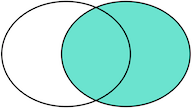

## 关联查询

初始化数据

```sql
CREATE TABLE `age` (
  `id` int DEFAULT NULL,
  `age` int DEFAULT NULL,
  KEY `i_age` (`age`) USING BTREE
) ENGINE=InnoDB DEFAULT CHARSET=utf8mb4 COLLATE=utf8mb4_0900_ai_ci

INSERT INTO `test`.`age` (`id`, `age`) VALUES (1, 11);
INSERT INTO `test`.`age` (`id`, `age`) VALUES (2, 12);
INSERT INTO `test`.`age` (`id`, `age`) VALUES (3, 13);
INSERT INTO `test`.`age` (`id`, `age`) VALUES (5, 15);

CREATE TABLE `users` (
  `id` int DEFAULT NULL,
  `name` varchar(255) DEFAULT NULL,
  KEY `i_name` (`name`)
) ENGINE=InnoDB DEFAULT CHARSET=utf8mb4 COLLATE=utf8mb4_0900_ai_ci

INSERT INTO `test`.`users` (`id`, `name`) VALUES (1, 'lwj');
INSERT INTO `test`.`users` (`id`, `name`) VALUES (2, 'lws');
INSERT INTO `test`.`users` (`id`, `name`) VALUES (3, 'wb');
INSERT INTO `test`.`users` (`id`, `name`) VALUES (4, 'bob');
```


```sql
SELECT * from age;
SELECT * from users;


SELECT * from users u INNER JOIN age a on u.id=a.id;
SELECT * from users u ,age a where u.id=a.id;

SELECT * from users u LEFT JOIN age a on u.id=a.id;
SELECT * from users u LEFT OUTER JOIN age a on u.id=a.id;


-- error mysql 不支持
SELECT * from users u FULL JOIN age a on u.id=a.id; 

SELECT * from users u LEFT JOIN age a on u.id=a.id
UNION 
SELECT * from users u RIGHT JOIN age a on u.id=a.id;
```


**inner join(内连接）、left join(左连接)、right join（右连接）、full join（全连接)区别**

```sql
SELECT ... FROM tableA ??? JOIN tableB ON tableA.column1 = tableB.column2;
```

我们把tableA看作左表，把tableB看成右表。

那么INNER JOIN是选出两张表都存在的记录：


LEFT OUTER JOIN是选出左表存在的记录：



RIGHT OUTER JOIN是选出右表存在的记录：


FULL OUTER JOIN则是选出左右表都存在的记录：

顾名思义，把两张表的字段都查出来，没有对应的值就显示null，但是注意：mysql是没有全外连接的(mysql中没有full outer join关键字)，想要达到全外连接的效果，可以使用union关键字连接左外连接和右外连接


**在 inner join 的情况下，结果是一样的。**

**在 left join / right join 情况下 ，on 的过滤只对右边表有效 ，where 则会对 join 之后的所有记录再进行过滤。**

join过程可以这样理解：首先两个表做一个笛卡尔积，on后面的条件是对这个笛卡尔积做一个过滤形成一张临时表，如果没有where就直接返回结果，如果有where就对上一步的临时表再进行过滤。下面看实验：

拿 left join 来说，由于left join 的特性，一定会将 left join 左边表的所有记录显示出来，而left join 右边表的记录可以通过  on 来过滤（左边表的记录使用on过滤没有效果）。

下面结合sql和执行结果看一下：

- 没有使用 on 对右边表进行过滤， 注意看sql中【】的内容。

```mysql
select u.name ,u.uid ,r.rtid ,r.sleep_avg_heartrate heartrate ,r.sleep_avg_breatherate breatherate,r.oxygen,r.szy,r.ssy
from  user u left join report r on 【u.uid =r.uid 】group by u.uid;
```

.jpg)

- 使用 on 对右边表进行过滤，可以看到相对应的字段的值都变成了null。

```mysql
select u.name ,u.uid ,r.rtid ,r.sleep_avg_heartrate heartrate ,r.sleep_avg_breatherate breatherate,r.oxygen,r.szy,r.ssy
from  user u left join report r on 【u.uid =r.uid and r.uid!=4 】group by u.uid;
```

.jpg)

- 在使用 on 对右边表进行过滤的基础上，同时也对左边表进行过滤，发现并没有什么效果。

```sql
select u.name ,u.uid ,r.rtid ,r.sleep_avg_heartrate heartrate ,r.sleep_avg_breatherate breatherate,r.oxygen,r.szy,r.ssy
    from  user u left join report r on 【u.uid =r.uid and r.uid!=4 and u.uid!=4 】group by u.uid;
```

.jpg)

- 在前边使用left join 的基础上，再加上 where 进行过滤。

```sql
select u.name ,u.uid ,r.rtid ,r.sleep_avg_heartrate heartrate ,r.sleep_avg_breatherate breatherate,r.oxygen,r.szy,r.ssy
    from  user u left join report r on 【u.uid =r.uid  and r.uid!=4 where u.uid=4 】group by u.uid;
```

.jpg)


### Left join  多个表

在 SQL 中，可以通过 `LEFT JOIN` 来连接多个表。假设有三个表 A、B、C，它们之间的关系如下：

```
复制代码A (a_id, a_name)
B (b_id, b_name, a_id)
C (c_id, c_name, b_id)
```

其中 B 表和 C 表都有一个外键与 A 表关联，现在要查询 A 表中的所有记录以及与其关联的 B 表和 C 表的数据，可以使用如下语句：

```
sql复制代码SELECT A.*, B.*, C.*
FROM A
LEFT JOIN B ON A.a_id = B.a_id
LEFT JOIN C ON B.b_id = C.b_id;
```

这条 SQL 语句使用了两次 `LEFT JOIN`，首先将 A 表和 B 表连接起来，然后再将 B 表和 C 表连接起来。这样就可以得到 A 表、B 表和 C 表的所有记录，其中 A 表的记录会在 B 表和 C 表之前显示出来。

需要注意的是，如果在 `LEFT JOIN` 中涉及到了多个表，那么连接的顺序会影响查询结果。在上述例子中，先将 A 表和 B 表连接再将 B 表和 C 表连接会得到不同于先将 B 表和 C 表连接再将 A 表和 B 表连接的结果。因此，在编写含有多个表的 SQL 查询语句时，需要仔细考虑连接的顺序。

## 从主表复制数据到副表

```mysql
insert into 
stock_change_record_copy1(order_id,sale_item_sku_id,quantity,ext,gmt_create,gmt_modified)
select 
order_id,sale_item_sku_id,quantity,ext,gmt_create,gmt_modified 
from stock_change_record
```


## SQL编写优化思路

### 0、SQL执行顺序


**sql语句的执行顺序：**

```
FROM
<left_table>

ON
<join_condition>

<join_type>
 JOIN
<right_table>

WHERE
<where_condition>

GROUP BY
<group_by_list>

HAVING
<having_condition>

SELECT

DISTINCT
<select_list>

ORDER BY
<order_by_condition>

LIMIT
<limit_number>
```

### 1、SearchAfter模式的LIMIT

分页查询是最常用的场景之一，但也通常也是最容易出问题的地方。比如对于下面简单的语句，一般 DBA 想到的办法是在 type, name, create_time 字段上加组合索引。这样条件排序都能有效的利用到索引，性能迅速提升。

```
SELECT *
FROM   operation
WHERE  type = 'SQLStats'
       AND name = 'SlowLog'
ORDER  BY create_time
LIMIT  1000, 10;
```

好吧，可能90%以上的 DBA 解决该问题就到此为止。但当 LIMIT 子句变成 “LIMIT 1000000,10” 时，程序员仍然会抱怨：我只取10条记录为什么还是慢？

要知道数据库也并不知道第1000000条记录从什么地方开始，即使有索引也需要从头计算一次。出现这种性能问题，多数情形下是程序员偷懒了。

在前端数据浏览翻页，或者大数据分批导出等场景下，是可以将上一页的最大值当成参数作为查询条件的。SQL 重新设计如下：

```
SELECT   *
FROM     operation
WHERE    type = 'SQLStats'
AND      name = 'SlowLog'
AND      create_time > '2017-03-16 14:00:00'
ORDER BY create_time limit 10;
```

在新设计下查询时间基本固定，不会随着数据量的增长而发生变化。


### 2、查询隐式转换导致索引失效

SQL语句中查询变量和字段定义类型不匹配，如字符串类型的字段，接受了一个数值类型的值。会导致隐式的函数转换，从而使索引失效。

```sql
# name 字段是字符串
EXPLAIN SELECT * from name where name ='4';
# 1	SIMPLE	name		ref	i_name	i_name	1023	const	1	100.00	 走索引

EXPLAIN SELECT * from name where name =4;
# 1	SIMPLE	name		ALL	i_name				4	25.00	Using where			未走索引

EXPLAIN SELECT * from name where name =CAST(4 as CHAR);
# 1	SIMPLE	name		ref	i_name	i_name	1023	const	1	100.00	 走索引
```


### 4、混合排序

MySQL 不能利用索引进行混合排序。但在某些场景，还是有机会使用特殊方法提升性能的。

```
SELECT *
FROM   my_order o
       INNER JOIN my_appraise a ON a.orderid = o.id
ORDER  BY a.is_reply ASC,
          a.appraise_time DESC
LIMIT  0, 20
```

执行计划显示为全表扫描：

```
+----+-------------+-------+--------+-------------+---------+---------+---------------+---------+-+
| id | select_type | table | type   | possible_keys     | key     | key_len | ref      | rows    | Extra
+----+-------------+-------+--------+-------------+---------+---------+---------------+---------+-+
|  1 | SIMPLE      | a     | ALL    | idx_orderid | NULL    | NULL    | NULL    | 1967647 | Using filesort |
|  1 | SIMPLE      | o     | eq_ref | PRIMARY     | PRIMARY | 122     | a.orderid |       1 | NULL           |
+----+-------------+-------+--------+---------+---------+---------+-----------------+---------+-+
```

由于 is_reply 只有0和1两种状态，我们按照下面的方法重写后，执行时间从1.58秒降低到2毫秒。

```
SELECT *
FROM   ((SELECT *
         FROM   my_order o
                INNER JOIN my_appraise a
                        ON a.orderid = o.id
                           AND is_reply = 0
         ORDER  BY appraise_time DESC
         LIMIT  0, 20)
        UNION ALL
        (SELECT *
         FROM   my_order o
                INNER JOIN my_appraise a
                        ON a.orderid = o.id
                           AND is_reply = 1
         ORDER  BY appraise_time DESC
         LIMIT  0, 20)) t
ORDER  BY  is_reply ASC,
          appraisetime DESC
LIMIT  20;
```

### 5、EXISTS语句

MySQL 对待 EXISTS 子句时，仍然采用嵌套子查询的执行方式。如下面的 SQL 语句：

```
SELECT *
FROM   my_neighbor n
       LEFT JOIN my_neighbor_apply sra
              ON n.id = sra.neighbor_id
                 AND sra.user_id = 'xxx'
WHERE  n.topic_status < 4
       AND EXISTS(SELECT 1
                  FROM   message_info m
                  WHERE  n.id = m.neighbor_id
                         AND m.inuser = 'xxx')
       AND n.topic_type <> 5
```

执行计划为：

```
+----+--------------------+-------+------+-----+------------------------------------------+---------+-------+---------+ -----+
| id | select_type        | table | type | possible_keys     | key   | key_len | ref   | rows    | Extra   |
+----+--------------------+-------+------+ -----+------------------------------------------+---------+-------+---------+ -----+
|  1 | PRIMARY            | n     | ALL  |  | NULL     | NULL    | NULL  | 1086041 | Using where                   |
|  1 | PRIMARY            | sra   | ref  |  | idx_user_id | 123     | const |       1 | Using where          |
|  2 | DEPENDENT SUBQUERY | m     | ref  |  | idx_message_info   | 122     | const |       1 | Using index condition; Using where |
+----+--------------------+-------+------+ -----+------------------------------------------+---------+-------+---------+ -----+
```

去掉 exists 更改为 join，能够避免嵌套子查询，将执行时间从1.93秒降低为1毫秒。

```
SELECT *
FROM   my_neighbor n
       INNER JOIN message_info m
               ON n.id = m.neighbor_id
                  AND m.inuser = 'xxx'
       LEFT JOIN my_neighbor_apply sra
              ON n.id = sra.neighbor_id
                 AND sra.user_id = 'xxx'
WHERE  n.topic_status < 4
       AND n.topic_type <> 5
```

新的执行计划：

```
+----+-------------+-------+--------+ -----+------------------------------------------+---------+ -----+------+ -----+
| id | select_type | table | type   | possible_keys     | key       | key_len | ref   | rows | Extra                 |
+----+-------------+-------+--------+ -----+------------------------------------------+---------+ -----+------+ -----+
|  1 | SIMPLE      | m     | ref    | | idx_message_info   | 122     | const    |    1 | Using index condition |
|  1 | SIMPLE      | n     | eq_ref | | PRIMARY   | 122     | ighbor_id |    1 | Using where      |
|  1 | SIMPLE      | sra   | ref    | | idx_user_id | 123     | const     |    1 | Using where           |
+----+-------------+-------+--------+ -----+------------------------------------------+---------+ -----+------+ -----+
```

### 6、条件下推

外部查询条件不能够下推到复杂的视图或子查询的情况有：

1、聚合子查询； 2、含有 LIMIT 的子查询； 3、UNION 或 UNION ALL 子查询； 4、输出字段中的子查询；

如下面的语句，从执行计划可以看出其条件作用于聚合子查询之后：

```
SELECT *
FROM   (SELECT target,
               Count(*)
        FROM   operation
        GROUP  BY target) t
WHERE  target = 'rm-xxxx'
+----+-------------+------------+-------+---------------+-------------+---------+-------+------+-------------+
| id | select_type | table      | type  | possible_keys | key         | key_len | ref   | rows | Extra       |
+----+-------------+------------+-------+---------------+-------------+---------+-------+------+-------------+
|  1 | PRIMARY     | <derived2> | ref   | <auto_key0>   | <auto_key0> | 514     | const |    2 | Using where |
|  2 | DERIVED     | operation  | index | idx_4         | idx_4       | 519     | NULL  |   20 | Using index |
+----+-------------+------------+-------+---------------+-------------+---------+-------+------+-------------+
```

确定从语义上查询条件可以直接下推后，重写如下：

```
SELECT target,
       Count(*)
FROM   operation
WHERE  target = 'rm-xxxx'
GROUP  BY target
```

执行计划变为：

```
+----+-------------+-----------+------+---------------+-------+---------+-------+------+--------------------+
| id | select_type | table | type | possible_keys | key | key_len | ref | rows | Extra |
+----+-------------+-----------+------+---------------+-------+---------+-------+------+--------------------+
| 1 | SIMPLE | operation | ref | idx_4 | idx_4 | 514 | const | 1 | Using where; Using index |
+----+-------------+-----------+------+---------------+-------+---------+-------+------+--------------------+
```

关于 MySQL 外部条件不能下推的详细解释说明请参考以前文章：MySQL · 性能优化 · 条件下推到物化表 http://mysql.taobao.org/monthly/2016/07/08

### 7、提前缩小范围

先上初始 SQL 语句：

```
SELECT *
FROM   my_order o
       LEFT JOIN my_userinfo u
              ON o.uid = u.uid
       LEFT JOIN my_productinfo p
              ON o.pid = p.pid
WHERE  ( o.display = 0 )
       AND ( o.ostaus = 1 )
ORDER  BY o.selltime DESC
LIMIT  0, 15
```

该SQL语句原意是：先做一系列的左连接，然后排序取前15条记录。从执行计划也可以看出，最后一步估算排序记录数为90万，时间消耗为12秒。

```
+----+-------------+-------+--------+---------------+---------+---------+-----------------+--------+----------------------------------------------------+
| id | select_type | table | type   | possible_keys | key     | key_len | ref             | rows   | Extra                                              |
+----+-------------+-------+--------+---------------+---------+---------+-----------------+--------+----------------------------------------------------+
|  1 | SIMPLE      | o     | ALL    | NULL          | NULL    | NULL    | NULL            | 909119 | Using where; Using temporary; Using filesort       |
|  1 | SIMPLE      | u     | eq_ref | PRIMARY       | PRIMARY | 4       | o.uid |      1 | NULL                                               |
|  1 | SIMPLE      | p     | ALL    | PRIMARY       | NULL    | NULL    | NULL            |      6 | Using where; Using join buffer (Block Nested Loop) |
+----+-------------+-------+--------+---------------+---------+---------+-----------------+--------+----------------------------------------------------+
```

由于最后 WHERE 条件以及排序均针对最左主表，因此可以先对 my_order 排序提前缩小数据量再做左连接。SQL 重写后如下，执行时间缩小为1毫秒左右。

```
SELECT *
FROM (
SELECT *
FROM   my_order o
WHERE  ( o.display = 0 )
       AND ( o.ostaus = 1 )
ORDER  BY o.selltime DESC
LIMIT  0, 15
) o
     LEFT JOIN my_userinfo u
              ON o.uid = u.uid
     LEFT JOIN my_productinfo p
              ON o.pid = p.pid
ORDER BY  o.selltime DESC
limit 0, 15
```

再检查执行计划：子查询物化后（select_type=DERIVED)参与 JOIN。虽然估算行扫描仍然为90万，但是利用了索引以及 LIMIT 子句后，实际执行时间变得很小。

```
+----+-------------+------------+--------+---------------+---------+---------+-------+--------+----------------------------------------------------+
| id | select_type | table      | type   | possible_keys | key     | key_len | ref   | rows   | Extra                                              |
+----+-------------+------------+--------+---------------+---------+---------+-------+--------+----------------------------------------------------+
|  1 | PRIMARY     | <derived2> | ALL    | NULL          | NULL    | NULL    | NULL  |     15 | Using temporary; Using filesort                    |
|  1 | PRIMARY     | u          | eq_ref | PRIMARY       | PRIMARY | 4       | o.uid |      1 | NULL                                               |
|  1 | PRIMARY     | p          | ALL    | PRIMARY       | NULL    | NULL    | NULL  |      6 | Using where; Using join buffer (Block Nested Loop) |
|  2 | DERIVED     | o          | index  | NULL          | idx_1   | 5       | NULL  | 909112 | Using where                                        |
+----+-------------+------------+--------+---------------+---------+---------+-------+--------+----------------------------------------------------+
```

### 8、中间结果集下推

再来看下面这个已经初步优化过的例子(左连接中的主表优先作用查询条件)：

```
SELECT    a.*,
          c.allocated
FROM      (
              SELECT   resourceid
              FROM     my_distribute d
                   WHERE    isdelete = 0
                   AND      cusmanagercode = '1234567'
                   ORDER BY salecode limit 20) a
LEFT JOIN
          (
              SELECT   resourcesid， sum(ifnull(allocation, 0) * 12345) allocated
              FROM     my_resources
                   GROUP BY resourcesid) c
ON        a.resourceid = c.resourcesid
```

那么该语句还存在其它问题吗？不难看出子查询 c 是全表聚合查询，在表数量特别大的情况下会导致整个语句的性能下降。

其实对于子查询 c，左连接最后结果集只关心能和主表 resourceid 能匹配的数据。因此我们可以重写语句如下，执行时间从原来的2秒下降到2毫秒。

```
SELECT    a.*,
          c.allocated
FROM      (
                   SELECT   resourceid
                   FROM     my_distribute d
                   WHERE    isdelete = 0
                   AND      cusmanagercode = '1234567'
                   ORDER BY salecode limit 20) a
LEFT JOIN
          (
                   SELECT   resourcesid， sum(ifnull(allocation, 0) * 12345) allocated
                   FROM     my_resources r,
                            (
                                     SELECT   resourceid
                                     FROM     my_distribute d
                                     WHERE    isdelete = 0
                                     AND      cusmanagercode = '1234567'
                                     ORDER BY salecode limit 20) a
                   WHERE    r.resourcesid = a.resourcesid
                   GROUP BY resourcesid) c
ON        a.resourceid = c.resourcesid
```

但是子查询 a 在我们的SQL语句中出现了多次。这种写法不仅存在额外的开销，还使得整个语句显的繁杂。使用 WITH 语句再次重写：

```
WITH a AS
(
         SELECT   resourceid
         FROM     my_distribute d
         WHERE    isdelete = 0
         AND      cusmanagercode = '1234567'
         ORDER BY salecode limit 20)
SELECT    a.*,
          c.allocated
FROM      a
LEFT JOIN
          (
                   SELECT   resourcesid， sum(ifnull(allocation, 0) * 12345) allocated
                   FROM     my_resources r,
                            a
                   WHERE    r.resourcesid = a.resourcesid
                   GROUP BY resourcesid) c
ON        a.resourceid = c.resourcesid
```

### 小结

数据库编译器产生执行计划，决定着SQL的实际执行方式。但是编译器只是尽力服务，所有数据库的编译器都不是尽善尽美的。

上述提到的多数场景，在其它数据库中也存在性能问题。了解数据库编译器的特性，才能避规其短处，写出高性能的SQL语句。

程序员在设计数据模型以及编写SQL语句时，要把算法的思想或意识带进来。

编写复杂SQL语句要养成使用 WITH 语句的习惯。简洁且思路清晰的SQL语句也能减小数据库的负担 。