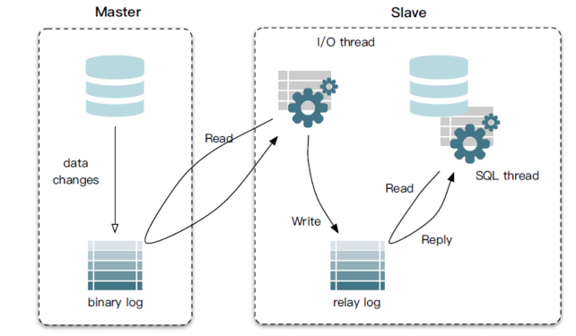
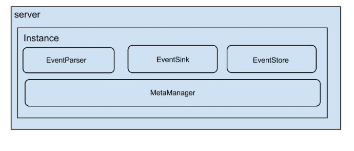
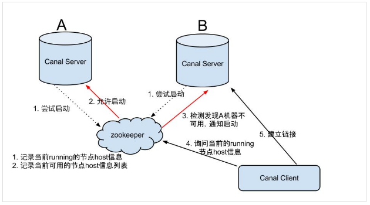
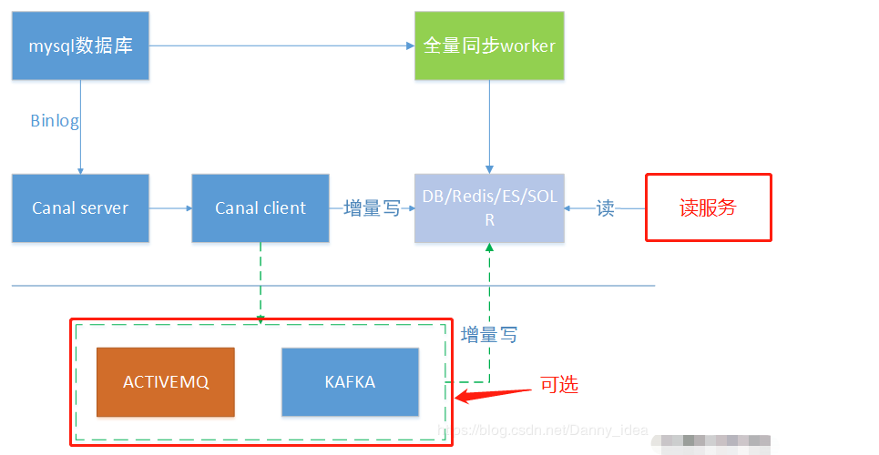
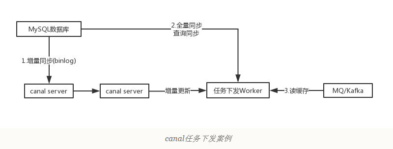
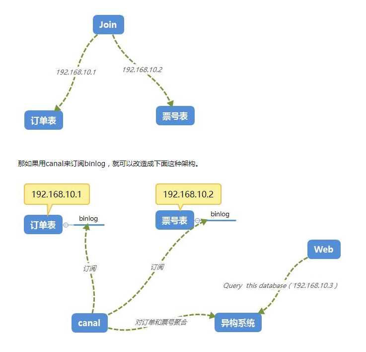

# Canal简介

`Canal`是阿里开源的一款基于Mysql数据库binlog的增量订阅和消费组件，通过它可以订阅数据库的binlog日志，然后进行一些数据消费，如数据镜像、数据异构、数据索引、缓存更新等。相对于消息队列，通过这种机制可以实现数据的有序化和一致性。

github地址：https://github.com/alibaba/canal

完整wiki地址：https://github.com/alibaba/canal/wiki

 

# Canal工作原理

原理相对比较简单：

1. canal模拟mysql slave与mysql master的交互协议，伪装自己是一个mysql slave，向mysql master发送dump协议；
2. mysql master收到mysql slave（canal）发送的dump请求，开始**推送**binlog增量日志给slave(也就是canal)；
3. mysql slave（canal伪装的）收到binlog增量日志后,就可以对这部分日志进行解析，获取主库的结构及数据变更；

 

# Mysql主从同步原理

canal工作原理其实也是基于mysql主从同步原理的，所以理解mysql主从同步原理是第一步

　　 同步原理：

1. Master主库，启动Binlog机制，将变更数据写入Binlog文件；
2. Slave（I/O thread），从Master**主库拉取**binlon数据，将它拷贝到Slave的中继日志(relay log)中；
3. Slave（SQL thread），回放Binlog，更新从库数据；

　　 启用Binlog注意以下几点：

1. Master主库一般会有多台Slave订阅，且Master主库要支持业务系统实时变更操作，服务器资源会有瓶颈；
2.  需要同步的数据表一定要有主键；

 

# Canal架构

说明：
server代表一个canal运行实例，对应于一个jvm
instance对应于一个数据队列

instance模块：
eventParser (数据源接入，模拟slave协议和master进行交互，协议解析)
eventSink (Parser和Store链接器，进行数据过滤，加工，分发的工作)
eventStore (数据存储)
metaManager (增量订阅&消费信息管理器)

 

# Canal-HA机制

canal是支持HA的，其实现机制也是依赖zookeeper来实现的，用到的特性有watcher和EPHEMERAL节点(和session生命周期绑定)，与HDFS的HA类似。

canal的ha分为两部分，*canal server和canal client分别有对应的ha实现*

- canal server: 为了减少对mysql dump的请求，*不同*server上的instance(*不同server上的相同instance*)要求同一时间只能有一个处于running，其他的处于standby状态(standby是instance的状态)。
- *canal client*: 为了保证有序性，一份instance同一时间只能由一个canal client进行get/ack/rollback操作，否则客户端接收无法保证有序。

server ha的架构图如下：

大致步骤：

1. canal server要启动某个*canal instance*时都先向zookeeper_进行一次尝试启动判断_(实现：创建EPHEMERAL节点，谁创建成功就允许谁启动)
2. 创建zookeeper节点成功后，对应的canal server就启动对应的canal instance，*没有创建成功的canal instance就会处于standby状态*。
3. 一旦zookeeper发现canal server A创建的*instance节点*消失后，立即通知其他的canal server再次进行步骤1的操作，重新选出一个canal server启动instance。
4. canal client每次进行connect时，会首先向zookeeper询问当前是谁启动了canal instance，然后和其建立链接，一旦链接不可用，会重新尝试connect。

**Canal Client的方式和canal server方式类似，也是利用zookeeper的抢占EPHEMERAL节点的方式进行控制.**

 

# Canal应用场景

　　1**、同步缓存redis/全文搜索ES**

　　canal一个常见应用场景是同步缓存/全文搜索，当数据库变更后通过binlog进行缓存/ES的增量更新。当缓存/ES更新出现问题时，应该回退binlog到过去某个位置进行重新同步，并提供全量刷新缓存/ES的方法，如下图所示。

 

　　**2、下发任务**

　　另一种常见应用场景是下发任务，当数据变更时需要通知其他依赖系统。其原理是任务系统监听数据库变更，然后将变更的数据写入MQ/kafka进行任务下发，比如商品数据变更后需要通知商品详情页、列表页、搜索页等先关系统。这种方式可以保证数据下发的精确性，通过MQ发送消息通知变更缓存是无法做到这一点的，而且业务系统中不会散落着各种下发MQ的代码，从而实现了下发归集，如下图所示。

 

　　**3、数据异构**

　　在大型网站架构中，DB都会采用分库分表来解决容量和性能问题，但分库分表之后带来的新问题。比如不同维度的查询或者聚合查询，此时就会非常棘手。一般我们会通过数据异构机制来解决此问题。

所谓的数据异构，那就是将需要join查询的多表按照某一个维度又聚合在一个DB中。让你去查询。canal就是实现数据异构的手段之一。

 

 

 