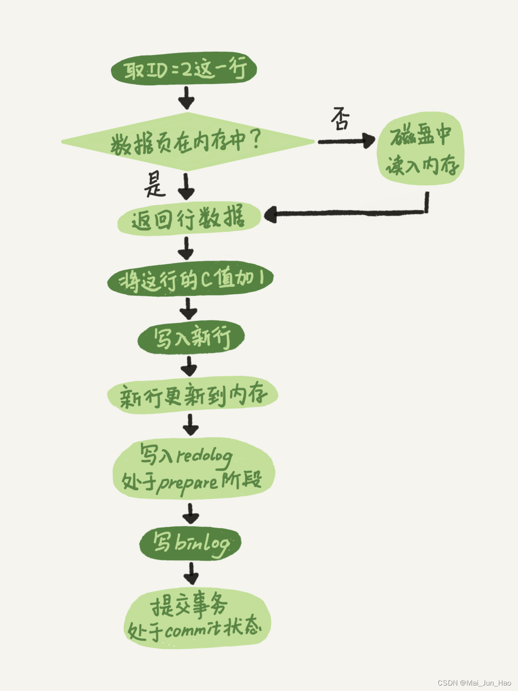
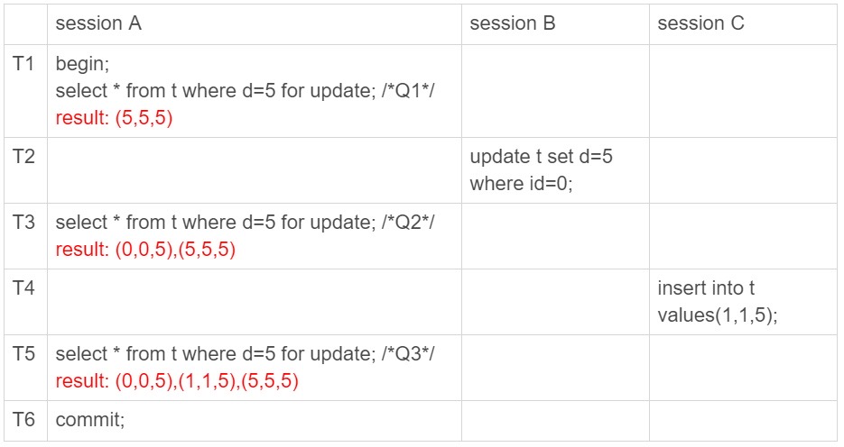
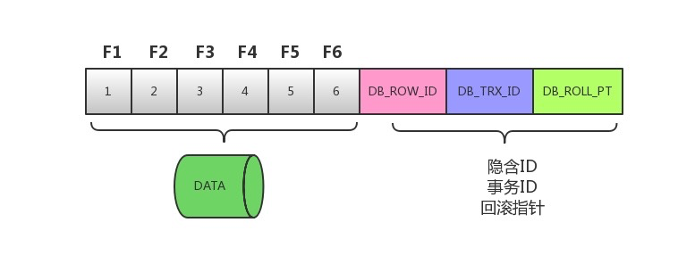
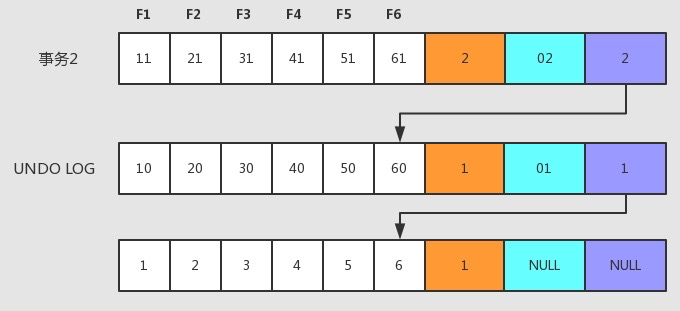

# MySQL常用命令

```mysql
# 查看版本
select version();
# 备份工具
mysqldump -uroot -proot  --single-transaction database
# 表级锁
lock tables ... read/write
unlock tables
# 开启事务
start transaction
# 开启事务，执行快照读
start transaction with consistent snapshot
# 查看当前会话的隔离级别
show VARIABLES like 'TRANSACTION_ISOLATION';
# 查看事务隔离级别
select @@tx_isolation;
# 设置事务隔离级别
set tx_isolation='READ-UNCOMMITTED';
set tx_isolation='READ-COMMITTED'; 
set tx_isolation='REPEATABLE-READ';
set tx_isolation='SERIALIZABLE';

# 查看锁的概况
select * from information_schema.innodb_locks;
# InnoDB整体状态，其中包括锁的情况
show engine innodb status;

# 查看事务状态
SELECT * FROM information_schema.INNODB_TRX;
# 查看行锁信息（8.0）
select * from performance_schema.data_lock_waits;
select * from performance_schema.data_locks;
show engine innodb status\G
# 查看正在锁的事务(5.x)
SELECT * FROM INFORMATION_SCHEMA.INNODB_LOCKS;
# 查看等待锁的事务(5.x)
SELECT * FROM INFORMATION_SCHEMA.INNODB_LOCK_WAITS;

# 查询表中索引信息
show INDEX from t
# 重新统计索引信息 
analyze table t
# 强制走指定索引
select * from t force index(a) where a between 10000 and 20000;

# 查看数据库支持的最大连接数
SHOW VARIABLES LIKE 'max_connections'
```

# 一条SQL查询语句是如何执行的？


大的来说，MySQL可以分为 Server层和 存储引擎层。

## Server 层

### 连接器

负责与客户端建立连接、获取权限、维持和管理连接。

使用下面命令，就可以与指定ip：prot 进行数据库连接了，在进行TCP握手之后，连接器就要认证你的身份，也就是你的用户名和密码是否正确，然后才会去权限表里验证你拥有的权限，之后这个连接里的全县判断逻辑，都依赖于此时读到的权限，因此当一个用户的权限被修改后，重新连接才能生效。

```sql
mysql -h$ip -P$port -u$user -p
```

连接有长连接和短连接之分，长连接是指连接成功后，如果客户端持续有请求，则一直使用同一个连接，如果连接后长时间没有操作，连接器也会将它断开，这个时间是由参数 wait_timeout 控制的，默认为 8 小时；短连接则是每次执行完很少的几次查询就断开连接，下次查询再重新建一个。

建立连接的过程比较复杂，因此在使用中尽量减少建立连接的动作，也就是尽量使用长连接。

全部使用长连接后，MySQL使用时内存涨的特别快，原因在于sql在执行时临时使用的内存（比如查出的数据）是管理在 **连接对象** 里面的，这些资源会在连接断开的时候释放，所以长时间累计下来，可能会导致内存占用过大，被系统强行杀掉（OOM），从现象上看就是MySQL异常重启了。

怎么解决这个问题呢？你可以考虑以下两种方案。

1. 定期断开长连接。使用一段时间，或者程序里面判断执行过一个占用内存的大查询后，断开
   连接，之后要查询再重连。
2. 如果你用的是 MySQL 5.7 或更新版本，可以在每次执行一个比较大的操作后，通过执行
   mysql_reset_connection 来重新初始化连接资源。这个过程不需要重连和重新做权限验证，
   但是会将连接恢复到刚刚创建完时的状态。

### 查询缓存

连接建立后，就可以执行sql了，执行逻辑就会来到第二步：查询缓存。

MySQL 拿到一个查询请求后，会首先到查询缓存中去看看，之前是否执行过这条sql，执行过的话，会在查询缓存中保留，这样就可以直接通过 key（ 查询语句），获取到 value （查询结果）。

如果语句没有在缓存中，才会去执行后面的步骤，执行后再将结果进行缓存。如果查询命中的话，这个效率会非常高，如果查询缓存失效的非常频繁，只要有对一个表的更新，这个表上的所有查询缓存都会被清空，因此查询缓存是一个双刃剑，对与更新频繁的数据表，不建议使用，对于一些静态表、配置表，这些表的查询才适合使用查询缓存。

 MySQL 也提供了这种 “ 按需使用 ” 的方式。你可以将参数 query_cache_type 设置成DEMAND ，这样对于默认的 SQL 语句都不使用查询缓存。而对于你确定要使用查询缓存的语句，可以用 SQL_CACHE 显式指定，像下面这个语句一样：

```sql
mysql> select SQL_CACHE * from T where ID=10 
```

需要注意的是， MySQL 8.0 版本直接将查询缓存的整块功能删掉了，也就是说 8.0 开始彻底没有这个功能了。

### 分析器

如果没有命中查询缓存，就要开始真正执行语句了。首先， MySQL 需要知道你要做什么，因此需要对 SQL 语句做解析。

分析器先会做 “ 词法分析 ” 。你输入的是由多个字符串和空格组成的一条 SQL 语句， MySQL 需要识别出里面的字符串分别是什么，代表什么。

MySQL 从你输入的 "select" 这个关键字识别出来，这是一个查询语句。它也要把字符串 “T” 识别成 “ 表名 T” ，把字符串 “ID” 识别成 “ 列 ID” 。

做完了这些识别以后，就要做 “ 语法分析 ” 。根据词法分析的结果，语法分析器会根据语法规则，判断你输入的这个 SQL 语句是否满足 MySQL 语法。

如果你的语句不对，就会收到 “You have an error in your SQL syntax” 的错误提醒，比如下面这个语句 select 少打了开头的字母 “s” 。

一般语法错误会提示第一个出现错误的位置，所以你要关注的是紧接 “use near” 的内容。

### 优化器

经过了分析器， MySQL 就知道你要做什么了。在开始执行之前，还要先经过优化器的处理。

优化器是在表里面有多个索引的时候，决定使用哪个索引；或者在一个语句有多表关联（ join ）的时候，决定各个表的连接顺序。比如你执行下面这样的语句，这个语句是执行两个表的 join ：

```sql
mysql> select * from t1 join t2 using(ID) where t1.c=10 and t2.d=20;
```

- 既可以先从表 t1 里面取出 c=10 的记录的 ID 值，再根据 ID 值关联到表 t2 ，再判断 t2 里面 d 的值是否等于 20 。
- 也可以先从表 t2 里面取出 d=20 的记录的 ID 值，再根据 ID 值关联到 t1 ，再判断 t1 里面 c 的值是否等于 10。

这两种执行方法的逻辑结果是一样的，但是执行的效率会有不同，而优化器的作用就是决定选择使用哪一个方案。

### 执行器

MySQL 通过分析器知道了你要做什么，通过优化器知道了该怎么做，于是就进入了执行器阶段，开始执行语句。
开始执行的时候，**要先判断一下你对这个表 T 有没有执行查询的权限**，如果没有，就会返回没有权限的错误，如下所示。

```sql
mysql> select * from T where ID=10;
ERROR 1142 (42000): SELECT command denied to user 'b'@'localhost' for table 'T'
```

如果有权限，就打开表继续执行。打开表的时候，执行器就会根据表的引擎定义，去使用这个引擎提供的接口。
比如我们这个例子中的表 T 中， ID 字段没有索引，那么执行器的执行流程是这样的：

1. 调用 InnoDB 引擎接口取这个表的第一行，判断 ID 值是不是 10 ，如果不是则跳过，如果是则
   将这行存在结果集中；
2. 调用引擎接口取 “ 下一行 ” ，重复相同的判断逻辑，直到取到这个表的最后一行。
3. 执行器将上述遍历过程中所有满足条件的行组成的记录集作为结果集返回给客户端。

至此，这个语句就执行完成了。

对于有索引的表，执行的逻辑也差不多。第一次调用的是 “ 取满足条件的第一行 ” 这个接口，之后循环取 “ 满足条件的下一行 ” 这个接口，这些接口都是引擎中已经定义好的。

你会在数据库的慢查询日志中看到一个 rows_examined 的字段，表示这个语句执行过程中扫描了多少行。这个值就是在执行器每次调用引擎获取数据行的时候累加的。

在有些场景下，执行器调用一次，在引擎内部则扫描了多行，因此 引擎扫描行数跟rows_examined 并不是完全相同的。


## Question

如果表 T 中没有字段 k ，而你执行了这个语句 select * from T where k=1, 那肯定是会报 “ 不存在这个列 ” 的错误： “Unknown column ‘k’ in ‘where clause’” 。你觉得这个错误是在我们上面提到的哪个阶段报出来的呢？

应该是在执行器阶段报出来的，执行器阶段首先判断执行SQL语句的用户，有没有对目标表执行那些SQL语句的权限。如果没有，就报权限错误。如果有，再打开表，通过存储引擎提供的接口，对表进行操作。而获知一个表是否存在某个列，是需要在打开一个表之后才能知道这个列到底是有没有。

个人理解：

数据表的字段是否存在，对这个表而言也算是它的 “隐私”，如果你没有权限访问该表的话，你自然也不应该知道它有哪些字段，因此出于对表内部结构的保密，会在验证权限后决定是否告知连接对象。

猜测也许还有一种可能就是，在分析器阶段抛出了这个错误，然后在执行器阶段验证身份时，发现了一个更大错误，也就是没有访问权限，最后将大错误（没有访问权限）抛出而忽略掉小错误（字段不存在），不过这种可能性比较小，因为分析器就是做的功能很简单，只是进行词法和语法分析，而且如果前边发生了错误，程序肯定不会往下执行了。

参考：[极客时间——MySQL 实战45讲 第一课留下问题的分析](http://ylinknest.top/index.php/2019/04/15/极客时间-mysql-实战45讲-第一课留下问题的分析/)


# 慢查询

设计联合索引的时候，会把常用的，区分度比较高的放在前面，尽量的满足最左前缀匹配规则

有目的的去查，减少回表，尽量在联合索引树里拿到需要的数据，这样就不用去主键索引里去查了。

查询的时候禁止 select *

explain 查看执行计划

数据量比较多的时候考虑分库分表

底层的数据X库page页大小这些目前还没有优化


# 一条 SQL 更新语句是如何执行的

我们还是从一个表的一条更新语句说起，下面是这个表的创建语句，这个表有一个主键 ID 和一个
整型字段 c ：

```sql
mysql> create table T(ID int primary key, c int);
```

如果要将 ID=2 这一行的值加 1 ， SQL 语句就会这么写：

```sql
mysql> update T set c=c+1 where ID=2;
```

SQL 的更新操作也可以使用这种图的流程。


一样的流程就不多做赘述了。

1. **连接器：**建立连接。
2. **查询缓存：**如果一个表上有更新的时候，和这个表有关的查询缓存都会失效。
3. **分析器：** 分析器会通过词法分析和语法分析得知这是一条更新语句。
4. **优化器：** 决定使用 ID 这个主键索引。
5. **执行器：** 执行器负责具体执行，找到这一行，然后更新。

与查询流程不一样的是，更新流程还涉及两个重要的日志模块，它们正是我们今天要讨论的主
角： redo log （重做日志）和 binlog （归档日志）。如果接触 MySQL ，那这两个词肯定是绕不过
的，， redo log 和 binlog 在设计上有很多有意思的地方，这些设计思路也可以用到你自己的程序里。

## redo log 日志模块 

由于每次更新操作都写进磁盘，然后磁盘要找到对应的那条记录，然后再更新，整个过程IO成本、查找成本都很高，因此不如先把这些更新操作先记录下来，等到空闲的时候再集中去更新磁盘上的记录，这样的做法更高效。

就是 MySQL 里经常说到的 WAL 技术， WAL 的全称是 Write-Ahead Logging ，它的关键点就是先写日志，再写磁盘。

具体来说，当有一条记录需要更新的时候， InnoDB 引擎就会先把记录写到 redo log 里面，并更新内存，这个时候更新就算完成了。同时， InnoDB 引擎会在适当的时候，将这个操作记录更新到磁盘里面，而这个更新往往是在系统比较空闲的时候做。

redo log 有固定的大小，当更新频繁的时候，redo log很容易被写满，这时候就需要将redo log 中的一部分记录更新到磁盘上，以留出足够的空间来记录新的更新操作。

redo log 就像一个循环链表。

write pos 是当前记录的位置，一边写一边后移，写到第 3 号文件末尾后就回到 0 号文件开头。

checkpoint 是当前要擦除的位置，也是往后推移并且循环的，擦除记录前要把记录更新到数据文件。

write pos 和 checkpoint 之间的是还空着的部分，可以用来记录新的操作。

如果 write pos追上 checkpoint ，表示 redo log 满了，这时候不能再执行新的更新，得停下来先擦掉一些记录，把checkpoint 推进一下。


有了 redo log ， InnoDB 就可以保证即使数据库发生异常重启，之前提交的记录都不会丢失，这个能力称为 crash-safe 。

## binlog 日志模块

前面我们讲过， MySQL 整体来看，其实就有两块：一块是 Server 层，它主要做的是 MySQL 功能
层面的事情；还有一块是引擎层，负责存储相关的具体事宜。上面我们聊到的粉板 redo log 是
InnoDB 引擎特有的日志，而 Server 层也有自己的日志，称为 binlog （归档日志）。

为什么会有两份日志呢？

因为最开始 MySQL 里并没有 InnoDB 引擎。 MySQL 自带的引擎是 MyISAM ，但是 MyISAM 没有
crash-safe 的能力， binlog 日志只能用于归档。而 InnoDB 是另一个公司以插件形式引入 MySQL
的，既然只依靠 binlog 是没有 crash-safe 能力的，所以 InnoDB 使用另外一套日志系统 —— 也就是
redo log 来实现 crash-safe 能力。

## 这两种日志有以下三点不同

1. redo log 是 InnoDB 引擎特有的； binlog 是 MySQL 的 Server 层实现的，所有引擎都可以使用。
2. redo log 是物理日志，记录的是 “ 在某个数据页上做了什么修改 ” ，就像是抄作业只抄了答案，至于是怎么做到的就不知道了；binlog 是逻辑日志，记录的是这个语句的原始逻辑，比如 “ 给 ID=2 这一行的 c 字段加 1 ” ，这个就好像是抄作业连解题过程一起抄了，可以直接计算过程来得到正确的答案。
3. redo log 是循环写的，空间固定会用完； binlog 是可以追加写入的。 “ 追加写 ” 是指 binlog 文件
   写到一定大小后会切换到下一个，并不会覆盖以前的日志。

## 执行 Update 语句时的内部流程

有了对这两个日志的概念性理解，我们再来看执行器和 InnoDB 引擎在执行这个简单的 update 语
句时的内部流程。

1. 执行器先找引擎取 ID=2 这一行。 ID 是主键，引擎直接用树搜索找到这一行。如果 ID=2 这一
   行所在的数据页本来就在内存中，就直接返回给执行器；否则，需要先从磁盘读入内存，然
   后再返回。
2. 执行器拿到引擎给的行数据，把这个值加上 1 ，比如原来是 N ，现在就是 N+1 ，得到新的一行
   数据，再调用引擎接口写入这行新数据。
3. 引擎将这行新数据更新到内存中，同时将这个更新操作记录到 redo log 里面，此时 redo log 处
   于 prepare 状态。然后告知执行器执行完成了，随时可以提交事务。
4. 执行器生成这个操作的 binlog ，并把 binlog 写入磁盘。
5. 执行器调用引擎的提交事务接口，引擎把刚刚写入的 redo log 改成提交（ commit ）状态，更
   新完成。

这里我给出这个 update 语句的执行流程图，图中浅色框表示是在 InnoDB 内部执行的，深色框表示是在执行器中执行的。



注意最后的三步，将 redo log 的写入拆成了两个步骤： prepare 和 commit ，这就是 " 两阶段提交 " 。

# 一条SQL的执行流程


## 服务层

**连接器**：长连接是指连接成功后，如果客户端持续有请求，则一直使用同一个连接。 短连接则是指每次执行完很少的几次查询就断开连接，下次查询再重新建立一个。建立连接的过程通常比较复杂，尽量减少建立连接的动作。使用长连接。

如果一直保持连接的话，MySQL的内存会涨的比较快。原因是在执行过程中产生的临时数据，只有断开时才会释放。

解决办法：

- 定期断开长连接。
- MySQL5.7以后，可以通过mysql_reset_connection来重新初始化连接资源，这个过程中不用重连和权限校验。

**查询缓存**：作用不大，8.0版本已经移除。

**分析器**：进行词法分析和语法分析。

**优化器**：进行SQL的优化，如决定用哪个索引，生成对应的执行计划。

MySQL 在真正开始执行语句之前，并不能精确地知道满足这个条件的记录有多少条，只能根据统计信息来估算记录数。而具体选择哪个索引又会参考估算出的记录数，所以可能会发生选错索引的情况。

解决办法：

- 可以通过强制走指定索引 force index()
- 或者新建一个更合适的索引

```mysql
# 查询表中索引信息
show INDEX from t
# 重新统计索引信息 只是对表的索引信息做重新统计，没有修改数据，这个过程中加了 MDL 读锁；
analyze table t
# 强制走指定索引
select * from t force index(a) where a between 10000 and 20000;
```

**执行器：** 负责调用存储引擎接口执行SQL语句。

调用存储层接口只能获取最原始的数据，后续加工数据的操作像order ，join group 这些操作都是在执行器中完成的。

## 存储引擎层

存储引擎提供接口供MySQL服务层调用。存储引擎层是停留在内存中的，也会把部分数据从磁盘加载到内存。

## 一条update语句执行过程

1. 由MySQL连接器负责和客户端建立连接，权限校验，维持和管理连接。
2. 客户端发送执行语句  update t set b = 200 where id = 2 。
3. 服务端解析器负责词法语法解析，优化器进行SQL优化并生成执行计划，最后执行器调用存储引擎接口执行具体SQL。
4. 写undo log ，便于事务提交失败时，回滚事务中的操作，保证了事务的[原子性](#原子性)。[MVCC](#MVCC)中也用到了undo log来查看数据的多版本。
5. 更新数据前，判断数据所在的数据页是否在内存（buffer pool）中：
   - **在内存**，通过数据一致性检查后，直接修改内存中的数据，该页变成脏页。由后台线程根据 [脏页刷新策略](##脏页的刷新) 将脏页同步到磁盘上。如果有查询请求的会会直接读取脏页的数据返回。
   - **不在内存** 且 **需校验唯一性**，会先将数据从磁盘读到内存中，后续操作同上。
   - **不在内存** 且 **无需校验唯一性**，会将更新操作直接写入 [change buffer](#change Buffer)就返回。如果后续有查询该条数据的请求时，才会将磁盘中的数据加载进内存，与 changebuffer 中的更新操作进行 merge 后形成最新版本的数据。
6. 更新内存数据后，分两阶段写redo log，这种[两阶段提交](#两阶段提交)保证了redo log 和bin log 的数据一致性。
   - 第一步先写redo log 处于prepar 阶段。
   - 第二步写bin log。
   - 第三步写redo log 处于commit阶段。

## 一条insert语句执行过程

## 一条Select语句执行过程

、典型SELECT语句完整的执行顺序
1）from子句组装来自不同数据源的数据；
2）使用on进行join连接的数据筛选
3）where子句基于指定的条件对记录行进行筛选；
4）group by子句将数据划分为多个分组；
5）cube， rollup
6）使用聚集函数进行计算；
7）使用having子句筛选分组；
8）计算所有的表达式；
9）计算select的字段；
10）使用distinct 进行数据去重
11）使用order by对结果集进行排序。
12）选择TOPN的数据

二、from
如果是采用的 关联 from tableA, tableB ，这2个表会先组织进行笛卡尔积，然后在进行下面的 where、group by 等操作。

三、on
如果使用left join， inner join 或者 outer full join的时候，使用on 进行条件筛选后，在进行join。

看下面的2个sql 和结果。2者的区别仅仅是在on后面的一个语句在on和where位置的不同。 由此可以看出是先通过on 进行条件筛选，然后在join，最后在进行where条件筛选。
假如：是先进行join，在进行on的话，会产生一个笛卡尔积，然后在筛选。这样的left join 和 直连接 没有任何的区别。 所以肯定是先on 条件筛选后，在进行join。

假如：是在进行where 后，在on，在进行join， 下面2个sql的返回结果应该是一样的。由此可以见，where是针对 join 后的集合进行的筛选。

综上： 先 执行on 条件筛选， 在进行join， 最后进行where 筛选

SELECT DISTINCT a.domain , b.domain
FROM mal_nxdomains_raw a
LEFT JOIN mal_nxdomains_detail b ON a.domain = b.domain AND b.date = ‘20160403’
WHERE a.date = ‘20160403’

SELECT DISTINCT a.domain , b.domain
FROM mal_nxdomains_raw a
LEFT JOIN mal_nxdomains_detail b ON a.domain = b.domain #and b.date = ‘20160403’
WHERE a.date = ‘20160403’
AND b.date = ‘20160403’


四、on 条件与where 条件
1、使用位置
on 条件位置在join后面

where 条件在join 与on完成的后面

2、使用对象
on 的使用对象是被关联表

where的使用对象可以是主表，也可以是关联表

3、选择与使用
主表条件筛选：只能在where后面使用。
被关联表，如果是想缩小join范围，可以放置到on后面。如果是关联后再查询，可以放置到where 后面。

如果left join 中，where条件有对被关联表的 关联字段的 非空查询，与使用inner join的效果后，在进行where 筛选的效果是一样的。不能起到left join的作用。

五、join 流程
tableA join tableB， 从A表中拿出一条数据，到B表中进行扫描匹配。所以A的行数决定查询次数，B表的行数决定扫描范围。例如A表100条，B表200表，需要100次从A表中取出一条数据到B表中进行200次的比对。相对来说从A表取数据消耗的资源比较多。所以尽量tableA选择比较小的表。同时缩小B表的查询范围。
但是实际应用中，因为二者返回的数据结果不同，使用的索引也不同，导致条件放置在on 和 where 效率是不一定谁更好。要根据需求来确定。


# redolog 和 binlog

## redolog

**redo log 出现背景**

由于数据文件是持久化在磁盘上的，每次读取数据都需要经过磁盘的 **IO**，效率比较低下。因此 InnoDB 提供了一个缓存机制，包含了磁盘中的部分数据页。作为访问数据库的一个缓冲区。

读数据时，先读缓冲区，没有再去读数据库，然后再将读到的数据放入缓冲区中；写数据时，也是写到缓冲区就返回，定期将 缓冲区中脏页上数据刷新到磁盘上，进行持久化。

这里存在风险是，buffer 中已被修改的数据还没来得及持久化，MySQL发生宕机，那么就会造成数据丢失。

因此引入了 redo log 来解决这个问题。

**redo log 原理**

redo log 是一种预写式日志，它会将所有的修改先写入日志，再更新数据页，这样宕机恢复后就可以从 redo log 中恢复数据。

**redo log 写入机制**

事务执行的时候写redo log buffer =》write 事务提交的时候写入文件系统 page cache =》fsync 到磁盘binlog文件

redo log 会在事务执行过程中，将生成的redo log 先写入 redo log buffer。哪怕事务没有提交redo log buffer中的内容也可能会被持久化到磁盘上，因为全局共用一个redo log buffer。

**buffer 中 redo log 同步磁盘的时机**

通过 innodb_flush_log_at_trx_commit 来配置 redo log 的同步时机。

- 设置为 0 的时候，表示每次事务提交时都只是把 redo log 留在 redo log buffer 中 。

  InnoDB 有一个后台线程，每隔 1 秒，就会把 redo log buffer 中的日志，调用 write写到文件系统的 page cache，然后调用 fsync 持久化到磁盘。

- 设置为 1 的时候，表示每次事务提交时都将 redo log 直接持久化到磁盘；

- 设置为 2 的时候，表示每次事务提交时都只是把 redo log 写到 page cache。

**redo log 也是要将操作记录日志写到磁盘，为什么不直接将 buffer 中数据写入磁盘？**

- buffer 中的数据写入磁盘是随机读写IO，而 redo log 是往日志文件中追加写的，是顺序读写IO。效率会比较高。性能可能差个6000倍。
- buffer 持久化数据是以数据页 page 为单位的，默认配置大小是16k，一点修改都需要将整个 page 页的数据写入磁盘，存在大量无效的IO，而 redo log 只会同步发生操作的数据，所以比较快。

## binlog

**binlog 写入机制**

事务执行的时候写binlog cache =》write 事务提交的时候写入文件系统 page cache =》fsync 到磁盘binlog文件

在事务执行过程中，binlog 会先将日志写入到binlog cache（内存中，每个线程都有自己的，binlog_cache_size 用于控制单个线程内 binlog cache 所占内存的大小），等事务提交的时候再写入binlog（磁盘上） 文件。并清空binlog cache。

在写入binlog磁盘文件的时候，其实还有一层文件系统的缓存page cache，写到这个page cache时，并没有把文件写入到物理磁盘中，所以速度比较快，由于是在page cache中，系统宕机也可能会发生数据丢失。

从page cache到真正持久化到物理磁盘上是通过刷盘 fsync 来完成的。fsync 才占磁盘的 IOPS。

write 和 fsync 的时机，是由参数 sync_binlog 控制的：

1. sync_binlog=0 的时候，表示每次提交事务都只 write，不 fsync；
2. sync_binlog=1 的时候，表示每次提交事务都会执行先write 再 fsync；
3. sync_binlog=N(N>1) 的时候，表示每次提交事务都 write，但累积 N 个事务后才 fsync。

因此，在出现 IO 瓶颈的场景里，将 sync_binlog 设置成一个比较大的值，可以提升性 能。在实际的业务场景中，考虑到丢失日志量的可控性，一般不建议将这个参数设成 0， 比较常见的是将其设置为 100~1000 中的某个数值。

但是，将 sync_binlog 设置为 N，对应的风险是：如果主机发生异常重启，会丢失最近 N 个事务的 binlog 日志。

**bin log 内容格式**

[binlog查看](https://blog.csdn.net/vkingnew/article/details/81170290)

```mysql
SHOW VARIABLES LIKE 'log_bin';
 SHOW VARIABLES LIKE 'binlog_format';
 set binlog_format = ROW
 set binlog_format = STATEMENT
 show binary logs;
 show master status;
 reset master;
 show binlog events in 'binlog.000001';
```

statement 、row 格式 和mixed。

statement 记录的是语句，row 记录的是行的操作类型。mixed是根据sql情况进行选择一种内容格式。

比如要删age=10的记录，假设有100条age=10的记录。statement 记录的是这条语句，而row要记录这100条记录执行的操作。

所以推出了这种mixed 的方式。

**bin log 和 redo log的刷盘都设置为非1的场景：**

如 innodb_flush_logs_at_trx_commit=2、sync_binlog=1000

1. 业务高峰期。一般如果有预知的高峰期，DBA 会有预案，把主库设置成“非双 1”。
2. 备库延迟，为了让备库尽快赶上主库。@永恒记忆和 @Second Sight 提到了这个场 景。
3. 用备份恢复主库的副本，应用 binlog 的过程，这个跟上一种场景类似。
4. 批量导入数据的时候。


## redolog 和 binlog 区别

1. redo log 是 InnoDB 引擎特有的；binlog 是 MySQL 的 Server 层实现的，所有引擎都可以使用。
2. redo log 是物理日志，记录的是“在某个数据页上做了什么修改”；binlog 是逻辑日志，记录的是这个语句的原始逻辑，比如“给 ID=2 这一行的 c 字段加 1 ”。
3. redo log 是循环写的，空间固定会用完；binlog 是可以追加写入的。“追加写”是指 binlog 文件写到一定大小后会切换到下一个，并不会覆盖以前的日志。
4. 一个事务的binlog是不能被打断的，必须要连续写，而redo log 没有这个要求。所以binlog cache 是每个线程自己维护的，而redo log buffer 是全局共用的，

## 两阶段提交


注意最后三步，是先写redolog处于prepare阶段，然后写binlog，最后再提交事务（redolog处于commit状态），更新完成。

相当于写redolog分为了两个阶段。第一个阶段是准备阶段，第二个阶段是提交阶段。

**为什么是两阶段？**

可以通过反证法来证明。

**先写 redolog 后写 binlog**，比如将原来的值从0改为1 ，redolog写成功了，但是binlog写失败了。这样主库的内存数据（值为1）和binlog（值为0）就存在不一致了，如果用binlog来恢复临时库的话，临时库就会少了这一次更新，与原库数据不一致。主库为1，临时库为0。

**先写 binlog 后写 redolog**，还是将值从0改为1，binlog写成功了，但是redolog写失败了。这样主库是0，而通过binlog恢复的临时库就变成了1。数据不一致。

**两段提交的步骤**

当redolog在写入，还没有到达prepare阶段时，发生服务重启，这种情况就直接回滚。

当redolog处于prepare阶段，写binlog服务重启，导致失败。重启后检查redolog，发现处于prepare阶段的数据，**不存在**对应binlog，则认为没有完成事务提交，触发回滚操作。

当redolog处于prepare阶段，写binlog后，提交事务时服务重启，重启后检查redolog，发现处于prepare阶段的数据，**存在**对应binlog，则认为事务已经完成了，会执行事务提交操作。


# InnoDB内部结构

## change Buffer

当需要更新一条数据时，如果该数据所在的数据页在内存中，就直接更新。如果没有的话，在不影响数据一致性的前提下，InnoDB会将这些更新操作缓存在 change buffer中，这样就不用从磁盘中读入该数据页，避免了一次磁盘的IO（数据库里成本最高的操作之一）。

在下次查询需要访问这个数据页的时候，将数据页读入内存，会进行merge操作（也就是执行change buffer 中与该页相关的命令），通过这样的方式来保证数据逻辑的正确性。

除了访问这个数据页会触发merge外，系统有后台线程会定期merge，数据库关闭的过程中，也会执行merge。

change buffer 不仅仅是停留在内存中，也会被持久化到磁盘上。

唯一索引的更新或插入是需要判断唯一性约束的，因此必须将数据页读入内存才能判断，所以change buffer就排不上用场了。只有普通索引可以使用。

## change Buffer 和 redo log

**redo log 主要节省的 是随机写磁盘的 IO 消耗（转成顺序写），而 change buffer 主要节省的则是随机读磁盘 的 IO 消耗。**

**将变更的操作记录在 change buffer ，这样就不需要频繁将磁盘上的数据页读取至内存。**

redo log 也是将要修改的操作先记在内存中的redo log，也会对redo log持久化。但redo log 的目标是保证数据的持久性。

change buffer 是为了在保证数据一致性的前提下，提高更新操作的性能。

这里，我们假设当前 k 索引树的状态，查找到位置后，k1 所在的数据页在内存 (InnoDB buffer pool) 中，k2 所在的数据页不在内存中。下图所示是带 change buffer 的更新 状态图。


1. Page 1 在内存中，直接更新内存；

2. Page 2 没有在内存中，就在内存的 change buffer 区域，记录下“我要往 Page 2 插 入一行”这个信息
3. 将上述两个动作记入 redo log 中（图中步骤 3 和 步骤4）。

做完这些操作，事务就可以完成了。一共包含了2次内存操作，和一次顺序IO操作。因为redo log是追加写。

同时，图中的两个虚线箭头，是后台操作，不影响更新的响应时间。

如果读语句发生在更新语句后不久，内存中的数据都还在，那么此时的这两个读操作就与 系统表空间（ibdata1）和 redo log（ib_log_fileX）无关了。


1. 读 Page 1 的时候，直接从内存返回。有几位同学在前面文章的评论中问到，WAL 之后 如果读数据，是不是一定要读盘，是不是一定要从 redo log 里面把数据更新以后才可 以返回？其实是不用的。你可以看一下图 3 的这个状态，虽然磁盘上还是之前的数据， 但是这里直接从内存返回结果，结果是正确的。
2. 要读 Page 2 的时候，需要把 Page 2 从磁盘读入内存中，然后应用 change buffer 里 面的操作日志，生成一个正确的版本并返回结果。

## 脏页的刷新

由于InnoDB尽可能希望在内存中操作，所以当要修改的数据在内存页中存在的话，直接在内存中修改，然后记redo log就返回。不进行磁盘IO，这样性能会很高。

当内存数据页跟磁盘数据页内容不一致的时候，我们称这个内存页为“脏页”。内存数据写入到磁盘后，内存和磁盘上的数据页的内容就一致了，称为“干净页”。

将脏页刷新到磁盘上要进行磁盘IO，而平时的更新操作是写内存和日志，相比之下刷新脏页时，MySQL对于相同的更新操作就会变的特别慢。而且很难复现，不止随机，而且时间还很短。

**脏页的刷新时机**

1. redo log写满的时候，出现这种情况的时候整个系统就不能再接受更新了，所有的更新都会堵住。
2. 内存不够用了，要将脏页写到磁盘上，清理出干净页来。这个情况最常见。（如果一次查询要的数据比较多，那么对应淘汰的脏页页比较多，会导致查询响应时间明显变长。）
3. MySQL系统空闲的时候，或者数据库要关闭的时候。

**脏页刷新的控制策略**

一方面是脏页的比例，另一方面是redo log的写盘速度。这个速度是和innodb_io_capacity参数相关的。

尽量控制脏页比例不要接近75%。

innodb_io_capacity这个参数可以告诉InnoDB当前机器的磁盘能力，这个值建议设置为IOPS。具体的IOPS值可以通过fio来测试。

这个值小的话，InnoDB会认为磁盘IO能力差，所以刷新脏页会比较慢，甚至比脏页生成的速度还慢，这样就会导致脏页累积，影响查询和更新性能。


# InnoDB事务

## 原子性

Atomic，事务是一个最小的执行单位，不可分割。事务中的多个操作要么都成功，要么都失败。已经执行的SQL语句要执行回滚，回滚到事务之前到状态。

回滚的实现原理是 **undo log**，这个是 InnoDB数据库引擎，提供的两种事务日志之一，另外一种是 **redo log**。

当事务对数据库修改的时候，InnoDB生成对应的 undo log，如果事务发生回滚，那么会执行相反的操作。

## 持久性

Durability，事务一旦提交，那么对数据库的影响是永久性的。实现原理是 **redo log**。

## 隔离性

Isolation，数据库允许多个并发事务同时对其数据进行读写和修改的能力，隔离性可以防止多个事务并发执行时由于交叉执行而导致数据的不一致。隔离性是通过MVCC或锁机制来保证的。

MySQL 支持4种事务隔离级别，包括读未提交（Read uncommitted）、读提交（read committed）、可重复读（repeatable read）和串行化（Serializable）。

**事务隔离级别**

- READ UNCOMMITTED：可以读取未提交的数据，未提交的数据称为脏数据，所以又称脏读。
- READ COMMITTED：RC隔离级别要求解决脏读，只能读取已经提交的数据；
- REPEATABLE READ：InnoDB默认，同一个事务中多次执行同一个select,读取到的数据没有发生改变；RR隔离级别要求解决不可重复读。
- SERIALIZABLE: 幻读，不可重复读和脏读都不允许，所以serializable要求解决幻读；

**事务隔离性问题**

- 脏读：读取到其他事务未提交的数据。
- 不可重复读：读到其他其他事务已经提交的数据。
- 幻读：同一个事务中多次执行同一个select, 读取到的数据行发生改变。也就是行数减少或者增加了(被其它事务delete/insert并且提交)。

## 一致性

Consistency， 事务操作之后, 数据库所处的状态和业务规则是一致的。数据库通过原子性、隔离性、持久性来保证一致性，一致性是目的，AID是手段。


# 数据库锁

## 全局锁

做全局逻辑备份时，需要对整个数据库加锁，让整个数据库处于只读状态，FTWRL（flush tables with read lock），数据更新、表字段定义等语句会被阻塞。

主库上备份，备份期间业务不能执行写入。从库上备份，备份期间无法执行主库同步过来的binlog，导致主从延迟。

如果不加锁的话，可能导致数据不一致的情况。如下图：


除了FTWRL，MySQL还自带逻辑备份工具mysqldump。会在导出数据前启动一个事务，确保能拿到一致性视图。

但这种方式只适用所有的表都使用事务引擎的库。索引建议都是用InnoDB引擎。

```mysql
# 备份工具
mysqldump -uroot -proot  --single-transaction database
```

**既然要全库只读，为什么不使用 set global readonly=true 的方式呢？**

在异常处理机制上有差异。如果执行 FTWRL 命令之后由于客户端发生异常断开，那么 MySQL 会自动释放这个全局锁，整个库回到可以正常更新的状态。

而将整个库设置为 readonly 之后，如果客户端发生异常，则数据库就会一直保持 readonly 状 态，这样会导致整个库长时间处于不可写状态，风险较高。


## 表级锁-表锁

```mysql
# 表级锁
lock tables ... read/write  # lock tables t1 read, t2 write;
unlock tables
```

FTWRL 类似，可以用 unlock tables 主动 释放锁，也可以在客户端断开的时候自动释放。


## 表级锁-元数据锁

MySQL5.5版本引入MDL锁，不需要显示使用，在访问一个表的时候会自动加上，防止在查询遍历数据的时候，表结构发生变更。

**当对表数据做增删改查的时候，加MDL读锁。对表结构变更时，加MDL写锁。**

读锁之间不互斥，读写之间、写锁之间是互斥的。

并且事务中的MDL，会在语句执行时申请，但语句执行后不会马上释放，而是等到事务提交后才释放。注意，可能存在死锁。

当查询的事务没提交时，持有的MDL锁不会释放，这时候申请MDL写锁的话会发生阻塞，而其他想要申请MDL读锁的线程会阻塞在申请MDL写锁线程的后边。这个时候就表现为完全不可读写了。只能等待事务提交后，MDL写锁线程处理后才可读。


## 表级锁-意向锁

行锁分为读锁（S锁，共享锁）和写锁（X锁，独占锁，排他锁），在加行级锁之前会先对表加意向锁，在加S锁时会先加IS锁（意向读锁），在加X锁时会先加IX锁（意向写锁）。

表级锁和行级锁可能共存，如：

事务A锁住了表中的**一行**，让这一行只能读，不能写。之后，事务B申请**整个表**的写锁。

如果事务B申请成功，那么理论上它就能修改表中的任意一行，这与A持有的行级读锁是冲突的。

数据库需要避免这种冲突，就是说要让B的申请被阻塞，直到A释放了行锁。

数据库要怎么判断这个冲突呢？

step1：判断表是否已被其他事务用表锁锁表

step2：判断表中的每一行是否已被行锁锁住。

注意step2，这样的判断方法效率实在不高，因为需要遍历整个表。

于是就有了意向锁。

在意向锁存在的情况下，事务A必须先申请表的意向共享锁，成功后再申请一行的行锁。

在意向锁存在的情况下，上面的判断可以改成

step1：不变

step2：发现表上有意向共享锁，说明表中有些行被共享行锁锁住了，因此，事务B申请表的写锁会被阻塞。

**IX，IS是表级锁，不会和行级的X，S锁发生冲突。只会和表级的X，S发生冲突。**

简单来说就是申请表级锁的时候，不用通过遍历每一条是否有行锁，而是通过一个表级的标识来判断是否需要加锁。


## 行级锁-行锁

行锁时在引擎层由各个引擎自己实现的，MyISAM引擎就不支持行锁。

在 InnoDB 事务中，行锁是在执行语句的时候才加上的，但并不是执行完该条语句就立刻释放，而是要等到事务结束时才释放。这个就是两阶段锁协议。

实际使用中，如果你的事务中需要锁多个行，要把最可能造成锁冲突、最可能影响并发度的锁尽量往后放。

使用中还可能会发生死锁，两个事务分别持有自己的资源然后想访问对方的资源，然后就会陷入相互等待的局面。

解决策略上，通常不会采用 **设置最大超时时间** 来让线程中止线程的等待，因为这个时间是不可控的，可能会影响一些本身耗时但不会发生死锁的事务操作。

而是采用 **主动死锁检测**，这个默认是开启的（innodb_deadlock_detect），它会在发生死锁时，快速发现并处理。

实现方式上，还是会去检查所依赖的线程是否被别人锁住，如此循环，判断出是否循环等待。也就是死锁。

# 幻读

```mysql
CREATE TABLE `t` (
  `id` int(11) NOT NULL,
  `c` int(11) DEFAULT NULL,
  `d` int(11) DEFAULT NULL,
  PRIMARY KEY (`id`),
  KEY `d` (`d`)
) ENGINE=InnoDB;

insert into t values(0,0,0),(5,5,5),
(10,10,10),(15,15,15),(20,20,20),(25,25,25);
```

幻读指的是一个事务在 前后两次查询同一个范围的时候，后一次查询看到了前一次查询没有看到的行。



是同一个事务中，T1，T3，T5读到的数据行不一致。这个就是幻读现象。

- 在可重复读隔离级别下，普通的查询是快照读，是不会看到别的事务插入的数据的。因此，幻读在“当前读”下才会出现。
- session B 的修改结果，被 session A 之后的 select 语句用“当前读”看到，不能称为幻读。幻读仅专指“新插入的行”。

附上语句：

```sql
begin;
select * from t where d=5 for update;
commit;

update t set d=5 where id =0;

insert into t values(1,1,5);
```


## **幻读的问题**

**1.语义上的破坏**

T1 的语句是要锁住所有d=5的数据行，不让别的事务进行读写操作。而实际上幻读破坏了这个语义。

db中已经有一条id=5 d=5 c=5的数据。sessionA锁住了db中当前符合d=5条件的记录行，但是sessionB 将其他的记录行的d值改为了5、sessionC 直接创建了一条d=5的记录。这两条记录就不在之前sessionA的锁定范围内了，这样就发生了幻读问题。


**2.数据一致性的破坏**


上图中按时间顺序执行完后，db中的数据：（5，5，100），（0，5，5），（1，5，5），看起来好像没什么问题，这时候来看binlog中的数据。

T2 时刻，session B 事务提交，写入了两条语句；

T4 时刻，session C 事务提交，写入了两条语句；

T6 时刻，session A 事务提交，写入了 update t set d=100 where d=5 这条语句。

按顺序整理起来：

```mysql
update t set d=5 where id=0; /*(0,0,5)*/

update t set c=5 where id=0; /*(0,5,5)*/

insert into t values(1,1,5); /*(1,1,5)*/

update t set c=5 where id=1; /*(1,5,5)*/

update t set d=100 where d=5;/* 所有 d=5 的行， d 改成 100*/
```

这个语句序列，无论拿到备库执行，还是通过binlog来克隆库，这三行的结果会变成（5，5，100），（0，5，100），（1，5，100）这样就发生了数据不一致性。

## 幻读的解决

**在 RR 隔离级别下，MVCC 解决了在快照读的情况下的幻读**，**而在当前读场景中需要 通过 临键锁（Next-Key Lock）来解决幻读问题**

Next-Key Locks包含两部分：记录锁（⾏锁，Record Lock），间隙锁（Gap Locks）。记录锁是加在索引上的锁，间隙锁是加在索引之间的。
Record Lock记录锁，单条索引记录上加锁。

Record Lock 锁住的永远是索引，不包括记录本⾝，即使该表上没有任何索引，那么innodb会在后台创建⼀个隐藏的聚集主键索引，那么锁住的就是这个隐藏的聚集主键索引。

记录锁是有 S 锁和 X 锁之分的，当⼀个事务获取了⼀条记录的 S 型记录锁后，其他事务也可以继续获取该记录的 S 型记录锁，但不可以继续获取 X 型记录锁；当⼀个事务获取了⼀条记录的 X 型记录锁后，其他事务既不可以继续获取该记录的 S 型记录锁，也不可以继续获取 X型记锁。

Gap Locks间隙锁，对索引前后的间隙上锁，不对索引本⾝上锁。前开后开区间。


### 行级锁-间隙锁

产生幻读的原因是，行锁只能锁住行，但是新插入记录这个动作，要更新的是记录之间的“间隙”。因此，为了解决幻读问题，InnoDB 只好引入新的锁，也就是 间隙锁 (Gap Lock)。

Gap Lock，锁住两条数据之间的空隙。是开区间。间隙锁之间不会冲突，也就是可以有多个事务持有间隙锁，间隙锁只会和 往这个间隙中插入一条记录 这个操作冲突。

**间隙锁会降低并发度，还可能会造成死锁。**


上图中，SessionA先去查id=9的并加锁，如果不存在对应记录则会加上间隙锁（5，10）。

SessionB同样也会加上（5，10）的间隙锁，然后SessionB要插入的（9，9，9）数据的时候，被SessionA的间隙锁阻塞了，只好进入等待。

SessionA要插入相同数据，被SessionB阻挡了，这样就形成死锁了。当InnoDB的死锁检测发现后，就让SessionA的插入语句报错返回。

**间隙锁是在可重复读隔离级别下才会生效。**

如果读提交的隔离级别够用，也就是业务不需要可重复读的保证，为了提高并发度，可以调整隔离级别。

如果把隔离级别设置为读 提交的话，就没有间隙锁了。同时，需要解决可能出现的数据和日志不一致问题，就要把 binlog 格式设置为 row。

**间隙锁的查看和配置**

根据innodb_locks_unsafe_for_binlog查看间隙锁开启状态，为OFF时开启间隙锁，默认开启，

```mysql
 show variables like 'innodb_locks_unsafe_for_binlog'; 
```

关闭间隙锁，在my.cnf中配置，重启mysql服务

```bash
[mysqld]
innodb_locks_unsafe_for_binlog = 1
```


### 行级锁-临键锁

临键锁，间隙锁和行锁合称 next-key lock。间隙锁锁的是从上一条记录开始到这一条记录之间。该锁是前开后闭区间。


如果执行` select * from t where c= 7 lock in share mode`语句。t 表中没有 c=7 的这条记录，因此加的间隙锁是 （5，10）。如果存在 c=7 这条记录，那么间隙锁就变成了（5，7）再加上 c=7 的的记录行。加锁的区间就变成了 （5，7]了，也就是Next-key Lock。

## 加锁规则

https://blog.csdn.net/javaanddonet/article/details/111187345

加锁规则：

- **原则 1：加锁的基本单位是临键锁next-key lock。next-key lock是前开后闭区间。**

- **原则 2：查找过程中访问到的对象才会加锁。**

- **原则 3：读锁不回表则不会加到主键索引上，写锁一定会加在主键索引上。**

- **优化 1：索引内部的等值查询，给唯一索引加锁的时候，next-key lock 退化为行锁。**

- **优化 2：索引内部的等值查询，向右遍历时且最后一个值不满足等值条件的时候，next-key lock 退化为间隙锁。**

  比如给普通索引age=18加锁，先是通过等值查询，找到第一个等于18的，根据原则1和原则2，这条记录会加临键锁（next-key lock），假设前一条记录是age=15，那么加在刚才那条记录的临键锁就是（15，18 ] ，然后下一条还是age为18，继续临键锁（18，18 ] ，接下如果为age=20，那么符合优化2，对age为20的记录加间隙锁，也就是（18，20）。

- **一个 bug：唯一索引上的范围查询会访问到不满足条件的第一个值为止，这个在MySQL8.0以后已经修复，但是在MySQL5.7版本中有这个问题。**

  **注意：**上边说的索引内部的等值查询，并不是指 `where id = 12` ，而是指通过索引树的搜索去定位数据的方法叫做等值查询，例如 `where id < 12`，索引也会用到等值查询的方法，引擎内部它会先去找 `id = 12` 的记录（这个就是等值查询），找到的话从该记录向左遍历就是我们要找的数据，如果发现id为10的下一条数据 `id = 15`，那么说明 `id = 12` 的数据不存在，那么就会去加（10，15]的间隙锁。

加锁结论：

- 查询只在一个索引上返回不回表，加读锁，就只加这个索引；如果回表查到其他索引(主键)就其他索引也加读锁；
- 加写锁就直接加到主键索引上
- 默认先加next-key lock，然后根据条件进行优化，将锁的范围变小。
- 锁是加在索引上的，如果锁发生在覆盖索引上，就不会去锁主键索引了。如果锁的行，在返回数据时发生了回表操作，也会锁定主键索引中对应的行。
- 根据主键等值查询，next-key lock 会退化为行锁。
- 如果发生了索引失效的情况，会锁全表。ps：对索引字段进行显式（month函数）或隐式（字段和查询参数类型不一致）的函数运算会导致索引失效。

```mysql
# SessionA
START TRANSACTION;
SELECT * from userinfo where id<11  for UPDATE;
SELECT * from userinfo where id<11 ORDER BY id desc for UPDATE;

#SessionB
SELECT * from userinfo where id=15 for UPDATE;
```

测试数据：

```mysql
CREATE TABLE `userinfo` (
  `id` int(11) NOT NULL COMMENT '主键',
  `name` varchar(255) DEFAULT NULL COMMENT '姓名',
  `age` int(11) DEFAULT NULL COMMENT '年龄，普通索引列',
  `phone` varchar(255) DEFAULT NULL COMMENT '手机，唯一索引列',
  `remark` varchar(255) DEFAULT NULL COMMENT '备注',
  PRIMARY KEY (`id`),
  UNIQUE KEY `idx_userinfo_phone` (`phone`) USING BTREE COMMENT '手机号码，唯一索引',
  KEY `idx_user_info_age` (`age`) USING BTREE COMMENT '年龄，普通索引'
) ENGINE=InnoDB DEFAULT CHARSET=utf8mb4;

INSERT INTO `userinfo`(`id`, `name`, `age`, `phone`, `remark`) VALUES (0, 'mayun', 20, '0000', '马云');
INSERT INTO `userinfo`(`id`, `name`, `age`, `phone`, `remark`) VALUES (5, 'liuqiangdong', 23, '5555', '刘强东');
INSERT INTO `userinfo`(`id`, `name`, `age`, `phone`, `remark`) VALUES (10, 'mahuateng', 18, '1010', '马化腾');
INSERT INTO `userinfo`(`id`, `name`, `age`, `phone`, `remark`) VALUES (15, 'liyanhong', 27, '1515', '李彦宏');
INSERT INTO `userinfo`(`id`, `name`, `age`, `phone`, `remark`) VALUES (20, 'wangxing', 23, '2020', '王兴');
INSERT INTO `userinfo`(`id`, `name`, `age`, `phone`, `remark`) VALUES (25, 'zhangyiming', 38, '2525', '张一鸣');
```


# MVCC

https://www.cnblogs.com/yizhiamumu/p/16804566.html

**MVCC是为了解决MySQL读写冲突的并发版本控制机制。MVCC只在`已提交读`（Read Committed）和`可重复读`（Repeatable Read）两个隔离级别下工作**。

多版本并发控制，支持了读写操作的并行，对数据进行**多版本处理**，并通过事务的可见性来保证事务能看到自己应该看到的数据版本。 多版本控制很巧妙地将稀缺资源的独占互斥转换为并发，大大提高了数据库的吞吐量及读写性能。

个人理解，MVCC的核心其实就是通过写时复制（Copy On Write）来保留多个版本的数据，维护成一条可追溯的版本链，在查询时通过比较可见性规则来返回其可见的数据，以达到无锁解决读写冲突。

**在 RR 隔离级别下，MVCC 解决了在快照读的情况下的幻读**，**而在当前读场景中需要 通过 临键锁（Next-Key Lock）来解决幻读问题**

具体实现：

1. MySQL设计了当前读和快照读两种读取模式。加锁的当前读查询出的一定是最新数据，不加锁的快照读查询出符合事务特性的数据，可能不是最新数据，所以被称为快照读。

2. 为了实现快照读取多个版本机制，需要一条数据维护多个历史版本，这个是通过行记录上的隐含字段和undo log 来维护可追溯的版本链。

3. 有了多个版本的数据，需要来判断当前事务查看时，到底该返回哪个版本的数据，这里是通过ReadView来实现的。

4. 读提交和可重复读，其实是根据ReadView的创建时机不同，实现的不同事务特性。****

## 当前读和快照读

当前读：读取的是记录的最新版本，并且当前读返回的记录，都会加锁，保证其他事务不会并发修改这条数据。

更新数据前会进行一次当前读，如 insert/delete/update 。

select 语句加锁，也是当前读。

```mysql
# 加读锁（S锁，共享锁）
select k from t where id=1 lock in share mode;
# 写锁（X锁，排它锁）
select k from t where id=1 for update;
```

快照读：通过select读取记录的快照版本（有可能是历史版本），不用加锁。至于能应该读取到哪个快照版本，则是由事务所创建的ReadView来控制。普通的select语句都是快照读。

```sql
select * from user where id = 1;
```

## 一条数据的多版本

**记录行的隐含字段**：

row_id：标识具体的某一行，通常用的是主键。

trx_id：记录上次修改这条记录的事务id。

roll_pt：回滚指针，指向undo log中上一个版本的记录行。



当记录发生变更时，会将变更前的数据在undo log中保留一份，再将当前记录修改，并修改当前行的 trx_id 和 roll_pt。


当还有后续的事务来修改这条记录时，会继续刚才的操作。



通过这样这种类似 COW 的方式，已经记录了数据的多个版本。至于事务之间的隔离性，也就是不同事务看到不同版本的数据，是怎么来实现的？这个就要引出 ReadView 来。

## ReadView

Consistent Read View，一致性读视图，用于支持 RC（Read Commit，读提交）和 RR（Repeatable Read，可重复读）隔离级别的实现。**简单来说就是控制事务能读取到哪个版本的数据。**

RR级别下的事务，能保证重复读到相同数据，是通过快照读来实现的。这里的快照并不是将所有的数据进行快照，而是**对当前的活跃事务进行快照**，这些活跃事务id会记录在ReadView中的数组里。

> ReadView 四个重要内容：

- creator_trx_id，创建这个ReadView的事务id。

  说明:只有在对表中的记录做改动时（执行INSERT、DFLETE、UPDATE这些语句时）才会为事务分配事务id，否则在一个只读事务中的事务id值都默认为0。

- trx_ids，表示在某个事务生成ReadView时当前系统中活跃的读写事务的事务id列表。

- up_limit_id，活跃的事务中最小的事务id。

- low_limit_id，表示生成ReadView时系统中应该分配给下一个事务的id值。low_limit_id是系统最大的事务id值，这里要注意是系统中的事务id，不是正在活跃的事务id列表中的事务id。

  注意: low_limit_id并不是trx_ids中的最大值，事务id是递增分配的。比如，现在有id为1，2，3这三个事务，之后id为3的事务提交了。那么一个新的读事务在生成ReadView时，trx_ids就包括1和2，up_limit_id的值就是1，low_limit_id的值就是4。

ReadView中记录了活跃事务数组中的最小事务id。活跃事务也就是未提交的事务，将未提交事务的最小id作为ReadView 的低水位，以及整个MySQL中最大的事务id+1，也就是全局里下一个开启事务要分配的事务id，作为ReadView的高水位。

当前事务生成ReadView后，在访问某条记录时，只需要按照下边的步骤判断记录的某个版本是否可见：


1. 如果被访问版本的事务id 落在绿色部分，表示这个版本是已提交的事务或者是当前事务自己生成的，这个数据是可见的；
2. 如果被访问版本的事务id  落在红色部分，表示这个版本是由将来启动的事务生成的，是肯定不可见的；
3. 如果被访问版本的事务id  落在黄色部分，表示当前事务在创建ReadView的时候 还有其他的事务还未提交，那就包括两种情况
   - 若 row trx_id 在数组中，表示这个版本是由还没提交的事务生成的，不可见；
   - 若 row trx_id 不在数组中，表示这个版本是已经提交了的事务生成的，可见。（这种情况会发生在 后创建的事务却先提交）

**归纳一下：**

1. 事务未提交，不可见；

2. 事务已提交，在ReadView创建后提交的，不可见；

3. 事务已提交，在ReadView创建前提交的，可见。

  ​    

## ReadView的生成时机

读提交和可重复读的区别是在于创建读快照 （也就是ReadView）时机不同。

读提交：RC 是在每次查询的时候生成一个新的 ReadView，一个事务可能生成多个 ReadView

可重复读：RR 是在第一次查询的时候生成一个ReadView，后边的查询都使用同一个。一个事务只会生成一个ReadView

**InnoDB 引擎的默认隔离级别虽然是「可重复读」，但是它通过next-key lock 锁（行锁和间隙锁的组合）来锁住记录之间的“间隙”和记录本身，防止其他事务在这个记录之间插入新的记录，这样就避免了幻读现象。**


## MVCC的查询整体操作流程

当我们使用事务A查询一条记录时，系统如何通过MVCC找到它：

1、首先获取事务A的事务ID

2、获取事务A对应的ReadView

3、查询得到的记录数据，然后按照上面的规则与ReadView中的事务id比较

4、如果该版本不可被事务A访问，就需要从Undo Log中获取历史快照，按照目录3.1中的版本链往下找

5、最后返回符合规则的数据


   

# 索引

## 索引的数据结构

索引是用来加快查找的数据结构，类似于书本的目录，可以不用扫描所有数据，找到想要的数据。

索引的实现方式通常有 **hash**、**有序数组 ** 和 **搜索树**。

- hash只适合等值查询，不适合范围查询。
- 有序数组的等值查询和范围查询性能都很好，但是插入需要挪动后边节点，所以有序数组只适合存放静态数据。
- 搜索树，同时兼顾查询和插入的性能，二叉搜索树是二分查找的物理实现。这里MySQL没有使用简单的二叉搜索树，而是使用B+树。

**覆盖索引**：索引上的信息足够满足查询请求，不需要 再回到主键索引上去取数据。

## 数据回表 TODO

## B树和B+树的区别 TODO


 


## 索引类型

**按照叶子节点是否包含完整的行记录数据可以分为，主键索引（聚簇索引）和非主键索引（非聚簇索引）。**


聚簇索引 构成的B+树，叶子节点存放的是这一条记录的完整数据。

非聚簇索引，所构成的B+树，的叶子结点只保留了该记录的主键，如果想要通过非聚簇索引查询主键以外的其他信息，还需要用主键去聚簇索引中再进行一次查找，这个查找叫做回表。

## **联合索引**

每次回表都要重新去主键索引中查找，可能还会进行磁盘IO，从而拖慢整个查询的性能。因此减少回表，可以显著提升查询性能。

如果只取id的话就不需要进行回表，但实际我们要的是具体的数据而不是id。那只能多在索引节点上多放些常用数据了。相当于在多个字段上建立了联合索引。


这样的话我们可以通过 “张三” 迅速定位到 ID4，然后再通过年龄筛选，过滤符合查询条件的数据。

甚至可以使用 “张%” 来模糊查询，再用年龄查询，但不能只用年龄来查。因为数据是先按 “姓名” 排序，再对相同姓名的按 “年龄”排序。

这里就引出了**联合索引的最左前缀规则**。需要考虑索引内的字段顺序，会影响查询是否走索引。

**小结**

其实联合索引，简单来说就是按多个字段依次排序，如 index (a_b)，先按a排序，在a相等的基础上，再按b排序。因此直接拿b来查是无法走索引的。

## 唯一索引和普通索引

从名称可以看出，唯一索引需要保证索引列的唯一性。因此变更时需要额外多做一些校验，性能自然也会受到影响。

**查询时两者的区别**

例如执行 select id from T where k=5 语句。

对于普通索引，先从B+树的根节点开始，按层通过二分查找搜索到满足条件的第一条记录后，还需要查看下一个记录，直到碰到第一个不满足k=5条件的记录才停止。

唯一索引，则是由于其数据唯一性的特点，只要找到满足条件的第一条记录后，就停止检索。

**插入时两者的区别**

- 要更新的数据页**在内存中**

  普通索引，找到记录的插入位置，执行插入。

  唯一索引，找到记录的插入位置，通过唯一性判断，执行插入。

- 要更新的数据页**不在内存中**

  普通索引，将更新记录在 change buffer，语句执行就结束了。

  唯一索引，需要将数据页读入内存，判断到没有冲突，插入这个值，语句执行结束

## 重建索引注意

InnoDB删除了表的数据记录，但它的索引还存在，可能会导致索引占用空间比实际内容大小还有多的情况，因此需要重建索引。

索引可能因为删除或者页分裂等原因导致数据页有空洞，重建索引的过程会创建一个新索引，把数据按顺序插入，这样索引数据更紧凑，更省空间。

```mysql
# 普通索引可以这样操作
alter table T drop index k; 
alter table T add index(k);
# 主键索引可以使用如下方式
alter table T engine=InnoDB
```

## 索引下推

索引下推（INDEX CONDITION PUSHDOWN，简称 ICP），简单来说就是将一部分数据过滤能力从服务层下沉到存储引擎里。从而减少回表的次数以及上传到服务层的数据。

https://segmentfault.com/a/1190000039869289

## 前缀索引

**前缀索引和最左前缀规则是两个东西。**针对字符串类型的字段，可能存在后缀一致的情况，那么就可以不对完整的字段加索引，而是对前边有区分的部分加索引，这样可以减小索引的占用空间。

```mysql
# 普通索引
alter table SUser add index index1(email);
# 前缀索引
alter table SUser add index index2(email(6));
```

还需要注意的是，前缀索引可能会影响覆盖索引。结合上边的语句，使用普通索引查询查询email的时候不用回表，而前缀索引还需进行一次回表才能返回完整的email信息。

## 索引中的NULL值

如果MySQL表的某一列含有NULL值，那么包含该列的索引是否有效？

有效，MySQL可以在含有NULL的列上使用索引，但建议设置NOT NULL，并给一个默认值，比如0或空字符串。

因为对MySQL来说，NULL是一个特殊的值，代表一个未知值，它的处理方式与其他值有些不同。比如：不能使用=，<，>这样的运算符，对NULL做算术运算的结果都是NULL，count时不会包括NULL行等，NULL列需要增加额外空间来记录其值是否为NULL，NULL比空字符串需要更多的存储空间等。

## 索引设计注意

主键索引设计需要注意：

- 尽量不要用业务唯一键来作为主键。自增id追加插入成本小于业务主键的随机插入。

  从最后边追加插入不涉及调整其他节点位置。但如果用带有业务逻辑的字段作为主键，往往不容易保证有序插入，会增加一定的写成本。

- 尽量保持主键长度小一些，这样普通索引的叶子结点就越小，普通索引所占空间就越小。

## 索引使用注意

**条件字段函数操作**

查询时对索引字段做函数操作，优化器会决定放弃走索引树的搜索功能，但是还是可能会通过索引来遍历所有数据。

注意，这里是对索引字段进行函数，而不是对参数进行函数。

```mysql
select count(*) from tradelog where month(t_modified)=7;
```

**隐式类型转换**

https://xiaomi-info.github.io/2019/12/24/mysql-implicit-conversion/

数据库中 tradeid 的数据类型是 varchar(32)，而输入的参数是整型，所以需要类型转换。

```mysql
select * from tradelog where tradeid=110717;
```

发生类型转换，相当于对索引字段做函数操作，优化器会放弃走索引树的搜索功能。

```mysql
select * from tradelog where CAST(tradid AS signed int) = 110717;
```

MySQL中字符串和数据做比较的话，默认是将字符串转成数字。

**查询时传入超过字段最大长度的参数**

例如 对一个 varchar(10) 的字段，查询参数是 超过10位的，那么查询结果会直接返回

varchar(10) 表示该字段的最大长度是10个字符，如果where条件里改字段的查询参数超过了10个字节，在传给引擎执行时，会做字符串截断，例如查询参数 name='1234567890abc'，查询参数一共13位，但字段的最大长度是10位，所以传给引擎的是一个截断后的字符串，也就是 ’1234567890‘。根据name索引返回满足该条件的数据id，做完回表后返回的整行数据，到server层一条一条判断，是否与'1234567890abc' 相等，显然这个是一个永远不相等的判断，所以最终返回的结果是空，让数据库白白做了很多无用的计算。

# 主备同步


图中包含 binlog 和 redo log 的写入机制相关的流程。可以看到：主库接收到客户端的更新请求后，执行内部事务的更新逻辑，同时写 binlog。

Binlog 日志主要作用是数据恢复和主从复制。本身就是二进制格式的日志文件，网络传输无需进行协议转换。MySQL 集群的高可用，负载均衡，读写分离等功能都是基于Binlog 来实现的。

备库 B 跟主库 A 之间维持了一个长连接。主库 A 内部有一个线程，专门用于服务备库 B 的这个长连接。

一个事务日志同步的完整过程是这样的：

1. 在备库 B 上通过 change master 命令，设置主库 A 的 IP、端口、用户名、密码，以及 要从哪个位置开始请求 binlog，这个位置包含文件名和日志偏移量。
2. 在备库 B 上执行 start slave 命令，这时候备库会启动两个线程，就是图中的 io_thread 和 sql_thread。其中 io_thread 负责与主库建立连接。 
3. 主库 A 校验完用户名、密码后，开始按照备库 B 传过来的位置，从本地读取 binlog， 发给 B。
4. 备库 B 拿到 binlog 后，写到本地文件，称为中转日志（relay log）。
5. sql_thread 读取中转日志，解析出日志里的命令，并执行。

# Other

## explain

**select_type**

表示查询的类型。最常见的查询类型是SIMPLE，表示没有子查询也没用到UNION查询。 

- SIMPLE ： 表示查询语句不包含子查询或union 
- PRIMARY：表示此查询是最外层的查询 
- UNION：表示此查询是UNION的第二个或后续的查询 
- DEPENDENT UNION：UNION中的第二个或后续的查询语句，使用了外面查询结果 
- UNION RESULT：UNION的结果 
- SUBQUERY：SELECT子查询语句 
- DEPENDENT SUBQUERY：SELECT子查询语句依赖外层查询的结果。 

**type** 

表示存储引擎查询数据时采用的方式。通过它可以判断出查询是全表扫描还 是基于索引的部分扫描。

常用属性值如下，从上至下效率依次增强。

- ALL：表示全表扫描，性能最差。
- index：表示基于索引的全表扫描，先扫描索引再扫描全表数据。 通常优化器会选最小的索引树。
- range：表示使用索引范围查询。使用>、>=、<、<=、in等等。
- ref：表示使用非唯一索引进行单值查询。 
- eq_ref：一般情况下出现在多表join查询，表示前面表的每一个记录，都只能匹配后面表的一 行结果。 
- const：表示使用主键或唯一索引做等值查询，常量查询。 
- NULL：表示不用访问表，速度最快。 

**Extra**

表示很多额外的信息，各种操作会在Extra提示相关信息，常见几种如下：

- Using where，表示查询需要通过索引回表查询数据。

- Using index，表示查询只需要通过索引就可以满足所需数据，也就是使用了覆盖索引。
- Using filesort，表示查询出来的结果需要额外排序，数据量小在内存，大的话在磁盘，因此有Using filesort 建议优化。
- Using temprorary，查询使用到了临时表，一般出现于去重、分组等操作。

**key** 

表示查询时真正使用到的索引，显示的是索引名称。

**possible_keys**

表示查询时能够使用到的索引。注意并不一定会真正使用，显示的是索引名称。

**rows** 

MySQL查询优化器会根据统计信息，估算SQL要查询到结果需要扫描多少行记录。原则上rows是 越少效率越高，可以直观的了解到SQL效率高低。

**key_len** 

表示查询使用了索引的字节数量。可以判断是否全部使用了组合索引。

## 收缩表空间

如果要收缩一个表，只是 delete 掉表里面不用的数据的话，表文件的大小是不会变的，因为只是将数据做删除标记，下次有数据进来的时候可能会复用这个位置，但是磁盘文件的大小并不会缩小。

如果要缩小表的物理空大小，还需要使用alter table 命令重建表。

```mysql
alter table t engine=InnoDB；
```

重建后的表其实会比之前的更紧凑，这里的紧凑并不意味着填满整个数据页，而是每个页都会留1/16，以便后续数据插入。


## on duplicate key update

https://www.cnblogs.com/better-farther-world2099/articles/11737376.html

## count

count() 是一个聚合函数，对于返回的结果集， 一行行地判断，如果 count 函数的参数不是 NULL，累计值就加 1，否则不加。最后返回 累计值。

MyISAM将表的总行数，保存在磁盘上，所以可以直接返回。而InnoDB，由于支持了事务及版本并发控制，所以同一时刻不同事务查询的总行数可能存在不同。因此需要遍历每一条数据判断。

InnoDB，RR级别下同一时刻不同事务查询到不同的总行数。


为了遍历出每一条数据，在保证逻辑正确的前提下，尽量减少扫描的数据量，是数据库系统设计的通用法则之一。

InnoDB 是索引组织表，主键索引树的叶子节点是数据，而普通索引树的叶子节点是主键值。所以，普通索引树比主键索引树小很多。对于 count(*) 这样的操作，遍历哪个索引树得到的结果逻辑上都是一样的。因此，**MySQL 优化器会找到最小的那棵树来遍历。**

由此，最后count的性能从高到低是：

**count(\*) ≈ count(1) > count(id) > count(普通索引列) > count(未加索引列)**

对于 count(字段) 来说：

1. 如果这个“字段”是定义为 not null 的话，一行行地从记录里面读出这个字段，判断不能为 null，按行累加；
2. 如果这个“字段”定义允许为 null，那么执行的时候，判断到有可能是 null，还要把值取出来再判断一下，不是 null 才累加。

但是 count(*) 是例外，并不会把全部字段取出来，而是专门做了优化，不取值。 肯定不是 null，按行累加。

## order by

MySQL会给每个线程分配一块内存用于排序，称为 sort_buffer。

引擎查找出符合条件的数据行返回给Server层，由Server在sort_buffer中完成排序做结果返回。

排序的动作是在内存中完成的，但数据量过大（大于 sort_buffer_size 时，内存放不下）也会使用到外部磁盘临时文件来辅助完成排序。具体的话，采用归并排序。将需要排序文件分为多份，每一份单独排序后存在这些临时文件中，最后把这 12 个有序文件再合并成一个有序的大文件。

默认返回的是整条记录行数据，如果一条单行长度大于 max_length_for_sort_data ，则MySQL会使用 rowid 来排序，然后根据id值重新查完整数据返回。

**小结**

如果 MySQL 实在是担心排序内存太小，会影响排序效率，才会采用 rowid 排序算法，这 样排序过程中一次可以排序更多行，但是需要再回到原表去取数据。

如果 MySQL 认为内存足够大，会优先选择全字段排序，把需要的字段都放到 sort_buffer 中，这样排序后就会直接从内存里面返回查询结果了，不用再回到原表去取数据。

这也就体现了 MySQL 的一个设计思想：如果内存够，就要多利用内存，尽量减少磁盘访问。

## 主键自增

由于自增主键可以让主键索引尽量地保持递增顺序插入，避免了页分裂，因此索引更紧凑。

**注意 AUTO_INCREMENT 只能保证递增，但不能保证连续递增。**

show create table 命令可以查看下次插入数据的主键自增值。

**自增值保存的位置**

首先主键自增值的保存位置不同引擎是不一样的，MyISAM是保存在在数据文件中的。而InnoDB引擎在8.0之后才将自增值持久化到数据文件的。之前是保存在内存中，并没有持久化，第一打开表的时候，会找自增值的最大值max(id)，然后将最大值+1 保存到内存中。后续都是从内存中来取。8.0后将自增值的变更记录在redo log中，重启依靠redo log 恢复之前的值。

**自增值修改机制**

- 当插入字段指定为0、null 或未制定值时，就将当前表的AUTO_INVREMENT值填到自增字段。
- 如果插入时自增字段指定了具体的值，就直接使用具体的值插入。然后根据指定值和当前自增值的大小来决定要不要修改自增值。
  - 如果指定值 < 当前自增值，则不变
  - 如果指定值 >= 当前自增值，则将自增值修改为指定值+1。

**自增值的生成算法**

自增值可以设置起始值和步长。在双M的主备结构里，要求双写的时候，可以设置成 auto_increment_increment=2，让 一个库的自增 id 都是奇数，另一个库的自增 id 都是偶数，避免两个库生成 的主键发生冲突。

**自增值的修改时机**

这个自增值就像是一个发号器，不支持回退。它并不会去管拿到这个号的操作是否执行成功，因此会有多种情况导致自增主键id不连续。

- 唯一键冲突导致插入失败
- 事务回滚

**自增锁的优化**

在获取自增id的时候也会加锁，叫做自增id锁，这个并不是一个事务锁。而是每次申请完就释放，加锁时为了防止并发申请的时候，申请到相同的自增id。


## 存储过程批量插入数据

```mysql
delimiter 
create procedure batchInsert()
begin
    declare num int; 
    set num=1;
    while num<=1000000 do
        insert into user(`id`,
    `name`) values(num,concat('测试用户', num));
        set num=num+1;
    end while;
end
delimiter;

# 执行存储过程
CALL batchInsert;
# 删除存储过程
drop procedure batchInsert; 
```

# 表结构设计

## int(1) 和 int(10) 区别

int后面的数字，不影响int本身支持的大小。

一般int后面的数字，配合zerofill一起使用才有效。先看个例子：

```mysql
CREATE TABLE `user` ( 
  `id` int(4) unsigned zerofill NOT NULL AUTO_INCREMENT,
  PRIMARY KEY (`id`)
) ENGINE=InnoDB AUTO_INCREMENT=1 DEFAULT CHARSET=utf8mb4;
```

注意int(4)后面加了个zerofill，我们先来插入4条数据。

```mysql
mysql> INSERT INTO `user` (`id`)
VALUES (1),(10),(100),(1000);

Query OK, 4 rows affected (0.00 sec)Records: 4  Duplicates: 0  Warnings: 0
```

分别插入1、10、100、1000 4条数据，然后我们来查询下：

```mysql
mysql> select * from user;
+------+
| id   |
+------+
| 0001 |
| 0010 |
| 0100 |
| 1000 |
+------+
4 rows in set (0.00 sec)
```

通过数据可以发现 int(4) + zerofill实现了不足4位补0的现象，单单int(4)是没有用的。而且对于0001这种，底层存储的还是1，只是在展示的会补0。使用场景的话一般是在编号如 001，002这种。

## varchar(50)和char(50)

**1.VARCHAR (50) 中的 50 到底是能存 50 个字还是 50 个字节？**

我们先做个简单的实验：

```sql
mysql> create database imooc_mysql_interview;
Query OK, 1 row affected (0.00 sec)

mysql> use imooc_mysql_interview
Database changed

mysql> create table varchar_test(col_1 varchar(8));
Query OK, 0 rows affected (0.01 sec)

mysql> insert into varchar_test values('ABCDEFGH'),('数一数是不是八个');
Query OK, 2 rows affected (0.01 sec)
Records: 2  Duplicates: 0  Warnings: 0

mysql> select * from varchar_test;
+--------------------------+
| col_1                    |
+--------------------------+
| ABCDEFGH                 |
| 数一数是不是八个          |
+--------------------------+
2 rows in set (0.00 sec)
```

从上述实验的结果可知，显然是能存 8 个字符而不是 8 个字节，也就是说 **VARCHAR 的括号中的数字代表的是字符**。如果存的是字节，由于中文、英文和 emoji 在 utf-8 中的字节数都不一样，势必会给编程造成一定的困扰。

**CHAR (50) 和 VARCHAR (50) 有什么区别？**

刚工作不久的同学可能会有这个疑问，为什么大家都喜欢用 VARCHAR，CHAR 却很少见，存的长度不是都一样吗？

首先要说明的一点，**CHAR 和 VARCHAR 在存储方式上存在着差异**：CHAR 是定长字符，MySQL 数据库会根据建表时定义的长度给它分配相应的存储空间。而 VARCHAR 是可变长度字符的数据类型，在存储时只使用必要的空间。

举个例子，假如一张表上有两列，分别是 CHAR (20) 和 VARCHAR (20)，我们插入一个字符串 “abcd”，在数据库中存储时，CHAR 会使用全部的 20 个字符的长度，不足的部分用空格填充，而 VARCHAR 仅仅就只使用 4 个字符的长度。

其次，由于 CHAR 数据类型的这个特性，在将数据写入表中时，**如果字符串尾部存在空格，会被自动删除**，而 VARCHAR 数据类型会保留这个空格。在一些特殊场景中要注意这个问题。所以推荐你使用 CHAR 数据类型存储一些固定长度的字符串，比如身份证号、手机号、性别等。

最后，**CHAR 和 VARCHAR 的存储长度不同**。CHAR 数据类型可定义的最大长度是 255 个字符，而 VARCHAR 根据所使用的字符集不同，最大可以使用 65535 个字节。注意我刚说的 VARCHAR 的最大长度不是字符数而是字节数，那么新的问题来了，我们接着往下看。

**2. VARCHAR 能使用的最大长度是多少？**

由于 VARCHAR 能存储的最大长度会因为你在表定义中使用的字符集不同而发生变化，下面我们就以业内使用较多的 UTF8 这个字符集作为前提条件来做个分析。

我们再看一个例子：

```sql
mysql> create table varchar_test2(col_1 varchar(65535))charset=utf8 engine=innodb;
ERROR 1074 (42000): Column length too big for column 'col_1' (max = 21845); use BLOB or TEXT instead

mysql> create table varchar_test2(col_1 varchar(21845))charset=utf8 engine=innodb;
ERROR 1118 (42000): Row size too large. The maximum row size for the used table type, not counting BLOBs, is 65535. This includes storage overhead, check the manual. You have to change some columns to TEXT or BLOBs

mysql> create table varchar_test2(col_1 varchar(21844))charset=utf8 engine=innodb;
Query OK, 0 rows affected (0.02 sec)
```

由于 UTF8 字符集中一个汉字占用 3 个字节，因此我们能创建的最大长度理论上应该是 21845（65535/3=21845）。但是为什么 varchar (21845) 仍然报错，而使用 varchar (21844) 却创建成功？

这是因为触及了 MySQL 数据库定义的 VARCHAR 的最大行长度限制。

虽然 MySQL 官方定义了最大行长度是 65535 个字节，但是因为还有别的开销，我们能使用的最大行长度只有 65532。

刚刚的实验中，我们把 VARCHAR 的字段长度改成 21844 后腾出来 3 个字节 (65535-21844*3=3)，因此可以创建成功。

因此**在使用了 UTF-8 的字符集时，VARCHAR 的最大长度为 21844**。

另外提醒你注意一下，做表设计时不要肆意的放飞自我，在单表上设计出一堆较大的 VARCHAR 字段，在失去了扩展性时以后可能会哭。因为 MySQL 的最大行长度限制不只是 1 个 VARCHAR 列，而是所有列的长度总和。

我们再做个实验观察一下：

```sql
mysql> create table varchar_test3(id int auto_increment, col_2 varchar(21844), primary key(id))charset=utf8 engine=innodb;
ERROR 1118 (42000): Row size too large. The maximum row size for the used table type, not counting BLOBs, is 65535. This includes storage overhead, check the manual. You have to change some columns to TEXT or BLOBs

mysql> create table varchar_test3(id int auto_increment, col_2 varchar(21843), primary key(id))charset=utf8 engine=innodb;
ERROR 1118 (42000): Row size too large. The maximum row size for the used table type, not counting BLOBs, is 65535. This includes storage overhead, check the manual. You have to change some columns to TEXT or BLOBs

mysql> create table varchar_test3(id int auto_increment, col_2 varchar(21842), primary key(id))charset=utf8 engine=innodb;
Query OK, 0 rows affected (0.02 sec)

mysql> create table varchar_test4(id int auto_increment, col_2 varchar(21842), col_3 smallint, primary key(id))charset=utf8 engine=innodb;
Query OK, 0 rows affected (0.02 sec)
```

你可以自行计算一下，在上面的这个实验中，所有列的字节数加起来也是不能超过 65532 的，超出时会报错。

你可能还有一个疑惑，在 UTF8 中英文字符不是只占用 1 个字节吗，那 varchar (21844) 使用了 65532 个字节，如果我只存英文字符的话是不是就能存 65532 个？

然而并非如此，VARCHAR (M) 中的 M 仍然表示的是 M 个字符，而不是 M 个字节。

只不过它在存储的时候仍然是按实际字节数来存的。所以在 UTF8 的字符编码下，我们能使用的最大长度就只有 21844 个 VARCHAR 字符。

如果要存储更多的字符该怎么办呢？使用 TEXT、BLOB 这样的大对象列类型。因为这些大对象可以把数据存放到溢出页面上，也就是 DBA 们常说的行溢出。

**3. VARCHAR 数据类型优化**

下面我们再聊一聊 VARCHAR 的性能优化相关的一些事情。

**3.1 只分配所需要用的 VARCHAR 空间**

虽然使用 VARCHAR (50) 和 VARCHAR (1000) 存储‘abcd’的存储空间开销是一样的，但是当你在读取数据时，把这些数据读取到内存的过程中，MySQL 数据库需要分配相应大小的内存空间来存放数据。

所以更大的 VARCHAR 列在读取时要使用更大的内存空间，即使它实际上只存储了一丁点数据。

并且在操作这个表的过程中，如果遇到一些聚合（GROUP BY）或排序（ORDER BY）的操作，需要调用内存临时表或磁盘临时表时，性能会更加糟糕。

因此，**在保留一定冗余的前提下，只给 VARCHAR 分配恰到好处的空间**使用。

**3.2 VARCHAR 的字段过长也会导致行溢出**

刚刚你不是说了 TEXT 和 BLOB 会溢出吗，VARCHAR 也会溢出？

是的。你在给 MySQL 的数据表加索引时，可能遇到过要在大的 VARCHAR 字段上创建索引却发现只能创建前缀索引的问题。那这个其实是和行溢出有关。

```sql
mysql> create index idx_col_2 on varchar_test4(col_2);
ERROR 1071 (42000): Specified key was too long; max key length is 3072 bytes

mysql> create index idx_col_2 on varchar_test4(col_2(3072));
ERROR 1071 (42000): Specified key was too long; max key length is 3072 bytes

mysql> create index idx_col_2 on varchar_test4(col_2(1024));
Query OK, 0 rows affected (0.02 sec)
Records: 0  Duplicates: 0  Warnings: 0

mysql> drop index idx_col_2 on varchar_test4;
Query OK, 0 rows affected (0.01 sec)
Records: 0  Duplicates: 0  Warnings: 0

mysql> create index idx_col_2 on varchar_test4(col_2(1025));
ERROR 1071 (42000): Specified key was too long; max key length is 3072 bytes
```

上面实验可以看到，**最大的索引长度不能超过 3072 字节**（在 UTF-8 的字符集中对应的是 1024 个字符）。

由于行溢出是另外一个话题，我们今天就不过多赘述，我们只说说大字段和行溢出造成的性能问题。

1. 大字段会占用较大的内存，使得 MySQL 内存利用率较差
2. 行溢出的数据在读取时需要多一个 IO，造成 IO 效率下降
3. 行溢出会使用 uncompress BLOB page，造成 InnoDB 的表空间越来越大
4. InnoDB 中的大字段在做更新和删除操作时，只能进行悲观操作，这会造成并发性能下降。

另外，因为 InnoDB 的数据页默认是 16K，每个页中至少存放 2 行数据，因此建议 VARCHAR 字段的总长度不要超过 8K。


## 主备延迟

遇到过下面几种造成主从延迟的情况:
1.主库DML语句并发大,从库qps高
2.从库服务器配置差或者一台服务器上几台从库(资源竞争激烈,特别是io)
3.主库和从库的参数配置不一样
4.大事务(DDL,我觉得DDL也相当于一个大事务)
5.从库上在进行备份操作
6.表上无主键的情况(主库利用索引更改数据,备库回放只能用全表扫描,这种情况可以调整slave_rows_search_algorithms参数适当优化下)
7.设置的是延迟备库
8.备库空间不足的情况下

这期的问题：
看这曲线,应该是从库正在应用一个大事务,或者一个大表上无主键的情况(有该表的更新)
应该是T3随着时间的增长在增长,而T1这个时间点是没变的,造成的现象就是
随着时间的增长,second_behind_master也是有规律的增长

主备同步延迟，工作中常遇到几种情况：
1.主库做大量的dml操作，引起延迟
2.主库有个大事务在处理，引起延迟
3.对myisam存储引擎的表做dml操作，从库会有延迟。
4.利用pt工具对主库的大表做字段新增、修改和添加索引等操作，从库会有延迟。


## 为什么要分库分表

设计高并发系统的时候，数据库层面该如何设计

|     场景     |          分库分表前          |                  分库分表后                  |
| :----------: | :--------------------------: | :------------------------------------------: |
| 并发支撑情况 | MySQL 单机部署，扛不住高并发 |  MySQL从单机到多机，能承受的并发增加了多倍   |
| 磁盘使用情况 |  MySQL 单机磁盘容量几乎撑满  | 拆分为多个库，数据库服务器磁盘使用率大大降低 |
| SQL 执行性能 | 单表数据量太大，SQL 越跑越慢 |     单表数据量减少，SQL 执行效率明显提升     |

单库最多支撑到并发 2000，健康的单库并发值你最好保持在每秒 1000 左右

**单表数据量太大**，会极大影响你的 sql **执行的性能**，因此将每个表的记录数量控制在200w到500w左右

## 用过哪些分库分表中间件？

- 客户端：分片逻辑在应用层，封装在jar包中，通过修改或封装JDBC层来实现，如当当网的Sharding-JDBC
- 中间件代理：在业务层和数据库中间加了一个代理层，分片逻辑统一维护在中间件服务中，该服务需要独立部署，也可以多台部署，Mycat就是这种架构的实现

## 不同的分库分表中间件都有什么优点和缺点？

Sharding-jdbc 这种 client 层方案的**优点在于不用部署，运维成本低，不需要代理层的二次转发请求，性能很高**，但是如果遇到升级啥的需要各个系统都重新升级版本再发布，各个系统都需要**耦合** Sharding-jdbc 的依赖；

Mycat 这种 proxy 层方案的**缺点在于需要部署**，自己运维一套中间件，运维成本高，但是**好处在于对于各个项目是透明的**，如果遇到升级之类的都是自己中间件那里搞就行了。

通常来说，这两个方案其实都可以选用，但是我个人建议中小型公司选用 Sharding-jdbc，client 层方案轻便，而且维护成本低，不需要额外增派人手，而且中小型公司系统复杂度会低一些，项目也没那么多；但是中大型公司最好还是选用 Mycat 这类 proxy 层方案，因为可能大公司系统和项目非常多，团队很大，人员充足，那么最好是专门弄个人来研究和维护 Mycat，然后大量项目直接透明使用即可。

## 你们具体是如何对数据库如何进行垂直拆分或水平拆分的


# TODO

# 数据库连接池

​	定义
​		数据库连接池负责分配、管理和释放数据库连接，它允许引用程序重复使用一个现有的数据库连接，而不是重新建立一个。
​	作用
​		在应用启动时建立足够的数据库连接，并将这些连接组成一个连接池，由程序动态的对池中的连接进行申请、使用和释放，提升系统性能
​		减少了每次连接数据库时的tcp连接，减少网络IO消耗
​	流程
​		不使用数据库连接池流程
​			图例
​				

步骤
	1、TCP建立连接（三次握手）
	2、MySQL权限认证
	3、SQL执行
	4、TCP关闭连接（四次挥手）

使用数据库连接池流程
	图例
		

步骤
	1、第一次访问时建立TCP连接
	2、SQL执行使用的都是连接池中的连接
	3、服务停止时释放连接池

工作原理
	连接池建立
		系统初始化时，连接池会根据系统配置建立，并在池中创建几个连接对象，连接池中的连接不能随意创建和关闭，避免随意连接和关闭造成的系统开销
	连接池管理
		首先查看连接池中是否有空闲连接，如果存在空闲连接，则将连接分配给客户使用；如果没有空闲连接，则查看当前所开的连接数是否已经达到最大连接数，如果没达到就重新创建一个连接给请求的客户；如果达到就按设定的最大等待时间进行等待，如果超出最大等待时间，则抛出异常；
	连接池关闭
		当客户端释放数据库连接时，先判断该连接的引用次数是否超过了规定值，如果超过就从连接池中删除该连接，否则保留
常用参数（HikariCP）
	1、autoCommit=true 
		连接是否自动提交事务，默认true
	2、connectionTimeout
		连接超时时间，如果超时，将抛出SQLException
	3、idleTimeout
		连接在连接池中闲置多久被抛弃，默认600000 ms
	4、minimumIdle
		最小空闲连接数
	5、maximumPoolSize
		最大连接数
	6、poolName
		连接池名称
分类
	HikariCP
	Druid

# 分库分表

​	sharding-jdbc
​		定义
​		SQL执行流程
​			图例
​				

步骤
	SQL解析
		词法解析
		语法解析
	SQL路由
		sharding-jdbc根据上下文匹配用户对这句SQL所涉及的库和表配置的分片策略（用户配置的分片策略），并根据分片策略生成路由后的SQL。路由后的SQL有一条或多条，每一条都对应着各自真实的物理分片
	SQL改写
		将SQL改写成在真实数据库中可以执行的语句（例如把逻辑表名改为带编号的物理表）
	SQL执行
		通过多线程执行器异步执行改写后得到的 SQL 语句
	结果归并
		将多个执行结果集归并以便于通过统一的 JDBC 接口输出

核心概念
	逻辑表和物理表
	分片键
	路由
	分片策略
		标准分片策略
		复合分片策略
		Hint分片策略
		Inline分片策略
		不分片策略
	分片算法
	绑定表
使用方式
	引入依赖包
	水平分片规格配置
	创建数据源
	执行SQL


# 

1. 为什么用<font style="background-color:yellow;">B+树</font>，不用<font style="background-color:yellow;">B树</font>或者<font style="background-color:yellow;">AVL</font>（优点）/<font style="background-color:yellow;">哈希表</font>

IO次数少，B+树中间节点只存放索引，数据都在叶子节点中，中间节点可以存放更多索引项，索引树更加矮胖

范围查询效率高，B树需要遍历整个树，B+树只需要遍历叶子节点中的链表

查询效率更稳定，每次查询从根节点到叶节点路径长度相同

有大量的冗余节点，插入删除效率更高

哈希索引只支持精确查找，不支持部分和范围查找，无法用于排序和分组，并且遇到大量哈希值相等的情况后查找效率会降低

2. <font style="background-color:yellow;">聚簇</font>和<font style="background-color:yellow;">非聚簇</font>索引的区别

数据的物理排列顺序和索引排列顺序一致，优点是查询速度快。非聚簇索引只记录逻辑顺序，并不改变物理顺序

3. 什么情况下<font style="background-color:yellow;">索引会失效</font>

以“%”开头的like语句

Or前后没有同时使用索引

数据类型出现隐式转化

对于多列索引必须满足最左匹配原则

如果mysql估计全表扫描比索引快，则不使用索引

4. 哪些情况下<font style="background-color:yellow;">应该</font>or<font style="background-color:yellow;">不应该建立索引</font>

某列经常作为最大最小值，经常被查询的字段，经常用作表连接的字段，经常出现在Order by/group by/distinct后面的字段

很少进行查找的字段，有大量重复数据的字段（性别），经常更新的字段，含有空值的字段，大文本、图片字段（开销大，效率低）。

5. <font style="background-color:yellow;">有哪些索引</font>

普通索引，唯一索引，主键索引（不允许有空值），单列索引和多列索引，覆盖索引（索引包含了所有满足查询所需要的数据，查询的时候只需要读取索引不需要回表读取数据）、聚簇索引和非聚簇索引

6. 什么是<font style="background-color:yellow;">事务</font>

是一个操作序列，不可分割的工作单位，以begin transaction开始，以rollback/commit结束

7. Mysql的<font style="background-color:yellow;">隔离级别</font>，如何实现四个隔离级别的

未提交读：导致脏读，不可重复读，幻读

提交读：只能看见已经提交事务所做的改变，避免脏读

可重复读，避免不可重复读

可串行化：强制事务串行执行，使之不可能相互冲突，解决幻读问题。

8. <font style="background-color:yellow;">并发事务下</font>会发生什么<font style="background-color:yellow;">问题</font>

丢失修改，脏读，不可重复读（一个事务内多次读同一个数据前后不一样），幻读（当同一查询多次执行时，由于其它事务在这个数据范围内执行了插入操作，会导致每次返回不同的结果集）

9. 数据库事务的<font style="background-color:yellow;">原子性</font>如何保证，<font style="background-color:yellow;">持久性</font>和<font style="background-color:yellow;">隔离性</font>呢（<font style="background-color:yellow;">ACID还有个一致性</font>）

用回滚日志实现，反向执行日志中的操作

重做日志

MVCC（多版本并发控制）或锁机制

10. 数据库的索引是如何实现的
11. <font style="background-color:yellow;">快照读</font>和<font style="background-color:yellow;">当前读</font>

快照读：在事务开始时确定一个一致的时间点（即快照），然后从该时间点读取数据。是事务开始时的一个静态快照，事务过程中其他事务的修改不会对其产生影响

当前读：在读取数据时，直接读取当前数据的最新版本

12. <font style="background-color:yellow;">关系型数据库</font>和<font style="background-color:yellow;">非关系型数据库</font>的区别

前者高度组织化结构化数据；后者存储的数据结构不固定更加灵活，可以减少一些空间和时间的开销后者更加容易水平扩展前者支持结构化查询语言，支持复杂的查询功能和表关联。后者只能进行简单的查询前者支持事务，具有ACID特性。后者则是BASE，最终一致性

13. <font style="background-color:yellow;">MySQL解析过程，执行过程</font>

1、连接到 MySQL 服务器：客户端与 MySQL 服务器建立TCP连接。2、解析查询语句：MySQL 服务器接收到客户端发送的查询请求后，首先进行语法解析和语义解析，确保查询语句的正确性。3、查询缓存：MySQL 服务器检查查询缓存，如果之前执行过相同的查询，并且查询结果在缓存中，则直接返回缓存结果，省去了后续步骤的执行。4、优化器生成执行计划：对于未命中查询缓存的查询，MySQL 服务器使用查询优化器根据查询条件、表结构、索引等信息生成查询的执行计划。优化器会尝试选择最优的执行计划，以提高查询性能。5、执行查询：MySQL 服务器根据优化器生成的执行计划执行查询操作。这包括从磁盘加载数据、执行排序和过滤、计算聚合等操作。6、返回结果：执行完成后，MySQL 服务器将查询结果返回给客户端。7、断开连接：客户端与 MySQL 服务器断开连接，释放资源。

14. <font style="background-color:yellow;">三种日志</font>

<font style="background-color:yellow;">redo log</font>（重做日志）：记录事务提交后的数据修改信息，以便在数据库重启后重做这些操作，保证事务的持久性。

<font style="background-color:yellow;">undo log</font>（回滚日志）：记录数据修改前的状态，当事务回滚时，通过读取 Undo Log 中的记录，撤销事务对数据的修改，保证事务原子性。

<font style="background-color:yellow;">binlog</font>（归档日志）：主要记录用户对数据库操作的sql语句（除了查询语句），用于主从同步和基于时间点的还原，与 Redo log 不同，Binlog 是按顺序记录的，并且在服务器重启后不会自动清除。

15. 如何<font style="background-color:yellow;">优化数据库</font>

Sql语句优化：分析慢查询日志，通过日志去找出IO大的SQL以及未命中索引的SQL；避免使用SELECT*,而是指定需要的列，尽量减少在WHERE子句中使用函数，这样可以利用索引；使用EXPLAIN分析查询的性能，是否使用了索引以及如何优化查询路径。

索引优化：注意会引起索引失效的情况，以及在适合的地方建立索引。

数据库表结构优化：设计表时遵循三大范式

系统配置优化：操作系统增加TCP支持的队列数

硬件优化：cpu多核且高频，增大内存，使用固态硬盘

16. <font style="background-color:yellow;">分表</font>：

水平切分：将同一个表中的记录拆分到多个结构相同的表中（策略：哈希取模；根据ID范围来分）。当一个表的数据不断增多时，Sharding 是必然的选择，它可以将数据分布到集群的不同节点上，从而缓解单个数据库的压力；垂直切分：将一张表按列切分成多个表。可以将不常用的字段单独放在同一个表中；把大字段独立放入一个表中；或者把经常使用的字段（关系密切的）放在一张表中。垂直切分之后业务更加清晰，系统之间整合或扩展容易，数据维护简单

17. 什么是<font style="background-color:yellow;">MVCC</font>：

多版本并发控制，MVCC在每行记录后面都保存有两个隐藏的列，用来存储创建版本号和删除版本号。当事务要访问数据时，它会看到该数据的一个一致的快照，这个快照是在事务开始之前最新的版本。这样，读操作不会被写操作阻塞。

18. <font style="background-color:yellow;">mysql</font>的<font style="background-color:yellow;">server层</font>

server层负责建立连接、分析和执行sql。主要包括连接器，查询缓存，解析器，预处理器，优化器，执行器等。

19. <font style="background-color:yellow;">SQL注入攻击</font>

攻击者通过在输入字段中插入恶意SQL代码，利用应用程序未充分验证用户输入的漏洞，达到篡改、读取或破坏数据库的目的。

解决方法：输入验证与过滤，确保只接受预期的字符和格式；使用预编译语句，将sql语句与参数分开，确保参数不会被解析为sql的一部分；确保数据库账户只具有完成其工作所需的最小权限

