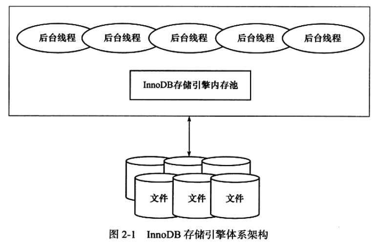
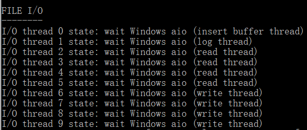

## MySQL体系结构和存储引擎

### 体系结构

先区分两个概念。

**数据库：**数据库是文件的集合，由一个个文件（一般来说都是二进制的文件）组成，是按着某种数据模型组织起来存放的数据集合。

**数据库实例：**数据库实例是程序，是位于用户与操作系统之间的一层数据管理软件，用户对数据库数据的任何操作，如数据库定义、数据查询、数据维护、（也就是数据库的增删改查）数据库运行控制等都是在数据库实例下进行的，应用程序只有通过数据库实例才能和数据库打交道。

 MySQL 由以下几部分组成：

- 管理服务和工具组件

  负责启动数据库服务

- 连接池组件

  管理连接，权限校验

- 查询分析器组件

  语法分析，词法分析

- 缓存组件

  如果命中缓存则直接返回

- 优化器组件

  执行计划生成，索引选择

- SQL接口组件

  操作引擎，返回结果

- 插件式存储引擎组件

  负责操作物理文件，提供读写接口

- 物理文件

  数据库文件

### 存储引擎

MySQL不同于其他数据库的最重要的一个特点就是其插件式的表存储引擎，用户可以根据自身的需求，来根据MySQL预定义的存储引擎接口编写自己的存储引擎，也可以通过修改已有引擎的源码来得到自己想要的特性。

**存储引擎是基于表的，而不是数据库。**

由于MySQL数据库的开源特性，存储引擎主要分为MySQL官方存储引擎和第三方存储引擎，下面做一个简单的介绍。

1. **InnoDB 存储引擎**

   支持事务，特点是行锁设计、支持外键，支持类似于Oracle的非锁定读，即默认读取操作不会产生锁，从MySQL 5.5.8 开始，InnoDB存储引擎是默认的存储引擎。

   InnoDB 通过使用 多版本并发控制（MVCC）来获得高并发性，并且实现了SQL标准的四种隔离级别，默认为可重复读。同时，使用一种称为 next-key-locking 的策略来避免幻读（phantom）现象的产生。除此之外，InnoDB存储引擎还提供了插入缓存，二次写、自适应哈希索引、预读等高性能和高可用的功能。

   对于表中数据的存储，InnoDB存储引擎采用了聚集的方式，因此每张表的存储都是按照主键的顺序进行存放。如果没有显式指定主键，InnoDB会为每一行生成一个6字节的ROWID，并以此作为主键。

2. **MyIASM 存储引擎**

   不支持事务，只支持表锁，支持全文索引，数据文件和索引文件分开存放。因此它的缓存池只缓存索引文件，而不缓存数据文件。

3. **NDB 存储引擎**

   是一个集群存储引擎，类似与 Oracle 的 RAC 集群，该引擎特点是数据全部放在内存中（MySQL5.1后可以非索引数据放在磁盘上），因此主键查找的速度极快。

   因为其集群存储的特性， 也带来一个问题，NDB 存储引擎的连接操作（JOIN）是在MySQL数据库层完成的，而不是在存储引擎层完成的，这意味着复杂的 JOIN 操作需要巨大的网络开销，因此查询速度很慢。

4. **Memory 存储引擎**

   将表中的数据存放在内存中，如果数据库重启或者发生崩溃，表中数据都将消失，适合存储临时数据，Memory 存储引擎默认使用 哈希索引，而不是B+ 树索引。

   

## InnoDB存储引擎

该引擎是第一个完整支持ACID事务的MySQL存储引擎，其特点是行锁设计，支持MVCC，支持外键，提供一致性非锁定读，同时被设计用来最有效地利用以及使用CPU和内存。

下图为InnoDB的核心架构图：



### 后台线程

**Master Thread**：是一个非常核心的后台线程，主要负责将缓冲池中的数据异步刷新到磁盘，保证数据的一致性，包括脏页的刷新、合并插入缓冲（Insert Buffer）、UNDO页的回收。

**IO Thread**：InnoDB 存储引擎中使用大量的AIO（Async IO）来处理写IO请求，这样可以极大的提高数据库的性能，该类线程的工作主要是负责这些IO请求的回调处理。

```mysql
show VARIABLES LIKE 'innodb_%io_threads';
show ENGINE INNODB STATUS;
```



**Purge Thread**：事务被提交后，其所在的undolog可能不在需要，这时候就需要 Purge Thread来回收已使用并分配的undo页，在InnoDB 1.1之后 purge 操作 可以通过 配置命令 来从 Master Thread 中分离出来，单独作为一个线程来工作，以此减少Master Thread 的压力。

```mysql
[mysqld]
innodb_purge_threads=1
```

**Page Cleaner Thread**：将之前版本中脏页的刷新操作都放入到单独的线程中来完成，减轻原Master Thread的工作及对于用户查询线程的阻塞，进一步提高InnoDB的性能。

### 内存

**缓冲池**：InnoDB 是基于磁盘存储的，并将其中的记录按照页的方式进行管理，因此可将其视为基于磁盘的数据库系统，因此往往需要通过缓冲池技术来提升数据库的整体性能。

而内存就是这块缓冲池，通过内存来弥补CPU和磁盘的速度差距，在数据库中进行读取页的操作，首先将从磁盘读到的页放在缓冲池中，这个过程称为将页 “FIX” 在缓冲池中，下一次再去读相同页的时候会先去缓冲池中查找，命中则直接读取该页，否则，读取磁盘上的页。

对数据库中页的修改操作，也是先修改缓冲池中的页，然后再以一定频率写回磁盘上，写回操作不是发生在每次页被修改后，而是通过一种称为 Checkpoint 的机制刷新后磁盘，这个类似于 GC 中的safepoint。