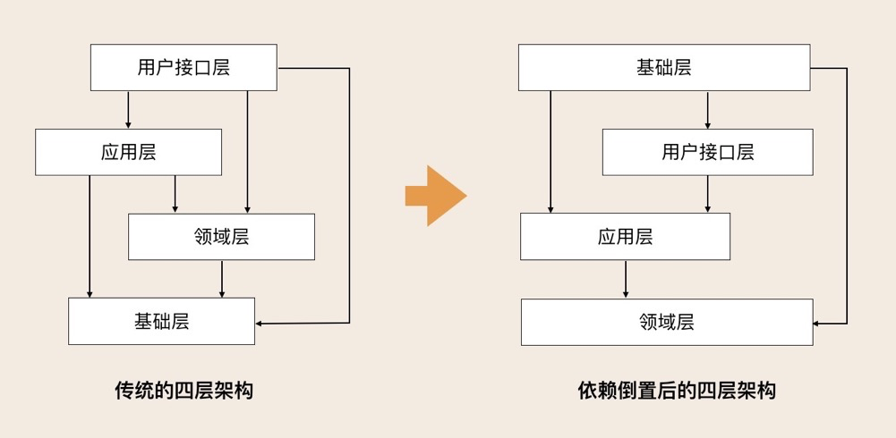
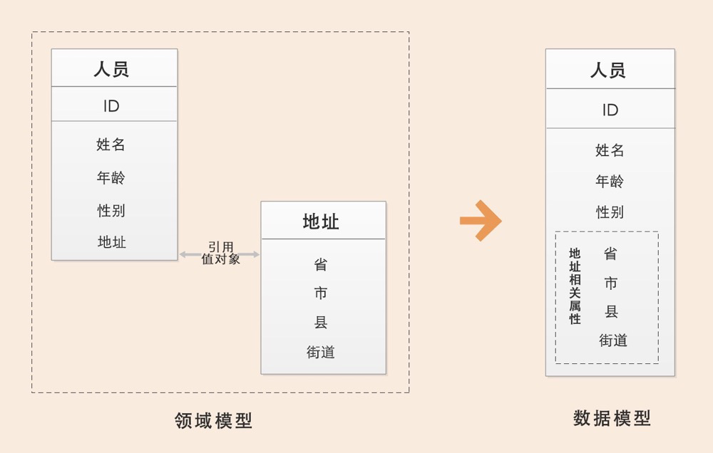
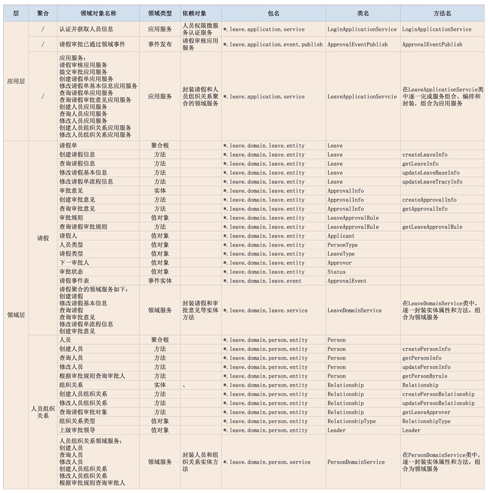
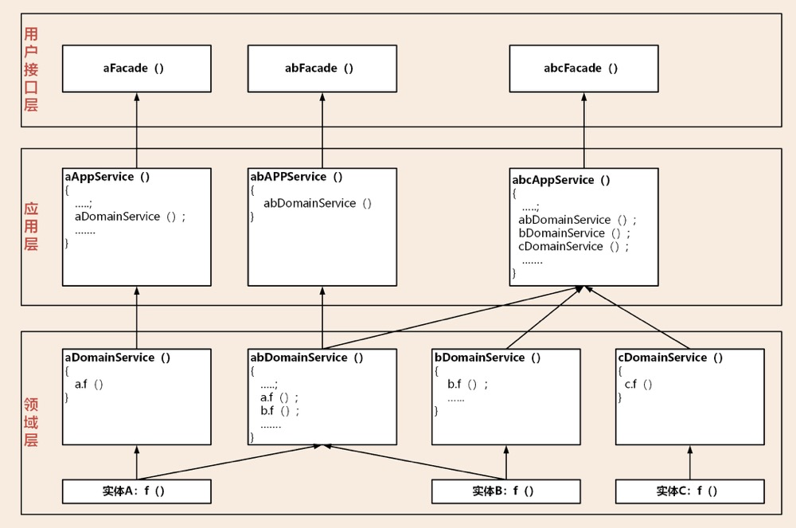
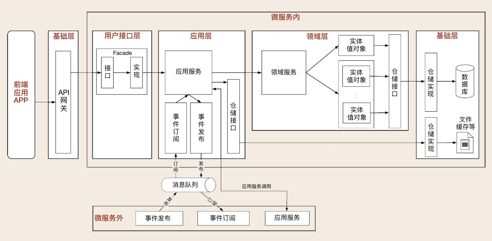
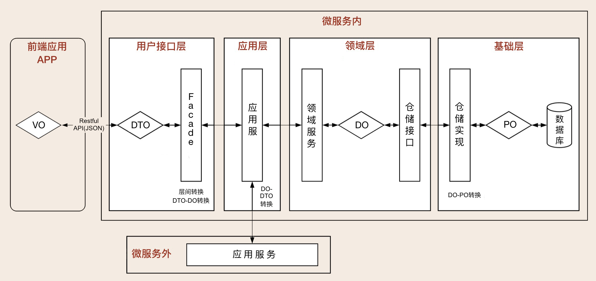

## others

order 与 orderLine 是聚合根关系

order 包含  Address 是聚合

领域实体拥有自己的动作，这些动作本身是与业务无关的，是实体与生俱来就有的。比如商品中的类目，有启用和停用的动作。而停用父级类目的时候会把子类目也同时停用掉。这个就是类目相关的业务，这个业务的实现依赖于编排实体的动作。

领域对象中实体的动作是对应现实实体的业务行为，并不是所有的实体行为。

application 应当只有业务逻辑，可以跨域，application中的方法名称要有业务语义 要清晰一些

领域层可以跨实体、聚合、聚合根操作，这种操作可以定义在领域服务中

实体的存储和实体的业务逻辑变更分离，实体只是操作内存数据对象

领域消息 可以通过分布式任务引擎保持任务一致性 

消息在messageClient中查询db获取实体的完整内容，用版本号来解决消息后发先至的问题

自发自收的消息topic和外域的topic 不用分开，不发定制消息 多个消息放在一个topic中，其他消息可能会阻塞某种更重要的消息，消息建议大而全，考虑一发多收

仓储层本质不对应表，是和实体相关的

Repository管理的数据的最小粒度是聚合根

其实查询类业务可以不必经过聚合根和仓储，如果聚合数据比较多，会有延迟加载影响性能。
聚合根的主要目的是为了保证数据的一致性，这些场景一般在CU的场景。

通常我们建议把Repository定义为一个集合并且只提供类似集合的接口，比如Add，Remove，Get这种操作。一言以蔽之，我们要用集合的思想来操作聚合根，而不是传统的面向DB的CRUD方法。

不管我们怎么去玩弄订单 交易 商品模型,增删改查,乱搞一通,最后出来的结果都应该符合规则 创建订单的时候,订单模型会尝试减库存,成功,则创建,失败,则不允许创建,如此云云 最后出来的结果不会有逻辑问题,比如订单上的商品不存在,或者交易对应的订单不存在。

**领域模型只管合规 ,但不管合理** 大型超市里,一位收银员决定把所有货品下架,这是否合理?这个不属于领域模型关心的范围,领域模型只知道,要把货物库存的位置从货架转移到仓库,目标仓库必须有能存放这个货物的空位,转移完毕时从货架的可用空间中减去货物的大小 至于谁做,为什么做,能不能做,这么做合不合理,(通常)不在领域层的关心范围,而是放到应用层去做。

在前面的例子中,如果一个客户在黑名单中,不允许购买,那么这个检查,通常是在应用层去检查 这样,我们就可以很容易地复用领域模型或者调整应用规则,而不至于把易变的应用规则混到稳定的业务规则里去。

[在线请假系统Demo](https://github.com/ouchuangxin/leave-sample)

[领域驱动架构（DDD）建模中的模型到底是什么？](https://www.zhihu.com/question/25089273)

## 微服务

微服务架构是相较与传统的集中式架构而言的，微服务架构可以很好地实现应用之间的解耦，解决单体应用扩展性和弹性伸缩能力不足的问题。不同链路的服务之间可以互不影响，如采购服务不可用时，不会影响到交易订单的服务。

而微服务实践过程中的难点是，服务粒度应该有多大？微服务到底应该如何拆分和设计呢？微服务的边界应该在哪里？

- 微服务拆分过细，可能会导致项目复杂度过高，无法上线和运维。
- 微服务拆分过粗，可能会导致业务耦合严重，没有起到微服务的作用。

综合来看，微服务拆分困境产生的根本原因就是不知道业务或者微服务的边界到底在什么地方。换句话说，确定了业务边界和应用边界，这个困境也就迎刃而解了。

## DDD

DDD 的全称是Domain-Driven Design 领域驱动设计，它早在2004年就已经被提出了，直到微服务架构提出后，DDD才逐渐被大众所熟悉。 它的核心思想是通过领域驱动设计方法定义领域模型，从而确定业务和应用边界保证业务模型与代码模型的一致性。而这就与微服务所欠缺的不谋而合。

我们可以利用 DDD 设计方法来建立领域模型，划分领域边界，再根据这些领域边界从业务视角来划分微服务边界。而按照 DDD 方法设计出的微服务的业务和应用边界都非常合理，可以很好地实现微服务内部和外部的“高内聚、低耦合”。于是越来越多的人开始把 DDD 作为微服务设计的指导思想。

## 为什么DDD适合微服务

DDD 是一种处理高度复杂领域的设计思想，它试图分离技术实现的复杂性，并围绕业务概念构建领域模型来控制业务的复杂性，以解决软件难以理解，难以演进的问题。DDD 不是架构，而是一种架构设计方法论，它通过边界划分将复杂业务领域简单化，帮我们设计出清晰的领域和应用边界，可以很容易地实现架构演进。

**事件风暴提取出的领域对象**

## 界限上下文

商品域作为核心域，其下可以细分出多个子域，主档域，销售商品域，供应货品域，通过界限上下文的划分，在不同的业务领域中，同一个东西，有着不同的术语。比如一个苹果，在主档域中就是一个主档信息，在销售商品域里是一个商品，在供应货品域里是一个货品。不同的术语有着不同的涵义和责任边界。而划分的责任边界，其实就是界限上下文的边界，也可以是微服务设计的边界，项目拆分的边界。

在销售商品这个子域中，我们根据管理维度的不同，形成了两个聚合，分别是商家销售商品聚合和地点销售商品聚合。两个聚合拥有各自的聚合根、实体和值对象。

## 通用语言

通用语言是领域内交流的统一语言，在界限上下文提供的语义环境中没有二义性。开发、测试、业务、产品都可以使用。商品团队的通用语言是定义在商品域，这个大的领域中的。商品域下的多个子域没有重复的术语，如商品域中谈货品，其实就是在说商品域下供应货品子域的事情。这样首先能确保大家谈论的是在一个前提下。

通用语言可以是名词，也可以是动词。名词可以给领域对象命名，对应着领域实体；而动词则表示一个动作（如商品上下架）或事件（商品的发布），

## 实体和值对象

实体有id，值对象没有id

一个对象是否能被设计为值对象，可以根据该对象是否有单独修改和查询的场景来判断，比如商品的条码，存在修改条码产地的场景，但这个操作在修改主档中完成的，所以修改条码并没有单独的修改场景；在查询方面，只存在根据条码和产地来查询主档的情况，不会有根据条码和产地来查条码。像这样的查询我们可以通过ES来聚合查询条件。

 是否要设计成值对象，你要看这个对象是否后续还会来回修改，会不会有生命周期。如果不可修改，并且以后也不会专门针对它进行查询或者统计，你就可以把它设计成值对象，如果不行，那就设计成实体吧。
DDD强调领域模型而不是数据模型，所以在设计的时候不建议把数据模型放在很优先的位置，但是如果你的数据需要经常修改，还是把它设计为实体吧。很多值对象来源于上一个业务流程或者外部第三方的数据，它在上游或者第三方是一个关键实体，甚至是聚合根。但在下游或者其他微服务内它是不可以修改的，要修改也只能从上游或者第三方修改后做整体替换，它只是一个值，这类领域对象你是可以设计为值对象的。

在 DDD 中，实体和值对象是很基础的领域对象。实体一般对应业务对象，它具有业务属性和业务行为；而值对象主要是属性集合，对实体的状态和特征进行描述。但实体和值对象都只是个体化的对象，它们的行为表现出来的是个体的能力。

[DP与值对象](https://www.infoq.cn/article/zlsmvxqhkjujjwu1dgag)

## 聚合和聚合根

**聚合**

如果把谊品比作一个界限上下文，那我们每个人都是这个上下文内的实体，是个体的概念。而公司配发的电脑，可以理解为值对象，我们每个人做的工作可以看作是实体的行为，如果把做商品相关开发的人组成一个团队，就好比把有相关性行为的实体组成一个聚合，与个体相对，聚合是组织的概念。

聚合内的实体，可以相互协作，聚合用来确保这些领域对象在实现共同的业务逻辑时，能保证数据的一致性。实体的行为是个体能力，而聚合对外表现的则是整体的服务。

聚合就是由业务和逻辑紧密关联的实体和值对象组合而成的，聚合是数据修改和持久化的基本单元，每一个聚合对应一个仓储，实现数据的持久化。

聚合有一个聚合根和上下文边界，这个边界根据业务单一职责和高内聚原则，定义了聚合内部应该包含哪些实体和值对象，而聚合之间的边界是松耦合的。按照这种方式设计出来的微服务很自然就是“高内聚、低耦合”的。

聚合在 DDD 分层架构里属于领域层，领域层包含了多个聚合，共同实现核心业务逻辑。聚合内实体以充血模型实现个体业务能力，以及业务逻辑的高内聚。跨多个实体的业务逻辑通过领域服务来实现，跨多个聚合的业务逻辑通过应用服务来实现。比如有的业务场景需要同一个聚合的 A 和 B 两个实体来共同完成，我们就可以将这段业务逻辑用领域服务来实现；而有的业务逻辑需要聚合 C 和聚合 D 中的两个服务共同完成，这时你就可以用应用服务来组合这两个服务。

在边界之外使用最终一致性。一次事务最多只能更改一个聚合的状态。如果一次业务操作涉及多个聚合状态的更改，应采用领域事件的最终一致性。

**聚合根**

把一个团队比作一个聚合，那么聚合根自然就是这个团队的负责人了。聚合根本身也是一个实体，拥有实体的属性和业务行为，实现自身的业务逻辑。

其次它作为聚合的管理者，在聚合内部负责协调实体和值对象按照固定的业务规则协同完成共同的业务逻辑。

最后在聚合之间，它还是聚合对外的接口人，以聚合根 ID 关联的方式接受外部任务和请求，在上下文内实现聚合之间的业务协同。也就是说，聚合之间通过聚合根 ID 关联引用，如果需要访问其它聚合的实体，就要先访问聚合根，再导航到聚合内部实体，外部对象不能直接访问聚合内实体。

## 领域事件

在边界之外使用最终一致性。一次事务最多只能更改一个聚合的状态。如果一次业务操作涉及多个聚合状态的更改，应采用领域事件的最终一致性。

领域事件驱动设计可以切断领域模型之间的强依赖关系，事件发布完成后，发布方不必关心后续订阅方事件处理是否成功，这样可以实现领域模型的解耦，维护领域模型的独立性和数据的一致性。在领域模型映射到微服务系统架构时，领域事件可以解耦微服务，微服务之间的数据不必要求强一致性，而是基于事件的最终一致性。

回到具体的业务场景，我们发现有的领域事件发生在微服务内的聚合之间，有的则发生在微服务之间，还有两者皆有的场景，一般来说跨微服务的领域事件处理居多。在不同场景下领域事件的处理方式也会不一样。

**微服务内的领域事件**

当领域事件发生在微服务内的聚合之间，领域事件发生后完成事件实体构建和事件数据持久化，发布方聚合将事件发布到事件总线，订阅方接收事件数据完成后续业务操作。微服务内大部分事件的集成，都发生在同一个进程内，进程自身可以很好地控制事务，因此不一定需要引入消息中间件。但一个事件如果同时更新多个聚合，按照 DDD“一次事务只更新一个聚合”的原则，你就要考虑是否引入事件总线。但微服务内的事件总线，可能会增加开发的复杂度，因此你需要结合应用复杂度和收益进行综合考虑。

微服务内应用服务，可以通过跨聚合的服务编排和组合，以服务调用的方式完成跨聚合的访问，这种方式通常应用于实时性和数据一致性要求高的场景。这个过程会用到分布式事务，以保证发布方和订阅方的数据同时更新成功。

**微服务间的领域事件**

跨微服务的领域事件会在不同的限界上下文或领域模型之间实现业务协作，其主要目的是实现微服务解耦，减轻微服务之间实时服务访问的压力。领域事件发生在微服务之间的场景比较多，事件处理的机制也更加复杂。跨微服务的事件可以推动业务流程或者数据在不同的子域或微服务间直接流转。

跨微服务的事件机制要总体考虑事件构建、发布和订阅、事件数据持久化、消息中间件，甚至事件数据持久化时还可能需要考虑引入分布式事务机制等。

微服务之间的访问也可以采用应用服务直接调用的方式，实现数据和服务的实时访问，弊端就是跨微服务的数据同时变更需要引入分布式事务，以确保数据的一致性。分布式事务机制会影响系统性能，增加微服务之间的耦合，所以我们还是要尽量避免使用分布式事务。

其实查询类业务可以不必经过聚合根和仓储。传统方法也可以了。
如果聚合数据比较多，会有延迟加载影响性能。
聚合根的主要目的是为了保证数据的一致性，这些场景一般在CU的场景

## DDD分层

我们看一下上面这张图，在最早的传统四层架构中，基础层是被其它层依赖的，它位于最核的位置，那按照分层架构的思想，它应该就是核心，但实际上领域层才是软件的核心，所这种依赖是有问题的。

Vernon在它的《实现领域驱动设计》一书中提到了采用依赖倒置（Dependency inversion,DIP）原则改进的方案。优化了传统的四层架构，实现了各层对基础层的解耦。

所谓的依赖倒置原则指的是：高层模块不应该依赖于低层模块，两者都应该依赖于抽象，抽象不应该依赖于细节，细节应该依赖于抽象。

从图中可以看到，基础实施层位于其他所有层的上方，接口定义在其它层，基础实施实现这些接口。依赖原则的定义在DDD设计中可以改述为：领域层等其他层不应该依赖于基础实施层，两者都应该依赖于抽象，具体落地的时候，这些抽象的接口定义放在了领域层等下方层中。这也就是意味着一个重要的落地指导原则： **所有依赖基础实施实现的抽象接口，都应该定义在领域层或应用层中**。

采用依赖倒置原则改进DDD分层架构除了上面说的DIP的好处外，还有什么好处吗？其实这种分层结构更加地高内聚低耦合。每一层只依赖于抽象，因为具体的实现在基础实施层，无需关心。只要抽象不变，就无需改动那一层，实现如果需要改变，只需要修改基础实施层就可以了。

采用依赖倒置原则的代码落地中，资源库Repository的抽象接口定义就会放在领域层了，而资源库的实现就会放在基础层。

1.**用户接口层**

用户接口层负责向用户显示信息和解释用户指令。这里的用户可能是：用户、程序、自动化测试和批处理脚本等等。

2.**应用层**

应用层是很薄的一层，理论上不应该有业务规则或逻辑，主要面向用例和流程相关的操作。但应用层又位于领域层之上，因为领域层包含多个聚合，所以它可以协调多个聚合的服务和领域对象完成服务编排和组合，协作完成业务操作。

此外，应用层也是微服务之间交互的通道，它可以调用其它微服务的应用服务，完成微服务之间的服务组合和编排。这里我要提醒你一下：在设计和开发时，不要将本该放在领域层的业务逻辑放到应用层中实现。因为庞大的应用层会使领域模型失焦，时间一长你的微服务就会演化为传统的三层架构，业务逻辑会变得混乱。

另外，应用服务是在应用层的，它负责服务的组合、编排和转发，负责处理业务用例的执行顺序以及结果的拼装，以粗粒度的服务通过 API 网关向前端发布。还有，应用服务还可以进行安全认证、权限校验、事务控制、发送或订阅领域事件等。

3.**领域层**

领域层的作用是实现企业核心业务逻辑，通过各种校验手段保证业务的正确性。领域层主要体现领域模型的业务能力，它用来表达业务概念、业务状态和业务规则。

领域层包含聚合根、实体、值对象、领域服务等领域模型中的领域对象。这里我要特别解释一下其中几个领域对象的关系，以便你在设计领域层的时候能更加清楚。首先，领域模型的业务逻辑主要是由实体和领域服务来实现的，其中实体会采用充血模型来实现所有与之相关的业务功能。其次，你要知道，实体和领域对象在实现业务逻辑上不是同级的，当领域中的某些功能，单一实体（或者值对象）不能实现时，领域服务就会出马，它可以组合聚合内的多个实体（或者值对象），实现复杂的业务逻辑。

4.**基础层**

基础层是贯穿所有层的，它的作用就是为其它各层提供通用的技术和基础服务，包括第三方工具、驱动、消息中间件、网关、文件、缓存以及数据库等。比较常见的功能还是提供数据库持久化。基础层包含基础服务，它采用依赖倒置设计，封装基础资源服务，实现应用层、领域层与基础层的解耦，降低外部资源变化对应用的影响。比如说，在传统架构设计中，由于上层应用对数据库的强耦合，很多公司在架构演进中最担忧的可能就是换数据库了，因为一旦更换数据库，就可能需要重写大部分的代码，这对应用来说是致命的。那采用依赖倒置的设计以后，应用层就可以通过解耦来保持独立的核心业务逻辑。当数据库变更时，我们只需要更换数据库基础服务就可以了，这样就将资源变更对应用的影响降到了最低。

### **Interfaces（用户接口层）**

它主要存放用户接口层与前端交互、展现数据相关的代码。前端应用通过这一层的接口，向应用服务获取展现所需的数据。这一层主要用来处理用户发送

的 Restful 请求，解析用户输入的配置文件，并将数据传递给 Application 层。数据的组装、数据传输格式以及 Facade 接口等代码都会放在这一层目录里。

用户接口层是前端应用和微服务之间服务访问和数据交换的桥梁。它处理前端发送的 Restful 请求和解析用户输入的配置文件等，将数据传递给应用层。或获取应用服务的数据后，进行数据组装，向前端提供数据服务。主要服务形态是 Facade 服务。Facade 服务分为接口和实现两个部分。完成服务定向，DO 与 DTO 数据的转换和组装，实现前端与应用层数据的转换和交换。

Interfaces 的代码目录结构有：assembler、dto 和 façade 三类。

#### Assembler

实现 DTO 与领域对象之间的相互转换和数据交换。一般来说 Assembler 与DTO 总是一同出现。

#### Dto

它是数据传输的载体，内部不存在任何业务逻辑，我们可以通过 DTO 把内部的领域对象与外界隔离。

#### Facade（防腐层）

提供较粗粒度的调用接口，将用户请求委派给一个或多个应用服务进行处理。

### **Application（应用层）**

它主要存放应用层服务组合和编排相关的代码。应用服务向下基于微服务内的领域服务或外部微服务的应用服务完成服务的编排和组合，向上为用户接口层提供各种应用数据展现支持服务。

应用服务和事件等代码会放在这一层目录里。

应用层用来表述应用和用户行为，负责服务的组合、编排和转发，负责处理业务用例的执行顺序以及结果的拼装，负责不同聚合之间的服务和数据协调，负责微服务之间的事件发布和订阅。

通过应用服务对外暴露微服务的内部功能，这样就可以隐藏领域层核心业务逻辑的复杂性以及内部实现机制。应用层的主要服务形态有：应用服务、事件发布和订阅服务。应用服务内用于组合和编排的服务，主要来源于领域服务，也可以是外部微服务的应用服务。除了完成服务的组合和编排外，应用服务内还可以完成安全认证、权限校验、初步的数据校验和分布式事务控制等功能。为了实现微服务内聚合之间的解耦，聚合之间的服务调用和数据交互应通过应用服务来完成。原则上我们应该禁止聚合之间的领域服务直接调用和聚合之间的数据表关联。

Application 的代码目录结构有：event 和 service。

#### Event（事件）

这层目录主要存放事件相关的代码。它包括两个子目录：publish 和subscribe。前者主要存放事件发布相关代码，后者主要存放事件订阅相关代码（事件处理相关的核心业务逻辑在领域层实现）。

这里提示一下：虽然应用层和领域层都可以进行事件的发布和处理，但为了实现事件的统一管理，我建议你将微服务内所有事件的发布和订阅的处理都统一放到应用层，事件相关的核心业务逻辑实现放在领域层。通过应用层调用领域层服务，来实现完整的事件发布和订阅处理流程。

#### Service（应用服务）

应用服务会对多个领域服务进行组合和编排，暴露给用户接口层，供前端应用调用。在应用服务组合和编排时，你需要关注一个现象：多个应用服务可能会对多个同样的领域服务重复进行同样业务逻辑的组合和编排。当出现这种情况时，你就需要分析是不是领域服务可以整合了。你可以将这几个不断重复组合的领域服务，合并到一个领域服务中实现。这样既省去了应用服务的反复编排，也实现了服务的演进。这样领域模型将会越来越精炼，更能适应业务的要求。

应用服务类放在应用层 Service 目录结构下。领域事件的发布和订阅类放在应用层 Event目录结构下。

这层的服务是应用服务。应用服务会对多个领域服务或外部应用服务进行封装、编排和组合，对外提供粗粒度的服务。应用服务主要实现服务组合和编排，是一段独立的业务逻辑。你可以将所有应用服务放在一个应用服务类里，也可以把一个应用服务设计为一个应用服务类，以防应用服务类代码量过大。

### **Domain（领域层）**

它主要存放领域层核心业务逻辑相关的代码。领域层可以包含多个聚合代码包，它们共同实现领域模型的核心业务逻辑。聚合以及聚合内的实体、方法、领域服

务和事件等代码会放在这一层目录里。Domain 是由一个或多个聚合包构成，共同实现领域模型的核心业务逻辑。聚合内的代码模型是标准和统一的，

包括：entity、event、repository 和 service 四个子目录。

#### Aggregate（聚合）

它是聚合软件包的根目录，可以根据实际项目的聚合名称命名，比如权限聚合。在聚合内定义聚合根、实体和值对象以及领域服务之间的关系和边界。聚合内

实现高内聚的业务逻辑，它的代码可以独立拆分为微服务。以聚合为单位的代码放在一个包里的主要目的是为了业务内聚，而更大的目的是为了以后微

服务之间聚合的重组。聚合之间清晰的代码边界，可以让你轻松地实现以聚合为单位的微服务重组，在微服务架构演进中有着很重要的作用。

#### Entity（实体）

它存放聚合根、实体、值对象以及工厂模式（Factory）相关代码。实体类采用充血模型，同一实体相关的业务逻辑都在实体类代码中实现。跨实体的业务逻辑代码在领域服务中实现。

实体采用充血模型，在实体类内部实现实体相关的所有业务逻辑，实现的形式是实体类中的方法。实体是微服务的原子业务逻辑单元。在设计时我们主要考虑实体自身的属性和业务行为，实现领域模型的核心基础能力。不必过多考虑外部操作和业务流程，这样才能保证领域模型的稳定性。

DDD 提倡富领域模型，尽量将业务逻辑归属到实体对象上，实在无法归属的部分则设计成领域服务。领域服务会对多个实体或实体方法进行组装和编排，实现跨多个实体的复杂核心业务逻辑。对于严格分层架构，如果单个实体的方法需要对应用层暴露，则需要通过领域服务封装后才能暴露给应用服务。

#### Event（事件）

它存放事件实体以及与事件活动相关的业务逻辑代码。

#### Service（领域服务）

一些行为无法归类到实体对象或值对象上，本质是一些操作，而非事物。

领域服务会对多个实体和实体方法进行组合和编排，供应用服务调用。如果它需要暴露给用户接口层，领域服务就需要封装成应用服务。

它存放领域服务代码。一个领域服务是多个实体组合出来的一段业务逻辑。你可以将聚合内所有领域服务都放在一个领域服务类中，你也可以把每一个领域服务设计为一个类。如果领域服务内的业务逻辑相对复杂，我建议你将一个领域服务设计为一个领域服务类，避免由于所有领域服务代码都放在一个领域服务类中，而出现代码臃肿的问题。领域服务封装多个实体或方法后向上层提供应用服务调用。

#### Repository（仓储）

它存放所在聚合的查询或持久化领域对象的代码，通常包括仓储接口和仓储实现方法。为了方便聚合的拆分和组合，我们设定了一个原则：一个聚合对应一个仓储。

### **Infrastructure（基础层）**

基础设施层以不同的方式支持所有三个层，促进层之间的通信。
基础设施包括独立于我们的应用程序存在的一切：外部库，数据库引擎，应用程序服务器，消息后端等。

作为基础设施层，Infrastructure为Interfaces、Application和Domain三层提供支撑。所有与具体平台、框架相关的实现会在Infrastructure中提供，避免三层特别是Domain层掺杂进这些实现，从而“污染”领域模型。Infrastructure中最常见的一类设施是对象持久化的具体实现。

它主要存放基础资源服务相关的代码，为其它各层提供的通用技术能力、三方软件包、数据库服务、配置和基础资源服务的代码都会放在这一层目录里。

#### Config

主要存放配置相关代码。

#### Util

主要存放平台、开发框架、消息、数据库、缓存、文件、总线、网关、第三方类库、通用算法等基础代码，你可以为不同的资源类别建立不同的子目录。

### 分层示例

比如执行一个创建用户的命令，
	
 1.1)Assembler->将CustomerDTO转换为CustomerEntity
 1.2)Dto->接收请求传入的数据CustomerDTO
 1.3)Facade->调用应用层创建用户方法
2.应用层
 2.1)Event->发布用户创建事件给其它微服务
 2.2)Service:
  内部服务->创建用户
  外部服务->创建日志
\3. 领域层
 3.1)Aggregate->进入用户聚合目录下(如：CustomerAggregate)
 3.2)Entity->用户聚合跟
 3.3)Event->创建用户事件
 3.4)Service->具体的创建用户逻辑，比如用户是否重复校验，分配初始密码等
 3.5)Repository->将用户信息保存到数据库

## 领域模型与数据模型映射

## 请假系统示例

**请假系统代码链接**：https://github.com/ouchuangxin/leave-sample

**代码详解**：https://time.geekbang.org/column/article/185174

## 服务的调用

## 数据对象的转换过程

## [关于校验规则（Validation Rule）和业务规则（Bussiness Rule）的思考](https://www.cnblogs.com/horily/archive/2006/01/01/309337.html)

​    企业应用中常常涉及到校验规则和业务规则。泛而言之，所有的规则都可以称之为业务规则，但是有必要在其中区分出校验规则这个概念。从业务规则的作用范围来看，一些业务规则是关于单个领域对象自身属性的，往往是简单的、断言式的，目的是保证领域对象的正确性；而另外一些业务规则是关于多个领域对象协作的，往往包含比较复杂的判断逻辑，目的是保证业务逻辑的正确性。为便于描述，我把第一类称为校验规则，第二类称成为业务规则。

# 其他

Interface层：

- 职责：主要负责承接网络协议的转化、Session管理等。
- 接口数量：避免所谓的统一API，不必人为限制接口类的数量，每个/每类业务对应一套接口即可，接口参数应该符合业务需求，避免大而全的入参。
- 接口出参：统一返回Result。
- 异常处理：应该捕捉所有异常，避免异常信息的泄漏。可以通过AOP统一处理，避免代码里有大量重复代码。
  Application层：
- 入参：具像化Command、Query、Event对象作为ApplicationService的入参，唯一可以的例外是单ID查询的场景。
- CQE的语意化：CQE对象有语意，不同用例之间语意不同，即使参数一样也要避免复用。
- 入参校验：基础校验通过Bean Validation api解决。Spring Validation自带Validation的AOP，也可以自己写AOP。
- 出参：统一返回DTO，而不是Entity或DO。
- DTO转化：用DTO Assembler负责Entity/VO到DTO的转化。
- 异常处理：不统一捕捉异常，可以随意抛异常。
  部分Infra层：
- 用ACL防腐层将外部依赖转化为内部代码，隔离外部的影响

1.接口的清晰度

如findByPhoneAndName，两个参数都是字符串，传参容易混淆，且编译器不会报错，只有运行时才会发现问题。

2.数据的验证和错误处理

一般常规性的检查需要出现在方法的最前端，确保能够fail-fast。有时是直接返回异常的参数，有时还需要返回异常的具体原因。

还有就是这样其实会把 数据校验异常和业务逻辑异常混淆。

3.业务代码的清晰度

每段方法是做了什么事情。

4.可测试性

将数据校验和通用的业务抽到对象中，这样作为入参时接口清晰；而且由于一些通用逻辑的收口，我我们在做单测的时候也会很方便。

把数据验证的工作量前置到了调用方，而调用方本来就是应该提供合法数据的，所以更加合适。

让我们重新来定义一下Domain Primitive：**Domain Primitive是一个在特定领域里，拥有精准定义的、可自我验证的、拥有行为的Value Object**。

- DP是一个传统意义上的Value Object，拥有Immutable的特性
- DP是一个完整的概念整体，拥有精准定义
- DP使用业务域中的原生语言
- DP可以是业务域的最小组成部分、也可以构建复杂组合

### 什么情况下应该用Domain Primitive

常见的DP的使用场景包括：

- 有格式限制的`String`：比如`Name`，`PhoneNumber`，`OrderNumber`，`ZipCode`，`Address`等

- 有限制的`Integer`：比如`OrderId`（>0），`Percentage`（0-100%），`Quantity`（>=0）等

- 可枚举的`int`：比如`Status`（一般不用Enum因为反序列化问题）

- `Double`或`BigDecimal`：一般用到的`Double`或`BigDecimal`都是有业务含义的，比如`Temperature`、`Money`、`Amount`、`ExchangeRate`、`Rating`等

- 复杂的数据结构：比如`Map<String, List<Integer>>`等，尽量能把`Map`的所有操作包装掉，仅暴露必要行为

  

