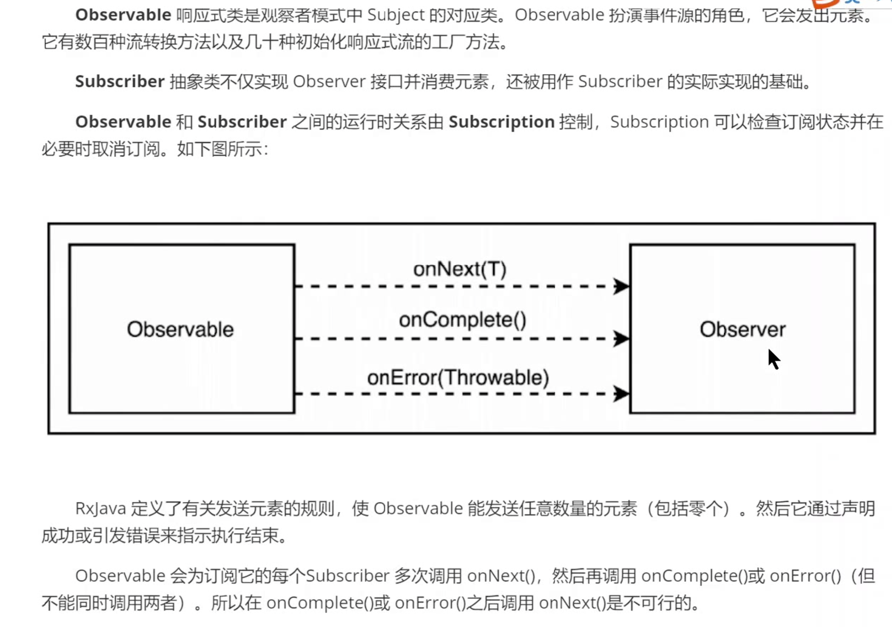

TODO

- [ ] AsyncConifgurer 
- [ ] 基于@EventListener注解的发布和订阅模式

响应式编程是从观察者模式演化过来的。

观察者模式：

```java
public interface Subject {
    void registerObserver(Observer observer);
    void unRegisterObserver(Observer observer);
    void notifyObserver(String event);
}
```

```java
public interface Observer {
    void observer(String event);
}
```

@EventListener 是spring 在响应式编程出现提供的一种发布订阅的模式

Rx是一个使用可观察数据流进行异步编程的编程接口，并结合了观察者模式、迭代器模式、函数式编程，并对多种流行语言都提供了实现，

迭代器模式中，Subject 不再调用 Observer 的 observer（）方法，而是调用下边的三个方法。

```java
public interface RxObserver<T> {
		void onNext(T t);
		void onComplete();
  	void onError(Exception e);
}
```

RxJava 是 Java 语言的 ReactiveX 实现。



gRPC 框架也是按照响应式流规范来定义的。