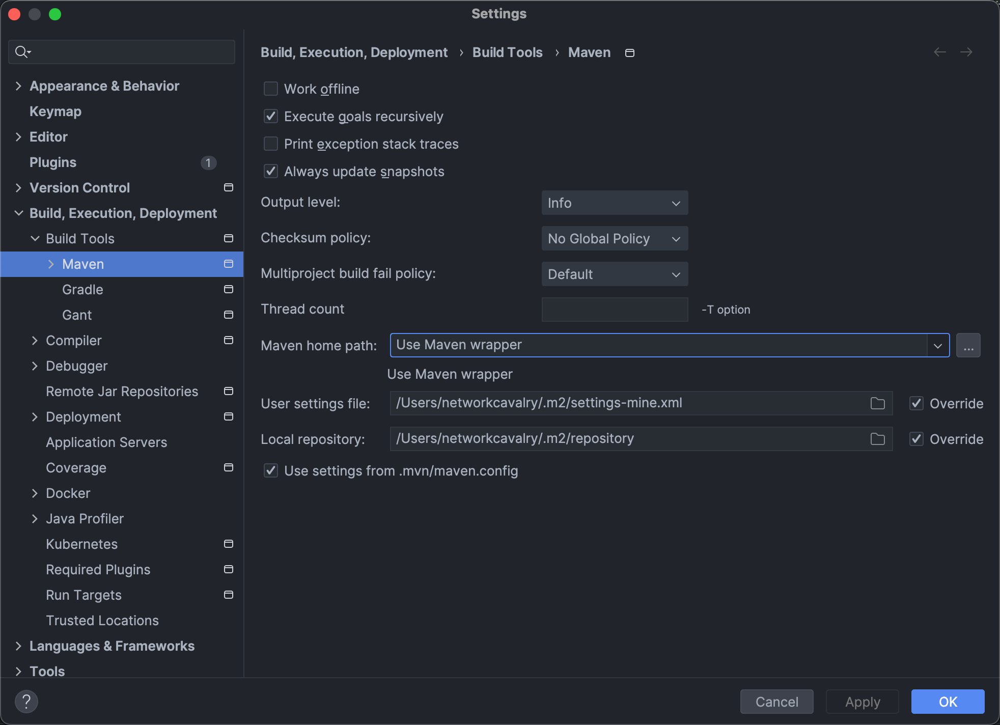

Maven有三套相互独立的生命周期，请注意这里说的是“三套”，而且“相互独立”，初学者容易将Maven的生命周期看成一个整体，其实不然。这三套生命周期分别是：

- Clean Lifecycle 在进行真正的构建之前进行一些清理工作。
- Default Lifecycle 构建的核心部分，编译，测试，打包，部署等等。
- Site Lifecycle 生成项目报告，站点，发布站点。

我再次强调一下它们是相互独立的，你可以仅仅调用clean来清理工作目录，仅仅调用site来生成站点。当然你也可以直接运行 **mvn clean install site** 运行所有这三套生命周期


知道了每套生命周期的大概用途和相互关系以后，来逐个详细看一下每套生命周期，Clean和Site相对比较简单，先解释一下。

 

每套生命周期都由一组阶段(Phase)组成，我们平时在命令行输入的命令总会对应于一个特定的阶段。比如，运行**mvn clean** ，这个的clean是Clean生命周期的一个阶段。有点绕？要知道有Clean生命周期，也有clean阶段。Clean生命周期一共包含了三个阶段：

- pre-clean 执行一些需要在clean之前完成的工作
- clean 移除所有上一次构建生成的文件
- post-clean 执行一些需要在clean之后立刻完成的工作

**mvn clean** 中的clean就是上面的clean，在一个生命周期中，运行某个阶段的时候，它之前的所有阶段都会被运行，也就是说，**mvn clean** 等同于 **mvn pre-clean clean** ，如果我们运行 **mvn post-clean** ，那么 pre-clean，clean 都会被运行。这是Maven很重要的一个规则，可以大大简化命令行的输入。

 

下面看一下Site生命周期的各个阶段：

- pre-site   执行一些需要在生成站点文档之前完成的工作
- site   生成项目的站点文档
- post-site   执行一些需要在生成站点文档之后完成的工作，并且为部署做准备
- site-deploy   将生成的站点文档部署到特定的服务器上

这里经常用到的是site阶段和site-deploy阶段，用以生成和发布Maven站点，这可是Maven相当强大的功能，Manager比较喜欢，文档及统计数据自动生成，很好看。


最后，来看一下Maven的最重要的Default生命周期，绝大部分工作都发生在这个生命周期中，这里，我只解释一些比较重要和常用的阶段：

Maven的生命周期（lifecycle）由一系列阶段（phase）构成，以内置的生命周期`default`为例，它包含以下phase：

- validate 校验
- initialize 初始化
- generate-sources 生成源码
- process-sources 处理源码
- generate-resources 生成资源
- process-resources 处理资源
- compile 编译
- process-classes 处理-classes
- generate-test-sources 生成测试源码
- process-test-sources 处理测试源码
- generate-test-resources 生成测试资源
- process-test-resources 处理测试资源
- test-compile 测试编译
- process-test-classes 处理测试-classes
- test 测试
- prepare-package 准备打包
- package 打包
- pre-integration-test 预综合测试
- integration-test 综合测试
- post-integration-test 综合测试之后
- verify 核实
- install 安装
- deploy 部署


在实际开发过程中，经常使用的命令有：

`mvn clean`：清理所有生成的class和jar；

`mvn clean compile`：先清理，再执行到`compile`；

`mvn clean test`：先清理，再执行到`test`，因为执行`test`前必须执行`compile`，所以这里不必指定`compile`；

`mvn clean package`：先清理，再执行到`package`。

大多数phase在执行过程中，因为我们通常没有在`pom.xml`中配置相关的设置，所以这些phase什么事情都不做。

经常用到的phase其实只有几个：

- clean：清理
- compile：编译
- test：运行测试
- package：打包到target目录
- install：安装到本地仓库
- deploy ：部署


我们在前面介绍了Maven的lifecycle，phase和goal：使用Maven构建项目就是执行lifecycle，执行到指定的phase为止。每个phase会执行自己默认的一个或多个goal。goal是最小任务执行单元。

我们以`compile`这个phase为例，如果执行：

```maven
mvn compile
```

Maven将执行`compile`这个phase，这个phase会调用`compiler`插件执行关联的`compiler:compile`这个goal。

实际上，执行每个phase，都是通过某个插件（plugin）来执行的，Maven本身其实并不知道如何执行`compile`，它只是负责找到对应的`compiler`插件，然后执行默认的`compiler:compile`这个goal来完成编译。

所以，使用Maven，实际上就是配置好需要使用的插件，然后通过phase调用它们。


下面列举了一些常用的插件：

- maven-shade-plugin：打包所有依赖包并生成可执行jar；
- cobertura-maven-plugin：生成单元测试覆盖率报告；
- findbugs-maven-plugin：对Java源码进行静态分析以找出潜在问题。


### 安装Maven Wrapper

安装Maven Wrapper最简单的方式是在项目的根目录（即`pom.xml`所在的目录）下运行安装命令：

```
mvn -N io.takari:maven:0.7.6:wrapper
```

它会自动使用最新版本的Maven。注意`0.7.6`是Maven Wrapper的版本。最新的Maven Wrapper版本可以去[官方网站](https://github.com/takari/maven-wrapper)查看。

如果要指定使用的Maven版本，使用下面的安装命令指定版本，例如`3.3.3`：

```
mvn -N io.takari:maven:0.7.6:wrapper -Dmaven=3.3.3
```


```ascii
my-project
├── .mvn
│   └── wrapper
│       ├── MavenWrapperDownloader.java
│       ├── maven-wrapper.jar
│       └── maven-wrapper.properties
├── mvnw
├── mvnw.cmd
├── pom.xml
└── src
    ├── main
    │   ├── java
    │   └── resources
    └── test
        ├── java
        └── resources
```

发现多了`mvnw`、`mvnw.cmd`和`.mvn`目录，我们只需要把`mvn`命令改成`mvnw`就可以使用跟项目关联的Maven。`mvnw.cmd` 是Windows环境下的命令，linux 或mac下执行需要在前边加 `./` 例如：

```
./mvnw clean package
```

大多数情况下 我们是在IDE中使用maven，如IDEA中，单独配置一下maven的wrapper。



