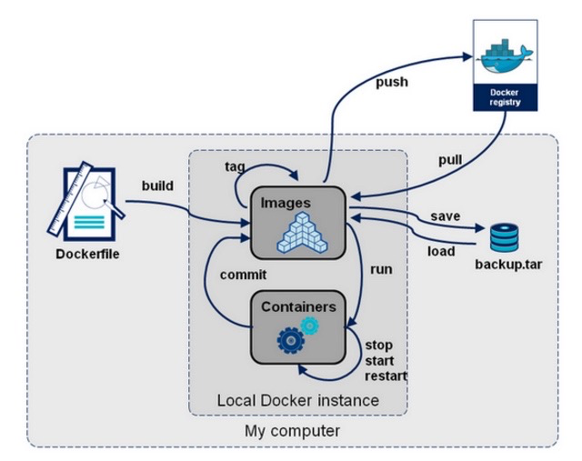
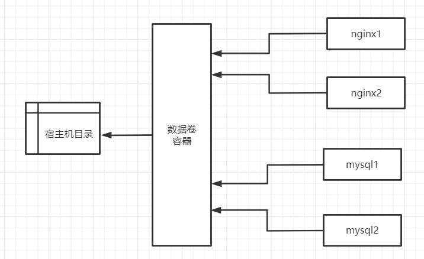
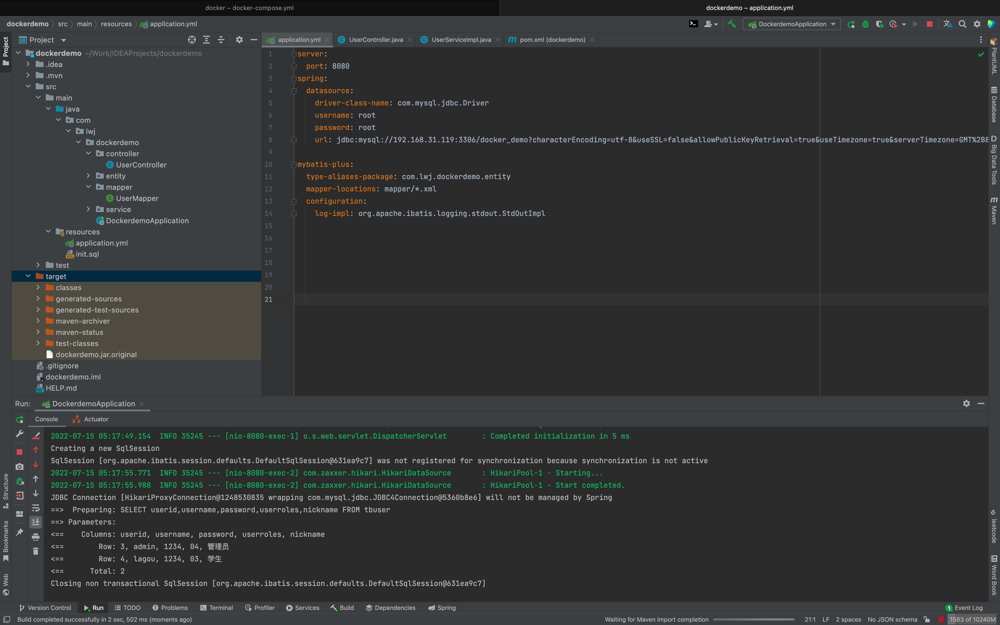
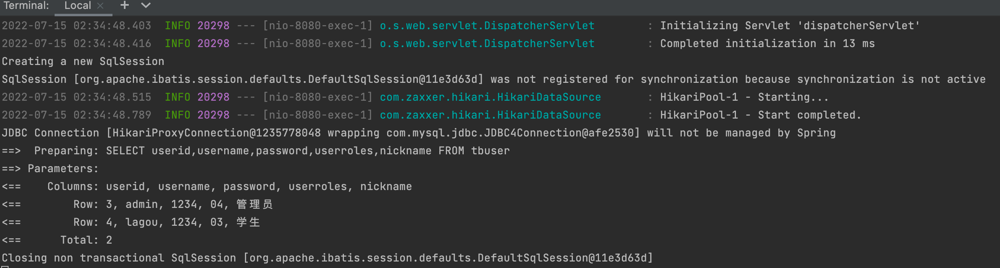

# docker介绍

[https://hub.docker.com/](https://hub.docker.com/)

[不要轻易使用 Alpine 镜像来构建 Docker 镜像](https://cloud.tencent.com/developer/article/1632733)

## docker与传统虚拟化区别

| 特性     | 容器               | 虚拟机     |
| -------- | ------------------ | ---------- |
| 启动速度 | 秒级               | 分钟级     |
| 性能     | 接近原生           | 较弱       |
| 内存代价 | 很小               | 较多       |
| 硬盘使用 | 一般为MB           | 一般为GB   |
| 运行密度 | 单机支持上千个容器 | 一般几十个 |
| 隔离性   | 安全隔离           | 完全隔离   |
| 迁移性   | 优秀               | 一般       |

传统的虚拟机是硬件级别的虚拟化，而容器则是操作系统级别的虚拟化。这种虚拟化技术更轻量级，它所需要的资源更少，比如运行所需的操作系统，只需要有关键的系统内核即可，不用安装很多其他的东西，所以一个dokcer镜像可以很小。

虚拟机是操作系统级别的资源隔离，而容器 本质上是进程级的资源隔离。

## docker基本组成

docker主机(Host)：安装了Docker程序的机器（Docker直接安装在操作系统之上）

docker仓库(Registry)：用来保存各种打包好的软件镜像；仓库分为公有仓库和私有仓库。(很类似 maven)

docker镜像(Images)：软件打包好的镜像；放在docker仓库中

docker容器(Container)：镜像启动后的实例称为一个容器；容器是独立运行的一个或一组应用

> 镜像就像Java中的类，而容器就好比由类产生的对象，一个镜像可以创建多个容器   da t

## docker命令分类

- Docker环境信息 — docker [info|version] 
- 容器生命周期管理 — docker [create|exec|run|start|stop|restart|kill|rm|pause|unpause]
- 容器操作管理 — docker [ps|inspect|top|attach|wait|export|port|rename|stat] 
- 容器rootfs命令 — docker [commit|cp|diff]
- 镜像仓库 — docker [login|pull|push|search] 
- 本地镜像管理 — docker [build|images|rmi|tag|save|import|load]
- 容器资源管理 — docker [volume|network]
- 系统日志信息 — docker [events|history|logs]

从docker命令使用出发，梳理出如下命令结构图：



# 镜像相关命令

## search 搜索镜像 

建议官网搜索，并阅读相关使用文档 [https://hub.docker.com/](https://hub.docker.com/)

```
docker search nginx

NAME（名称）                                       DESCRIPTION（描述）                               STARS     OFFICIAL   AUTOMATED
nginx                                             Official build of Nginx.                        17082     [OK]
linuxserver/nginx                                 An Nginx container, brought to you by LinuxS…   169
bitnami/nginx                                     Bitnami nginx Docker Image                      136                  [OK]
ubuntu/nginx                                      Nginx, a high-performance reverse proxy & we…   52
bitnami/nginx-ingress-controller                  Bitnami Docker Image for NGINX Ingress Contr…   19                   [OK]
```

## pull 拉取镜像

```
docker pull 镜像名称
```

## images 查看已有镜像

```
docker images
docker image ls
```

各个选项说明:

- REPOSITORY：表示镜像的仓库源 
- TAG：镜像的标签
-  IMAGE ID：镜像ID 
- CREATED：镜像创建时间  
- SIZE：镜像大小

```
REPOSITORY   TAG       IMAGE ID       CREATED        SIZE
nginx        latest    605c77e624dd   6 months ago   141MB
mysql        8.0       3218b38490ce   6 months ago   516MB
```

## save 导出镜像

```
docker save tomcat:9.0.20-jre8-alpine -o tomcat9.tar 
docker save tomcat:9.0.20-jre8-slim > tomcat9.slim.tar
```

- -o:输出到的文件

## load 导入镜像

```
docker load -i linux.tar 
docker load < tomcat9.0.20.tar

```

- --input , -i： 指定导入的文件。
- --quiet , -q：精简输出信息。 

## inspect 检查镜像

通过 docker inspect 命令，我们可以获取镜像的详细信息，其中，包括创建者，各层的数字摘要 等。

docker inspect 返回的是 JSON格式的信息，如果您想获取其中指定的一项内容，可以通过 -f 来指 定，如获取镜像大小。

```
docker inspect tomcat:9.0.20-jre8-alpine

docker inspect -f {{".Size"}} tomcat:9.0.20-jre8-alpine
```

## history 查看镜像卷

一个镜像是由多个层组成的，通过 docker history命令，可以列出各个层的创建信息，例如：查看 tomcat:9.0.20-jre8-alpine的各层 信息

```
docker history tomcat:9.0.20-jre8-alpine
```

## tag 标记镜像

标记本地镜像，将其归入某一仓库，也可以用来修改镜像名称

```
docker tag nginx:stable-alpine nginx:alpine 
```

## rmi 删除镜像

通过如下3种方式都可以删除镜像：

```
docker rmi tomcat:9.0.20-jre8-alpine

docker image rm tomcat:9.0.20-jre8-alpine
```

常用参数

- -f, -force : 强制删除镜像，即便有容器引用该镜像；
- -no-prune  : 不要删除未带标签的父镜像；

除了通过标签名称来删除镜像，我们还可以通过制定镜像 ID, 来删除镜像。一旦制定了通过 ID 来删除镜 像，它会先尝试删除所有指向该镜像的标签，然后在删除镜像本身。

```
docker rmi ee7cbd482336
```

- 推荐通过image的名称删除镜像 
- image的ID在终端长度未完全显示，ID值会出现重复

# 容器相关命令

## run 新建并启动容器 

**语法：**

```
docker run [OPTIONS] IMAGE [COMMAND] [ARG...]
```

**运行容器：**

```
docker run -it --rm -p 8080:8080 tomcat:9.0.20-jre8-alpine
```

**常用参数：**

- -d, --detach=false: 后台运行容器，并返回容器ID

- -i, --interactive=false: 以交互模式运行容器，通常与 -t 同时使用 
- -P, --publish-all=false: 随机端口映射，容器内部端口随机映射到主机的端口。不推荐使用该参数
- -p, --publish=[]: 指定端口映射，格式为：主机(宿主)端口:容器端口，推荐各位小伙伴们使用
- -t, --tty=false: 为容器重新分配一个伪输入终端，通常与 -i 同时使用

- --name="nginx-lb": 为容器指定一个名称

- -h , --hostname="laosiji": 指定容器的hostname

- -e , --env=[]: 设置环境变量，容器中可以使用该环境变量，每个变量写一次 -e

- --net="bridge": 指定容器的网络连接类型，支持 bridge/host/none/container: 四种类型

- --link=[]: 添加链接到另一个容器；不推使用该参数
- -v, --volume : 绑定一个卷

- --privileged=false: 指定容器是否为特权容器，特权容器拥有所有的capabilities

- --restart=no：指定容器停止后的重启策略 no：容器退出时不重启 on-failure：容器故障退出（返回值非零）时重启 always：容器退出时总是重启,推荐使用
- --rm=false: 指定容器停止后自动删除容器,不能以docker run -d启动的容器

## logs 查看容器日志

```
docker logs [OPTIONS] CONTAINER
```

执行命令

```
docker run -itd --name tomcat9 -p 8080:8080 tomcat:9.0.20-jre8-alpine

docker logs -f tomcat9
```

常用参数

- -f : 跟踪日志输出

- --tail :仅列出最新N条容器日志

## exec 进入容器

docker exec ：在运行的容器中执行命令。早期有attach命令，对于阻塞命令会等待，所以不方便。在 Docker 1.3.0后提供了exec 可以在容器内直接执行任意命令

语法

```
docker exec [OPTIONS] CONTAINER COMMAND [ARG...]
```

执行命令

有bash命令的linux系统：例如centos

```
docker run -it --name tomcat9.1 -p 8080:8080 tomcat:9.0.20-jre8-slim 
docker exec -it tomcat9.1 /bin/bash
```

没有bash命令的linux系统：例如alpine系统

```
docker run -it --name tomcat9.2 -p 8081:8080 tomcat:9.0.20-jre8-alpine 

docker exec -it tomcat9.2 sh 
```

常用参数

- -i :即使没有附加也保持STDIN 打开
- -t :分配一个伪终端

## inspect 查看容器详细信息

```
docker inspect [OPTIONS] NAME|ID [NAME|ID...]
```

执行命令

```
docker run -it --name tomcat9 -p 8081:8080 tomcat:9.0.20-jre8-alpine

docker inspect tomcat9
```

常用参数

- -f :指定返回值的模板文件。
- -s :显示总的文件大小。

- --type :为指定类型返回JSON。

## rm 删除容器

docker rm ：删除一个或多个容器。

docker rm命令只能删除处于终止或退出状态的容器，并不能删除 还处于运行状态的容器 

```
docker rm [OPTIONS] CONTAINER [CONTAINER...]
```

执行命令

```
docker run -itd --name tomcat9 -p 8080:8080 tomcat:9.0.20-jre8-alpine
```

需要先停止运行中的容器再删除，否则无法删除容器

```
docker stop tomcat9
```

按照容器名称删除

```
docker rm tomcat9
```

按照容器ID删除

```
docker rm 8dd95a95e687
```

常用参数

- -f :通过 SIGKILL 信号强制删除一个运行中的容器。

- -l :移除容器间的网络连接，而非容器本身。

- -v :删除与容器关联的卷。

## ps 查看容器列表

查看运行中的容器

```
docker ps 
```

查看所有容器

```
docker ps -a 
```

输出详情介绍： 

- CONTAINER ID: 容器 ID。

- IMAGE: 使用的镜像。 

- COMMAND: 启动容器时运行的命令。

- CREATED: 容器的创建时间。 

- STATUS: 容器状态。

  状态有7种：created（已创建） restarting（重启中） running（运行中） removing（迁移中） paused（暂停） exited（停止） dead（死亡）

- PORTS: 容器的端口信息和使用的连接类型（tcp\udp）。

- NAMES: 容器名称。

常用参数

- -a :显示所有的容器，包括未运行的。
- -q :只显示容器ID。

## create 创建容器

创建一个新的容器但不启动它。用法同 docker run命令。 不常用

语法

```
docker create [OPTIONS] IMAGE [COMMAND] [ARG...]
```

执行命令

```
docker create -it --name tomcat9 -p 8080:8080 9.0.20-jre8-alpine 
```

大部分参数用法与docker run命令参数相同


## start 启动容器

docker start :启动一个或多个已经被停止的容器

```
docker start [OPTIONS] CONTAINER [CONTAINER...] 

docker start tomcat9
```


## stop 停止容器

 docker stop :停止一个运行中的容器 

```
docker stop [OPTIONS] CONTAINER [CONTAINER...] 

docker stop tomcat9 
```


## restart 重启容器

docker restart :重启容器 

```
docker restart [OPTIONS] CONTAINER [CONTAINER...]

docker restart tomcat9
```


## update 更新容器

可以动态地更新容器配置。可以更新一个或多个容器配置。多个容器名称或ID之间使 用空格分隔。但update命令不是很成熟，有很多配置项不能动态更新。推荐大家还是rm容器后，再重 新run一个新的镜像，不推荐使用

语法

```
docker update [OPTIONS] CONTAINER [CONTAINER...]
```

执行命令

```
docker run -it --name tomcat9 -p 8081:8080 tomcat:9.0.20-jre8-alpine
```

更新容器restart策略

```
docker update --restart always tomcat9 
```

## rename 重命名容器

```
docker rename 原容器名  新容器名
```

## kill 杀掉容器

杀掉一个运行中的容器。

语法

```
docker kill [OPTIONS] CONTAINER [CONTAINER...]
```

执行命令

```
docker kill tomcat9 
```

常用参数

- -s :向容器发送一个信号

## 实用技巧

停止所有运行容器

```
docker stop $(docker ps -qa) 
```

删除所有的容器 

```
docker rm $(docker ps -aq) docker rm $(docker stop $(docker ps -q)) 
```

删除所有的镜像 

```
docker rmi $(docker images -q)
```

# docker 网络相关

## docker 网络理论

docker使用Linux桥接网卡，在宿主机虚拟一个docker容器网桥(docker0)，docker启动一个容器时会根 据docker网桥的网段分配给容器一个IP地址，称为Container-IP，同时docker网桥是每个容器的默认网 关。因为在同一宿主机内的容器都接入同一个网桥，这样容器之间就能够通过容器的Container-IP直接 通信。

docker网桥是宿主机虚拟出来的，并不是真实存在的网络设备，外部网络是无法寻址到的，这也意味着 外部网络无法通过直接Container-IP访问到容器。如果容器希望外部访问能够访问到，可以通过映射容 器端口到宿主主机（端口映射），即docker run创建容器时候通过 -p 或 -P 参数来启用，访问容器的时 候就通过[宿主机IP]:[容器端口]访问容器。

注意，以上是linux平台的实现，在mac 平台上的实现存在差异性。

Docker For Mac的实现和标准Docker规范有区别，Docker For Mac的Docker Daemon是运行于虚拟机(xhyve)中的，而不是像Linux上那样作为进程运行于宿主机，因此Docker For Mac没有docker0网桥，不能实现host网络模式，host模式会使Container复用Daemon的网络栈(在xhyve虚拟机中)，而不是与Host主机网络栈，这样虽然其它容器仍然可通过xhyve网络栈进行交互，但却不是用的Host上的端口(在Host上无法访问)。bridge网络模式 -p 参数不受此影响，它能正常打开Host上的端口并映射到Container的对应Port。

使用命令查看docker网络部分：

```
docker info
```

## 网络模式

常用的网络模式，bridge是最常用的。

| Docker网络模式  | 配置                       | 说明                                                         |
| --------------- | -------------------------- | ------------------------------------------------------------ |
| bridge模式      | –net=bridge                | （默认为该模式）。此模式会为每一个容器分 配、设置IP等， 并将容器连接到一个docker0虚拟网桥，通过 docker0网桥 以及Iptables nat表配置与宿主机通信。 |
| host模式        | --net=host                 | 容器和宿主机共享Network namespace。 容器将不会虚拟出自己的网卡，配置自己的IP 等， 而是使用宿主机的IP和端口。 |
| none模式        | –net=none                  | 容器有独立的Network namespace，并没有对 其进行任何网络设置， 如分配veth pair 和网桥连接，配置IP等。 该模式关闭了容器的网络功能。 |
| container模 式  | – net=container:NAME_or_ID | 容器和另外一个容器共享Network namespace。 kubernetes中的pod就是多个容器共享一个 Network namespace。 创建的容器不会创建自己的网卡，配置自己的 IP， 而是和一个指定的容器共享IP、端口范围。 |
| Macvlan network | 无                         | 容器具备Mac地址，使其显示为网络上的物理 设备                 |
| Overlay         | 无                         | (覆盖网络）： 利用VXLAN实现的bridge模式                      |

### bridge模式

默认的网络模式。bridge模式下容器没有一个公有ip，只有宿主机可以直接访问，外部主机是不可见的，但容器通过宿主机的NAT规则后可以访问外网。

Bridge 桥接模式的实现步骤主要如下：

- Docker Daemon 利用 veth pair 技术，在宿主机上创建两个虚拟网络接口设备，假设为veth0 和 veth1。而veth pair 技术的特性可以保证无论哪一个 veth 接收到网络报文，都会将报文传输给另 一方。
- Docker Daemon 将 veth0 附加到 Docker Daemon 创建的 docker0网桥上。保证宿主机的网络报 文可以发往 veth0。
- Docker Daemon 将 veth1 添加到 Docker Container 所属的 namespace 下，并被改名为eth0。 如此一来，保证宿主机的网络报文若发往 veth0，则立即会被 eth0 接收，实现宿主机到Docker Container网络的联通性；同时，也保证 Docker Container 单独使用 eth0，实现容器网络环境的 隔离性。

**Bridge桥接模式的缺陷：**

1. 最明显的是，该模式下 Docker Container 不具有一个公有 IP，即和宿主机的 eth0 不处于同一个网段。导致的结果是宿主机以外的世界不能直接和容器进行通信。
2. 虽然 NAT 模式经过中间处理实现了这一点，但是 NAT 模式仍然存在问题与不便，如：容器均需要在 宿主机上竞争端口，容器内部服务的访问者需要使用服务发现获知服务的外部端口等。
3. 另外 NAT 模式由于是在三层网络上的实现手段，故肯定会影响网络的传输效率。

**注意：**

veth设备是成双成对出现的，一端是容器内部命名为eth0，一端是加入到网桥并命名的veth（通常命名 为veth），它们组成了一个数据传输通道，一端进一端出，veth设备连接了两个网络设备并实现了数据 通信。

### host模式

相当于Vmware中的NAT模式，与宿主机在同一个网络中，但没有独立IP地址。

如果启动容器的时候使用host模式，那么这个容器将不会获得一个独立的Network Namespace，而是 和宿主机共用一个Network Namespace。容器将不会虚拟出自己的网卡，配置自己的IP等，而是使用宿 主机的IP和端口。但是，容器的其他方面，如文件系统、进程列表等还是和宿主机隔离的。

使用host模式的容器可以直接使用宿主机的IP地址与外界通信，容器内部的服务端口也可以使用宿主机 的端口，不需要进行NAT，host最大的优势就是网络性能比较好，但是docker host上已经使用的端口就 不能再用了，网络的隔离性不好。

host网络模式需要在容器创建时指定–network=host host 模式是 bridge 桥接模式很好的补充。采用 host 模式的 Docker Container，可以直接使用宿主机 的 IP地址与外界进行通信，若宿主机的 eth0 是一个公有 IP，那么容器也拥有这个公有IP。同时容器内 服务的端口也可以使用宿主机的端口，无需额外进行 NAT 转换。

host模式可以让容器共享宿主机网络栈,这样的好处是外部主机与容器直接通信,但是容器的网络缺少隔离 性。 

**Host 网络模式的缺陷：**

 最明显的是 Docker Container 网络环境隔离性的弱化。即容器不再拥有隔离、独立的网络环境。 

使用 host 模式的 Docker Container 虽然可以让容器内部的服务和传统情况无差别、无改造的使 用，但是由于网络隔离性的弱化，该容器会与宿主机共享竞争网络栈的使用； 

容器内部将不再拥有所有的端口资源，原因是部分端口资源已经被宿主机本身的服务占用，还有 部分端口已经用以 bridge 网络模式容器的端口映射。

### Container网络模式

一种特殊host 网络模式

Container 网络模式是 Docker 中一种较为特别的网络的模式。在容器创建时使用network=container:vm1指定。(vm1指定的是运行的容器名)

处于这个模式下的 Docker 容器会共享一个网络环境,这样两个容器之间可以使用localhost高效快速通信。

缺陷：它并没有改善容器与宿主机以外世界通信的情况（和桥接模式一样，不能连接宿主机以外的其他 设备）。

这个模式指定新创建的容器和已经存在的一个容器共享一个 Network Namespace，而不是和宿主机共 享。新创建的容器不会创建自己的网卡，配置自己的 IP，而是和一个指定的容器共享 IP、端口范围等。 同样，两个容器除了网络方面，其他的如文件系统、进程列表等还是隔离的。两个容器的进程可以通过 lo 网卡设备通信。

### none模式

使用none模式，Docker容器拥有自己的Network Namespace，但是，并不为Docker容器进行任何网 络配置。也就是说，这个Docker容器没有网卡、IP、路由等信息。需要我们自己为Docker容器添加网 卡、配置IP等。

这种网络模式下容器只有lo回环网络，没有其他网卡。none模式可以在容器创建时通过-network=none来指定。这种类型的网络没有办法联网，封闭的网络能很好的保证容器的安全性。

### overlay 网络模式

Overlay 网络，也称为覆盖网络。主要用于docker集群部署。 Overlay 网络的实现方式和方案有多种。Docker自身集成了一种，基于VXLAN隧道技术实现。

Overlay 网络主要用于实现跨主机容器之间的通信。 应用场景：需要管理成百上千个跨主机的容器集群的网络时

### macvlan 网络模式

macvlan网络模式，最主要的特征就是他们的通信会直接基于mac地址进行转发。

这时宿主机其实充当一个二层交换机。Docker会维护着一个MAC地址表，当宿主机网络收到一个数据包 后，直接根据mac地址找到对应的容器，再把数据交给对应的容器。

容器之间可以直接通过IP互通，通过宿主机上内建的虚拟网络设备（创建macvlan网络时自动创建）， 但与主机无法直接利用IP互通。

应用场景：由于每个外来的数据包的目的mac地址就是容器的mac地址，这时每个容器对于外面网络来 说就相当于一个真实的物理网络设备。因此当需要让容器来的网络看起来是一个真实的物理机时，使用 macvlan模式

Macvlan是一个新的尝试，是真正的网络虚拟化技术的转折点。Linux实现非常轻量级，因为与传统的 Linux Bridge隔离相比，它们只是简单地与一个Linux以太网接口或子接口相关联，以实现网络之间的分 离和与物理网络的连接。

Macvlan提供了许多独特的功能，并有充足的空间进一步创新与各种模式。这些方法的两个高级优点是 绕过Linux网桥的正面性能以及移动部件少的简单性。删除传统上驻留在Docker主机NIC和容器接口之间 的网桥留下了一个非常简单的设置，包括容器接口，直接连接到Docker主机接口。由于在这些情况下没 有端口映射，因此可以轻松访问外部服务。

Macvlan Bridge模式每个容器都有唯一的MAC地址，用于跟踪Docker主机的MAC到端口映射。 Macvlan驱动程序网络连接到父Docker主机接口。示例是物理接口，例如eth0，用于802.1q VLAN标记 的子接口eth0.10（.10代表VLAN 10）或甚至绑定的主机适配器，将两个以太网接口捆绑为单个逻辑接 口。 指定的网关由网络基础设施提供的主机外部。 每个Macvlan Bridge模式的Docker网络彼此隔离， 一次只能有一个网络连接到父节点。

每个主机适配器有一个理论限制，每个主机适配器可以连接一个Docker网络。 同一子网内的任何容器都 可以与没有网关的同一网络中的任何其他容器进行通信macvlan bridge。 相同的docker network命令 适用于vlan驱动程序。 在Macvlan模式下，在两个网络/子网之间没有外部进程路由的情况下，单独网络 上的容器无法互相访问。这也适用于同一码头网络内的多个子网。

## bridge网络

bridge网络表现形式就是docker0这个网络接口。容器默认都是通过 docker0这个接口进行通信。也可以通过docker0去和本机的以太网接口连接，这样容器内部才能访问互 联网。

```
查看docker0网络，在默认环境中，一个名为docker0的linux bridge自动被创建好了，其上有一个 docker0 内部接口，IP地址为172.17.0.1/16 
ip a

查看docker 网络 
docker network ls

查看bridge网络详情。主要关注Containers节点信息。
docker network inspect bridge 
```

**运行镜像**

```
docker run -itd --name nginx1 nginx:1.19.3-alpine

查看bridge网络详情。主要关注Containers节点信息。发现nginx1容器默认使用bridge网络

docker network inspect bridge
```

**容器创建时IP地址的分配**

```
查看宿主机网络。发现多出一块网卡veth62aef5e@if8
ip a  /  ifconfig
```

Docker 创建一个容器的时候，会执行如下操作：

- 创建一对虚拟接口/网卡，也就是veth pair，分别放到本地主机和新容器中；

- 本地主机一端桥接到默认的 docker0 或指定网桥上，并具有一个唯一的名字，如 vetha596da4；

- 容器一端放到新容器中，并修改名字作为 eth0，这个网卡/接口只在容器的名字空间可见；

- 从网桥可用地址段中（也就是与该bridge对应的network）获取一个空闲地址分配给容器的 eth0，并 配置默认路由到桥接网卡 vetha596da4。 

完成这些之后，容器就可以使用 eth0 虚拟网卡来连接其他容器和其他网络。 如果不指定--network，创建的容器默认都会挂到 docker0 上，使用本地主机上 docker0 接口的 IP 作为 所有容器的默认网关。

```
第一种方式：

docker exec -it nginx1 sh ip a 

第二种方式：

docker exec -it nginx1 ip a
```

```
linux下安装brctl，方便查看桥接相关信息
yum install -y bridge-utils

运行命令
brctl show
```

###  **多容器之间通讯**

```
docker run -itd --name nginx1 nginx:1.19.3-alpine

docker run -itd --name nginx2 nginx:1.19.3-alpine

docker network inspect bridge

docker exec -it nginx1 sh 

ping 172.17.0.2 //ok

docker exec -it nginx2 sh 

ping 172.17.0.2 //ok

ping www.baidu.com  //ok

ping nginx1 //fail 通过容器的名称去ping也失败了
```

### **容器IP地址会发生变化**

```
docker stop nginx1 nginx2

先启动nginx2，在启动nginx1

docker start nginx2

docker start nginx1

主要查看Containers中的信息，发现ip地址会重新分配，在搭建容器集群时需要注意
docker network inspect bridge 
```

针对容器ip地址变化的问题，有两种解决方式：

1. 通过容器名称去定位一个容器，而非ip地址，如link容器 和创建自定义的bridge网络
2. 通过设置来固定容器对应的ip地址

### link容器

在创建容器的时候有一个 --link 参数，可以链接另一个容器，不推荐使用该参数，不安全。

使用link的场景：在企业开发环境中，我们有一个mysql的服务的容器mysql_1，还有一个web应用程序 web_1，肯定web_1这台容器肯定要连接mysql_1这个数据库。前面网络命名空间的知识告诉我们，两 个容器需要能通信，需要知道对方的具体的IP地址。生产环境还比较好，IP地址很少变化，但是在我们 内部测试环境，容器部署的IP地址是可能不断变化的，所以，开发人员不能在代码中写死数据库的IP地 址。此时就可以利用容器之间link来解决这个问题。

下面，我们来介绍如何通过容器名称来 进行ping，而不是通过IP地址。

```
docker run -itd --name nginx2 --link mysql_1 nginx:1.19.3-alpine

docker exec -it nginx2 sh 

ping 172.17.0.2 //ok

ping www.baidu.com  //ok

ping mysql_1 //ok
```

上面link命令，是在nginx2容器启动时link到mysql_1容器，因此，在nginx2容器里面可以ping通 mysql_1容器名，link的作用相当于添加了DNS解析。

这里提醒下，在mysql_1容器里去ping nginx2 容器是不通的，因为link关系是单向的，不可逆。 

实际工作中，docker官网已经不推荐我们使用link参数。 docker用其他方式替换掉link参数

### 自定义bridge网络

```
docker network create -d bridge nginx-bridge
```

上面命令参数-d 是指DRIVER的类型，后面的nginx-bridge是network的自定义名称，这个和docker0是 类似的。

下面开始介绍，如何把容器连接到nginx-bridge这个网络。

启动一个nginx的容器nginx3，并通过参数network connect来连接nginx-bridge网络。

```
docker run -itd --name nginx3 --network nginx-bridge nginx:1.19.3-alpine 


docker network inspect nginx-bridge
```

把一个运行中容器连接到lagou-bridge网络

```
docker network connect nginx-bridge nginx2 

docker network inspect nginx-bridge

docker exec -it nginx2 sh 
ping nginx3 //ok

docker exec -it nginx3 sh 
ping nginx2 //ok
```

这样配置文件里可以直接配置其他容器的名称即可定位到对应容器

### 创建容器时固定ip

```
docker network create -d bridge --subnet=172.172.0.0/24 nginx-network --gateway 172.172.0.1
docker run -itd --name nginx3 -p 80:80 --net nginx-network --ip 172.172.0.10 nginx:1.19.3-alpine

--net mynetwork:选择存在的网络
--ip 172.172.0.10:给nginx分配固定的IP地址
```

## none网络

启动一个ngnix的容器nginx1，并且连接到none网络。然后查看器信息

```
docker run -itd --name nginx1 --network none nginx:1.19.3-alpine

docker network inspect none
```

注意，容器使用none模式，是没有物理地址和IP地址。我们可以进入到nginx1容器里，执行ip a命令看 看。只有一个lo接口，没有其他网络接口，没有IP。也就是说，使用none模式，这个容器是不能被其他 容器访问。这种使用场景很少，只有项目安全性很高的功能才能使用到。例如：密码加密算法容器。

## host网络

none网络模式特点就是，容器没有IP地址，不能和其他容器通信。下面来看看host网络是什么 特点。

我们使用前面命令，启动一个nginx的nginx2容器，连接到host网络。

然后docker network inspect host, 看看容器信息。

```
docker run -itd --name nginx2 --network host nginx:1.19.3-alpine

docker network inspect host
// show
"Containers": {
	"d9790906a5603110a5b1075b07c6370c025536193e60a76ac10580e519ab33eb": {
		"Name": "nginx0",
		"EndpointID": "87e58d7815760854d891822ef242d9e4d867d52020eedd6e9c409c315548c22d",
		"MacAddress": "",
		"IPv4Address": "",
		"IPv6Address": ""
	}
},
```

容器不显示IP地址。那么是不是和none一样，肯定不是，不然也不会设计none和host网络进 行区分。下面我们进入nginx2容器，执行ip a看看效果。我们在容器里执行ip a，发现打印内容和在 linux本机外执行ip a是一样的。

```
docker exec -it nginx2 sh

 ip a
```

容器使用了host模式，则和外层linux主机共享一套网络接口。VMware公司的虚 拟机管理软件，其中网络设置，也有host这个模式，作用也是一样，虚拟机里面使用网络和你自己外层 机器是一模一样的。这种容器和本机使用共享一套网络接口，缺点还是很明显的，例如我们知道web服 务器一般端口是80，共享了一套网络接口，那么你这台机器上只能启动一个nginx端口为80的服务器 了。否则，出现端口被占用的情况。


# 网络相关命令

```
docker network --help

Usage:  docker network COMMAND

Manage networks

Commands:
  connect     Connect a container to a network
  create      Create a network
  disconnect  Disconnect a container from a network
  inspect     Display detailed information on one or more networks
  ls          List networks
  prune       Remove all unused networks
  rm          Remove one or more networks
```


## ls 查看网络列表

查看已经建立的网络对象 

```
docker network ls [OPTIONS] 
```

- -f, --filter filter 过滤条件(如 'driver=bridge’) 
- --format string 格式化打印结果
- --no-trunc 不缩略显示
- -q, --quiet  只显示网络对象的ID

注意： 默认情况下，docker安装完成后，会自动创建bridge、host、none三种网络驱动 

```
docker network ls 
docker network ls --no-trunc 
docker network ls -f 'driver=host'
```

## create创建网络

创建新的网络对象

```
docker network create [OPTIONS] NETWORK 
```

- -d, --driver string 指定网络的驱动(默认 "bridge")
- --subnet strings 指定子网网段(如192.168.0.0/16、172.88.0.0/24)
- --ip-range strings 执行容器的IP范围，格式同subnet参数
- --gateway strings 子网的IPv4 or IPv6网关，如(192.168.0.1) 

host和none模式网络只能存在一个；docker自带的overlay 网络创建依赖于docker swarm(集群负载均衡)服务

192.168.0.0/16 等于 192.168.0.0~192.168.255.255；172.88.0.0/24 等于 172.88.0.0~172.88.0.255 

```
 docker network ls 
 docker network create -d bridge my-bridge 
 docker network ls
```


## rm 删除网络

删除一个或多个网络 

```
docker network rm NETWORK [NETWORK...] 
```


## inspect 查看网络详细信息

查看网络详细信息 

```
docker network inspect
```

查看一个或多个网络的详细信息

```
docker network inspect [OPTIONS] NETWORK [NETWORK...]
```

- -f, --format string 根据format输出结果 


## connect/disconnect 网络连接与断开

网络连接与断开 

```
 docker network connect/disconnect
```

将指定容器与指定网络进行连接或者断开连接 

```
docker network disconnect [OPTIONS] NETWORK CONTAINER # 命令参数(OPTIONS)：
```

- -f, --force 强制断开连接(用于disconnect)

## 网络小练习

```
docker network create -d bridge --subnet=172.172.0.0/24 nginx-network --gateway 172.172.0.1

// 172.172.0.0/24:   24 代表子码掩码是255.255.255.0

// 172.172.0.0/16:   16 代表子码掩码255.255.0.0

docker network ls

docker run -itd --name nginx3 -p 80:80 --net nginx-network --ip 172.172.0.10 nginx:1.19.3-alpine
--net mynetwork:选择存在的网络
--ip 172.172.0.10:给nginx分配固定的IP地址

docker network inspect nginx-network docker stop nginx3
docker start nginx3
docker network inspect nginx-network
```

# 数据卷 volume

当我们在使用docker容器的时候，会产生一系列的数据文件，这些数据文件在我们删除docker容器时是 会消失的，但是其中产生的部分内容我们是希望能够把它给保存起来另作用途的，Docker将应用与运行 环境打包成容器发布，我们希望在运行过程钟产生的部分数据是可以持久化的的，而且容器之间我们希 望能够实现数据共享。

通俗地来说，docker容器数据卷可以看成使我们生活中常用的u盘，它存在于一个或多个的容器中，由 docker挂载到容器，但不属于联合文件系统，Docker不会在容器删除时删除其挂载的数据卷。

特点：

1. 数据卷可以在容器之间共享或重用数据

2. 数据卷中的更改可以立即生效

3. 数据卷中的更改不会包含在镜像的更新中

4. 数据卷默认会一直存在，即使容器被删除

5. 数据卷的生命周期一直持续到没有容器使用它为止

容器中的管理数据主要有两种方式：

数据卷：Data Volumes 容器内数据直接映射到本地主机环境 

数据卷容器：Data Volume Containers 使用特定容器维护数据卷

## cp 数据拷贝

在没有数据卷的时候，如果我们想备份容器里的数据，需要手动去将容器里的数据拷贝出来，cp 命令就是用来完成宿主机和容器之间的数据拷贝。

```
宿主机文件复制到容器内

docker cp [OPTIONS] SRC_PATH CONTAINER:DEST_PATH

容器内文件复制到宿主机

docker cp [OPTIONS] CONTAINER:SRC_PATH DEST_PATH
```

**常用参数**

- -L :保持源目标中的链接

```
宿主机文件 copy to 容器内
docker cp /data/index.html nginx:/usr/share/nginx/html/index.html

容器内文件 copy to 宿主机
docker cp nginx:/etc/nginx/nginx.conf /data
```

## 数据卷

虽然cp命令可以实现数据的拷贝，但是过于麻烦了，数据卷就可以实现容器删除，但是数据卷的内容还可以继续保留。

### 数据卷类型

有三种数据卷类型：

1. 宿主机数据卷：直接在宿主机的文件系统中但是容器可以访问（bind mount）

2. 命名的数据卷：磁盘上Docker管理的数据卷，但是这个卷有个名字。

3. 匿名数据卷：磁盘上Docker管理的数据卷，因为没有名字想要找到不容易，Docker来管理这些文 件。

数据卷其实都在（如果没有网络文件系统等情况下）宿主机文件系统里面的，只是第一种是在宿主机内 的特定目录下，而后两种则在docker管理的目录下，这个目录一般是 /var/lib/docker/volumes/

推荐使用 **宿主机数据卷** 方式持久化数据。

### 宿主机数据卷

bind mounts：容器内的数据被存放到宿主机文件系统的任意位置，甚至存放到一些重要的系统目录或文件中。除了docker之外的进程也可以任意对他们进行修改。

当宿主机的目录或文件被挂载到容器中。容器将按照挂载目录或文件的绝对路径 来使用或修改宿主机的数据。宿主机中的目录或文件不需要预先存在，在需要的使用会自动创建。

使用bind mounts在性能上是非常好的，但这依赖于宿主机有一个目录妥善结构化的文件系统。

使用bind mounts的容器可以在通过容器内部的进程对主机文件系统进行修改，包括创建，修改和删除 重要的系统文件和目录，这个功能虽然很强大，但显然也会造成安全方面的影响，包括影响到宿主机上 Docker以外的进程

**数据覆盖问题**

如果挂载一个空的数据卷到容器中的一个非空目录中，那么这个目录下的文件会被复制到数据卷中 。

如果挂载一个非空的数据卷到容器中的一个目录中，那么容器中的目录会显示数据卷中的数据。容器中原来的内容会被隐藏。

```
docker run -v  /宿主机绝对路径目录:/容器内目录 镜像名
```

```
docker pull mysql:5.7.31

docker run -itd --name mysql --restart always --privileged=true -p 3306:3306 -e MYSQL_ROOT_PASSWORD=admin -v /data/mysql:/var/lib/mysql mysql:5.7.31 --character-set-server=utf8mb4 --collation-server=utf8mb4_unicode_ci
```

上面的 `-v /data/mysql:/var/lib/mysql` 就是将宿主机的 `/data/mysql`目录挂载到容器的 `/var/lib/mysql`中。

这里还需注意的是宿主机的目录可能需要权限，所以推荐还是先创建好目录后再进行数据挂载。

**容器目录权限** 

```
通过 -v 容器内路径： ro rw 改变读写权限

ro:readonly 只读 rw:readwrite 可读可写

docker run -it -v /宿主机绝对路径目录:/容器内目录:ro 镜像名 

docker run -it -v /宿主机绝对路径目录:/容器内目录:rw 镜像名

例如： 
docker run -d -P --name nginx05 -v lagouedu1:/etc/nginx:ro nginx 
docker run -d -P --name nginx05 -v lagouedu2:/etc/nginx:rw nginx

ro 只要看到ro就说明这个路径只能通过宿主机来操作，容器内部是无法操作！
```

### 命名数据卷

```
docker run -itd --name nginx -p 80:80 -v volume-name:/etc/nginx nginx:alpine

查看docker数据卷
docker volume ls

查看volume-name宿主机目录，所有的文件docker默认保存在_data目录中
docker volume inspect volume-name
```

### 匿名数据卷

匿名数据卷和命令数据卷区别在于没有定义名称，由docker自动生成

```
docker run -itd --name nginx -p 80:80 -v /etc/nginx nginx:alpine
```


## 数据卷容器

--volumes-from，是docker run 命令的参数。

如果用户需要在多个容器之间共享一些持续更新的数据，最简单的方式是使用数据卷容器。数据卷容器 也是一个容器，但是它的目的是专门用来提供数据卷供其他容器挂载。

注意：这种方式需考虑容器是否需要独占数据卷等因素，不然可能会失败。

发现创建好的数据卷容器是处于停止运行的状态，因为使用--volumes-from 参数所挂载数据卷的容器并不需要保持在运行状态。

基础镜像准备

centos作为数据卷容器

```
docker pull centos:7.8.2003  

docker pull nginx:1.19.3-alpine 

docker pull mysql:5.7.31
```

 

```
docker run -d --name data-volume -v /data/nginx:/usr/share/nginx/html -v /data/mysql:/var/lib/mysql centos:7.8.2003

docker run -itd --name nginx01 -p 80:80 --volumes-from data-volume nginx:1.19.3alpine 

echo "lagouedu nginx" > /data/nginx/index.html 

docker run -itd --name nginx02 -p 81:80 --volumes-from data-volume nginx:1.19.3alpine

docker run -itd --name mysql01 --restart always --privileged=true -p 3306:3306 -e MYSQL_ROOT_PASSWORD=admin --volumes-from data-volume mysql:5.7.31 -character-set-server=utf8 --collation-server=utf8_general_ci

docker run -itd --name mysql02 --restart always --privileged=true -p 3307:3306 -e MYSQL_ROOT_PASSWORD=admin --volumes-from data-volume mysql:5.7.31 -character-set-server=utf8 --collation-server=utf8_general_ci
```

两个nginx容器可以共享数据卷容器当挂载，但是两个mysql容器由于文件的锁相关的问题启动失败，需要进行相关配置。

# docker-Compose 

## 简单介绍

[官网地址](https://docs.docker.com/compose/compose-file/)

之前每次启动容器的时候都是手敲命令，这种方式过于繁琐而且容易出现失误。当我们需要组建多容器部署时更麻烦，不光要考虑容器本身，容器间的启动可能也存在依赖的问题，这就需要一个编排工具来将这些容器，按照设置的参数和顺序来启动， 这就引出了**docker-Compose ** 。

部署和管理繁多的服务是困难的。而这正是 Docker Compose 要解决的问题。Docker Compose 并不 是通过脚本和各种冗长的 docker 命令来将应用组件组织起来，而是通过一个声明式的配置文件描述整 个应用，从而使用一条命令完成部署。应用部署成功后，还可以通过一系列简单的命令实现对其完整声 明周期的管理。甚至，配置文件还可以置于版本控制系统中进行存储和管理。

mac上在安装docker时自动安装了docker-compose，linux上需要手动安装。

附安装方式：

```
下载
https://github.com/docker/compose

授权
mv /data/docker-compose-Linux-x86_64 /usr/local/bin/docker-compose 
cp /data/docker-compose-Linux-x86_64 /usr/local/bin/docker-compose

开发环境可以授予最高权限
chmod 777 /usr/local/bin/docker-compose

检查安装情况以及版本
docker-compose -v docker-compose --version docker-compose version
```

卸载docker-compose

```
docker-compose卸载只需要删除二进制文件就可以了。

rm -rf /usr/local/bin/docker-compose reboot
```

## **docker-compose.yml 配置文件**

[docker-compose文件详解](./docker-compose文件详解.yml)

Docker Compose 使用 YAML 文件来定义多服务的应用。YAML 是 JSON 的一个子集，因此也可以使用 JSON。

Docker Compose 默认使用文件名 docker-compose.yml。当然，也可以使用 -f 参数指定具体文件。 Docker Compose 的 YAML 文件包含 4 个一级 key：version、services、networks、volumes

version 是必须指定的，而且总是位于文件的第一行。它定义了 Compose 文件格式（主要是 API）的版本。注意，version 并非定义 Docker Compose 或 Docker 引擎的版本号。 services 用于定义不同的应用服务。上边的例子定义了两个服务：一个名为 lagou-mysql数据库服 务以及一个名为lagou-eureka的微服。Docker Compose 会将每个服务部署在各自的容器中。 networks 用于指引 Docker 创建新的网络。默认情况下，Docker Compose 会创建 bridge 网络。 这是一种单主机网络，只能够实现同一主机上容器的连接。当然，也可以使用 driver 属性来指定不 同的网络类型。 volumes 用于指引 Docker 来创建新的卷。

```yaml
# docker-compose.yml
version: '3'
services:
  nginx:
    image: nginx:alpine
    container_name: nginx
    restart: always
    ports:
      - "80:80"
      - "8008"
    volumes:
      -  ~/data/nginx/:/etc/nginx
  tomcat1:
    image: tomcat:alpine
    container_name: tomcat1
    restart: always
    ports:
      - "8081:8080"
    volumes:
      - ~/data/tomcat1:/usr/local/tomcat/webapps
    depends_on:
    - nginx
  tomcat2:
    image: tomcat:alpine
    container_name: tomcat2
    restart: always
    ports:
      - "8082:8080"
    volumes:
      - ~/data/tomcat2:/usr/local/tomcat/webapps
    depends_on:
      - nginx

```

## 常用命令汇总

和 docker 容器的命令类似，不多做介绍。

```
启动服务

docker-compose up -d

停止服务

docker-compose down

列出所有运行容器

docker-compose ps 查看服务日志

docker-compose logs

构建或者重新构建服务

docker-compose build

启动服务

docker-compose start

停止已运行的服务

docker-compose stop

重启服务

docker-compose restart
```

# Dockerfile

docker file 可以帮助我们创建自定义的镜像。

Docker 创建镜像主要有三种：

1. 基于已有的镜像创建；

2. 基于 Dockerfile 来创建；

3. 基于本地模板来导入；

## 基于已有的镜像创建

docker commit :从容器创建一个新的镜像

```
docker commit [OPTIONS] CONTAINER [REPOSITORY[:TAG]]
```

常用参数

- -a :提交的镜像作者；
- -c :使用Dockerfile指令来创建镜像；
- -m :提交时的说明文字；
- -p :在commit时，将容器暂停。

示例：

结合docker cp命令自定义nginx的index页面

```
docker run -itd --name nginx -p 80:80 nginx:v1

cd /data echo "hello world" > /data/index.html

docker cp /data/index.html nginx:/usr/share/nginx/html/index.html

curl localhost

docker container commit -m "update index.html file" -a "userName" nginx nginx:v2

docker images

docker rm -f nginx

docker run -itd --name nginx -p 80:80 nginx:v2
```

## 基于 Dockerfile 来创建

**Dockerfile的基本结构**

Dockerfile是一个包含用于组合映像的命令的文本文档。可以使用在命令行中调用任何命令。 

Docker通 过读取Dockerfile中的指令自动生成映像。

docker build命令用于从Dockerfile构建映像。`-f` 可以在docker build命令中使用标志指向文件系统中任意位置的Dockerfile。

Dockerfile由一行行命令语句组成，并且支持以#开头的注释行


**Dockerfile分为四部分**

基础镜像信息、维护者信息、 镜像操作指令和容器启动时执行指令


**Dockerfile文件说明**

Docker以从上到下的顺序运行Dockerfile的指令。为了指定基本映像，第一条指令必须是FROM。

可以在Docker文件中使用 RUN ， CMD ， FROM ， EXPOSE ， ENV 等指令。


**Dockerfile常见命令**

| 命令       | 说明                                                         |
| ---------- | ------------------------------------------------------------ |
| FROM       | 指定基础镜像，必须为第一个命令                               |
| MAINTAINER | 维护者(作者)信息                                             |
| ENV        | 设置环境变量                                                 |
| RUN        | 构建镜像时执行的命令                                         |
| CMD        | 构建容器后调用，也就是在容器启动时才进行调用。               |
| ENTRYPOINT | 指定运行容器启动过程执行命令，覆盖CMD参数 ENTRYPOINT与CMD非常类似，不同的是通过docker run执行的命令不会覆盖 ENTRYPOINT，而docker run命令中指定的任何参数，都会被当做参数再次传递 给ENTRYPOINT。Dockerfile中只允许有一个ENTRYPOINT命令，多指定时会覆 盖前面的设置，而只执行最后的ENTRYPOINT指令。 |
| ADD        | 将本地文件添加到容器中，tar类型文件会自动解压(网络压缩资源不会被解压)， 可以访问网络资源，类似wget |
| COPY       | 功能类似ADD，但是是不会自动解压文件，也不能访问网络资源      |
| WORKDIR    | 工作目录，类似于cd命令                                       |
| ARG        | 用于指定传递给构建运行时的变量                               |
| VOLUMN     | 用于指定持久化目录                                           |
| EXPOSE     | 指定于外界交互的端口                                         |
| USER       | 指定运行容器时的用户名或 UID，后续的 RUN 也会使用指定用户。使用USER指 定用户时，可以使用用户名、UID或GID，或是两者的组合。当服务不需要管理 员权限时，可以通过该命令指定运行用户。并且可以在之前创建所需要的用户 |

**示例：**

修改mysql官网镜像时区的Dockerfile

```dockerfile
FROM mysql:5.7.31 

MAINTAINER mysql from date UTC by Asia/Shanghai "xxx@xxx.com" 

ENV TZ Asia/Shanghai
```

**build命令**

docker build 命令用于使用 Dockerfile 创建镜像。

```
docker build [OPTIONS] PATH | URL | -
```

**常用参数**

build命令参数比较多。这里只介绍几个常用的参数，更多内容请参考 docker官网手册。

- --build-arg=[] :设置镜像创建时的变量；
- -f :指定要使用的Dockerfile路径；
- --rm :设置镜像成功后删除中间容器；
- -t , --tag : 镜像的名字及标签，通常 name:tag 或者 name 格式；可以在一次构建中为一个镜像设置 多个标签。

**制作镜像**

```
docker build --rm -t mysql:5.7 . 
注意最后的 .  代表的是从当前路径寻找 Dockerfile 文件
```


# docker微服务项目实战

## 目标一：mysql容器化

**将项目依赖的mysql容器化，容器启动时根据项目提供的sql文件自动创建库表和插入数据，本地启动项目并查询db**

这里使用的是mysql的官方镜像。

```
docker pull mysql:8 
docker tag mysql:8.0 mysql:8
```

**创建并启动mysql容器：**

```
docker run -itd -p 3306:3306 --name mysql \
-v /Users/networkcavalry/Documents/GitHub/Framework/Docker:/docker-entrypoint-initdb.d \
-v ~/data/mysql:/var/lib/mysql \
-e MYSQL_ROOT_PASSWORD=root \
--restart always \
--privileged=true  mysql:8 \
--character-set-server=utf8mb4 --collation-server=utf8mb4_unicode_ci
```

mysql 容器在创建时会从`/docker-entrypoint-initdb.d` 下读取初始化数据的sql或者zip压缩包，详见https://hub.docker.com/_/mysql?tab=description

这里是通过挂载数据卷的方式将sql文件保存到容器内，当然也可以通过用mysql客户端去连接mysql容器，并手动导入。

**init.sql:**

```sql
/*!40101 SET NAMES utf8 */;

/*!40101 SET SQL_MODE=''*/;

/*!40014 SET @OLD_UNIQUE_CHECKS=@@UNIQUE_CHECKS, UNIQUE_CHECKS=0 */;
/*!40014 SET @OLD_FOREIGN_KEY_CHECKS=@@FOREIGN_KEY_CHECKS, FOREIGN_KEY_CHECKS=0 */;
/*!40101 SET @OLD_SQL_MODE=@@SQL_MODE, SQL_MODE='NO_AUTO_VALUE_ON_ZERO' */;
/*!40111 SET @OLD_SQL_NOTES=@@SQL_NOTES, SQL_NOTES=0 */;
CREATE DATABASE /*!32312 IF NOT EXISTS*/`docker_demo` /*!40100 DEFAULT CHARACTER SET utf8 COLLATE utf8_bin */;

USE `docker_demo`;

/*Table structure for table `tbuser` */

DROP TABLE IF EXISTS `tbuser`;

CREATE TABLE `tbuser` (
  `userid` int(11) NOT NULL AUTO_INCREMENT,
  `username` varchar(20) COLLATE utf8_bin DEFAULT NULL,
  `password` varchar(20) COLLATE utf8_bin DEFAULT NULL,
  `userroles` varchar(2) COLLATE utf8_bin DEFAULT NULL,
  `nickname` varchar(50) COLLATE utf8_bin DEFAULT NULL,
  PRIMARY KEY (`userid`)
) ENGINE=InnoDB AUTO_INCREMENT=5 DEFAULT CHARSET=utf8 COLLATE=utf8_bin;

/*Data for the table `tbuser` */

insert  into `tbuser`(`userid`,`username`,`password`,`userroles`,`nickname`) values 
(3,'admin','1234','04','管理员'),
(4,'lagou','1234','03','学生');

/*!40101 SET SQL_MODE=@OLD_SQL_MODE */;
/*!40014 SET FOREIGN_KEY_CHECKS=@OLD_FOREIGN_KEY_CHECKS */;
/*!40014 SET UNIQUE_CHECKS=@OLD_UNIQUE_CHECKS */;
/*!40111 SET SQL_NOTES=@OLD_SQL_NOTES */;

```

**本地启动：**




## 目标二：Dockerfile自定义mysql

- 优化镜像时区问题 
- 在容器启动时，直接导入lagou.sql数据库

**定义Dockerfile:**

dockerfile文件和 init.sql 文件是在同一目录下

```dockerfile
FROM mysql:8 
MAINTAINER mysql8 for docker demo  
ENV TZ Asia/Shanghai
COPY init.sql /docker-entrypoint-initdb.d
```

**通过Dockerfiled创建mysql镜像**

```
docker build --rm -t mysql:mine .

docker images
REPOSITORY   TAG       IMAGE ID       CREATED          SIZE
mysql        mine      bf42ab23fb8f   18 minutes ago   516MB
mysql        8         3218b38490ce   6 months ago     516MB

查看镜像卷，可以看到复制init.sql的操作
docker history mysql:mine
IMAGE          CREATED          CREATED BY                                      SIZE      COMMENT
bf42ab23fb8f   22 minutes ago   COPY init.sql /docker-entrypoint-initdb.d # …   1.36kB    buildkit.dockerfile.v0
<missing>      22 minutes ago   ENV TZ=Asia/Shanghai                            0B        buildkit.dockerfile.v0
<missing>      22 minutes ago   MAINTAINER mysql8 for docker demo               0B        buildkit.dockerfile.v0
<missing>      6 months ago     /bin/sh -c #(nop)  CMD ["mysqld"]               0B        
<missing>      6 months ago     /bin/sh -c #(nop)  EXPOSE 3306 33060            0B        
<missing>      6 months ago     /bin/sh -c #(nop)  ENTRYPOINT ["docker-entry…   0B        
<missing>      6 months ago     /bin/sh -c ln -s usr/local/bin/docker-entryp…   34B       
... 
```

**直接创建启动容器，其中包含库表和数据**

```
docker run -itd -p 3306:3306 --name mysql \
-v ~/data/mysql:/var/lib/mysql \
-e MYSQL_ROOT_PASSWORD=root \
--restart always \
--privileged=true  mysql:mine \
--character-set-server=utf8mb4 --collation-server=utf8mb4_unicode_ci
```

## 目标三：项目脱离开发环境部署

**配置pom.xml**

```xml
<build>
        <finalName>${project.name}</finalName>
        <plugins>
            <plugin>
                <groupId>org.springframework.boot</groupId>
                <artifactId>spring-boot-maven-plugin</artifactId>
            </plugin>
            <!--跳过单元测试-->
            <plugin>
                <groupId>org.apache.maven.plugins</groupId>
                <artifactId>maven-surefire-plugin</artifactId>
                <configuration>
                    <skip>true</skip>
                </configuration>
            </plugin>
        </plugins>
    </build>
```

**maven 打包**

```
mvn clean package
```

**通过jar包启动项目，并查db**

```
java -jar dockerdemo.jar
```




## 目标四：Dockerfile打包项目

在上个目标中，项目可以打成jar包，在jre环境下启动，此次目标是将项目通过Dockerfile打包到容器中。

**安装Java运行时环境**

```
docker pull openjdk:8-alpine3.9
docker tag openjdk:8-alpine3.9 jdk8
```

**SpringBootDockerfile**

```dockerfile
FROM jdk:8
MAINTAINER Docker springboot 
# 修改源 
RUN echo "http://mirrors.aliyun.com/alpine/latest-stable/main/" > /etc/apk/repositories && \ echo "http://mirrors.aliyun.com/alpine/latest-stable/community/" >> /etc/apk/repositories

# 安装需要的软件，解决时区问题 
RUN apk --update add curl bash tzdata && \ rm -rf /var/cache/apk/*

#修改镜像为东八区时间 
ENV TZ Asia/Shanghai 
ARG JAR_FILE 
COPY ${JAR_FILE} app.jar 
EXPOSE 8082 
ENTRYPOINT ["java","-jar","/app.jar"]
```

 **build**

```
 docker build --rm -t dockerdemo:v1 \
 -f  /Users/networkcavalry/Documents/GitHub/Framework/Docker/SpringBootDockerfile  \
 --build-arg  JAR_FILE=dockerdemo.jar .
```

**启动 测试**

docker run -itd -p 8080:8080 --name dockerDemo dockerdemo:v1 