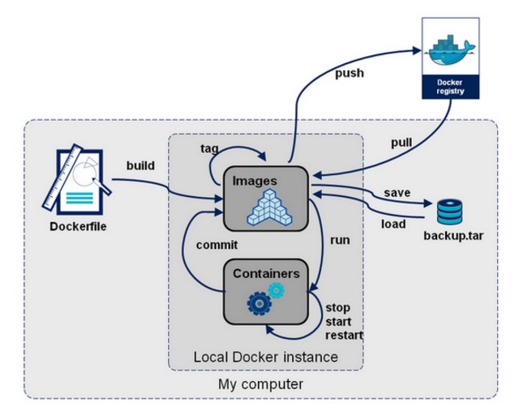

# docker介绍

[https://hub.docker.com/](https://hub.docker.com/)

# docker与传统虚拟化区别

| 特性     | 容器               | 虚拟机     |
| -------- | ------------------ | ---------- |
| 启动速度 | 秒级               | 分钟级     |
| 性能     | 接近原生           | 较弱       |
| 内存代价 | 很小               | 较多       |
| 硬盘使用 | 一般为MB           | 一般为GB   |
| 运行密度 | 单机支持上千个容器 | 一般几十个 |
| 隔离性   | 安全隔离           | 完全隔离   |
| 迁移性   | 优秀               | 一般       |

传统的虚拟机是硬件级别的虚拟化，而容器则是操作系统级别的虚拟化。这种虚拟化技术更轻量级，它所需要的资源更少，比如运行所需的操作系统，只需要有关键的系统内核即可，不用安装很多其他的东西，所以一个dokcer镜像可以很小。

虚拟机是操作系统级别的资源隔离，而容器 本质上是进程级的资源隔离。

# docker基本组成

docker主机(Host)：安装了Docker程序的机器（Docker直接安装在操作系统之上）

docker仓库(Registry)：用来保存各种打包好的软件镜像；仓库分为公有仓库和私有仓库。(很类似 maven)

docker镜像(Images)：软件打包好的镜像；放在docker仓库中

docker容器(Container)：镜像启动后的实例称为一个容器；容器是独立运行的一个或一组应用

> 镜像就像Java中的类，而容器就好比由类产生的对象，一个镜像可以创建多个容器   da t

# docker命令分类

- Docker环境信息 — docker [info|version] 
- 容器生命周期管理 — docker [create|exec|run|start|stop|restart|kill|rm|pause|unpause]
- 容器操作管理 — docker [ps|inspect|top|attach|wait|export|port|rename|stat] 
- 容器rootfs命令 — docker [commit|cp|diff]
- 镜像仓库 — docker [login|pull|push|search] 
- 本地镜像管理 — docker [build|images|rmi|tag|save|import|load]
- 容器资源管理 — docker [volume|network]
- 系统日志信息 — docker [events|history|logs]

从docker命令使用出发，梳理出如下命令结构图：



# 镜像相关命令

## search 搜索镜像 

建议官网搜索，并阅读相关使用文档 [https://hub.docker.com/](https://hub.docker.com/)

```
docker search nginx

NAME（名称）                                       DESCRIPTION（描述）                               STARS     OFFICIAL   AUTOMATED
nginx                                             Official build of Nginx.                        17082     [OK]
linuxserver/nginx                                 An Nginx container, brought to you by LinuxS…   169
bitnami/nginx                                     Bitnami nginx Docker Image                      136                  [OK]
ubuntu/nginx                                      Nginx, a high-performance reverse proxy & we…   52
bitnami/nginx-ingress-controller                  Bitnami Docker Image for NGINX Ingress Contr…   19                   [OK]
```

## pull 拉取镜像

```
docker pull 镜像名称
```

## images 查看已有镜像

```
docker images
docker image ls
```

各个选项说明:

- REPOSITORY：表示镜像的仓库源 
- TAG：镜像的标签
-  IMAGE ID：镜像ID 
- CREATED：镜像创建时间  
- SIZE：镜像大小

```
REPOSITORY   TAG       IMAGE ID       CREATED        SIZE
nginx        latest    605c77e624dd   6 months ago   141MB
mysql        8.0       3218b38490ce   6 months ago   516MB
```

## save 导出镜像

```
docker save tomcat:9.0.20-jre8-alpine -o tomcat9.tar 
docker save tomcat:9.0.20-jre8-slim > tomcat9.slim.tar
```

- -o:输出到的文件

## load 导入镜像

```
docker load -i linux.tar 
docker load < tomcat9.0.20.tar

```

- --input , -i： 指定导入的文件。
- --quiet , -q：精简输出信息。 

## inspect 检查镜像

通过 docker inspect 命令，我们可以获取镜像的详细信息，其中，包括创建者，各层的数字摘要 等。

docker inspect 返回的是 JSON格式的信息，如果您想获取其中指定的一项内容，可以通过 -f 来指 定，如获取镜像大小。

```
docker inspect tomcat:9.0.20-jre8-alpine

docker inspect -f {{".Size"}} tomcat:9.0.20-jre8-alpine
```

## history 查看镜像卷

一个镜像是由多个层组成的，通过 docker history命令，可以列出各个层的创建信息，例如：查看 tomcat:9.0.20-jre8-alpine的各层 信息

```
docker history tomcat:9.0.20-jre8-alpine
```

## tag 标记镜像

标记本地镜像，将其归入某一仓库，也可以用来修改镜像名称

```
docker tag nginx:stable-alpine nginx:alpine 
```

## rmi 删除镜像

通过如下3种方式都可以删除镜像：

```
docker rmi tomcat:9.0.20-jre8-alpine

docker image rm tomcat:9.0.20-jre8-alpine
```

常用参数

- -f, -force : 强制删除镜像，即便有容器引用该镜像；
- -no-prune  : 不要删除未带标签的父镜像；

除了通过标签名称来删除镜像，我们还可以通过制定镜像 ID, 来删除镜像。一旦制定了通过 ID 来删除镜 像，它会先尝试删除所有指向该镜像的标签，然后在删除镜像本身。

```
docker rmi ee7cbd482336
```

- 推荐通过image的名称删除镜像 
- image的ID在终端长度未完全显示，ID值会出现重复

# 容器相关命令

## run 新建并启动容器 

**语法：**

```
docker run [OPTIONS] IMAGE [COMMAND] [ARG...]
```

**运行容器：**

```
docker run -it --rm -p 8080:8080 tomcat:9.0.20-jre8-alpine
```

**常用参数：**

- -d, --detach=false: 后台运行容器，并返回容器ID

- -i, --interactive=false: 以交互模式运行容器，通常与 -t 同时使用 
- -P, --publish-all=false: 随机端口映射，容器内部端口随机映射到主机的端口。不推荐使用该参数
- -p, --publish=[]: 指定端口映射，格式为：主机(宿主)端口:容器端口，推荐各位小伙伴们使用
- -t, --tty=false: 为容器重新分配一个伪输入终端，通常与 -i 同时使用

- --name="nginx-lb": 为容器指定一个名称

- -h , --hostname="laosiji": 指定容器的hostname

- -e , --env=[]: 设置环境变量，容器中可以使用该环境变量

- --net="bridge": 指定容器的网络连接类型，支持 bridge/host/none/container: 四种类型

- --link=[]: 添加链接到另一个容器；不推使用该参数
- -v, --volume : 绑定一个卷

- --privileged=false: 指定容器是否为特权容器，特权容器拥有所有的capabilities

- --restart=no：指定容器停止后的重启策略 no：容器退出时不重启 on-failure：容器故障退出（返回值非零）时重启 always：容器退出时总是重启,推荐使用
- --rm=false: 指定容器停止后自动删除容器,不能以docker run -d启动的容器

## logs 查看容器日志

```
docker logs [OPTIONS] CONTAINER
```

执行命令

```
docker run -itd --name tomcat9 -p 8080:8080 tomcat:9.0.20-jre8-alpine

docker logs -f tomcat9
```

常用参数

- -f : 跟踪日志输出

- --tail :仅列出最新N条容器日志

## exec 进入容器

docker exec ：在运行的容器中执行命令。早期有attach命令，对于阻塞命令会等待，所以不方便。在 Docker 1.3.0后提供了exec 可以在容器内直接执行任意命令

语法

```
docker exec [OPTIONS] CONTAINER COMMAND [ARG...]
```

执行命令

有bash命令的linux系统：例如centos

```
docker run -it --name tomcat9.1 -p 8080:8080 tomcat:9.0.20-jre8-slim 
docker exec -it tomcat9.1 /bin/bash
```

没有bash命令的linux系统：例如alpine系统

```
docker run -it --name tomcat9.2 -p 8081:8080 tomcat:9.0.20-jre8-alpine 

docker exec -it tomcat9.2 sh 
```

常用参数

- -i :即使没有附加也保持STDIN 打开
- -t :分配一个伪终端

## inspect 查看容器详细信息

```
docker inspect [OPTIONS] NAME|ID [NAME|ID...]
```

执行命令

```
docker run -it --name tomcat9 -p 8081:8080 tomcat:9.0.20-jre8-alpine

docker inspect tomcat9
```

常用参数

- -f :指定返回值的模板文件。
- -s :显示总的文件大小。

- --type :为指定类型返回JSON。

## rm 删除容器

docker rm ：删除一个或多个容器。

docker rm命令只能删除处于终止或退出状态的容器，并不能删除 还处于运行状态的容器 

```
docker rm [OPTIONS] CONTAINER [CONTAINER...]
```

执行命令

```
docker run -itd --name tomcat9 -p 8080:8080 tomcat:9.0.20-jre8-alpine
```

需要先停止运行中的容器再删除，否则无法删除容器

```
docker stop tomcat9
```

按照容器名称删除

```
docker rm tomcat9
```

按照容器ID删除

```
docker rm 8dd95a95e687
```

常用参数

- -f :通过 SIGKILL 信号强制删除一个运行中的容器。

- -l :移除容器间的网络连接，而非容器本身。

- -v :删除与容器关联的卷。

## ps 查看容器列表

查看运行中的容器

```
docker ps 
```

查看所有容器

```
docker ps -a 
```

输出详情介绍： 

- CONTAINER ID: 容器 ID。

- IMAGE: 使用的镜像。 

- COMMAND: 启动容器时运行的命令。

- CREATED: 容器的创建时间。 

- STATUS: 容器状态。

  状态有7种：created（已创建） restarting（重启中） running（运行中） removing（迁移中） paused（暂停） exited（停止） dead（死亡）

- PORTS: 容器的端口信息和使用的连接类型（tcp\udp）。

- NAMES: 容器名称。

常用参数

- -a :显示所有的容器，包括未运行的。
- -q :只显示容器ID。

## create 创建容器

创建一个新的容器但不启动它。用法同 docker run命令。 不常用

语法

```
docker create [OPTIONS] IMAGE [COMMAND] [ARG...]
```

执行命令

```
docker create -it --name tomcat9 -p 8080:8080 9.0.20-jre8-alpine 
```

大部分参数用法与docker run命令参数相同


## 启动、重启、终止容器

docker start :启动一个或多个已经被停止的容器

 docker stop :停止一个运行中的容器 

docker restart :重启容器 语法

```
docker start [OPTIONS] CONTAINER [CONTAINER...] 

docker stop [OPTIONS] CONTAINER [CONTAINER...] 

docker restart [OPTIONS] CONTAINER [CONTAINER...]
```

执行命令

```
docker start tomcat9

docker stop tomcat9 

docker restart tomcat9
```

## update 更新容器

可以动态地更新容器配置。可以更新一个或多个容器配置。多个容器名称或ID之间使 用空格分隔。但update命令不是很成熟，有很多配置项不能动态更新。推荐大家还是rm容器后，再重 新run一个新的镜像，不推荐使用

语法

```
docker update [OPTIONS] CONTAINER [CONTAINER...]
```

执行命令

```
docker run -it --name tomcat9 -p 8081:8080 tomcat:9.0.20-jre8-alpine
```

更新容器restart策略

```
docker update --restart always tomcat9 
```

## kill 杀掉容器

杀掉一个运行中的容器。

语法

```
docker kill [OPTIONS] CONTAINER [CONTAINER...]
```

执行命令

```
docker kill tomcat9 
```

常用参数

- -s :向容器发送一个信号

## 实用技巧

停止所有运行容器

```
docker stop $(docker ps -qa) 
```

删除所有的容器 

```
docker rm $(docker ps -aq) docker rm $(docker stop $(docker ps -q)) 
```

删除所有的镜像 

```
docker rmi $(docker images -q)
```

# docker 网络相关

## docker 网络理论

docker使用Linux桥接网卡，在宿主机虚拟一个docker容器网桥(docker0)，docker启动一个容器时会根 据docker网桥的网段分配给容器一个IP地址，称为Container-IP，同时docker网桥是每个容器的默认网 关。因为在同一宿主机内的容器都接入同一个网桥，这样容器之间就能够通过容器的Container-IP直接 通信。

docker网桥是宿主机虚拟出来的，并不是真实存在的网络设备，外部网络是无法寻址到的，这也意味着 外部网络无法通过直接Container-IP访问到容器。如果容器希望外部访问能够访问到，可以通过映射容 器端口到宿主主机（端口映射），即docker run创建容器时候通过 -p 或 -P 参数来启用，访问容器的时 候就通过[宿主机IP]:[容器端口]访问容器。

注意，以上是linux平台的实现，在mac 平台上的实现存在差异性。

Docker For Mac的实现和标准Docker规范有区别，Docker For Mac的Docker Daemon是运行于虚拟机(xhyve)中的，而不是像Linux上那样作为进程运行于宿主机，因此Docker For Mac没有docker0网桥，不能实现host网络模式，host模式会使Container复用Daemon的网络栈(在xhyve虚拟机中)，而不是与Host主机网络栈，这样虽然其它容器仍然可通过xhyve网络栈进行交互，但却不是用的Host上的端口(在Host上无法访问)。bridge网络模式 -p 参数不受此影响，它能正常打开Host上的端口并映射到Container的对应Port。

使用命令查看docker网络部分：

```
docker info
```

## 网络模式

常用的网络模式，bridge是最常用的。

| Docker网络模式  | 配置                       | 说明                                                         |
| --------------- | -------------------------- | ------------------------------------------------------------ |
| bridge模式      | –net=bridge                | （默认为该模式）。此模式会为每一个容器分 配、设置IP等， 并将容器连接到一个docker0虚拟网桥，通过 docker0网桥 以及Iptables nat表配置与宿主机通信。 |
| host模式        | –net=host                  | 容器和宿主机共享Network namespace。 容器将不会虚拟出自己的网卡，配置自己的IP 等， 而是使用宿主机的IP和端口。 |
| none模式        | –net=none                  | 容器有独立的Network namespace，并没有对 其进行任何网络设置， 如分配veth pair 和网桥连接，配置IP等。 该模式关闭了容器的网络功能。 |
| container模 式  | – net=container:NAME_or_ID | 容器和另外一个容器共享Network namespace。 kubernetes中的pod就是多个容器共享一个 Network namespace。 创建的容器不会创建自己的网卡，配置自己的 IP， 而是和一个指定的容器共享IP、端口范围。 |
| Macvlan network | 无                         | 容器具备Mac地址，使其显示为网络上的物理 设备                 |
| Overlay         | 无                         | (覆盖网络）： 利用VXLAN实现的bridge模式                      |

### bridge模式

默认的网络模式。bridge模式下容器没有一个公有ip，只有宿主机可以直接访问，外部主机是不可见的，但容器通过宿主机的NAT规则后可以访问外网。

Bridge 桥接模式的实现步骤主要如下：

- Docker Daemon 利用 veth pair 技术，在宿主机上创建两个虚拟网络接口设备，假设为veth0 和 veth1。而veth pair 技术的特性可以保证无论哪一个 veth 接收到网络报文，都会将报文传输给另 一方。
- Docker Daemon 将 veth0 附加到 Docker Daemon 创建的 docker0网桥上。保证宿主机的网络报 文可以发往 veth0。
- Docker Daemon 将 veth1 添加到 Docker Container 所属的 namespace 下，并被改名为eth0。 如此一来，保证宿主机的网络报文若发往 veth0，则立即会被 eth0 接收，实现宿主机到Docker Container网络的联通性；同时，也保证 Docker Container 单独使用 eth0，实现容器网络环境的 隔离性。

**Bridge桥接模式的缺陷：**

1. 最明显的是，该模式下 Docker Container 不具有一个公有 IP，即和宿主机的 eth0 不处于同一个网段。导致的结果是宿主机以外的世界不能直接和容器进行通信。
2. 虽然 NAT 模式经过中间处理实现了这一点，但是 NAT 模式仍然存在问题与不便，如：容器均需要在 宿主机上竞争端口，容器内部服务的访问者需要使用服务发现获知服务的外部端口等。
3. 另外 NAT 模式由于是在三层网络上的实现手段，故肯定会影响网络的传输效率。

**注意：**

veth设备是成双成对出现的，一端是容器内部命名为eth0，一端是加入到网桥并命名的veth（通常命名 为veth），它们组成了一个数据传输通道，一端进一端出，veth设备连接了两个网络设备并实现了数据 通信。

### host模式

相当于Vmware中的NAT模式，与宿主机在同一个网络中，但没有独立IP地址。

如果启动容器的时候使用host模式，那么这个容器将不会获得一个独立的Network Namespace，而是 和宿主机共用一个Network Namespace。容器将不会虚拟出自己的网卡，配置自己的IP等，而是使用宿 主机的IP和端口。但是，容器的其他方面，如文件系统、进程列表等还是和宿主机隔离的。

使用host模式的容器可以直接使用宿主机的IP地址与外界通信，容器内部的服务端口也可以使用宿主机 的端口，不需要进行NAT，host最大的优势就是网络性能比较好，但是docker host上已经使用的端口就 不能再用了，网络的隔离性不好。

host网络模式需要在容器创建时指定–network=host host 模式是 bridge 桥接模式很好的补充。采用 host 模式的 Docker Container，可以直接使用宿主机 的 IP地址与外界进行通信，若宿主机的 eth0 是一个公有 IP，那么容器也拥有这个公有IP。同时容器内 服务的端口也可以使用宿主机的端口，无需额外进行 NAT 转换。

host模式可以让容器共享宿主机网络栈,这样的好处是外部主机与容器直接通信,但是容器的网络缺少隔离 性。 

**Host 网络模式的缺陷：**

 最明显的是 Docker Container 网络环境隔离性的弱化。即容器不再拥有隔离、独立的网络环境。 

使用 host 模式的 Docker Container 虽然可以让容器内部的服务和传统情况无差别、无改造的使 用，但是由于网络隔离性的弱化，该容器会与宿主机共享竞争网络栈的使用； 

容器内部将不再拥有所有的端口资源，原因是部分端口资源已经被宿主机本身的服务占用，还有 部分端口已经用以 bridge 网络模式容器的端口映射。

### Container网络模式

一种特殊host 网络模式

Container 网络模式是 Docker 中一种较为特别的网络的模式。在容器创建时使用network=container:vm1指定。(vm1指定的是运行的容器名)

处于这个模式下的 Docker 容器会共享一个网络环境,这样两个容器之间可以使用localhost高效快速通信。

缺陷：它并没有改善容器与宿主机以外世界通信的情况（和桥接模式一样，不能连接宿主机以外的其他 设备）。

这个模式指定新创建的容器和已经存在的一个容器共享一个 Network Namespace，而不是和宿主机共 享。新创建的容器不会创建自己的网卡，配置自己的 IP，而是和一个指定的容器共享 IP、端口范围等。 同样，两个容器除了网络方面，其他的如文件系统、进程列表等还是隔离的。两个容器的进程可以通过 lo 网卡设备通信。

### none模式

使用none模式，Docker容器拥有自己的Network Namespace，但是，并不为Docker容器进行任何网 络配置。也就是说，这个Docker容器没有网卡、IP、路由等信息。需要我们自己为Docker容器添加网 卡、配置IP等。

这种网络模式下容器只有lo回环网络，没有其他网卡。none模式可以在容器创建时通过-network=none来指定。这种类型的网络没有办法联网，封闭的网络能很好的保证容器的安全性。

### overlay 网络模式

Overlay 网络，也称为覆盖网络。主要用于docker集群部署。 Overlay 网络的实现方式和方案有多种。Docker自身集成了一种，基于VXLAN隧道技术实现。

Overlay 网络主要用于实现跨主机容器之间的通信。 应用场景：需要管理成百上千个跨主机的容器集群的网络时

### macvlan 网络模式

macvlan网络模式，最主要的特征就是他们的通信会直接基于mac地址进行转发。

这时宿主机其实充当一个二层交换机。Docker会维护着一个MAC地址表，当宿主机网络收到一个数据包 后，直接根据mac地址找到对应的容器，再把数据交给对应的容器。

容器之间可以直接通过IP互通，通过宿主机上内建的虚拟网络设备（创建macvlan网络时自动创建）， 但与主机无法直接利用IP互通。

应用场景：由于每个外来的数据包的目的mac地址就是容器的mac地址，这时每个容器对于外面网络来 说就相当于一个真实的物理网络设备。因此当需要让容器来的网络看起来是一个真实的物理机时，使用 macvlan模式

Macvlan是一个新的尝试，是真正的网络虚拟化技术的转折点。Linux实现非常轻量级，因为与传统的 Linux Bridge隔离相比，它们只是简单地与一个Linux以太网接口或子接口相关联，以实现网络之间的分 离和与物理网络的连接。

Macvlan提供了许多独特的功能，并有充足的空间进一步创新与各种模式。这些方法的两个高级优点是 绕过Linux网桥的正面性能以及移动部件少的简单性。删除传统上驻留在Docker主机NIC和容器接口之间 的网桥留下了一个非常简单的设置，包括容器接口，直接连接到Docker主机接口。由于在这些情况下没 有端口映射，因此可以轻松访问外部服务。

Macvlan Bridge模式每个容器都有唯一的MAC地址，用于跟踪Docker主机的MAC到端口映射。 Macvlan驱动程序网络连接到父Docker主机接口。示例是物理接口，例如eth0，用于802.1q VLAN标记 的子接口eth0.10（.10代表VLAN 10）或甚至绑定的主机适配器，将两个以太网接口捆绑为单个逻辑接 口。 指定的网关由网络基础设施提供的主机外部。 每个Macvlan Bridge模式的Docker网络彼此隔离， 一次只能有一个网络连接到父节点。

每个主机适配器有一个理论限制，每个主机适配器可以连接一个Docker网络。 同一子网内的任何容器都 可以与没有网关的同一网络中的任何其他容器进行通信macvlan bridge。 相同的docker network命令 适用于vlan驱动程序。 在Macvlan模式下，在两个网络/子网之间没有外部进程路由的情况下，单独网络 上的容器无法互相访问。这也适用于同一码头网络内的多个子网。

## bridge网络

bridge网络表现形式就是docker0这个网络接口。容器默认都是通过 docker0这个接口进行通信。也可以通过docker0去和本机的以太网接口连接，这样容器内部才能访问互 联网。

```
查看docker0网络，在默认环境中，一个名为docker0的linux bridge自动被创建好了，其上有一个 docker0 内部接口，IP地址为172.17.0.1/16 
ip a

查看docker 网络 
docker network ls

查看bridge网络详情。主要关注Containers节点信息。
docker network inspect bridge 
```

**运行镜像**

```
docker run -itd --name nginx1 nginx:1.19.3-alpine

查看bridge网络详情。主要关注Containers节点信息。发现nginx1容器默认使用bridge网络

docker network inspect bridge
```

**容器创建时IP地址的分配**

```
查看宿主机网络。发现多出一块网卡veth62aef5e@if8
ip a  /  ifconfig
```

Docker 创建一个容器的时候，会执行如下操作：

- 创建一对虚拟接口/网卡，也就是veth pair，分别放到本地主机和新容器中；

- 本地主机一端桥接到默认的 docker0 或指定网桥上，并具有一个唯一的名字，如 vetha596da4；

- 容器一端放到新容器中，并修改名字作为 eth0，这个网卡/接口只在容器的名字空间可见；

- 从网桥可用地址段中（也就是与该bridge对应的network）获取一个空闲地址分配给容器的 eth0，并 配置默认路由到桥接网卡 vetha596da4。 

完成这些之后，容器就可以使用 eth0 虚拟网卡来连接其他容器和其他网络。 如果不指定--network，创建的容器默认都会挂到 docker0 上，使用本地主机上 docker0 接口的 IP 作为 所有容器的默认网关。

```
第一种方式：

docker exec -it nginx1 sh ip a 

第二种方式：

docker exec -it nginx1 ip a
```

```
linux下安装brctl，方便查看桥接相关信息
yum install -y bridge-utils

运行命令
brctl show
```

###  **多容器之间通讯**

```
docker run -itd --name nginx1 nginx:1.19.3-alpine

docker run -itd --name nginx2 nginx:1.19.3-alpine

docker network inspect bridge

docker exec -it nginx1 sh 

ping 172.17.0.2 //ok

docker exec -it nginx2 sh 

ping 172.17.0.2 //ok

ping www.baidu.com  //ok

ping nginx1 //fail 通过容器的名称去ping也失败了
```

### **容器IP地址会发生变化**

```
docker stop nginx1 nginx2

先启动nginx2，在启动nginx1

docker start nginx2

docker start nginx1

主要查看Containers中的信息，发现ip地址会重新分配，在搭建容器集群时需要注意
docker network inspect bridge 
```

针对容器ip地址变化的问题，有两种解决方式：

1. 通过容器名称去定位一个容器，而非ip地址，如link容器 和创建自定义的bridge网络
2. 通过设置来固定容器对应的ip地址

### link容器

在创建容器的时候有一个 --link 参数，可以链接另一个容器，不推荐使用该参数，不安全。

使用link的场景：在企业开发环境中，我们有一个mysql的服务的容器mysql_1，还有一个web应用程序 web_1，肯定web_1这台容器肯定要连接mysql_1这个数据库。前面网络命名空间的知识告诉我们，两 个容器需要能通信，需要知道对方的具体的IP地址。生产环境还比较好，IP地址很少变化，但是在我们 内部测试环境，容器部署的IP地址是可能不断变化的，所以，开发人员不能在代码中写死数据库的IP地 址。此时就可以利用容器之间link来解决这个问题。

下面，我们来介绍如何通过容器名称来 进行ping，而不是通过IP地址。

```
docker run -itd --name nginx2 --link mysql_1 nginx:1.19.3-alpine

docker exec -it nginx2 sh 

ping 172.17.0.2 //ok

ping www.baidu.com  //ok

ping mysql_1 //ok
```

上面link命令，是在nginx2容器启动时link到mysql_1容器，因此，在nginx2容器里面可以ping通 mysql_1容器名，link的作用相当于添加了DNS解析。

这里提醒下，在mysql_1容器里去ping nginx2 容器是不通的，因为link关系是单向的，不可逆。 

实际工作中，docker官网已经不推荐我们使用link参数。 docker用其他方式替换掉link参数

### 自定义bridge网络

```
docker network create -d bridge nginx-bridge
```

上面命令参数-d 是指DRIVER的类型，后面的nginx-bridge是network的自定义名称，这个和docker0是 类似的。

下面开始介绍，如何把容器连接到nginx-bridge这个网络。

启动一个nginx的容器nginx3，并通过参数network connect来连接nginx-bridge网络。

```
docker run -itd --name nginx3 --network nginx-bridge nginx:1.19.3-alpine 


docker network inspect nginx-bridge
```

把一个运行中容器连接到lagou-bridge网络

```
docker network connect nginx-bridge nginx2 

docker network inspect nginx-bridge

docker exec -it nginx2 sh 
ping nginx3 //ok

docker exec -it nginx3 sh 
ping nginx2 //ok
```

这样配置文件里可以直接配置其他容器的名称即可定位到对应容器

### 创建容器时固定ip

```
docker network create -d bridge --subnet=172.172.0.0/24 nginx-network --gateway 172.172.0.1
docker run -itd --name nginx3 -p 80:80 --net nginx-network --ip 172.172.0.10 nginx:1.19.3-alpine

--net mynetwork:选择存在的网络
--ip 172.172.0.10:给nginx分配固定的IP地址
```

## none网络

启动一个ngnix的容器nginx1，并且连接到none网络。然后查看器信息

```
docker run -itd --name nginx1 --network none nginx:1.19.3-alpine

docker network inspect none
```

注意，容器使用none模式，是没有物理地址和IP地址。我们可以进入到nginx1容器里，执行ip a命令看 看。只有一个lo接口，没有其他网络接口，没有IP。也就是说，使用none模式，这个容器是不能被其他 容器访问。这种使用场景很少，只有项目安全性很高的功能才能使用到。例如：密码加密算法容器。

## host网络

none网络模式特点就是，容器没有IP地址，不能和其他容器通信。下面来看看host网络是什么 特点。

我们使用前面命令，启动一个nginx的nginx2容器，连接到host网络。

然后docker network inspect host, 看看容器信息。

```
docker run -itd --name nginx2 --network host nginx:1.19.3-alpine

docker network inspect host
// show
"Containers": {
	"d9790906a5603110a5b1075b07c6370c025536193e60a76ac10580e519ab33eb": {
		"Name": "nginx0",
		"EndpointID": "87e58d7815760854d891822ef242d9e4d867d52020eedd6e9c409c315548c22d",
		"MacAddress": "",
		"IPv4Address": "",
		"IPv6Address": ""
	}
},
```

容器不显示IP地址。那么是不是和none一样，肯定不是，不然也不会设计none和host网络进 行区分。下面我们进入nginx2容器，执行ip a看看效果。我们在容器里执行ip a，发现打印内容和在 linux本机外执行ip a是一样的。

```
docker exec -it nginx2 sh

 ip a
```

容器使用了host模式，则和外层linux主机共享一套网络接口。VMware公司的虚 拟机管理软件，其中网络设置，也有host这个模式，作用也是一样，虚拟机里面使用网络和你自己外层 机器是一模一样的。这种容器和本机使用共享一套网络接口，缺点还是很明显的，例如我们知道web服 务器一般端口是80，共享了一套网络接口，那么你这台机器上只能启动一个nginx端口为80的服务器 了。否则，出现端口被占用的情况。


# 网络相关命令

```
docker network --help

Usage:  docker network COMMAND

Manage networks

Commands:
  connect     Connect a container to a network
  create      Create a network
  disconnect  Disconnect a container from a network
  inspect     Display detailed information on one or more networks
  ls          List networks
  prune       Remove all unused networks
  rm          Remove one or more networks
```


## ls 查看网络列表

查看已经建立的网络对象 

```
docker network ls [OPTIONS] 
```

- -f, --filter filter 过滤条件(如 'driver=bridge’) 
- --format string 格式化打印结果
- --no-trunc 不缩略显示
- -q, --quiet  只显示网络对象的ID

注意： 默认情况下，docker安装完成后，会自动创建bridge、host、none三种网络驱动 

```
docker network ls 
docker network ls --no-trunc 
docker network ls -f 'driver=host'
```

## create创建网络

创建新的网络对象

```
docker network create [OPTIONS] NETWORK 
```

- -d, --driver string 指定网络的驱动(默认 "bridge")
- --subnet strings 指定子网网段(如192.168.0.0/16、172.88.0.0/24)
- --ip-range strings 执行容器的IP范围，格式同subnet参数
- --gateway strings 子网的IPv4 or IPv6网关，如(192.168.0.1) 

host和none模式网络只能存在一个；docker自带的overlay 网络创建依赖于docker swarm(集群负载均衡)服务

192.168.0.0/16 等于 192.168.0.0~192.168.255.255；172.88.0.0/24 等于 172.88.0.0~172.88.0.255 

```
 docker network ls 
 docker network create -d bridge my-bridge 
 docker network ls
```


## rm 删除网络

删除一个或多个网络 

```
docker network rm NETWORK [NETWORK...] 
```


## inspect 查看网络详细信息

查看网络详细信息 

```
docker network inspect
```

查看一个或多个网络的详细信息

```
docker network inspect [OPTIONS] NETWORK [NETWORK...]
```

- -f, --format string 根据format输出结果 


## connect/disconnect 网络连接与断开

网络连接与断开 

```
 docker network connect/disconnect
```

将指定容器与指定网络进行连接或者断开连接 

```
docker network disconnect [OPTIONS] NETWORK CONTAINER # 命令参数(OPTIONS)：
```

- -f, --force 强制断开连接(用于disconnect)

## 网络小练习

```
docker network create -d bridge --subnet=172.172.0.0/24 nginx-network --gateway 172.172.0.1

// 172.172.0.0/24:   24 代表子码掩码是255.255.255.0

// 172.172.0.0/16:   16 代表子码掩码255.255.0.0

docker network ls

docker run -itd --name nginx3 -p 80:80 --net nginx-network --ip 172.172.0.10 nginx:1.19.3-alpine
--net mynetwork:选择存在的网络
--ip 172.172.0.10:给nginx分配固定的IP地址

docker network inspect nginx-network docker stop nginx3
docker start nginx3
docker network inspect nginx-network
```


# 迁移与备份

- 容器保存为镜像  
docker commit 容器名称 镜像名称
- 镜像导出
docker save -o 输出的文件名 镜像名称
- 镜像导入
docker load -i 要加载的文件名

## dockerfile
Dockerfile是由一系列命令和参数构成的脚本，这些命令应用于基础镜像并最终创建一个新的镜像   
基础镜像：最基础的是OS镜像，如果在OS上安装了JDK，后面继续安装其他软件，那么带有JDK的OS就成为新的基础镜像
!!注意文件名必须是Dockerfile
- 开发人员，提供一个完全一致的开发环境
- 测试和运维人员，直接使用开发人员提供的镜像或通过Dockerfile文件重构一个新的镜像，进行测试和部署

## 常用命令
- FROM image_name:tag  
定义了使用哪个基础镜像启动构建流程

- MAINTAINER user_name  
声明镜像的创建者

- ENV key value  
设置环境变量(可以写多条)

- RUN command  
是Dockerfile的核心部分(可以写多条) 

- ADD source_dir/file dest_dir/file  
将宿主机的文件复制到容器内，如果是压缩文件，会自动解压 

- COPY source_dir/file dest_dir/file   
和ADD相似，但是不会自动解压 

- WORKDIR path_dir  
设置工作目录 

## 构建jdk镜像
上传JDK到宿主机 /usr/docker/jdk8/jdk-8u144-linux-x64.tar.gz  
在jdk8目录下创建Dockerfile文件   

```
FROM  centos:7
MAINTAINER lwj
WORKDIR /usr
RUN mkdir /usr/local/java
ADD jdk-8u144-linux-x64.tar.gz /usr/local/java/

ENA JAVA_HOME /usr/local/java/jdk1.8.0_144
ENA JRE_HOME $JAVA_HOME/jre
ENA CLASSPATH $JAVA_HOME/bin/dt.jar:$JAVA_HOME/lib/tools.jar:$JAVA_HOME/lib:$CLASSPATH
ENA PATH $JAVA_HOME/bin:$PATH
```
进行构建，最后一个 . 指的是在当前目录找Dockerfile  
docker build -t='jdk1.8' .  

## 搭建docker私有仓库
- 拉取私有仓库的镜像  
docker pull registry
- 启动私有仓库容器  
docker run =id --name=myregistry -p 5000:5000 registry
- 通过浏览器访问  
192.168.3.193:5000/v2/_catalog
- 修改daemon.json  
vi /etc/docker/daemon.json  
添加  "insecure-registries":["192.168.3.196:5000"]  
多个私服的写法  
{
    "insecure-registries": [
        "192.168.3.193:5000", 
        "192.168.3.194:5000"
    ]
}
配置daemon.json后需要重启docker容器

## push私有仓库
docker tag 镜像名称 上传后的镜像名称  
docker tag jdk1.8 192.168.3.193:5000/jdk1.8  
docker push 192.168.3.193:5000/jdk1.8  

## pull私有仓库
首先需要在daemon.json中配置私服地址  
docker pull 镜像