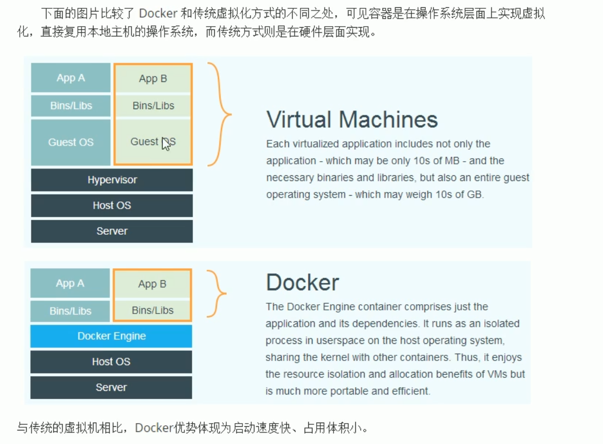

## Docker

解决环境搭建问题，如mysql搭建，redis搭建，linux的环境搭建，保证开发，测试，上线，运营的环境上保持一致

### docker与传统虚拟化区别



### 镜像与容器
镜像是构建Docker的基石，用户基于镜像来运行自己的容器，镜像也是Docker生命周期中“构建”部分，镜像是基于联合文件系统的一种层次结构，由一系列指令一步一步构建出来。  
也可以将镜像当作容器的“源代码”，镜像体积很小，易于分享、存储和更新  
镜像就像Java中的类，而容器就好比由类产生的对象，一个镜像可以创建多个容器    

### docker的启动与停止
- 启动  
systemctl start docker    

- 重启  
systemctl restart docker    

- 停止  
systemctl stop docker    

- 查看docker状态  
systemctl status docker    

- 开机启动  
systemctl enable docker    

- 查看dockr概要信息  
docker info    

- 查看docker帮助文档  
docker --help   

### 镜像相关命令
- 查看镜像  
docker images
- 搜索镜像  
docker search 镜像名称
- 拉取镜像  
docker pull 镜像名称
- 删除镜像  
docker rmi 镜像ID或镜像名称

### 容器相关命令
- 查看容器  
docker ps   
docker ps -a 

- 容器的创建  
docker run  
-i 表示运行容器
-t:表示容器启动后会进入其命令行。加入这两个参数后,容器创建就能登录进去。即分配一个伪终端
-d:在run后面加上-d参数,则会创建一个守护式容器在后台运行(这样创建容器后不会自动登录容器,如果只加-i-t两个参数,创建后就会自动进去容器)。  
--name:为创建的容器命名。  
-v.表示目录映射关系(前者是宿主机目录,后者是映射到宿主机上的目录) ,可以使用多个一v做多个目录或文件映射。注意:最好做目录映射,在宿主机上做修改,然后共享到容器上。  
-p:表示端口映射,前者是宿主机端口,后者是容器内的映射端口。可以使用多个-做多个端口映射  
    - 交互方式创建容器：  
      docker run -it --name=容器名称 镜像名称:标签 /bin/bash  
    - 守护方式创建容器：  
      docker run -id --name=容器名称 镜像名称:标签  
    - 登录守护式容器：  
      docker exec -it 容器名称/容器ID /bin/bash  

- 容器的启动  
docker start 容器名称/容器ID

- 容器的停止  
docker stop 容器名称/容器ID

- 文件拷贝  
宿主机到容器  
docker cp 文件名称 容器名称/容器ID：目标地址   
docker cp test.txt mycentos:/usr/local  
容器到宿主机  
docker cp  容器名称/容器ID：目标名称 目标地址  
docker cp  mycentos2:/opt/ansible/ansible/test.txt /usr  

- 目录挂载
在创建容器的时候，将宿主机的目录与容器内的目录进行映射，这样就可以通过修改宿主机的目录而影响容器目录
docker run -id --name=容器名称 -v 宿主机目录：容器目录 镜像名称/ID
docker run -id --name=mycentos3 -v /test:/test  688353a31fde

- 查看容器IP地址  
可以通过以下命令查看容器运行各种数据   
docker inspect 容器名称/容器ID   
对所有信息进行过滤输出  
docker inspect --format='{{.NetworkSettings.IPAddress}}'   name/ID

- 删除容器  
docker rm name/ID

### mysql部署
docker run -id --name=mysql -p 3307:3306 -e MYSQL_ROOT_PASSWORD=root 镜像名centos/mysql-57-centos7

可以通过navicat进行连接，连接到宿主机，通过宿主机的端口映射，连接的mysql容器

### tomcat部署
docker pull tomcat:7-jre7    
docker run -id --name=tomcat -p 9000:8080 -v /usr/local/webapps:/usr/local/tomcat/webapps tomcat:7-jre7

### nginx部署
docker pull nginx  
docker run -id --name=nginx -p 80:80 nginx  
nginx中欢迎页面位置  
cat /usr/share/nginx/html/index.html

### redis部署
docker pull redis  
docker run -id --name=redis -p 6379:6379 redis

### dubbo-admin部署
docker pull tomcat  
docker run -id --name=tomcat8 -p 8080:8080 -v /root/tomcat8/webapps:/usr/local/tomcat/webapps tomcat:8.5.29   
rz命令 dubbo-admin-2.5.4-jdk1.8.war 拷贝到挂载目录   
修改项目名为ROOT 修改配置文件dubbo.properties中的zookeeper地址  

## 迁移与备份
- 容器保存为镜像  
docker commit 容器名称 镜像名称
- 镜像导出
docker save -o 输出的文件名 镜像名称
- 镜像导入
docker load -i 要加载的文件名

### dockerfile
Dockerfile是由一系列命令和参数构成的脚本，这些命令应用于基础镜像并最终创建一个新的镜像   
基础镜像：最基础的是OS镜像，如果在OS上安装了JDK，后面继续安装其他软件，那么带有JDK的OS就成为新的基础镜像
!!注意文件名必须是Dockerfile
- 开发人员，提供一个完全一致的开发环境
- 测试和运维人员，直接使用开发人员提供的镜像或通过Dockerfile文件重构一个新的镜像，进行测试和部署

### 常用命令
- FROM image_name:tag  
定义了使用哪个基础镜像启动构建流程

- MAINTAINER user_name  
声明镜像的创建者

- ENV key value  
设置环境变量(可以写多条)

- RUN command  
是Dockerfile的核心部分(可以写多条) 

- ADD source_dir/file dest_dir/file  
将宿主机的文件复制到容器内，如果是压缩文件，会自动解压 

- COPY source_dir/file dest_dir/file   
和ADD相似，但是不会自动解压 

- WORKDIR path_dir  
设置工作目录 

### 构建jdk镜像
上传JDK到宿主机 /usr/docker/jdk8/jdk-8u144-linux-x64.tar.gz  
在jdk8目录下创建Dockerfile文件   

```
FROM  centos:7
MAINTAINER lwj
WORKDIR /usr
RUN mkdir /usr/local/java
ADD jdk-8u144-linux-x64.tar.gz /usr/local/java/

ENA JAVA_HOME /usr/local/java/jdk1.8.0_144
ENA JRE_HOME $JAVA_HOME/jre
ENA CLASSPATH $JAVA_HOME/bin/dt.jar:$JAVA_HOME/lib/tools.jar:$JAVA_HOME/lib:$CLASSPATH
ENA PATH $JAVA_HOME/bin:$PATH
```
进行构建，最后一个 . 指的是在当前目录找Dockerfile  
docker build -t='jdk1.8' .  

### 搭建docker私有仓库
- 拉取私有仓库的镜像  
docker pull registry
- 启动私有仓库容器  
docker run =id --name=myregistry -p 5000:5000 registry
- 通过浏览器访问  
192.168.3.193:5000/v2/_catalog
- 修改daemon.json  
vi /etc/docker/daemon.json  
添加  "insecure-registries":["192.168.3.196:5000"]  
多个私服的写法  
{
    "insecure-registries": [
        "192.168.3.193:5000", 
        "192.168.3.194:5000"
    ]
}
配置daemon.json后需要重启docker容器

### push私有仓库
docker tag 镜像名称 上传后的镜像名称  
docker tag jdk1.8 192.168.3.193:5000/jdk1.8  
docker push 192.168.3.193:5000/jdk1.8  

### pull私有仓库
首先需要在daemon.json中配置私服地址  
docker pull 镜像