# 	ES 版本更新

## 新特性 6.x

1. 基于 Lucene 7.x 
2. 新功能
   - 跨集群复制
   - 索引什么周期
   - SQL的支持
3. 更友好的升级及数据迁移
   - 在主要版本之间的迁移更为简化，体验升级
   - 全新的基于操作的数据复制框架，可加快恢复数据
4. 性能优化
   - 有效存储稀疏字段的新方法，降低了存储成本
   - 在索引时进行排序，可加快排序的查询性能

## 新特性 7.x

1. 基于Lucene 8.0
2. 正式废除单个索引下多Type的支持
3. 7.1版本开始，Security 功能免费使用
4. ECK -Elasticsearch Opreator on Kubernets
5. 新功能
   - New Cluster coordination
   - Feature-Cpmlete High Level REST Client
   - Script Score Query
6. 性能优化
   - 默认的 Primary Shard 数从5改为1，避免Over Sharding
   - 性能优化，更快的 Top K

# Elastic Stack 生态圈

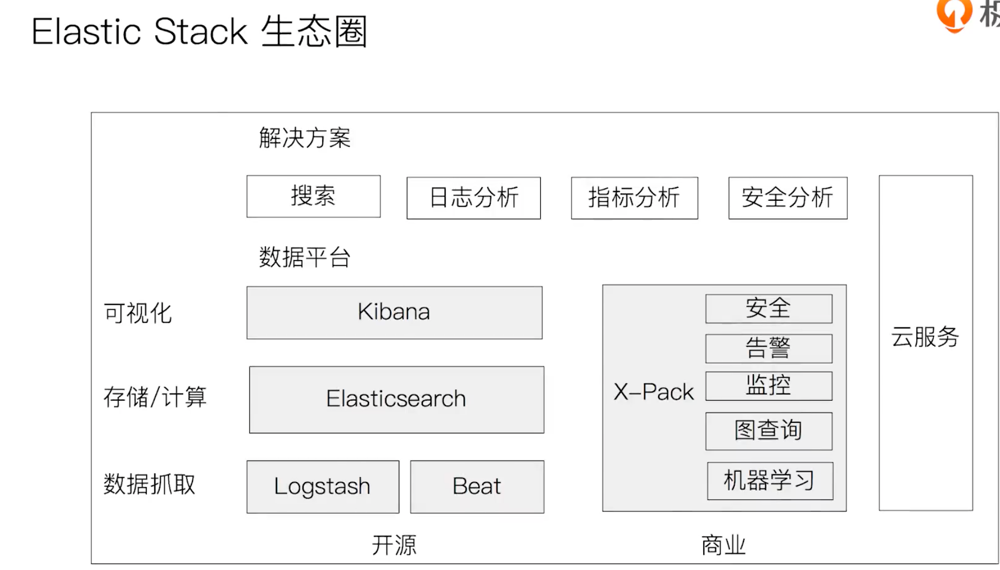

## Logstash

开源的服务器端数据处理管道，支持从不同来源采集数据，转换数据，并将数据发送到不同的数据库中。

1. 实时解析和转换数据
   1. 从IP 地址破译出地理坐标
   2. 将PII 数据匿名化，完全排除敏感字段
2. 可扩展
   - 200多个插件（日志/数据库/Arcsigh/Netflow）
3. 安全性
   - LogStash 会通过持久化队列来保证只要将运行中的事件送达一次
   - 数据传输加密
4. 监控

## Kibana

可视化利器，数据可视化工具

## Beats

轻量的数据采集器

# ES 应用场景

## ES 与数据库集成

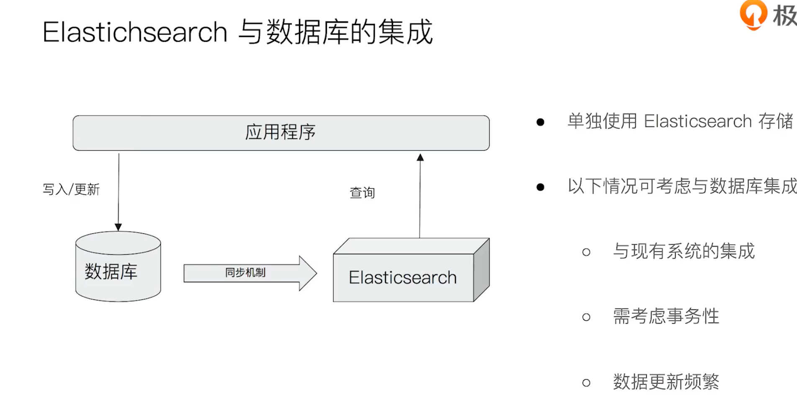

## 日志分析

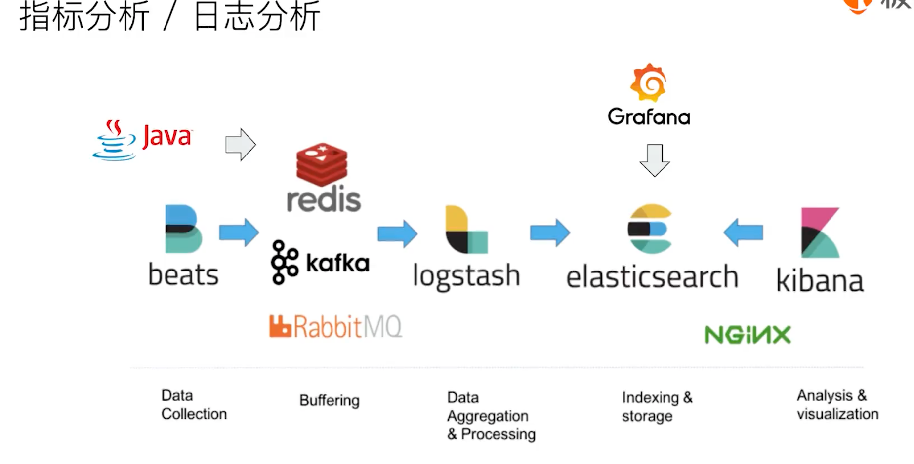

# ES 的安装及使用

## Elasticsearch 的目录结构

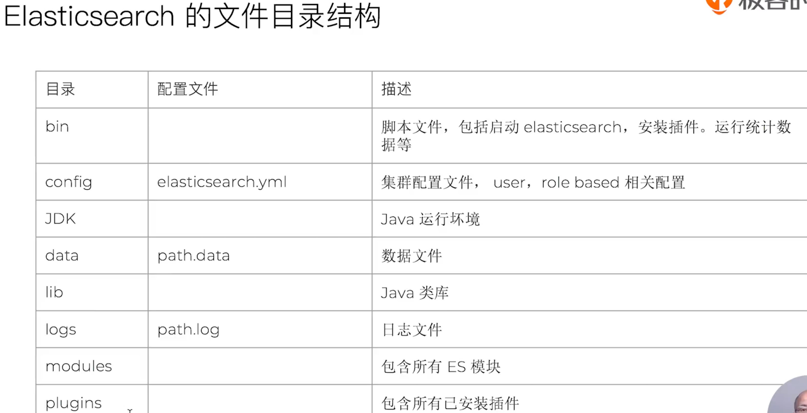

## JVM 配置

- 修改 JVM - config/jvm.options
  - 7.1 默认设置为1GB
- 配置建议
  - Xms 和 Xmx 设置为一样
  - Xmx 不要超过机器内存的50%  

## ES 常用命令

1. 查看已安装的插件

   localhost:9200/_cat/plugins

2. 查看ES集群的节点	

   localhost:9200/_cat/nodes

3. 查看已安装的插件

   bin/elasticsearch-plugin list	

4.  安装icu分词器

   bin/elasticsearch-plugin install	analysis-icu

5. ES启动多实例

   bin/elasticsearch -E node.name=node1 -E cluster.name=geektime -E path.data=node1_data

   bin/elasticsearch -E node.name=node2 -E cluster.name=geektime -E path.data=node2_data

   bin/elasticsearch -E node.name=node3 -E cluster.name=geektime -E path.data=node3_data

6. 删除进程

   ps grep | elasticsearch / kill pid

# Docker 中运行ELK Stack

## [Docker使用教程](https://www.runoob.com/docker/docker-tutorial.html)

## 在Docker容器中运行Elasticsearch, Kibana和Cerebro

进入 docker-compose.yaml 文件所在的目录

```shell
#启动
docker-compose up

#停止容器
docker-compose down

#停止容器并且移除数据
docker-compose down -v

#一些docker 命令
docker ps
docker stop Name/ContainerId
docker start Name/ContainerId

#删除单个容器
$docker rm Name/ID
-f, –force=false; -l, –link=false Remove the specified link and not the underlying container; -v, –volumes=false Remove the volumes associated to the container

#删除所有容器
$docker rm `docker ps -a -q`  
停止、启动、杀死、重启一个容器
$docker stop Name/ID  
$docker start Name/ID  
$docker kill Name/ID  
$docker restart name/ID
```

## 相关阅读

- 安装docker https://www.docker.com/products/docker-desktop
- 安装 docker-compose https://docs.docker.com/compose/install/
- 如何创建自己的Docker Image - https://www.elastic.co/cn/blog/how-to-make-a-dockerfile-for-elasticsearch
- 如何在为docker image安装 Elasticsearch 插件 - https://www.elastic.co/cn/blog/elasticsearch-docker-plugin-management
- 如何设置 Docker 网络 - https://www.elastic.co/cn/blog/docker-networking
- Cerebro 源码 https://github.com/lmenezes/cerebro
- 一个开源的 ELK（Elasticsearch + Logstash + Kibana） docker-compose 配置 https://github.com/deviantony/docker-elk
- Install Elasticsearch with Docker https://www.elastic.co/guide/en/elasticsearch/reference/7.2/docker.html

# Logstash 安装与测试数据导入

## 安装Logstash，并且导入Movielens的测试数据集

- Small: 100,000 ratings and 3,600 tag applications applied to 9,000 movies by 600 users. Last updated 9/2018.
- movielens/ml-latest-small/movies.csv movie数据
- movielens/logstash.conf //logstash 7.x 配置文件，
- movielens/logstash6.conf //logstash 6.x 配置文件

```
#下载与ES相同版本号的logstash，（7.1.0），并解压到相应目录
#修改movielens目录下的logstash.conf文件
#path修改为,你实际的movies.csv路径
input {
  file {
    path => "YOUR_FULL_PATH_OF_movies.csv"
    start_position => "beginning"
    sincedb_path => "/dev/null"
  }
}

#启动Elasticsearch实例，然后启动 logstash，并制定配置文件导入数据
sudo ./logstash -f /Users/networkcavalry/Documents/GitHub/geektime-ELK/part-1/2.4-Logstash安装与导入数据/movielens/logstash.conf
```

## 相关阅读

- 下载最MovieLens最小测试数据集：https://grouplens.org/datasets/movielens/
- Logstash下载：https://www.elastic.co/cn/downloads/logstash
- Logstash参考文档：https://www.elastic.co/guide/en/logstash/current/index.html

# ES 基础概念

## 文档

- Elasticsearch 是面向文档的，文档时所有可搜索数据的最小单位

  - 日志文件中的日志项
  - 一本唱片的详细内容
  - 一篇PDF文档中的具体内容

- 文档会被序列化为JSON格式，保存在Elasticsearch中

  - JSON对象由字段组成
  - 每个字段都有对应的字段类型（字符串/数值/布尔/日期/二进制/范围类型）

- 每个文档都有一个唯一的ID

  - 可以手动指定
  - 也可以通过Elasticsearch 自动生

- 一篇文档包含了一系列的字段，类似于数据库表中一条记录

- JSON 文档，格式灵活，不需要预先定义格式 

  - 字段的类型可以指定或者通过 Elasticsearch 自动推算
  - 支持数组 / 支持嵌套

  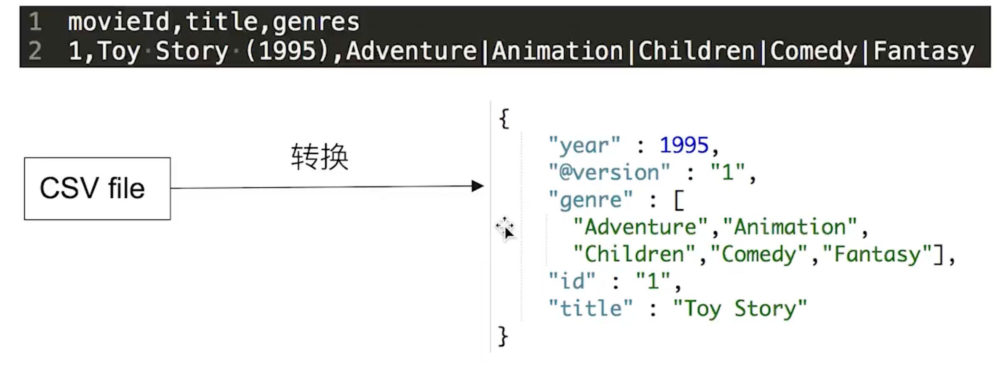

**文档元数据**


## 索引


**索引的不同语意**

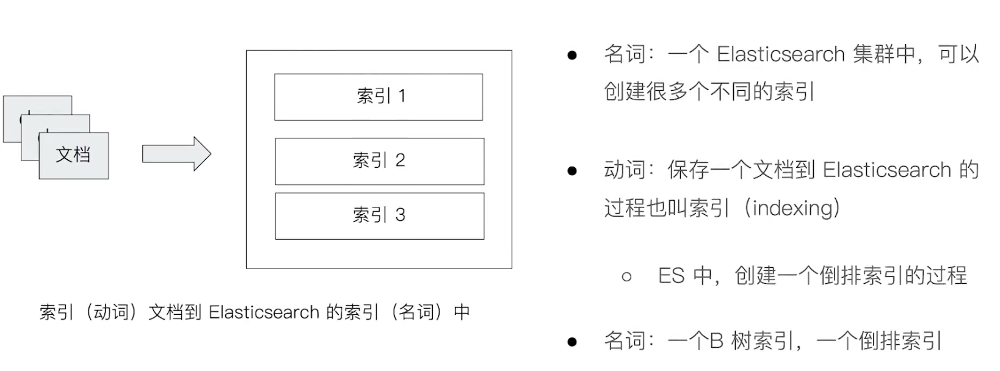

## Type

在 7.0 之前，一个Index 可以设置多个Types ，6.0 开始，Type 已经被 Deprecated。7.0 开始，一个索引只能创建一个 Type——“_doc”。

## 抽象与类比

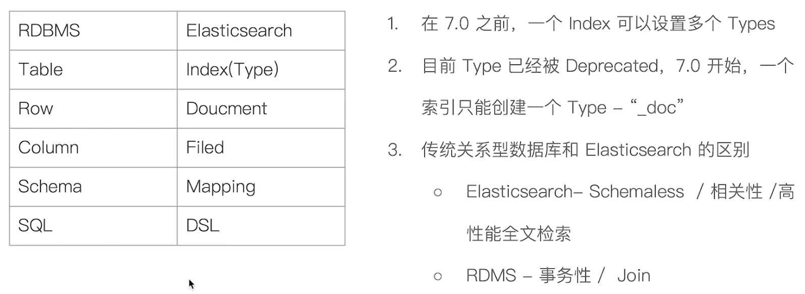

# 分布式系统的可用性与扩展性

- 高可用性
  - 服务可用性 - 允许有节点停止服务
  - 数据可用性 - 部分节点丢失，不会丢失数据
- 可扩展性
  - 请求量提升 / 数据的不断增长（将数据分布到所有节点上）

**分布式特性**

- Elasticsearch 的分布式架构的好处
  - 存储的水平扩容
  - 提高系统的可用性，部分节点停止服务，整个集群的服务不受影响
- Elasticsearch 的分布式架构
  - 不同的集群通过不同的名字来区分，默认名字“elasticsearch”
  - 通过配置文件修改，或者在命令行中 -E cluster.name=geektime 进行设定
  - 一个集群可以有一个或多个节点

## 节点

- 节点是一个 Elasticsearch 的实例
  - 本质上是一个Java 进程
  - 一台机器上可以运行多个 Elasticsearch 进程，但生产环境一般建议一台机器上只运行一个 Elasticsearch 实例
- 每个节点都有一个名字，通过配置文件配置，或者启动时候 —E node.name=node1 指定
- 每一个节点在启动之后，会分配一个UID，保存在data目录下

### Master eligible nodes 和 Master Node

- 每个节点启动后，默认是一个 Master eligible 节点
  - 可以设置 node.master:false 禁止
- Master-eligible 节点可以参加选主流程，成为 Master 节点
- 当第一个节点启动时候，它会将自己选举成 Master 节点
- 每个节点上都保存了集群的状态，只有 Master 节点能修改集群的状态信息
  - 集群状态（Cluster State），维护了一个集群中必要的信息
    - 所有的节点信息
    - 所有的索引和其相关的 Mapping 与 Setting 信息
    - 分片的路由信息
  - 如果任意节点都可以修改信息的话，会导致数据的不一致性

### Data Node 和 Coorinating Node

- Data Node 
  - 可以保存数据的节点，叫做 Data Node，负责保存分片数据，在数据扩展上起到了至关重要的作用。
- Coorinating Node
  - 负责接受Client的请求，将请求分发到合适的节点，最终把结果汇集到一起
  - 每个节点默认都起到了 Coorinating Node 的职责

### 其他节点类型

- Hot & Warm Node
  - 不同硬件配置的 Data Node，用来实现Hot & Warm 架构，降低集群部署的成本
- Machine Learning Node
  - 负责跑 机器学习的Job，用来做异常检测

## 分片

**（Primary Shard & Replica Shard）**

-  主分片，用以解决数据水平扩展的问题。通过珠峰片，可以将数据分布到集群内的所有节点上
  - 一个分片是一个运行的 Lucene 的实例
  - 主分片数在索引创建时指定，后续不允许修改，除非 ReIndex
- 副本，用以解决数据高可用的问题。分片是主分片的拷贝
  - 副本分片数，可以动态调整
  - 增加副本数，还可以在一定程度上提高服务的可用性（读取的吞吐）
- 一个三节点的集群中，blogs 索引的分片分布情况

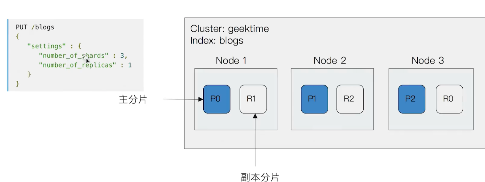

### 分片的设定

对于生产环境中分片的设定，需要提前做好容量规划

- 分片设置过小
  - 导致后续无法增加节点实现水平扩展
  - 单个分片的数据量太大，导致数据重新分配耗时
- 分片设置过大，7.0 开始，默认主分片设置为1，解决了 over-sharding 的问题
  - 影响搜索结果的相关性打分，影响统计结果的准确性
  - 单个节点上过多的分片，会导致资源浪费，同时也会影响性能

## 查看集群的健康状况


# 文档的 CRUD

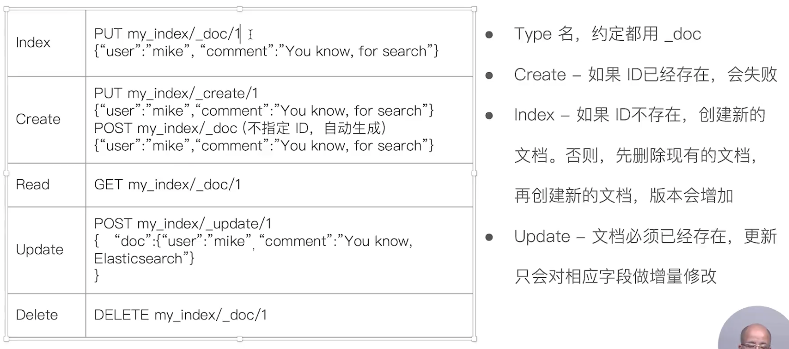

## Create 文档

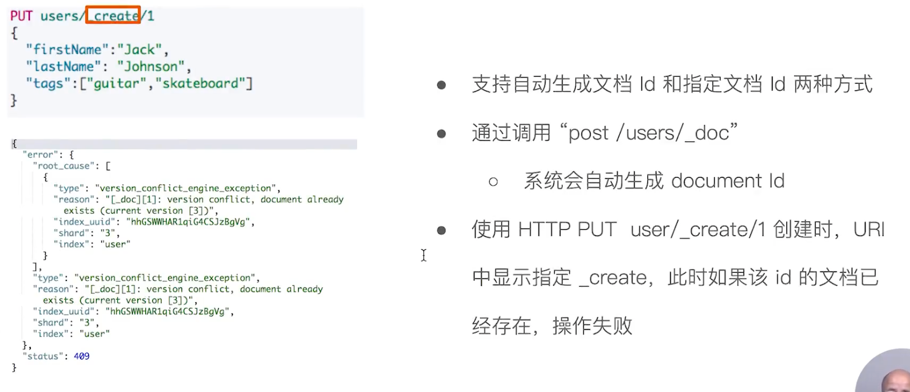

## Get 文档

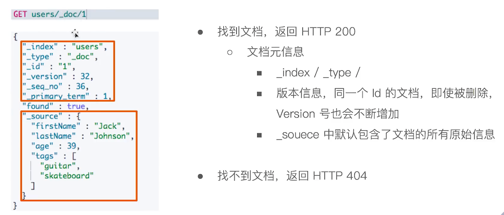

## Index 文档

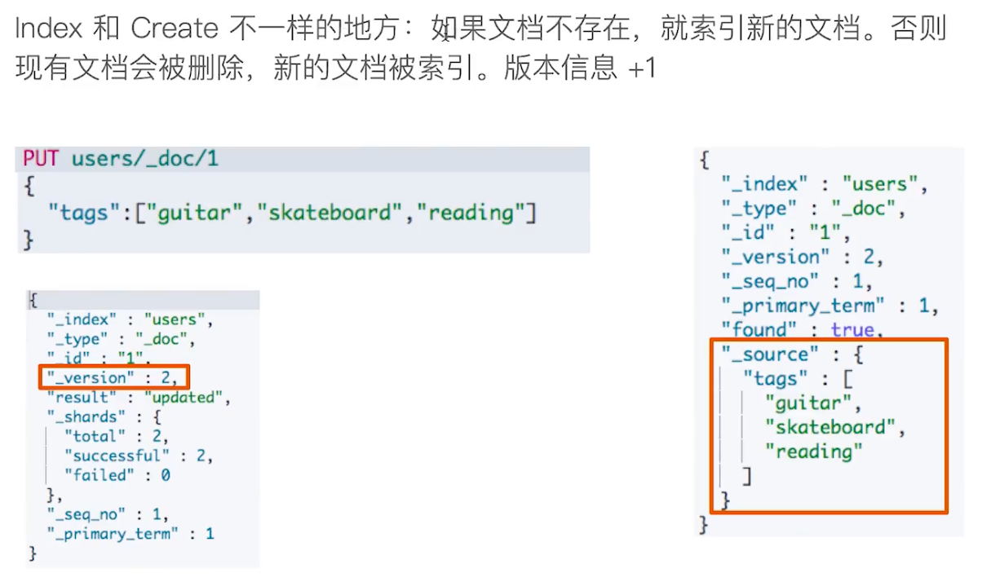

## Update 文档


## Bulk API


## 批量读取 - mget


## 批量查询 - msearch

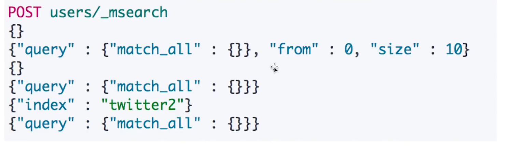

# 倒排索引

- 图书
  - 正排索引 - 目录页
  - 倒排索引 - 书籍末尾的索引页
- 搜索引擎
  - 正排索引 - 文档 id 到文档内容和单词的关联
  - 倒排索引 - 单词到文档 id 的关系

## 正排索引和倒排索引

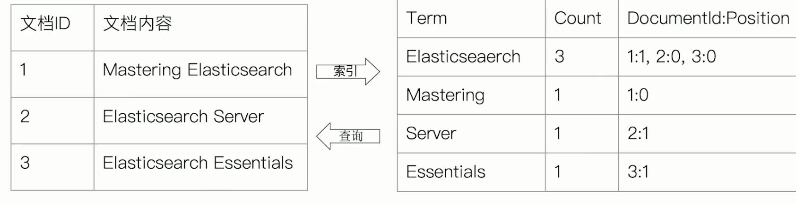

## 倒排索引的核心组成

**单词词典**（Term Dictionary）: 记录所有的文档的单词，记录单词到倒排列表的关联关系。单词词典一般比较大，可能通过B+树或者哈希拉链法实现，以满足高性能的插入与查询。

**倒排列表**（Posting List）: 记录了单词对应的文档，由一个个的倒排索引项组成。

倒排索引项

- 文档 Id
- 词频 TF 该单词在文档中出现的次数，用于相关性评分
- 位置（Position）单词在文档中分词的位置，用于语句搜索（phrase query）
- 偏移（Offset）记录单测的开始结束位置，实现高亮显示

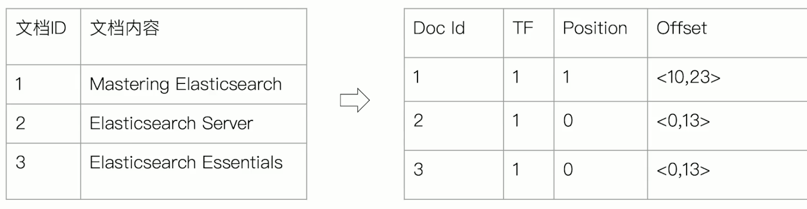

# Analysis 与 Analyzer

- Analysis 文本分析是把全文本转换一系列单词（term/token）的过程，也叫做分词
- Analysis 是通过 Analyzer 来实现的，可以使用Elasticsearch 内置的英文分词器，也可以使用对中文有更好支持的中文分词器
- 除了在数据写入时转换词条，匹配Query 语句的时候也需要用相同的分词器对查询语句进行分析

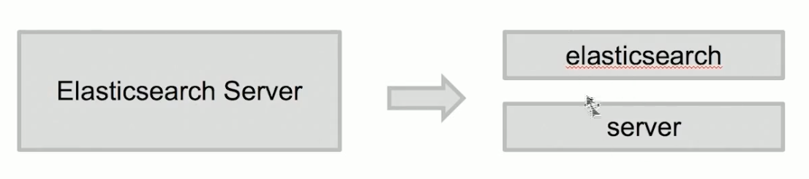

## Analyzer 的组成

分词器是专门处理分词的组件，Analyzer 由三部分组成

- Character Filters : 针对原始文本处理，例如去除html
- Tokenizer : 按照规则切分为单词
- Token Filter : 将切分的单词进行加工，小写，删除 stopwords，增加同义词
- 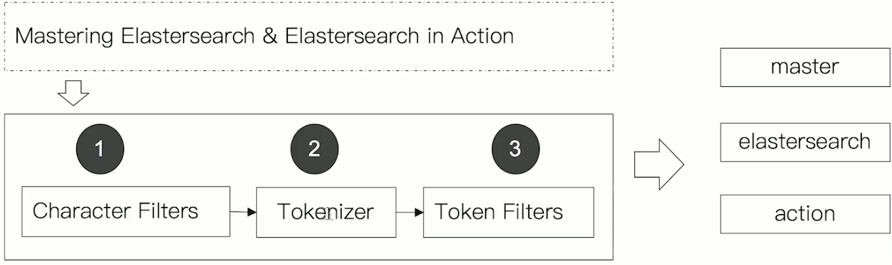 

## Elasticsearch 的内置分词器

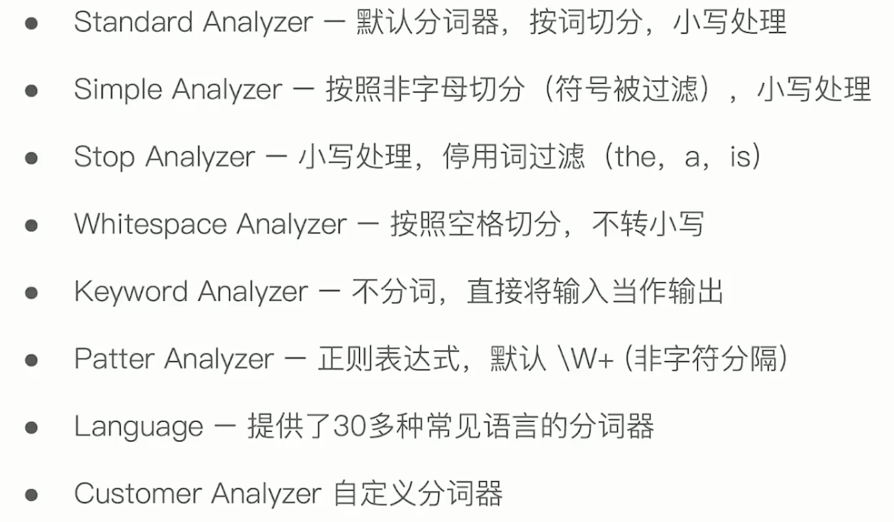

## 使用 _analyzer API

- 直接使用 Analyzer 进行测试
- 指定索引的字段进行测试
- 自定义分词器组合进行测试

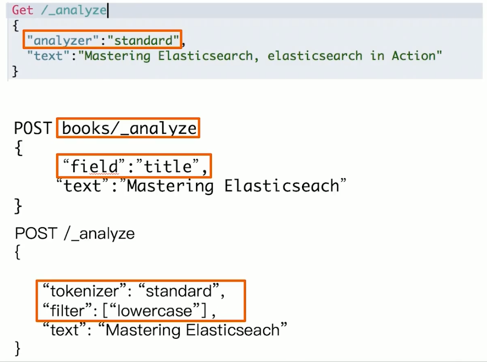

## Standard Analyzer

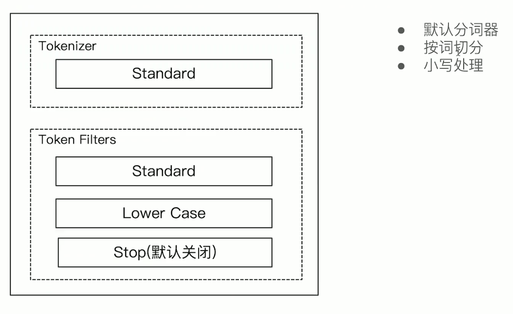

## Simple Analyzer


## Keyword Analyzer


## 其他分词器

- #Simple Analyzer – 按照非字母切分（符号被过滤），小写处理
- #Stop Analyzer – 小写处理，停用词过滤（the，a，is）
- #Whitespace Analyzer – 按照空格切分，不转小写
- #Keyword Analyzer – 不分词，直接将输入当作输出
- #Patter Analyzer – 正则表达式，默认 \W+ (非字符分隔)
- #Language – 提供了30多种常见语言的分词器

# Search

- URI Search
  - 在URL 中使用查询参数
- Request Body Search
  - 使用Elasticsearch 提供的，基于JSON 格式的更加完备的 Query Domain Specific Language（DSL）

## 指定查询的索引

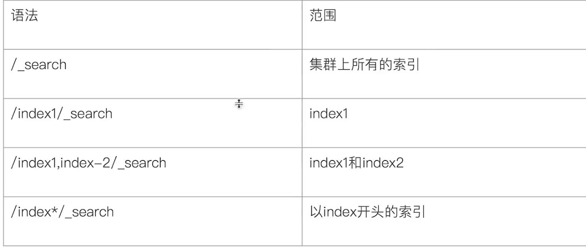

## Request Body Search

- 将查询语句通过HTTP Request Body 发送给 Elasticsearch

- Query DSL

  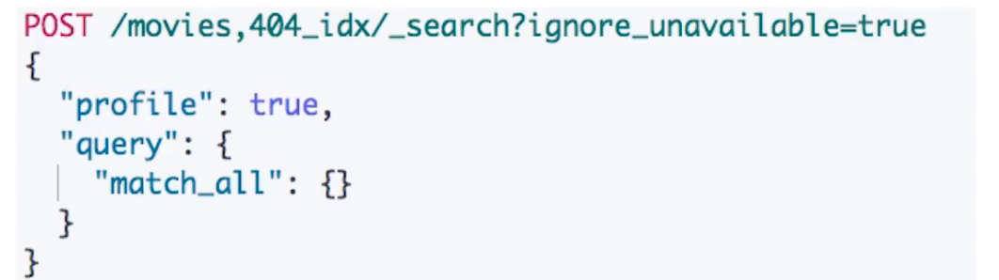

### 分页

- from 从0 开始，默认返回10个结果
- 获取靠后的翻页成本较高

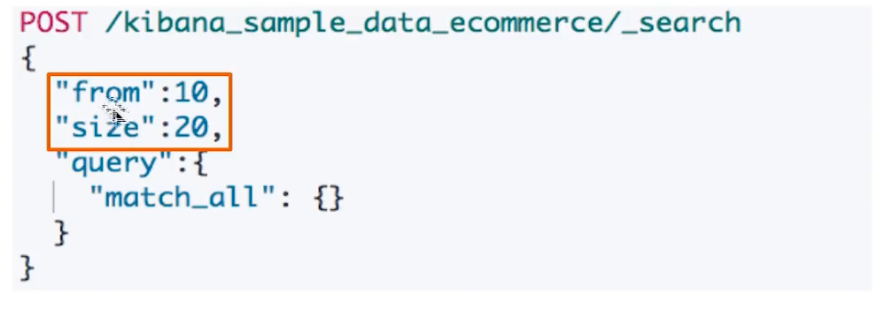

### 排序

- 最好在 数字型 与日期型 字段上排序

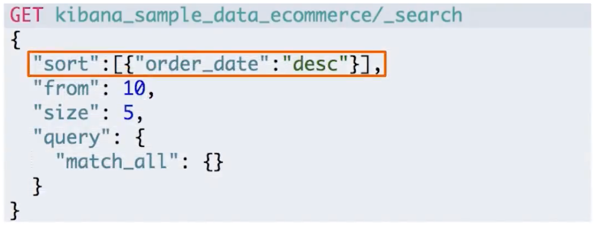

### _source filtering

- 如果有_source 没有设置，那就只返回匹配的文档的元数据，可以通过 _source 来过滤出你关注的字段
- _source 支持使用通配符 _source[“name*,desc*”]


### 脚本字段

用例: 订单中有不同的汇率，需要结合汇率对 订单价格进行排序


### 使用查询表达式——X！！

- Term 之间的关系是 OR，所以会查询出包括Last 和 Christmas的数据

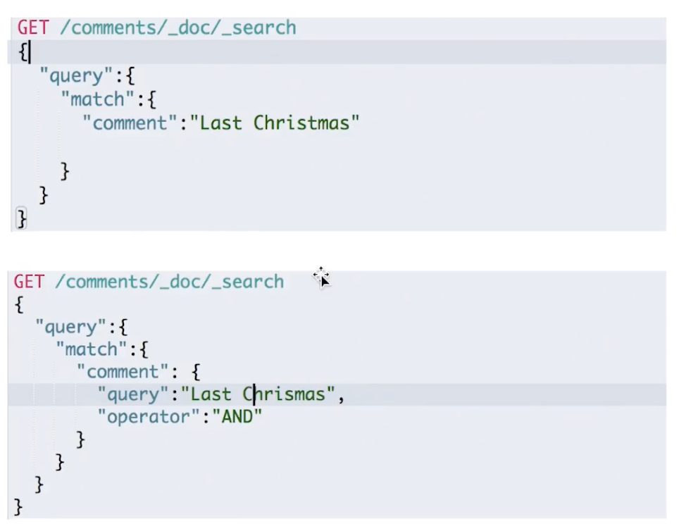

## 查询 Response

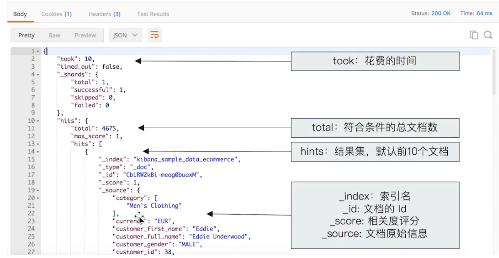

## 搜索的相关性 Relevance


# Mapping

##  Mapping的定义

- Mapping 类似于数据库中的 schema 的定义，作用如下:
  - 定义索引中的字段的名称
  - 定义字段的数据类型，例如字符串，数字，布尔
  - 字段，倒排索引的相关配置（Analyzed or Not Analyzed，Analyzer）
- Mapping 会把 JSON 文档映射成 Lucene 所需要的扁平格式
- 一个 Mapping 属于一个索引的 Type
  - 每个文档都属于一个 Type
  - 一个 Type 有一个 Mapping 定义
  - 7.0 开始，不需要再 Mapping定义中指定 type信息

## 字段的数据类型

- 简单类型
  - Text / Keyword
  - Date
  - Integer / Floating
  - Boolean
  - IPv4 / IPv6
- 复杂类型 - 对象和嵌套对象
  - 对象类型 / 嵌套类型
- 特殊类型
  - geo_point & geo_shape / percolator

## Dynamic Mapping

- 在写入文档时候，如果索引不存在，会自动创建索引
- Dynamic Mapping 的机制，使得我们无需手动定义Mappings，Elasticsearch 会自动根据文档信息，推算出字段的类型
- 但是有时候会推算的不对，例如地理位置信息
- 当类型如果设置不对时，会导致一些功能无法正常运行，例如 Range查询


## 类型的自动识别

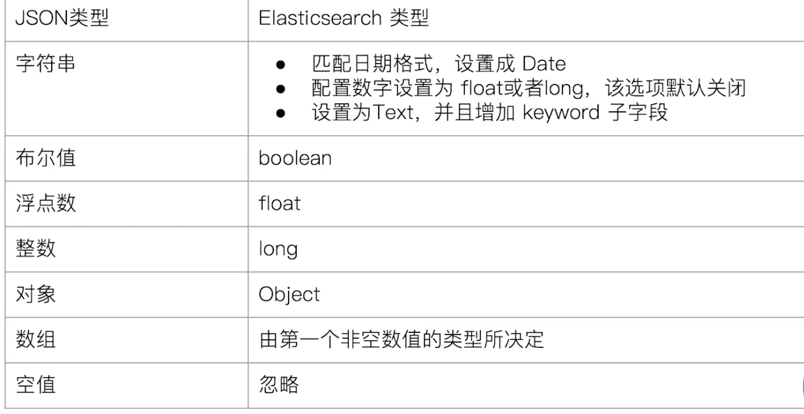

## 能否更改Mapping的字段类型

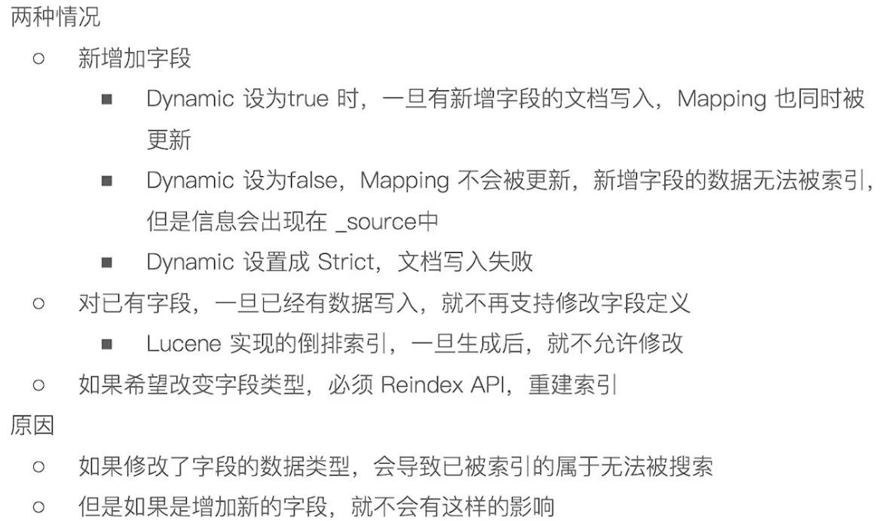

## 控制 Dynamic Mappings

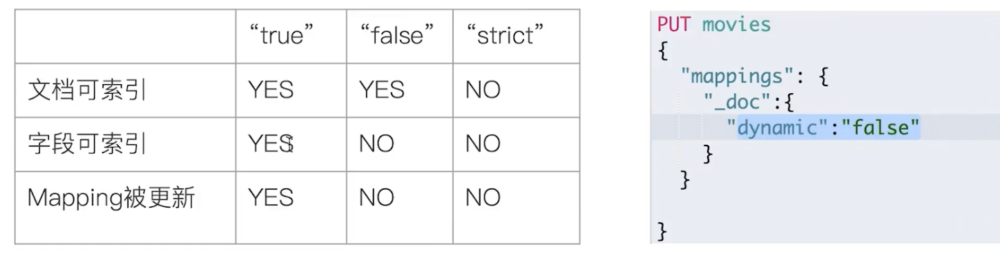

- 当 dynamic 被设置成false时候，存在新增字段的数据写入，该文档可以被索引，但新增字段会被丢弃，这里的丢弃是指无法被索引，但是还是会存在于source中
- 当设置为 strict 模式时候，数据写入直接出错

## 控制当前字段是否被索引

- Index : 控制当前字段是否被索引，默认为true，如果设置为false，该字段不可被搜索，这样就可以节省很多物理磁盘的空间，这样该字段的倒排索引就不会被创建了。


四种不同级别的 Index Options 配置，可以控制倒排索引记录的内容:

- docs —— 记录 doc id
- freqs —— 记录 doc id 和term frequuencies
- poisitions —— 记录 doc id / term frequuencies / term position
- offsets  —— 记录 doc id / term frequuencies / term position /character offects

Text 类型默认记录 postions，其他默认为 docs

记录内容越多，中庸存储空间越大


## null_value

用来对Null值进行搜索


## copy_to 设置


## 数组类型

- Elasticsearch 中不提供专门的数组类型，但是任何字段，都可以包含多个相同类型的数值


## 多字段类型

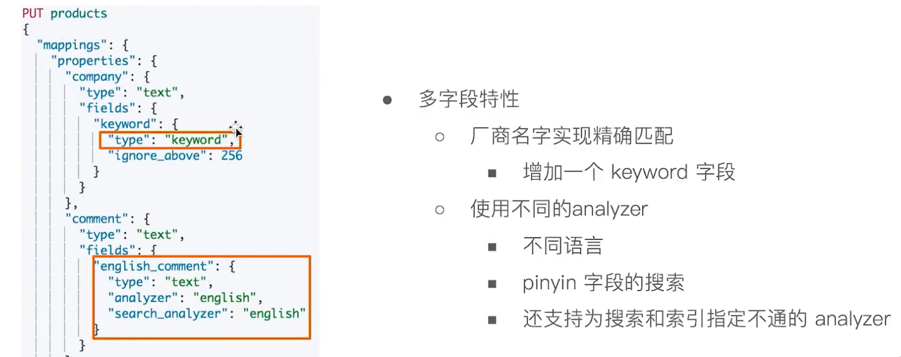

## Exact Vlaues（精确值） & Full Text（全文本）

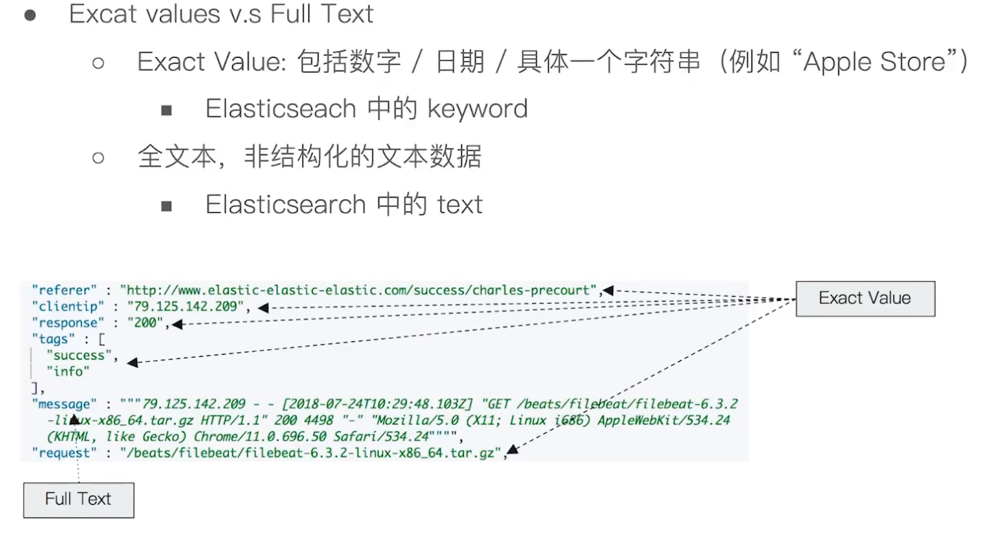

## Exact Values 不需要被分词

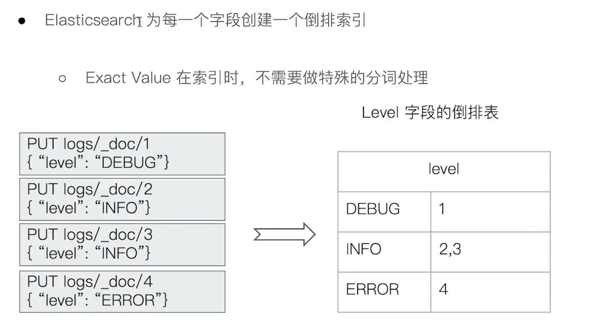

## 自定义分词

- 当 Elasticsearch 自带的分词器无法满足时，可以自定义分词器，通过自组合不同的组件实现
  - Character Filter
  - Tokenizer
  - Token Filter

## Character Filter

- 在 Tokenizer 之前对文本进行处理，例如增加删除及替换字符，可以配置多个 Character Filter，会影响 Tokenizer 的 position 和 offset 信息
- ES 默认提供的 Character Filters
  - HTML strip 去除html标签
  - Mapping 字符串替换
  - Pattern replace 正则匹配替换

## Tokenizer

- 将原始的文本按照一定的规则，切分为词（token 或 term）
- Elasticsearch 内置的 Tokenizers
  - whitespace / standard / pattern / keyword / path hierarchy
- 可以用Java 开发插件，实现自己的 Tokenizer

## Token Filter

- 将 Tokenizer 输出的单词（term）进行增加，修改，删除
- 自带的 Token Filters
  - Lowercase （转小写）/ stop （去除停顿词）/  synonym（添加近义词）
- 

## 自定义分词案例

### 使用自定义的Character Filter去除HTML标签

```json
POST _analyze
{
  "tokenizer":"keyword",
  "char_filter":["html_strip"],
  "text": "<b>hello world</b>"
}
```

### 使用自定义的Character Filter进行字符替换

```json
POST _analyze
{
  "tokenizer": "standard",
  "char_filter": [
      {
        "type" : "mapping",
        "mappings" : [ "- => _"]
      }
    ],
  "text": "123-456, I-test! test-990 650-555-1234"
}
```

### 使用自定义的Character Filter进行正则表达式过滤

```json
GET _analyze
{
  "tokenizer": "standard",
  "char_filter": [
      {
        "type" : "pattern_replace",
        "pattern" : "http://(.*)",
        "replacement" : "$1"
      }
    ],
    "text" : "http://www.elastic.co"
}
```

### 在Token Filter中设置 lowercase与stop

```json
GET _analyze
{
  "tokenizer": "whitespace",
  "filter": ["lowercase","stop"],
  "text": ["The gilrs in China are playing this game!"]
}
```

## Index Template

当你需要根据某种规则来自动创建索引的时候，Index Template就会派上用场，比如对每天的日志文件创建索引，这样可以更好的管理日志。Index Templates 帮助你设定 Mappings 和 Seettings，并按照一定的规则，自动匹配到新创建的索引之上。

- 模版仅在一个索引被创建时，才会产生作用。修改模版不会影响已创建的索引
- 你可以设定doge索引模版，这些设置会被“merge”在一起
- 也可以指定“order”的数值，控制“merging”的过程

**两个Index Templates示例**

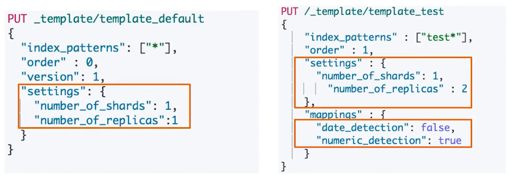

### Index Template 的工作方式

当一个索引被创建时：

- 应用Elastcsearch 默认的 settings 和mappings
- 应用order 数值低的Index Template 中的设定
- 应用order 高地Index Template 中的设定，之前的设定会被覆盖
- 应用创建索引时，用户所指定的 settings 和 mappings，并覆盖之前的模板中的设定

## Dynamic Template

设置该项可以提高数据动态推断时的精准度（开启根据文档动态创建所以的前提下），根据ES 识别的的数据类型，结合字段名称，来动态设定字段类型

- 所有的字符串类型都设定为Keyword，或者关闭Keyword字段
- is开头的字段都设置成boolean
- long_开头的都设置为long型

  

## 聚合（Aggregation）

- ES的报表功能就是基于此项
- ElasticSearch 除搜索以外，提供的针对ES数据进行统计分析的功能
  - 实时性高
  - Hadoop（T+1）
- 通过聚合，我们会得到一个数据的概览，是分析和总结全套的数据，而不是寻找单个文档
- 高性能，只需要一条语句，就可以从ElasticSearch得到分析结果，无需在客户端自己实现分析逻辑 

### Kibana 可视化报表——聚合分析


### 集合的分类

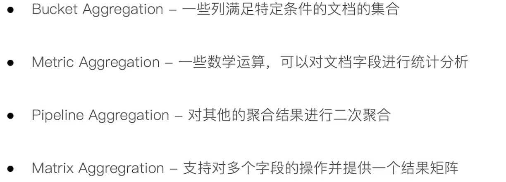

### Bucket & Metric

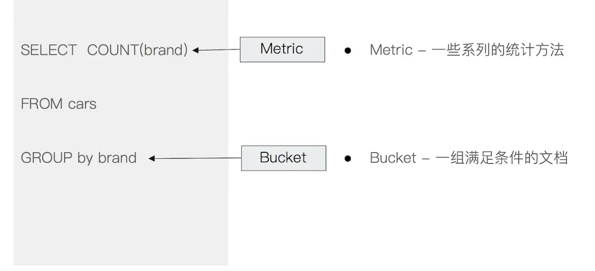

### Bucket


### Metric

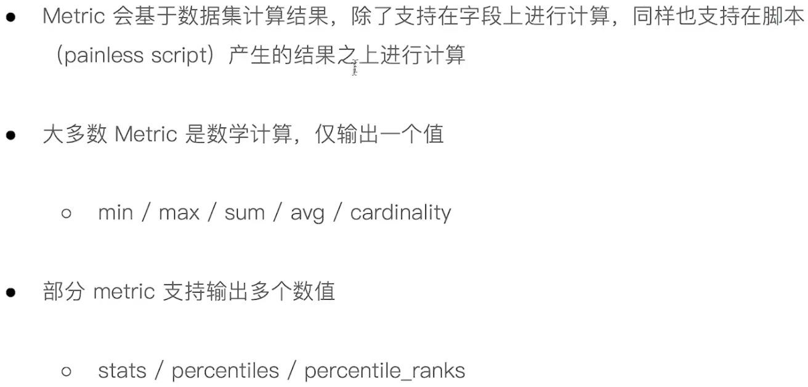

### 一个Bucket的例子

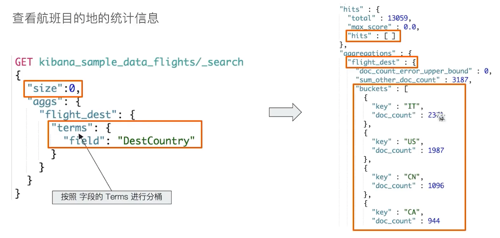 

### 加入Mertics

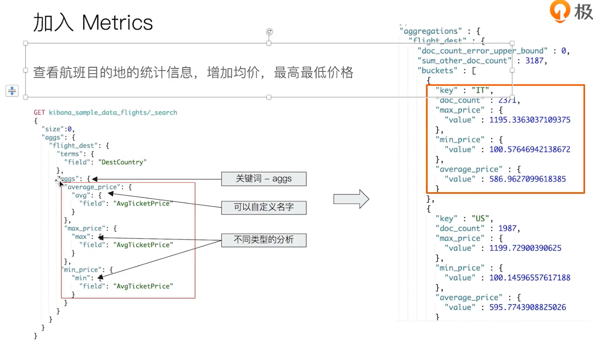

### 嵌套

查看航班目的地的统计信息，平均票价，以及天气状况

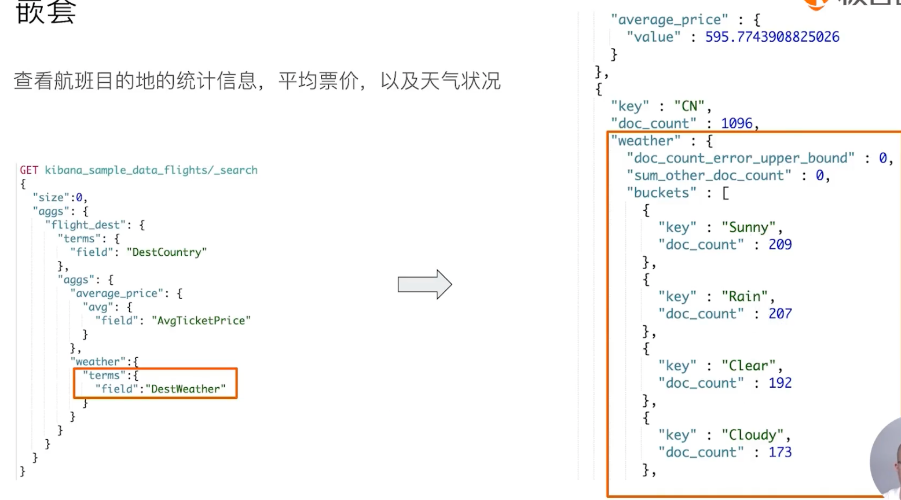


# 总结

## 基础概念

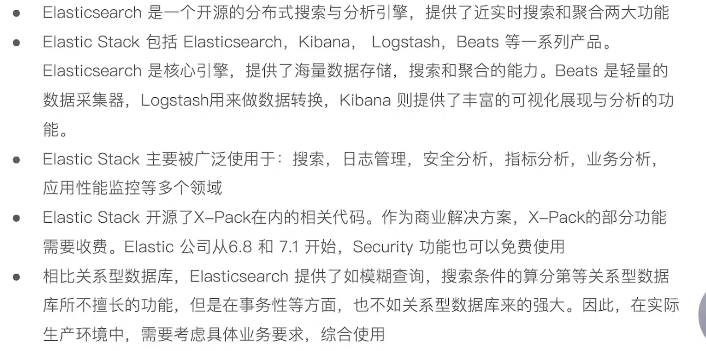

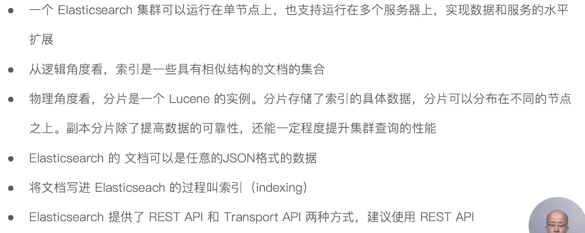

## 搜索和聚合

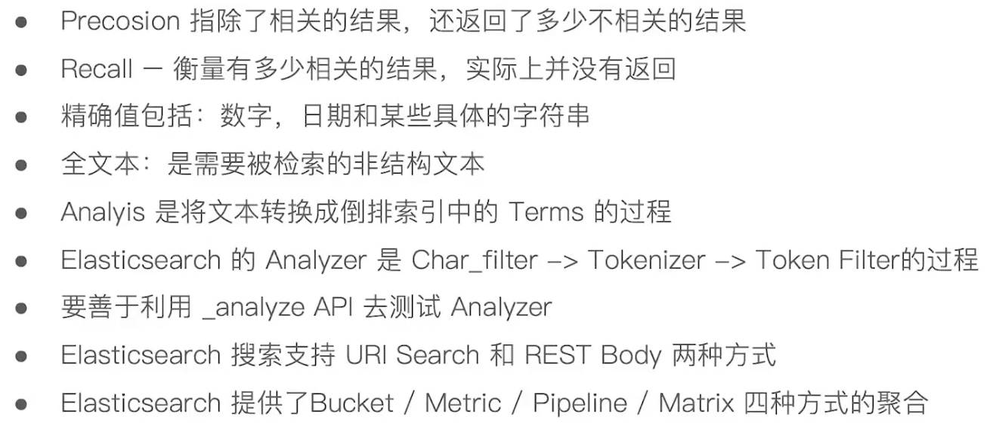

##  文档的CRUD和Index Mapping

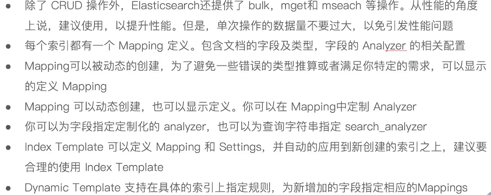

 

