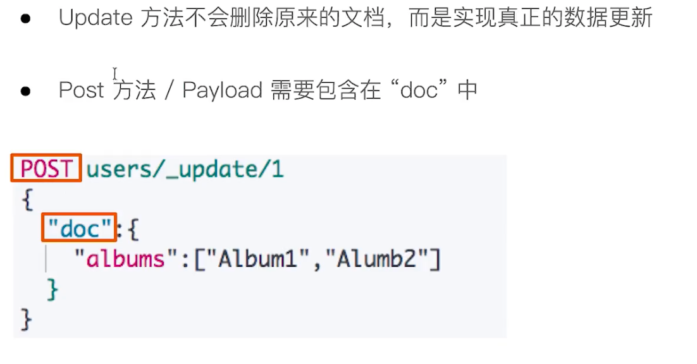

# ES 版本更新

## 新特性 6.x

1. 基于 Lucene 7.x 
2. 新功能
   - 跨集群复制
   - 索引什么周期管理
   - SQL的支持
3. 更友好的升级及数据迁移
   - 在主要版本之间的迁移更为简化，体验升级
   - 全新的基于操作的数据复制框架，可加快恢复数据
4. 性能优化
   - 有效存储稀疏字段的新方法，降低了存储成本
   - 在索引时进行排序，可加快排序的查询性能

## 新特性 7.x

1. 基于Lucene 8.0
2. 正式废除单个索引下多Type的支持
3. 7.1版本开始，Security 功能免费使用
4. ECK -Elasticsearch Opreator on Kubernets
5. 新功能
   - New Cluster coordination
   - Feature-Cpmlete High Level REST Client
   - Script Score Query
6. 性能优化
   - 默认的 Primary Shard 数从5改为1，避免Over Sharding
   - 性能优化，更快的 Top K

# Elastic Stack 生态圈


## Logstash

开源的服务器端数据处理管道，支持从不同来源采集数据，转换数据，并将数据发送到不同的数据库中。

1. 实时解析和转换数据
   1. 从IP 地址破译出地理坐标
   2. 将PII 数据匿名化，完全排除敏感字段
2. 可扩展
   - 200多个插件（日志/数据库/Arcsigh/Netflow）
3. 安全性
   - LogStash 会通过持久化队列来保证只要将运行中的事件送达一次
   - 数据传输加密
4. 监控

## Kibana

可视化利器，数据可视化工具

## Beats

轻量的数据采集器

# ES 应用场景

## ES 与数据库集成


## 日志分析


# ES 的安装及使用

## Elasticsearch 的目录结构


## JVM 配置

- 修改 JVM - config/jvm.options
  - 7.1 默认设置为1GB
- 配置建议
  - Xms 和 Xmx 设置为一样
  - Xmx 不要超过机器内存的50%  

## ES 常用命令

1. 查看已安装的插件

   localhost:9200/_cat/plugins

2. 查看ES集群的节点	

   localhost:9200/_cat/nodes

3. 查看已安装的插件

   bin/elasticsearch-plugin list	

4.  安装icu分词器

   bin/elasticsearch-plugin install	analysis-icu

5. ES启动多实例

   bin/elasticsearch -E node.name=node1 -E cluster.name=geektime -E path.data=node1_data

   bin/elasticsearch -E node.name=node2 -E cluster.name=geektime -E path.data=node2_data

   bin/elasticsearch -E node.name=node3 -E cluster.name=geektime -E path.data=node3_data

6. 删除进程

   ps grep | elasticsearch / kill pid

# Docker 中运行ELK Stack

## [Docker使用教程](https://www.runoob.com/docker/docker-tutorial.html)

## 在Docker容器中运行Elasticsearch, Kibana和Cerebro

进入 docker-compose.yaml 文件所在的目录

```shell
#启动
docker-compose up

#停止容器
docker-compose down

#停止容器并且移除数据
docker-compose down -v

#一些docker 命令
docker ps
docker stop Name/ContainerId
docker start Name/ContainerId

#删除单个容器
$docker rm Name/ID
-f, –force=false; -l, –link=false Remove the specified link and not the underlying container; -v, –volumes=false Remove the volumes associated to the container

#删除所有容器
$docker rm `docker ps -a -q`  
停止、启动、杀死、重启一个容器
$docker stop Name/ID  
$docker start Name/ID  
$docker kill Name/ID  
$docker restart name/ID
```

## 相关阅读

- 安装docker https://www.docker.com/products/docker-desktop
- 安装 docker-compose https://docs.docker.com/compose/install/
- 如何创建自己的Docker Image - https://www.elastic.co/cn/blog/how-to-make-a-dockerfile-for-elasticsearch
- 如何在为docker image安装 Elasticsearch 插件 - https://www.elastic.co/cn/blog/elasticsearch-docker-plugin-management
- 如何设置 Docker 网络 - https://www.elastic.co/cn/blog/docker-networking
- Cerebro 源码 https://github.com/lmenezes/cerebro
- 一个开源的 ELK（Elasticsearch + Logstash + Kibana） docker-compose 配置 https://github.com/deviantony/docker-elk
- Install Elasticsearch with Docker https://www.elastic.co/guide/en/elasticsearch/reference/7.2/docker.html

# Logstash 安装与测试数据导入

## 安装Logstash，并且导入Movielens的测试数据集

- Small: 100,000 ratings and 3,600 tag applications applied to 9,000 movies by 600 users. Last updated 9/2018.
- movielens/ml-latest-small/movies.csv movie数据
- movielens/logstash.conf //logstash 7.x 配置文件，
- movielens/logstash6.conf //logstash 6.x 配置文件

```
#下载与ES相同版本号的logstash，（7.1.0），并解压到相应目录
#修改movielens目录下的logstash.conf文件
#path修改为,你实际的movies.csv路径
input {
  file {
    path => "YOUR_FULL_PATH_OF_movies.csv"
    start_position => "beginning"
    sincedb_path => "/dev/null"
  }
}

#启动Elasticsearch实例，然后启动 logstash，并制定配置文件导入数据
sudo ./logstash -f /Users/networkcavalry/Documents/GitHub/geektime-ELK/part-1/2.4-Logstash安装与导入数据/movielens/logstash.conf
```

## 相关阅读

- 下载最MovieLens最小测试数据集：https://grouplens.org/datasets/movielens/
- Logstash下载：https://www.elastic.co/cn/downloads/logstash
- Logstash参考文档：https://www.elastic.co/guide/en/logstash/current/index.html

# ES 基础概念

## 文档

- Elasticsearch 是面向文档的，文档时所有可搜索数据的最小单位

  - 日志文件中的日志项
  - 一本唱片的详细内容
  - 一篇PDF文档中的具体内容

- 文档会被序列化为JSON格式，保存在Elasticsearch中

  - JSON对象由字段组成
  - 每个字段都有对应的字段类型（字符串/数值/布尔/日期/二进制/范围类型）

- 每个文档都有一个唯一的ID

  - 可以手动指定
  - 也可以通过Elasticsearch 自动生

- 一篇文档包含了一系列的字段，类似于数据库表中一条记录

- JSON 文档，格式灵活，不需要预先定义格式 

  - 字段的类型可以指定或者通过 Elasticsearch 自动推算
  - 支持数组 / 支持嵌套

  

**文档元数据**


## 索引


**索引的不同语意**


## Type

在 7.0 之前，一个Index 可以设置多个Types ，6.0 开始，Type 已经被 Deprecated。7.0 开始，一个索引只能创建一个 Type——“_doc”。

## 抽象与类比


# 分布式系统的可用性与扩展性

- 高可用性
  - 服务可用性 - 允许有节点停止服务
  - 数据可用性 - 部分节点丢失，不会丢失数据
- 可扩展性
  - 请求量提升 / 数据的不断增长（将数据分布到所有节点上）

**分布式特性**

- Elasticsearch 的分布式架构的好处
  - 存储的水平扩容
  - 提高系统的可用性，部分节点停止服务，整个集群的服务不受影响
- Elasticsearch 的分布式架构
  - 不同的集群通过不同的名字来区分，默认名字“elasticsearch”
  - 通过配置文件修改，或者在命令行中 -E cluster.name=geektime 进行设定
  - 一个集群可以有一个或多个节点

## 节点

- 节点是一个 Elasticsearch 的实例
  - 本质上是一个Java 进程
  - 一台机器上可以运行多个 Elasticsearch 进程，但生产环境一般建议一台机器上只运行一个 Elasticsearch 实例
- 每个节点都有一个名字，通过配置文件配置，或者启动时候 —E node.name=node1 指定
- 每一个节点在启动之后，会分配一个UID，保存在data目录下

### Master eligible nodes 和 Master Node

- 每个节点启动后，默认是一个 Master eligible 节点
  - 可以设置 node.master:false 禁止
- Master-eligible 节点可以参加选主流程，成为 Master 节点
- 当第一个节点启动时候，它会将自己选举成 Master 节点
- 每个节点上都保存了集群的状态，只有 Master 节点能修改集群的状态信息
  - 集群状态（Cluster State），维护了一个集群中必要的信息
    - 所有的节点信息
    - 所有的索引和其相关的 Mapping 与 Setting 信息
    - 分片的路由信息
  - 如果任意节点都可以修改信息的话，会导致数据的不一致性

### Data Node 和 Coorinating Node

- Data Node 
  - 可以保存数据的节点，叫做 Data Node，负责保存分片数据，在数据扩展上起到了至关重要的作用。
- Coorinating Node
  - 负责接受Client的请求，将请求分发到合适的节点，最终把结果汇集到一起
  - 每个节点默认都起到了 Coorinating Node 的职责

### 其他节点类型

- Hot & Warm Node
  - 不同硬件配置的 Data Node，用来实现Hot & Warm 架构，降低集群部署的成本
- Machine Learning Node
  - 负责跑 机器学习的Job，用来做异常检测

## 分片

**（Primary Shard & Replica Shard）**

-  主分片，用以解决数据水平扩展的问题。通过珠峰片，可以将数据分布到集群内的所有节点上
  - 一个分片是一个运行的 Lucene 的实例
  - 主分片数在索引创建时指定，后续不允许修改，除非 ReIndex
- 副本，用以解决数据高可用的问题。分片是主分片的拷贝
  - 副本分片数，可以动态调整
  - 增加副本数，还可以在一定程度上提高服务的可用性（读取的吞吐）
- 一个三节点的集群中，blogs 索引的分片分布情况


### 分片的设定

对于生产环境中分片的设定，需要提前做好容量规划

- 分片设置过小
  - 导致后续无法增加节点实现水平扩展
  - 单个分片的数据量太大，导致数据重新分配耗时
- 分片设置过大，7.0 开始，默认主分片设置为1，解决了 over-sharding 的问题
  - 影响搜索结果的相关性打分，影响统计结果的准确性
  - 单个节点上过多的分片，会导致资源浪费，同时也会影响性能

## 查看集群的健康状况


# 文档的 CRUD


## Create 文档


## Get 文档


## Index 文档

](img/ElasticSearch核心技术与实践一/image-20201208001325110.png)

## Update 文档



## Bulk API


## 批量读取 - mget


## 批量查询 - msearch


# 倒排索引

- 图书
  - 正排索引 - 目录页
  - 倒排索引 - 书籍末尾的索引页
- 搜索引擎
  - 正排索引 - 文档 id 到文档内容和单词的关联
  - 倒排索引 - 单词到文档 id 的关系

## 正排索引和倒排索引


## 倒排索引的核心组成

**单词词典**（Term Dictionary）: 记录所有的文档的单词，记录单词到倒排列表的关联关系。单词词典一般比较大，可能通过B+树或者哈希拉链法实现，以满足高性能的插入与查询。

**倒排列表**（Posting List）: 记录了单词对应的文档，由一个个的倒排索引项组成。

倒排索引项

- 文档 Id
- 词频 TF 该单词在文档中出现的次数，用于相关性评分
- 位置（Position）单词在文档中分词的位置，用于语句搜索（phrase query）
- 偏移（Offset）记录单测的开始结束位置，实现高亮显示


# Analysis 与 Analyzer

- Analysis 文本分析是把全文本转换一系列单词（term/token）的过程，也叫做分词
- Analysis 是通过 Analyzer 来实现的，可以使用Elasticsearch 内置的英文分词器，也可以使用对中文有更好支持的中文分词器
- 除了在数据写入时转换词条，匹配Query 语句的时候也需要用相同的分词器对查询语句进行分析


## Analyzer 的组成

分词器是专门处理分词的组件，Analyzer 由三部分组成

- Character Filters : 针对原始文本处理，例如去除html
- Tokenizer : 按照规则切分为单词
- Token Filter : 将切分的单词进行加工，小写，删除 stopwords，增加同义词
-  

## Elasticsearch 的内置分词器


## 使用 _analyzer API

- 直接使用 Analyzer 进行测试
- 指定索引的字段进行测试
- 自定义分词器组合进行测试


## Standard Analyzer


## Simple Analyzer


## Keyword Analyzer


## 其他分词器

- #Simple Analyzer – 按照非字母切分（符号被过滤），小写处理
- #Stop Analyzer – 小写处理，停用词过滤（the，a，is）
- #Whitespace Analyzer – 按照空格切分，不转小写
- #Keyword Analyzer – 不分词，直接将输入当作输出
- #Patter Analyzer – 正则表达式，默认 \W+ (非字符分隔)
- #Language – 提供了30多种常见语言的分词器

# Search API

- URI Search
  - 在URL 中使用查询参数
- Request Body Search
  - 使用Elasticsearch 提供的，基于JSON 格式的更加完备的 Query Domain Specific Language（DSL）

## 指定查询的索引


## URI 查询 

- 使用“q”，指定查询字符串
- “query string syntax”，KV键值对


## Request Body 查询


## 查询 Response


## 搜索的相关性 Relevance


## URI Search 通过 URI query 实现搜索


## Query String Syntax

