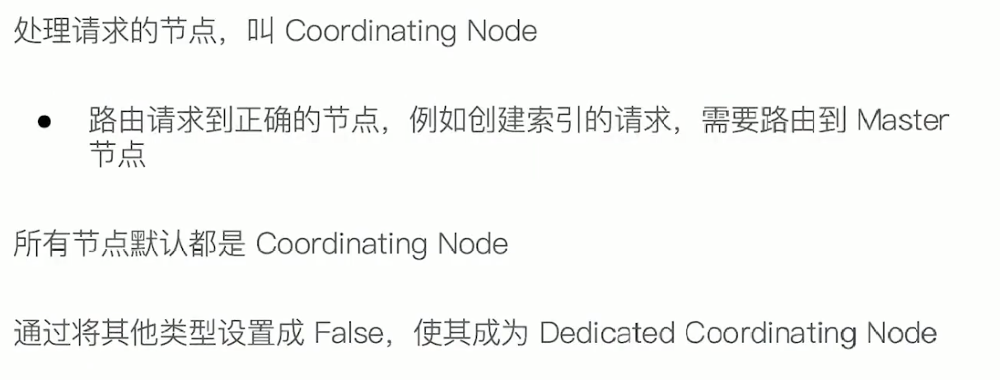
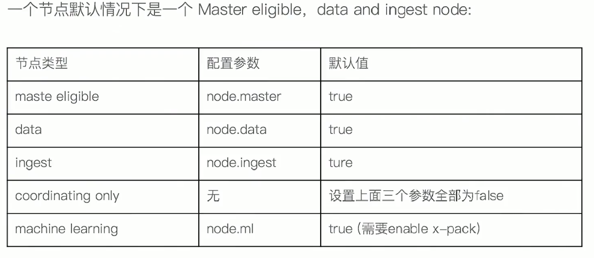

##  基于Trem的查询

- Term是表达语意的最小单位，搜索和利用统计语言模型进行自然语言处理都需要处理Term

- Term Level Query: Term Query/ Range Query/ Exists Query/ Prefix Query/ Wildard Query
- 在ES中，Term查询，对输入**不做分词**，会将输入作为一个整体，在倒排索引中查找准确的词项，并且使用相关度算分公式为每个包含该词项的文档进行 **相关度算分**，例如“Apple-Store”
- 可以通过 Constant Source 将查询转换成一个 Filtering，避免算分，并利用缓存，提高性能

###  多字段Mapping和Term查询 

 

复合查询 — Constant Score 转为 Filter

- 将Query 装成 Filter，忽略 TF-IDF计算，避免相关性算分的开销
- Filter 可以有效利用缓存

## 基于全文的查询

- 基于全文本的查找: Match Query / Match Phrase Query / Query String Query
- 索引和搜索时都会进行分词，查询字符串先传递到一个合适的分词器，然后生成一个供查询的词项列表
- 查询时，先对输入**的查询进行分词**，然后每个词项逐个进行底层的查询，最终将结果进行合并，并未每个文档生成一个算分。例如查“Matrix reloaded”，会查到包括Matrix 或者 reload 的所有结果

Match Query 查询过程

##  结构化数据

### ES中的结构化搜索

**小结**

## 相关性和相关性算分

根据词项的重要程度和在一篇文档中出现的频率来进行相关性的算分

#### 词频TF

### 逆文档频率 IDF 

# Query Context & Filter Context

query Context 会计算相关性算分

filter Context 不会计算相关性算分，所以性能更好一些 

### Bool 查询

 

### Bool 嵌套

### Bool 嵌套的结构，会对相关度算分产生影响

### 控制字段的Boosting 来影响算分

### boosting Query 查询

控制查询的精准度，调小某个词的算分权重

# 单字符串多字段查询

## Dis Max Query

Bool Query在用should进行时，只是将各个字段上的评分做一个加和，当处理一些竞争字段的时候，返回的算分并不满足我们的期望，所以产生了Dis Max Query 

### 示例

上面的查询结果是 doc1排在doc2的前面，原因在于doc1命中了两条should语句

### 算分过程

- 查询should语句中的两个查询
- 加和两个查询的评分
- 乘以匹配语句的总数
- 除以所有语句的总数

### Disjunction Max Query

这个时候doc2就会排在doc1的前面

## 三种场景

## Multi Match Query

### best_fields

### most_fields

使用多数字段匹配解决

### cross_fields

# Search Template和Index Alias

Search Template 解耦程序&搜索DSL 

Index Alias 实现零停机运维

# Function-Score-Query优化算分 

## 算分与排序

- Elasticsearch 默认会以文档的相关度算分进行排序
- 可以通过指定一个或者多个字段进行排序
- 使用相关度算分（score）排序，不能满足某些特定条件，无法针对相关度，对排序实现更多的控制

## Function-Score-Query

可以看到点赞数对 _source的影响很大，但这并不是我们想要的，我们可以使用Modifier来控制它的影响度

### 使用 Modifier 平滑曲线

### 还可以引入 Factor

Boost Mode 和 Max Boost

### 一致性随机函数

# Term&Phrase-Suggester

## 什么是搜索建议

## Elasticsearch Suggester API

- 搜索引擎中类似的功能，在 Elasticsearch 中是通过 Suggester API 实现的
- 原理：将输入的文本分解为 Token，然后在索引的字典里查找相似的 Term 并返回
- 根据不同的使用场景，ElasticSearch 设计了4种类别的 Suggesters
  - Term & Phrase Suggester
  - Complete & Context Suggester

### Term Suggester - Missing Mode

### Phrase Suggester

### Complete Suggester

**使用Complete SUggester 的步骤**

 

### Context Suggester

 

## 精准度和召回率

### 精准度

Copmletion > Phrase > Term

### 召回率

Term > Phrase > Completion

### 性能

Completion > Phrase > Term

# 跨集群搜索

## 水平扩展的痛点

## 跨集群搜索 Cross Cluster Search

### 配置及查询

# 集群分布式模型及选主与脑裂问题

## 分布式特性

## 节点

## Coordinating Node

## Data Node

## Master Node

## Master Eligible Node & 选主流程

### 脑裂问题

## 如何避免脑裂问题

## 集群状态

## 配置节点类型

# 分片和集群的故障转移

## Primary Shard 提升系统存储容量

 

## Replica Shard 提高数据可用性

## 分片数的设定

## 单节点集群

## 再增加一个数据节点

## 故障转移

##  

## 集群健康状态

# 文档分布式存储

##  文档到分片的路由算法

## 更新一个文档

## 删除一个文档

# 分片的生命周期

## 分片的内部原理

## 倒排索引不可变性

## Lucene Index

## 什么是 Refresh

## 什么是 Transaction Log

## 什么是 Flush

## Merge

