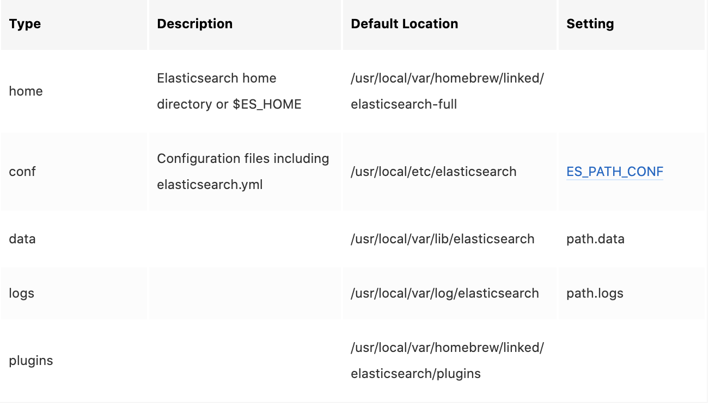

本篇我们简单介绍一下ES中的基本概念，以及它与我们所熟知的MySQL有什么关联。

## 1、ES 简介

**1）定义**

1. ES是elaticsearch简写， Elasticsearch是一个开源的高扩展的分布式全文检索引擎，它可以**近乎实时的存储**、检索数据；本身扩展性很好，可以扩展到上百台服务器，处理PB级别的数据。
2. Elasticsearch也使用Java开发并使用Lucene作为其核心来实现所有索引和搜索的功能，但是它的目的是通过简单的RESTful API来隐藏Lucene的复杂性，从而让全文搜索变得简单。

**2）特点和优势**

1. 分布式实时文件存储，可将每一个字段存入索引，使其可以被检索到。
2. 近乎实时分析的分布式搜索引擎。
3. 分布式：索引分拆成多个分片，每个分片可有零个或多个副本。集群中的每个数据节点都可承载一个或多个分片，并且协调和处理各种操作；
4. 负载再平衡和路由在大多数情况下自动完成。
5. 可以扩展到上百台服务器，处理PB级别的结构化或非结构化数据（官网是这么说的）。也可以运行在单台PC上（已测试）。
6. 支持插件机制，分词插件、同步插件、Hadoop插件、可视化插件等。

## 2、ES 基本概念

**1）节点（Node）**

运行了**单个实例的ES主机称为节点**，它是集群的一个成员，可以存储数据、参与集群索引及搜索操作。节点通过为其配置的ES集群名称确定其所要加入的集群。

**2）集群（cluster）**

ES可以作为一个独立的单个搜索服务器。不过，一般为了处理大型数据集，实现容错和高可用性，ES可以运行在许多互相合作的服务器上。这些服务器的集合称为集群。

**3）分片（Shard）**

ES的“分片(shard)”机制可将一个索引内部的数据分布地存储于多个节点，它通过**将一个索引切分为多个**底层物理的Lucene索引完成**索引数据的分割存储**功能，这每一个物理的Lucene索引称为一个分片(shard)。

这样的好处是可以**把一个大的索引拆分成多个，分布到不同的节点上**。降低单服务器的压力，构成分布式搜索，**提高整体检索的效率（分片数的最优值与硬件参数和数据量大小有关）。**分片的数量**只能在索引创建前指定，并且索引创建后不能更改。**

**4）副本（Replica）**

副本是一个分片的**精确复制**，每个分片可以有零个或多个副本。副本的作用一是**提高系统的容错性**，当某个节点某个分片损坏或丢失时可以从副本中恢复。二是**提高es的查询效率**，es会自动对搜索请求进行负载均衡。

## 3、ES的数据架构

**1）索引（index）**

ES将数据存储于一个或多个索引中，索引是具有类似特性的文档的集合。类比传统的关系型数据库领域来说，**索引相当于SQL中的一个数据库。**

一个ES集群中可以按需创建任意数目的索引，但根据不同的硬件配置，**索引数有一个建议范围**

**2）类型（Type）**

类型是索引内部的逻辑分区(category/partition)，然而其意义完全取决于用户需求。因此，一个索引内部可定义一个或多个类型(type)。一般来说，类型就是为那些拥有相同的域的文档做的预定义。类比传统的关系型数据库领域来说，**类型相当于“表”**。

**特别注意的是，**根据官网信息：在Elasticsearch 6.0.0或更高版本中创建的索引**只能包含一个映射类型**。在5.x中创建的具有多种映射类型的索引将继续像在Elasticsearch 6.x中一样工作。**类型将在Elasticsearch 7.0.0中的API中弃用，并在8.0.0中完全删除。**

**3）文档（Document）**

文档是Lucene索引和搜索的原子单位，它是包含了一个或多个域的容器，基于JSON格式进行表示。文档由一个或多个域组成，每个域拥有一个名字及一个或多个值，有多个值的域通常称为“多值域”。每个文档可以存储不同的域集，但同一类型下的文档至应该有某种程度上的相似之处。**相当于mysql表中的row**。

**4）映射（Mapping）**

映射是定义文档及其包含的字段如何存储和索引的过程。

例如，使用映射来定义：

- - 哪些字符串字段应该被视为全文字段。
  - 哪些字段包含数字、日期或地理位置。
  - 文档中所有字段的值是否应该被索引到catch-all _all字段中。
  - 日期值的格式。
  - 用于控制动态添加字段的映射的自定义规则。

**每个索引都有一个映射类型，它决定了文档的索引方式。**

**5）与 mysql 的对比**


## 4、ES的安装

1. 使用 Homebrew 安装 ElasticSearch

   ```shell
   brew tap elastic/tap
   
   brew install elastic/tap/elasticsearch-full
   ```

2. 默认的 ES 安装目录

   


