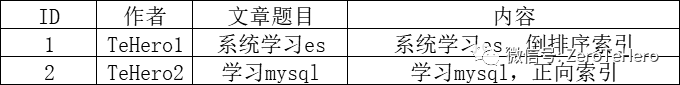
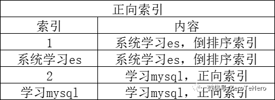
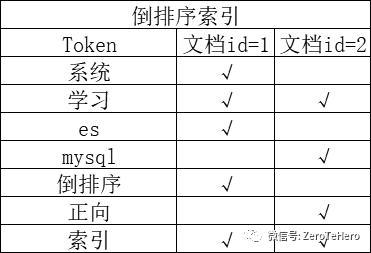
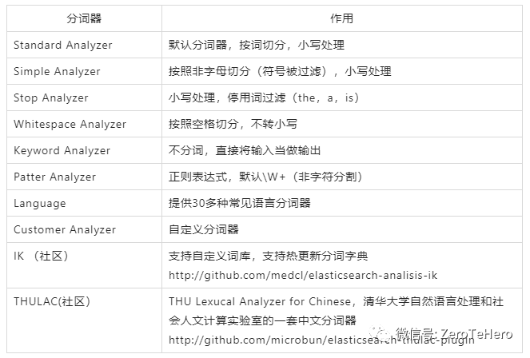

## 一、 倒排索引是什么？

> 倒排索引是 Elasticsearch 中非常**重要的索引结构**，是从**文档单词到文档 ID** 的映射过程

**1.1 通过示例，简单理解下**

>   就拿专栏文章来说，我们平时在各大平台根据关键词检索时，使用到的技术就有“倒排序索引”。



数据结构

假设我们的文章的储存结果如上，对于关系型数据库mysql来说，**普通的索引结构就是“id->题目->内容”，**在我们搜索的时候，如果我们知道id或者题目**，那么检索效率是很高效的，因为“id”、“题目”是很方便创建索引的。**



正向索引

但是当我们只有一个检索关键词，比如需求是**搜索到与“倒排序索引”相关的文章**时，在索引结构是“id->题目->内容”时，就只能对“题目”和“内容”进行**全文扫描了，当数量级上去后，效率是没办法接受的！**对于这类的搜索，关系型数据库的索引就很难应付了，**适合使用全文搜索的倒排索引。**

那么**倒排序索引**的结构是怎样的呢？简单来讲**就是“以内容的关键词”建立索引，**映射关系为**“内容的关键词->ID”。**这样的话，我们只需要在“关键词”中进行检索，效率肯定更快。



倒排序索引

**1.2 核心组成**

- 倒排序索引包含两个部分：

- **》单词词典：**记录所有文档单词，记录单词到倒排列表的关联关系

- 》**倒排列表：**记录单词与对应文档结合，由倒排索引项组成

- 倒排索引项：

- 》**文档**

- 》**词频 TF** - 单词在文档中出现的次数，用于相关性评分

- 》**位置（Position）-** 单词在文档中分词的位置，用于phrase query

- 》**偏移（Offset）**- 记录单词开始结束的位置，实现高亮显示

  

  

  

- 》**偏移（Offset）**- 记录单词开始结束的位置，实现高亮显示


> 举个简单例子，理解下“倒排索引项”：以 Token“学习”为例：


倒排序索引项List

# 二、倒排索引是怎么工作的？

> 主要包括2个过程：1、创建倒排索引；2、倒排索引搜索

**2.1 创建倒排索引**

> 还是使用上面的例子。先对**文档的内容**进行分词，形成一个个的 **token**，也就是 **单词**，然后保存这些 token 与文档的对应关系。结果如下：


**2.2 倒排索引搜索**

> 搜索示例1：“学习索引”

- 先分词，得到两个Token：“学习”、“索引”
- 然后去倒排索引中进行匹配

这2个Token在2个文档中都匹配，所以2个文档都会返回，而且分数相同。

> 搜索示例2：“学习es”

同样，2个文档都匹配，都会返回。但是**文档1的相关性评分会高于文档2，**因为文档1匹配了两个Token，而文档2只匹配了一个Token【学习】。

> 通过上面的讲解，我们学习了解了：**倒排序索引是什么及其工作流程**。其中有一个非常重要的环节——**对文档进行分词**，得到Token。**那么这个分词过程，是怎样进行的呢？**


# 三、Analysis 进行分词

> Analysis：即文本分析，是把**全文本转化为一系列单词（term/token）的过程**，也叫分词；在Elasticsearch 中可通**过内置分词器实现分词，也可以按需定制分词器**。

**3.1 Analyzer 由三部分组成**

> • Character Filters：原始文本处理，如去除 html • Tokenizer：按照规则切分为单词 • Token Filters：对切分单词加工、小写、删除 stopwords，增加同义词

**3.2 Analyzer 分词过程简介**

- **1）字符过滤器  character filter**

首先，字符串按顺序通过每个字符过滤器 。他们的任务是在分词前整理字符串。一个字符过滤器可以用来去掉HTML，或者将 & 转化成 and。

- **2）分词器 tokenizer**

其次，字符串被 分词器 分为单个的词条。一个 whitespace的分词器遇到空格和标点的时候，可能会将文本拆分成词条。



- **3）令牌过滤器token filter**

最后，词条按顺序通过每个 token 过滤器 。这个过程可能会改变词条，例如，lowercase token filter  小写化（将ES转为es）、stop token filter 删除词条（例如， 像 a， and， the 等无用词），或者synonym token filter 增加词条（例如，像 jump 和 leap 这种同义词）。


**3.3 自定义分析器**

```json
#1、定义名为“custom_analyzer”的自定义分析器：大写转为小写
PUT tehero_index
{
  "settings": {
    "analysis": {
      "analyzer": {
        "custom_analyzer": {
          "type": "custom",
          "tokenizer": "standard",
          "filter": [
            "lowercase"
          ]
        }
      }
    }
  },
# 2、该字段my_text使用custom_analyzer分析器
  "mappings": {
    "_doc": {
      "properties": {
        "my_text": {
          "type": "text",
          "analyzer": "custom_analyzer"
        }
      }
    }
  }
}
```

**3.4 测试分词**

```json
# 要引用此分析器，analyzeAPI必须指定索引名称。
# 直接使用分析器
GET tehero_index/_analyze 
{
  "analyzer": "custom_analyzer",
  "text":"关注TeHero，系统学习ES"
}
# 通过字段使用
GET tehero_index/_analyze
{
  "field": "my_text",
  "text": "关注TeHero，系统学习ES"
}

```

效果：

```json
{
  "tokens": [
    {
      "token": "关",
      "start_offset": 0,
      "end_offset": 1,
      "type": "<IDEOGRAPHIC>",
      "position": 0
    },
    {
      "token": "注",
      "start_offset": 1,
      "end_offset": 2,
      "type": "<IDEOGRAPHIC>",
      "position": 1
    },
    {
      "token": "tehero",
      "start_offset": 2,
      "end_offset": 8,
      "type": "<ALPHANUM>",
      "position": 2
    }
…………
]
```

也可以直接使用analyzer

```json
POST _analyze
{
  "analyzer": "whitespace",
  "text": "关注TeHero 系统学习ES"
}
# 也可直接设置tokenizer和filter

POST _analyze
{
  "tokenizer": "standard",
  "filter": [
    "lowercase"
  ],
  "text": "关注TeHero 系统学习ES"
}
```

效果：

```json
{
  "tokens": [
    {
      "token": "关注TeHero",
      "start_offset": 0,
      "end_offset": 8,
      "type": "word",
      "position": 0
    },
    {
      "token": "系统学习ES",
      "start_offset": 9,
      "end_offset": 15,
      "type": "word",
      "position": 1
    }
  ]
}
```

从analyzeAPI 的输出可以看出，分析器不仅将搜索词转换为Token，而且还记录 每个Token的顺序或相对位置（用于短语查询或单词接近性查询），以及每个Token的开始和结束字符偏移量原始文字中的字词（用于突出显示搜索摘要）。


# 四、ik 分词

> 官网简介：The IK Analysis plugin integrates Lucene IK analyzer (http://code.google.com/p/ik-analyzer/) into elasticsearch, support customized dictionary.

> Analyzer: ik_smart , ik_max_word , Tokenizer: ik_smart , ik_max_word 

**1.1 ik_max_word：细颗粒度分词**

> **ik_max_word: 会将文本做最细粒度的拆分**，比如会将“关注我系统学习ES”拆分为“关注，我，系统学，系统，学习，es”，**会穷尽各种可能的组合**，**适合 Term Query**；

```json
# 测试分词效果
GET /_analyze
{
  "text": ["关注我系统学习ES"],
  "analyzer": "ik_max_word"
}
# 效果
{
  "tokens": [
    {
      "token": "关注",
      "start_offset": 0,
      "end_offset": 2,
      "type": "CN_WORD",
      "position": 0
    },
    {
      "token": "我",
      "start_offset": 2,
      "end_offset": 3,
      "type": "CN_CHAR",
      "position": 1
    },
    {
      "token": "系统学",
      "start_offset": 3,
      "end_offset": 6,
      "type": "CN_WORD",
      "position": 2
    },
    {
      "token": "系统",
      "start_offset": 3,
      "end_offset": 5,
      "type": "CN_WORD",
      "position": 3
    },
    {
      "token": "学习",
      "start_offset": 5,
      "end_offset": 7,
      "type": "CN_WORD",
      "position": 4
    },
    {
      "token": "es",
      "start_offset": 7,
      "end_offset": 9,
      "type": "ENGLISH",
      "position": 5
    }
  ]
}
```

**1.2 ik_smart：粗颗粒度分词**

> **ik_smart: 会做最粗粒度的拆分**，比如会将“关注我系统学习ES”拆分为“关注，我，系统，学习，es”，**适合 Phrase 查询。**

```json
# 测试分词效果
GET /_analyze
{
  "text": ["关注我系统学习ES"],
  "analyzer": "ik_smart"
}
# 分词效果
{
  "tokens": [
    {
      "token": "关注",
      "start_offset": 0,
      "end_offset": 2,
      "type": "CN_WORD",
      "position": 0
    },
    {
      "token": "我",
      "start_offset": 2,
      "end_offset": 3,
      "type": "CN_CHAR",
      "position": 1
    },
    {
      "token": "系统",
      "start_offset": 3,
      "end_offset": 5,
      "type": "CN_WORD",
      "position": 2
    },
    {
      "token": "学习",
      "start_offset": 5,
      "end_offset": 7,
      "type": "CN_WORD",
      "position": 3
    },
    {
      "token": "es",
      "start_offset": 7,
      "end_offset": 9,
      "type": "ENGLISH",
      "position": 4
    }
  ]
}
```

> 建议：一般情况下，为了提高搜索的效果，**需要这两种分词器配合使用**。既**建索引时用 ik_max_word 尽可能多的分词**，而**搜索时用 ik_smart 尽可能提高匹配准度**，让用户的搜索尽可能的准确。比如一个常见的场景，**就是搜索"进口红酒"的时候，尽可能的不要出现口红相关商品或者让口红不要排在前面。**

> 在简单学习了解了Ik分词后，我们就可以去学习es的全文查询了。