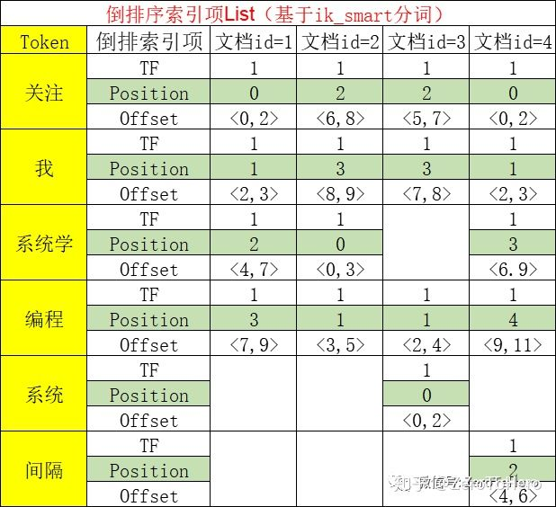

# 一、数据准备

## **1.1 创建index**

```json
PUT /tehero_index
{
  "settings": {
    "index": {
      "number_of_shards": 1,
      "number_of_replicas": 1
    }
  },
  "mappings": {
    "_doc": {
      "dynamic": false,
      "properties": {
        "id": {
          "type": "integer"
        },
        "content": {
          "type": "keyword",
          "fields": {
            "ik_max_analyzer": {
              "type": "text",
              "analyzer": "ik_max_word",
              "search_analyzer": "ik_max_word"
            },
            "ik_smart_analyzer": {
              "type": "text",
              "analyzer": "ik_smart"
            }
          }
        },
        "name": {
          "type": "text"
        },
        "createAt": {
          "type": "date"
        }
      }
    }
  }
}
```

简单解释下，content字段的映射：【就是**一个字段配置多个分词器**】

> 相比粗暴的用不同的字段去实现配置不同的分词器而言，**一个字段配置多个分词器**在数据的存储和操作上方便许多，**只用储存一个字段，即可得到不同的分词效果。**

## 1.2 批量导入数据

```json
POST _bulk
{ "index" : { "_index" : "tehero_index", "_type" : "_doc", "_id" : "1" } }
{ "id" : 1,"content":"关注我,系统学编程" }
{ "index" : { "_index" : "tehero_index", "_type" : "_doc", "_id" : "2" } }
{ "id" : 2,"content":"系统学编程,关注我" }
{ "index" : { "_index" : "tehero_index", "_type" : "_doc", "_id" : "3" } }
{ "id" : 3,"content":"系统编程,关注我" }
{ "index" : { "_index" : "tehero_index", "_type" : "_doc", "_id" : "4" } }
{ "id" : 4,"content":"关注我,间隔系统学编程" }
```

## 1.3 建立倒排索引

在插入数据的时候，ES会对插入的数据进行分词和建立倒排索引，下图是刚才插入数据对应的倒排索引项。

原始数据：

```json
{ "id" : 1,"content":"关注我,系统学编程" }
{ "id" : 2,"content":"系统学编程,关注我" }
{ "id" : 3,"content":"系统编程,关注我" }
{ "id" : 4,"content":"关注我,间隔系统学编程" }
```

根据ik_smart分词和content字段建立倒排序索引:




# 二、match 查询

**match query**：用于执行全文查询的标准查询，包括模糊匹配和短语或接近查询，输入的关键词会被分词。

## 2.1 使用 content 的默认字段检索

```json
GET /tehero_index/_doc/_search
{
  "query":{
    "match":{
      "content":"系统学"
    }
  }
}
// 发现查询不到结果
```

由于content**是keyword类型，是不会分词的，**所以检索词需要和内容完全一样，这也是下面这条语句可以查到结果的原因。

```json
GET /tehero_index/_doc/_search
{
  "query":{
    "match":{
      "content":"关注我,系统学编程"
    }
  }
}
// 可以查询到id = 1 的文档
```


## 2.2 使用 content.ik_smart_analyzer 字段检索

```json
GET /tehero_index/_doc/_search
{
  "query": {
    "match": {
      "content.ik_smart_analyzer": "系统编程"
    }
  }
}
```

DSL执行步骤分析：

- 1）检索词“系统编程”被ik_smart分词器分词为**两个Token【系统】【编程】；**
- 2）将这两个Token在【倒排索引】中，针对Token字段进行检索
- 3）对照图【数据的倒排序索引】，可见，**该DSL能检索到所有文档，文档3的评分最高（因为它包含两个Token），其他3个文档只包含了一个Token，但文档一和文档二的分数一样，文档4的分数最低，这是因为ES还会计算Token占内容的比重，文档一和文档二的内容长度一样，文档四的内容最长，因此分数最低。**


## 2.3 使用 content.ik_max_analyzer 字段检索

```json
# 1、会检索出所有结果
GET /tehero_index/_doc/_search
{
  "query":{
    "match":{
      "content.ik_max_analyzer":"系统学"
    }
  }
}
# 2、改变检索分词器为ik_smart,只能检索到 文档1、文档2和文档4
GET /tehero_index/_doc/_search
{
  "query":{
    "match":{
     "content.ik_max_analyzer" : {
                "query" : "系统学",
                "analyzer": "ik_smart"
            }
    }
  }
}
```

分析：

【语句1】能查询到所有文档，因为**检索词根据ik_max_word分词，得到Token（系统、系统学）**

【语句2】的检索词**根据ik_smart分词，只能得到Toke（系统学），不能匹配上文档3。**

可以自己执行以下的分词测试语句，查看分词效果：

```json
GET /_analyze
{
  "text": ["系统学"],
  "analyzer": "ik_smart"
}

```

```json
GET /_analyze
{
  "text": ["系统学"],
  "analyzer": "ik_max_word"
}
```


## 2.4 match核心参数：**operator **

**控制Token之间的逻辑关系，or/and**

```
# 1、不配置，使用默认值or，得到文档1和文档2
GET /tehero_index/_doc/_search
{
  "query": {
    "match": {
      "content.ik_smart_analyzer": {
        "query": "系统学es"
      }
    }
  }
}
# 2、and，查询不到结果
GET /tehero_index/_doc/_search
{
  "query": {
    "match": {
      "content.ik_smart_analyzer": {
        "query": "系统学es",
        "operator":"and"
      }
    }
  }
}
```

分析：检索词“系统学es”被**分词为【系统学、es】两个Token**，

【语句1】的operator**默认值为or**，所以文档1和2可以被检索到；

【语句2】的operator的值是and，也就是需要**同时包含【系统学、es】这两个Token才行**，所以没有结果。

## 2.5 match核心参数：**zero_terms_query**

**停顿词检索**

```json
POST _analyze
{
  "analyzer": "stop",
  "text": "to be or not to be"
}
```

那么就像 这种 字段中的 to be or not to be 这个短语中**全部都是\**停顿词\****，一过滤，就什么也没有了,得不到任何 tokens, **那搜索时什么都搜不到。**

zero_terms_query 就是为了解决这个问题而生的。它的**默认值是 none ,就是搜不到停止词**（对 stop 分析器字段而言）,如果**设置成 all** ，它的效果就和 match_all 类似，**就可以搜到了。**

## 2.6 match核心参数：**lenient**

**忽略数据类型转换异常**

由于 id是integer类型，在将字符串“系统学”转为Integer时会报错，类型转换异常

```json
GET /tehero_index/_doc/_search
{
  "query": {
    "match": {
      "id": {
        "query": "系统学"
      }
    }
  }
}
```

加上参数则不报错，语句正常执行，相当于捕获处理了异常

```json
GET /tehero_index/_doc/_search
{
  "query": {
    "match": {
      "id": {
        "query": "系统学",
        "lenient": "true"
      }
    }
  }
}
```

将字符串“2”转为Integer时则不会报错，因此可以正常查询

```json
GET /tehero_index/_doc/_search
{
  "query": {
    "match": {
      "id": {
        "query": "2"
      }
    }
  }
}
```

## 


> 

# 三、match_phrase 查询

## 3.1 match_phrase 

由于 match 查询在分词查询可能出返回我们不想要的内容，比如“进口红酒”这个词，我们更想查询的是红酒，但是分词器可能会把“口红”返回回来。因此出现了 match_phrase 查询，可以理解为短语查询。

**match_phrase 会对检索关键词分词。match_phrase的分词结果必须在被检索字段的分词中全部包含**，而且**顺序必须相同，**而且**默认必须都是连续的。**

这里对比 **match** 查询和 **match_phrase** 的区别：

**使用 match 查询：**

```json
# 使用match查询，ik_smart分词 
GET /tehero_index/_doc/_search
{
    "query": {
        "match": {
            "content.ik_smart_analyzer": {
            	"query": "关注我,系统学"
            }
        }
    }
}
# 可以查询出所有结果
```

**使用 match_phrase 查询：**

```json
# 使用match_phrase查询，ik_smart分词
GET /tehero_index/_doc/_search
{
    "query": {
        "match_phrase": {
            "content.ik_smart_analyzer": {
            	"query": "关注我,系统学"
            }
        }
    }
}

# 结果：只有文档1
{
  "took": 1,
  "timed_out": false,
  "_shards": {
    "total": 1,
    "successful": 1,
    "skipped": 0,
    "failed": 0
  },
  "hits": {
    "total": 1,
    "max_score": 0.7370664,
    "hits": [
      {
        "_index": "tehero_index",
        "_type": "_doc",
        "_id": "1",
        "_score": 0.7370664,
        "_source": {
          "id": 1,
          "content": "关注我,系统学编程"
        }
      }
    ]
  }
}
```

```json
GET tehero_index/_analyze
{
  "text": ["关注我,系统学"],
  "analyzer": "ik_smart"
}

# 分词结果
{
  "tokens" : [
    {
      "token" : "关注",
      "start_offset" : 0,
      "end_offset" : 2,
      "type" : "CN_WORD",
      "position" : 0
    },
    {
      "token" : "我",
      "start_offset" : 2,
      "end_offset" : 3,
      "type" : "CN_CHAR",
      "position" : 1
    },
    {
      "token" : "系统学",
      "start_offset" : 4,
      "end_offset" : 7,
      "type" : "CN_WORD",
      "position" : 2
    }
  ]
}

```

再次参考一下smart的倒排索引图：


可以看出文档1、2、4都包含了分词后都Token【“关注”，“我”，“系统学”】，但Token的顺序和检索词一致的只有文档1。

文档2 Token顺序不一致；文档4 Token不连续；文档3 Token没有完全包含


## 3.2 match_phrase 核心参数：slop 

**slop：Token之间的位置距离容差值**

match_phrase的匹配要求太严格了，通过slop可以适当的降低要求。

```json
# 将上面的 match_phrase 查询新增一个 slop参数
GET /tehero_index/_doc/_search
{
    "query": {
        "match_phrase": {
            "content.ik_smart_analyzer": {
            	"query": "关注我,系统学",
            	"slop":1
            }
        }
    }
}
# 结果：文档1和文档4都被检索出来
```

> **分析：使用 analyze 接口 分析下文档4的Token**

```json
# 文档4 content 的分词
GET /_analyze
{
  "text": ["关注我,间隔系统学编程"],
  "analyzer": "ik_smart"
}
# 分词结果
{
  "tokens": [
    {
      "token": "关注",
      "start_offset": 0,
      "end_offset": 2,
      "type": "CN_WORD",
      "position": 0
    },
    {
      "token": "我",
      "start_offset": 2,
      "end_offset": 3,
      "type": "CN_CHAR",
      "position": 1
    },
    {
      "token": "间隔",
      "start_offset": 4,
      "end_offset": 6,
      "type": "CN_WORD",
      "position": 2
    },
    {
      "token": "系统学",
      "start_offset": 6,
      "end_offset": 9,
      "type": "CN_WORD",
      "position": 3
    },
    {
      "token": "编程",
      "start_offset": 9,
      "end_offset": 11,
      "type": "CN_WORD",
      "position": 4
    }
  ]
}
```

通过分词测试，发现Token【我】与【系统学】的**position差值为1(**等于slop的值**)**，**所以文档4也被检索出来了。**

# 四、match_phrase_prefix 查询

与match_phrase查询类似，但是**会对最后一个Token在倒排序索引列表中进行通配符搜索**。Token的模糊匹配数控制：**max_expansions 默认值为50。**

我们使用**content.ik_smart_analyzer** 这个字段中的**【系统学】**（文档1、2、4 包含）和**【系统】**（文档3包含）这**两个Token**来讲解match_phraseprefix 的用法：（因为**使用的是ik_smart分词器**，所以【系统学】就只能被分词为一个Token）

```json
# 1、先使用match_phrase查询，没有结果
GET tehero_index/_doc/_search
{
  "query": {
    "match_phrase": {
      "content.ik_smart_analyzer": {
        "query": "系"
      }
    }
  }
}

# 2、使用match_phrase_prefix查询， "max_expansions": 1，得到文档3
GET tehero_index/_doc/_search
{
  "query": {
    "match_phrase_prefix": {
      "content.ik_smart_analyzer": {
        "query": "系",
        "max_expansions": 1
      }
    }
  }
}

# 3、使用match_phrase_prefix查询， "max_expansions": 2，得到所有文档
GET tehero_index/_doc/_search
{
  "query": {
    "match_phrase_prefix": {
      "content.ik_smart_analyzer": {
        "query": "系",
        "max_expansions": 2
      }
    }
  }
}
```

结果分析：

【语句1】查不到结果，是因为**根据ik_smart分词器生成的倒排序索引中**，所有文档中都**不包含Token【系】**；

【语句2】查询到文档3，是因为**文档3包含Token【系统】，同时** "max_expansions": 1，所以**检索关键词【系】+ 1个通配符匹配**，就可以匹配到**一个Token**【系统】；

【语句3】查询到所有文档，是因为"max_expansions": 2，所以**检索关键词【系】+ 2个通配符匹配**，就可以匹配到**两个Token**【系统、系统学】，所以就可以查询到所有。

回忆下，之前所讲的es倒排序索引原理：**先分词创建倒排序索引，再检索倒排序索引得到文档**，就很好理解了**。**

注意："max_expansions"的**值最小为1**，**哪怕你设置为0，依然会 + 1个通配符匹配；所以，**尽量不要用该语句，因为，**最后一个Token始终要去扫描大量的索引**，**性能可能会很差。**


**match_phrase_prefix query 对应到mysql**

```json
GET tehero_index/_doc/_search
{
  "query": {
    "match_phrase_prefix": {
      "content.ik_smart_analyzer": {
        "query": "系",
        "max_expansions": 1
      }
    }
  }
}
```

DSL执行步骤分析：

- 1）检索词“系”被分词为一个**个Token【系】+ 1个通配符；**
- 2）倒排索引检索时，等价于sql：【where Token = 系 or Token **like “系_”**】；
- 3）对照图【数据的倒排序索引】，只有**文档3满足条件包含Token【系统】**，所以该DSL语句只能查询到文档3。

# 五、multi_match 查询

## 5.1 multi_match

match 的多字段版本

```json
# 1、同时查询  "content", "content.ik_smart_analyzer"，得到文档3
GET /tehero_index/_doc/_search
{
  "query": {
    "multi_match": {
      "query": "系统",
      "fields": [
        "content",
        "content.ik_smart_analyzer",
        "content.ik_max_analyzer"
      ]
    }
  }
}
```

```json
# 2、同时查询 所有字段 得到所有文档
GET /tehero_index/_doc/_search
{
  "query": {
    "multi_match": {
      "query": "系统",
      "fields": [
        "content",
        "content.ik_smart_analyzer",
        "content.ik_max_analyzer"
      ]
    }
  }
}
```

需要注意的是，**多个Fields之间的查询关系是 or** 

**multi_match query 对应的sql语句**

```json
GET /tehero_index/_doc/_search
{
  "query": {
    "multi_match": {
      "query": "系统学",
      "fields": [
        "content.ik_smart_analyzer",
        "content.ik_max_analyzer"
      ]
    }
  }
}
```

DSL执行分析：

1. 检索关键词“系统学”，根据**搜索的field对应的分词器，进行不同的分词：** "content.ik_smart_analyzer"字段（简称field1）分词，得到一个Token【系统学】；"content.ik_max_analyzer"字段（简称field2）分词，得到三个Token【系统学，系统，学】。
2. 使用检索词的Token**在对应的field的PostingList中进行检索**，等价于sql语句：【select id from **field1-PostingList** where Token = “系统学”】【select id from **field2-PostingList** where Token in ("系统学"，"系统"，"学")】；
3. 最后再对**检索出来的两个 PostingList 做一个合并操作，得到文档。**

## 5.2 增强权重

**字段^数字：表示增强该字段（权重影响相关性评分）**

相关性评分是一个重点，后面会系统性的讲解。

```json
GET /tehero_index/_doc/_search
{
  "query": {
    "multi_match": {
      "query": "系统",
      "fields": [
        "content",
        "content.ik_smart_analyzer^3",
        "content.ik_max_analyzer"
      ]
    }
  }
}
```

# 六、总结

1. match query：用于执行全文查询的标准查询，包括模糊匹配和短语或接近查询。重要参数：控制Token之间的布尔关系：operator：or/and
2. match_phrase query：与match查询类似，但用于匹配确切的短语或单词接近匹配。重要参数：Token之间的位置距离：slop 参数
3. match_phrase_prefix query：与match_phrase查询类似，但是会对最后一个Token在倒排序索引列表中进行通配符搜索。重要参数：模糊匹配数控制：max_expansions 默认值50，最小值为1
4. multi_match query：match查询 的多字段版本。该查询在实际中使用较多，可以降低DSL语句的复杂性。同时该语句有多个查询类型